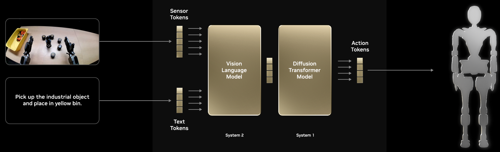
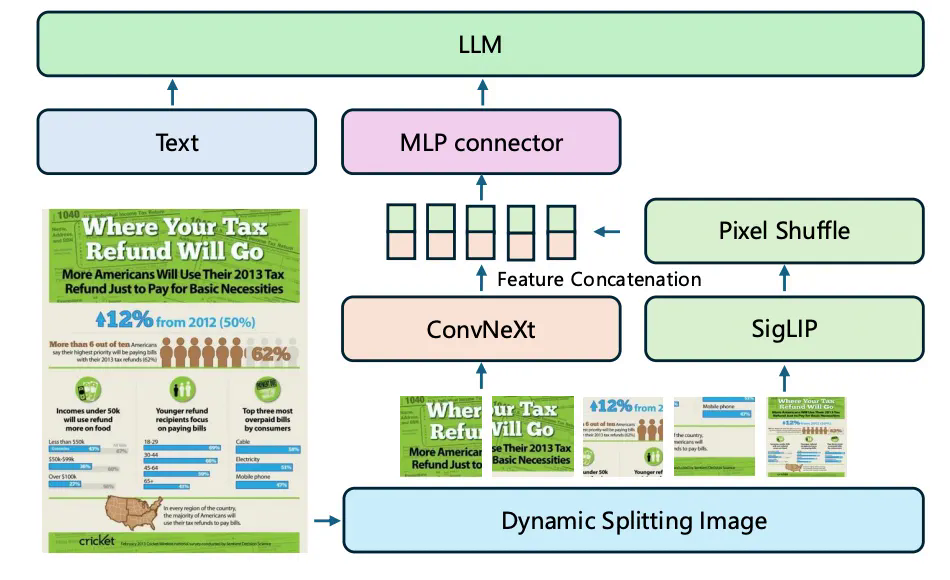
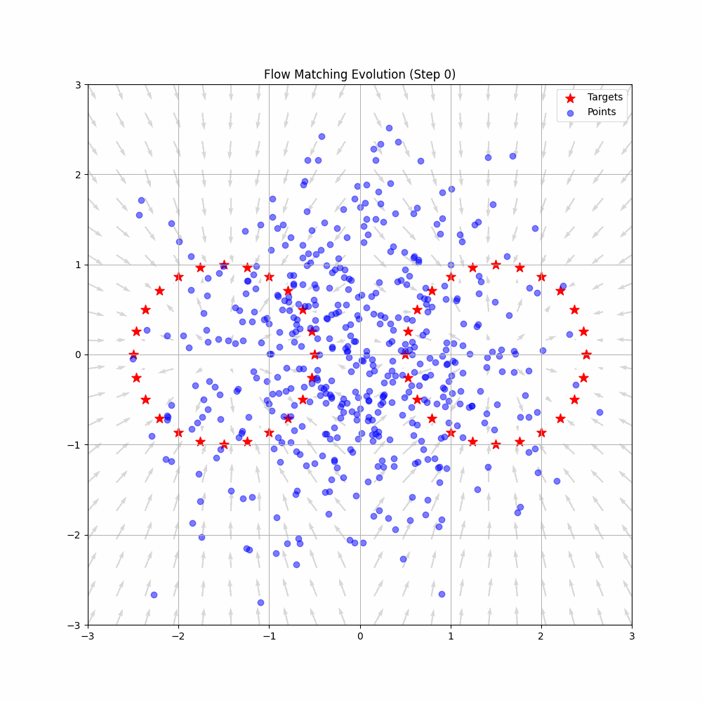
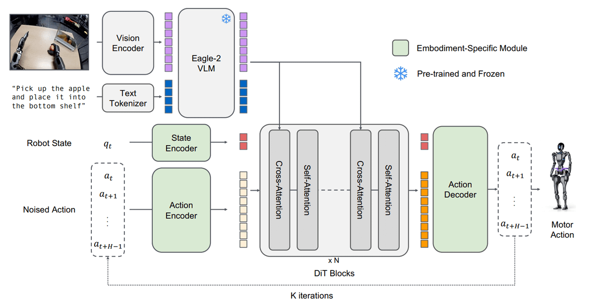
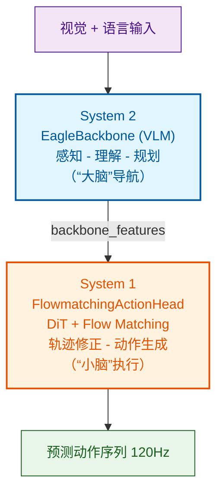

## NVIDIA GR00T N1.5 架构解析：具身智能的“大脑”与“小脑”

## 什么是具身智能？

**具身智能（Embodied AI）** 简单来说，就是让 AI 拥有“身体”。它不再只是屏幕后的聊天机器人，而是能通过物理身体与真实世界交互，学习并执行复杂动作的智能体。这是人工智能从“逻辑理解”迈向“物理世界实战”的关键一步。

---

> 图1：GR00T N1 形机器人在工业场景中协作执行任务的演示，展示具身智能在实际操作中的应用能力
---

## 具身智能的进化史：从“能动”到“会思考”

具身智能的发展，本质上是机器人“大脑”能力不断扩充的过程：

- **2023 年：启蒙期（RT-1 / RT-2）**  
  Google DeepMind 证明了 Transformer 架构也能用于机器人控制。RT-1 是最早将 Transformer 大规模应用于机器人策略学习的工作之一，RT-2 则进一步引入视觉-语言-动作（VLA）模型，实现了“看图说话即可行动”，让机器人开始具备初步的跨模态理解能力。  
  [RT-1 论文](https://arxiv.org/abs/2212.06817) | [RT-2 论文](https://arxiv.org/abs/2307.15818)

- **2024 年：开源潮（OpenVLA / Octo）**  
  社区力量开始介入，OpenVLA 成为首个真正开源的大规模视觉-语言-动作模型，基于 Llama 架构，并证明其在多个机器人平台上具备良好的跨场景泛化能力（即换个环境也能干活）。Octo 则提出了“通用机器人策略模型”的概念，尝试用一套模型控制不同形态（multi-embodiment）的机器人系统。  
  [OpenVLA 项目](https://openvla-oft.github.io/) | [Octo 项目](https://github.com/octo-models/octo)

- **2025 年：系统化阶段（NVIDIA Isaac GR00T N1 系列）**  
  NVIDIA 发布 GR00T N1，并明确提出System 1 + System 2 **双系统策略架构**。这不再只是一个模型结构设计，而是一套完整的认知控制逻辑框架：让机器人具备深思熟虑的规划能力，又拥有接近本能级别的快速执行能力。  
  [GR00T N1 官方页面](https://developer.nvidia.com/isaac/gr00t)

> 从 RT-1/RT-2 的早期探索，到 OpenVLA、Octo 的开源实践，再到 GR00T N1 的系统化设计，具身智能正从“能够行动”逐步迈向“会理解、能规划、可泛化”的新阶段。

---

## GR00T N1.5 的核心：VLA 架构上的双系统策略模型设计

GR00T N1.5 的核心思想建立在**视觉-语言-动作** **（VLA Vision-Language-Action）** 统一策略模型框架之上：

- **Vision（视觉）**：像眼睛一样看清环境结构，通过摄像头理解场景并识别目标物体的位置关系。
- **Language（语言）**：像耳朵一样理解人类指令，例如“把工具放进框子里”。
- **Action（动作）**：像肌肉一样生成连续控制信号，完成抓取、移动或操作任务。

为了平衡“想得深”和“做得快”，GR00T 借鉴认知心理学中的 **System 2（慢速分析思考）** 和 **System 1（快速直觉反应）**，构建双系统策略模型：

| 特性 | System 2（慢速思考 / “大脑”） | System 1（快速思考 / “小脑”） |
|------|-------------------------------|-------------------------------|
| 角色 | 决策与规划中心 | 动作与反应中心 |
| 任务 | 感知环境、拆解任务指令，生成高层规划 | 将高层规划转化为连续可执行动作 |
| 速度 | 相对较慢（重逻辑推理） | 极快（120Hz 实时控制闭环） |
| 类比 | 思考“我要去厨房倒杯水” | 走路时维持平衡、不撞门框的本能 |

> 两者通过清晰接口协作，形成“理解 → 规划 → 执行”的完整控制闭环。

---

> 图2：GR00T N1.5 双系统策略架构示意 — System 2 负责规划与理解（大脑），System 1 负责快速动作生成（小脑），形成认知与动作闭环
---

### 为什么要设计“双系统”？

传统机器人控制方法通常设计一个模型直接完成从传感器输入映射到动作输出。这种端到端方式虽然结构简洁，但在复杂任务中存在三个核心冲突：

- **想得慢 vs. 动得快（实时性冲突）**：理解复杂语言任务需要大规模视觉语言模型（推理延迟较高），而维持机器人平衡通常需要 **100Hz** 次以上控制频率。两者难以在单一模型中同时优化。
- **书本知识 vs. 肌肉记忆（训练数据冲突）**：视觉-语言能力来自互联网规模图文数据，而机器人动作数据依赖真实的物理交互采集，规模小、成本高。如果混合训练，容易导致视觉语言能力被动作学习过程稀释。
- **通用性 vs. 专业性（泛化能力冲突）**：任务规划需要强泛化能力，而动作控制需要针对具体机器人结构进行精细调校。

GR00T N1.5 的双系统架构设计解决了这些冲突：

- **System 2（“大脑”）** 专注于感知与规划，可以使用较大的视觉-语言模型，不必受限于实时性要求；
- **System 1（“小脑”）** 专注于动作生成，通过高频闭环实现对环境的快速响应，同时利用 System 2 提供的高层语义特征，将复杂的规划问题转化为“有指导的动作生成”。

> 这种“慢思考提供方向，快行动负责执行”的分工，本质上是**认识深度 VS. 控制实时性**之间的系统级解耦设计。

## System 2：看懂世界的“鹰眼”——`EagleBackbone`

System 2 的核心模块是 `EagleBackbone`（视觉-语言主干网络），负责理解环境与任务指令，并输出统一语义特征表示。它基于 **Eagle-2** 视觉语言模型构建，结构框图如下所示：

---

> 图3：EagleBackbone 模块结构示意 — 展示视觉-语言特征提取与融合流程，包括动态分块、SigLIP 编码器、Pixel Shuffle、ConvNeXt、MLP Connector，以及 LLM 跨模态交互
---
- **Dynamic Splitting Image**：将输入图像动态分割成多个 tile（分块），以适应不同分辨率和宽高比。无论是桌面上的书本还是书本上的文字，它都能通过动态分块技术看得清。
- **SigLIP**：视觉编码器，用于提取视觉语义特征。
- **Pixel Shuffle**：对视觉 token 进行重排融合，提高空间表达能力。
- **ConvNeXt**：进一步增强视觉结构信息表达能力。
- **MLP Connector**：将视觉特征与语义特征进行融合。
- **Text**：自然语言指令输入，如“请勾画出文章段落主题”，直接送入 LLM 进行语义理解。
- **LLM（Qwen / Llama）**：负责理解语言指令并完成视觉语言跨模态交互推理。

**输出**：`backbone_features`（融合后的视觉-语言特征）和 `backbone_attention_mask`（注意力掩码）。它们构成 System 1 的条件输入。

简单来说，EagleBackbone 的作用就是：将视觉信息、语言指令以及机器人当前的姿态统一编码为高层语义特征，并告诉机器人：

> “当前环境中存在目标物体，根据语言指令需要接近并完成操作任务。”

### 为什么 System 2 选择 Eagle-2？

System 2 采用 **Eagle-2** 视觉语言模型主要基于两个关键原因：

- **动态分块策略**：机器人视觉输入包含远景环境信息与近距离细节信息。Eagle-2 的动态分块机制可以灵活适配不同尺度视觉信息，提高感知效率并减少计算浪费。
- **高效视觉语言融合能力**：SigLIP + MLP Connector 结构能够在保持推理效率的同时实现视觉语言深度融合，这对于实时机器人系统尤为重要。

---

## System 1：动作生成的“肌肉直觉”——`FlowmatchingActionHead`

如果说 System 2 提供的是方向，那么 System 1 才是真正的执行者。`FlowmatchingActionHead` 是 GR00T 动作生成的核心模块，负责将高层语义规划转换为连续控制动作序列。

- **输入**：System 2 输出的 `backbone_features`，以及机器人当前的 `proprioceptive state` 本体感知状态，包括机器人关节角度、速度、结构参数等信息。
- **核心机制**：采用 **Flow Matching** + **Diffusion Transformer（DiT）** 架构。  
  模型从随机初始化的动作轨迹出发，通过预测连续的“速度场（velocity field）”，逐步修正整段未来动作轨迹，使其逼近真实可执行轨迹（通常预测未来 16 步）。
- **输出**：`action_pred ∈ [B, action_horizon, action_dim]`，表示未来连续控制动作序列。

> 它就像机器人的“运动本能”系统，强调速度、稳定性和实时闭环控制能力，对应人类的“快速思考 / 反射”系统。

---

### Flow Matching 的直觉解释：机器人如何“从噪声生成动作”

为了理解 `FlowmatchingActionHead` 的核心思想，我们可以先看下面这张动态示意图：

---

> 图4：Flow Matching 动作生成示意 — 展示从随机轨迹状态（蓝点）逐步通过 velocity field（灰色箭头）收敛到目标动作轨迹分布（红色星号）的连续演化过程
---

这张图动态展示了 **Flow Matching 的基本工作原理**。想象你在一片混沌的沙盘上规划一条路径。图中包含三类元素：

- **蓝色点**：随机初始化轨迹状态（模型的初始状态，即混沌的沙盘）
- **红色星号**：目标轨迹分布（希望生成的结果，即理想的路径）
- **灰色箭头**：模型学习到的“移动方向”（velocity field，即沙盘上每一个点的流动方向）

Flow Matching 的核心思想可以理解为：

> 训练神经网络，让每一个状态知道“下一步应该朝哪个方向移动”。

随着训练进行，这些箭头逐渐形成稳定结构，使随机轨迹逐步收敛到目标轨迹分布。Flow Matching 并不是直接预测最终动作结果，而是学习一条**随机轨迹到目标轨迹**的连续演化路径。在 GR00T 中，这条路径对应的并不是单独一步的动作，而是一整段未来动作轨迹随时间逐步收敛的过程。

---

### 为什么 System 1 采用 Flow Matching？

`FlowmatchingActionHead` 选择了 **Flow Matching** + DiT 主要基于三个优势：

- **更平滑（轨迹稳定性更高）**：相比传统扩散策略模型，Flow Matching 训练更稳定，生成轨迹更加连续，可以有效避免传统策略模型中的高频抖动（jitter）问题。
- **更高效（推理计算成本更低）**：Flow Matching 通常只需 4-8 步迭代即可生成高质量动作序列，相比传统扩散模型常见的数十步采样过程，更适合实时控制闭环场景。
- **更强表达能力（支持多模态轨迹）**：同一高层任务可能对应多条合理动作轨迹（如手臂抓取路径或速度略有不同）。Flow Matching 能够建模这些多种可能性，并稳定生成最合理的动作轨迹序列。

---

## 双系统如何“合体”？

在 `GR00T_N1_5.get_action()` 方法中，两个系统形成完整协作闭环：

1. **大脑导航（System 2）**：`EagleBackbone` 处理视觉输入与语言指令，观察环境、理解任务，生成高层语义表示，输出特征 `backbone_features` 作为动作生成条件信息。
2. **本能执行（System 1）**：`FlowmatchingActionHead` 接收语义特征与机器人本体感知状态，通过 DiT 模型快速生成连续控制动作。
3. **高频闭环控制（120 Hz）**：System 1 持续输出控制序列，即使环境发生扰动：路面变化、外力干扰、目标位置变化，机器人仍可实时修正动作，实现稳定控制。

> 这种“慢思考提供方向，快行动负责执行”的分工，既保证了认知深度，又满足了机器人对实时性的严苛要求。

---

> 图5：System 1 与 System 2 协作闭环示意 — System 2 输出高层语义特征作为策略指导，System 1 快速生成连续动作序列，实现 120Hz 高频控制闭环
---

#### 结构框图

---

## **总结**

GR00T N1.5 的架构标志着机器人正在告别“提线木偶”时代。通过**“理解 -> 规划 -> 执行”**三阶段解耦设计，NVIDIA 在系统层面实现了认识深度与控制实时性的统一。

其中：`EagleBackbone` 负责深度理解世界，`FlowmatchingActionHead` 负责实时生成动作。这种设计使 GR00T 不再只是一个机器人控制模型，而更接近一个可扩展的具身智能基础模型架构范式。

> 当机器人开始像人类一样完成：理解 -> 规划 -> 执行的完整闭环，它们走进工厂、走进家庭的那一天，可能比我们预想的还要近。

