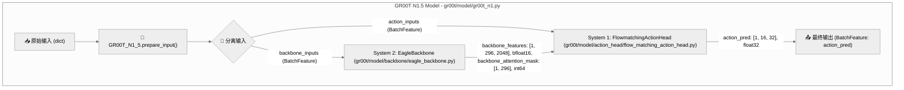
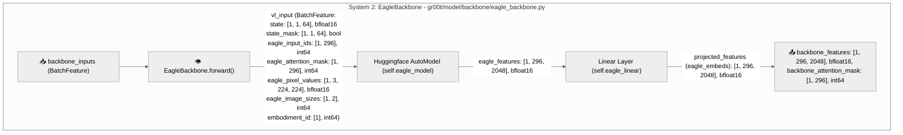

## gr00t n1.5 overview

```mermaid
%%{init: {'theme': 'neutral'}}%%
flowchart TD
    subgraph GR00T_N1_5 [GR00T N1.5 Model - gr00t/model/gr00t_n1.py]
        A["📥 原始输入 (dict)"] --> B["🔧 GR00T_N1_5.prepare_input()"]
        B --> C{"📂 分离输入"}

        C -- backbone_inputs (BatchFeature) --> D["System 2: EagleBackbone (gr00t/model/backbone/eagle_backbone.py)"]
        C -- action_inputs (BatchFeature) --> E["System 1: FlowmatchingActionHead (gr00t/model/action_head/flow_matching_action_head.py)"]

        D -- backbone_features: [1, 296, 2048], bfloat16, backbone_attention_mask: [1, 296], int64 --> E

        E -- action_pred: [1, 16, 32], float32 --> P["📤 最终输出 (BatchFeature: action_pred)"]
    end
```

---

## System 1 FlowMatching ActionHead

```mermaid
%%{init: {'theme': 'neutral'}}%%
flowchart TD
    subgraph System_1 [System 1: FlowmatchingActionHead - gr00t/model/action_head/flow_matching_action_head.py]
        E_input_1["📥 backbone_features: [1, 296, 2048], bfloat16, backbone_attention_mask: [1, 296], int64"] --> E["🤖 FlowmatchingActionHead.get_action()"]
        E_input_2["📥 action_inputs (BatchFeature: state, embodiment_id)"] --> E

        E -- action_input.state: [1, 1, 64], bfloat16, action_input.embodiment_id: [1], int64 --> I["State Encoder (CategorySpecificMLP)"]
        I -- state_features: [1, 1, 1536], bfloat16 --> K["Concat"]

        E -- actions (noisy_trajectory): [1, 16, 32], float32, timesteps_tensor: [1], int64, embodiment_id: [1], int64 --> J["Action Encoder (MultiEmbodimentActionEncoder)"]
        J -- action_features: [1, 16, 1536], bfloat16 --> K

        FT_ENC["Future Token Embedding (self.future_tokens)"]
        FT_ENC -- future_tokens: [1, 32, 1536], bfloat16 (from self.future_tokens.weight) --> K

        K -- sa_embs: [1, 49, 1536], bfloat16 --> L["DiT Model (self.model, cross_attention_dit.py)"]
        L -- model_output: [1, 49, 1024], bfloat16 --> M["Action Decoder (CategorySpecificMLP)"]
        M -- pred: [1, 49, 32], bfloat16 --> N["Update Actions (Euler Integration)"]
        N --> O_output["📤 action_pred: [1, 16, 32], float32"]
    end
```

## system 2 Eagle Backbone

```mermaid
%%{init: {'theme': 'neutral'}}%%
flowchart TD
    subgraph System_2 [System 2: EagleBackbone - gr00t/model/backbone/eagle_backbone.py]
        D_input["📥 backbone_inputs (BatchFeature)"] --> D["👁️ EagleBackbone.forward()"]
        D -- vl_input (BatchFeature:<br/>state: [1, 1, 64], bfloat16<br/>state_mask: [1, 1, 64], bool<br/>eagle_input_ids: [1, 296], int64<br/>eagle_attention_mask: [1, 296], int64<br/>eagle_pixel_values: [1, 3, 224, 224], bfloat16<br/>eagle_image_sizes: [1, 2], int64<br/>embodiment_id: [1], int64) --> F["Huggingface AutoModel (self.eagle_model)"]
        F -- eagle_features: [1, 296, 2048], bfloat16 --> G["Linear Layer (self.eagle_linear)"]
        G -- projected_features (eagle_embeds): [1, 296, 2048], bfloat16 --> H_output["📤 backbone_features: [1, 296, 2048], bfloat16, backbone_attention_mask: [1, 296], int64"]
    end


```