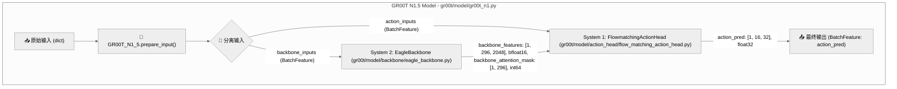
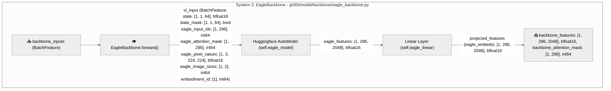

# GR00T 模型数据流备忘录

本备忘录旨在详细梳理 Isaac-GR00T 模型的内部数据流，特别是其 "System 1 / System 2" 架构中 `EagleBackbone` (System 2) 和 `FlowmatchingActionHead` (System 1) 两个核心模块的交互与各自内部的数据处理。


## 1. GROOT 模型输入数据分析

GR00T 模型的数据输入是多模态的，主要包括机器人状态、视觉观测、语言指令以及一些元数据。这些数据在 `demo_data` 目录下以不同的文件格式组织，并在模型推理过程中被加载和处理，最终形成 `BatchFeature` 类型的输入供模型使用。

`demo_data` 目录的典型结构如下：

```
demo_data/
└── robot_sim.PickNPlace/
    ├── data/
    │   └── <episode_id>.parquet  # 机器人状态和动作轨迹数据
    ├── meta/
    │   ├── episode_meta.jsonl    # 每个 episode 的元数据
    │   ├── info.json             # 数据集全局信息
    │   ├── language_instructs.jsonl # 语言指令数据
    │   ├── stats.json            # 状态和动作的归一化统计数据
    │   └── transforms.json       # 数据转换配置
    └── videos/
        └── <episode_id>.mp4      # 视频观测数据
```

以下是这些文件及其内容如何构成 GR00T 模型的输入：

### 1.1. **核心输入数据**

GR00T 模型在 `GR00T_N1_5.prepare_input()` 阶段会将原始输入（通常是字典形式）处理成 `BatchFeature`，然后拆分为 `backbone_inputs` 和 `action_inputs`。

#### a. `videos/<episode_id>.mp4` (视觉观测)

  
_图 1: 机器人视觉观测图像_


| 类别       | 文件路径/名称             | 内容                                       | 如何成为模型输入                                                                                                    |
| :--------- | :------------------------ | :----------------------------------------- | :------------------------------------------------------------------------------------------------------------------ |
| **视觉输入** | `videos/<episode_id>.mp4` | 包含机器人执行任务时的视频帧。             | 视频帧会被解码并预处理 (缩放、归一化)，最终作为 `backbone_inputs` 中 `vl_input` 的 `eagle_pixel_values` (shape: `[B, C, H, W]`, dtype: `bfloat16`)。 |

---

#### b. `data/<episode_id>.parquet` (状态和动作轨迹)

| 类别           | 文件路径/名称              | 内容                                                       | 如何成为模型输入                                                                                                                                                                                                                              |
| :------------- | :------------------------- | :--------------------------------------------------------- | :---------------------------------------------------------------------------------------------------------------------------------------------------------------------------------------------------------------------------------------- |
| **机器人状态** | `data/<episode_id>.parquet` | 存储了每个 episode 机器人详细的状态信息 (如关节位置、速度、力) 和动作轨迹。Parquet 是一种列式存储格式。 | - **`backbone_inputs`**: `vl_input` 中的 `state` (shape: `[B, 1, 64]`, dtype: `bfloat16`) 和 `state_mask` (shape: `[B, 1, 64]`, dtype: `bool`) 来源于此，用于提供当前环境的上下文信息。<br>- **`action_inputs`**: `action_input` 中的 `state` (shape: `[B, 1, 64]`, dtype: `bfloat16`) 同样来源于此，作为生成动作轨迹的条件。 |

---
### 1.2. **辅助元数据和配置**

#### c. `meta/language_instructs.jsonl` (语言指令)

| 类别           | 文件路径/名称                      | 内容                                       | 如何成为模型输入                                                                                                                                                                                                            |
| :------------- | :--------------------------------- | :----------------------------------------- | :-------------------------------------------------------------------------------------------------------------------------------------------------------------------------------------------------------------------------- |
| **语言输入** | `meta/language_instructs.jsonl` | 包含与每个 episode 相关的自然语言指令，描述机器人需要完成的任务。 | 语言指令会被 token 化并编码为 `backbone_inputs` 中 `vl_input` 的 `eagle_input_ids` (shape: `[B, S]`, dtype: `int64`) 和 `eagle_attention_mask` (shape: `[B, S]`, dtype: `int64`)，供 EagleBackbone 进行视觉-语言联合理解。 |

---

#### d. `meta/episode_meta.jsonl` (Episode 元数据)

| 类别       | 文件路径/名称                 | 内容                                                         | 如何成为模型输入                                                                                                                                       |
| :--------- | :---------------------------- | :----------------------------------------------------------- | :----------------------------------------------------------------------------------------------------------------------------------------------------- |
| **元数据** | `meta/episode_meta.jsonl` | 提供每个 episode 的额外元数据，例如任务 ID、机器人类型、动作序列的起始/结束帧等。 | `backbone_inputs` 和 `action_inputs` 中的 `embodiment_id` (shape: `[B]`, dtype: `int64`) 通常来源于此，用于区分不同的机器人平台或配置，以便模型进行条件生成。 |

---

#### e. `meta/stats.json` (归一化统计)

| 类别           | 文件路径/名称         | 内容                                                     | 如何使用                                                                                                                                                                                                                                     |
| :------------- | :-------------------- | :------------------------------------------------------- | :------------------------------------------------------------------------------------------------------------------------------------------------------------------------------------------------------------------------------------------- |
| **配置/统计** | `meta/stats.json` | 包含机器人状态和动作数据的均值 (mean) 和标准差 (std) 等统计信息。 | 在模型推理之前，原始的机器人状态和动作数据会根据此文件进行**归一化 (Normalization)**。模型预测的归一化动作输出，在最终返回前会进行**反归一化 (Denormalization)**，以得到实际可执行的动作值。这对于模型的稳定训练和预测范围至关重要。 |

---

#### f. `meta/info.json` (数据集全局信息)

| 类别           | 文件路径/名称     | 内容                                       | 如何使用                                                         |
| :------------- | :---------------- | :----------------------------------------- | :--------------------------------------------------------------- |
| **配置/信息** | `meta/info.json` | 包含整个数据集的全局配置和信息，例如数据集版本、传感器配置等。 | 通常用于初始化模型或数据加载器，提供一些数据集层面的通用参数，但不是直接的动态输入到模型的前向传播中。 |

---

#### g. `meta/transforms.json` (数据转换配置)

| 类别           | 文件路径/名称           | 内容                                       | 如何使用                                                                                               |
| :------------- | :---------------------- | :----------------------------------------- | :----------------------------------------------------------------------------------------------------- |
| **配置/转换** | `meta/transforms.json` | 包含数据预处理和增强的配置信息，例如图像裁剪、颜色抖动等。 | 在数据加载阶段，根据这些配置对原始数据进行转换，确保数据格式和特性符合模型的要求，但不是直接的模型输入。 |

---


### 1.3. **模型输入构成**

综合来看，GR00T 模型期望的 `BatchFeature` 输入（在 `GR00T_N1_5.get_action()` 方法中，经过 `prepare_input()` 处理后）主要包含以下几类信息，这些信息最终会流向 `EagleBackbone` 和 `FlowmatchingActionHead`：

*   **视觉信息**: 来自 `videos` 目录的图像像素 (`eagle_pixel_values`)。
*   **语言信息**: 来自 `language_instructs.jsonl` 的文本指令 (`eagle_input_ids`, `eagle_attention_mask`)。
*   **机器人状态**: 来自 `data` 目录的 `.parquet` 文件的机器人当前状态 (`state`, `state_mask`)。
*   **元数据**: 来自 `episode_meta.jsonl` 的 `embodiment_id` 和 `eagle_image_sizes` 等。

这些不同来源的数据被整合为一个统一的 `BatchFeature` 结构，然后被模型的两个系统 (`EagleBackbone` 和 `FlowmatchingActionHead`) 协同处理，以实现复杂的机器人控制任务。


## 2. GR00T_N1_5 总体数据流概览

GR00T N1.5 模型 ([gr00t/model/gr00t_n1.py](https://github.com/NVIDIA/Isaac-GR00T/blob/n1.5-release/gr00t/model/gr00t_n1.py)) 作为整体协调器，通过 [`get_action()`](https://github.com/NVIDIA/Isaac-GR00T/blob/n1.5-release/gr00t/model/gr00t_n1.py#L171) 方法接收原始输入，并将其拆分为 `backbone_inputs` 和 `action_inputs` 分别送入 System 2 和 System 1。System 2 的输出 `backbone_features` 和 `backbone_attention_mask` 随后作为 System 1 的输入之一。最终，System 1 生成 `action_pred` 作为模型的动作预测输出。


_图 2: GR00T 双系统数据流_


## 3. System 2: EagleBackbone 详细数据流

`EagleBackbone` ([gr00t/model/backbone/eagle_backbone.py](https://github.com/NVIDIA/Isaac-GR00T/blob/n1.5-release/gr00t/model/backbone/eagle_backbone.py)) 负责多模态感知和特征提取，对应 GR00T 架构中的“慢思考”或“规划”部分。它接收包含状态、图像、文本等信息的 `BatchFeature`，并利用 Hugging Face `AutoModel` 进行处理，最终[输出统一](https://github.com/NVIDIA/Isaac-GR00T/blob/n1.5-release/gr00t/model/backbone/eagle_backbone.py#L131)的 `backbone_features` 和 `backbone_attention_mask`。

*   **输入 (`backbone_inputs`)**: 包含 `state` (机器人状态), `state_mask`, `eagle_input_ids` (文本 token IDs), `eagle_attention_mask` (文本注意力掩码), `eagle_pixel_values` (图像像素), `eagle_image_sizes` (图像尺寸), `embodiment_id` (机器人 ID)。
*   **核心处理**:
    *   `Huggingface AutoModel` (即 [`self.eagle_model`](https://github.com/NVIDIA/Isaac-GR00T/blob/n1.5-release/gr00t/model/backbone/eagle_backbone.py#L51)) 对多模态输入进行特征提取。
    *   `Linear Layer` ([`self.eagle_linear`](https://github.com/NVIDIA/Isaac-GR00T/blob/n1.5-release/gr00t/model/backbone/eagle_backbone.py#L53)) 将 `eagle_features` 投影到目标维度，生成 `projected_features` (即 `eagle_embeds`)。
*   **输出**: `backbone_features` 和 `backbone_attention_mask`，这些将作为 `FlowmatchingActionHead` 的输入。



_图 3: 多模态感知数据流_

## 4. System 1: FlowmatchingActionHead 详细数据流

`FlowmatchingActionHead` ([gr00t/model/action_head/flow_matching_action_head.py]()) 负责基于 System 2 提供的特征和当前状态生成动作轨迹，对应 GR00T 架构中的“快思考”或“动作执行”部分。它通过迭代去噪过程来预测动作序列。

*   **输入**:
    *   来自 `EagleBackbone` 的 `backbone_features` 和 `backbone_attention_mask`。
    *   `action_inputs` (BatchFeature): 包含 `state` (当前机器人状态) 和 `embodiment_id`。
*   **核心处理 ([`get_action()`](https://github.com/NVIDIA/Isaac-GR00T/blob/n1.5-release/gr00t/model/action_head/flow_matching_action_head.py#L350) 方法)**:
    1.  **状态编码 ([`State Encoder`](https://github.com/NVIDIA/Isaac-GR00T/blob/n1.5-release/gr00t/model/action_head/flow_matching_action_head.py#L179))**: `action_input.state` 和 `embodiment_id` 经过 `CategorySpecificMLP` 编码为 `state_features`。
        *   `state_features`: `[1, 1, 1536], bfloat16`
    2.  **动作编码 ([`Action Encoder`](https://github.com/NVIDIA/Isaac-GR00T/blob/n1.5-release/gr00t/model/action_head/action_encoder.py#L185))**: 初始噪声动作 (`actions`), 时间步 (`timesteps_tensor`) 和 `embodiment_id` 经过 `MultiEmbodimentActionEncoder` 编码为 `action_features`。
        *   `action_features`: `[1, 16, 1536], bfloat16`
    3.  **特征拼接 ([`Concat`](https://github.com/NVIDIA/Isaac-GR00T/blob/n1.5-release/gr00t/model/action_head/flow_matching_action_head.py#L391))**: `state_features`、`future_tokens` (嵌入) 和 `action_features` 沿着序列维度拼接成 `sa_embs`。
        *   `sa_embs`: `[1, 49, 1536], bfloat16`
    4.  **DiT 模型 ([`DiT Model`](https://github.com/NVIDIA/Isaac-GR00T/blob/n1.5-release/gr00t/model/action_head/cross_attention_dit.py#L191))**: `sa_embs` 作为 `hidden_states`，`backbone_features` (vl_embs) 作为 `encoder_hidden_states` 输入到 `DiT` 模型，生成 `model_output`。
        *   `model_output`: `[1, 49, 1024], bfloat16`
    5.  **动作解码 ([`Action Decoder`](https://github.com/NVIDIA/Isaac-GR00T/blob/n1.5-release/gr00t/model/action_head/flow_matching_action_head.py#L190))**: `model_output` 和 `embodiment_id` 经过 `CategorySpecificMLP` 解码，生成 `pred` (预测的速度)。
        *   `pred`: `[1, 49, 32], bfloat16`
    6.  **动作更新 ([`Update Actions`](https://github.com/NVIDIA/Isaac-GR00T/blob/n1.5-release/gr00t/model/action_head/flow_matching_action_head.py#L401))**: 预测的速度 (`pred_velocity`) 用于通过 Euler 积分迭代更新 `actions`。
*   **输出**: 经过多步去噪迭代后的 `action_pred`，代表最终预测的动作序列。

```mermaid
%%{init: {'theme': 'neutral'}}%%
flowchart TD
    subgraph System_1 [System 1: FlowmatchingActionHead - gr00t/model/action_head/flow_matching_action_head.py]
        E_input_1["📥 backbone_features: [1, 296, 2048], bfloat16, backbone_attention_mask: [1, 296], int64"] --> E["🤖 FlowmatchingActionHead.get_action()"]
        E_input_2["📥 action_inputs (BatchFeature: state, embodiment_id)"] --> E

        E -- action_input.state: [1, 1, 64], bfloat16, action_input.embodiment_id: [1], int64 --> I["State Encoder (CategorySpecificMLP)"]
        I -- state_features: [1, 1, 1536], bfloat16 --> K["Concat"]

        E -- actions (noisy_trajectory): [1, 16, 32], float32, timesteps_tensor: [1], int64, embodiment_id: [1], int64 --> J["Action Encoder (MultiEmbodimentActionEncoder)"]
        J -- action_features: [1, 16, 1536], bfloat16 --> K

        FT_ENC["Future Token Embedding (self.future_tokens)"]
        FT_ENC -- future_tokens: [1, 32, 1536], bfloat16 (from self.future_tokens.weight) --> K

        K -- sa_embs: [1, 49, 1536], bfloat16 --> L["DiT Model (self.model, cross_attention_dit.py)"]
        L -- model_output: [1, 49, 1024], bfloat16 --> M["Action Decoder (CategorySpecificMLP)"]
        M -- pred: [1, 49, 32], bfloat16 --> N["Update Actions (Euler Integration)"]
        N --> O_output["📤 action_pred: [1, 16, 32], float32"]
    end
``` 


_图 4: 动作预测数据流_

## 5. 模型预测结果可视化

GR00T 模型 `FlowmatchingActionHead` 模块去噪迭代后会输出一个预测的动作轨迹 (`action_pred`)。以下图表展示了 `action.left_hand` 和 `action.left_arm` 在推理过程中，其各个维度随时间步的变化情况。这些轨迹值是经过反归一化处理后的实际动作输出。

### 5.1. `action.left_hand` 预测轨迹

此图展示了 `action.left_hand` 在 16 个时间步上的预测轨迹，每个维度（Dimension 0-5）对应手部动作的不同自由度。


_图 5: `action.left_hand` 预测轨迹。手部动作的各个维度在时间步上呈现较为活跃和波动的变化，表明其具有较高的精细度和复杂性。_

### 5.2. `action.left_arm` 预测轨迹

此图展示了 `action.left_arm` 在 16 个时间步上的预测轨迹，每个维度（Dimension 0-6）对应手臂动作的不同自由度。

  
_图 6: `action.left_arm` 预测轨迹。与手部动作相比，手臂动作的各个维度变化相对平稳。其中，Dimension 3（红色曲线）呈现出持续的负值，可能代表手臂在某个方向上的稳定或缓慢运动，这反映了手臂在执行任务中可能承担的支撑或定位角色。_


---


