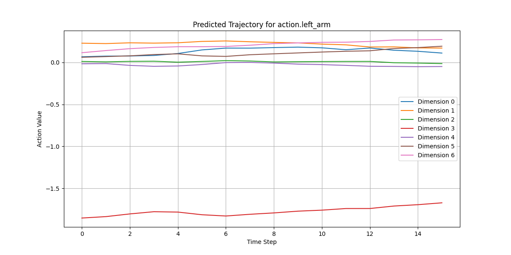
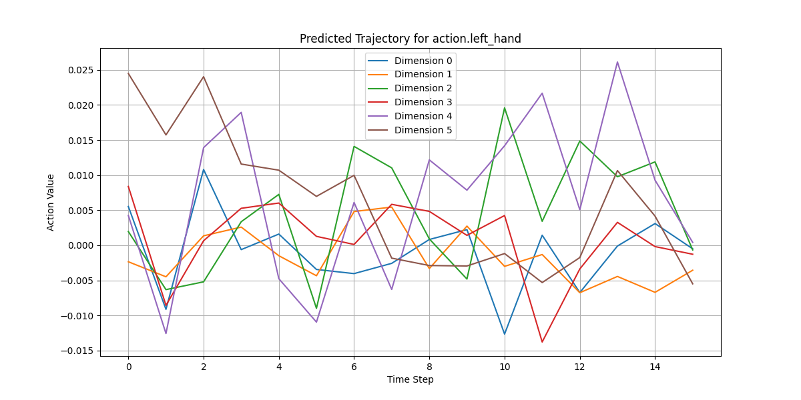

# GR00T 模型推理与轨迹可视化指南

本文档旨在详细阐述 Isaac GR00T 模型在 `gr00t_inference.py` 脚本中的推理流程，以及如何使用 `visualize_trajectory.py` 脚本对预测结果进行可视化。

## 1. GR00T 模型推理 (`gr00t_inference.py`)

`gr00t_inference.py` ([deployment_scripts/gr00t_inference.py](code/gr00t_inference.py)) 脚本是用于执行 GR00T 模型推理的核心程序。它支持 PyTorch 和 TensorRT 两种推理模式，并能将模型的预测动作保存下来。

### 1.1 脚本功能概述

*   **模型加载**: 从指定路径或 Hugging Face Hub 加载 GR00T 模型。
*   **数据集加载**: 加载 `demo_data` 中的机器人演示数据，作为模型的观测输入。
*   **策略封装**: 使用 `Gr00tPolicy` 类封装模型，处理数据的标准化、模型前向传播以及动作的反标准化。
*   **推理执行**: 在 PyTorch 或 TensorRT 环境下执行模型推理。
*   **结果保存**: 将模型预测的动作序列保存到 `.pkl` 文件中。
*   **性能对比**: （可选）对比 PyTorch 和 TensorRT 的推理结果。

### 1.2 核心流程

脚本的执行主要围绕 `Gr00tPolicy` 的 `get_action` 方法展开。

#### **模型和数据加载**

1.  **参数解析**: 使用 `argparse` 解析命令行参数，如模型路径、数据集路径、推理模式等。
2.  **数据配置**: 加载数据配置 (`data_config`) 和模态配置 (`modality_config`)。
3.  **策略初始化**: 实例化 `Gr00tPolicy` ([gr00t/model/policy.py](https://github.com/NVIDIA/Isaac-GR00T/blob/n1.5-release/gr00t/model/policy.py#L57))。在此过程中，`Gr00tPolicy` 会加载模型权重，并从 `metadata.json`（包含了 `stats.json` 的信息）中加载数据统计信息，用于后续的标准化和反标准化。
    ```python
    # deployment_scripts/gr00t_inference.py
    policy = Gr00tPolicy(
        model_path=MODEL_PATH,
        embodiment_tag=EMBODIMENT_TAG,
        modality_config=modality_config,
        modality_transform=modality_transform,
        denoising_steps=args.denoising_steps,
        device=device,
    )
    ```
4.  **数据集实例化**: 使用 `LeRobotSingleDataset` 加载机器人演示数据。
    ```python
    # deployment_scripts/gr00t_inference.py
    dataset = LeRobotSingleDataset(
        dataset_path=DATASET_PATH,
        modality_configs=modality_config,
        video_backend=args.video_backend,
        # ...
    )
    ```

#### **推理循环与动作预测**

在 PyTorch 推理模式下，脚本会遍历 `dataset` 中的所有数据项，并对每组数据执行一次推理。

```python
# deployment_scripts/gr00t_inference.py
all_predicted_actions = []
if args.inference_mode == "pytorch":
    # ...
    for i in range(len(dataset)):
        print(f"\n--- Inferring for dataset item {i+1}/{len(dataset)} ---")
        step_data = dataset[i] # 从数据集中获取当前项
        predicted_action = policy.get_action(step_data) # 获取预测动作
        all_predicted_actions.append({k: v for k, v in predicted_action.items()})
        # ... 打印预测结果 ...
```

#### **动作反标准化**

这是一个关键点：`Gr00tPolicy` 的 `get_action` 方法负责处理整个动作预测链条，包括：
1.  对输入观测数据进行标准化。
2.  将标准化后的观测数据输入到神经网络模型，获取**标准化后的动作预测**。
3.  对模型输出的标准化动作进行**反标准化**，利用初始化时加载的 `stats.json` 中的均值（mean）和标准差（std）将动作转换回物理尺度。
4.  （可选）进行动作裁剪，确保动作值在合理范围内。

这意味着，`policy.get_action` 返回的 `predicted_action` 字典中的值**已经是经过反标准化处理的实际动作值**。

相关代码路径：
*   `Gr00tPolicy.get_action` ([gr00t/model/policy.py#L146-L186](https://github.com/NVIDIA/Isaac-GR00T/blob/n1.5-release/gr00t/model/policy.py#L146-L186))
*   `Gr00tPolicy.apply_transforms` (用于观测标准化)
*   `Gr00tPolicy._get_action_from_normalized_input` (调用底层模型)
*   `Gr00tPolicy._get_unnormalized_action` ([gr00t/model/policy.py#L196-L197](https://github.com/NVIDIA/Isaac-GR00T/blob/n1.5-release/gr00t/model/policy.py#L196-L197), 实际执行反标准化)
*   `Gr00tPolicy.unapply_transforms` (底层反标准化逻辑，使用 `_modality_transform` 和 `metadata`)

#### **预测结果保存**

推理完成后，`all_predicted_actions` 列表会包含与数据集条目数量相同次的预测结果。这些结果会被保存到 `output/predicted_actions.pkl` 文件中。

```python
# deployment_scripts/gr00t_inference.py
# ...
    output_dir = "output"
    os.makedirs(output_dir, exist_ok=True)
    output_file = os.path.join(output_dir, "predicted_actions.pkl")
    with open(output_file, "wb") as f:
        pickle.dump(all_predicted_actions, f)
    print(f"All predicted actions saved to {output_file}")
```

### 1.3 `demo_data` 结构与推理中的使用原理

`demo_data/robot_sim.PickNPlace` 目录存储了机器人演示数据，其结构和内容对于理解推理过程至关重要。它主要分为 `data`、`meta` 和 `videos` 三个子目录。

#### **`demo_data/robot_sim.PickNPlace/data` 目录**

*   **文件内容**: `data/chunk-000/episode_XXXXXX.parquet`
    *   这个目录中的 `.parquet` 文件包含了**机器人动态运动的轨迹数据**。
    *   **动作数据 (Actions)**：机器人在每个时间步执行的控制指令，比如各个关节的目标位置、速度或力矩。这些构成了一个动作轨迹。
    *   **非视觉观测数据 (State Observations)**：机器人在每个时间步的内部状态，比如各个关节的实际位置、速度、加速度，以及末端执行器的位姿、力传感器读数等。这些也构成了机器人的状态轨迹。
    *   这些数据都是随着时间变化的，记录了机器人执行一个任务时的完整动态过程。
*   **推理中的使用原理**: `LeRobotSingleDataset` 加载器会读取这些 `.parquet` 文件，提取出用于模型推理的观测（`observation.state`）和真实的动作（用于比较或日志）。这些动态数据是模型学习和预测的核心。

#### **`demo_data/robot_sim.PickNPlace/videos` 目录**

*   **文件内容**: `videos/chunk-000/observation.images.ego_view/episode_XXXXXX.mp4`
    *   这个目录主要存储的是**视觉观测（Visual Observations）**，即机器人“看到”的场景的视频流。这些 `.mp4` 文件包含的是图像数据，而不是直接的机器人关节运动数据。`observation.images.ego_view` 这个命名也明确指出了它们是图像形式的观测数据。
*   **推理中的使用原理**: `LeRobotSingleDataset` 加载器会读取这些视频文件，将其解码为图像帧序列，作为模型视觉编码器（如 ViT）的输入。

---

---


#### **`demo_data/robot_sim.PickNPlace/meta` 目录文件内容与推理使用原理**

`meta` 目录中的文件提供了关于 `robot_sim.PickNPlace` 数据集至关重要的元数据。这些元数据是 `gr00t_inference.py` 脚本在加载、处理数据并将其输入给 `Gr00tPolicy` 模型时，理解数据结构和应用正确预处理步骤的关键。它们可以被认为是**机器人（或数据集）的静态数据**。

1.  **`info.json`** ([meta/info.json](https://github.com/NVIDIA/Isaac-GR00T/tree/n1.5-release/demo_data/robot_sim.PickNPlace/meta/info.json))
    *   **内容**: 这个文件提供了整个数据集的高级概览。
        *   **基本信息**: `codebase_version`, `robot_type` (`GR1ArmsOnly`), `total_episodes` (5), `total_frames` (2096), `fps` (20.0)。
        *   **路径模板**: 包含 `data_path` 和 `video_path` 的模板字符串，例如 `data/chunk-{episode_chunk:03d}/episode_{episode_index:06d}.parquet`。这使得数据集加载器能够根据 episode 的索引和分块号动态构建数据文件的完整路径。
        *   **特征描述**: `features` 部分详细列出了数据集中包含的所有模态及其属性。
            *   `observation.images.egoview`: 提供了两种不同分辨率的图像（800x1280x3 和 256x256x3），指明它们是 `video` 类型。
            *   `observation.state`: 一个 44 维的 `float64` 向量，详细列出了每个维度的名称（如 `motor_0` 到 `motor_43`），表示机器人的关节状态或其他传感器数据。
            *   `action`: 同样是 44 维的 `float64` 向量，也列出了对应的马达名称，表示机器人执行的动作。
            *   其他元数据字段如 `timestamp`, `annotation.human.action.task_description`, `next.reward`, `next.done` 等。
    *   **推理中的使用原理**:
        *   **数据集初始化**: `LeRobotSingleDataset` 在初始化时会读取 `info.json` 来了解数据集的整体结构和文件命名约定，以便正确地找到和加载数据。
        *   **数据结构验证**: 模型会利用 `features` 部分来验证输入数据的维度和类型是否符合预期。
        *   **路径构建**: 根据 `episode_index` 和 `chunk` 信息，数据集加载器使用 `data_path` 和 `video_path` 模板来定位 `data/` 和 `videos/` 目录中的具体文件。

2.  **`modality.json`** ([meta/modality.json](https://github.com/NVIDIA/Isaac-GR00T/tree/n1.5-release/demo_data/robot_sim.PickNPlace/meta/modality.json))
    *   **内容**: 这个文件详细定义了如何将高维的 `state` 和 `action` 向量映射到具体的机器人部件（或逻辑分组），以及视频流的原始键名。
        *   **`state` 和 `action` 的语义分割**: 例如，`state` 字段将 44 维的向量拆分为 `left_arm` (`start: 0, end: 7`), `left_hand` (`start: 7, end: 13`) 等子部分。
        *   **视频模态映射**: `video.ego_view` 映射到 `original_key: observation.images.ego_view`，这有助于数据加载器和模型内部统一处理不同名称的模态。
    *   **推理中的使用原理**:
        *   **数据解析与重构**: `Gr00tPolicy` 在处理 `observation.state` 或生成 `action` 时，会使用这个映射关系来理解数据的语义。例如，它可以独立处理左臂的关节数据，或者只生成右手抓取的动作。
        *   **模态配置**: `gr00t_inference.py` 中的 `modality_config = data_config.modality_config()` 步骤很可能就是从这个文件中加载配置，指导数据预处理和模型输入层的构建。

3.  **`episodes.jsonl`** ([meta/episodes.jsonl](https://github.com/NVIDIA/Isaac-GR00T/tree/n1.5-release/demo_data/robot_sim.PickNPlace/meta/episodes.jsonl))
    *   **内容**: 这是一个 JSON Lines 文件，每行代表一个独立的机器人任务 episode。
        *   **`episode_index`**: 每个 episode 的唯一标识符。
        *   **`tasks`**: 包含任务的文本描述（例如 `"pick the pear from the counter and place it in the plate"`）以及一个 `valid` 标签。
        *   **`length`**: 该 episode 包含的帧/时间步数量。
    *   **推理中的使用原理**:
        *   **任务选择与上下文**: 在 `gr00t_inference.py` 中，如果需要执行特定任务的推理，可以根据 `tasks` 字段来选择 `episode_index`。
        *   **语言条件策略**: 如果 `Gr00tPolicy` 是一个语言条件 (language-conditioned) 模型，那么 `tasks` 字段中的文本描述会被提取出来，作为模型的输入，指导模型执行相应的动作。
        *   **迭代与裁剪**: `length` 字段可以用来在推理过程中限制 episode 的长度，或者判断何时达到 episode 的末尾。

4.  **`stats.json`** ([meta/stats.json](https://github.com/NVIDIA/Isaac-GR00T/tree/n1.5-release/demo_data/robot_sim.PickNPlace/meta/stats.json))
    *   **内容**: 提供了数据集中各模态（`observation.state`, `action`, `timestamp` 等）的统计学属性，包括 `mean` (均值), `std` (标准差), `min` (最小值), `max` (最大值), `q01` (1% 分位数), `q99` (99% 分位数)。这些值通常是针对每个维度独立计算的。
    *   **推理中的使用原理**:
        *   **数据标准化/归一化**: 这是机器学习模型训练和推理的关键步骤。模型通常期望输入数据在一个特定的数值范围内（例如，均值为 0，标准差为 1）。`mean` 和 `std` 值被用于对 `observation.state` 和其他数值型观测数据进行**标准化**，使其符合模型的输入要求。
        *   **动作去归一化与剪裁**: 模型预测出的动作可能也是归一化后的值。在将动作发送给机器人之前，需要使用 `mean` 和 `std` 对其进行**去归一化**，将其转换回物理世界中的实际值。同时，`min` 和 `max`（或 `q01`, `q99`）可以用于**剪裁 (clipping)** 预测动作，确保动作值在物理可行范围内，避免机器人执行危险或无效的动作。

5.  **`tasks.jsonl`** ([meta/tasks.jsonl](https://github.com/NVIDIA/Isaac-GR00T/tree/n1.5-release/demo_data/robot_sim.PickNPlace/meta/tasks.jsonl))
    *   **内容**: 这是一个简单的 JSON Lines 文件，将 `task_index` 映射到具体的任务文本描述。
    *   **推理中的使用原理**:
        *   **任务索引到文本的转换**: 它提供了一个任务 ID 到可读任务描述的直接映射。这在需要根据任务索引来查询任务描述，或者在日志和用户界面中显示任务名称时非常有用。它补充了 `episodes.jsonl` 中提供的任务信息，可能用于更灵活的任务管理。

**总结**: `meta` 目录下的这些 JSON/JSONL 文件构成了 `robot_sim.PickNPlace` 数据集的数据字典和配置中心。它们共同指导了 `gr00t_inference.py` 脚本如何加载原始数据、理解其语义、应用正确的预处理（特别是标准化/归一化），并最终将准备好的数据输入给 `Gr00tPolicy` 模型进行推理。这些元数据是确保整个推理流程正确性、效率和可复现性的关键。


## 2. 推理预测运动轨迹

gr00t_inference.py 输出的 `action value` 代表的是 GR00T 模型预测的机器人 **在未来 16 个时间步内，左臂或左手各个关节（或动作维度）的期望值**。这些值是模型根据当前观测，经过其内部复杂的神经网络计算后得出的**物理世界中的动作指令**。

以下是 `action value` 通常的计算（或者说推导）过程：

1.  **观测数据标准化 (Normalization of Observations)**:
    *   在模型进行推理之前，原始的机器人观测数据（例如图像像素、关节角度、传感器读数等）首先会被标准化。
    *   这个标准化过程通常会使用训练数据集中计算出的均值 (`mean`) 和标准差 (`std`)。你可以在 [stats.json](https://github.com/NVIDIA/Isaac-GR00T/tree/n1.5-release/demo_data/robot_sim.PickNPlace/meta/stats.json) 文件中找到这些统计信息（例如 `observation.state.mean` 和 `observation.state.std`）。
    *   标准化后的数据通常会有一个均值接近 0，标准差接近 1 的分布，这有助于神经网络更稳定、高效地学习。

2.  **GR00T 模型预测 (Model Prediction)**:
    *   标准化后的观测数据被送入 GR00T 模型的神经网络。
    *   模型的核心部分（通常是其“行动头部”，`action_head`）会预测一系列的动作。**这些预测的原始输出通常也是在标准化空间中的**。这意味着模型预测的动作值本身也是经过标准化处理的，而不是直接对应物理世界的单位。

3.  **动作数据反标准化 (Denormalization of Actions)**:
    *   为了将模型的预测转化为机器人控制器可以理解和执行的物理指令，这些标准化后的预测动作需要进行反标准化（或称去归一化）。
    *   这个过程会使用与标准化观测数据相同的逻辑，但方向相反，并且使用的是 `stats.json` 中 `action` 字段对应的 `mean` 和 `std`。
    *   反标准化后的值就是你在轨迹图上看到的 `Action Value`，它们代表了机器人关节的期望位置、速度、力矩或其他控制信号。

4.  **动作剪裁 (Clipping, Optional but Common)**:
    *   在反标准化之后，预测的动作值有时还会被剪裁到物理上可接受的范围。例如，一个关节不能旋转超过其物理极限。
    *   `stats.json` 中的 `action.min` 和 `action.max`（或者 `q01`, `q99`）可以用于定义这些物理边界，确保生成的动作是安全和可执行的。


## 3. 预测结果可视化 (`visualize_trajectory.py`)

`visualize_trajectory.py` ([deployment_scripts/visualize_trajectory.py](code/visualize_trajectory.py)) 脚本用于加载 `gr00t_inference.py` 生成的预测结果，并将其绘制成轨迹图。

### 3.1 脚本功能概述

*   **加载预测数据**: 从 `predicted_actions.pkl` 文件中加载所有预测的动作序列。
*   **选择预测**: 允许用户指定要可视化的具体预测（通过 `--index` 参数）。
*   **轨迹绘图**: 遍历每个动作组件（如 `left_arm`, `left_hand`），并绘制其多维轨迹。
*   **保存图表**: 将生成的图表保存为 PNG 图像文件。


*   `action.left_arm` 轨迹图有 7 条线，对应左臂的 7 个动作维度（可能代表 7 个关节的期望值）。
   

*   `action.left_hand` 轨迹图有 6 条线，对应左手的 6 个动作维度。
   

*   这些维度与 [modality.json](https://github.com/NVIDIA/Isaac-GR00T/tree/n1.5-release/demo_data/meta/modality.json) 文件中定义的 `state` 和 `action` 的语义分割相对应。例如，`"left_arm": {"start": 0, "end": 7}` 表示 `action` 向量的前 7 个维度对应左臂的控制。
*   横轴的 `Time Step` 代表模型预测的未来时间步，从 0 到 15，总共 16 个时间步。
*   纵轴的 `Action Value` 就是经过上述过程反标准化后的动作值。例如，如果 `action value` 代表关节角度，那么它可能就是某个关节在特定时间步的期望弧度值或度数值。

`action value` 并不是一个抽象的“得分”或“概率”，而是模型直接输出的、经过处理后可以用于控制机器人执行特定运动的**具体数值指令**。


## 4. 整体工作流程总结

GR00T 模型的推理和可视化流程可以概括为以下步骤：

1.  **数据准备**: 机器人演示数据（包括观测、动作、视频和元数据）组织在 `demo_data` 目录中。`meta` 目录中的文件提供了关键的配置和统计信息。
2.  **策略初始化**: `gr00t_inference.py` 加载 GR00T 模型，并将其封装在 `Gr00tPolicy` 中。`Gr00tPolicy` 负责加载数据统计信息。
3.  **模型推理**: `gr00t_inference.py` 从 `LeRobotSingleDataset` 获取观测数据，并对数据集中的每个数据项执行一次 `policy.get_action`。
    *   在 `policy.get_action` 内部，观测数据首先被标准化。
    *   标准化后的观测数据输入到神经网络模型，得到标准化后的动作预测。
    *   标准化后的动作预测随后通过 `unapply_transforms` 方法**反标准化**为物理世界的实际动作值。
    *   所有这些反标准化后的预测动作序列被收集到一个列表中。
4.  **结果保存**: `gr00t_inference.py` 将所有预测的动作序列保存到 `predicted_actions.pkl` 文件。
5.  **轨迹可视化**: `visualize_trajectory.py` 加载 `predicted_actions.pkl` 文件。
    *   用户可以通过 `--index` 参数选择查看哪一次预测的轨迹。
    *   脚本将选定预测中的每个动作组件绘制成图表，展示其在预测时间步内的变化。
    *   生成的图表保存为 PNG 文件，以便分析模型的预测行为。

