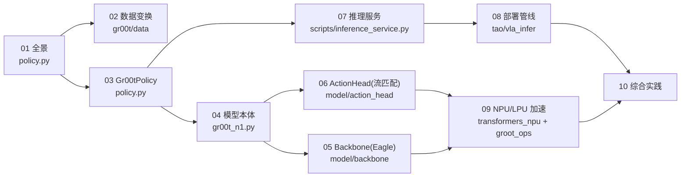

# 00 · 教学计划（学习路线图）

> 本文件是课程的"教学设定"：总体目标、章节大纲、学习进度清单。
> 随学习推进持续更新；可根据反馈调整教学设定（深度、速度、重点）。

## 一、总体目标

学完本课程后，学生应能：

1. 说清 GR00T 推理框架的**端到端数据流**（观测 → 归一化 → 模型前向 → 反归一化 → 动作）。
2. 讲出**每个主要模块的作用**：服务入口、Policy 封装、Backbone、Action Head、变换 pipeline。
3. 解释**背后原理**：为什么用扩散/流匹配生成动作；backbone 为何冻结；为何要归一化/反归一化。
4. 独立定位到真实代码并读懂关键调用链。

## 二、章节大纲（循序渐进，由外到内）

*图：章节依赖与代码模块地图（01 是总览入口；02–06 由外到内进入模型内部；07–09 走出服务与硬件；10 串成闭环）*

| 章 | 标题                       | 核心内容                                       | 对应代码                                           |
| -- | -------------------------- | ---------------------------------------------- | -------------------------------------------------- |
| 00 | 教学计划                   | 路线图、进度清单                               | —                                                 |
| 01 | 推理框架全景               | 端到端数据流、模块地图、一次 get_action 的旅程 | `policy.py`, `gr00t_n1.py`                     |
| 02 | 观测处理与数据变换         | ModalityConfig、delta_indices、归一化/反归一化 | `gr00t/data/`, `gr00t/model/transforms.py`     |
| 03 | 策略封装 Gr00tPolicy       | 加载/封装/复制、get_action 主链路              | `policy.py`                                      |
| 04 | 模型本体 GR00T_N1_5        | 双脑架构、prepare_input、forward vs get_action | `gr00t_n1.py`                                    |
| 05 | 冻结 Backbone（Eagle VLM） | 视频/文本如何编成特征                          | `model/backbone/`                                |
| 06 | 扩散 Action Head（原理）   | 流匹配 / 去噪生成动作                          | `model/action_head/flow_matching_action_head.py` |
| 07 | 推理服务入口               | HTTP/WebSocket 服务器与客户端、请求流程        | `scripts/inference_service.py`                   |
| 08 | 端到端部署 VLA 管线        | server/client、控制频率、与机器人交互          | `tao/vla_infer/`                                 |
| 09 | 加速推理（NPU/LPU）        | transformers_npu / groot_ops                   | `transformers_npu/`, `groot_ops/`              |
| 10 | 综合实践与回顾             | 手动走通一条链路、设计总结、自测题             | 全部                                               |

> 注：本课程聚焦"推理"。训练/微调（finetune、loss 反向）只作背景提及，不作为重点章节。

## 三、学习进度清单（随完成状态更新）

- [X] 00 教学计划（本文件）
- [X] 01 推理框架全景
- [X] 02 观测处理与数据变换
- [X] 03 策略封装 Gr00tPolicy
- [X] 04 模型本体 GR00T_N1_5
- [X] 05 冻结 Backbone
- [ ] 06 扩散 Action Head 原理
- [ ] 07 推理服务入口
- [ ] 08 端到端部署 VLA 管线
- [ ] 09 加速推理（NPU/LPU）
- [ ] 10 综合实践与回顾
- [ ] 11 扩充参考：NVIDIA G1 端到端部署教程精读（N1.7 生态，扩充参考）
- [ ] 12 GR00T 版本演进：N1.5 / N1.6 / N1.7 原理专题
- [ ] 13 L20 实战：N1.5 / N1.6 / N1.7 端到端推理执行手册（实测记录）

## 四、教学设定（可调整）

- **语言**：中文教学（已确认）。
- **节奏**：每章以"先概念 → 再读代码 → 后小结/练习"展开；一章一章推进。
- **深度**：以"读得懂关键调用链、讲得出原理"为目标；涉及 NPU 内核（如 .ac）只要求概念理解，不要求逐行。
- **反馈机制**：学生可在任意章的 `## 疑问与批注` 记录问题；老师据此调整后续章节的深度与顺序。

## 五、更新记录

- **2026-09-24（七）**：第 09 章按 `Isaac-GR00T@v0.2` + `groot_ops@v0.2` 双 tag 逐行走读重写。
  新增 **§3 三级入口时间轴**（T0 安装/绑定期 `install()` 五步 + 两种替换语义 + from-import 传播 + #149
  金丝雀断言；T1 权重期 懒 `_load_lpu` + 常量预计算「t 只 4 值 ⇒ 命中率 100%」+ `future_tokens` 被策略层
  拽回 CPU 的摩擦点；T2 前向期 模块→kernel 映射表 + 「守卫即契约」`action.py:703-736` + 27 个 `GROOT_NPU_*`
  A/B 开关）、**§4.2 op 版本阶梯**（`git ls-tree` 实测 v0.1=24 / v0.2=30 / v0.4=36）、
  **§4.3 融合粒度阶梯**（一个 DiT block：960 → 192 → 64 次发射/轮；省的是 host↔device 往返不是 FLOP）、
  **§7 第 06 章 8 条结论的 kernel 级对账**（7 条印证，唯一未落地 = §6.7 cross K/V 缓存，且整块融合后
  从"可见的慢"变成"隐形的慢"）；4 个待作答提问入「本课提问」。
  **两处配图勘误**：图 9-5 与旧 §3 清单把 `dit_action_head`/`dit_action_tail`/`randn_normal`/`euler_tail`/
  `self_attn_block`/`action_encoder` 记在 v0.2 名下，实测只存在于 `v0.4` tag ⇒ 已改 `mk_fig_ch09_pipeline_compare.py`
  重绘并加 `[v0.4]` 标记（"DiT 头尾融合"在 v0.2 实为 `gemm_bias(W1)+mlp_silu` 与 `mlp_relu`）。
  新图 2 张（图 9-3 `npu_three_stage.svg`、图 9-4 `dit_fusion_granularity.svg`，脚本均带**文本越界自检**）。
  方法论补一条：**能 `ls-tree`/`git tag` 查出来的事实，不要靠记忆写**（版本谱系也是契约）。

- **2026-09-24（六）**：第 06 章 §6.7 新增**部署核查附录**——"跨去噪步 KV 缓存"在生产分支
  `Isaac-GR00T@v0.2` + `groot_ops@v0.2` 上的逐行落地判定（结论：**未实现**，64 次 K/V 投影 48 次白算；
  但同族优化已用于时间侧 #173 与 host 侧 #152 O1；含量化与三个落地坑），五轮追问存档。
  **自我更正一次**：`future_tokens` 是开源**之后**才补进 head 的——四轮结论引自首个开源提交 `5e3ef5e`，
  发布 tag `n1.5-release` 与官方 ckpt 均有 32 个 future token ⇒ §3 勘误① / §4 部件表 /
  §6.8.2 / §6.8.4 / §6.8.6 / §6.8.7 全部改回 `T_q = N_s+32+16`，版本差异表补"首发布 vs tag vs 内网分支"三行；
  掩码"传而不达"已在 `n1.5-release` 复核不变。新方法论：**版本谱系也是契约**（考证三问）。

- **2026-09-24（五）**：第 06 章新增 **§6.8 Action Head 的 Attention 全解（源码考证版）**——三个 attention
  现场（条件侧 self / DiT cross / DiT self）、interleave 偶 cross 奇 self、单层算式与维度账本
  （2048/1536/1024/32 四种"语言"）、t 的三条注入路、无 RoPE 无因果掩码、掩码"传而不达"实核、
  N1.5/N1.6/N1.7 版本差异；配流程图 `images/ch06/attn_flow.png`（脚本 `tools/mk_fig_ch06_attn_flow.py`）。
  **顺带据官方 ckpt + 开源代码推翻三处旧口径并全库回写**：`select_layer=12`（非 16）、
  `project_to_dim=null` ⇒ `eagle_linear=Identity`（backbone→head 交接是 **2048**，1536 属 head 内部）、
  `tune_visual=true`（冻的只有语言塔）；另记录开源实现两处事实：无 `future_tokens`、
  `backbone_attention_mask` 传而不达。落点：第 05 章 §2 勘误框 + §3/§6 + 批注补录，第 06 章
  §3 勘误 + §4 部件表 + §6.7 精化（可缓存的是 **8/16 层** K/V，约 14 MiB/样本、省 ~90 GFLOP）+
  四轮追问存档 + 动手题"掩码可达性检查"，第 10/12 章口径同步。

- **2026-09-24（四）**：第 06 章新增 **§6.6 绘图师心智模型**（三修正+动图 `dit_cartographer.gif`，脚本
  `tools/mk_gif_ch06_cartographer.py`）与 **§6.7 跨去噪步 KV 缓存**（课堂独立推导：L 层常量 K/V 提升、
  可缓存边界表、prefill/decode 谱系、与 §6.5 的 hoisting 镜像教训）；三轮追问存该章批注。

- **2026-09-24（三）**：#168 失败现场录像 `robot.mp4` 入库第 02 章 §7.1（形态与"录像一"一致、
  时长存疑按实注明）：加速 2× 动图 + 八帧胶片条；成功演示 GIF（4×）与通用脚本
  `tools/mk_gif_n15_pour.py` 同批入库，失败/成功双 GIF 对照入 §7.7。

- **2026-09-24（二）**：第 02 章新增 **§7.7 修复后真机成功演示**——N1.5 倒茶闭环 success rollout 视频
  （本机 NPU 推理主机）收编：三幕关键帧入 `images/ch02/`，两处修复（扁图补边成方图=恢复契约；
  client/server RGB 通道序错位=安静错误+dump 互验）逐条对位 §7.5 纪律，#168 失败案例正式闭环。

- **2026-09-24**：第 06 章完成**首轮授课**（问答式）并四扩正文——新增 §1.1 对照表 / §1.2 开环vs闭环插叙 /
  §2.5 训练-推理对偶（全域指路牌）/ §3.5 完美 1 步=条件均值思想实验 / §3.6 选边时机与 Beta 调度 /
  §6.5 课堂事故复盘（循环内编码挪出循环的坍缩代数）；§7 增设"迁移总结"表；配图脚本
  `tools/mk_fig_ch06_denoise_paths.py`（解析完美速度场上真跑 K=1/4/16 欧拉积分，实证
  "1 步落均值、选边在前中段 t≈0.31~0.56"）。问答判卷记录存该章 `## 疑问与批注`。

- **2026-09-23**：第 05 章完成**首轮授课**（问答式），问答实录与总结存档至该章 `## 疑问与批注`：
  含"train/eval 错位时泛化兜不兜得住"三行判据表（dropout 慢性损耗 / BN 急性事故 / 换骨干换城市）、
  "设计过的随机性 vs 泄漏的随机性"对照、闭环误差复利加重因素，以及三个超越标准答案的收获
  （泛化覆盖判据、`select_layer` 为加载后裁剪、`eagle_linear` 是可重训 adapter）。
- **2026-09-18**：新增第 **13 章《L20 实战：N1.5/N1.6 端到端推理执行手册》**——git worktree +
  PYTHONPATH 双版本并存、四条执行路径（每版"单进程 / ZMQ 服务化"各一条）全部实测跑通
  （本章已于同日三扩到三代 / 五条路径 / 12 条坑），
  收录完整命令、延迟/MSE 实测表、5 张配图与 8 条坑清单；配套工具
  `tools/l20_latency_probe.py`（延迟探针）与 `tools/mk_fig_l20_e2e.py`（配图再生成）。
- **2026-09-18（同日二）**：第 12 章按实测对照修订——新增 **§6 实机对照：同一台 L20 上看
  三代**（三代 ckpt config 实测表、gated 骨干占位等价性验证、入口/环境映射、动作空间与
  MSE 口径纪律、官方 TRT 分段表落地核对），并据 ckpt 实测修正 §4.1/主线①②/附录 A 中
  与发布权重不符的宣称数字（DiT 32 层、select_layer 16、load_bf16 true）。
- **2026-09-18（同日三）**：**N1.7 在同机复现闭环**——ModelScope 权重校验完整
  （1031 张量 / 逐 shard 头部字节相符），gated 骨干用"结构占位 + ckpt 全量覆盖"等价跑通；
  droid 零样本 e2e MSE **0.0199**、延迟 **1.71 s/步**。定位并修复一次环境层事故
  （退化形状 Conv3d 在 aarch64 + torch2.9 + cu128 上 **40.28 s/步** → 等价 `F.linear`
  **24× 加速**，MSE 复跑一致），补丁与自检脚本 `tools/n17_arm_patch.py`、配图脚本
  `tools/mk_fig_n17.py` 入库。第 13 章新增 **§5 N1.7 实测**（含 3 张配图 + 4 条新坑），
  汇总表/坑清单扩到三代；第 12 章 §6.3~§6.6 与附录 A 回填三代实测数字。
- **2026-09-16**：第 02 章新增 **§7 真实故障案例：图像预处理与训练不一致**（真机倒茶任务失败复盘，
  Redmine #168），含几何误差配图、三档预处理对照与"离线 A/B 归因"方法；第 08 章 §5 补充
  **图像预处理契约**要点。教学点从"归一化要一致"扩展到
  "**一切入口变换（含图像几何）都必须与训练一致，且要有能抓住它的检查**"。
