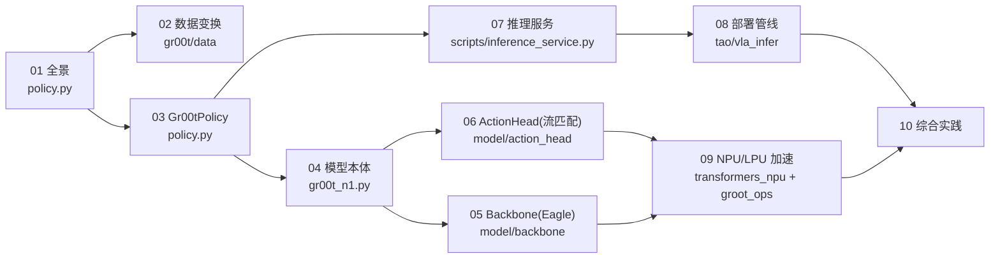

# 00 · 教学计划（学习路线图）

> 本文件是课程的"教学设定"：总体目标、章节大纲、学习进度清单。
> 随学习推进持续更新；可根据反馈调整教学设定（深度、速度、重点）。

## 一、总体目标

学完本课程后，学生应能：
1. 说清 GR00T 推理框架的**端到端数据流**（观测 → 归一化 → 模型前向 → 反归一化 → 动作）。
2. 讲出**每个主要模块的作用**：服务入口、Policy 封装、Backbone、Action Head、变换 pipeline。
3. 解释**背后原理**：为什么用扩散/流匹配生成动作；backbone 为何冻结；为何要归一化/反归一化。
4. 独立定位到真实代码并读懂关键调用链。

## 二、章节大纲（循序渐进，由外到内）

*图：章节依赖与代码模块地图（01 是总览入口；02–06 由外到内进入模型内部；07–09 走出服务与硬件；10 串成闭环）*

| 章 | 标题 | 核心内容 | 对应代码 |
|---|---|---|---|
| 00 | 教学计划 | 路线图、进度清单 | — |
| 01 | 推理框架全景 | 端到端数据流、模块地图、一次 get_action 的旅程 | `policy.py`, `gr00t_n1.py` |
| 02 | 观测处理与数据变换 | ModalityConfig、delta_indices、归一化/反归一化 | `gr00t/data/`, `gr00t/model/transforms.py` |
| 03 | 策略封装 Gr00tPolicy | 加载/封装/复制、get_action 主链路 | `policy.py` |
| 04 | 模型本体 GR00T_N1_5 | 双脑架构、prepare_input、forward vs get_action | `gr00t_n1.py` |
| 05 | 冻结 Backbone（Eagle VLM） | 视频/文本如何编成特征 | `model/backbone/` |
| 06 | 扩散 Action Head（原理） | 流匹配 / 去噪生成动作 | `model/action_head/flow_matching_action_head.py` |
| 07 | 推理服务入口 | HTTP/WebSocket 服务器与客户端、请求流程 | `scripts/inference_service.py` |
| 08 | 端到端部署 VLA 管线 | server/client、控制频率、与机器人交互 | `tao/vla_infer/` |
| 09 | 加速推理（NPU/LPU） | transformers_npu / groot_ops | `transformers_npu/`, `groot_ops/` |
| 10 | 综合实践与回顾 | 手动走通一条链路、设计总结、自测题 | 全部 |

> 注：本课程聚焦"推理"。训练/微调（finetune、loss 反向）只作背景提及，不作为重点章节。

## 三、学习进度清单（随完成状态更新）

- [x] 00 教学计划（本文件）
- [x] 01 推理框架全景
- [x] 02 观测处理与数据变换
- [x] 03 策略封装 Gr00tPolicy
- [x] 04 模型本体 GR00T_N1_5
- [x] 05 冻结 Backbone
- [x] 06 扩散 Action Head 原理
- [x] 07 推理服务入口
- [x] 08 端到端部署 VLA 管线
- [x] 09 加速推理（NPU/LPU）
- [x] 10 综合实践与回顾
- [x] 11 扩充参考：NVIDIA G1 端到端部署教程精读（N1.7 生态，扩充参考）
- [x] 12 GR00T 版本演进：N1.5 / N1.6 / N1.7 原理专题
- [x] 13 L20 实战：N1.5 / N1.6 / N1.7 端到端推理执行手册（实测记录）

## 四、教学设定（可调整）

- **语言**：中文教学（已确认）。
- **节奏**：每章以"先概念 → 再读代码 → 后小结/练习"展开；一章一章推进。
- **深度**：以"读得懂关键调用链、讲得出原理"为目标；涉及 NPU 内核（如 .ac）只要求概念理解，不要求逐行。
- **反馈机制**：学生可在任意章的 `## 疑问与批注` 记录问题；老师据此调整后续章节的深度与顺序。

## 五、更新记录

- **2026-09-23**：第 05 章完成**首轮授课**（问答式），问答实录与总结存档至该章 `## 疑问与批注`：
  含"train/eval 错位时泛化兜不兜得住"三行判据表（dropout 慢性损耗 / BN 急性事故 / 换骨干换城市）、
  "设计过的随机性 vs 泄漏的随机性"对照、闭环误差复利加重因素，以及三个超越标准答案的收获
  （泛化覆盖判据、`select_layer` 为加载后裁剪、`eagle_linear` 是可重训 adapter）。

- **2026-09-18**：新增第 **13 章《L20 实战：N1.5/N1.6 端到端推理执行手册》**——git worktree +
  PYTHONPATH 双版本并存、四条执行路径（每版"单进程 / ZMQ 服务化"各一条）全部实测跑通
  （本章已于同日三扩到三代 / 五条路径 / 12 条坑），
  收录完整命令、延迟/MSE 实测表、5 张配图与 8 条坑清单；配套工具
  `tools/l20_latency_probe.py`（延迟探针）与 `tools/mk_fig_l20_e2e.py`（配图再生成）。
- **2026-09-18（同日二）**：第 12 章按实测对照修订——新增 **§6 实机对照：同一台 L20 上看
  三代**（三代 ckpt config 实测表、gated 骨干占位等价性验证、入口/环境映射、动作空间与
  MSE 口径纪律、官方 TRT 分段表落地核对），并据 ckpt 实测修正 §4.1/主线①②/附录 A 中
  与发布权重不符的宣称数字（DiT 32 层、select_layer 16、load_bf16 true）。
- **2026-09-18（同日三）**：**N1.7 在同机复现闭环**——ModelScope 权重校验完整
  （1031 张量 / 逐 shard 头部字节相符），gated 骨干用"结构占位 + ckpt 全量覆盖"等价跑通；
  droid 零样本 e2e MSE **0.0199**、延迟 **1.71 s/步**。定位并修复一次环境层事故
  （退化形状 Conv3d 在 aarch64 + torch2.9 + cu128 上 **40.28 s/步** → 等价 `F.linear`
  **24× 加速**，MSE 复跑一致），补丁与自检脚本 `tools/n17_arm_patch.py`、配图脚本
  `tools/mk_fig_n17.py` 入库。第 13 章新增 **§5 N1.7 实测**（含 3 张配图 + 4 条新坑），
  汇总表/坑清单扩到三代；第 12 章 §6.3~§6.6 与附录 A 回填三代实测数字。

- **2026-09-16**：第 02 章新增 **§7 真实故障案例：图像预处理与训练不一致**（真机倒茶任务失败复盘，
  Redmine #168），含几何误差配图、三档预处理对照与"离线 A/B 归因"方法；第 08 章 §5 补充
  **图像预处理契约**要点。教学点从"归一化要一致"扩展到
  "**一切入口变换（含图像几何）都必须与训练一致，且要有能抓住它的检查**"。
