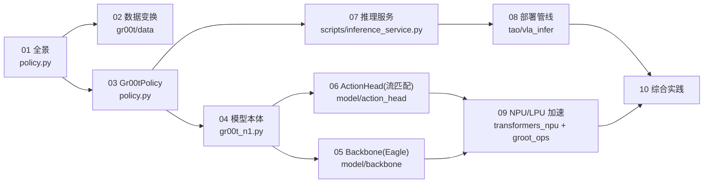

# 00 · 教学计划（学习路线图）

> 本文件是课程的"教学设定"：总体目标、章节大纲、学习进度清单。
> 随学习推进持续更新；可根据反馈调整教学设定（深度、速度、重点）。

## 一、总体目标

学完本课程后，学生应能：

1. 说清 GR00T 推理框架的**端到端数据流**（观测 → 归一化 → 模型前向 → 反归一化 → 动作）。
2. 讲出**每个主要模块的作用**：服务入口、Policy 封装、Backbone、Action Head、变换 pipeline。
3. 解释**背后原理**：为什么用扩散/流匹配生成动作；backbone 为何冻结；为何要归一化/反归一化。
4. 独立定位到真实代码并读懂关键调用链。

## 二、章节大纲（循序渐进，由外到内）

```mermaid
graph LR
  A["01 全景<br/>policy.py"] --> B["02 数据变换<br/>gr00t/data"]
  A --> C["03 Gr00tPolicy<br/>policy.py"]
  C --> D["04 模型本体<br/>gr00t_n1.py"]
  D --> E["05 Backbone(Eagle)<br/>model/backbone"]
  D --> F["06 ActionHead(流匹配)<br/>model/action_head"]
  C --> G["07 推理服务<br/>scripts/inference_service.py"]
  G --> H["08 部署管线<br/>tao/vla_infer"]
  F --> I["09 NPU/LPU 加速<br/>transformers_npu + groot_ops"]
  E --> I
  H --> J["10 综合实践"]
  I --> J
```

*图：章节依赖与代码模块地图（01 是总览入口；02–06 由外到内进入模型内部；07–09 走出服务与硬件；10 串成闭环）*

| 章 | 标题                       | 核心内容                                       | 对应代码                                           |
| -- | -------------------------- | ---------------------------------------------- | -------------------------------------------------- |
| 00 | 教学计划                   | 路线图、进度清单                               | —                                                 |
| 01 | 推理框架全景               | 端到端数据流、模块地图、一次 get_action 的旅程 | `policy.py`, `gr00t_n1.py`                     |
| 02 | 观测处理与数据变换         | ModalityConfig、delta_indices、归一化/反归一化 | `gr00t/data/`, `gr00t/model/transforms.py`     |
| 03 | 策略封装 Gr00tPolicy       | 加载/封装/复制、get_action 主链路              | `policy.py`                                      |
| 04 | 模型本体 GR00T_N1_5        | 双脑架构、prepare_input、forward vs get_action | `gr00t_n1.py`                                    |
| 05 | 冻结 Backbone（Eagle VLM） | 视频/文本如何编成特征                          | `model/backbone/`                                |
| 06 | 扩散 Action Head（原理）   | 流匹配 / 去噪生成动作                          | `model/action_head/flow_matching_action_head.py` |
| 07 | 推理服务入口               | HTTP/WebSocket 服务器与客户端、请求流程        | `scripts/inference_service.py`                   |
| 08 | 端到端部署 VLA 管线        | server/client、控制频率、与机器人交互          | `tao/vla_infer/`                                 |
| 09 | 加速推理（NPU/LPU）        | transformers_npu / groot_ops                   | `transformers_npu/`, `groot_ops/`              |
| 10 | 综合实践与回顾             | 手动走通一条链路、设计总结、自测题             | 全部                                               |

> 注：本课程聚焦"推理"。训练/微调（finetune、loss 反向）只作背景提及，不作为重点章节。

## 三、学习进度清单（随完成状态更新）

- [X] 00 教学计划（本文件）
- [X] 01 推理框架全景
- [X] 02 观测处理与数据变换
- [X] 03 策略封装 Gr00tPolicy
- [X] 04 模型本体 GR00T_N1_5
- [X] 05 冻结 Backbone
- [ ] 06 扩散 Action Head 原理
- [ ] 07 推理服务入口
- [ ] 08 端到端部署 VLA 管线
- [ ] 09 加速推理（NPU/LPU）
- [ ] 10 综合实践与回顾
- [ ] 11 扩充参考：NVIDIA G1 端到端部署教程精读（N1.7 生态，扩充参考）
- [ ] 12 GR00T 版本演进：N1.5 / N1.6 / N1.7 原理专题
- [ ] 13 L20 实战：N1.5 / N1.6 / N1.7 端到端推理执行手册（实测记录）
- [ ] 14 SigLIP 视觉塔：从调用链到 NPU 融合算子（视觉塔专项）

## 四、教学设定（可调整）

- **语言**：中文教学（已确认）。
- **节奏**：每章以"先概念 → 再读代码 → 后小结/练习"展开；一章一章推进。
- **深度**：以"读得懂关键调用链、讲得出原理"为目标；涉及 NPU 内核（如 .ac）只要求概念理解，不要求逐行。
- **反馈机制**：学生可在任意章的 `## 疑问与批注` 记录问题；老师据此调整后续章节的深度与顺序。

## 五、更新记录

- **2026-10-01（十七）**：**两张"attention 实测图"落地 + 两轮课堂结论入册**。
  ① **14 章新增 §5.5 图 14-5《α 路由图》**：新脚本 `tools/cap_ch14_siglip_alpha.py` 用真实
  GR00T-N1.5-3B 权重（剥前缀 `backbone.eagle_model.vision_model.` 直接 load 进
  `SiglipVisionModel`，missing=0）在真实 demo 帧（cube_to_bowl_5 前相机第 0 帧）上跑 eager
  attention，抓 27 层 ×16 头 softmax 之后的 α；`tools/mk_fig_ch14_alpha_routing.py` 把同一个
  query patch（第 120 格）的**同一行 α** 画成四张热力表 + 一张 top-8 连线图：L0h4 熵 5.51≈均匀
  （=全局平均池化）/ L1h2 top-1=0.963 且 256 个 query 目标两两不同（=逐位置局部路由）/ L12h3
  top-1=0.998 且 256 个 query 全指向同一格 (11,0)（**视觉塔的注意力汇**）/ L1h13 把预算摊到四个
  物体。顺手量的两个事实：局部性是 U 型（top-1 距离中位 12→3→12，≤2 格占比 0.12→0.43→0.06）、
  至少 9 个深层头共享同一个汇。正文立"静态查表 vs 动态路由"分野 + "学的是规则、算的是实例"，
  并给账：432 张 256×256 = 28,311,552 个 α/图（fp16 54 MiB）而 flash/NPU 从不物化。与 14-4 配成
  "入口/核心"一对。
  ② **09 章新增 §7.5 图 9-9《三处 attention × NPU kernel》**（`tools/mk_fig_ch09_attention_kernels.py`）：
  trace 实测三个核各管一处（`unified_mha_batch_emb` ×27 / `qwen3_attention` ×12 /
  `fused_mha_out_..._vraw_qraw` ×68=DiT 64+vl 4，paged `batch_attention` 与
  `reshape_and_cache_flash` **0 次**），结论"分界画在四条轴（causal × GQA × 布局契约 × tile B）上，
  不画在哪个塔上"——Qwen3 两轴跳出故独立成核，DiT 与 SigLIP 同类；真正分化在**上下游融合**
  （4×gemm_bias / gemm_norm_rope / adaln_qkv，出口 to_out 折入）。
  ③ **06 章**补三处：§6.8.2 末"维度差=接口面"（实测 `to_k=[1536,2048]` vs `[1536,1536]` +
  `cross_attention_dit.py:231` 构造期分派 + `score=xᵀ(W_QᵀW_K)x` 双线性形式 + "投到谁的场地
  比赛决定谁能被缓存"）；§6.8.8 末"prefill 时未来是物理存在的、causal 是主动执行装置"三行判定表
  （跨轮 cache ✗ / padding mask ✗ / causal mask ✓）；**新增 §6.8.9 三塔 attention 全景对照**
  （五处现场 × Q源/KV源/场地/L_Q×L_KV/mask/维度处置/**NPU 落点**），与 09 章 §7.5 互为语义侧与
  算子侧。

- **2026-10-01（十六）**：**14 章 §2.5 加图 14-4 + patchify 四连问 Q&A**（`tools/mk_fig_ch14_patch_embed.py`，
  直接读 GR00T-N1.5-3B safetensors）。图三件实事：①分块→flatten 588→[1152,588] GEMM→1152 打分的流水线；
  ②**真实权重实测纠偏**——全 1152 行做 2D 频谱，Gabor 式单峰主导仅 3 行（逐通道 1/3456），
  "patch embedding 自组织成条纹检测器"的民俗说法对这副 SigLIP 不成立，§2.5 原断言已改；
  ③PE 的 PCA-RGB 色场连续 + 邻居余弦 0.70/对角 0.46/远 0.10——位置嵌入确实是学出来的坐标系。
  Q&A 四问：kernel==patch 恒等式、"是卷积还是线性变换"（bias 是 1152 个不是 14×14 个的修正也在内）、
  以及 Q5"1152 不是为了迁就 Qwen——塔自身带宽 16×72，接缝只在塔外 mlp1(1152→2048)"。

- **2026-10-01（十五）**：课堂讨论存档两处。**06 章新增 §6.8.8**"三条条件注入门与 AR 三件套"：
  观测→cross-K/V、state→占 49 token 之首、t→AdaLN 调制的三注入门总表；causal/逐 token 生成/
  KV cache "同一件事的三面"×三塔对照表；"世界就是 KV cache"的物理直觉与"causal 是归纳偏置
  不是防护罩"的勘误提醒；05 章 §4.7 追加"截断式 prefill"（深度 28→12 + 时间 prefill-only）版收束。
  **14 章新增 §2.5**"从像素到 256 个 token"：kernel==stride==14 的 Conv2d 即 588→1152 的共享
  Linear（`modeling_siglip.py:253/307/308` 实测行号）；patch=14×14 像素、16×16=256 块的口径校准；
  每图 173 MMAC 账本；`conv2d_patch_embed_run_die` 专属核的理由。

- **2026-10-01（十四）**：三件套"单层逐运算图"补齐——照 llama_decoder.png 的运算图语法（主干竖线=hidden 下行、
  左侧绕行=残差 ⊕、qkv 三叉→⊗打分→softmax→⊗V→投影折回、MLP 分步展开），一脚本三图
  `tools/mk_fig_vit_llm_dit_stacks.py`：**05 章新增 §4.6 图 5-3**（12×Qwen3DecoderLayer：qk-norm、causal 仍在但无 padding mask、
  无 KV cache、无 lm_head 三红框 + 出塔 tap + trace 核数对照；新增 **§4.7** 用"两种 mask × 三个塔"
  对照表讲透为什么 ViT 两种 mask 都没有、Qwen3 只缺 padding mask，以及 backbone 两塔为何不需要 KV cache）、**06 章 §6.8 新增图 6-1**（DiT Block：一块只有一个注意力、
  AdaLN 吃 temb / norm3 普通 LN、cross K/V 冻结红利、外层 ×4 欧拉回环）、**14 章 §5 末新增图 14-3**
  （27×SiglipEncoderLayer + 右侧红标签 = 主链 LPU kernel 及 trace 计数）。三图同一套读图语法，可并排对照。
  同日勘误二：**图 5-3 首版红框"Qwen3 没有 causal mask——双向"是错的**——实核
  `qwen3_attention_ffi.cc:191/306`（"causal GQA attention"）与 golden `data_check._attention_causal`：
  causal mask 一直在，缺的只是 padding mask；红框已改，§4.7 给出完整口径。
  同日勘误一：**04 章图 4-1 的 DiT 展开盒修正**——原误画成"块内 Self+Cross 两注意力串行 + 2 个 AdaLN"，
  实为每块一个注意力（偶 cross/奇 self）、FF 前是普通 LayerNorm（norm3），已重画。

- **2026-10-01（十三·同日二）**：04 章 §1.1 配 **图 4-1《GR00T-N1.5 前向框架图》**
  （`tools/mk_fig_ch04_gr00t_stack.py`，SVG 自绘）——应"照 llama_decoder.png 那样把三件套画出来"的要求：
  竖排数据流 + 虚线容器=类/模块边界（GR00T_N1_5 / 脑1 VLM / 脑2 ActionHead / SigLIP / Qwen3 / DiT Block 五层嵌套）
  + 蓝盒=算子 + 红框=关键机制（151669 原位替换、cross K/V 冻结可缓存、×4 Euler 回环）。
  两个"1 层展开"子图（SiglipEncoderLayer、Qwen3/DiT Block）与 14 章图 14-2、06 章 §6.8 口径一致。

- **2026-10-01（十三）**：应"gr00t = ViT+LLM+DiT 三件套？"的课堂提问，把这一心智模型正式收编：
  第 04 章新增 **§1.1**（对号入座表：SigLIP 27 层 / LM 裁到 12 层 / DiT 16 层，+ 三笔修正——
  ViT 嵌在 VLM 内非独立件、LLM 是截断特征提取器非生成器、三件套节奏不对等
  1+1+4 遍与 cross-K/V 耦合，+ 被漏掉的 adapter/AdaLN 小件与可训练性关联）。
  同时明确 **14 章定位**（14 章 §1 新增分工框）：14 章主语是"NPU 接入"，是 09 章方法论在
  视觉塔上的专项落实，原生结构仍归 05 章；05 章 §2.5 加了指向 14 章的分工提示。

- **2026-09-30（十二）**：新增第 **14 章《SigLIP 视觉塔：从调用链到 NPU 融合算子》**（视觉塔专项）。
  全部 file:line 实测：① 实现归属——gr00t 仓库零 `class Siglip*` 定义，本体在 transformers 4.51.3，
  gr00t 只有三处胶水（import / 分派实例化 / `_no_split_modules` 字符串）；② 调用链八步走读，
  `extract_feature`（modeling:311-338）是**全仓库唯一调用点**，"每轮 infer 只跑一遍"用 trace 计数
  （`conv2d_patch_embed×1 / unified_mha_batch_emb×27`）固化成断言；两个同名 `select_layer` 陷阱钉桩；
  ③ T0 注入点清单（`SiglipEncoderLayer`→wrapper、`SiglipMultiheadAttentionPoolingHead`→`_npu_siglip_pooling_forward`），
  并演示**pyc 考古方法**（本地 `npu/siglip.py` 只剩字节码，`marshal` 直读常量表重建 NPU_* 类与 wrapper 骨架）；
  ④ per-op 接入清单：结构→ffi→kernel→单轮 trace 计数四栏表，配"计数归因三纪律"
  （唯一识别核 vs 共享核、`residual_add×25 < 名义 2×27` 的折入解释、"导出 ≠ 启用"）；
  ⑤ 整层融合 `siglip_attn/layer_ffi_fused`（fp16-only / N==out_n / HEADS*D==N / 单 die）当前主链
  trace 0 次调用，n1.6 线 cross-image 拆档演进单独标注出处；⑥ 开关与探针
  （`GROOT_NPU_QV_TRANSPOSE` / `NPU_DUMP_SIGLIP` / `npu_golden_gate.sh`）。
  **配 2 图**（`tools/mk_fig_ch14_siglip_flow.py` 一脚本双图，带文本越界自检）：
  **图 14-1** 调用链 + NPU 替换点全景、**图 14-2** 一个 EncoderLayer 的
  「原生 | per-op kernel | 整层融合」三栏映射。

- **2026-09-30（十一）**：09 章新增 **§10.6 Perfetto 三轨对比图**（图 9-7，`tools/mk_fig_ch09_perfetto_compare.py`
  直接解析三份板端 chrome trace 再生成）——旧融合链（0908 `wzong_sd3` 3cam×2iter，设备跨度 5194 ms、
  busy 仅 9.5%）vs 当前热轮（152.9 ms、52.4%）vs 当天冷轮（1388 ms、busy 与热轮逐 op 对齐）。
  **同日二**：同一节追加 **图 9-8 Perfetto 原生界面五张截图**（`tools/mk_fig_ch09_perfetto_snapshots.py`：
  官方 `perfetto-ui.zip` v58.2 本地托管 + Chrome-for-Testing 无头自动抓取；特写=裁时间窗成子 trace 再加载）。
  途中踩实三个坑：ui.perfetto.dev 的 CSP `connect-src` 只放 localhost 固定端口（?url= 自定义端口被拦）、
  chrome trace 里跨时钟域的离群事件会把 Perfetto 视口拉到几十天（截图前按设备窗口裁）、
  本机 playwright 官方 CDN 不通（npmmirror / gh-proxy 镜像可用）。
三条结构性结论：① 旧链的 702×HtoD/174 ms 按迭代重搬与 136 次 `KernelCloneTranspose`（含 2×38 ms
  迭代边界）在热轮**整列归零**，768 次逐 op 同步塌缩为 15 次边界同步——§10.5 欠账第 2 条兑现；
  ② 冷轮慢 9× 全在 host 首帧路径（`evConfigureCall` 616 次 = 988 ms），GPU 零回退，属首 infer 延迟；
  ③ 热轮剩余账按序为 prologue 55 ms（36%）→ 步间 gap ~18 ms → 簇内 launch gap ~21 ms（簇内利用率 ~55%）。

- **2026-09-27（十）**：09 章新增 **§10 全局视角**（原小结顺延为 §11）——把 §1–§9 的走读倒过来串成
  可迁移的四步法：**负载画像 →（四种货币）发射/往返/布局/FLOP 各归其位 → 里程碑账本（每行标口径）→
  三条纪律（时序·布局·版本三种契约形态；"消失的调用次数"比"变快的 kernel"更早反映收益；静默失效一律
  用探针固化）→ 欠账清单（按货币排序）**。核心结论一句：
  **本机价目表是"先砍 host 往返与发射 → 再砍布局搬运 → 最后才砍 FLOP"**，
  而 88–96% 的搬运消除其实来自"让 kernel 直出下家要的布局"，融合只是它的载体。

- **2026-09-27（九）**：09 章新增 **§9 性能优化实例**——把 §6.7 那次 memory-bound 优化（cross K/V 缓存）
  抽象成「瓶颈—货币对照表」+ 三条判据（先看忙比 / 收益记在瓶颈那栏 / 碰不到的路径也变慢即不可归因）
  + 动手顺序（先 host 往返与发射 → 再带宽 → 最后 FLOP）。原 §9 小结顺延为 §10。

- **2026-09-24（八）**：**§6.7 跨去噪步 cross K/V 缓存从"预测"变成"实测"**——学生在板端
  `10.9.11.86`（`groot_ops@tmp_v02fix_ffi_guard` + `gr00t@tmp_v02fix_merge`，工作区未提交）实现并验证：
  kernel `adaln_qkv_kernel.ac` **+12/−4** 加第三态 `kv_from_nh1==2`（两个 `run_die` 各一处，签名不动 ⇒
  FFI/wheel ABI 零破坏）、host `action.py` **+32**（`GROOT_NPU_DIT_KV_CACHE` + 按 `vl_embs` 缓存 + 起始 reset）。
  实测：8 层 step1 计算 / step2-4 全 HIT；**ON vs OFF 逐位一致 `maxdiff=0.0`**；
  `action_pred` 0.999998、`left_hand` 0.9895（v0.2-fix 同口径）；**round 0.113 s(OFF) vs 0.114 s(ON) ⇒ 无端到端收益**。
  06 章 §6.7 附录新增**「落地实况」**（三坑兑现 + **落地时新暴露的第 4~6 坑**：`enc_key` 与 `_ditbufs`
  形状 key 的隐式代际耦合、`data_ptr` 复用只靠 reset 纪律（根治＝缓存项持强引用）、
  **数值对账对"失效逻辑"是盲区** ⇒ 需 HIT 计数 / 双 obs 守卫探针）+ 口径提醒（0.9895 与 0.99200 不可直接比）；
  09 章 §7 对账表第 1 行改判、§4.3 与图 9-4 红框改写为实测结论、Q2 标"已由实作作答"并附判卷要点。
  方法论两条：**融合会把优化吞进 FFI，可观测性必须跟着下沉一层**（隐形慢）；**"能省"≠"该省"，
  先量瓶颈再做常量提升**——省掉每层最肥的 GEMM（`M_kv≈296` vs `M_q=49`）e2e 也不动，
  这是"瓶颈不在算力"的可复现反证实验。
  **同日追加 trace 级对账**（新增 `tools/trace_kv_cache_diff.py`，ON/OFF 两份 LPU perf trace 六张表）：
  省下的算力精确落在唯一一个融合 kernel（`adaln_qkv_run_die` 单次 466 µs → HIT 185 µs，
  **−6.8 ms/step**，step/kernel/API 三处口径同数），而 **kernel 1273=1273、launch 1228=1228、
  sync 26=26、memcpy 46=46 全等** ⇒ "省不到发射"第一次被直接量到；设备忙比 70.2%→47.8%、
  空闲 +50 ms（增量集中在每个 DiT block 末尾 11→391 µs）⇒ 设备算完在等 host 发射。
  trace 还顺带兑现了坑 6：**kernel 单次时长的双峰就是现成的 HIT/MISS 计数探针**（每步 8 计算 + 24 HIT，
  两次采样都以 8 次全算开头 ⇒ reset 纪律生效），这是 `maxdiff=0.0` 看不见的信息。
  诚实边界写进正文：ON 那份采样 host 全局 ×1.5（补丁碰不到的 backbone 帧同样变慢）+ profiler 抬高绝对值
  ⇒ `Step_time` 的 +44 ms **不可归因**给缓存；单进程 2 step 单样本，要下定量结论需 N 次重复 A/B。

- **2026-09-29（八）**：第 05 章补齐"视觉塔那一半"——应"是否需要新开视觉塔一章"的评估结论：
  **不新开章，增补 05**（预处理契约归 02、版本归 12、NPU 化归 09，新开必重迭；05 恰是全书最薄章）。
  新增 **§2.5 SigLIP 本体参数表**（27 层/1152/patch14 conv/学习式 PE [256,1152]/无 CLS/flash-attn2，
  全部 ckpt 权重头实测）、**§2.6 mlp1 桥**（三实例化分支 → 官方走 `use_pixel_shuffle=false` 分支
  `Linear(1152→2048)` 逐 patch 单发；**`downsample_ratio=0.5` 是死字段，权重形状终审**——与 §2
  勘误框同法）、**§4.5 token 账**（恒等式 单相机 `seq = 256×tiles + 模板26 + tokenize(指令)`；
  demo 256+26+14 = **296** 与 06/07/09 的 kv_len 对齐；三相机实测 813（模板随图数增长，不套 26）；
  640×640 → 10 tiles/2560、640×400 → 7 tiles/1792，**02 §7.3 推算表转实测**；视觉塔一次
  `get_action` 只算一次 = 06 §6.7 prefill/decode 同构的出处）。新增复跑脚本
  `tools/token_ledger_eagle.py`（内置三条断言防口径漂移，gr00t env 实跑通过）；02/06/09 相关
  伏笔三处回收进正文。方法论沿用：**config 字段要与实例化分支对上才算数，最终裁判是权重形状**。
  **配 2 图**（`tools/mk_fig_ch05_vision_tower_backbone.py` 一脚本双图，带文本越界自检）：**图 5-1** SigLIP 视觉塔纵向框图（进 §2.5，NPU 补丁 4 落点 + 02 §7 形状失明机制上墙）、**图 5-2** backbone 前向全景（进 §4 开头：双泳道→image_pad 拼接 296→Qwen3 前 12 层剪彩图→Identity 出口→DiT K/V）。

- **2026-09-24（七）**：第 09 章按 `Isaac-GR00T@v0.2` + `groot_ops@v0.2` 双 tag 逐行走读重写。
  新增 **§3 三级入口时间轴**（T0 安装/绑定期 `install()` 五步 + 两种替换语义 + from-import 传播 + #149
  金丝雀断言；T1 权重期 懒 `_load_lpu` + 常量预计算「t 只 4 值 ⇒ 命中率 100%」+ `future_tokens` 被策略层
  拽回 CPU 的摩擦点；T2 前向期 模块→kernel 映射表 + 「守卫即契约」`action.py:703-736` + 27 个 `GROOT_NPU_*`
  A/B 开关）、**§4.2 op 版本阶梯**（`git ls-tree` 实测 v0.1=24 / v0.2=30 / v0.4=36）、
  **§4.3 融合粒度阶梯**（一个 DiT block：960 → 192 → 64 次发射/轮；省的是 host↔device 往返不是 FLOP）、
  **§7 第 06 章 8 条结论的 kernel 级对账**（7 条印证，唯一未落地 = §6.7 cross K/V 缓存，且整块融合后
  从"可见的慢"变成"隐形的慢"）；4 个待作答提问入「本课提问」。
  **两处配图勘误**：图 9-5 与旧 §3 清单把 `dit_action_head`/`dit_action_tail`/`randn_normal`/`euler_tail`/
  `self_attn_block`/`action_encoder` 记在 v0.2 名下，实测只存在于 `v0.4` tag ⇒ 已改 `mk_fig_ch09_pipeline_compare.py`
  重绘并加 `[v0.4]` 标记（"DiT 头尾融合"在 v0.2 实为 `gemm_bias(W1)+mlp_silu` 与 `mlp_relu`）。
  新图 2 张（图 9-3 `npu_three_stage.svg`、图 9-4 `dit_fusion_granularity.svg`，脚本均带**文本越界自检**）。
  方法论补一条：**能 `ls-tree`/`git tag` 查出来的事实，不要靠记忆写**（版本谱系也是契约）。

- **2026-09-24（六）**：第 06 章 §6.7 新增**部署核查附录**——"跨去噪步 KV 缓存"在生产分支
  `Isaac-GR00T@v0.2` + `groot_ops@v0.2` 上的逐行落地判定（结论：**未实现**，64 次 K/V 投影 48 次白算；
  但同族优化已用于时间侧 #173 与 host 侧 #152 O1；含量化与三个落地坑），五轮追问存档。
  **自我更正一次**：`future_tokens` 是开源**之后**才补进 head 的——四轮结论引自首个开源提交 `5e3ef5e`，
  发布 tag `n1.5-release` 与官方 ckpt 均有 32 个 future token ⇒ §3 勘误① / §4 部件表 /
  §6.8.2 / §6.8.4 / §6.8.6 / §6.8.7 全部改回 `T_q = N_s+32+16`，版本差异表补"首发布 vs tag vs 内网分支"三行；
  掩码"传而不达"已在 `n1.5-release` 复核不变。新方法论：**版本谱系也是契约**（考证三问）。

- **2026-09-24（五）**：第 06 章新增 **§6.8 Action Head 的 Attention 全解（源码考证版）**——三个 attention
  现场（条件侧 self / DiT cross / DiT self）、interleave 偶 cross 奇 self、单层算式与维度账本
  （2048/1536/1024/32 四种"语言"）、t 的三条注入路、无 RoPE 无因果掩码、掩码"传而不达"实核、
  N1.5/N1.6/N1.7 版本差异；配流程图 `images/ch06/attn_flow.png`（脚本 `tools/mk_fig_ch06_attn_flow.py`）。
  **顺带据官方 ckpt + 开源代码推翻三处旧口径并全库回写**：`select_layer=12`（非 16）、
  `project_to_dim=null` ⇒ `eagle_linear=Identity`（backbone→head 交接是 **2048**，1536 属 head 内部）、
  `tune_visual=true`（冻的只有语言塔）；另记录开源实现两处事实：无 `future_tokens`、
  `backbone_attention_mask` 传而不达。落点：第 05 章 §2 勘误框 + §3/§6 + 批注补录，第 06 章
  §3 勘误 + §4 部件表 + §6.7 精化（可缓存的是 **8/16 层** K/V，约 14 MiB/样本、省 ~90 GFLOP）+
  四轮追问存档 + 动手题"掩码可达性检查"，第 10/12 章口径同步。

- **2026-09-24（四）**：第 06 章新增 **§6.6 绘图师心智模型**（三修正+动图 `dit_cartographer.gif`，脚本
  `tools/mk_gif_ch06_cartographer.py`）与 **§6.7 跨去噪步 KV 缓存**（课堂独立推导：L 层常量 K/V 提升、
  可缓存边界表、prefill/decode 谱系、与 §6.5 的 hoisting 镜像教训）；三轮追问存该章批注。

- **2026-09-24（三）**：#168 失败现场录像 `robot.mp4` 入库第 02 章 §7.1（形态与"录像一"一致、
  时长存疑按实注明）：加速 2× 动图 + 八帧胶片条；成功演示 GIF（4×）与通用脚本
  `tools/mk_gif_n15_pour.py` 同批入库，失败/成功双 GIF 对照入 §7.7。

- **2026-09-24（二）**：第 02 章新增 **§7.7 修复后真机成功演示**——N1.5 倒茶闭环 success rollout 视频
  （本机 NPU 推理主机）收编：三幕关键帧入 `images/ch02/`，两处修复（扁图补边成方图=恢复契约；
  client/server RGB 通道序错位=安静错误+dump 互验）逐条对位 §7.5 纪律，#168 失败案例正式闭环。

- **2026-09-24**：第 06 章完成**首轮授课**（问答式）并四扩正文——新增 §1.1 对照表 / §1.2 开环vs闭环插叙 /
  §2.5 训练-推理对偶（全域指路牌）/ §3.5 完美 1 步=条件均值思想实验 / §3.6 选边时机与 Beta 调度 /
  §6.5 课堂事故复盘（循环内编码挪出循环的坍缩代数）；§7 增设"迁移总结"表；配图脚本
  `tools/mk_fig_ch06_denoise_paths.py`（解析完美速度场上真跑 K=1/4/16 欧拉积分，实证
  "1 步落均值、选边在前中段 t≈0.31~0.56"）。问答判卷记录存该章 `## 疑问与批注`。

- **2026-09-23**：第 05 章完成**首轮授课**（问答式），问答实录与总结存档至该章 `## 疑问与批注`：
  含"train/eval 错位时泛化兜不兜得住"三行判据表（dropout 慢性损耗 / BN 急性事故 / 换骨干换城市）、
  "设计过的随机性 vs 泄漏的随机性"对照、闭环误差复利加重因素，以及三个超越标准答案的收获
  （泛化覆盖判据、`select_layer` 为加载后裁剪、`eagle_linear` 是可重训 adapter）。
- **2026-09-18**：新增第 **13 章《L20 实战：N1.5/N1.6 端到端推理执行手册》**——git worktree +
  PYTHONPATH 双版本并存、四条执行路径（每版"单进程 / ZMQ 服务化"各一条）全部实测跑通
  （本章已于同日三扩到三代 / 五条路径 / 12 条坑），
  收录完整命令、延迟/MSE 实测表、5 张配图与 8 条坑清单；配套工具
  `tools/l20_latency_probe.py`（延迟探针）与 `tools/mk_fig_l20_e2e.py`（配图再生成）。
- **2026-09-18（同日二）**：第 12 章按实测对照修订——新增 **§6 实机对照：同一台 L20 上看
  三代**（三代 ckpt config 实测表、gated 骨干占位等价性验证、入口/环境映射、动作空间与
  MSE 口径纪律、官方 TRT 分段表落地核对），并据 ckpt 实测修正 §4.1/主线①②/附录 A 中
  与发布权重不符的宣称数字（DiT 32 层、select_layer 16、load_bf16 true）。
- **2026-09-18（同日三）**：**N1.7 在同机复现闭环**——ModelScope 权重校验完整
  （1031 张量 / 逐 shard 头部字节相符），gated 骨干用"结构占位 + ckpt 全量覆盖"等价跑通；
  droid 零样本 e2e MSE **0.0199**、延迟 **1.71 s/步**。定位并修复一次环境层事故
  （退化形状 Conv3d 在 aarch64 + torch2.9 + cu128 上 **40.28 s/步** → 等价 `F.linear`
  **24× 加速**，MSE 复跑一致），补丁与自检脚本 `tools/n17_arm_patch.py`、配图脚本
  `tools/mk_fig_n17.py` 入库。第 13 章新增 **§5 N1.7 实测**（含 3 张配图 + 4 条新坑），
  汇总表/坑清单扩到三代；第 12 章 §6.3~§6.6 与附录 A 回填三代实测数字。
- **2026-09-16**：第 02 章新增 **§7 真实故障案例：图像预处理与训练不一致**（真机倒茶任务失败复盘，
  Redmine #168），含几何误差配图、三档预处理对照与"离线 A/B 归因"方法；第 08 章 §5 补充
  **图像预处理契约**要点。教学点从"归一化要一致"扩展到
  "**一切入口变换（含图像几何）都必须与训练一致，且要有能抓住它的检查**"。
