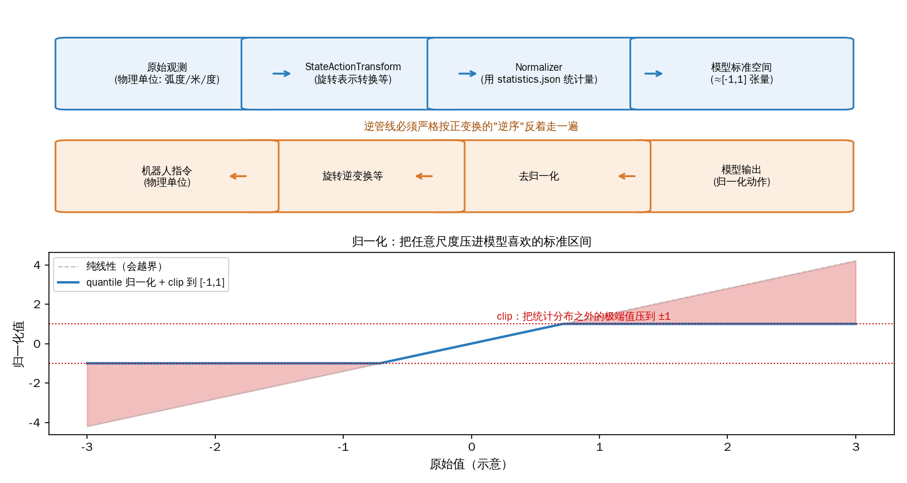
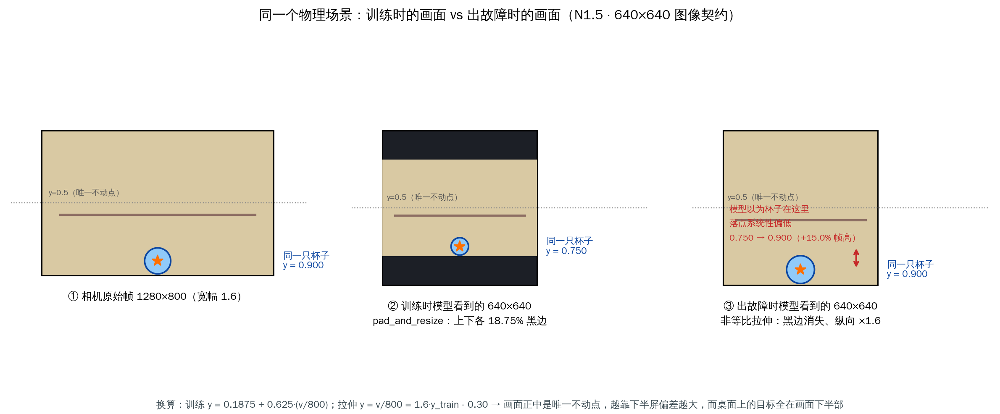
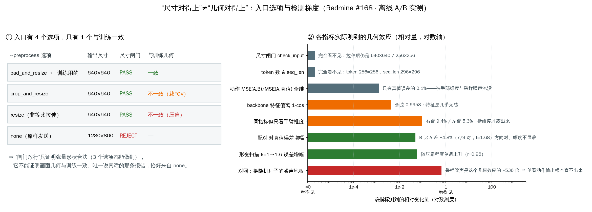

# 02 · 观测处理与数据变换（归一化 / 反归一化 / 旋转）

> 目标：理解进入模型前"观测数据"是怎么变成模型要的格式的，以及模型输出又是怎么变回真实动作的。
> 对应代码：`Isaac-GR00T/gr00t/data/dataset.py`、`schema.py`、`data/transform/base.py`、`data/transform/state_action.py`

## 1. 为什么需要数据变换？（原理动机）

- **传感器来的数据"不规整"**：不同相机分辨率、不同关节类型、数值量纲不同（角度/米/伏特）。
- **模型喜欢"规整"的数据**：训练时数据已被归一化到固定统计范围，推理时若不归一化会"失配"，
  输出质量下降。
- 但**动作要作用于真实机器人**，物理量必须是"米/弧度"等真实单位 —— 所以出口要**反归一化还原**。
- 此外不同机器人用不同的**旋转表示**（轴角 / 四元数 / 6D / 欧拉角）。为统一，可以**旋转到目标表示**。

一句话：**入口做"从物理量 → 标准空间"，出口做"从标准空间 → 物理量"**。这对操作必须可逆
（所以相关的变换类实现 `InvertibleModalityTransform`）。

## 2. 核心数据结构

### 2.1 `ModalityConfig` —— 每种模态怎么采样
在 `dataset.py`：
```python
class ModalityConfig(BaseModel):
    delta_indices: list[int]  # 相对当前时刻采样的时间偏移
    modality_keys: list[str]  # 该模态要加载的 key
```
- **delta_indices**：比如 `[-2, -1, 0]` 表示取"当前帧及前两帧"（都是 <= 0，因为推理时没有未来）。
  它同时决定了 `horizon`（时间步数 = len(delta_indices)）。
- 视频、状态、动作各有自己的 `ModalityConfig`。

### 2.2 `DatasetMetadata` —— 归一化需要的"统计信息"
在 `schema.py` 里：
```python
class DatasetStatisticalValues:  # max/min/mean/std/q01/q99
class DatasetStatistics:
    state: dict[str, DatasetStatisticalValues]
    action: dict[str, DatasetStatisticalValues]
class DatasetMetadata:
    statistics: DatasetStatistics     # 各 key 的统计量
    modalities: DatasetModalities     # 各模态元数据（形状、是否连续、旋转类型、是否 absolute）
    embodiment_tag: EmbodimentTag
```
这些统计量是从**训练数据集**算出来的（`calculate_dataset_statistics`），推理时通过
`metadata.json`（按 embodiment_tag 组织）加载进来，作为归一化的"标尺"。见 policy.py 的
`_load_metadata`。

## 3. 变换的组合与执行

### 3.1 `ComposedModalityTransform`（变换"流水线"）
`transform/base.py`：
- 由一串 `ModalityTransform` 组成（视频增强、转 tensor、归一化……）。
- `apply(data)`：**按顺序**逐个调用每个变换的 `apply`。
- `unapply(data)`：**按逆序**只对可逆变换逐个调用 `unapply`（因为反归一化要倒着来）。
- 关键：`__call__` = `apply`，所以 `policy` 里 `self._modality_transform(obs)` 会走整条流水线。

### 3.2 `set_metadata`（让变换"认识"数据统计）
变换自己是"空的"，需要 `set_metadata(DatasetMetadata)` 注入统计量后才会真正归一化。
`policy.py : _load_metadata` 就是从 `experiment_cfg/metadata.json` 读好并调 `set_metadata`。

## 4. 归一化是怎么算的？（`Normalizer`）


*图：自绘——上半：观测从"物理单位"进"模型标准空间"的正管线，与动作还原的逆管线（**逆序**执行是铁律，对应 §6 的 `apply`/`unapply`）；下半：下表 q99 模式的几何直观——按分位数线性拉伸后 clip 到 [-1,1]，极端值被压平（防御分支见正文）*


`state_action.py` 里的 `Normalizer` 支持多种模式：

| 模式 | 公式（forward 归一化） | 反归一化（inverse） | 输出范围 |
|---|---|---|---|
| `q99` | `2*(x-q01)/(q99-q01) - 1`，再 clip 到 [-1,1] | `(x+1)/2*(q99-q01)+q01` | [-1,1] |
| `mean_std` | `(x-mean)/std` | `x*std+mean` | 不固定 |
| `min_max` | `2*(x-min)/(max-min)-1` | `(x+1)/2*(max-min)+min` | [-1,1] |
| `binary` | `(x>0.5)` 二值化 | `(x>0.5)` | {0,1} |

注意防御性设计：当 `q01==q99` 或 `std==0`（常量通道）时归一化无定义，代码用 mask 保持原值 /
置 0，避免除零。这些统计量按"每个通道/维度"存，所以是逐维归一化。

## 5. 旋转表示转换（`StateActionTransform`）

- 不同机器人/数据集用不同旋转表示。为统一（例如都转成 `rotation_6d`），用 `RotationTransform`。
- 实现方式：**总是先转成 `matrix`，再转到目标表示**（以矩阵为中间表示），因此一定可逆。
- `RotationTransform.forward` / `.inverse` 负责正/反转换，保证可逆链。
- 对**绝对旋转**：转成目标表示后用 `min_max` 归一化（因为可以用表示的理论边界，如 rotation_6d 是 [-1,1]）。
- 对**相对旋转**：边界未知，不能这样归一化（代码直接报错，避免错误）。

## 6. 一次推理中变换的完整落点（回看 policy.py）

```python
normalized_input = self.apply_transforms(obs)              # === self._modality_transform(obs) === apply 正变换
normalized_action = self._get_action_from_normalized_input(normalized_input)  # 模型前向
unnormalized = self._get_unnormalized_action(normalized_action)  # unapply 反变换(倒序)
```
- `apply_transforms` 走 `apply`：视频转 tensor/增强 + state/action 旋转 + 归一化。
- `_get_unnormalized_action` 走 `unapply`：把模型输出的归一化动作还原成物理动作。

## 7. 真实故障案例：图像预处理与训练不一致（真机复盘 · Redmine #168）

> 一句话教训：**"尺寸对得上" ≠ "几何对得上"**。本章前面讲的是"入口归一化要和训练一致"，
> 这一节是同一条纪律在**图像几何**上失配的真实代价——而且它全程没有任何一条检查报错。

### 7.1 现象（只讲事实，不做归因）

N1.5 倒茶任务换用新版 client 后，真机**任务失败**。两段现场录像（手持手机、第三人称视角）：

- **录像一（8.1 s）**：夹爪**全程张开**，手臂先在半空**悬停**数秒，随后**大幅横向扫动**到托盘
  另一侧的桌面，**自始至终没有碰到任何物体**（杯子、壶都留在原地）；
- **录像二（17.9 s）**：这一轮**抓握是成功的**——壶被举起、移到杯子一侧，但在**离桌面还有明显
  高度时就张开了夹爪**，壶当场侧翻倒在桌上（这不是"放回"，是松手），随后有人伸手进画面扶正；
- 两段录像是**同一台机器人、同一份权重、同一套（新）client**，所以它们**不构成"改前/改后"对照**，
  只能证明"**新链路连着两次都失败**"——这一点直接决定了 §7.5 的归因纪律。

失败形态本身带信息量：它是"**动作块彼此矛盾、末态失稳**"，而**不是**关节级抖动或固定方向偏差——
前者指向**模型输入不对**（每个 chunk 都想往不同方向修正 → 悬停；窗口切换处不连续 → 横扫；
收尾阶段方向突变 → 高抬状态下松手），后者才指向底层控制/标定。

同时它也约束了归因的**粒度**：录像二能抓稳，说明"目标在哪"没有完全错；失败集中在
**越到后半程（倾倒、放回）越不可控**——这与 §7.3 会算出来的"**偏差随画面位置而变，越靠下半屏越大**"
是自洽的，而与"整幅图平移/尺度全错"（那种情况通常连抓都抓不到）不自洽。

> **调试提示**：两段录像是**第三人称手持视角**，不是模型看到的画面。模型输入是相机原始帧经预处理后的
> 640×640。所以"视频里看着还行"与"模型看到的图对不对"是两件事——排障时必须把**模型输入侧的图**
> 直接 dump 下来看（§7.5 的 A/B 就是这么做的），而不是靠人眼在监控视频里推断。

> **素材入库（2026-09-24）**：`workspace/docs/robot.mp4`（16.3 s，1280×720 横拍）——内容与上文
> **录像一**的失败形态一致：夹爪全程张开，半空短暂悬停后**大幅横向扫动**至托盘另一侧，
> **自始至终未触碰壶/杯**（两件物体全程留在原地，末段人入画干预）。时长与 §7.1 记录的
> 8.1 s 不符，应属**同轮失败的另一机位/另一段剪辑**，归档时不改动上文叙述。
> 配套素材：加速 2× 动图 `images/ch02/n15_pour_fail_demo.gif`、八帧胶片条
> `images/ch02/n15_pour_fail_strips.jpg`（再生成：`python3 tools/mk_gif_n15_pour.py --src …/robot.mp4 --out images/ch02/n15_pour_fail_demo.gif --speed 2 --width 420 --fps 6`）。
> 对着 §7.1 的"失败形态自带信息量"读这组胶片：**不是**关节抖动、**不是**固定方向偏差，
> 而是 chunk 间互相矛盾的横扫——这正是"模型输入不对"的影像指纹。

### 7.2 链路事实（定位结论）

| 环节 | 训练时 | 出故障时 |
|---|---|---|
| 相机原始帧 | 1280×800 | 1280×800 |
| 发送前预处理 | `pad_and_resize`：上下各补 240 黑边 → 1280×1280 → 640×640 | **只剩等比 resize** → 640×400 |
| server 端收到 640×400 | 不会发生 | 被 `check_input` 拒收 → 临时**非等比拉伸**成 640×640 |

结论：**不是权重问题，不是 NPU 算子问题**，而是入口几何预处理与训练不一致；
而"为了先跑通"补的那次拉伸，恰好把全链路唯一还在报警的闸门给拆掉了。

### 7.3 拉伸到底错在哪（算得出来的账）

训练帧的纵向结构是**固定**的：`1280×800 →（上下各补 240 黑边）→ 1280×1280 → 640×640`，
即**上下各 18.75% 是纯黑，画面内容只占中间 62.5%**。设相机原生行号 `v`、`ŷ = v/800`：

```
训练：y_train   = 0.1875 + 0.625·ŷ
拉伸：y_stretch = ŷ = 1.6·y_train − 0.30
```


*图：同一只杯子在"训练时的画面"里 y=0.750，在"出故障时的画面"里 y=0.900。画面正中 y=0.5 是唯一不动点，越靠下半屏偏差越大——而桌面上的杯子、壶把恰好全在画面下半部。*

| 场景位置 | 训练 y | 出故障时 y | 偏差 |
|---|---|---|---|
| 内容顶边 | 0.1875 | 0.000 | −18.75% 帧高 |
| 画面正中 | 0.500 | 0.500 | 0（唯一不动点） |
| 桌面 / 杯子 / 壶把（内容底边） | 0.8125 | 1.000 | **+18.75% 帧高** |

三重后果：① 纵向尺度整体 ×1.6（模型学到的"像素位置 → 末端位移"被系统性放大）；
② 目标全落在偏差最大的下半屏；③ 训练时约 1/3 的图像行是纯黑，现在全变成有内容的像素，**图像 token 的内容统计整体漂移**
——注意是"内容统计"变了，**token 数一个都不会变**（§7.6 实测），所以形状监控抓不到。

#### 7.3.1 这条契约不是推测：官方 demo 数据实测

上面 18.75% 是**从 1280×800→640×640 推出来的**。能不能不看采集脚本就把它**量**出来？能——
NVIDIA 随仓库发的 `Isaac-GR00T/demo_data/` 就是训练用的数据格式，逐帧量它的行亮度剖面即可
（`decord` 读帧 → 逐行均值 > 2 视为有内容）。2026-09-17 实测：

**① 黑边就写在训练数据里**（`robot_sim.PickNPlace`，gr1 本体，5 集 × 4 个采样帧 = 20 帧全一致）：

| 实测项 | 数值 |
|---|---|
| 训练帧分辨率 | 256×256（`meta/info.json` 与 checkpoint `experiment_cfg/metadata.json` 的 gr1 条目一致） |
| 顶部纯黑行 | 48/256 = **18.75%** |
| 底部纯黑行 | 48/256 = **18.75%** |
| 内容区 | 第 48–207 行 → 高 160、宽 256 ⇒ 内容宽高比 **1.600** |
| 跨集/跨帧稳定性 | 5 集全部 416/470/470/412/328 帧，采样帧全部 (18.75, 18.75, 160) |

1.600 正好是 1280×800 的原生宽高比，48/256 正好是 240/1280。
⇒ 训练数据**确实**是 `resize(pad(1280×800, 上下各 240), 640×640)` 造出来的，
letterbox 属于**数据的一部分**，不是某个 client 的实现细节。

**② 但黑边比例不是通用常数**——同一目录其它演示集**根本没有黑边**（同一套代码实测）：

| 演示数据集 | 相机 | 分辨率 | 内容宽高比 | 上/下黑边 |
|---|---|---|---|---|
| robot_sim.PickNPlace | ego_view | 256×256 | 1.600 | **18.75% / 18.75%** |
| cube_to_bowl_5 | front | 640×480 | 1.333 | 0 / 0 |
| libero_demo | image | 256×256 | 1.000 | 0 / 0 |
| droid_sample | exterior_1_left | 320×180 | 1.778 | 0 / 0 |
| simplerenv_fractal_sample | image | 320×256 | 1.250 | 0 / 0 |
| simplerenv_bridge_sample | image_0 | 256×256 | 1.000 | 0 / 0 |

⇒ 两条结论，都是纪律性的：
- **letterbox 比例是 per-数据集 / per-checkpoint 的**，换本体换数据就要重新量。
  所以修复方案里**不允许出现"上下各补 15% 黑边"这种硬编码常数**，
  只允许"**从随权重走的训练数据里量出来的常数**"。
- 反过来也成立：**"画面有黑边"不是通用不变量**。本章末小测里那条"内容结构检查"要用在
  已经确认过黑边存在的数据集上（或改成"与训练帧的行亮度剖面结构比对"），否则会误伤。

### 7.4 为什么全链路没有任何一道检查报警（本案例最贵的部分）

| 检查点 | 代码位置 | 拉伸后的结果 |
|---|---|---|
| 尺寸闸门 | `data/transform/video.py:525-545` `VideoToTensor.check_input` | 纵横比回到 1.0 → **通过** |
| 框架补救 | `experiment/data_config.py`：链路只有 `VideoToTensor`+`VideoToNumpy` | 无 `VideoResize`/`VideoCrop` → **不修复** |
| 视觉预处理 | `backbone/eagle2_hg_model/preprocessor_config.json`：`do_resize=false`、`do_pad=false`、`pad_during_tiling=false` | 只挑 tile 网格再 resize 进去 → **不修复** |

而且**形状指标与训练逐项相同**（Eagle 按纵横比选 tile 网格，`tile=224`、
`tokens_per_tile=256`、`max_dynamic_tiles=12`、`use_thumbnail=true`，且
`do_resize=do_pad=pad_during_tiling=default_to_square=false`）：

| 喂进模型的图 | 纵横比 | tile 网格 | tiles（含缩略图） | 图像 token 数 |
|---|---|---|---|---|
| 640×640（训练契约） | 1.00 | 3×3 | 10 | **2560** |
| 640×400（宽幅原比例） | 1.60 | 3×2 | 7 | 1792 |
| 640×640（拉伸而来） | 1.00 | 3×3 | 10 | **2560** ← 与训练完全一致 |

（上表按 tiling 规则**推算**；在 demo 契约 256×256 上离线**实测**是 1 个 tile / 256 个图像 token /
seq_len 296，A 与 B 逐项相同，见 §7.6。）

⇒ 形状级、日志级、精度级检查**全绿**，只有像素内容被纵向拉长了 1.6 倍。
当初那句 `invalid resolution (640,400) expected (640,640)` 是全链路唯一说真话的地方。

正确的做法其实很简单：**server 端那一步本该"补边"而不是"拉伸"**。收到任意宽幅帧时
等比缩放到目标内接矩形、再居中补黑边——这与训练路径 `resize(pad(1280×800), 640×640)`
数学等价（同一个 0.5 倍相似变换，只是补边从 240 变 120），因此即使发送端删掉了预处理，
模型侧也能自洽还原训练几何。

#### 7.4.1 四条补充证据（为什么"再检查一遍"也发现不了）

1. **入口有 4 个选项，3 个都能骗过闸门。** 老 client `run_client.py:64` 提供
   `--preprocess {crop_and_resize, pad_and_resize, resize, none}`，而 `conf/client_conf.py:56-57`
   的默认值正是 `pad_and_resize` + `preprocess_size=[640,640]`，
   `client/utils/misc.py:46-80` 的实现是"上下各补 240 → `INTER_AREA` 缩放"，
   与 §7.3.1 量到的 18.75% **逐像素吻合**。但这四个选项里
   `pad_and_resize` / `crop_and_resize` / `resize` **输出都是 640×640**、都能过闸门，
   只有 `none` 会被拒——**"能通过检查"和"与训练一致"之间有 2/3 的误判率**。
2. **server 端不做任何几何修复。** `server/core/vla_server.py:67,84,92` 对图像只做
   `cv2.imdecode(..., IMREAD_COLOR)`（深度图 `IMREAD_ANYDEPTH`），解出来什么尺寸就是什么尺寸。
   ⇒ 几何契约**只在发送端**，server 只能靠 `check_input` 那一道尺寸断言兜底。
3. **框架自己也会踩同一个坑。** `gr00t/utils/video.py:225-226` 的
   `cv2.resize(frame, resize_size)` 是**非等比**的，被
   `CachedLeRobotSingleDataset(img_resize=...)` 使用；更隐蔽的是
   `gr00t/data/dataset.py:947-951` 在 resize 之后**把 metadata 里的 resolution 也改写了**
   ⇒ 拉伸一旦发生，下游看到的"分辨率"是被改写后的值，**再也查不出来**。
4. **事故现场那份权重的几何契约根本不在开源树里。** `conf/models_conf.py:24-25` 写的是
   `embodiment_tag='a2d'`、`data_config_key='a2d_arms_only'`，而这两个 key **不在**本仓库的
   `DATA_CONFIG_MAP` 中（外部私有配置）⇒ 连"训练时到底怎么处理的图"都无法从开源代码里查，
   只能靠 §7.3.1 那种**从数据侧实测**的办法还原。

### 7.5 能迁移到任何具身智能系统的四条纪律（→ 普遍原理）

1. **契约放在哪里，决定它会不会被改坏。** 数值契约（归一化 stats、分辨率）在 checkpoint 里、
   由 `set_metadata` 注入，所以很难错；**几何契约当时哪里都不在**，只活在采集数据的那个脚本里——
   它必然会被改坏。要把"如何从传感器帧构造模型输入"整体收进随权重走、可校验的一层。
2. **"让检查通过的临时兼容代码"通常是在拔传感器，而不是在修问题。** 宁可让它报错：
   报错的成本是一次停线，静默的成本是一次真机失控。任何非等比缩放在入口处就该被拒绝。
3. **归因必须有控制变量，而且要说清"证据强度"。** 两段录像同属新 client，就只能证明
   "新链路连着失败"，**不能**证明"预处理是唯一原因"（本案例第一版分析就犯了这个错：把两段录像
   当成改前/改后，写了句"行为差异是一个数量级"——那是拿没有对照的观察当对照，已作废）。
   要说的是**链路证据**：配置项差异 + 三处模型侧代码行为 + 静默性证明；剩下的确证交给
   **离线只差一步的 A/B**（结果见 §7.6）——同一帧只改那一步图像几何，喂同一个 server，比
   ① 闸门、token 数、`seq_len`（实测**逐项相同**，这就是"当时没人发现"的直接证据）
   ② `backbone_features` 余弦（实测 0.9958：特征看着没坏，恰好解释"全链路无报警"）
   ③ action chunk 的 MSE、前几步方向夹角、**对真值动作的误差**与**跨 chunk 重叠段分歧度**。
   ⚠️ 但 §7.6 也证明：第 ③ 项**很容易被采样噪声与无关维度淹没**（本例几何信号只有种子噪声的
   1/536），所以"A/B 没测出差异"**不能**反过来当成"预处理没问题"的证据——检测手段本身要先验证。
4. **一次"顺手改了一堆"的换版，不能只归因给最可疑的那一条。** 新 client 里除了预处理，还可能
   同时动了机位/内参、状态拼接顺序、语言指令文本、发送频率、JPEG 编码参数、RGB/BGR 约定。
   结案前对每一项做**一分钟排除**（尤其 R/B 互换：两端都用 cv2 时自洽，只有一端多一次
   `cvtColor` 就翻车且**不报任何错**）。最省事的办法是**同一段录制的观测**离线回放两套预处理，
   把控制侧因素一次性摘掉。


### 7.6 离线只差一步的 A/B：实测结果，以及它能证明/不能证明什么

§7.5 第 3 条纪律欠的那个实验终于做了。**先把结论摆前面**：它证实了"整条监控链结构性失明"，
但**没有**证实"动作输出会明显发散"——第一版分析里那句预测被打掉了，所以这一节同时是
"如何用离线 A/B 给自己纠错"的示范。

#### 7.6.1 实验设置（`tools/redmine168_preproc_ab.py`）

2026-09-17，L20 GPU，**base 权重** `nvidia/GR00T-N1.5-3B` + 演示集 `robot_sim.PickNPlace`
（gr1 本体 / `fourier_gr1_arms_only` / `denoising_steps=4`）。从官方训练帧裁出内容区
（256×160，宽高比 1.600）当作"相机原生帧"，**只改构造模型输入的那一步**：

| 变体 | 做法 | 对应现实 |
|---|---|---|
| `A_pad` | 等比 + 居中补黑边 → 256×256 | 训练契约（老 client `pad_and_resize`） |
| `B_stretch` | 非等比拉伸 → 256×256 | **事故做法**（server 端补尺寸） |
| `C_raw` | 原样 256×160 直接发 | 新 client 删掉预处理后**本该发生**的事 |
| `A2_official` | 官方训练帧原样 | 参照系 |

**契约自证**（先证明实验里"对的一方"真的是对的）：`A_pad` 与官方原帧逐像素 MSE = **0.061**
（0–255 尺度），A2 与 A 的对真值动作误差只差 0.0005 ⇒ A 确实复现了训练契约，后面的比较才有意义。

#### 7.6.2 五层指标实测


*图：左图是入口的"三送一"陷阱（3 个选项都能过闸门，只有 1 个与训练一致）；右图是各指标实际测到的几何效应大小（对数轴），最下面那条红色是参照物——换随机种子的采样噪声。*

| 层 | 指标 | A | B | 判读 |
|---|---|---|---|---|
| 闸门 | `check_input` | **PASS** | **PASS** | `C_raw` 被拒：`has invalid resolution (256, 160), expected (256, 256)`——生产环境那条报错的原样 |
| 形状 | `pixel_values` / `image_sizes` | `[1,3,224,224]` / `[[224,224]]` | 同左 | 逐字节同形 |
| 形状 | Eagle 图像 token / LLM `seq_len` | **256 / 296** | **256 / 296** | **完全相同 ⇒ 任何形状/日志监控必然漏检** |
| 特征 | backbone 特征余弦(A,B) | — | **0.9958** | 只偏离 0.42%，特征层监控也几乎无感 |
| 动作 | action chunk MSE(A,B)（同种子） | — | **0.002436** | 前 5 步方向夹角仅 **1.3°** |
| 动作 | 换随机种子的噪声地板（5 种子配对 MSE） | 1.3056 | 1.3014 | **几何信号只有采样噪声的 1/536** |
| 时序 | 跨 chunk 重叠段分歧 / 单步位移 | 2.61 | 2.66 | 两组都 ≫1（这一集本身前后矛盾），**该代理指标不区分 A/B** |

⇒ "**为什么当时没有任何报警**"至此不需要推测：闸门放行、tile 网格与 token 数与 `seq_len` 逐项相同、
特征余弦 0.9958。**但**"拉伸会让动作明显发散"在这份 base 权重上**没有复现**。

#### 7.6.3 为什么聚合动作指标是一把坏尺子（必须拆维度）

| 动作分组 | MSE(A,B) | MSE(A,真值) | MSE(B,真值) | 真值功率 | 几何占该维误差 |
|---|---|---|---|---|---|
| `action.left_arm`(7) | 0.001155 | 0.0219 | 0.0173 | 0.621 | **5.3%** |
| `action.right_arm`(7) | 0.007758 | 0.0825 | 0.0545 | 0.601 | **9.4%** |
| `action.left_hand`(6) | 0.000015 | **4.5012** | 4.5020 | 4.500 | ≈0%（且 R²≈0：模型对这 6 维几乎恒输出 0） |
| `action.right_hand`(6) | 0.000143 | 0.000584 | 0.001001 | 4.500 | 25%（该维模型预测得很好） |

两点：① 聚合 MSE 里约 **2/3 来自两个手部维度**，其中 `left_hand` 的 `MSE ≈ 真值功率`
（`R² = 1 − 4.5012/4.5000 ≈ 0`）——base 权重在这集上根本不动左手，**聚合数字被一个"本来就废"的
维度主导**，什么都能被它平均掉；② 一旦**只看手臂维度**（真正决定末端轨迹的那 14 维），
几何失真立刻占该维误差的 **5%–9%**，"看得见"了。
⇒ 通用教训：**任何"模型输出对比"指标都必须按维度分组看**，聚合值会同时被"无关维度"和
"采样噪声"两头稀释。

#### 7.6.4 方向对、幅度不足：配对统计怎么算才算诚实

单看"A 的误差 2.005、B 的误差 2.069"是没有用的——两个数各自的种子间标准差是 **1.01**，
远大于它们的差。正确做法是**配对**：同一个 (帧, 随机种子) 组合只换图像，再逐对做差。

| 配对比较 | 结果 | 判读 |
|---|---|---|
| 对真值动作误差，帧 [0, 200, 399] × 3 种子 = 9 对 | A 1.6424 / B 1.7210；配对差 **+0.0786 ± 0.1402**（**+4.8%**），B 更差 **7/9** 对，t = **1.68** | 方向一致，但 **t<2**：这份权重 + 这一集上效应小于可分辨下限，**不能称显著** |
| 形变系数扫描 k=1.0→1.6（每点 3 种子；**两个端点就是 A 与 B**：`distort(k=1.6)` 与 `B_stretch` 逐像素只差 78（重采样顺序），而 B 与 A 相差 13546） | 对真值 MSE 1.9377 → 1.9911 → 2.0396 → 2.0466；k 与误差相关系数 **r = 0.96**；末/首 = **1.06** | 聚合趋势**单调**上升（越压扁越差） |
| 同一扫描的**逐对符号**一致性 | 只有 **1/3** 对为正 | 3 个种子太少，**符号都不稳**，所以只能说"方向一致"，不能说"每对都更差" |

#### 7.6.5 诚实的结论（这一版取代第一版的猜测）

1. **能证明（强证据）**：整条链路对"非等比拉伸"是**结构性失明**的——尺寸闸门放行、
   tile 网格 / 图像 token 数 / `seq_len` 逐项相同、backbone 特征余弦 0.9958。
   "当时没有任何报警"由此从推测变成实测。
2. **不能证明**：用"看动作输出"给这次故障归因。几何信号（0.0024）比采样噪声（1.31）
   小近 3 个数量级；配对检验 t=1.68 不到显著门槛。**任何声称"拉伸导致动作发散"的
   表述都应当撤回**（包括本课程第一版里的那句）。
3. **方向是一致的（弱但正）**：越压扁，对真值动作的误差越大（r=0.96）；拆到手臂维度，
   几何占该维误差 5%–9%。
4. **那真机为什么还是摔了壶？** 合理的解释是误差的**系统性**而非**大小**——但这几条
   **本实验没有复现，只能列为待验证假设**：
   ① 随机噪声在时间上不相关、闭环里被平均掉，而拉伸偏差每帧同向、会被**积分**放大；
   ② 现场是**微调权重**（归一化更紧、动作分布更窄），base 权重在演示集上本来就"不做任务"
   （左手恒输出 0 就是证据），信噪比完全不同；
   ③ 现场输入是 640×640，几何误差作用在 **10 个 tile** 上，而本实验的 256² 契约只有 **1 个 tile**。
5. **对课程主线的影响：纪律只会更强**。正因为动作层面量不出来，几何契约**只能靠入口直接校验**
   （量训练帧的行亮度剖面 → 随权重走 → 发送前断言），**绝不能**靠"上线看效果"。

#### 7.6.6 复现

```bash
conda activate gr00t
MP=$(ls -d ~/.cache/huggingface/hub/models--nvidia--GR00T-N1.5-3B/snapshots/*/ | head -1)
# 1) 跑 A/B（约 12 min：4 个变体 + 5 种子噪声地板 + 9 组配对 + 12 次扫描推理）
HF_HUB_OFFLINE=1 TRANSFORMERS_OFFLINE=1 CUDA_VISIBLE_DEVICES=3 \
  python tools/redmine168_preproc_ab.py --model-path "$MP" \
      --seeds 5 --sweep 1.0,1.2,1.4,1.6 --sweep-seeds 3 --gt-frames 3 \
      --out /tmp/preproc_ab_final.json
# 2) 用结果 json 画 §7.6 的配图
python tools/mk_fig_preproc_gate.py --json /tmp/preproc_ab_final.json \
        --out images/common/preproc_gate.png
```

> 结果表的全部数字都在 `/tmp/preproc_ab_final.json` 里（脚本每阶段增量落盘，中途被杀也不丢）。

> **小测**：① 为什么"拉伸后 token 数与训练完全一致"反而比"token 数变了"更危险？
> ② 若加一条**黑边不变量检查**（首/末各约 15% 行应接近纯黑），它为什么能抓到一个尺寸检查全绿的 bug？
> ③ §7.6 里几何信号只有采样噪声的 1/536、配对 t 只有 1.68，为什么这**不**能当作"预处理没问题"的证据？
> 参考答案见 §7.4/§7.5/§7.6：① 形状指标无法覆盖几何；② 黑边是训练分布的一部分，检查的是
> **内容结构**而不是张量形状（但注意 §7.3.1：黑边比例必须实测，不是通用常数）；
> ③ 因为**仪器本身要先验证**——聚合动作 MSE 被无关维度（左手恒输出 0）与随机种子噪声双向稀释，
> 检验不显著只说明"这把尺子不够长"，不说明"没有误差"。

### 7.7 修复后的真机成功演示：失败案例的闭环记录（2026-09-24 实测视频）

> 视频：`workspace/docs/n15_robot.mp4`（102.8 s，720×1280 竖拍，30 fps）。
> 全片加速 4× 动图：`images/ch02/n15_pour_demo.gif`（再生成：`python3 tools/mk_gif_n15_pour.py`）。
> 部署拓扑：**不是远端 GPU 服务器**——推理主机就在机器人身后地板上，模型在**一块 NPU** 上跑
> （服务化链路与第 07/08 章相同，硬件侧对应第 09 章的 NPU 线；桌面立牌写"云侧推理"仅指
> "推理不在机器人本体上"）。

三幕时间线（关键帧存 `images/ch02/`）：

| 时刻 | 画面 | 关键帧 |
|---|---|---|
| ~14 s | 双臂展开接近：一臂伸向装红茶的玻璃壶，另一臂（夹爪上挂腕部相机）在杯侧待命 | `n15_pour_approach.jpg` |
| ~58 s | 提壶、腕部外旋倾壶，茶汤注入茶盘上的玻璃杯，另一臂杯侧护持 | `n15_pour_pour.jpg` |
| ~98 s | 回壶放平、双臂收中立位，杯中约半杯茶，任务完成 | `n15_pour_retract.jpg` |

**闭环验证的两处修复**（本节的重点——都落在 §7.5 第 1 条纪律上，但各占一个不同维度）：

| # | 故障 | 修复 | 教学定位 |
|---|---|---|---|
| ① | **几何**：新 client 送"扁图"（宽幅矩形），N1.5 只认方图 | 前处理改为**上下补黑边再缩**到方图 | 注意口径：补边在这里**不是**§7.3 那种违规——判定标准从来不是"补没补边"，而是**与训练数据的加工是否一致**。训练集若本就是"扁图上下补边成方图"，推理补边恰是把契约恢复；#168 的病根也是"推理与训练不一致"，而非"resize/pad 本身" |
| ② | **颜色**：新 client 与 server 的图像 **RGB 通道序不匹配** | 改 server 端适配 client 端 | 又一个**安静错误**家族成员：形状全对、token 数不变、任何监控不报警，错的只是像素统计意义（R↔B 互换 → 红色茶汤的亮度/色相分布全变）。与 §7.4.1 "再检查一遍也发现不了"同族，靠肉眼对比两端 dump 帧即可当场抓获——**通道序应写进入口契约并做一次 dump 互验** |

> 一句话收束 §7 全章：#168 用一次真机失败立了规矩（失败形态动图见 §7.1 素材入库：
> `n15_pour_fail_demo.gif`，与成功版 `n15_pour_demo.gif` 对照即是最好的教具），本节用一次
> 真机成功验收了规矩——
> 几何与通道序两处修复都是"**入口变换与训练对齐**"这一条纪律的还账；两处修完即通过闭环
> 倒茶，说明该任务线上残余误差已被这俩预处理错位解释干净。

## 8. 本章小结

- 数据变换发生在"模型前后各一次"：入口归一化、出口反归一化，必须可逆。
- 变换是**组合流水线**（`ComposedModalityTransform`），apply 正序 / unapply 逆序只对可逆变换。
- 归一化依赖从训练集统计出的 `DatasetMetadata`（q99/mean_std/min_max/binary），逐维处理，含除零保护。
- 旋转表示统一靠"矩阵中转"的可逆变换。
- **图像几何也是"数据变换"的一部分**：训练时的 letterbox 属于输入契约，尺寸检查通过不等于几何一致（§7 真机案例）；
  比例是 per-checkpoint 的，只能**实测**（§7.3.1），不能硬编码。
- **静默故障要靠"离线只差一步的 A/B"闭环**，而 A/B 本身要先验证仪器：形状/特征层实测全盲，
  聚合动作指标被无关维度与采样噪声稀释（§7.6）——所以几何契约必须在**入口**校验，不能靠看效果。

## 附 · 课后问答总结（Q&A 交互记录）

> 以下来自课堂教学问答，帮助学生把易混/易错点钉牢。

**Q1 归一化"作用"在哪里？图像/语言要不要统计归一化？**
- 真正用统计量做**逐维归一化**的是 `state.*` / `action.*`（连续物理向量：不同关节的量纲/尺度差异大，
  归一化让各维度尺度一致、数值稳定，避免某维度范围天然就大而盖过其它维度）。
- 图像（`video.*`）走 backbone 的 **processor**（resize/减均值除方差那套），语言（`annotation.*`）直接用 **token**，
  两者都不是 state 那种统计归一化。所以"对不同量纲统一对齐"只对 state/action 精确。

**Q2 为什么必须"反归一化"（为什么必须可逆）？**
- 模型内部工作在**无量纲的标准空间**；输出若不还原，只是一堆没有物理单位的数字，机器人控制器无从执行。
- 所以出口必须用入口归一化的**逆运算**把数值还原成物理单位（弧度/米）。只有 apply 没有 unapply → 机器人拿到"标准空间假动作"。

**Q3 观测 delta_indices 的两条铁律？**
- ① 全部 `<= 0`（推理时没有未来观测，只能取历史+当前）；② 最后一个必须是 `0`（必须用上最新一帧）。
- 通常升序排到 0：如 `[-4,-3,-2,-1,0]`。

**Q4 真实代码里的取值？（重要差异）**
- `action_indices = list(range(16))` → `[0,1,...,15]`，`action_horizon = len(...) = 16`。
- 但本仓库观测 `observation_indices = [0]`（**单帧观测**）！教学里用的 `[-4..0]` 是"机制支持的历史窗口"的
  **通用示例**，当前配置文件其实只用当前一帧。
- 语义区别：观测里 `0`="当前帧"；动作里 `0`="下一步要执行的动作"（同一套 delta 语言，观测回看历史、动作展望未来）。

**Q5 组合变换为什么 unapply 要逆序（LIFO）？**
- 先被处理的最后才被还原：入口 A→B→C，出口 C→B→A。像穿衣/脱衣：先穿内衣再外套，脱时先脱外套。
- 代码 `ComposedModalityTransform.unapply` 用 `reversed(self.transforms)` 实现，且只对可逆变换做。

**Q6 q01 / q99 到底指什么？**
- q01 = 序列中 **≤ 它占 1%** 的分位点；q99 = **≤ 它占 99%** 的分位点。`[q01,q99]` 包住中间 98% 数据，
  两端各 1% 的离群尾巴在归一化时被钳制。
- 是**按每个动作维度分别算**的，不是所有维度共用一个数。
- 例：q01=0, q99=10；`x=5 → x'=2*(5-0)/(10-0)-1 = 0`（中间值映到标准区间中心 0；两端映到 ±1）。

**Q7 q99 钳位能不能当"安全限幅"？（诚实分层）**
- 客观副作用：q99 在 forward 会 clip 到 [-1,1]，反归一化后动作物理值必落在 [q01,q99] 内 → **确实限制了动作幅度**，
  能防止极端异常值传到机器人。
- 但要诚实：① 主要目的是**统计稳健性**(防离群值拉宽标尺)，安全限制是副作用；② [q01,q99] 是"训练数据覆盖范围"，
  **不是机械安全极限**；③ 真安全要靠底层关节限位/速度限制，q99 只是软兜底，别当安全机制。

**Q8 归一化的"除零保护"？**
- 若某动作维度在所有数据里都同一值（如恒 0），则 `q99-q01=0` 或 `std=0`，直接除会除零；
  代码用 mask（`q01!=q99`）对常量维度保持原值/置 0，避免崩溃。

**小测参考答案**：Q1 state/action；Q2 全部 ≤0 且末尾必为 0（无未来+用最新帧）；Q3 C→B→A（LIFO）；
Q4 q99 用分位+钳制到 [-1,1]、抗离群；mean_std 用均值方差、范围不定、怕离群；Q5 set_metadata 注入训练统计，
不调用则归一化因缺标尺而无法运行。

## 自己动手

1. 打开 `state_action.py`，找到 `Normalizer.forward` 的 q99 分支，手写验证：`x=q01` 得 -1，`x=q99` 得 1。
2. 想一下：为什么 `policy._check_state_is_batched` 用 `len(v.shape)<3` 判断 `(B,Time,Dim)`？试着找原因。
3. 用 `pad_and_resize`/拉伸/不处理三种方式处理同一帧真机图，各存一张 PNG，量一下黑边占整帧高度的比例，验证 §7.3 的 18.75% / 62.5% 两个数。

## 疑问与批注

（预留：记录问题。）
