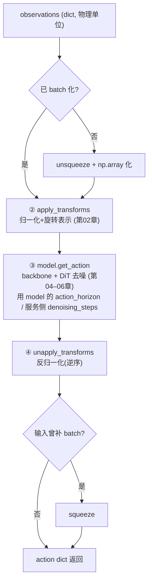

# 03 · 策略封装 Gr00tPolicy（加载 / embodiment / horizon）

> 目标：讲清 `Gr00tPolicy` 除了"get_action"之外的职责 —— 模型加载、embodiment 适配、horizon 对齐、去噪步数设定。
> 对应代码：`Isaac-GR00T/gr00t/model/policy.py`、`gr00t/data/embodiment_tags.py`

## 1. Gr00tPolicy 是什么

`Gr00tPolicy` 是 `BasePolicy` 的实现，扮演"**面向使用方的统一封装**"：
- 内部持有真实模型 `GR00T_N1_5`、变换流水线 `ComposedModalityTransform`、以及各类元数据。
- 对外暴露极简接口：`get_action(obs) -> action`、`get_modality_config()`。
- 机器人控制 / 推理服务只需要会调 `get_action`，不必关心模型内部细节。

## 2. 加载模型：`_load_model`
```python
model = GR00T_N1_5.from_pretrained(model_path, torch_dtype=COMPUTE_DTYPE)  # bfloat16
model.eval()
...
model.to(device=self.device)
```
要点：
- `from_pretrained` 会从 HF hub 或本地路径下载/加载 checkpoint（详见第 04、05 章）。
- 之后有个**关键动作**：用 `modality_config["action"].delta_indices` 期望的 `action_horizon`
  去**对齐模型 action_head 的 `action_horizon`**：
  ```python
  expected_action_horizon = len(self._modality_config["action"].delta_indices)
  if expected_action_horizon != model.action_head.config.action_horizon:
      new_action_head = FlowmatchingActionHead(new_action_head_config)  # 重建
      new_action_head.load_state_dict(model.action_head.state_dict(), strict=False)  # 拷贝权重
      model.action_head = new_action_head
      model.config.action_horizon = expected_action_horizon
  ```
  这样"策略想要输出多长的动作序列"就能与模型结构一致。

## 3. EmbodimentTag —— "本体标签"
`embodiment_tags.py` 定义了机器人本体：
```python
class EmbodimentTag(Enum):
    GR1 = "gr1"            # 人形+灵巧手
    OXE_DROID = "oxe_droid"# 单臂
    AGIBOT_GENIE1 = "agibot_genie1"  # 人形+夹爪
    NEW_EMBODIMENT = "new_embodiment"# 微调新本体
# 每个本体映射到一个 projector index（动作专家模块里的索引）
EMBODIMENT_TAG_MAPPING = { gr1:24, oxe_droid:17, agibot_genie1:26, new_embodiment:31 }
```
- 它决定了两件事：**用什么归一化统计**（加载对应 embodiment 的 metadata）和**用哪个动作投影器**。
- 这就是"一个基础模型能适配多种机器人"的机制之一 —— 换本体 = 换统计 + 换投影头，而 backbone 与
  扩散生成主体可共享。

## 4. 加载元数据与 horizon
- `_load_metadata(experiment_cfg)`：读 `metadata.json`，按 `embodiment_tag` 取统计量，
  构造 `DatasetMetadata` 并 `set_metadata` 给变换流水线（归一化才能工作）。
- `_load_horizons()`：根据 `modality_config` 计算 `_video_horizon` / `_state_horizon` 与
  `delta_indices`，并做防御检查：
  - 所有 delta_indices 必须 `<= 0`（推理时没有未来观测）；
  - 最后一个必须是 `0`（必须用上最新一帧）。

## 5. 去噪步数（denoising_steps）
```python
if denoising_steps is not None:
    self.model.action_head.num_inference_timesteps = denoising_steps
# 并且提供属性 getter/setter 可运行时调节
@property
def denoising_steps(self) -> int:
    return self.model.action_head.num_inference_timesteps
```
- 扩散/流匹配生成动作需要**多步去噪**；步数越多越精细但越慢。
- 推理可调 `denoising_steps` 在"质量 ↔ 延迟"之间权衡（第 06 章细讲原理）。

## 6. 完整 get_action（串联前两章）


*图：`Gr00tPolicy.get_action` 主链路——三个"接缝"（②③④）恰好各是一章的主题；①⑤ 是容易被忽略的 batch 对称处理*


```python
def get_action(self, observations):
    obs_copy = observations.copy()
    is_batch = self._check_state_is_batched(obs_copy)
    if not is_batch: obs_copy = unsqueeze_dict_values(obs_copy)   # 补 batch
    for k, v in obs_copy.items():
        if not isinstance(v, np.ndarray): obs_copy[k] = np.array(v)
    normalized_input = self.apply_transforms(obs_copy)                  # ② 归一化(第02章)
    normalized_action = self._get_action_from_normalized_input(normalized_input)  # ③ 模型前向(第04-06章)
    unnormalized_action = self._get_unnormalized_action(normalized_action)        # ④ 反归一化
    if not is_batch: unnormalized_action = squeeze_dict_values(unnormalized_action)
    return unnormalized_action
```
其中的批次判断：
```python
def _check_state_is_batched(self, obs):
    for k, v in obs.items():
        if "state" in k and len(v.shape) < 3:  # (B, Time, Dim) 才满足 3 维以上
            return False
    return True
```
说明：单条数据 state 是 2 维 `(Time, Dim)`，批量是 3 维 `(B, Time, Dim)`；据此动态加/去 batch 维。

## 7. 本章小结

- `Gr00tPolicy` = 模型 + 变换 + 元数据 的**统一封装**，对上层只暴露 `get_action`。
- 用 `embodiment_tag` 自适应不同机器人（统计 + 投影头）。
- 用 `delta_indices`/`horizon` 对齐模型输出长度；`denoising_steps` 调节生成质量与速度。

## 附 · 课后问答总结（Q&A 交互记录）

> 第三章课堂教学问答精华，帮助把易混点钉牢。

**Q1 Gr00tPolicy 的"对外接口"是什么？哪些是内部私有？**
- 对外只暴露两个公开方法：`get_action(obs)` 与 `get_modality_config()`（由抽象基类 `BasePolicy` 定义）。
- `_load_model` / `_load_metadata` / `_load_horizons` 都是**内部私有方法**（下划线开头），上层不直接调用。
- 对内它"组装"三样东西：模型 `GR00T_N1_5`、变换流水线 `ComposedModalityTransform`、元数据（统计/embodiment/horizon）。

**Q2 为什么 action_horizon 对齐要"重建 action head + load_state_dict(strict=False)"，而不是改数字？**
- 根本原因：`action_horizon` **焊死在权重张量的维度里**（`action_decoder` 输出层形状含 `(…, action_horizon, action_dim)`）。
  模型一旦实例化，这些权重 shape 就定死了，运行时改数字不兼容。
- 所以做法：用期望 horizon **新建一个**结构正确的 head，再 `strict=False` 把旧 head 里**形状对得上的层**拷贝过去；
  horizon 相关的输出层对不上号，就保留新 head 的初始化。
- 澄清：horizon 是 H（如 16）= "一次预测一整段未来轨迹"；部署再用"滑动窗口 (执行靠前几步、滚动再预测)"衔接。
  它**不是**靠"借鉴前面动作"来平滑，也**不是**重编号 head 的原因——重编号只因为** horizon 决定权重张量形状**。

**Q3 embodiment_tag 到底决定哪两件事 + 数值用途？**
- ① 用哪套**归一化统计**（metadata，按 embodiment 取）；② 用哪个 **category-specific 投影头**。
- `EMBODIMENT_TAG_MAPPING` 的数值（如 `gr1:24`）最终作为 **`cat_ids`（category 下标）**，
  去 `CategorySpecificLinear` 的 `W[cat_ids]` 里取那套独立权重 → 多本体共享 backbone/DiT，只换统计+投影头。

**Q4 为什么 `_load_metadata` / `set_metadata` 必须先于第一次 `get_action`？**
- 归一化（Normalizer）要拿训练统计（mean/std/q01/q99）当"标尺"；没 `set_metadata` 时统计为空/未注入，
  Normalizer.forward 取 `self.statistics["q01"]` 会 **KeyError / 断言失败** 当场中断（用报错强制遵守顺序）；
  或者尺度全错。结论：统计注入是"隐形的先后契约"，必须先于首次推理。

**Q5 denoising_steps 接到哪、怎么影响质量/延迟？**
- 属性 getter/setter 会写/读 `self.model.action_head.num_inference_timesteps`。
- 它最终就是第六章去噪循环里的 `num_steps`：`for t in range(num_steps): actions += dt*velocity`。
- 调大 → DiT 循环次数（计算量）**线性增加** → 质量更精细但**延迟更大**；调小反之。是"质量↔延迟"旋钮
  （`eval_policy.py --denoising-steps 4` 即传这里）。

## 自己动手

1. 在 `policy.py` 中画出"模型加载 → 元数据加载 → horizon 计算"的先后顺序，想一想为什么 metadata
   必须在第一次 get_action 之前 set 好（不然归一化会崩在哪？）。
2. 打开 `eval_policy.py`，看看它怎么构造 `EmbodimentTag`、`modality_config` 和 `modality_transform`，
   再把 `Gr00tPolicy` 组装起来（为下一章的模型本体做准备）。

## 疑问与批注

（预留：记录问题。）
