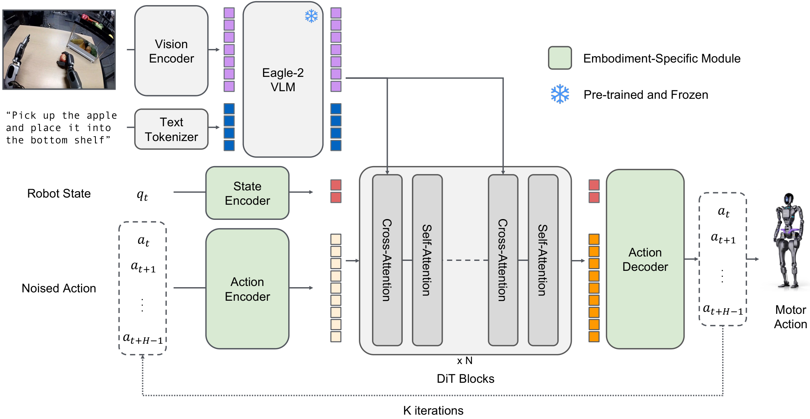

# 04 · 模型本体 GR00T_N1_5（双脑如何组装与前向）

> 目标：看 `GR00T_N1_5` 这个"容器"怎么把 backbone 和 action_head 组装起来，怎么把输入拆给两块，
> 以及推理(`get_action`)和训练(`forward`)两条路径的区别。
> 对应代码：`Isaac-GR00T/gr00t/model/gr00t_n1.py`

## 1. 双脑容器

```python
class GR00T_N1_5(PreTrainedModel):
    config_class = GR00T_N1_5_Config  # model_type = "gr00t_n1_5"

    def __init__(self, config, local_model_path):
        self.local_model_path = local_model_path
        self.backbone   = EagleBackbone(**config.backbone_cfg)          # 脑1：看懂世界(冻结)
        self.action_head= FlowmatchingActionHead(config.action_head_cfg) # 脑2：生成动作(可训练)
        self.action_horizon = config.action_horizon
        self.action_dim     = config.action_dim
        self.compute_dtype  = config.compute_dtype
```
- **backbone**：冻结的视觉-语言大模型（Eagle 2.5），负责把视频+语言编码成特征。
- **action_head**：扩散/流匹配 DiT，负责生成动作（微调时通常这里可训练）。
- 它继承 `PreTrainedModel`，因此可享受 HF 的 `from_pretrained`/`save_pretrained` 生态。


*图：白皮书模型架构图——Eagle-2 VLM（雪花=预训练冻结）+  embodiment-specific 绿色模块（State/Action Encoder、Action Decoder）+ 中间 N 层 DiT Blocks（Cross/Self-Attention 交替），底部 "K iterations" 即去噪循环。绿色模块=本课程 §4 可训练性的来源。原文：[arXiv:2503.14734](https://arxiv.org/abs/2503.14734)*


*图：N1.5 GEAR 博客官方架构图（N1.5 相对 N1 的改动：VLM 全冻、简化 adapter，见第 12 章）。原文：<https://research.nvidia.com/labs/gear/gr00t-n1_5/>*


## 2. 关键方法论：`prepare_input` 拆分

```python
def prepare_input(self, inputs):
    self.validate_inputs(inputs)                  # ① 校验输入形状/类型
    backbone_inputs = self.backbone.prepare_input(inputs)      # ② 取 backbone 要的
    action_inputs   = self.action_head.prepare_input(inputs)   # ③ 取 action_head 要的
    def to_device_with_maybe_dtype(x):
        if torch.is_floating_point(x):
            return x.to(self.device, dtype=self.action_head.dtype)  # 浮点→计算设备+半精度
        else:
            return x.to(self.device)                               # 其余保持不变
    backbone_inputs = tree.map_structure(to_device_with_maybe_dtype, backbone_inputs)
    action_inputs   = tree.map_structure(to_device_with_maybe_dtype, action_inputs)
    return backbone_inputs, action_inputs
```
两个设计要点：
- **校验先行**：`validate_inputs` 检查 video/action 的 dtype 与形状
  （例如 video 要是 `np.uint8`、6 维 `(B,T,H,W,3)`），尽早暴露"喂错数据"。
- **半精度策略**：同一份输入里，**浮点张量**被搬到计算设备并转成 action_head 的 dtype（通常 bf16），
  非浮点（如 token id / mask）保持原样。这就是混合精度在模型入口的实现。

## 3. 两条前向路径：`forward` vs `get_action`

```python
def forward(self, inputs):
    backbone_inputs, action_inputs = self.prepare_input(inputs)
    backbone_outputs  = self.backbone(backbone_inputs)
    action_head_outputs = self.action_head(backbone_outputs, action_inputs)  # 训练口径
    self.validate_data(... is_training=True)
    return action_head_outputs

def get_action(self, inputs):
    backbone_inputs, action_inputs = self.prepare_input(inputs)
    backbone_outputs  = self.backbone(backbone_inputs)
    action_head_outputs = self.action_head.get_action(backbone_outputs, action_inputs)  # 推理口径
    self.validate_data(... is_training=False)
    return action_head_outputs
```
- **backbone 两条路径相同**（推理/训练行为一致），所以都直接 `self.backbone(...)`。
- **action_head 不同**：训练走 `forward`（要 loss），推理走 `get_action`（只取 `action_pred`）。
- `validate_data` 校验输出：训练要有 `loss`；推理要有 `action_pred` 且形状为 `(B, action_horizon, action_dim)`。
- 关键形态：模型输出 `BatchFeature`，键固定为：
  - `backbone_features`（Backbone 产出的特征，`(B, n, hidden)`）
  - `action_pred`（预测动作，`(B, horizon, dim)`）

## 4. 加载与子模块可训练性：`from_pretrained`

```python
@classmethod
def from_pretrained(cls, name_or_path, **kwargs):
    tune_visual = kwargs.pop("tune_visual", True)
    tune_llm    = kwargs.pop("tune_llm", False)
    tune_projector      = kwargs.pop("tune_projector", True)
    tune_diffusion_model= kwargs.pop("tune_diffusion_model", True)
    # 1) 尝试从 HF hub 下载，失败则当成本地路径
    try:
        local_model_path = snapshot_download(name_or_path, repo_type="model")
    except (HFValidationError, RepositoryNotFoundError):
        local_model_path = name_or_path
    # 2) 交给 HF 加载权重
    pretrained_model = super().from_pretrained(local_model_path, local_model_path=local_model_path, **kwargs)
    # 3) 按开关冻结/解冻子模块
    pretrained_model.backbone.set_trainable_parameters(tune_visual=tune_visual, tune_llm=tune_llm)
    pretrained_model.action_head.set_trainable_parameters(tune_projector=tune_projector, tune_diffusion_model=tune_diffusion_model)
    return pretrained_model
```
- **推理**时我们不做训练，但 `set_trainable_parameters` 仍会被调用——它决定哪些子模块 `requires_grad`。
- 一个 GPU/内存考量：因为推理在 `torch.inference_mode()` 下，不需要梯度，所以显存占用小；
  这也是为什么微调文件（如 4090）会传 `--no-tune_diffusion_model` 这类开关来省显存。
- 最后模型在文件末注册为 HF 原生模型：
  ```python
  AutoConfig.register("gr00t_n1_5", GR00T_N1_5_Config)
  AutoModel.register(GR00T_N1_5_Config, GR00T_N1_5)
  ```

## 5. 策略如何"组装"模型（见 eval_policy.py）

`eval_policy.py` 的组装，把前面几章串起来：
```python
data_config = load_data_config(args.data_config)   # 从实验配置读出
modality_config = data_config.modality_config()    # delta_indices / modality_keys
modality_transform = data_config.transform()       # 归一化流水线(空的，待 set_metadata)
policy = Gr00tPolicy(
    model_path=args.model_path,          # checkpoint
    modality_config=modality_config,
    modality_transform=modality_transform,
    embodiment_tag=args.embodiment_tag,  # 用哪个统计/投影头
    denoising_steps=args.denoising_steps,
    device=...,
)
```
`data_config`（`gr00t/experiment/data_config.py`）是"本体对应的配置"，它同时给出
modality_config 和 transform —— 也就是每一章前面讲的"统计标尺 + 采样方式"从哪来。

## 6. 本章小结

- `GR00T_N1_5` 是双脑容器：冻结 backbone（编码世界）+ action head（生成动作）。
- `prepare_input` 先校验、再按子模块拆分、并把浮点转半精度搬上设备。
- 推理走 `get_action`（只输出 `action_pred`），训练走 `forward`（输出 `loss`）；backbone 两条路径一致。
- `from_pretrained` = 下载/本地加载 + 按开关冻结子模块；eval_policy 用 data_config 完成最终组装。

## 附 · 课后问答总结（Q&A 交互记录）

> 第四章课堂教学问答精华，把训练/推理分离与 flow-matching 机制钉牢。

**Q1 prepare_input 对浮点/非浮点张量怎么分流？为什么 mask/token id 不能转 bf16？**
- 浮点张量 → 搬到计算设备并转成 `action_head.dtype`（bf16）：省显存、半精度同带宽算/搬更多；
  bf16 指数位与 fp32 相同（范围不小），7 位尾数换来可接受的精度，故选 bf16（而非 fp16）。
- 非浮点张量 → 只搬设备、**保持原 dtype**。因为 mask 是**布尔注意力掩码**、token id 是**词表整数索引**：
  一旦量化成 bf16，大整数无法精确表示、mask 不再是严格 0/1 → **语义直接破坏**（查错词/掩码压错位），
  且它们不是计算主体，转 bf16 也无吞吐收益。一句话：浮点转 bf16 是"用可接受精度换显存+吞吐"，
  非浮点保原样是"为正确性绝不冒险"。

**Q2 为什么推理不直接用 forward，而要单独 get_action？（顺带揭示 flow matching 训练机制）**
- `forward` 是**训练目标**：一次速度场预测 + 与 target velocity 算 MSE loss（`loss=...*action_mask`），给反向传播用；
  它**不产出"去噪后的轨迹"**，且推理无需 loss/梯度。
- `get_action` 才是**推理采样**：`@torch.no_grad()` 下跑多步去噪 `actions += dt*velocity`，只输出 `action_pred`。
- **为什么训练要加噪声**（关键）：Flow matching 训练给动作"插值加噪"：
  `noisy=(1-t)*noise + t*actions`，让模型看 `noisy` 预测 `velocity=actions-noise`（MSE 监督）。
  目的是让模型学会"**去噪**"——推理时正是从纯噪声用这个 velocity 逐步洗回动作。
  **"相同噪声"是刻意设计**（输入=被哪条噪声污染的轨迹、监督=相对该噪声的位移）。一句话：
  *forward 的"加噪+预测速度场"= 训练一台去噪器；get_action = 实际用它从噪声还原动作*。

**Q3 from_pretrained 的四个开关映射与默认组合**
- `tune_visual`→SigLIP 视觉塔；`tune_llm`→Qwen 语言模型；`tune_projector`→投影(如 `eagle_linear`)；
  `tune_diffusion_model`→DiT 动作头。
- 默认：`tune_llm=False`（**Qwen 冻结**），其余可训练。
- 冻结 LLM 的理由：其计算与机器人动作特征相对独立、为省显存、并保持预训练语言能力不被动作数据破坏。

**Q4 固定输出键**
- `backbone` 输出：`backbone_features` + `backbone_attention_mask`（注意：**不是** state/action 拼接；
  state 由 action_head 的 `state_encoder` 单独处理）。
- `action_head` 输出：训练 → `loss`；推理 → `action_pred`。

## 自己动手

1. 打开 `gr00t_n1.py` 的 `validate_inputs` / `validate_data`，把"它检查了哪些形状/类型约束"列成清单。
2. 预判：`action_head.get_action` 内部大概会做什么？带着问题进入第 06 章。

## 疑问与批注

（预留：记录问题。）
