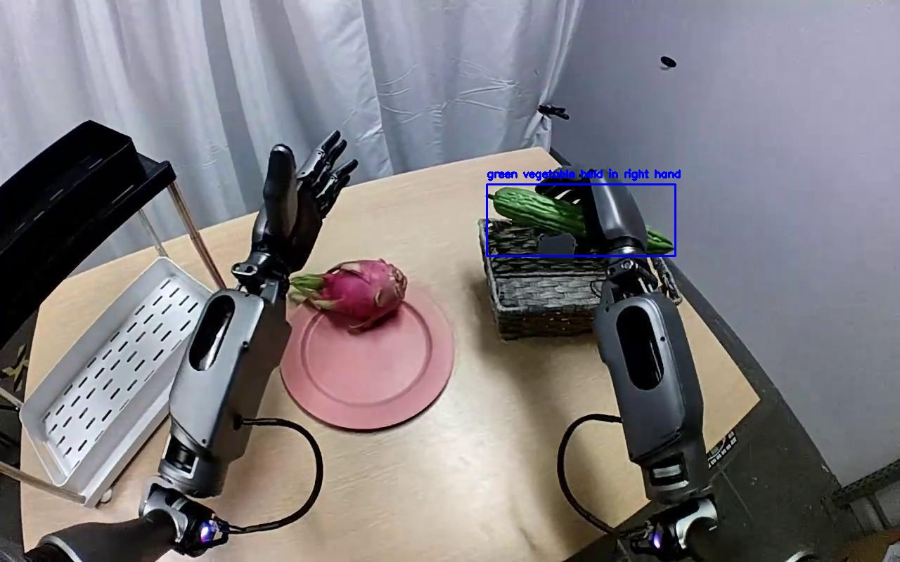
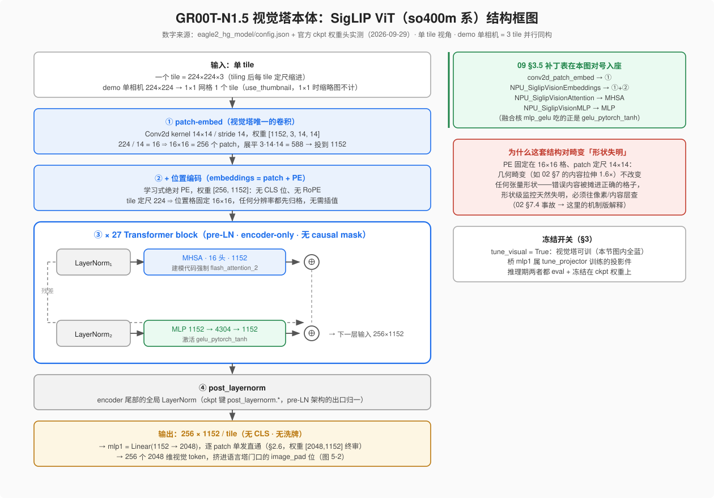
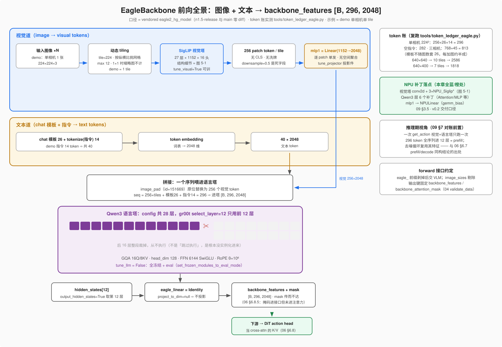

# 05 · 冻结 Backbone（Eagle VLM 如何"看懂世界"）

> 目标：理解 backbone 在推理里扮演的角色 —— 把视频帧与语言指令编码成 action head 能用的特征，
> 以及它为什么是"冻结"的、如何省算力。
> 对应代码：`Isaac-GR00T/gr00t/model/backbone/eagle_backbone.py`

## 1. 为什么需要"看懂世界"的 backbone


*图：N1.5 的 Eagle VLM 具备"指称表达→像素区域"的 grounding 能力（GR-1 场景 IoU 40.4，优于同级 Qwen2.5-VL-3B）——这正是"冻结它、借它看懂世界"的底气。原文：<https://research.nvidia.com/labs/gear/gr00t-n1_5/>*


动作不能凭空生成——机器人必须**先理解**"看到了什么、被要求做什么"。这部分"理解"能力
由一个大 VLM 提供：`Eagle 2.5`（视觉-语言模型）。
- 它把多张视频帧 + 一段语言指令，变成一串**语义特征** `backbone_features`。
- 这些特征作为"条件"（condition）喂给 action head，告诉它"在当前的场景里该朝哪动"。

## 2. backbone 的构成（`EagleBackbone`）

```python
class EagleBackbone(nn.Module):
    def __init__(self, tune_llm=False, tune_visual=False,
                 select_layer=-1, eagle_path=None, project_to_dim=1536, ...):
        self.eagle_model = AutoModel.from_config(config, trust_remote_code=True)
        # VLM 输出 hidden 维度 2048 → 投影到 project_to_dim(默认1536)
        self.eagle_linear = nn.Linear(2048, project_to_dim)
        # 只保留前 select_layer 层，省算力（后续层不用就被裁掉）
        while len(self.eagle_model.language_model.model.layers) > select_layer:
            self.eagle_model.language_model.model.layers.pop(-1)
        self.select_layer = select_layer
        self.eagle_linear = ...  # 若 project_to_dim 为 None → Identity
```
要点：
- 模型权重从**本地** `eagle2_hg_model/`（仓库自带）加载，不依赖网络。
- `select_layer` 决定取**哪一层的 hidden state** 作为特征，并据此**裁剪**语言模型尾部层——少算。
- `eagle_linear` 把 VLM 的高维特征（2048）投影到 action head 期望的维度（1536）。

> **[!] 官方权重实测勘误（2026-09-24，读 `GR00T-N1_5-3B/config.json` + 开源 tag `n1.5-release` 代码校正）**
> 上面这段伪代码写的是**类默认参数**下的形状，官方发布权重打开的是另一组开关，三处必须校正：
>
> | 项 | 伪代码/默认 | 官方 ckpt 实测 | 后果 |
> |---|---|---|---|
> | `select_layer` | `-1`（示例里 16） | **12** | 语言塔只留前 12 层，第 12 层 hidden state 即 `backbone_features` |
> | `project_to_dim` | 1536（`nn.Linear(2048,1536)`） | **null** ⇒ `eagle_linear` = `nn.Identity()` | **2048 维一路直通**，backbone 侧根本不做投影 |
> | `tune_visual` | False（示意「全冻」） | **True**（只有 `tune_llm=False`） | 训练期**视觉塔是可训练的**，冻结的只有语言塔 |
>
> 于是「1536」其实不在 backbone 里：它是 action head 的 `input_embedding_dim`
> （= DiT `inner_dim` = 32 头 × 48），由 head 侧 `state_encoder / action_encoder`
> 把 64 维 state / 32 维 action 翻译成 1536（见第 06 章 §6.8 维度账本）。
> 换句话说：官方 N1.5 的 backbone 与 action head 之间流动的张量是 **[B, 296, 2048]**，
> `eagle_linear` 这条「翻译官」线在发布权重上是**空通道**（`tune_projector=true` 训练的是
> head 侧那几个投影件，不是这条）。**跨机对齐时视觉塔权重同样属于「必须与训练端逐字节一致」的部分**
> （第 02 章 #168 / 第 13 章）——它并非如直觉那样「冻结所以无所谓」。

### 2.5 拆开黑盒第一步：视觉塔本体是 SigLIP（参数全表 · 权重实测）

> 分工提示：本节只管**原生结构**（torch 视角）；SigLIP 的调用链全图、NPU 逐结构替换
> 与整层融合清单在第 **14** 章。

上一节的勘误框把封装层讲清了，但 `vision_model` 本身在本章一直是黑盒——"看懂世界"这件事
其实全部发生在它里面。vendored `eagle2_hg_model/config.json`（`vision_config`）+ 官方 ckpt
权重头对出的参数表（2026-09-29 实测，`model-00001` safetensors 头）：

| 部件 | 事实 | 证据 |
|---|---|---|
| 架构 | **SigLIP ViT（so400m 系）**，`model_type=siglip_vision_model`，pre-LN（每层 `layer_norm1/2`），**无 CLS**——输出全部 patch token | config + 权重键名 `encoder.layers.0..26` |
| 规模 | **27 层** × hidden **1152** × 16 头，FFN 中间维 4304，激活 `gelu_pytorch_tanh` | config `vision_config` |
| patch embed | **Conv2d `[1152, 3, 14, 14]`**（224/14 = 16 ⇒ 每 tile **16×16 = 256 个 patch**） | ckpt `embeddings.patch_embedding.weight` |
| 位置编码 | **学习式绝对 PE `[256, 1152]`**（无 CLS 位、无 RoPE、tile 定尺 224 所以**无需插值**） | ckpt `embeddings.position_embedding.weight` |
| 注意力实现 | 建模代码强制 `flash_attention_2` | `modeling_eagle2_5_vl.py:107` |


*图 5-1：自绘（`tools/mk_fig_ch05_vision_tower_backbone.py`）——单 tile 视角的视觉塔纵向流程；右侧绿框把 09 §3.5 补丁表的 4 个 SigLIP 落点对号入座，红框是 02 §7 畸变事故的结构层解释（表末行 flash_attention_2 即图中 MHSA 的注记）。*

两个"原来如此"顺带落地：
- 第 09 章 §3.5 表里 SigLIP 行的三个补丁（`conv2d_patch_embed` / `NPU_SiglipVisionEmbeddings/_Attention/_MLP`）
  现在能对号入座：patch-embed 是那张表里唯一的 conv，MLP 融合核 `mlp_gelu` 吃的就是 `gelu_pytorch_tanh`；
- 02 章 §7 事故里"形状全绿、内容拉伸 1.6×"之所以危险，正是这套结构造成的：
  **PE 固定在 16×16 格上、patch 定尺 14×14**——几何畸变不改变任何张量形状，只把错误内容
  摊进正确的格子，形状级监控天然失明（02 §7.4 的机制版解释）。

### 2.6 mlp1：视觉→语言的桥，官方权重上是 `Linear(1152→2048)` 单发

`modeling_eagle2_5_vl.py:142-153` 给 mlp1 写了三条实例化分支（两层 MLP+LN / 像素洗牌单层 /
**逐 patch 单层**），选哪条由两个开关决定：`use_pixel_shuffle=false` + `mlp_connector_layers=1`
⇒ 走第三条 `nn.Sequential(nn.Linear(vit_hidden, llm_hidden))`。ckpt 权重形状直接终审：

```
backbone.eagle_model.mlp1.0.weight  = [2048, 1152]      # 逐 patch 直通，没有 2×2 packing
backbone.eagle_model.mlp1.0.bias    = [2048]
```

> **[!] 又一个 config 字段是死字段**：config 里 `downsample_ratio=0.5` 看似要把每 tile 256 token
> 洗成 64（`num_image_token = (224/14)² × 0.5² = 64`，`modeling:92-97`）——但那条账只在
> `use_pixel_shuffle=true` 时生效；本配置下 `num_image_token = 256`，权重形状 [2048,1152] 与
> §4.5 的实测 token 数互相印证，**0.5 是死字段**。教训与 §2 勘误框同源：
> **Eagle 的 config 字段只有和实例化分支对上了才算数，最终裁判是权重形状。**

职责钉死后，三件旧事一并归位：① 09 章补丁表里 `eagle_backbone_init_wrapper` 换的"mlp1(1152→2048)"
就是这座桥（换成 `NPULinear` 的 gemm_bias）；② 勘误框里 `tune_projector=true` 训练的投影件，
视觉侧就是它（另一部分在 head 侧的 state/action encoder）；③ 它是**每个 patch 独立**的线性映射——
不做任何空间聚合，所以视觉塔输出的空间粒度一路保留到语言塔门口（token 账见 §4.5）。

## 3. "冻结"是什么意思（`set_trainable_parameters`）

```python
def set_trainable_parameters(self, tune_llm, tune_visual):
    for p in self.parameters(): p.requires_grad = True
    if not tune_llm:    self.eagle_model.language_model.requires_grad_(False)  # 冻结 LLM
    if not tune_visual: self.eagle_model.vision_model.requires_grad_(False)
                        self.eagle_model.mlp1.requires_grad_(False)            # 冻结视觉
```
- `requires_grad_(False)`：这些参数的梯度不再计算、权重不更新 → "冻结"。
  官方 N1.5 ckpt 的开关是 `tune_llm=false` + `tune_visual=true`（冻语言塔、留视觉塔参与训练）；
  本章示例的双 `False` 是教学简化——推理期两种配置下所有模块都在 `eval()`，行为无差别。
- 推理场景本来就不反向传播；**冻结**的真正意义是省显存/显式表达"不动它"。
- 有个训练相关细节 `set_frozen_modules_to_eval_mode()`：HF 每次训练会 `model.train()`，
  但冻结模块要保持在 `eval()`（关掉 dropout/BatchNorm 的随机行为）——推理时整体就是 eval，无影响。

## 4. 前向：把输入变成 backbone_features（`forward`）


*图 5-2：自绘（同图 5-1 脚本）——先看全图再读代码：上泳道视觉道（图 5-1 是其中 SigLIP 框的展开）、中泳道文本道、image_pad 处拼成 296×2048 后进 Qwen3（✂ 处后 16 层整段未实例化），取第 12 层 hidden 过 Identity 出口。token 账右侧一栏与 §4.5 同源同脚本。*

```python
def forward(self, vl_input):
    self.set_frozen_modules_to_eval_mode()
    eagle_embeds, eagle_mask = self.forward_eagle(vl_input)
    ...
    return BatchFeature(data={
        "backbone_features": eagle_embeds,        # [B, T, hidden]
        "backbone_attention_mask": eagle_mask,    # 用于注意力掩码
    })

def forward_eagle(self, vl_input):
    eagle_input = { k.removeprefix("eagle_") : v
                    for k, v in vl_input.items() if k.startswith("eagle_") }
    del eagle_input["image_sizes"]
    eagle_output = self.eagle_model(**eagle_input,
                                    output_hidden_states=True, return_dict=True)
    eagle_features = eagle_output.hidden_states[self.select_layer]  # 取指定层
    eagle_features = self.eagle_linear(eagle_features)               # 投影
    return eagle_features, eagle_input["attention_mask"]
```
- `prepare_input` 这里只是把 batch 原样包成 `BatchFeature`（真正拆字段发生在模型级 prepare_input 之前）。
- 输入约定：前缀 `eagle_` 的字段会被剥掉前缀后交给 VLM；`image_sizes` 被剔除。
- 输出键固定：`backbone_features`（特征）+ `backbone_attention_mask`（掩码），
  与第 04 章 `validate_data` 要求一致。

### 4.5 像素 → `backbone_features` 的完整 token 账（seq_len 296 从哪来）

`296` 从本章往后无处不在——06 §6.7 的"~90 GFLOP 白算"、§6.8 维度账本、09 §7 对账表、
`[B, 296, 2048]` 的交接形状都建立在它上面，但**全书一直没算过这笔账**。现在算（全部本地实测，
复跑 `tools/token_ledger_eagle.py`，环境=gr00t conda env；口径 = vendored eagle2_hg_model，
n1.5-release 与 main 该目录零 diff）：

**链路四步**：① 图像进 Eagle 动态 tiling（`tile=224`、`tokens_per_tile=256`、`max_dynamic_tiles=12`、
`use_thumbnail=true`、`do_resize=do_pad=false`）按**纵横比**挑网格、每 tile 缩进 224×224；
② 每 tile 过 SigLIP → 256 个 patch token（§2.5，无洗牌）；③ mlp1 逐 patch 投到 2048（§2.6）；
④ 文本模板把每张图的 256 token 展开在 `<image>` 占位处，与指令 token 拼成序列进语言塔。

**实测分解**（2026-09-29，processor 级，与 02 §7.6 的 L20 前向实测一致）：

| 输入 | tiles（含缩略图） | 图像 token | 文本 token | seq_len |
|---|---|---|---|---|
| 256×256 单图 · demo 指令 | 1 | 256 | 40（模板 26 + 指令 14） | **296** |
| 256×256 单图 · 空指令 | 1 | 256 | 26 | 282 |
| 256×256 **三相机** · demo 指令 | 3 | 768 | 45 | 813 |
| 640×640 单图 | **10**（3×3 + 缩略图） | **2560** | 26 | 2586 |
| 640×400（宽幅 1.6:1） | 7（3×2 + 缩略图） | 1792 | 26 | 1818 |

四个推论，三个顺手回收别章的伏笔：

1. **恒等式（单相机版）**：`seq_len = 256×tiles + 模板26 + tokenize(指令)`——02 章 demo 的
   296 = 256+26+14，与 06/07/09 用的 `kv_len=296` 对齐（那都是**单相机** demo 口径）。
   **多相机不套用 26**：每张额外图在模板里还要带自己的定界符，实测三相机文本侧涨到 45
   （26+14+两图共 19），总账 813。跨机对账先问相机数和 tile 数、逐段加账，别拿 296 硬套
   （同 09 §10.3 口径纪律②的 token 版）。
2. **02 §7.3 的"推算表"转实测**：640×640 → 10 tiles / 2560、640×400 → 7 tiles / 1792，
   脚本断言已内置，口径漂移会先炸脚本而不是让表格悄悄过期。
3. **tile 网格只看纵横比、不看内容**（1×1 时缩略图不另计）——所以 #168 里训练帧与拉伸帧
   的 token 账**逐项相等**，"形状监控必然漏检"到这里有了完整的算术版本。
4. **视觉塔在一次 `get_action` 里只前向一次**：K 步去噪共享同一份 `backbone_features`——
   这正是 06 §6.7"观测=prefill、去噪循环=decode"同构的出处，也是 09 §10.1"前缀恒定 ⇒
   条件量可预计算常驻"的算术依据（1 图 1 步去噪的负载里，这 296-token 前缀就是最肥的一段）。

## 5. backbone 在整条链路里的"上下游"

```
观测(video+annotation)
   ▼ eagle_backbone
backbone_features (B,T,hidden) + mask
   ▼ 作为条件送入
FlowmatchingActionHead.get_action(backbone_features, action_inputs)
   ▼
action_pred (B, horizon, dim)
```
backbone 的输出**不直接是动作**，而是"世界的理解"，作为条件引导动作生成。这是理解
"双脑"分工的关键：一个脑负责"看/想语义"，另一个负责"生成动作"。

## 6. 本章小结

- Backbone = Eagle VLM（推理期整体 eval；官方训练配置只冻语言塔）+ 语言塔层裁剪（`select_layer=12`）
  + 一个**在官方权重上退化为 Identity** 的投影（`project_to_dim=null`，2048 直通给 action head）。
- 作用：把视频+语言变成 `backbone_features`（语义条件）。
- 冻结即 `requires_grad_(False)`；推理下无梯度，天然轻量。
- 输出 `backbone_features` + `backbone_attention_mask`，作为 action head 的条件输入。
- 黑盒拆开看：视觉塔 = SigLIP ViT（27 层/1152/patch14/256 token 每 tile/学习式 PE/无 CLS），
  桥 = `mlp1 = Linear(1152→2048)` 逐 patch 单发（`downsample_ratio=0.5` 是死字段，权重形状终审）。
- token 账：单相机 `seq_len = 256×tiles + 模板26 + tokenize(指令)`（demo 256+26+14 = **296**）；
  每加一张图另涨约半成模板 token（三相机实测 813），640×640 单图 10 tiles → 2560。
  复跑 `tools/token_ledger_eagle.py`（内置断言防口径漂移）。

## 自己动手

1. 打开 `eagle_backbone.py`，数一下 `forward` 输出了哪些键，和 `gr00t_n1.py::validate_data`
   需要的键对不对得上。
2. 思考：如果 `project_to_dim != action_head 期望维度`，会发生什么？在哪个层报维度错误？
3. 跑 `tools/token_ledger_eagle.py`，把 demo 指令换成你自己的句子，验证恒等式仍成立；
   再喂一张 320×256 的图，预测 tile 网格并和实测对——对不上时，先想想纵横比规则。

## 疑问与批注

### 2026-09-23 · 授课问答存档（首轮）+ 三个超越标准答案的收获

> 本章以"老师提问 → 学生作答 → 判卷修正"的问答形式走完全章。以下按授课顺序存档，
> 含两处易错点修正与一张"泛化能不能兜住"的判据表（复习时优先看这张表）。

#### Q&A 实录（要点式）

- **Q1 backbone_features 的角色**：✔ 答对——它是条件（condition），"指导"动作生成；
  具体动作由扩散/流匹配从噪声迭代恢复。补充精确化：它不是"开头喂一次"，
  而是在去噪的**每一步**都被 action head 通过 cross-attention 反复查询（第 06 章细讲）。
- **Q2 backbone 输出的两个键**：当时遗忘，答案为 `backbone_features` + `backbone_attention_mask`
  （与第 04 章 `validate_data` 的契约一致）。
- **Q3 推理时 `requires_grad_(False)` 还剩什么用**：学生答"对部署微调设限"——对了一半（契约/防误调）。
  补齐另一半：① **防呆保险**：若有人绕过 Policy 的 `no_grad` 裸调 backbone 且输入带梯度，
  整张计算图会被建起、激活全扣住，`requires_grad_(False)` 保证图建不起来；
  ② "冻结省显存"的真正红利在**训练态**：不存梯度、不进优化器状态（Adam 约 2× 参数量）。
- **Q4 删掉 `set_frozen_modules_to_eval_mode()` 埋什么雷**：学生答"训练时 dropout 是正则、
  推理关闭很正常，为何影响推理？"——由此引出本节最有价值的一轮展开（见下方"泛化判据"）。
  途中纠正一个概念偏差：**dropout 丢的是激活值，不是参数**；train/eval 切换改的是
  "前向计算方式"，与 requires_grad（梯度与否）正交。
- **Q5a `project_to_dim=512` 与 head 期望 1536 不符，谁报错**：✔ 答对——action head 内部
  第一个消费 1536 的权重矩阵处爆（DiT cross-attention 的 K/V 投影），报通用
  `RuntimeError: shapes cannot be multiplied`。两个补充：① backbone 与 head 靠 **dict 键名
  约定**松耦合（非 `nn.Sequential` 串联），故报错时机是**运行时**而非加载时，
  `validate_data` 只查键名不查形状也拦不住；② 排查技巧：看报错栈里权重矩阵属于哪个模块，
  那个模块就是"按旧维度建的消费者"，往上游找生产者。
- **Q5b `select_layer` 与 `requires_grad_(False)` 各省什么**：大方向对，三处精度修正：
  ① 裁剪发生在**加载之后**（`from_config` 先全量建模再 `pop`），省的是驻留显存 + 每步前向
  计算/激活，**不省加载 I/O 与内存峰值**；② `select_layer` 还有一半语义是"**从第 16 层取特征**"——
  先确认中间层理解特征够用，才敢砍它后面（理解 ≠ 生成）；
  ③ 训练期冻结省三样：反向计算、**为反向保存的激活**（显存大头）、梯度+优化器状态。
- **追问：泛化不该兜住 train/eval 错位吗？**（学生主动质疑，见判据表）
- **追问：换整个 backbone 复用旧 head 属于哪类？**：✔ 学生裁决"急性事故"，正确，且排序
  （比 BN 错位更严重）也对——BN 错位是同分布的仿射搬移，可小校正救；换骨干是特征**语义坐标系**
  整个换掉，head 的 K/V"读数刻度"逐维失效。救治路径：冻结新骨干，**重训 `eagle_linear` +
  action head**——这正是投影层作为骨干与任务头之间**可重训缓冲区（adapter）**的深层意义。
- **追问（学生主动提出）**："噪声加在输入图像侧比加在 backbone 输出特征侧更利于泛化"——
  具身领域的主流正确答案，两个深化理由：
  ① 在流形上 vs 出流形：图像增广经冻结 VLM 后产生的特征变化对应"真实世界拍得到的东西"；
  dropout 抠通道则**没有任何真实图像能让 VLM 吐出那种残缺特征**，买到的鲁棒性部署时兑不了现。
  ② 具身特有约束：**增广必须对动作标签等变**——分类里翻图像标签不变；机器人任务里
  翻转图像 = 最优动作的左右分量要跟着翻转，否则注入的是"图文不符"的假样本，比不加还糟。

#### 核心判据表：train/eval 错位时，"泛化"兜不兜得住？

> 判据一句话：**测试时的偏移是否属于训练时按设计注入过的那个随机过程。**

| 错位类型 | 偏移性质 | 泛化能否兜住 | 临床表现 |
|---|---|---|---|
| 冻结塔 dropout 没关→推理关闭 | 期望对齐、只差方差（inverted dropout 保均值，clean 特征落在噪声族期望处） | **大体兜得住**，但上限被削：head 花容量平均噪声，条件信噪比被人为压低 | 慢性损耗：动作变毛躁，离线指标未必可见 |
| BN train 统计量→eval running 统计量 | **系统性仿射搬移**（通道均值/尺度搬家），训练噪声族之外 | **兜不住** | 急性事故：性能可崩得很直接 |
| 换整个 backbone 复用旧 head | 语义坐标系整体更换，比仿射搬移更远 | **兜不住**，但有标准救治路径（重训 eagle_linear+head） | 换城市级错位 |
| #168 预处理黑边（第 02 章，同族案例） | 训练从未出现过的几何分布 | **兜不住** | 真机翻车、离线可能好看 |

配套结论（设计过的随机性 vs 泄漏的随机性）：

| | 设计过（CFG 条件 dropout、流匹配加噪） | 泄漏（忘关 eval） |
|---|---|---|
| 噪声形式谁决定 | 显式写进训练配方，可调 | 藏在冻结塔配置里的 dropout=0.1 |
| 推理侧对应策略 | 有，按设计执行 | 没有，纯错位 |
| 可消融/回归 | 可（改超参 A/B） | 难（破坏"可归因"纪律） |

以及具身特有的加重因素：机器人是**闭环**，条件带噪 → 本步动作偏 → 到达没见过的状态 →
下一步观测本身出分布 → **误差复利**（covariate shift / DAgger 治的病）。分类任务的
单样本容错逻辑在这里不成立。

#### 三个超越标准答案的收获（复习优先）

1. **泛化覆盖判据**（上表）：能指望泛化的前提是"训练时按设计注入过同族噪声"；
   一致性优先于"希望它顺便泛化一下"。随机性应加在**部署时真实会扰动的地方（观测侧）**，
   且两侧口径写进同一份契约。
2. **裁剪时机**：`select_layer` 是"加载后裁剪"（先全量 `from_config` 再 pop），省驻留显存
   与每步前向，不省加载 I/O——与"按需加载"工程含义不同。
3. **`eagle_linear` = 可重训缓冲区（adapter）**：冻结骨干与任务头之间唯一的薄翻译层，
   骨干一换只需重训它 + head，是"一个模型适配多本体/多骨干"生态的接口设计。

#### 本章迁移收束表（案例 → 普遍原理）

| 本章机制（gr00t 案例） | 普遍原理（换任何 VLA 仍成立） |
|---|---|
| Eagle + `select_layer=12`（官方 ckpt）裁剪 | 理解 ≠ 生成：条件提取不必跑完为 next-token 调优的深层 LLM（pi0/RT-2 取中间层同款） |
| `eagle_` 前缀剥壳喂原生 VLM | 用命名空间约定实现模块松耦合，第三方权重零改动复用 |
| `set_frozen_modules_to_eval_mode()` | 训练/推理一致性：冻结供应商的交货口径必须前后一致（与 #168 同族） |
| `requires_grad_(False)` + 可训练 `eagle_linear` | 冻结主干 + 只训"翻译层"与任务头：省资源且防灾难性遗忘 |
| 输出 `[B,T,2048]` 作条件（官方权重 Identity 直通） | VLA 的接缝在"语义特征"层，两边只靠形状+键名契约握手 |

#### 遗留动手题

打开真实 `eagle_backbone.py` 数一遍 `forward` 输出的键，与 `gr00t_n1.py::validate_data`
交叉验证（本章笔记口径为两键：`backbone_features` / `backbone_attention_mask`，以真实代码为准）。

---

### 2026-09-24 · 源码 + 权重实测勘误（补录）

第 06 章 §6.8 做 attention 全解时逐行核了开源 N1.5 head 与 `GR00T-N1_5-3B/config.json`，
顺带把本章三处"按类默认参数写的"数字钉死（详见 §2 勘误框）：

1. `select_layer` 官方为 **12**（本章正文原写 16）——语言塔被裁到 12 层，"取中间层当条件"比想象的更早；
2. `project_to_dim=null` ⇒ `eagle_linear` 是 `Identity`，**backbone 到 head 的交接张量是 2048 维**，
   1536 属于 head 内部（`input_embedding_dim` = DiT 32 头 × 48）；本章原先"投影 2048→1536"的
   叙述仅适用于 `project_to_dim` 被显式设值的自建配置；
3. `tune_visual=true`：**官方训练时视觉塔在训**，"backbone 全冻结"只对语言塔成立。
   教学结论不变（推理期全 eval），但"换骨干只需重训 `eagle_linear`"这条要打折：
   发布权重里那层根本不存在，可重训缓冲区实际落在 head 侧的 `state/action encoder + projector`。
