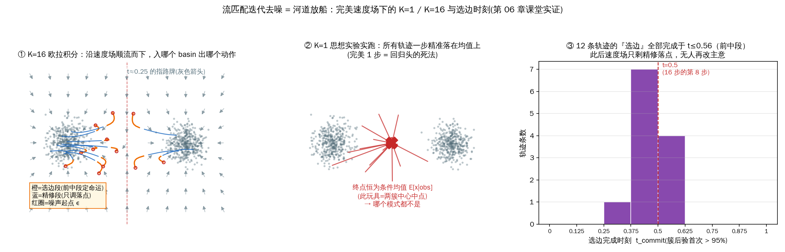
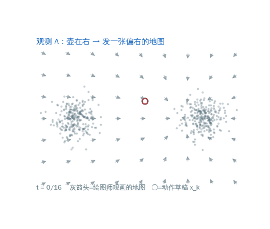
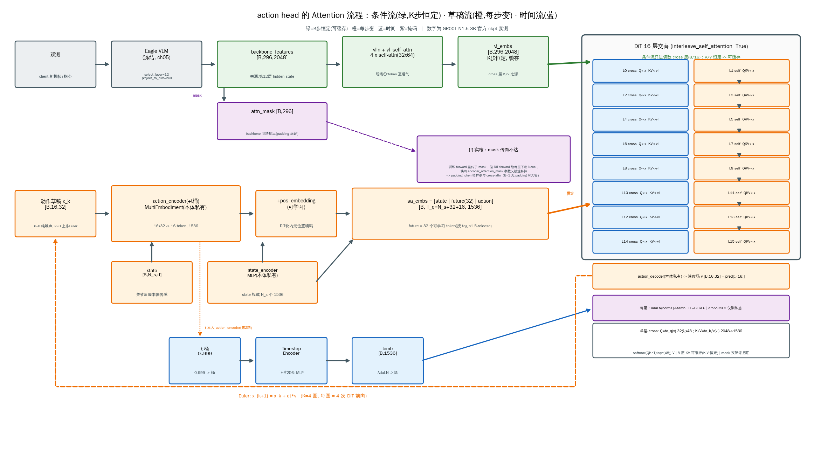

# 06 · 扩散 Action Head 原理（如何"想"出动作）

> 目标：讲清 action head 为什么用"流匹配/扩散"来生成动作，以及推理时那一层 `for t in range(num_steps)`
> 到底在做什么。这是全课程**最核心的原理章**。
> 对应代码：`Isaac-GR00T/gr00t/model/action_head/flow_matching_action_head.py`、`cross_attention_dit.py`

## 1. 为什么不能用"一次前向"直接出动作？

- 机器人动作是**多模态的**：同一场景下"往左够"可能是对的，"往右够"也可能是对的（同样合理）。
- 回归模型（直接预测动作）会"取平均"，得到**模糊/不合理**的中间动作；且难以表达多解。
- 生成模型（扩散/流匹配）能**采样**：每次都从噪声还原出**一条完整合理的动作轨迹**，天然多解。


### 1.1 对照表：两种建模哲学

| | 回归头 | 生成式头 |
|---|---|---|
| 学的对象 | 条件均值 E[a\|obs] | 条件分布 p(a\|obs) |
| 多解场景的输出 | 均值（哪个解都不是） | 每次采样命中**某一个**解 |
| 确定性 | 同输入同输出 | 同输入可出不同轨迹（受噪声种子控制） |

> 一行钉死：MSE 的最优解 **=条件均值**（对固定 obs，使 `E‖f(obs)−a‖²` 最小的 f 就是取期望）。
> "左右两可"场景输出均值不是训练不充分，而是**目标函数层面判了死刑**——数据再多、模型再大都救不回来。

### 1.2 插叙：开环评估 vs 闭环控制——"采样随机"是坏事吗？

术语来自控制论，"环"指反馈环：

```
开环(离线回放): obs(数据集帧) ──► 模型 ──► â ──► 与演示动作 a 算 MSE，完。
              预测错了也不改变下一步看到什么——没有反馈环。
闭环(真机执行): obs ──► 模型 ──► a 被执行 ──► 机器人到新状态 ──► 新 obs ──► ...
              预测误差会改变后续输入——环闭上了。
```

- **开环 MSE 对多模态策略是"错配的考官"**：策略采样出同样合理的"右侧绕行"，演示录的是"左够"——MSE 判它错，真机上它没错。生成式头在小数据集上的开环 MSE **天然偏高且不公允**，这是评估口径问题而非模型问题（第 12/13 章反复叮嘱"换动作空间/换采样种子的 MSE 不许横比"，根源在此）。
- **闭环才是终审**：采样换模式在闭环里常是优点——这次采样卡住了，下一窗口可能采到另一模式，等于免费重试（第 08 章重试例子的机理）。
- 记法：**开环问"你猜得像不像演示"，闭环问"你把活干成了没有"。**

## 2. 流匹配（Flow Matching）直觉


*图：自绘——左：训练时在高斯噪声 x₀ 与真实动作 x₁ 之间取直线插值，红箭头即模型要学的常速度场 u=x₁−x₀（右上的两个点簇=动作的多峰分布，这正是"回归求均值会坍缩"要解决的问题）；右：推理时从噪声出发，用 DiT 预测的速度场做 K 步 Euler 积分，逐步落到某个动作模式上*


想象在"纯噪声 ε ~ N(0,1)"和"真实动作 x"之间，画一条**直线插值**：

- 训练时我们知道"数据点 x 和随机噪声 ε"，定义：
  - 噪声轨迹：`noisy = (1-t)·ε + t·x`（t 从 0→1，从噪声"走"到数据）
  - 目标速度场：`velocity = x - ε`（数据相对噪声的位移）
- 模型学的是：给定 `noisy` 和时刻 `t`，预测 `velocity`。即模型是一个**速度预测器**。
- **推理（采样）时**：从纯噪声开始，沿着模型预测的速度场用 **Euler 法逐步积分**，`t: 0→1`，
  噪声就被"一步一步搬"成了动作。

> 类比：想象让一团噪声"被风吹着"走一条路，模型负责告诉每一时刻"该朝哪个方向、以多快速度走"，
> 走到底就是一张清晰的图（这里是一段动作轨迹）。

### 训练里的关键代码（forward）
```python
noise = torch.randn(actions.shape, ...)
t = self.sample_time(B, ...)          # 从 Beta 分布采时间(偏向两端/中段)
t = t[:, None, None]                  # (B,1,1) 广播
noisy_trajectory = (1 - t) * noise + t * actions   # 直线插值
velocity = actions - noise                            # 速度场目标
...
loss = F.mse_loss(pred_actions, velocity, reduction="none") * action_mask
```
- `sample_time` 用 Beta 分布调度 t，使得对中段/端点分配不同权重（`noise_s` 控制），学得更稳。
- 时间被离散化成 `num_timestep_buckets` 个桶，喂给正弦位置编码（`SinusoidalPositionalEncoding`）。


### 2.5 训练-推理对偶：学的是"全域指路牌"，不是一条轨迹

易混点：训练时每条样本只被问**一次**（"在时刻 t、半糊位置 noisy，速度多少？"），凭什么支撑推理 K 步？

- `t` 是网络输入的一部分（离散桶 + 正弦编码），训练覆盖**整个 (位置, 时刻) 空间**——网络学的是"位置+时刻 → 速度"的**全域指路牌**，不是背下一条条轨迹；
- 推理是把 K 次**单点提问串成链**：第 k 步问完、走一步、**到新位置重新问**。每次重新提问就是重新纠错——上一步折线折歪了，下一步拿到的是针对歪点的新速度，误差不会盲目放大；
- 防误区：这不是"半衰期式越迭代越接近答案"。K 增大减小的是欧拉法**离散化误差**（~O(1/K)）——弯路径用 K 段小直线折逼，仅此而已。

> 一句话：训练=在河道里立好指路牌；推理=放一条船，看一块牌子漂一段。牌子立得好的河
> 不会有"平均方向"的船——河水分叉，每条水分子只走一条。多模态问题就这样被几何化地解决了：
> 粒子落进哪个汇水区(basin)，就出哪个动作。

## 3. 推理采样：get_action 里的去噪循环

```python
@torch.no_grad()
def get_action(self, backbone_output, action_input):
    backbone_output = self.process_backbone_output(backbone_output)  # layernorm + vl self-attn
    vl_embs        = backbone_output.backbone_features
    embodiment_id  = action_input.embodiment_id

    # 状态条件编码
    state_features = self.state_encoder(action_input.state, embodiment_id)

    # 从纯噪声出发
    actions = torch.randn((B, self.config.action_horizon, self.config.action_dim), ...)

    num_steps = self.num_inference_timesteps          # 去噪步数(默认可调)
    dt = 1.0 / num_steps

    for t in range(num_steps):                        # 逐步 Euler 积分
        t_cont = t / num_steps
        t_discretized = int(t_cont * self.num_timestep_buckets)

        # 把"当前动作轨迹+时间"编码
        action_features = self.action_encoder(actions, timesteps_tensor, embodiment_id)
        if self.config.add_pos_embed:
            action_features = action_features + self.position_embedding(pos_ids)

        # 拼接 状态 + future tokens + 动作 作为自注意力序列
        future_tokens = self.future_tokens.weight.unsqueeze(0).expand(B,-1,-1)
        sa_embs = torch.cat((state_features, future_tokens, action_features), dim=1)

        # DiT 前向：以 vl_embs(视觉语言) 为 cross-attention 条件
        model_output = self.model(hidden_states=sa_embs,
                                  encoder_hidden_states=vl_embs,
                                  timestep=timesteps_tensor)
        pred = self.action_decoder(model_output, embodiment_id)
        pred_velocity = pred[:, -self.action_horizon:]   # 只取动作部分

        actions = actions + dt * pred_velocity           # Euler 一步更新

    return BatchFeature(data={"action_pred": actions})
```
核心就是那一行：
```python
actions = actions + dt * pred_velocity     # 欧拉法求解 ODE: dx/dt = velocity
```
- **步数越多越精细**：`num_inference_timesteps`（即 policy 里的 `denoising_steps`）是"质量 ↔ 延迟"
  的旋钮。GR00T-N1.5 常用 4 步左右已经能出不错结果。
- `@torch.no_grad()`：推理不求梯度，省显存、更快。

> **[!] 与开源 N1.5 实码逐行对齐（2026-09-24，`flow_matching_action_head.py` @ tag `n1.5-release`）**
> 上面的循环是**教学版骨架**，实码有三处差别，排雷时按实码为准：
> ① **`sa_embs` 是三段拼接，含 `future_tokens`**：
>    `sa_embs = cat(state_features, future_tokens, action_features)`，
>    `future_tokens = nn.Embedding(num_target_vision_tokens=32, 1536)` ⇒ `T_q = N_s + 32 + 16`；
>    而且那行 `.expand(B,…)` 就写在去噪循环**内**（部署分支把它提到循环外，见 §6.7 附录）；
>    **[!] 版本谱系坑（本条自身就被修正过一次，留作反面教材）**：`future_tokens` 是 NVIDIA 开源**之后**
>    才补进 head 的——首个开源提交 `5e3ef5e`(2025-06-11) 是两参数版 `cat(state, action)`、无此模块；
>    发布 tag **`n1.5-release` 才有**，官方 ckpt 也确实带 `action_head.future_tokens.weight`。
>    **教训：读开源代码要对准与权重配套的 tag（`n1.5-release`），不能对准"首个开源提交"。**
> ② `get_action` 调 `self.model(...)` 时**连 `encoder_attention_mask` 都没传**（训练 `forward` 传了，
>    但同样被 `DiT.forward` 丢弃 → 详见 §6.8.5）；
> ③ `t_cont = t / num_steps` 从 **0** 起算，K=4 时网络实际被查询的时刻是 `t ∈ {0, .25, .5, .75}`，
>    `t=1` 那一端永不被查询——与 §3.6 "训练时刻密度要对齐推理查询时刻"直接呼应。


### 3.5 思想实验：完美"1 步采样"恰好落在均值上（mode averaging 幽灵回归）

符号：`actions_{k+1} = actions_k + dt · net(actions_k, k/K, 条件)`。取 `K=1`（`t_cont=0, dt=1`），整条推理退化为一步：`actions_1 = ε + net(ε, 0, 条件)`。

"完美网络"永远输出**条件期望速度**（MSE 最优解=条件期望，§1.1 的老朋友）。关键观察：**t=0 时刻网络手里只有独立抽样的纯噪声 ε，关于"该去哪个模式"零信息**，此刻它对 `x−ε` 的最优猜测只能对所有可能的 x 求平均：

```
net(ε, 0) = E[x|obs] − ε          （对所有合理模式求均值！）
actions_1 = ε + (E[x|obs] − ε) = E[x|obs]    ← 正是回归头的 mode-averaging 输出
```

所以 **K 步的意义不是"更精细地去噪"，而是给轨迹时间早一点"选边"**：走第一步后 `actions_{1/K}` 已微偏一侧，下一次查询的条件期望不再全模式平均，而是偏向那侧的更尖锐速度。**多步采样 = 边积分边"揭示信息"，从平均逐步坍缩到某一个模式。** 两面：

- **单模式**（强条件下动作 chunk 常接近单峰）：平均速度=真速度，直线一条，1 步真够用——GR00T 敢用 4 步不是巧合；
- **多模式**：1 步必糊，糊法恰等于回归头输出；多步才选边。

> **措辞澄清（课堂问答）**："每个欧拉步都在从噪声向数据挺进"作为**力学描述**完全正确，本节
> 否定的不是它，而是"**更多步 = 把一条既定正确轨迹描得更精细**"这个解读。K=1 实验里单步用的
> 已是该时刻信息下的最优方向——**缺的不是精度，是"该去哪个模式"的信息**：选边之前"正确方向"
> 不唯一，最优速度=多方向的平均=均值本身。多步真正额外买到的是**反馈轮次**——后续查询得以
> 条件化在前段已走出的轨迹历史上（破缺对称的信息是边走边制造的，不是从牌子上读来的）；
> 其次才买到积分精度 O(1/K)（落点精修）。主辅之分见配图③：后段步数对"去哪个模式"零投票权。


*图：自绘玩具实证（可复跑：`python3 tools/mk_fig_ch06_denoise_paths.py`）——2D 双簇数据（两个"合理动作模式"）+ 解析可算的**完美速度场** `u(x_t,t)=E[x|x_t]−ε`，对同一批噪声起点真跑欧拉积分。
① K=16：轨迹分别入两个 basin（橙=选边段，蓝=精修段，灰箭头=t=0.25 时刻的"指路牌"）；
② K=1：12 条轨迹全部精准落到全局均值（红 X）——上面推导的"完美 1 步=均值"当场复现；
③ 选边完成时刻 t_commit（簇后验首次越 95%）全部落在 t≈0.31~0.56 的前中段，此后再无人改主意。*

### 3.6 "选边"发生在哪一段：分岔口全在前段

- **t 小**：`x_t` 几乎全是噪声，`E[x|x_t]` 横跨所有模式，速度场微小差异就把轨迹推向不同 basin——**分岔口全在前段**；
- **t 大**：`x_t ≈ 0.9x + 0.1ε`，点已深居某 basin 内，条件期望几乎无方差，网络只是"扶着你滑到终点"，想改主意在数值上已不可能；
- 实践含义：**后段步数对"去哪个模式"几乎没有投票权，它们买的是落点精度**——K=4 时前两步的选边质量决定成败。

这也解释了训练侧 `sample_time` Beta 调度"两端多练"的现实理由：

- **t≈0 端最难**：条件期望最"平均"、目标最暧昧，诸模式命运未定——这里学歪 1°，分岔口就进错 basin，误差后果最不可逆；
- **t≈1 端最精**：条件期望已尖锐，输出的是落点细节修正，最后那段误差≈直接的动作误差；
- **中段最易**：直线路径的速度场接近线性、信噪比高，稀疏采样就够；
- **部署耦合**：推理仅 4 步时，模型实际被查询的时刻只有 `t ∈ {0, .25, .5, .75}` 附近——训练时刻密度与推理查询时刻对齐，正是 `noise_s` 存在的现实理由。

## 4. action head 的组成部件（各自干嘛）

| 部件 | 作用 |
|---|---|
| `state_encoder`(CategorySpecificMLP) | 把机器人当前 state 编码成条件特征 |
| `action_encoder`(MultiEmbodimentActionEncoder) | 把"当前(噪声)动作轨迹 + 时间 t"编码成 token |
| `action_decoder`(CategorySpecificMLP) | 把 DiT 输出解回动作空间 `(B, H, action_dim)` |
| `DiT`(cross_attention_dit) | 扩散 transformer 主体，**16 层交替**：偶数层 cross（看观测）、奇数层 self（动作 token 互通气），细节见 §6.8 |
| `future_tokens`(nn.Embedding) | 32 个可学习 token，拼进 Q 侧序列（`T_q=N_s+32+16`），辅助生成。**⚠️ 只在 `n1.5-release` 及之后存在**，首个开源提交 `5e3ef5e` 无（见 §3 勘误①） |
| `vl_self_attention` + `vlln`(LayerNorm) | 对 backbone 特征先做层归一化+自身注意力提炼 |
| `position_embedding` | 给动作 token 加位置信息（顺序/时间） |

## 5. Multi-embodiment 怎么实现（CategorySpecific*）

```python
class CategorySpecificLinear(nn.Module):
    self.W = nn.Parameter(0.02 * torch.randn(num_categories, input_dim, hidden_dim))
    self.b = nn.Parameter(torch.zeros(num_categories, hidden_dim))
    def forward(self, x, cat_ids):
        return torch.bmm(x, self.W[cat_ids]) + self.b[cat_ids].unsqueeze(1)
```
- 对每一种 embodiment（`cat_ids`）保存**一套独立的线性权重** → 同一个模型可服务多种机器人，只换投影头。
- `bmm` 按 batch 里每条样本的 `cat_ids` 取对应权重矩阵做批量矩阵乘。
- 这正是第 03 章 `EMBODIMENT_TAG_MAPPING`（gr1:24, oxe_droid:17, ...）落地的位置：
  `embodiment_id` 从字符串映射成一个下标，用来选 CategorySpecific 的权重。

## 6. 串联全链路（本节课的"成品图"）

```
backbone_features (看懂世界) ─┐
                              ├─► process_backbone_output(LN+自注意力) → vl_embs → DiT 的交叉注意力条件
state(当前状态)                ┘
动作轨迹(从噪声开始) ──► action_encoder(+时间) ──► [state | future | action] 序列 ──► DiT ──► action_decoder ──► velocity
                                                                                              ▲
                     for t in 0..num_steps: actions += dt * velocity    (欧拉去噪)
```
- backbone 提供"语义条件"，DiT 在这个条件下"逐步把噪声变成动作"。这就是双脑分工的原理落点。


## 6.5 事故复盘（课堂）：把"循环内编码"挪出循环——伪装成加速的算法事故

某加速实验论证"encoder 输入形状又没变，何必每步重算"，把 `action_encoder(actions, timesteps_tensor, ...)` 从循环内挪到循环外，循环里只剩 `actions += dt·pred_velocity`。

**坍缩代数**：每步 DiT 输入完全相同（陈旧 action_features + 恒为 0 的时刻嵌入）→ 每步吐出**同一个 v₁** → K 步线性合并：

```
actions = ε + K·dt·v₁ = ε + 1·v₁        (dt = 1/K)
```

一步没浪费——4 小步因速度恒定，**合并成一个横跨 t=0→1 的大步**，恰是 §3.5 的"完美 1 步采样"。症状精确预言：输出不是乱码不是 NaN，而是**平滑、合理-looking、但哪个模式都不是的平均轨迹**（两可场景直冲障碍物）。

三条教训：

1. `action_encoder` 是循环内"**每步重新提问**"的入口，`(x_k, t_k)` 是其左右手；挪出去等于撕掉路牌，只剩 t=0 那一块。
2. 这类 bug **伪装成质量问题**：MSE 只表现为"偏高"。归因要靠**多次采样方差探针**——同 obs 采样多次，正常头在多模态场景样本间轨迹有差异、归一化后一致；冻结头方差为零（对应第 09 章"可归因"纪律）。
3. 措辞校准：cross-attention 的 `vl_embs` 作为 key/value **恒定是设计使然**（世界不随你的草稿变）；坏事的冻结在 **query 侧**——动作 token 不再更新。"题目不变是应该的，学生不再答题才是 bug。"

### 部署症状 → 病因速查表（课堂追问收编的工具箱）

把 §3.5/§6.5 与两次课后追问串成一条操作流程：拿到失败 rollout，**先分类症状再动手排查**——
这是第 09 章"可测量→可归因"纪律在策略层的实例。

| 输出症状 | 根因层 | 关联坐标 |
|---|---|---|
| **平滑模糊，哪个模式都不是**（直冲障碍物） | 生成过程被破坏：积分/编码 bug、完美 1 步坍缩 | §3.5/§6.5——张量空间病，先上**多次采样方差探针** |
| **干净流畅，但任务错**（叫端盘子却"自信地倒茶"） | 模式集合缺这道菜：数据覆盖不足 | §1+数据金字塔（第 12 章）——物理世界病，先查训练集有无此行为 |
| **抖动乱动，不像任何学过行为** | 条件侧坏了：预处理错位、骨干分布搬移、embodiment_id 传错 | 第 05 章 BN/#168/安静灾难家族——先查入口契约（两端 dump 互验） |

## 6.6 心智模型收拢：DiT = 按观测现画地图的"绘图师"

课堂追问"训练出的 DiT 是否就类比配图①左侧的灰色箭头？"——**基本正确**，升格为标准心智模型需要三处修正：

1. **静态照片 → 连续电影**：图①的灰箭头是 **t=0.25 一个时刻的定格**；DiT 学到的完整对象是**随 t 演化的速度场电影**——t≈0 时箭头大致指向"所有模式的平均"（图②的向心形态），t 增大逐渐分化成"各归各盆"的河道形态。`t` 走正弦编码进每层，就是在放这部胶片的进度条。
2. **一张地图 → 每个观测一张地图**：DiT 是三参数函数 `u(x_t, t, vl_embs)`，**cross-attention 每层每步都在按当前观测把整部箭头电影重新塑形**——同一台 DiT，"壶在右"与"壶在左"的观测画出两张不同的地图。"端盘子"结论的几何版：数据决定地图上有哪些盆地（模式），观测决定这一次发哪张地图；地图发错（入口契约事故），粒子就在错误的地图上找路。
3. **查表 → 连续函数，且问一支箭头 = 一次前向**：箭头不存在于任何网格，任意位置可问（欧拉法敢在半路任意点重新提问的原因）；但**每次查询一支箭头 = 一次完整 DiT 前向**。K=4 → 每次 `get_action` 跑 4 次 DiT——第 13 章延迟表里 `denoising_steps` 直接乘在耗时上的来源；第 09 章 NPU 融合算子优化的对象正是"一次 DiT 前向"。

> 合起来的完整版类比：**训练好的 action head = 一个会按观测现画地图的绘图师**——拿到观测和时刻，
> 在 512 维动作空间里指认任意位置的箭头；采样=派粒子按箭头漂 K 次；漂进哪个盆，
> 取决于地图形状（训练数据）和粒子起步扰动（噪声种子）。


*图：自绘动图（可复跑：`python3 tools/mk_gif_ch06_cartographer.py`）——用两簇的先验权重代表两个观测（A"壶在右"/B"壶在左"），同一台玩具 DiT 各发一张地图：灰箭头=当前时刻的速度场（胶片放到 t=k/16），红圈=正在漂的动作草稿 x_k。注意箭头场形状随观测变化、粒子各归其盆。玩具为 2D 动作空间，与真实 512 维同理。*

## 6.7 跨去噪步的 KV 缓存：常量张量的另一面（课堂独立推导）

§6.5 那句校准"`vl_embs` 恒定是设计使然"可以直接兑现成一项推理优化：K 步循环里 `vl_embs` 不变 ⇒ **每层 cross-attention 的 K/V 投影也不变**：

```python
每层 cross: K_l = to_k_l(vl_embs)   # 输入常量 × 权重常量 ⇒ 输出也是常量
            V_l = to_v_l(vl_embs)   # 8 个 cross 层各一份，全部可提升到循环外预计算
```

> **精度修正（2026-09-24 源码考证，见 §6.8）**：不是"16 层各一份"，而是 **16 层里只有 8 个偶数
> `cross` 层有 K/V 可缓存**——奇数层是 self-attention，它的 K/V 来自每步都在变的 `sa_embs`，
> 天生不可缓存。缓存对象是 `to_k_l/to_v_l` 的**投影输出** `[B, 296, 1536]`（注意是投到 1536 之后，
> 不是 2048 的原图）：单张 ≈ 0.9 MiB(bf16)，K+V × 8 层 ≈ **14 MiB/样本**，相对骨干是零头。

朴素实现每步把这套投影重算一遍（K=4 白算 3 遍）；提升到循环外，cross-attn 的 K/V 线性层开销直接除以 K。

**边界——省不掉的部分：**

| K 步循环内部件 | 随步变？ | 可缓存？ |
|---|---|---|
| 8 个 **cross** 层的 K/V 投影（输入 `vl_embs`） | 不变（常量输入 × 常量权重） | ✔ 预计算一次 |
| 全部 16 层的 **Q** 投影（输入 `sa_embs`） | 变（动作 token 每步重编码） | ✘ |
| 注意力分数 `softmax(QKᵀ/√48)` | 变（Q 变） | ✘ 每步照算 |
| 8 个 **self** 层的 K/V（输入也是 `sa_embs`） | 每步变 | ✘ |
| FF(GEGLU) / adaLN 时间调制 / 出口调制 | 全变 | ✘ |

显存代价：`[B, 296, 1536]` 常量 × 2(K,V) × 8 层 ≈ 14 MiB/样本——**相对骨干是零头**。
但**算力侧恰恰相反**（下面这笔账），这正是"缓存"这笔买卖划算的原因。

**这笔优化到底值多少（估算）**：cross 层 K/V 投影的算力 ≈ `296 × 2048 × 1536 × 2` ≈ **1.9 GFLOP/投影**，
K+V × 8 层 ≈ **30 GFLOP/去噪步**；K=4 就是 ~119 GFLOP，缓存后只付一份 30 GFLOP，
**省下约 90 GFLOP/次 `get_action`**——与整条 DiT 的 16 层 FF（约 30 GFLOP/步）同量级。
结论：**这套配置里"白算 K/V"不是零头开销，而是 DiT 前向里最大的单项**——显存上是零头、算力上是大头，
"要不要缓存 K/V"的答案由后者决定。（估算口径：只数 GEMM 的 MAC×2，忽略 attention 矩阵与激活，
数量级用 `296×2048×1536` 与 `16 层 × (N_s+16)×1536×6144` 对比，脚本可复算。）

**谱系**：LLM 推理的孪生兄弟是 **prefill/decode 分离 + KV cache**（提示词 K/V 算一次缓存，每个生成 token 只付 Q 侧）。此处同构：**观测（条件）= prefill，K 步去噪 = decode**。第 09 章 NPU 融合算子做图切分的依据，正是"K 步循环里谁恒定"：恒定子图提出循环编译成常驻段，变化子图做融合 kernel。

> 镜像教训：§6.5 的事故（循环内编码挪出去）与本节的优化（常量 K/V 挪出去）动作相同，
> 分野只有一个——**被挪的东西输入是否恒定**。hoisting 本身没有对错，性质由数据流分析决定。

### 6.7 附录 · 部署核查：本节的优化在生产分支上做了没有？

> 课堂追问"§6.7 在 v0.2 里实现了吗"的现场核查（2026-09-24，切 `Isaac-GR00T@v0.2` +
> `groot_ops@v0.2` 逐行读，行号可点）。方法本身值得学：**判据只有一条——
> `to_k/to_v` 的输出是否还在去噪循环内被重算**（缓存权重、缓存缓冲、缓存 `vl_embs` 都不算数）。

**结论：前提全铺好，唯独那步投影没做。**

| §6.7 要素 | v0.2 现状 | 证据 |
|---|---|---|
| `vl_embs` 一次算成、K 步共用 | ✔（原生与 NPU 两条路径都在循环外） | `flow_matching_action_head.py:352`（循环在 `:374`）；NPU 侧 `npu/action.py:1275`（循环在 `:1296`） |
| 权重常驻设备 | ✔ | `NPULinear._w` / `._lpu()`（`action.py:96-131`） |
| 缓冲常驻 | ✔ | `_ditbufs`，按形状 key 复用（`action.py:754-770`） |
| 输入零拷贝复用 | ✔（单 Die 下 `_to_ln_input` 对已是 LPU-fp16 的 `vl_embs` 直接返回视图） | `action.py:79-90`、`evo_lpu.py:267-268` |
| **`to_k/to_v` 投影提升到循环外** | ✘ v0.2 tag **未做** →（**2026-09-24 已在板端 v0.2-fix 线落地**，见本节末「落地实况」）| `action.py:743` 每次把 encoder 喂进 kernel、`:746-747` 只取权重、`:752` `kv_from_nh1=0`、`:773` `dit_block_fused(...)`；kernel 侧 `dit_block_ffi.cc:145-146` 实参 = `encoder + wt_k + wt_v → out_k/out_v`，**无 precompute/skip 开关** |

净账：一次 `get_action` = 4 步 × 8 cross 层 × 2 投影 = **64 次 K/V 投影，其中 48 次是白算**（落地后变成 **8 次计算 + 24 次复用**，见「落地实况」）。

**有意思的旁证——同一族优化，他们做了另外两处，恰好绕开了观测侧：**

- **时间侧已做（#173）**：按 `ts` 缓存 AdaLN 的 `scale_shift` 常驻设备，注释原话"跳过每调用
  9.4MB 权重搬运+matmul"（`action.py:234`、`819-821`）——这就是 §6.7 的思路，用在了 `temb` 上；
- **host 侧已做（#152 O1）**：把 `state_features / future_tokens.expand / pos_embs` 提到去噪循环外
  （`action.py:1275-1288`），消掉每步的 `arange` + 位置查表 + expand；
- **观测侧（`vl_embs` 这条链）没走完**。⇒ 不是"没想到常量提升"，而是**数据流分析只走了一半**——
  本节末"镜像教训"的活样本。

**在这台 NPU 上到底值多少（按本节口径估，`kv_len=296` 参照）**：算力 ~30 GFLOP/去噪步、K=4 省 ~90 GFLOP；
权重带宽 `wt_k+wt_v`=6.3MB×2×8 层 ≈ 100MB/步（4 步冗余 ~300MB）。
⚠ 但**省不到 launch 数**：K/V gemm 早已折进"每 block 一次 FFI"，所以收益记在 device 时间与权重带宽两栏。
而该部署的历史瓶颈画像（`to_lpu` 6148ms、`page_kv` 1691ms、每去噪步 ~0.53s）说明它的头号货币曾是
**host 往返而非 FLOPs**——这解释了为什么 v0.2 的优先级给了 `unified_mha` 消 `page_kv`，
本条属"正确但非当期瓶颈"。**性能优化的排序也是数据流分析的一部分。**（这段当时是**推断**，2026-09-24 已被实测坐实，见下。）

**要落地，三个必踩的坑（对账见第 09 章 §7；2026-09-24 已在板端 v0.2-fix 线落地，见下）**：

1. **布局**：kernel 约定 `out_k=[M_kv,N_k]`、`out_v=[N_q,M_kv]`（`dit_block_ffi.cc:214-219`）——
   **V 是转置布局**，预计算必须产出同布局，否则 `QK^T` 静默错位（§6.5 那种"MSE 只偏高一点"的安静错误）；
2. **必须改 kernel**：gemm 在设备侧，host 上少传一次参数省不掉任何东西 → 需加 `kv_from_nh1=2`
   （precomputed）语义；
3. **守卫照抄 #152 的反例**：那次 hoisting 把 `pos_ids` 行数误取成 state 行数，
   `right_arm/left_hand` 的 cos 掉到 0.97/0.82，由 `d34a44f` 修复（**提错对象的真实代价，
   与 §6.5 是同一种事故**）。缓存 key 至少含 `vl_embs` 的 `data_ptr + shape + dtype`，
   并用现成 golden 门（`deployment_scripts/npu/cos_check.py`，口径 0.99999）做 A/B。

> **落地实况（2026-09-24 · 板端 `10.9.11.86`，分支 `tmp_v02fix_ffi_guard` / `tmp_v02fix_merge`，尚未提交）**
>
> kernel `ops/torch_ops/adaln_qkv/adaln_qkv_kernel.ac` **+12/−4**（`adaln_qkv_run_die` 与
> `adaln_qkv_scaleshift_run_die` 各一处）、host `gr00t/transformers_npu/npu/action.py` **+32**
> （新开关 `GROOT_NPU_DIT_KV_CACHE`，默认开）。核心就是一个**第三态**：
>
> ```c
> if (kv_from_nh1 != 2) {        // 2 = 交叉注意力 K/V 已预计算常驻，跳过投影
>   aq_linear_qkv_die(out_k, kv_in, wt_k, bias_k, ...);
>   aq_linear_qkv_die(out_v, kv_in, wt_v, bias_v, ...);
> }
> ```
>
> **三个坑 → 三个对策**（逐条兑现上面那份清单）：
> ① 布局坑**天然规避**——`out_k/out_v` 由 kernel 自己按 `[M_kv,N_k]`/`[N_q,M_kv]` 写，缓存只是"不再重写"，
> 所以不存在"预计算产出布局对不对"的问题；② 确实**必须改 kernel**（host 少传参数省不掉任何东西），
> 但**签名不动、只加一态** ⇒ FFI/wheel ABI 零破坏，默认 0/1 路径逐条指令不变（故 5 个 op 级 unit 回归零影响可信）；
> ③ 缓存键 `(data_ptr, shape, dtype)` + 每次 `get_action` 起始 `_reset_dit_cross_kv()` 清 8 个 cross block。
>
> **实测（device 1、seed42、inject3 三相机）**
>
> | 项 | 结果 |
> |---|---|
> | 命中 | 8 个 cross 层 step1 计算、step2-4 全部 `kv_from_nh1=2` HIT |
> | 精度（缓存 ON vs OFF） | **逐位一致 `maxdiff = 0.0`** |
> | 精度（vs L20/CPU baseline） | `action_pred` 0.999998 / `left_hand` 0.9895（与 v0.2-fix 同口径一致） |
> | 性能 | round **0.113 s (OFF) vs 0.114 s (ON)** —— 在抖动内，**无端到端收益** |
> | op 级单测 | `adaln_qkv_mha_out` 5 个 unit 全过（默认路径零影响） |
>
> **判读（本节预测被坐实）**：省不到 launch 数（K/V gemm 早已在每 block 那一次 FFI 内），
> 而这台 NPU 的头号货币是 host 往返 —— 于是**省掉"每层最肥的一次 GEMM"（`M_kv≈296`，对比 Q 侧 `M_q=49`）
> 与 ~300 MB/round 权重带宽之后，e2e 一动不动**。这不是优化太弱，而是一个**可复现的反证实验**：
> 它把"瓶颈不在算力"从口径推算变成了实测事实。
> **trace 级判读（2026-09-24 补：同一份改动的两份 pytorch/LPU perf trace 对账）**
>
> 板端同一进程配置跑两遍（`GROOT_NPU_DIT_KV_CACHE=1/0`，各 `activities=[CPU,LPU]`、`active=2` ⇒ 每份只有
> 2 个 step，E100×2、`torch_lpu 2.11.0`），产物落 `logs/trace_kvcache_{ON,OFF}/`。
> 复跑脚本 **`tools/trace_kv_cache_diff.py <ON> <OFF>`**（输出下面六张表）。
>
> | 口径 | OFF | ON | Δ | 读法 |
> |---|---|---|---|---|
> | `Step_time`（step0/1） | 123.8 / 138.6 ms | 167.6 / 177.2 ms | +44 / +39 ms | ⚠ 见下"反证" |
> | `Computation` | 86.9 / 86.9 ms | **80.1 / 80.1 ms** | **−6.8 ms/step（−7.9%）** | 设备算力账兑现 |
> | `ComputationRatio`（设备忙比） | 70.2% / 62.7% | 47.8% / 45.2% | −22 / −18 pt | 省下的算力全落 idle |
> | `Free`（设备空闲） | 36.7 / 51.6 ms | 87.4 / 97.0 ms | +50.7 / +45.4 ms | 同上 |
> | **kernel 总数** | **1273** | **1273** | **0** | 「省不到 launch」第一次被直接量到 |
> | `evLaunchKernel` / `evStreamSynchronize` / `evMemcpyAsync` 次数 | 1228 / 26 / 46 | 1228 / 26 / 46 | 0 / 0 / 0 | 发射与往返一条没少 |
> | kernel 总时长 | 174.11 ms | 160.49 ms | −13.62 ms（2 步） | 全部差值集中在**一个** kernel |
>
> **差值的解剖（kernel 表 13 类里 12 类逐类不动）**：唯一变化的是把 K/V 投影折进去的那个融合 kernel
> `adaln_qkv_run_die`（128 次 → 次数不变）：45.83 ms → 32.38 ms。把它按**单次时长**摊开，缓存的语义
> 在 trace 里直接现形（每次 `get_action` = 16 block × 4 去噪步 = 64 次，cross 落在偶数位）：
>
> | 单次分类 | OFF | ON |
> |---|---|---|
> | cross：K/V **计算** | 32 次 × 466 µs | **8 次** × 467 µs（只在去噪步 0） |
> | cross：K/V **HIT**（跳投影） | — | **24 次** × 185 µs |
> | self-attn（不涉及 encoder） | 32 次 × 250 µs | 32 次 × 251 µs |
>
> 三处口径互相闭合：单次省 466−185 = **281 µs** × 24 次 = **6.75 ms/step** ≈ step 表 `Computation`
> 差 **6.84 ms** ≈ kernel 表总时长差 13.62/2 = 6.81 ms。**§6.7 那笔"FLOPs 能省、launch 省不掉"的账，
> 从推断变成三个独立口径同数的实测。**
>
> **坑 6 要的 HIT 探针，trace 里是现成的**：ON 每一步恰好 `8 计算 + 24 HIT`（= 设计值 8 个 cross 层 ×
> 1 次首算 + 8×3 次复用），且两个采样 step（两次独立 `get_action`）**都以 8 次全算开头** ⇒
> `_reset_dit_cross_kv()` 确实每次生效、跨调用没有 `data_ptr` 串号。**这正是数值对账看不见的信息**
> （`maxdiff=0.0` 无法区分"缓存对了"和"缓存错了但 ON/OFF 都错一样"），而 kernel 时长双峰能区分。
>
> **idle 长在哪**：按"gap 前一个 kernel"归因，增长最大的是 `mlp_gelu_norm_run_die` 之后
> （128 次 = 每个 DiT block 末尾、下一 block 发射前）合计 1.40 ms → **50.03 ms**，单次 11 µs → 391 µs。
> 设备算得更快了，于是更早算完、原地等 host 发射下一个 block——**省算力不改分子只改分母，
> 墙钟由 host 发射流水决定**，这就是本节"正确但非当期瓶颈"的时域形状。
>
> **反证（诚实边界，必须先读再引用上面那行 `+44 ms`）**：ON 那份 host 侧是**全局**变慢的，
> 而本补丁只可能碰 DiT 的 cross 分支——未被触及的 backbone 帧同样变慢
> （`eagle.py:89 _eagle_vl_forward_fused` 47.6 → 74.8 ms/2 次，backbone `forward_eagle` 同涨），
> host 帧整体约 ×1.5；且 profiler 本身把绝对值抬高（trace 里 124–177 ms/round，
> 干净 wall-clock 是 113/114 ms）。⇒ **那 +44 ms 属采样噪声/profiler 扰动，不能写成"缓存导致回退"**；
> 要下"有/无回退"的结论，得 N 次重复 A/B（当前是单进程 × 2 step × 单样本）。
> 可复跑的是这三条结构性结论：**省算力精确落在一个 kernel、发射次数一条没省、设备早已不在关键路径上**。
>
>
> **落地时新增的第 4~6 个坑（原清单没写到的，判卷时补）**：
>
> 4. **缓存键与 `_ditbufs` 是两个独立 key**：K/V 值住在按**形状 key** 分配的 `_ditbufs` 里，
>    命中判定却只看 `enc_key`。今天安全是因为一次 `get_action` 内 `m` 恒为 49；将来支持变长 horizon
>    或走 `AlternateVLDiT`（`cross_attention_dit.py:336`）使 `_ditbufs` 在 `enc_key` 不变时重新分配，
>    MHA 就读到未初始化显存，且**是垃圾不是 NaN**——又表现为"MSE 偏高一点"（§6.5 同族事故）。
>    修法：`enc_key` 并上 `_ditbufs` 的 key（或 buffer 代数计数器）。
> 5. **`ptr` 复用只靠 reset 的纪律性防守**：分配器给"同尺寸新张量"复用同一 `data_ptr` 是**正常行为**。
>    根治法代价一行：把 `encoder_hidden_states` **本体存进缓存项**（持强引用）⇒ 那份存储不可能被回收复用
>    ⇒ 串号在物理上不成立，reset 从"防错机制"降级为"内存回收时机"。
> 6. **失效逻辑不可被数值对账看见**：`maxdiff=0.0` 是"正确时必然成立"，但**缓存被错误复用时同样逐位等价**
>    （只是等价于另一份观测的 K/V）⇒ 数值对账对失效路径是**盲区**。要么把 HIT/MISS 计数落码
>    （现成的 `_dbg_once`），要么加**守卫探针**：同进程连跑两个不同 obs 的 `get_action`，
>    守卫失效时第二个 obs 的 `action_pred` 会等于第一个的——单点定死，比 cos 表灵敏。
>
> **口径提醒**：`left_hand 0.9895` 与 CHANGELOG `[0.2.0]` 的 `0.99200` **不可直接比**
> （inject3/device 1/vs L20-CPU ≠ 3cam seed42 golden）。判"有无回退"的正确口径是**同口径 ON/OFF 差 = 0.0**。
>
> **镜像教训（更新）**：融合把这笔白算吞进 `dit_block_fused` 后，它不再出现在 profiler 顶层——
> **从"可见的慢"变成"隐形的慢"**。优化被融合吞掉之后，可观测性也要跟着下沉一层
> （看 `GROOT_NPU_DIT_KV_CACHE=0/1` 的 A/B 差值，而不是找顶层算子名）。
> 方法论最后一句：**能省的不等于该省的；先量瓶颈，再谈常量提升。**

## 6.8 Action Head 的 Attention 全解（源码考证版）

> 材料：开源 tag **`n1.5-release`**（**不是**首个开源提交 `5e3ef5e`，差别见 §3 勘误①）的
> `flow_matching_action_head.py` + `cross_attention_dit.py`，
> 与官方 `GR00T-N1_5-3B/config.json` 交叉核对（2026-09-24 课堂追问"请介绍 action head 中使用的 attention"）。
> **本节数字全部是 ckpt 实测值，不是类默认参数**；配图可复跑：`python3 tools/mk_fig_ch06_attn_flow.py`。


*图：三条流——**绿=条件流**（K 步恒定，可缓存）、**橙=草稿流**（每个去噪步都变）、**蓝=时间流**；**紫=掩码链路**（实核结论：传而不达，见 §6.8.5）。右框是 16 层 DiT 的交替结构：蓝色=看观测的 cross 层，橙色=动作 token 互通气的 self 层。 版本口径：按发布 tag `n1.5-release`（首个开源提交 `5e3ef5e` 无 `future_tokens`，别拿它当基准，见 §3 勘误①）。*

### 6.8.1 一次 `get_action` 里同时存在三个 attention 现场

| 现场 | 位置 | Q 来自 | K/V 来自 | 头结构 | 随去噪步变？ | 可缓存？ |
|---|---|---|---|---|---|---|
| ① 条件侧自注意力 | `vl_self_attention`(`SelfAttentionTransformer`)，在 `process_backbone_output` 内 | `vl` 2048 | `vl` 2048 | 4 层 × 32 头 × **64** = 2048 | 不变 | ✔（且**已经**在循环外：`process_backbone_output` 每次 `get_action` 只调一次） |
| ② 交叉注意力 | DiT **偶数**层（8/16） | 草稿序列 1536 | **`vl_embs` 2048 → 1536** | 32 头 × **48** = 1536 | K/V 不变、Q 每步变 | ✔ **只 K/V**（§6.7） |
| ③ 草稿侧自注意力 | DiT **奇数**层（8/16） | `sa_embs` 1536 | 同 Q | 同上 | 全变 | ✘ |

"哪些层真的在看世界"由 `interleave_self_attention=True` 决定：`DiT.forward` 对 `idx % 2 == 1` 的块传
`encoder_hidden_states=None`，diffusers 的 `Attention` 在该参数为 `None` 时**退回自注意力**（K/V 取自输入自身），
偶数层才传 `vl_embs`。于是有一条容易记错的结论：**"16 层 DiT"里只有 8 层真的在看观测，另外 8 层是
16 个动作 token 之间互通气**——§6.7 的"8/16"、以及"能缓存的只有 8 份 K/V"都由此而来。

### 6.8.2 单层 cross-attention 的算式（维度即课程）

```python
# 以 L0 为例。B=batch, N_q=N_s+16(约 20~32), N_kv=296, h=32 头, d_head=48
x = sa_embs            # [B, N_q,  1536]  草稿流（每去噪步都变）
c = vl_embs            # [B, N_kv, 2048]  条件流（一次 get_action 内恒定）
xn = AdaLN(x, temb)    # (1+scale)*LayerNorm(x)+shift；scale/shift = Linear(1536->3072)(SiLU(temb))
Q  = to_q(xn)          # [B, N_q,  1536] -> 拆成 32 头 × 48
K  = to_k(c)           # [B, N_kv, 2048 -> 1536] -> 32 头 × 48      <- 可缓存
V  = to_v(c)           # 同上                                        <- 可缓存
A  = softmax(Q K^T / sqrt(48)) V          # 注意力矩阵 [B, 32, N_q, 296]
out = to_out(A)                            # [B, N_q, 1536]，随后走残差 + FF(GEGLU)
```

三个容易被忽略的形状事实：

- **K/V 的输入是 2048 而不是 1536**（`cross_attention_dim=2048`）：backbone 侧 `project_to_dim=null`
  是 Identity 直通（第 05 章勘误），**降维只发生在 `to_k/to_v` 这一刀**；
- **注意力矩阵极小**：`N_q × N_kv ≈ 49 × 296`。这套 attention 的成本**不在 `QK^T`，而在 K/V 那两个
  `296 × 2048 × 1536` 的投影**（§6.7 那笔 ~90 GFLOP 就从这里来）。气质上它是
  **"短查询查长条件"**，与 LLM 的"长查询查长历史"相反——所以 LLM 那套 flash/paged 优化的重心在这里要换位置；
- DiT 内部**恒为 1536**，出口才被 `proj_out_2` 降到 `output_dim=1024`。

### 6.8.3 时间 t 的三条注入路径（都不碰注意力权重）

| 路 | 通道 | 形状 | 作用 |
|---|---|---|---|
| 主路（每层） | `TimestepEncoder`：正弦 256 → MLP → `temb [B,1536]`；每层 `AdaLayerNorm`：`(1+scale)·LayerNorm(x)+shift` | 每层**各有**一套 `Linear(1536→3072)` | 把"胶片进度条"注入每一层的归一化（§6.6 绘图师的进度条） |
| 副路（一次） | `action_encoder` 内把 t 桶做正弦编码后与动作嵌入 **concat**，`W2(2w→w)+swish` | `[B,16,3072] → [B,16,1536]` | 让每个动作 token 自带"我现在有多糊"的身份 |
| 出口路（一次） | `shift, scale = proj_out_1(SiLU(temb)).chunk(2)` → `norm_out(x)*(1+scale)+shift` → `proj_out_2` | `[B,T_q,1536] → [B,T_q,1024]` | 出图前的最后一次整体调色调 |

要点：t **不改注意力的 Q/K 投影**，只改被查询的内容与缩放——"看哪里"由观测与草稿决定，
"这一笔该画多粗"由 t 决定。这解释了为什么 §6.5 事故里把 `action_encoder` 挪出循环必然坏：
它同时挪走了 t 的副路。

### 6.8.4 顺序信息从哪来（无 RoPE、无因果掩码）

- ckpt 里 `positional_embeddings = null`（DiT 与 `vl_self_attention` 都是）⇒ `BasicTransformerBlock.pos_embed = None`，
  **块内没有任何位置编码**；
- 顺序全靠 head 的**可学习** `position_embedding = nn.Embedding(max_seq_len=1024, 1536)`，
  且 `pos_ids = arange(action_features.shape[1])` —— **只加在 16 个动作 token 上，state 与 32 个 future token 一个都不加**（future token 靠自身可学习权重区分身份，无位置概念）；
- 没有因果掩码，动作 token 之间**双向可见**：扩散要的是"整段轨迹一起改写"，不是自回归逐 token
  （对照第 05 章 LLM 侧的因果掩码，那是两种生成范式的指纹）；
- 推论：cross-attention 里的 296 个条件 token **没有任何位置概念**，图像块/词的顺序感只能由
  backbone 内部（VLM 自己有 RoPE）带进来，到 action head 这层已经"洗掉"了。

### 6.8.5 掩码链路实核：`backbone_attention_mask` 传而不达

链路三段、**两处断点**：

1. `get_action` 调 `self.model(hidden_states, encoder_hidden_states, timestep)` —— **根本没传**
   `encoder_attention_mask`（训练用的 `forward` 里传了 `vl_attn_mask`）；
2. `DiT.forward` 的两个分支对每个 block 一律写死 `encoder_attention_mask=None`；
3. `BasicTransformerBlock.forward` 调 `self.attn1(...)` 时那一行
   `# encoder_attention_mask=encoder_attention_mask,` 是**注释状态**（只剩 `attention_mask=None`）。

⇒ **padding 位置实际会参与 cross-attention 的 softmax**。影响判据：

| 场景 | 有无后果 |
|---|---|
| B=1 单机/本体推理（第 13 章常规路径） | 无 padding ⇒ 无害 |
| batch 推理且同批内指令/图像 token 数不齐（需 padding） | **有条件有害**：注意力质量被分给 pad 位；若训练期 mask 曾生效，就构成训练/推理错位（第 05 章"泄漏的随机性"同族） |
| 想做"屏蔽某段指令再前向"的可解释性实验 | 不能靠 mask 做，必须真删 token |

教学点：**"契约里有这个键" ≠ "这个键被消费"**。要确认一个条件信号真的生效，得沿链路读到最内层算子——
与 §6.5 症状表配套，本章新增的这条排雷动作叫**掩码可达性检查**。

### 6.8.6 维度账本（官方 N1.5-3B 实测）

| 环节 | 输入 → 输出 | 关键形状 | 备注 |
|---|---|---|---|
| backbone | 观测 → `backbone_features` | `[B,296,2048]` | `select_layer=12`；`project_to_dim=null`(Identity) |
| ① 条件侧 | `vlln` + `vl_self_attention` | `[B,296,2048]` | 4 层 self-attn，32×**64**；dropout 0.2 仅训练态 |
| 条件流 | `vl_embs` | `[B,296,2048]` | 一次 `get_action` 内恒定 ⇒ K/V 可缓存 |
| state | 64 → 1024 → 1536 | `[B,N_s,1536]` | `CategorySpecificMLP`（本体私有） |
| action | 32 → 1536 | `[B,16,1536]` | `MultiEmbodimentActionEncoder`（+t 桶 +可学习 pos） |
| 草稿流 | `cat(state, future(32), action)` | `[B,T_q=N_s+32+16,1536]` | `future_tokens` 32 个（ckpt 带权重；首发布 `5e3ef5e` 无） |
| DiT × 16 | 1536 → 1536 | cross 层 KV：2048→1536 | 32×**48**；每层 AdaLN(norm1) + FF(GEGLU, inner=4×) |
| DiT 出口 | 1536 → **1024** | `[B,T_q,1024]` | `proj_out_1` 调制 + `proj_out_2(output_dim=1024)` |
| 动作头 | 1024 → 1024 → 32 | `[B,T_q,32]` 取 `[-16:]` | `CategorySpecificMLP` → 速度场 `v [B,16,32]` |

一句话账本：**2048 是"世界的语言"，1536 是"思考的语言"，1024 是"出口的语言"，32/64 是"机器人身体体征的语言"**
——四段之间各有一次可学习的翻译，而"哪些层换本体要重训"的分界线（§首轮 Q5b）就画在这几次翻译上。

### 6.8.7 版本差异（别把考证结论带错分支）

| 版本 | attention 结构 | 备注 |
|---|---|---|
| N1.5 首发布 `5e3ef5e` | 同上骨架，但 `sa_embs=cat(state, action)`（无 future_tokens） | **别拿它当"N1.5 开源代码"**，与发布权重不配套 |
| **N1.5**（本章 = tag `n1.5-release`） | `cross_attention_dit.py`：16 层 interleave，偶 cross / 奇 self；`sa_embs` 三段拼接 | 本节结论全部适用 |
| 内网部署分支（`groot_ops` v0.1–v0.4，NPU/LPU） | 同一 `n1.5-release` 架构 + `transformers_npu` 补丁把每层换成融合算子 | 见 §6.7 附录（含 interleave 分支在 `npu_dit_forward` 里被复刻） |
| N1.6 / N1.7 | 新线 `gr00t/model/modules/dit.py`，同一 interleave 骨架 | 见第 12 章版本演进 |
| N1.7 另有 `AlternateVLDiT` | 图/文条件**交替且稀疏**进 cross（`attend_text_every_n_blocks`） | "只有部分层看文本"的结构化省钱开关；用它的分支上，§6.7 的"可缓存 8/16"要按新的 cross 层数重算 |

## 7. 本章小结

- action head 用**流匹配/扩散**：学一个"速度场"，从噪声还原动作 → 支持多模态动作。
- 训练：`noisy=(1-t)ε+t·x`，目标 `velocity=x-ε`，MSE 损失。
- 推理：从随机噪声出发，`num_steps` 步欧拉积分去噪，得到 `action_pred`。
- 全程无梯度（`@torch.no_grad()`）；`denoising_steps` 是质量/延迟旋钮；
  "什么能提出去噪循环"由数据流决定（§6.5 事故 vs §6.7 优化），生产分支 v0.2 的落地核查见 §6.7 附录。
- category-specific 权重实现"一个模型多种机器人本体"。
- attention 有三个现场（条件侧 self / DiT cross / DiT self）；**16 层 DiT 只有 8 层 cross**（才谈得上缓存那 8 份 K/V）；
  块内无位置编码，顺序靠 head 的可学习 `position_embedding`（只加在动作 token 上）；
  `backbone_attention_mask` 在开源实现里**传而不达**。（§6.8）


### 迁移总结（案例 → 普遍原理：换 pi0/ACT/任何 VLA 仍成立）

| 本章机制（gr00t 案例） | 普遍原理 |
|---|---|
| 禁用 MSE 回归头、改流匹配 | 多模态动作分布上，逐点损失的最优解=均值=非法动作；要分布不要均值 |
| `noisy=(1−t)ε+tx`，`v=x−ε` | 训练学"全域指路牌"（位置+时刻→速度），单样本单次前向即有精确监督；K 步推理=沿牌欧拉积分 |
| `for t: actions += dt·v` | 采样=逐步揭示信息：前段选边、后段精修；步数是质量↔延迟旋钮（`denoising_steps` ≠ `action_horizon`） |
| vl_embs 走 cross-attn、state/action 走 self-attn | 条件与草稿分通道；条件每步每层被重新查询 |
| CategorySpecific 权重动物园 + `bmm` 索引 | 共享躯干+两端私有翻译=多本体经济学（新本体边际成本 MB 级）；下标传错=安静灾难，需服务层校验/golden 闸门兜底 |

## 自己动手

0. **掩码可达性检查**（§6.8.5 的排雷动作，值得亲手走一遍）：在 `flow_matching_action_head.py` 里
   找到 `vl_attn_mask`，一路 grep 它被传给了谁、最终有没有进到 `Attention` 的 softmax 参数表。
   再用一句话回答："把 batch 从 1 改成 4（指令长度不齐）时，我需要额外做什么？"

1. 手推一遍：如果 `num_steps=1`（`dt=1`），`get_action` 变成 `actions = noise + 1·velocity ≈ x`，
   说明即使 1 步也能近似还原——验证欧拉积分离散。
2. 打开 `cross_attention_dit.py`，找到 `DiT.forward`，确认 `encoder_hidden_states=vl_embs` 用的
   cross-attention，以及 `timestep` 是怎么进入各层的（加分项）。
3. 复跑课堂配图：`python3 tools/mk_fig_ch06_denoise_paths.py`。改两个旋钮观察：
   把簇心距离从 ±2.2 拉近到 ±0.8（模式模糊化），t_commit 分布怎么移动？把 K=16 改成
   K=2，看多少轨迹在 2 步内来不及选边、落回均值附近（橙段变长、蓝段变短的失败形态）。

## 疑问与批注

### 2026-09-24 · 授课问答存档（首轮）

> 详细论述已并入正文（§1.1/§1.2/§2.5/§3.5/§3.6/§6.5 与配图脚本），此处只存问答判卷记录。

- **Q1(a) MSE 为何在两可场景必出畸形轨迹**：✔ "统计加权均值"即条件均值；补刀：目标函数层面的死刑，数据与模型容量救不回（§1.1）。
- **Q1(b) 采样随机对开环/闭环的意义**：学生先前半句判对（"贴近高概率模式但偏离演示 → 逐点 MSE 不最小"），开环/闭环术语当时不明——由 §1.2 插叙补齐。
- **Q2(a) 一次前向怎么撑 K 步**：✔ "每步依据当前状态重新问网络、走向下一个半糊"抓中要害；修正"半衰期"类比——K 减小的是 ODE 离散化误差 O(1/K)，非指数逼近（§2.5）。另答学生质疑"t=0.5 算不算真半糊"：流匹配直线插值**字面各占一半**；其怀疑属于 VP 扩散的方差保持路径（那里"糊度"与 t 是弯曲关系）——正是流匹配的卖点之一。
- **Q2(b) 完美 1 步思想实验**：学生要求展开公式重问，当堂推导验证（§3.5）；并配玩具实证图。
- **Q3(a) 选边在轨迹哪段**：✔ "前半段、晚了就来不及"；曾把"两边"误解为"旧速度 vs 新速度"，已修正为**动作模式之间**选（§3.6）。
- **Q3(b) Beta 调度为何两端多练**：✔ "前端快走、后端末修"方向对；补两端难/贵精确原因与 4 步查询时刻耦合（§3.6）。
- **Q4 挪出循环事故**：✔ 两破坏点（x_k 陈旧 + t_k 冻结）与"4 步退化成 1 步"全对；奖励坍缩代数——速度恒定使 K 小步**线性合并**为 t=0→1 大步，症状=平均轨迹而非乱码（§6.5）。措辞校准：cross-attn 的 K/V 恒定是设计，坏事在 query 侧。
- **Q5(a) 新增本体成本**：✔ 64×1536≈1e5 参数 ≈190KB(bf16)，对 3B 是 0.003%；结论："**共享 3B 的理解，私有 0.1% 的翻译**"。
- **Q5(b) 换本体变动带**：85 分——归一化统计、backbone、process_backbone_output、state_encoder、DiT 裁决全对；**漏掉 action_encoder 与 action_decoder**（恰是本节点名的 MultiEmbodiment/CategorySpecific 件）。判据：**碰"本体物理坐标"的层换，活在 1536 语义空间的层不换**。

#### 三个超越标准答案的收获

1. K 步速度恒定 → **线性坍缩成 1 步** → 完美 1 步 = 条件均值 = 回归头死法（"选边发生在前段"的数学根源，§3.5 + 配图实证）；
2. "循环内编码挪出循环"是**伪装成性能问题的算法事故**，MSE 只见"偏高"，归因需多次采样方差探针（§6.5）；
3. 换本体分界线：**物理↔语义的两次翻译（入头、出动作）本体私有，中间的思考共享**——与第 05 章 `eagle_linear` adapter 思路同构。

### 2026-09-24 · 课后追问存档（二轮）

> 本轮三张追问牌均已在正文落位（§3.5 措辞澄清 / §6.5 速查表），此处存问答判卷与拆雷记录。

- **Q6 "K 步难道不是向正确方向挺进吗"**：力学描述无误，被修正的是**归因**——K=1 时单步已是
  该时刻最优方向却落均值，缺的是"去哪个模式"的**信息**而非精度；K 步主收益=**反馈轮次**
  （后续查询条件化于自身历史 → 对称破缺），次收益=积分精度 O(1/K)。已落 §3.5 措辞澄清。
  类比存档：Buridan 驴子——诀窍不是步子迈得更准，是先迈一小步再重新问一次。
- **Q7 "K 步若绕过障碍，但输出是 K 步的几何叠加，机器人会撞吧"**：**两坐标系混淆的典型雷**，
  读 `get_action` 源码第一易错点。拆雷：K 步活在 **512 维动作张量空间**，每轮都是对同一份
  `[16,32]` 完整轨迹草稿的原地改写，机器人只执行终稿；绕障碍是**终稿 16 个路点自己**的事
  （条件引导+训练模式），物理兜底是滑窗重规划（第 08 章）。自测(a) ✔：执行 1~2 步即丢弃尾巴、
  新观测重生成——"规划视野长、执行视野短"。
- **Q7b "训练侧该降低 sample_time、减少每步距离"**：✘ 同族二次混淆——`sample_time` 的 t 是
  **流匹配进度轴**，与物理步长无关；物理步长归数据（示范的控制频率/幅度）。真正能让模型
  学会绕行的训练侧手段只有一个字：**数据里得有绕行**（模式只能被检索，不能被发明；
  路牌加得再密，也不会凭空指出一片湖）。收编口诀：**物理世界的病，在物理世界的变量里找
  （数据频率、chunk 时长、执行频率、闭环窗口）；张量空间的病，才在生成旋钮里找
  （K、noise_s、t 桶数）**。
- **Q8 "同本体，不同场景/任务要专门训练吗？会倒茶能端盘子吗"**：框架=**条件只点菜，不做菜**
  （训练定模式集合，条件定命中哪个模式）。三档结论：同任务新场景 zero-shot 大体可行（冻结
  VLM 的语义泛化，前提守住入口几何契约——#168）；新任务标准答案=少量示范微调（预训练的
  价值=共享基元可复用，把微调从"造人"降到"培训"）；相邻任务 zero-shot 属灰色地带，
  不可按运气验收。第三维度：长时程保持类任务对滑窗误差复利的暴露面大（第 05 章闭环账）。
  收官自测 ✔：学生独立推出失败形态为"**自信但错误的熟悉轨迹**"（条件正确+模式缺席+
  最近邻检索+前段选边落子无悔，故错得体面、无犹豫），据此提炼出 §6.5 末"症状→病因速查表"。

### 2026-09-24 · 课堂追问存档（三轮 · 推理层）

- **Q9 "训练出的 DiT 就是图里那些灰箭头？"**：✔ 心智模型成立；三处修进入 §6.6（定格→电影 / 单图→每观测一张 / 问一支箭头=一次前向→延迟乘法）。配图新增绘图师动图 `dit_cartographer.gif`。
- **Q10 "K/V 只需加载一次"**：✔ 学生独立推出"跨去噪步 KV 缓存"。精化：缓存对象是 **L 层各一份**的 `to_k(vl_embs)/to_v(vl_embs)`（常量输入×常量权重⇒输出恒定）；不可缓存 = Q/scores/self-attn/MLP/adaLN；谱系 = prefill/decode + KV cache；镜像教训对照 §6.5——挪对侧常量是优化、挪错侧变量是事故，hoisting 的性质由数据流决定（已落 §6.7）。

### 2026-09-24 · 课堂追问存档（四轮 · attention 全解 + 源码勘误）

> 本轮从一句"请介绍 action head 中使用的 attention"出发，把整条 attention 链路读到最内层算子，
> 顺带**推翻了课程前几章的三处旧口径**。正文产出：§6.8（含 `attn_flow.png` 流程图）+ §3/§4/§6.7 勘误
> + 第 05 章 §2 勘误框与批注补录。

- **Q11 "action head 里用的是哪种 attention"**：课上按"三个现场"讲（条件侧 self-attn / DiT cross-attn /
  DiT self-attn），学生主动把话题接回三轮的 KV 缓存结论。产出 §6.8 全解与配图（维度/来源/用途/可缓存性一张图）。
- **Q12 "cross 的 K/V 在一次 `get_action` 的 K 次迭代里恒定"再确认**：✔，但精确表述是
  **一次 `get_action` 内算一次、缓存 8 层 ×(K,V)**，**不跨 `get_action` 复用**——新相机帧一到，
  观测变 ⇒ 地图重画（§6.6 绘图师）。另精化三轮 Q10 的"L 层各一份"为"8/16 层"。
- **[!] 考证推翻的三处旧口径**（已回写）：① `select_layer=12`（非 16）；② `project_to_dim=null`
  ⇒ `eagle_linear` 是 `Identity`，交接张量是 **2048** 不是 1536（1536 属 head 内部 `input_embedding_dim`）；
  ③ `tune_visual=true`：官方训练时**视觉塔在训**，"backbone 全冻结"只对语言塔成立。
- **[!] 两处"与直觉不符"的开源实现事实**：④ 无 `future_tokens`（`sa_embs=[state|action]`，
  config 里的 `num_target_vision_tokens=32` 无模块消费）；⑤ `backbone_attention_mask`
  **传而不达**（DiT 下发 None + 块内参数被注释 ⇒ padding 也进 softmax，B=1 无害、batch 推理有隐患）。
  > **【更正 · 同日五轮】上面 ④ 作废**：那是读了**首个开源提交 `5e3ef5e`** 的结论，发布 tag
  > `n1.5-release` 与官方 ckpt **都有** `future_tokens`（32 个）。⑤ 已在 `n1.5-release` 上复核，**结论不变**。
  > 教训入档：**"读开源代码"第一步是 `git tag --contains <commit>` 确认自己读的是与权重配套的那个版本。**
- **收编的方法论**：**"契约里有这个键" ≠ "这个键被消费"**——新增"掩码可达性检查"这一排雷动作，
  与 §6.5 症状速查表配套使用。

### 2026-09-24 · 课堂追问存档（五轮 · 生产分支落地核查 + 一次自我更正）

- **Q13 "§6.7 的跨去噪步 KV 缓存，在 v0.2 里实现了吗"**：现场切 `Isaac-GR00T@v0.2` + `groot_ops@v0.2`
  逐行核查，答案 **没有**（`dit_block_fused` 每次仍收 `encoder + wt_k/wt_v`，kernel 内照算 K/V；
  一次 `get_action` 64 次 K/V 投影里 48 次白算）。但同族优化在**时间侧（#173 AdaLN scale_shift）
  与 host 侧（#152 O1 提 state/future/pos）都已落地**——数据流分析只走了半程。
  完整判据表、量化、三个落地坑 → 已升为正文 **§6.7 附录**。
- **Q14 附带发现（自我更正）**：`future_tokens` 的真实状态是"**开源后才补进 head**"：
  `5e3ef5e`（2025-06-11 首发布，两参数 `cat(state, action)`）→ `n1.5-release`（三参数 + 32 token，
  ckpt 带 `action_head.future_tokens.weight`）。四轮存档的 ④ 已标注作废，§3 勘误①/§4 部件表/
  §6.8.2/§6.8.4/§6.8.6/§6.8.7 全部改回 `T_q = N_s + 32 + 16`。
  其余三条勘误来自 ckpt `config.json` 实测、不受代码版本影响；`encoder_attention_mask` 传而不达
  已在 `n1.5-release` 复核（`:172` 注释 + `:286/:294` 下发 None + `get_action` 未传）→ **不变**。
- **收编的方法论（本轮最值钱的一条）**：**版本谱系也是契约的一部分。**
  同一条"读源码求证"的动作，读错版本就会把结论写反——考证三问：
  ① 这份代码与我要复现的**权重**是否同一 tag？（`git tag --contains`）
  ② 我引的是**默认参数**还是 **ckpt 实测值**？（select_layer / project_to_dim 之辨）
  ③ 我读的是**发布分支**还是**某个人的 dev 分支**？（v0.2 与 `dev_wzong_review170_euler_tail` 差一整条 euler_tail 线）
