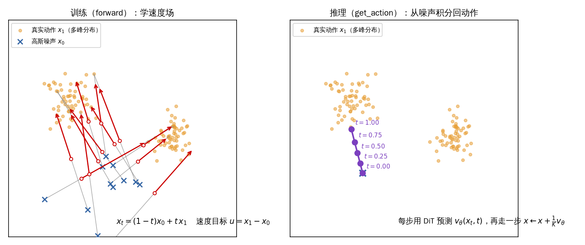

# 06 · 扩散 Action Head 原理（如何"想"出动作）

> 目标：讲清 action head 为什么用"流匹配/扩散"来生成动作，以及推理时那一层 `for t in range(num_steps)`
> 到底在做什么。这是全课程**最核心的原理章**。
> 对应代码：`Isaac-GR00T/gr00t/model/action_head/flow_matching_action_head.py`、`cross_attention_dit.py`

## 1. 为什么不能用"一次前向"直接出动作？

- 机器人动作是**多模态的**：同一场景下"往左够"可能是对的，"往右够"也可能是对的（同样合理）。
- 回归模型（直接预测动作）会"取平均"，得到**模糊/不合理**的中间动作；且难以表达多解。
- 生成模型（扩散/流匹配）能**采样**：每次都从噪声还原出**一条完整合理的动作轨迹**，天然多解。

## 2. 流匹配（Flow Matching）直觉


*图：自绘——左：训练时在高斯噪声 x₀ 与真实动作 x₁ 之间取直线插值，红箭头即模型要学的常速度场 u=x₁−x₀（右上的两个点簇=动作的多峰分布，这正是"回归求均值会坍缩"要解决的问题）；右：推理时从噪声出发，用 DiT 预测的速度场做 K 步 Euler 积分，逐步落到某个动作模式上*


想象在"纯噪声 ε ~ N(0,1)"和"真实动作 x"之间，画一条**直线插值**：

- 训练时我们知道"数据点 x 和随机噪声 ε"，定义：
  - 噪声轨迹：`noisy = (1-t)·ε + t·x`（t 从 0→1，从噪声"走"到数据）
  - 目标速度场：`velocity = x - ε`（数据相对噪声的位移）
- 模型学的是：给定 `noisy` 和时刻 `t`，预测 `velocity`。即模型是一个**速度预测器**。
- **推理（采样）时**：从纯噪声开始，沿着模型预测的速度场用 **Euler 法逐步积分**，`t: 0→1`，
  噪声就被"一步一步搬"成了动作。

> 类比：想象让一团噪声"被风吹着"走一条路，模型负责告诉每一时刻"该朝哪个方向、以多快速度走"，
> 走到底就是一张清晰的图（这里是一段动作轨迹）。

### 训练里的关键代码（forward）
```python
noise = torch.randn(actions.shape, ...)
t = self.sample_time(B, ...)          # 从 Beta 分布采时间(偏向两端/中段)
t = t[:, None, None]                  # (B,1,1) 广播
noisy_trajectory = (1 - t) * noise + t * actions   # 直线插值
velocity = actions - noise                            # 速度场目标
...
loss = F.mse_loss(pred_actions, velocity, reduction="none") * action_mask
```
- `sample_time` 用 Beta 分布调度 t，使得对中段/端点分配不同权重（`noise_s` 控制），学得更稳。
- 时间被离散化成 `num_timestep_buckets` 个桶，喂给正弦位置编码（`SinusoidalPositionalEncoding`）。

## 3. 推理采样：get_action 里的去噪循环

```python
@torch.no_grad()
def get_action(self, backbone_output, action_input):
    backbone_output = self.process_backbone_output(backbone_output)  # layernorm + vl self-attn
    vl_embs        = backbone_output.backbone_features
    embodiment_id  = action_input.embodiment_id

    # 状态条件编码
    state_features = self.state_encoder(action_input.state, embodiment_id)

    # 从纯噪声出发
    actions = torch.randn((B, self.config.action_horizon, self.config.action_dim), ...)

    num_steps = self.num_inference_timesteps          # 去噪步数(默认可调)
    dt = 1.0 / num_steps

    for t in range(num_steps):                        # 逐步 Euler 积分
        t_cont = t / num_steps
        t_discretized = int(t_cont * self.num_timestep_buckets)

        # 把"当前动作轨迹+时间"编码
        action_features = self.action_encoder(actions, timesteps_tensor, embodiment_id)
        if self.config.add_pos_embed:
            action_features = action_features + self.position_embedding(pos_ids)

        # 拼接 状态 + future tokens + 动作 作为自注意力序列
        future_tokens = self.future_tokens.weight.unsqueeze(0).expand(B,-1,-1)
        sa_embs = torch.cat((state_features, future_tokens, action_features), dim=1)

        # DiT 前向：以 vl_embs(视觉语言) 为 cross-attention 条件
        model_output = self.model(hidden_states=sa_embs,
                                  encoder_hidden_states=vl_embs,
                                  timestep=timesteps_tensor)
        pred = self.action_decoder(model_output, embodiment_id)
        pred_velocity = pred[:, -self.action_horizon:]   # 只取动作部分

        actions = actions + dt * pred_velocity           # Euler 一步更新

    return BatchFeature(data={"action_pred": actions})
```
核心就是那一行：
```python
actions = actions + dt * pred_velocity     # 欧拉法求解 ODE: dx/dt = velocity
```
- **步数越多越精细**：`num_inference_timesteps`（即 policy 里的 `denoising_steps`）是"质量 ↔ 延迟"
  的旋钮。GR00T-N1.5 常用 4 步左右已经能出不错结果。
- `@torch.no_grad()`：推理不求梯度，省显存、更快。

## 4. action head 的组成部件（各自干嘛）

| 部件 | 作用 |
|---|---|
| `state_encoder`(CategorySpecificMLP) | 把机器人当前 state 编码成条件特征 |
| `action_encoder`(MultiEmbodimentActionEncoder) | 把"当前(噪声)动作轨迹 + 时间 t"编码成 token |
| `action_decoder`(CategorySpecificMLP) | 把 DiT 输出解回动作空间 `(B, H, action_dim)` |
| `DiT`(cross_attention_dit) | 扩散 transformer 主体，做自注意力+以 vl 为条件的交叉注意力 |
| `future_tokens`(nn.Embedding) | 一组可学习的"未来目标" token，辅助生成 |
| `vl_self_attention` + `vlln`(LayerNorm) | 对 backbone 特征先做层归一化+自身注意力提炼 |
| `position_embedding` | 给动作 token 加位置信息（顺序/时间） |

## 5. Multi-embodiment 怎么实现（CategorySpecific*）

```python
class CategorySpecificLinear(nn.Module):
    self.W = nn.Parameter(0.02 * torch.randn(num_categories, input_dim, hidden_dim))
    self.b = nn.Parameter(torch.zeros(num_categories, hidden_dim))
    def forward(self, x, cat_ids):
        return torch.bmm(x, self.W[cat_ids]) + self.b[cat_ids].unsqueeze(1)
```
- 对每一种 embodiment（`cat_ids`）保存**一套独立的线性权重** → 同一个模型可服务多种机器人，只换投影头。
- `bmm` 按 batch 里每条样本的 `cat_ids` 取对应权重矩阵做批量矩阵乘。
- 这正是第 03 章 `EMBODIMENT_TAG_MAPPING`（gr1:24, oxe_droid:17, ...）落地的位置：
  `embodiment_id` 从字符串映射成一个下标，用来选 CategorySpecific 的权重。

## 6. 串联全链路（本节课的"成品图"）

```
backbone_features (看懂世界) ─┐
                              ├─► process_backbone_output(LN+自注意力) → vl_embs → DiT 的交叉注意力条件
state(当前状态)                ┘
动作轨迹(从噪声开始) ──► action_encoder(+时间) ──► [state | future | action] 序列 ──► DiT ──► action_decoder ──► velocity
                                                                                              ▲
                     for t in 0..num_steps: actions += dt * velocity    (欧拉去噪)
```
- backbone 提供"语义条件"，DiT 在这个条件下"逐步把噪声变成动作"。这就是双脑分工的原理落点。

## 7. 本章小结

- action head 用**流匹配/扩散**：学一个"速度场"，从噪声还原动作 → 支持多模态动作。
- 训练：`noisy=(1-t)ε+t·x`，目标 `velocity=x-ε`，MSE 损失。
- 推理：从随机噪声出发，`num_steps` 步欧拉积分去噪，得到 `action_pred`。
- 全程无梯度（`@torch.no_grad()`）；`denoising_steps` 是质量/延迟旋钮。
- category-specific 权重实现"一个模型多种机器人本体"。

## 自己动手

1. 手推一遍：如果 `num_steps=1`（`dt=1`），`get_action` 变成 `actions = noise + 1·velocity ≈ x`，
   说明即使 1 步也能近似还原——验证欧拉积分离散。
2. 打开 `cross_attention_dit.py`，找到 `DiT.forward`，确认 `encoder_hidden_states=vl_embs` 用的
   cross-attention，以及 `timestep` 是怎么进入各层的（加分项）。

## 疑问与批注

（预留：记录问题。）
