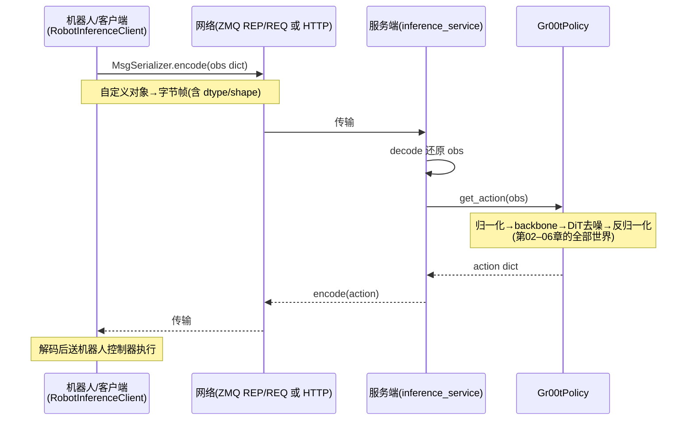

# 07 · 推理服务入口（对外部开放 get_action）

> 目标：理解推理框架怎么"装成服务"，让机器人/仿真/Web 应用能通过网络调用模型。
> 对应代码：`Isaac-GR00T/scripts/inference_service.py`、`gr00t/eval/service.py`、`robot.py`、`http_server.py`

## 1. 分层：策略层 vs 服务层

- **策略层**（第 03-06 章）：`Gr00tPolicy` 在**进程内/机器内**完成"观测 → 动作"。
- **服务层**（本章）：把策略"包一层服务"，通过网络暴露 `get_action`，方便**跨进程/跨机器**调用。
- 关键：服务端内部真正干活的还是 `Gr00tPolicy`；客户端只是"远程代理"。

## 2. 两种传输方式

`inference_service.py` 支持两种协议，用 `--http-server` 区分：
1. **ZMQ（默认）**：高性能消息队列，适合机器人与服务在同地/低延迟场景。
2. **HTTP（FastAPI）**：REST API，便于 Web 应用等任意语言客户端集成。

启动方式：
```bash
python scripts/inference_service.py --server --http-server --port 8000   # HTTP 服务端
python scripts/inference_service.py --client --http-server --host 0.0.0.0 --port 8000  # HTTP 客户端
python scripts/inference_service.py --server                              # ZMQ 服务端
```

## 3. 服务端是如何"包"策略的（main 里 server 分支）

```python
data_config = load_data_config(args.data_config)
modality_config   = data_config.modality_config()
modality_transform = data_config.transform()
policy = Gr00tPolicy(model_path=..., modality_config=..., modality_transform=...,
                     embodiment_tag=..., denoising_steps=...)   # 组装策略(第03-06章)
# 可选：TensorRT 加速
if args.use_tensorrt:
    setup_tensorrt_engines(policy, args.trt_engine_path, args.vit_dtype, args.llm_dtype, ...)
# 再包一层网络服务
server = RobotInferenceServer(policy, port=args.port, api_token=args.api_token)  # 或 HTTPInferenceServer
server.run()
```
- 服务端起在 GPU 侧，加载一次模型，然后**反复监听请求**做推理。
- `--use-tensorrt` 用部署引擎加速（把 ViT/LLM/DiT 各自编成 TensorRT engine），是性能优化手段
  （这部分属于第 09 章"加速推理"的一个落地）。

## 4. ZMQ 服务/客户端实现（`eval/service.py`）

### MsgSerializer：自定义对象怎么过网络
ZMQ 传的是字节。为了让 dict 里能夹带 `np.ndarray` 和 `ModalityConfig`，用 msgpack + 自定义编解码：
```python
def encode_custom_classes(obj):
    if isinstance(obj, ModalityConfig): return {"__ModalityConfig_class__": True, "as_json": obj.model_dump_json()}
    if isinstance(obj, np.ndarray):
        b = io.BytesIO(); np.save(b, obj, allow_pickle=False)
        return {"__ndarray_class__": True, "as_npy": b.getvalue()}
    ...
def decode_custom_classes(obj):
    if "__ndarray_class__" in obj: return np.load(io.BytesIO(obj["as_npy"]), allow_pickle=False)
    ...
```
即：numpy 数组序列化成字节、ModalityConfig 序列化成 JSON，收到时还原。

### BaseInferenceServer：REP 端监听
```python
self.socket = zmq.Context().socket(zmq.REP); self.socket.bind(f"tcp://{host}:{port}")
self.register_endpoint("ping", self._handle_ping, requires_input=False)
self.register_endpoint("kill", self._kill_server, requires_input=False)
# 客户端默认 endpoint 是 "get_action"
def run(self):
    while self.running:
        message = self.socket.recv()
        request = MsgSerializer.from_bytes(message)
        if not self._validate_token(request): ...  # API token 校验
        endpoint = request.get("endpoint", "get_action")
        ...
        result = handler(request.get("data", {}))   # 调用策略
        self.socket.send(MsgSerializer.to_bytes(result))
```
- **REP/REQ 模式**：一问一答同步通信。
- 支持**注册多个 endpoint**（ping/kill/get_action...），可扩展。
- `api_token` 开启鉴权，`_validate_token` 校验。

### RobotInferenceServer / Client
- `RobotInferenceServer(policy, ...)`：把策略包装成 handler，get_action 等被网络调用。
- `RobotInferenceClient(...)`：同时也是 `BasePolicy`！它实现了 `get_action`，但**内部是发网络请求**。
  这样就实现了"本地策略 ↔ 远程策略"的**接口统一**（`eval_policy.py` 里两种都能用）。

## 5. 客户端侧（`_example_zmq_client_call` / `_example_http_client_call`）

- ZMQ 客户端：`policy_client = RobotInferenceClient(host, port, api_token)`；`policy_client.get_action(obs)`。
- HTTP 客户端：`requests.post(f"http://{host}:{port}/act", json={"observation": obs})`。
- 服务端 demo 的 `obs` 形状注释（以 fourier_gr1_arms_waist 为例）：
  - 输入：`video.ego_view (1,256,256,3)`、`state.* (1,D)`
  - 输出：`action.* (16, D)` —— 即一次输出 16 步未来动作（action_horizon=16）。

## 6. 一次请求的完整旅程


*图：一次 RPC 的完整时序——网络两端各自只依赖"序列化契约"（§4 的 MsgSerializer），模型链路整体被服务端封装*


```
机器人/客户端
   │ GET/POST action(obs)
   ▼ ── 网络 ──► 服务端
   │ request = decode(request_bytes)
   │ policy.get_action(normalize→model→denormalize)   # 第02-06章
   │ response = encode(action_bytes)
   ▼ ── 网络 ──► 客户端拿到动作，交给机器人执行
```

## 7. 本章小结

- 推理服务 = 「Gr00tPolicy + 网络封装」：服务端反复监听、客户端远程代理。
- 双模式：ZMQ（高性能/默认）与 HTTP（REST/易集成）。
- 序列化用 msgpack + 自定义 numpy/ModalityConfig 编解码；支持 endpoint 扩展与 api_token 鉴权。
- `RobotInferenceClient` 本身实现了 `BasePolicy`，使"本地/远程策略"调用方式一致。

## 自己动手

1. 打开 `service.py`，把 `MsgSerializer.encode_custom_classes` 会处理的类型列出来，
   想一下为什么 numpy 要用 `allow_pickle=False`（安全性）。
2. 打开 `eval/robot.py` 看 `RobotInferenceClient.get_action` 具体调用哪个 endpoint。

## 疑问与批注

（预留：记录问题。）
