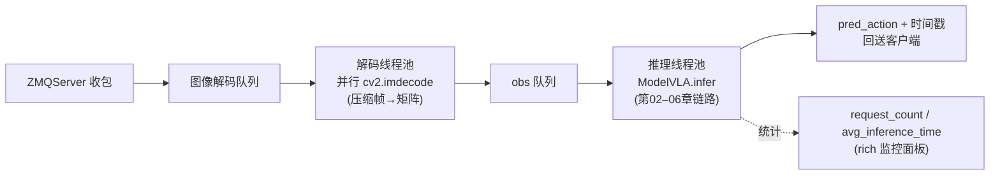

# 08 · 端到端部署 VLA 管线（vla_infer：从机器人到模型再到动作）

> 目标：理解"真正让机器人跑起来"的部署管线 vla_infer —— 它是怎么把相机/状态实时送给模型、
> 又把预测动作实时送回机器人的。这一层把前几章讲的模型真正接到真实世界。
> 对应代码：`tao/vla_infer/`

## 1. vla_infer 是什么

`vla_infer` 是一套**完整的 VLA 部署框架**（client/server），服务端支持多种模型：
```python
if config.type == ModelType.ACT:          from server.models.act.act import ModelVLA as ACT
elif config.type == ModelType.GR00T_N1_5: from server.models.gr00t.gr00t_n1_5 import ModelVLA as GR00T_N1_5
elif config.type in (RDT, SMOLVLA, GO1, PI0, PI05, TAO): ...
```
对我们而言重点是 `GR00T_N1_5`，它内部其实就是**复用 Isaac-GR00T 的 `Gr00tPolicy`**（第 03 章的对象直接拿来用）。

## 2. GR00T_N1_5 的 ModelVLA 封装（server/models/gr00t/gr00t_n1_5.py）

```python
class ModelVLA:
    def __init__(self, config):
        model_path = config['model_path']
        meta_data_path = os.path.join(model_path, 'experiment_cfg/metadata.json')
        # 1) 从 metadata 解析每个 state key 在拼接向量里的 [start,end] 切片
        self.delta_indices[key]['start_index']/['end_index'] = ...
        # 2) 从 data_config 取 modality_config + transform
        data_config = DATA_CONFIG_MAP[self.cfg['data_config_key']]
        modality_config    = data_config.modality_config()
        modality_transform = data_config.transform()
        # 3) 组装(复用 gr00t 库)
        self.policy = Gr00tPolicy(model_path=..., embodiment_tag=...,
                                  modality_config=..., modality_transform=...,
                                  device=device, denoising_steps=4)

    def infer(self, sequence):
        data = sequence[0]
        obs = data['obs'].copy()
        # 把相机/语言/状态整理成 Gr00tPolicy 期望的 key
        inp_obs = {
            "video.cam_top_head":    obs['cam.head'][None],
            "video.cam_left_wrist":  obs['cam.hand_left'][None],
            "video.cam_right_wrist": obs['cam.hand_right'][None],
            "annotation.human.task_description": obs['language'],
        }
        for key in self.delta_indices:   # 按 metadata 切片拼接 state
            inp_obs[key] = obs['state'][:, start:end]
        predicted_action = self.policy.get_action(inp_obs)     # ← 核心：复用第03章策略
        # 拼成 (T, D) 的动作矩阵返回
        predicted_action = np.concatenate([v.reshape(-1,1) if v.ndim==1 else v
                                            for v in predicted_action.values()], axis=1)
        return {"type":"vla_action","pred_action":predicted_action,
                "ref_timestamp":data["ref_timestamp"], ...}
```
要点：
- **复用而非重写**：部署层只负责"数据格式适配 + 调用 `Gr00tPolicy.get_action`"，模型逻辑全在 gr00t 库。
- **state 切片**：metadata 记录了每个关节在拼接向量里的起止下标，部署层据此拆/拼状态。
- 多个相机、语言指令、状态向量，都被整理成 policy 认识的 key（`video.*`, `state.*`, `annotation.*`）。

## 3. 服务端并发管线（server/core/vla_server.py）


*图：自绘——服务端的三级流水：收包 → 并行解码 → 并发推理；两条线程池各自消化"图像解码"与"模型计算"两种不同瓶颈*


- 用 `ZMQServer` 收客户端推来的观测；`VLAServer` 负责编排。
- **图像解码线程池**：相机视频帧以**压缩编码**在网络上传输，服务端用线程池**并行 `cv2.imdecode`** 解码，
  避免单线程成为瓶颈。
- **推理线程池**：`ThreadPoolExecutor(max_workers=...)` 处理多个推理请求。
- 维护 `request_count` / `avg_inference_time` 等统计，供服务监控面板（rich live 界面）展示。

## 4. 端到端闭环（client ↔ server）

```
┌─ 机器人侧 client ──────────────┐        ┌─ GPU 侧 server ─────────────────┐
│ 相机采集(压缩) + 状态读取        │  ZMQ   │ 收包 → 并行解码图像 → 组 obs       │
│ 语言指令(任务描述)               │ ─────► │ ModelVLA.infer → 前几章的推理链路  │
│        ▲                        │        │      ↓                         │
│ 按控制频率执行动作               │ ◄───── │ pred_action + 时间戳            │
└─────────────────────────────────┘        └────────────────────────────────┘
```
- **client**（`client/core/`）负责：采集多相机/状态、维护时序缓冲、把动作送到机器人控制器执行。
- **server** 负责：解码、推理、返回动作。二者通过 ZMQ 解耦 —— 模型跑在 GPU 机器上，
  机器人跑在实时控制器上，互不阻塞。

## 5. 部署侧的工程化细节（这些才是"上线"关键）

1. **控制频率 / 实时性**：推理是"异步请求"；client 按固定周期要新动作，保证平滑执行。
2. **动作 horizon**：一次 `get_action` 输出未来多步动作；client 可滑动执行（每帧消费一步，不足再请求），
   从而容忍网络/推理延迟（"预测-执行"滚动模式，类似 receding horizon）。
3. **时间戳对齐**：返回 `ref_timestamp`/`loc_timestamp`，用于同步观测与动作、以及记录/回放数据。
4. **图像预处理契约：最容易翻车的一环**（真实事故复盘见第 02 章 §7）——
   client 发来的图必须是**训练时那一种画面**，而不只是"尺寸对得上"：
   - 服务端只解码、**不做任何几何修复**：N1.5 的 transform 链只有 `VideoToTensor`+`VideoToNumpy`，
     Eagle 处理器又是 `do_resize=false / do_pad=false`，喂进去歪的，模型就按歪的学。
   - 所以 **letterbox（等比缩放 + 居中补黑边）应当由服务端保证**，且与训练路径等价；
     **禁止非等比拉伸**——它能让 `check_input`、token 数、序列长度全部与训练一致，**全程不报任何错**，
     却把画面纵向拉长 1.6 倍，真机上表现为定位偏移、动作块互相矛盾、末态失稳。
   - 建议两道闸并列：① 尺寸闸门（现有 `VideoToTensor.check_input`）；② **黑边不变量检查**
     （训练帧首/末各 ~15% 行应接近纯黑）。第二条才抓得住"尺寸全绿但几何错了"这一类 bug。
5. **`torch.compile` 加速**（run_server.py）：
   ```python
   model.policy.model.action_head.model.forward = torch.compile(..., mode="max-autotune")
   model.policy.model.backbone.model.forward   = torch.compile(..., mode="reduce-overhead")
   ```
   对 backbone / action head 的 forward 做 JIT 编译，是部署时最直接的提速手段。

## 6. 与第 07 章"推理服务"的区别

- 第 07 章 `inference_service.py`：面向**通用/示例**的服务封装（ZMQ 或 HTTP），demo 性质，单模型。
- 本章 `vla_infer`：**生产级部署管线**，面向真实机器人；有并发解码、控制闭环、实时监控、支持多种 VLA 模型。
- 两者思想一致（"策略 + 网络封装"），vla_infer 更工程化、更贴近实机。

## 7. 本章小结

- vla_infer 是"从机器人到模型再到机器人"的完整闭环：client 采数据 → server 解码+推理 → 动作回送执行。
- GR00T_N1_5 的 `ModelVLA` 直接复用 `Gr00tPolicy`，只做数据适配（state 切片、key 映射）。
- 工程要点：并发图像解码、线程池推理、horizon 滚动执行、时间戳对齐、`torch.compile` 加速，
  以及**与训练一致的图像几何**（第 02 章 §7：尺寸检查通过 ≠ 几何一致，非等比拉伸会静默毁掉真机表现）。

## 自己动手

1. 打开 `server/models/gr00t/gr00t_n1_5.py` 的 `infer`，列出它把原始 obs 转换成了哪几个 policy key。
2. 想一下：为什么要在推理前用线程池解码图像而不是直接用原图？(提示:网络带宽/CPU vs GPU)

## 疑问与批注

（预留：记录问题。）
