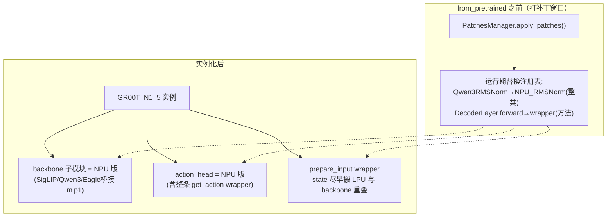

# 09 · 加速推理：把 GR00T 搬上 NPU/LPU（transformers_npu / groot_ops / vllm_evas）

> 目标：理解"推理变快"的底层手段——如何把 GR00T 的重型模块（Qwen3 文本、SigLIP 视觉、DiT 动作头）
> 在**不重写整个模型**的前提下，替换成在自研 NPU(E200）上运行的融合算子。
> 对应代码：`Isaac-GR00T/gr00t/transformers_npu/`、`groot_ops/`、`vllm_evas/`

## 1. 为什么需要加速 / 加速在哪一层

- GR00T 一次推理 = backbone（SigLIP 视觉 + Qwen3 文本）+ DiT 动作头多次迭代去噪，计算量很大。
- 对机器人要满足**实时性**（低延迟、稳定帧率）。
- 加速手段分几层：
  1. **算子层**：把常用小算子**融合**成一个自定义算子（如 `rmsnorm`、`mlp_gelu_norm`、`fused_mha_out`），
     减少 kernel 启动开销、减少访存。→ `groot_ops`（自研内核，groot_ops 里就是这些算子）。
  2. **模块层**：把 transformer 里"这几个算子组成的子块"整体替换成跑在 NPU 上的版本。
     → `transformers_npu`（运行期补丁）。
  3. **框架层**：把整个 VLLM/LLM 服务接到 NPU 上跑。→ `vllm_evas`。

## 2. 关键机制：运行期"补丁替换"（transformers_npu/patch.py, register.py）


*图：自绘——"不动 gr00t/HF 一行源码"的原理：在类被实例化**之前**把符号表里的类/方法换掉，之后 `from_pretrained` 构造出来的天然是 NPU 版子模块*


核心难点：**不动 gr00t 与 HF 源码**，就能让模型用 NPU 算子。做法是"实例化之前打补丁"：

```
① 在 from_pretrained **之前**调用 PatchesManager.apply_patches()
② 把『源模块类/方法』在运行期替换成『NPU 版类/方法』
③ 之后实例化 GR00T_N1_5 时，构造出来的是 NPU 版子模块
```

两种替换方式（`register.py`）：
```python
PatchesManager.register_patch(Q+"Qwen3RMSNorm",    NPU_RMSNorm)          # 整类替换
PatchesManager.register_patch(Q+"Qwen3DecoderLayer.forward", qwen3_decoder_layer_forward_wrapper)  # 方法包装
```

| 组 | 关键补丁（NPU 版） | 替换了什么 |
|---|---|---|
| Qwen3 文本 | `NPU_RMSNorm/_Qwen3MLP/_Qwen3Attention` + forward 包装 | 语言模型各子块 |
| SigLIP 视觉 | `NPU_SiglipVisionEmbeddings/_Attention/_MLP` + forward 包装 | 视觉编码器 |
| Eagle 桥接 | `eagle_backbone_init_wrapper` | 把 mlp1 换成 NPU 版(1152→2048) |
| 动作头 | `NPU_*` 系列 + `npu_action_head_get_action_wrapper` | DiT/action 各块，甚至整条 get_action |
| 顶层 | `gr00t_n1_prepare_input_wrapper` | state 前移：尽早搬到 LPU 与 backbone 计算重叠 |

### 为什么能"整类替换"还能让别处按名 import 的类也生效？
`patch.py` 在替换时会**遍历 `sys.modules`**，把「当前值仍是旧对象 id」的所有属性一并替换，
从而连 `flow_matching_action_head.SinusoidalPositionalEncoding` 这种"别处 from-import 的绑定"也能换到。
这套基建让补丁覆盖面广且可 `remove_patches()` 回滚。

## 3. 底层算子从哪来：groot_ops（torch_evo / 融合算子）

`groot_ops/ops/torch_ops/` 里是自研算子库，很多直接对应 GR00T 的动作头/Transformer 子块：
```
rmsnorm, layernorm, adaLayernorm, adaln_qkv, adaln_qkv_mha_out,
mlp, mlp_gelu, mlp_gelu_norm, gemm_bias, gemm_norm_rope, linear_qkv,
qwen3_attention, unified_mha, fused_mha_out, reshape_and_cache_flash,
dit_action_head, dit_action_tail, dit_block, self_attn_block,
action_encoder, sinusoidal_pe, timestep_encoder, embedding, proj_out, ...
```
- 每个算子是 `<op>_kernel.ac`（设备内核）+ `<op>_host.cpp`（host 启动）+ `_ffi.cc`（PyTorch 绑定）。
- 通过 `torch_evo`(FFI) 暴露给 Python，让 `transformers_npu` 里的 NPU 类能直接调用。
- 命名能对上 GR00T 结构（如 DiT 被拆成 `dit_head_tail`/`dit_block`/`qkv`/`mlp_gelu_norm` 等融合块），
  说明加速是按"模型计算图切块 + 块级融合"来做的。

## 4. 加速带来的结构变化（理解之前各章的"N1.5"视角)

- **在原版推理**：backbone + action_head 由 HF/torch 原生模块组成（第 04-06 章）。
- **在 NPU 推理**：同一套 `GR00T_N1_5`，但子模块已被补丁替换成调用 `groot_ops` 融合算子的 NPU 版；
  甚至 `get_action` 的整条去噪循环被包装成更高效的版本，并对 `prepare_input` 做"state 前移 + 与 backbone 重叠"。
- 好处：**模型结构、训练/推理接口、数据流（第 01-08 章）完全不变**，只换"底下的算子实现"。

## 5. 实测对比：原生 PyTorch pipeline vs NPU 融合算子 pipeline


上图左列为 gr00t n1.5 e2e 推理的原生 PyTorch 逐算子 pipeline（H20 单卡 profile 口径），
右列为经 `transformers_npu` 补丁 + `groot_ops` 融合算子改写后的 pipeline：

- **端到端**：单步推理 0.826s → v0.1 0.697s → v0.2 0.14s（**−83%，约 5.9×**）；
- **设备利用率**：device busy 13% → 51%——融合消掉了大量小算子启动与访存往返，瓶颈从"调度空隙"回到计算本身；
- **数据搬运**：H2D 1.65GB 基本不变（IO 未变），但算子间 `contiguous/permute` 类拷贝核减少 88–93%（`to_head_major_k` 963 次 → 0）；
- **精度**：融合路径输出与原生 golden 余弦相似度 ≥ 0.99999。

> 口径说明：单 Die E200、e2e infer（1 步去噪 × batch 1）；v0.1/v0.2 指标来自 groot_ops CHANGELOG 与Redmine #162 的 profile 记录，
> 图为示意重绘，算子分组做了归并。

## 6. vllm_evas：把 vLLM 接到 E200

`vllm_evas` 是 vLLM 的**平台集成包**（非 vLLM 本体）：
- `platform.py`：实现 `vllm.platforms.Platform`（设备初始化、能力查询）。
- `ops/` + `registry.py`：注册 EVAS 自定义 torch op。
- `attention/`, `compilation/`, `distributed/`, `worker/`……：对应 vLLM 各模块的 EVAS 侧实现。
- 它把 vLLM 本来跑在 CUDA 上的 LLM **服务**接到 E200 上；内核级别的算子来自 `groot_ops`。
  （主要用于通用 LLM/GPT 服务；GR00T 自身的 VLA 推理主要走 transformers_npu。）

## 7. 三者的分工一句话总结

| 组件 | 作用 | 让什么跑在 NPU |
|---|---|---|
| `groot_ops` | 自研融合算子库(内核+host+FFI) | 单个计算块 |
| `transformers_npu` | 运行期补丁，把 GR00T 子模块换成 NPU 版 | 整个 GR00T(VLA 推理) |
| `vllm_evas` | vLLM 平台集成(Platform+op 注册) | vLLM/LLM 服务 |

**加速的本质**：保持上层接口/数据流不变，用"模块补丁 + 融合算子"把算力压到自研 NPU 上，
从而在真实机器人上满足实时推理需求。

## 8. 本章小结

- 加速在算子/模块/框架三层进行，核心是**运行期打补丁**（`PatchesManager`），不改模型源码。
- `groot_ops` 提供融合算子（rmsnorm/mlp/mha/dit_block…），`transformers_npu` 把它们接到 GR00T。
- `vllm_evas` 负责 vLLM 在 E200 平台的整体集成。
- 对读者：理解"补丁替换 + 融合算子"即可，无需逐行读 `.ac` 内核。

## 自己动手

1. 打开 `transformers_npu/register.py`，数一数动作头(DiT)挂了哪几个补丁。
2. 对照 `groot_ops/ops/torch_ops/` 的算子名，指出哪个对应"MLP+GELU+Norm 融合"、哪个对应"多头注意力"。

## 疑问与批注

（预留：记录问题。）
