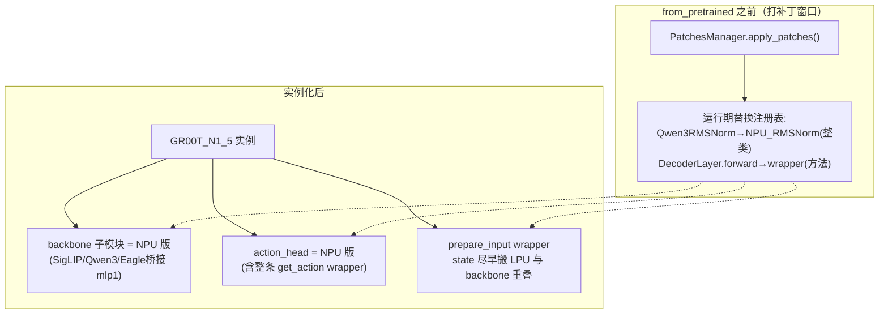
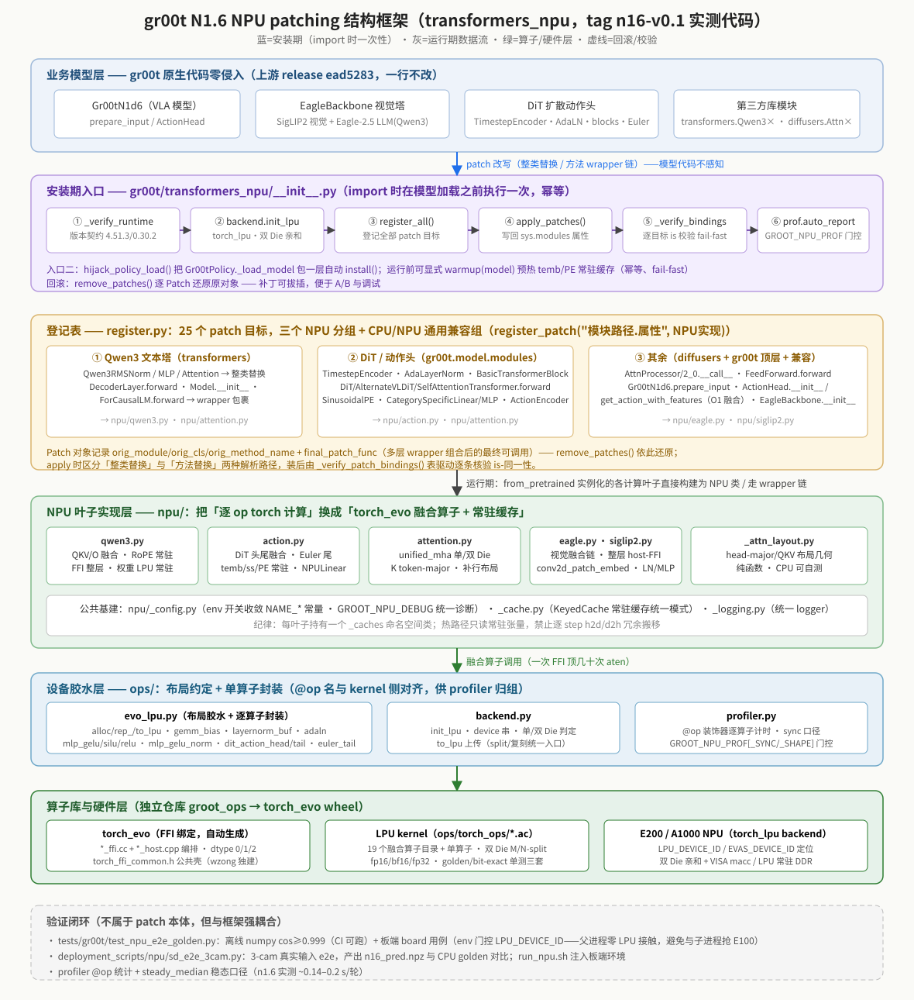
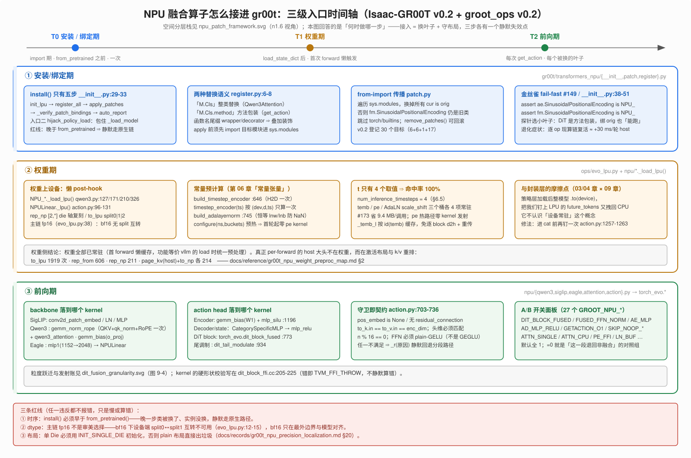
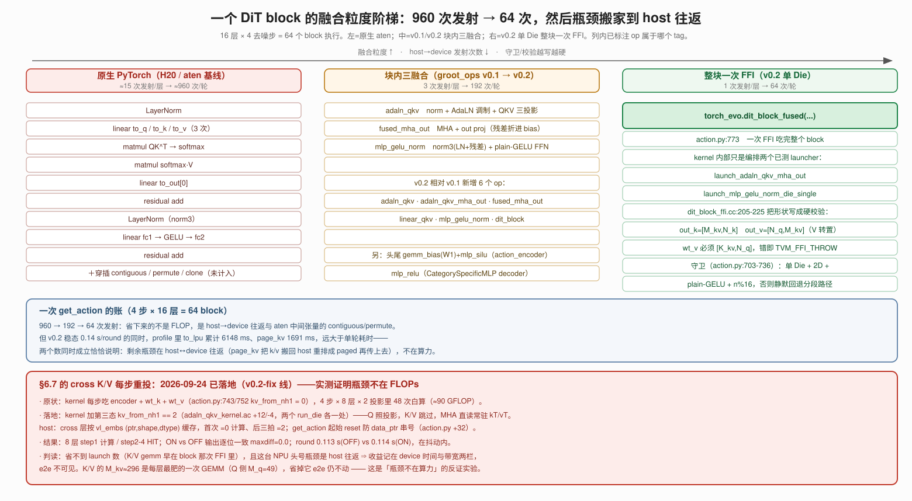
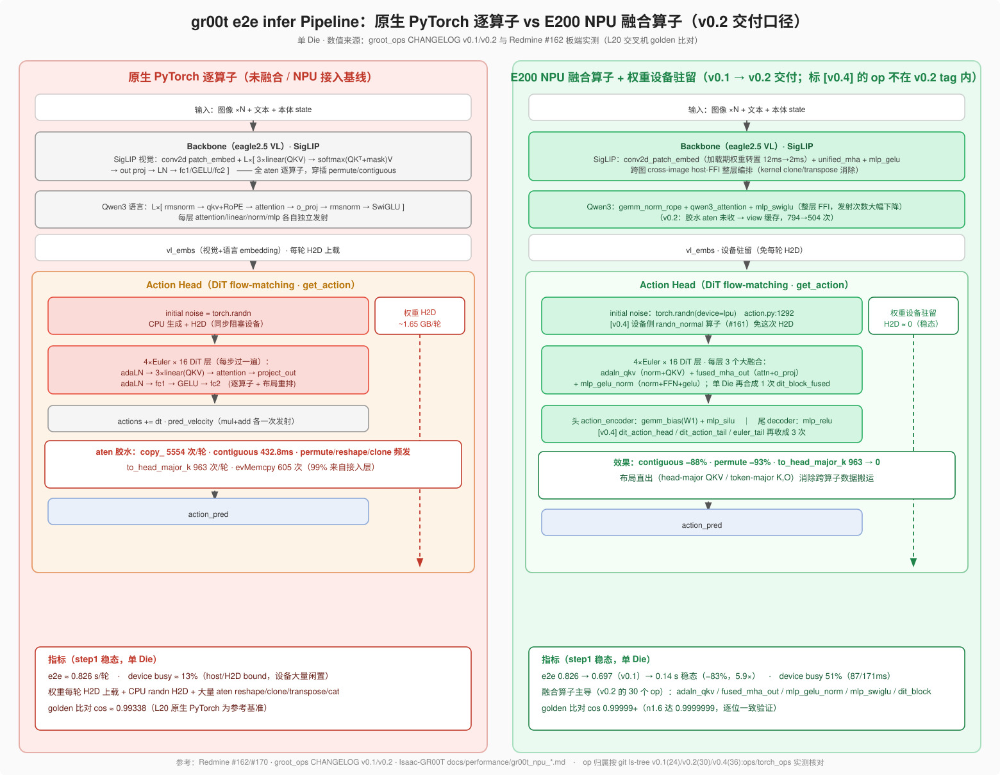

# 09 · 加速推理：把 GR00T 搬上 NPU/LPU（transformers_npu / groot_ops）

> 目标：理解"推理变快"的底层手段——如何把 GR00T 的重型模块（Qwen3 文本、SigLIP 视觉、DiT 动作头）
> 在**不重写整个模型**的前提下，替换成在自研 NPU(E200）上运行的融合算子。
> 对应代码：`Isaac-GR00T/gr00t/transformers_npu/`、`groot_ops/`
>
> **口径声明**：本章 §3–§4、§7 是 **`Isaac-GR00T@v0.2`(`57ca788`) + `groot_ops@v0.2`(`7df9a04`)** 的
> 逐行走读结论（2026-09-24 核对，file:line 可直接跳读）；§2 的分层栈图是 **n1.6 / `tag n16-v0.1`** 视角。
> 两套口径的差异见 §3.1 与 §4.2 的版本阶梯表——**版本号也是契约**（同 06 章 §6.7 附录的教训）。

## 1. 为什么需要加速 / 加速在哪一层

- GR00T 一次推理 = backbone（SigLIP 视觉 + Qwen3 文本）+ DiT 动作头多次迭代去噪，计算量很大。
- 对机器人要满足**实时性**（低延迟、稳定帧率）。
- 加速手段分几层：
  1. **算子层**：把常用小算子**融合**成一个自定义算子（如 `rmsnorm`、`mlp_gelu_norm`、`fused_mha_out`），
     减少 kernel 启动开销、减少访存。→ `groot_ops`（自研内核，groot_ops 里就是这些算子）。
  2. **模块层**：把 transformer 里"这几个算子组成的子块"整体替换成跑在 NPU 上的版本。
     → `transformers_npu`（运行期补丁）。

## 2. 关键机制：运行期"补丁替换"（transformers_npu/patch.py, register.py）


*图 9-1：自绘——"不动 gr00t/HF 一行源码"的原理：在类被实例化**之前**把符号表里的类/方法换掉，之后 `from_pretrained` 构造出来的天然是 NPU 版子模块*


核心难点：**不动 gr00t 与 HF 源码**，就能让模型用 NPU 算子。做法是"实例化之前打补丁"：

```
① 在 from_pretrained **之前**调用 PatchesManager.apply_patches()
② 把『源模块类/方法』在运行期替换成『NPU 版类/方法』
③ 之后实例化 GR00T_N1_5 时，构造出来的是 NPU 版子模块
```

两种替换方式（`register.py`）：
```python
PatchesManager.register_patch(Q+"Qwen3RMSNorm",    NPU_RMSNorm)          # 整类替换
PatchesManager.register_patch(Q+"Qwen3DecoderLayer.forward", qwen3_decoder_layer_forward_wrapper)  # 方法包装
```

| 组 | 关键补丁（NPU 版） | 替换了什么 |
|---|---|---|
| Qwen3 文本 | `NPU_RMSNorm/_Qwen3MLP/_Qwen3Attention` + forward 包装 | 语言模型各子块 |
| SigLIP 视觉 | `NPU_SiglipVisionEmbeddings/_Attention/_MLP` + forward 包装 | 视觉编码器 |
| Eagle 桥接 | `eagle_backbone_init_wrapper` | 把 mlp1 换成 NPU 版(1152→2048) |
| 动作头 | `NPU_*` 系列 + `npu_action_head_get_action_wrapper` | DiT/action 各块，甚至整条 get_action |
| 顶层 | `gr00t_n1_prepare_input_wrapper` | state 前移：尽早搬到 LPU 与 backbone 计算重叠 |

### 为什么能"整类替换"还能让别处按名 import 的类也生效？
`patch.py` 在替换时会**遍历 `sys.modules`**，把「当前值仍是旧对象 id」的所有属性一并替换，
从而连 `flow_matching_action_head.SinusoidalPositionalEncoding` 这种"别处 from-import 的绑定"也能换到。
这套基建让补丁覆盖面广且可 `remove_patches()` 回滚。

### n1.6 实际结构：transformers_npu 包全景（对照 tag n16-v0.1 实测代码）

上面是 n1.5 视角。到 n1.6，同一套机制收拢成自洽的独立包 `gr00t/transformers_npu/`，并强调
**零侵入**：gr00t 原生文件恢复为上游 release `ead5283`，全部集成改动迁入 patch 层。整体是
"五层纵向栈 + 旁路验证闭环"：


*图 9-2：自绘——对照 n16-v0.1 实测代码逐文件核对：install() 六步流水线、25 个登记目标、npu 叶子、
ops 胶水、torch_evo/LPU。与第 13 章对照：L20 上的 N1.6 实测走的是**未打补丁的原生 GPU 链**
（install() 不执行）；这张图的五层栈是 E200 板端运行 N1.6 时的完整形态。*

逐层读图（与代码对照）：

1. **安装入口**（`__init__.py`，幂等）：`install()` 六步——①版本契约断言
   （`transformers==4.51.3`/`diffusers==0.30.2`，**以板端实测组合为准**，与 pyproject pin
   不一致时以实测为契约）；②`init_lpu` 双 Die 初始化；③`register_all()`；④`apply_patches()`；
   ⑤`_verify_patch_bindings()` 表驱动逐目标核验"该位置当前值 **is** 替换对象"，缺漏当场
   fail-fast——防止"只打上一般补丁、悄悄走 eager 慢路径"；⑥profiler 自动报告。
   另有第二入口 `hijack_policy_load()`（把 `Gr00tPolicy._load_model` 包一层自动 install）；
   权重就位后可显式 `warmup(model)` 预填 temb/PE 常驻缓存，首轮 `get_action` 即命中热路径。
2. **登记表**（`register.py`）：25 个目标 = Qwen3 文本塔 6 + 动作头相关 17（DiT/embodiment 模块，
   含 diffusers 的 AttnProcessor×2 与 FeedForward，以及 `Gr00tN1d6.prepare_input` state 前移）
   + **兼容组 2**（`register_model_compat`：EagleBackbone 构建 + 确定性噪声，CPU/NPU 通用——
   生成 CPU golden 时**只应用这一组**、不碰 LPU，这是三代对照能同机共存的基础）。
   每个 `Patch` 对象记住原绑定，`remove_patches()` 整体拔除回滚。
3. **npu 叶子**（`npu/`）：真正的计算替换实现。统一纪律——每叶子一个 `_caches` 命名空间类、
   热路径只读常驻张量、env 开关集中走 `_config.NAME_*`（诊断统一 `GROOT_NPU_DEBUG`）。
4. **ops 胶水**（`ops/`）：`evo_lpu.py` 把布局约定（head-major、双 Die split、fp16/bf16/fp32）
   封装成 `@op` 命名的逐算子调用；`profiler.py` 按同一 `@op` 名归组计时——所以 profiler
   报表与算子名天然对齐，定位慢点不用猜。
5. **算子库/硬件**：`torch_evo`（groot_ops 仓产出的 wheel）→ `.ac` kernel → E200 双 Die。
   patch 层不重复实现任何 kernel。

debugging 提示：e2e trace 里若模块名仍是**原类名**（逐 op 现算链复活，约 +30ms/轮 host 开销），
说明某叶子绑定没生效——先看安装期两个 fail-fast 是否被绕过，再用 `remove_patches()` 回滚做 A/B。

## 3. 走读 v0.2：融合算子究竟"怎么接进来"的（三级入口）

§2 回答的是"为什么能不改源码"。本节回答的是另一个问题：**接入这件事发生在哪几个时刻、
每个时刻做什么、每个时刻的静默失效点在哪**。这条时间轴是 §2 那张空间分层栈的正交视角。

### 3.1 先定锚：两个仓库、一条 FFI 边界

| 仓库 | tag | commit | 角色 |
|---|---|---|---|
| `groot_ops` | `v0.2` | `7df9a04`（09-11 07:41:41） | **算子供给方**：`ops/torch_ops/<op>/` = `<op>_kernel.ac` + `_host.cpp` + `_ffi.cc` |
| `Isaac-GR00T` | `v0.2` | `57ca788`（09-11 07:41:42） | **集成方**：`gr00t/transformers_npu/`（5270 行 Python），把 `nn.Module` 叶子换成 `torch_evo.<op>` |

两侧唯一的契约是 **`torch_evo.<op>` 的符号名 + 张量布局（形状 / `split_dim` / dtype）**。
同名 tag 不代表代码同源，只代表这一刻 ABI 对得上。所以本章第一句话不是"怎么加速"，而是：
**接入 = 换叶子 + 守布局**。

### 3.2 三级入口总览


*图 9-3：自绘（`tools/mk_fig_ch09_three_stage.py`）——T0 安装/绑定期、T1 权重期、T2 前向期。
三段各有一个**不报错**的失效点：T0 装晚了 → 静默走原生链；T1 布局/dtype 错 → 算错或出垃圾；
T2 守卫不满足 → 静默回退分段路径。底部三条红线详见 §3.3–§3.5。*

### 3.3 T0 · 安装/绑定期：一次性的符号替换

`gr00t/transformers_npu/__init__.py:24-35` 的 `install()` 只有五步：

```
init_lpu()  →  register_all()  →  apply_patches()  →  _verify_patch_bindings()  →  auto_report()
```

**(a) 时序是硬契约。** `hijack_policy_load()`（`:68-86`）把 `install()` 塞进
`Gr00tPolicy._load_model` 的 `from_pretrained` **之前**。晚一步会怎样？模型已经用原生
`nn.Module` 实例化完了，patch 只改了类对象，实例里的子模块还是原对象——
**静默走回 GPU/CPU 逐算子路径，没有任何报错**。接上第 03 章：NPU 接入是"插在策略层加载前的钩子"，
不是模型的属性。

**(b) 两种替换语义。** `register.py:6-8`：

| 目标串 | 语义 | 例 |
|---|---|---|
| `"<module>.<Class>"` | **整类替换** | `Qwen3Attention → NPU_Qwen3Attention`（`register.py:25`） |
| `"<module>.<Class>.<method>"` | **方法包装** `wrapper(orig)->new` | `FlowmatchingActionHead.get_action`（`register.py:96`） |

`patch.py::_split_target` 按 `.` 段数解析；函数名以 `wrapper`/`decorator` 结尾 ⇒ 当装饰器叠加，
否则当替换对象。**看名字就能猜出它是"换掉"还是"包一层"**——这套代码用命名纪律换掉了显式声明。
另有一条前置条件：`register_all()` 里每个目标模块都先 `import` 进 `sys.modules`
（`:18/31/44/52-56/99`），否则 apply 时解析不到宿主。v0.2 共 **30 个登记目标**：
Qwen3 6 + SigLIP 6 + Eagle 桥接 1 + diffusers AttnProcessor 2 + 动作头 13 + `prepare_input` 1 + `FeedForward` 1。

**(c) from-import 传播 + fail-fast。** `from x import Cls` 在导入瞬间就把 `Cls` 抄进了调用方命名空间，
只改 `x.Cls` 不够——于是 `patch.py` 遍历 `sys.modules` 把所有 `cur is orig_func` 的绑定一并替换
（跳过 torch/builtins）。这个坑的代价被写成了断言（`__init__.py:38-51`）：

```python
assert ae.SinusoidalPositionalEncoding is N    # action_encoder 侧
assert fm.SinusoidalPositionalEncoding is N    # flow_matching_action_head 的 from-import
# 失败症状写在 docstring 里：逐 op 现算链复活，~30ms/轮 host
```

注意探针挑的是 **`SinusoidalPositionalEncoding` 这种小叶子**，不是 DiT。理由很工程化：小叶子只有一条
替换路径，`is` 判定干净无歧义；DiT 是**方法包装**，实例就算绑了 `orig` 也照样"看起来能跑"。
**用最容易静默退化、且断言成本最低的地方当金丝雀。**

### 3.4 T1 · 权重期：懒上设备 + 常量预计算

原生 `load_state_dict` 完成后，各 NPU 类挂的 post-hook `_load_lpu()` 才把权重搬上设备并转布局：
`qwen3.py:127/171/210/326`、`NPULinear._lpu()`（`action.py:96-131`）。布局三态：
`split0` = M-split（行切两 Die）、`split1` = N-split、paged = `split2`，另有 `rep_np` 的 `[2,*]` die 轴复刻。

主链 dtype 是 **fp16 不是 bf16**（`evo_lpu.py:38 H_DT`），原因写在文件头 `:12-15`：
**bf16 下 split0↔split1 布局互转在设备端不可用**。典型的"硬件 ABI 反过来决定数值格式"。

权重侧的真正结论在 `docs/reference/gr00t_npu_weight_preproc_map.md` §1/§4：

> **权重全部已缓存**（首次 forward 常驻，功能等价 vllm 的 load 时统一预处理）；per-forward 的
> host 大头**不在权重**，而在 `to_lpu`(1919 次)、`rep_np`(211)、`rep_from`(606)、
> `page_kv(host)`(214)+`to_np`(214)——**激活布局与 k/v 重排的 host 往返**。

更值得划线的是**常量预计算**，它直接兑现第 06 章"常量张量的另一面课堂"那张表：

| 预计算 | 位置 | 对应第 06 章结论 |
|---|---|---|
| `build_timestep_encoder`（H2D 一次） | `evo_lpu.py:646-673` | temb 只依赖 t |
| `timestep_encoder(ts,…)` 按 `(device,d,ts)` 桶**只算一次** | `evo_lpu.py:674-700` | **t 只有 4 个取值** ⇒ 命中率 100% |
| `NPU_TimestepEncoder.configure(ns,buckets)` + `pe.configure(ah,ns,buckets)` 预热 | `action.py:1240-1251` | 同上，注释原话"ITER1 起零 pe kernel" |
| `build_adalayernorm`（Ada 权重 + **恒等 lnw/lnb**） | `evo_lpu.py:745-757` | AdaLN 的 scale/shift 由 temb 线性生成；恒等 LN 是规避单 Die passthrough 的 NaN 缺陷 |
| `_temb_l` 按 `id(temb)` 缓存 | `evo_lpu.py:107-121` | 同一 forward 各 block 共用 temb，免逐 block d2h+重传 |
| `_ensure_future_token_lpu` | `action.py:1257-1263` | 见下 |

最后一行最有意思：策略层加载完模型会对整模型 `.to(device)`，把我们钉上 LPU 的 `future_tokens`
**又拽回 CPU**——它不认识"设备常驻"这个概念。修法不是去改封装层，而是**进 `cat` 前再钉一次**。
这是第 03/04 章的封装层和第 09 章的设备层互相打脸的地方，工程上选了"最小侵入 + 幂等"。

### 3.5 T2 · 前向期：每个叶子落到哪个 kernel

| 原生模块 | 落到的算子 | file:line |
|---|---|---|
| `Qwen3RMSNorm` | `rmsnorm` | `qwen3.py:140` |
| `Qwen3MLP`（SwiGLU） | `mlp_swiglu` | `qwen3.py:192` |
| `Qwen3Attention` QKV + qk_norm + RoPE | `gemm_norm_rope` **三件事一次发射** | `qwen3.py:469` |
| Qwen3 attention 本体 | `batch_attention`（paged kv，split2） | `evo_lpu.py:371` |
| `o_proj` | `linear`(gemm_bias) | `qwen3.py:486` |
| SigLIP patch embed | `conv2d_patch_embed` | `evo_lpu.py:583` |
| Eagle `mlp1`(1152→2048) 与 `eagle_linear` | `NPULinear`(gemm_bias) | `eagle.py:50-62` |
| **DiT 整个 block** | **`torch_evo.dit_block_fused` 一次 FFI** | `action.py:773-780` |
| DiT 末尾 AdaLN 调制 | `dit_tail_modulate` | `action.py:934` |
| DiT norm3 + GELU FFN | `mlp_gelu_norm` | `action.py:671` |
| `MultiEmbodimentActionEncoder` | `gemm_bias(W1)` + `mlp_silu(W2a→silu→W3)` + `sinusoidal_pe_die` | `action.py:1196-1207` |
| `CategorySpecificMLP`（state_encoder / action_decoder） | `mlp_relu` 单发 | `action.py:1099` |

**"整块融合"的粒度跃迁**是这一节的核心，单独画成图 9-4（§4.3）。

而 `dit_block_fused` **能不能用**，由一串守卫决定（`action.py:703-736`）：`pos_embed is None`、
无 `residual_connection`、`to_k.in == to_v.in == enc_dim`、QKV 头维匹配、`n % 16 == 0`、
FFN 必须是 **plain-GELU**（`net[0]` 是 GELU 内含 `.proj`，不是 GEGLU）。任一条不满足
⇒ `_r(原因)` 返回 None ⇒ 静默回退分段路径。**这串守卫就是 kernel 的需求说明书**——
它比任何文档都新，因为不满足就跑不出性能数据。

配套的 **A/B 开关有 27 个 `GROOT_NPU_*`**（默认全 1，`=0` 回退原路径）：
`DIT_BLOCK_FUSED`(`:65`)、`FUSED_FFN_NORM`(`:41`)、`FUSED_ADLN`(`:38`)、`AE_MLP`(`:48`)、
`AD_MLP_RELU`(`:53`)、`GETACTION_O1`(`:50`)、`SKIP_NOOP_DROPOUT`(`:535`)、`DIT_2D`(`:58`)、
`PE_FFI`(`:43`)、`LN_BUF`(`:982`)、`ATTN_SINGLE`/`ATTN_CPU`(`_attn_layout.py:179-200`)……
**这套开关本身就是"融合 vs 非融合"的对照实验接口**——第 06 章说"要用 A/B 判断误差来自哪一段"，
这里就是那个开关面板（`scripts/module_ab_*.py`、`single_die_op_ab.py` 直接吃它）。

## 4. 底层算子从哪来：groot_ops（torch_evo / 融合算子）

### 4.1 一个算子 = 三件套

`groot_ops/ops/torch_ops/<op>/` 下每个算子是 `<op>_kernel.ac`（设备内核）+ `<op>_host.cpp`（host 启动）
+ `<op>_ffi.cc`（PyTorch/FFI 绑定），通过 `torch_evo` 暴露给 Python，让 `transformers_npu` 的 NPU 类直接调用。
命名能对上 GR00T 结构（`adaln_qkv`、`mlp_gelu_norm`、`dit_block`…），说明加速是按
"模型计算图切块 + 块级融合"来做的。

### 4.2 版本阶梯：op 集合本身就是 changelog

`git ls-tree -d <tag>:ops/torch_ops` 实测：

| tag | 日期 | op 目录数 | 相对上一版新增 |
|---|---|---|---|
| `v0.1` | 09-05 | 24 | 首个单 Die e2e 可发布版（`unified_mha`/`qwen3_attention` K 改 token-major、`gemm_bias` transpose_out） |
| **`v0.2`** | 09-11 | **30** | `adaln_qkv`、`adaln_qkv_mha_out`、`fused_mha_out`、`linear_qkv`、`mlp_gelu_norm`、`dit_block` |
| `v0.4` | — | 36 | `action_encoder`、`dit_action_head`、`dit_action_tail`、`euler_tail`、`randn_normal`、`self_attn_block` |

**v0.2 的 30 个 op**：`adaLayernorm adaln_qkv adaln_qkv_mha_out attention attention_prefill board_init
conv2d_patch_embed dit_block embedding fused_mha_out gemm_bias gemm_norm_rope gemm_rope layernorm
linear_T linear_qkv macc mlp mlp_gelu mlp_gelu_norm proj_out qwen3_attention relu
reshape_and_cache_flash residual_add rmsnorm silu sinusoidal_pe timestep_encoder unified_mha`。

> **[!] 勘误（版本归属）**：本章早先列算子清单时把 `dit_action_head`/`dit_action_tail`/`self_attn_block`/
> `action_encoder`（以及 §6 图里的 `randn_normal`）记在了 v0.2 名下。实测这三个/那组 op **只存在于 `v0.4` tag**
> （`git ls-tree v0.2:ops/torch_ops` 无，`v0.4` 有；相关提交在 `dev_wzong_review170_euler_tail` 线上）。
> CHANGELOG `[0.2.0]` 标题里的"DiT 头尾融合"在 v0.2 指的是 **`gemm_bias(W1)+mlp_silu`（action_encoder 头）
> 与 `mlp_relu`（CategorySpecificMLP 尾）**，不是那四个专用 op。图 9-5 已按 tag 实测重绘并给 v0.4 项加 `[v0.4]` 标记。
> 教训与 §6.7 附录同源：**能 `ls-tree` 出来的事实，就不要靠记忆写。**

### 4.3 融合粒度阶梯：960 → 192 → 64 次发射，然后瓶颈搬家


*图 9-4：自绘（`tools/mk_fig_ch09_dit_granularity.py`）——同一个 DiT block 在三种粒度下的样子。
16 层 × 4 去噪步 = 64 个 block 执行：原生 aten ≈15 次发射/层 ⇒ ≈960 次/轮；块内三融合 ⇒ 192 次/轮；
`dit_block_fused` 整块 ⇒ **64 次/轮**。省下来的不是 FLOP，是 host→device 往返与 aten 中间张量的
contiguous/permute。右下红框原为"§6.7 未落地项"，现已改为**该优化落地后的实测结论**（详见 §7）。*

三点读图说明：

1. **"整块"不是新写了个大 kernel。** `dit_block_ffi.cc` 头部注释写得很直白：它内部只是编排两个
   **已经分别测过**的 launcher（`launch_adaln_qkv_mha_out` + `launch_mlp_gelu_norm_die_single`）。
   融合块的正确构造方式是**"把已验证的段落进一次 FFI"**，而不是重写一遍数学。
2. **kernel 把形状写成硬校验。** `dit_block_ffi.cc:205-225`：`out_k=[M_kv,N_k]`、
   `out_v=[N_q,M_kv]`（**V 是转置布局**，对应 §6.8 的维度账本）、`wt_v` 必须 `[K_kv,N_q]`、
   `out_q=[N_q,M_q]`，不满足直接 `TVM_FFI_THROW`。**宁可当场抛，不要静默算错**——
   这与 §3.5 守卫"宁可回退，不要勉强融合"是一体两面。
3. **省发射 ≠ 省时间。** v0.2 tag 稳态 0.14 s/round（板端 v0.2-fix 线现已 ~0.113 s/round，
   device 1 / inject3 口径，别与 tag 口径混用），而 profile 里 `to_lpu` 累计 6148 ms、
   `page_kv` 1691 ms（`page_kv` 是把 k/v 搬回 host 重排成 paged 再传上去，`attention.py:306-314`）。
   两个数同时成立恰恰说明：**剩余瓶颈在 host↔device 往返，不在算力**。单 Die 的
   `unified_mha` 稠密非分页路径（`attention.py:278-287`）就是为了绕开 `page_kv` 而生。

## 5. 加速带来的结构变化（理解之前各章的"N1.5"视角)

- **在原版推理**：backbone + action_head 由 HF/torch 原生模块组成（第 04-06 章）。
- **在 NPU 推理**：同一套 `GR00T_N1_5`，但子模块已被补丁替换成调用 `groot_ops` 融合算子的 NPU 版；
  甚至 `get_action` 的整条去噪循环被包装成更高效的版本，并对 `prepare_input` 做"state 前移 + 与 backbone 重叠"。
- 好处：**模型结构、训练/推理接口、数据流（第 01-08 章）完全不变**，只换"底下的算子实现"。

## 6. 实测对比：原生 PyTorch pipeline vs NPU 融合算子 pipeline


*图 9-5：自绘（`tools/mk_fig_ch09_pipeline_compare.py`）——已按 tag 实测校正 op 归属：
`randn_normal`、`dit_action_head`、`dit_action_tail`、`euler_tail` 属 `v0.4`，在图中显式标 `[v0.4]`。*

上图左列为 gr00t n1.5 e2e 推理的原生 PyTorch 逐算子 pipeline（H20 单卡 profile 口径），
右列为经 `transformers_npu` 补丁 + `groot_ops` 融合算子改写后的 pipeline：

- **端到端**：单步推理 0.826s → v0.1 0.697s → v0.2 0.14s（**−83%，约 5.9×**）；
- **设备利用率**：device busy 13% → 51%——融合消掉了大量小算子启动与访存往返，瓶颈从"调度空隙"回到计算本身；
- **数据搬运**：H2D 1.65GB 基本不变（IO 未变），但算子间 `contiguous/permute` 类拷贝核减少 88–93%（`to_head_major_k` 963 次 → 0）；
- **精度**：融合路径输出与原生 golden 余弦相似度 ≥ 0.99999。

> 口径说明：单 Die E200、e2e infer（1 步去噪 × batch 1）；v0.1/v0.2 指标来自 groot_ops CHANGELOG 与
> Redmine #162 的 profile 记录，图为示意重绘，算子分组做了归并。

## 7. 对账：第 06 章的结论，kernel 认不认？

第 06 章是在"数学 + 接口"层推的。这里把它的 8 条结论**逐个按到 v0.2 的 kernel 实参表上**——
这是本课方法论里"结论必须可复跑"的那一半。

| # | 教材结论 | v0.2 代码证据 | 判定 |
|---|---|---|---|
| 1 | §6.7 cross-attn 的 K/V 在一次 `get_action` 的 K 步里恒定，可缓存 | v0.2 tag：`action.py:743` 每次喂 `encoder_l`、`:752` `kv_from_nh1 = 0 if is_cross`、`dit_block_ffi.cc:134-135/205-225` 每步重写 `out_k/out_v`；**2026-09-24 板端 v0.2-fix 线落地**：kernel 加第三态 `kv_from_nh1==2`（`adaln_qkv_kernel.ac` +12/−4）+ host 按 `vl_embs` 缓存（`action.py` +32，`GROOT_NPU_DIT_KV_CACHE`） | ❌ v0.2 tag **未实现**（48 次白算 ≈90 GFLOP）→ ✅ **已落地**：8 次计算 + 24 次复用、ON/OFF **逐位一致**，**但 e2e 无收益**（0.113 vs 0.114 s）；trace 对账：设备 **−6.8 ms/step**、**launch 次数 1228→1228 不变** |
| 2 | §6.7 循环不变量（`state_features`/`future_tokens`/`pos_embs`）该提到循环外 | `action.py:1275-1288`（#152 O1）已提升；`pe.configure` 预热 | ✅ 已做，且有一次**反例回归** `d34a44f`：`pos_ids` 行数误取 `state_horizon(=1)`，16 个 action 行全广播第 0 行位置编码 ⇒ `right_arm/left_hand` cos 掉到 **0.97/0.82** |
| 3 | §6.7 AdaLN 的 scale/shift 只依赖 t，t 只有 4 个取值 | #173 `norm1._scale_shift(temb,n,dev)` 按 `(block,ts)` 缓存（`action.py:821`，省 9.4 MB/调用）；`timestep_encoder` 按 ts 桶常驻 | ✅ **比教材更进一步**：不仅缓存，还吃掉了"t 只取 4 个离散值" |
| 4 | §6.8 DiT self/cross 的 M、kv_len 来源 | `action.py:702` `kv_len = prod(encoder.shape[:-1]) if is_cross else m`；M = 1(state)+32(future)+16(action) = **49**；`attention.py:274` 实测 shape 桶 `LQ64_LKV49`（64 = pad 到 mha_B=64） | ✅ 与 §6.8 序列拼装一致 |
| 5 | §6.8 V 是转置布局 | `dit_block_ffi.cc:214-219`：`out_q=[N_q,M_q]`、`out_v=[N_q,M_kv]`（**转置**）、`out_k=[M_kv,N_k]`，`wt_v` 必须 `[K_kv,N_q]` | ✅ kernel 把转置写成硬校验 |
| 6 | §6.8.5 `encoder_attention_mask` 传而不达 | 原生 `cross_attention_dit.py:172` 该参数被**注释掉**；`dit_block_fused` 的实参表（`action.py:773-780`）里**根本没有 mask 这一位** | ✅ 一致，且 NPU 路径连"传"都省了 |
| 7 | dropout=0.2 仅训练态，推理应关闭 | `GROOT_NPU_SKIP_NOOP_DROPOUT=1`（`action.py:535`）对应原生 `:174` 的 `final_dropout` | ✅ 推理态等价省略 |
| 8 | §6.6 绘图师：t 与动作一起进 encoder | `gemm_bias(W1)` + `mlp_silu`（`:1196-1207`），t 侧 `sinusoidal_pe_die(ts)` 按 ts 缓存 | ✅ 形状一致，且"t 只有 4 值"被 kernel 侧吃干净 |

**一句话总结**：8 条全部得到 kernel 级印证；唯一在 v0.2 tag 上没落地的第 1 条，
**已在 2026-09-24 板端实现并验证**（`kv_from_nh1==2` 第三态，8 次计算 + 24 次复用，
ON/OFF 输出**逐位一致 `maxdiff=0.0`**，`round 0.113 s(OFF) vs 0.114 s(ON)` ⇒ **无端到端收益**）。
实现细节、三个原坑的兑现方式与落地时新暴露的第 4~6 个坑，全部记在**第 06 章 §6.7 附录「落地实况」**。

这次"预测 → 实现 → 实测无收益"的闭环比优化本身更值钱，它坐实了三件事
（第 3 件来自 2026-09-24 的 ON/OFF 两份 perf trace 对账，复跑脚本 `tools/trace_kv_cache_diff.py`）：

1. **§4.3 的账是对的**：这笔优化省不到 launch 数（K/V gemm 早在每 block 那一次 FFI 里），
   而这台 NPU 的头号货币是 host 往返 ⇒ **省掉每层最肥的一次 GEMM（`M_kv≈296` 对比 Q 侧 `M_q=49`）
   加 ~300 MB/round 权重带宽，e2e 一动不动**。"瓶颈不在算力"从推算变成了反证实验。
2. **融合改变可观测性**：整块融合后这笔白算被吞进 `dit_block_fused` 内部，不再出现在 profiler 顶层——
   从"可见的慢"变成"隐形的慢"。**优化被融合吞掉之后，可观测性也要跟着下沉一层**
   （只能靠 `GROOT_NPU_DIT_KV_CACHE=0/1` 这类 A/B 开关量差值，顶层算子名里找不到它）。
3. **瓶颈判据可以直接被 trace 量出来（不必靠 wall-clock 猜）**：ON/OFF 两份 trace 里
   **kernel 总数 1273=1273、`evLaunchKernel` 1228=1228、`evStreamSynchronize` 26=26、`evMemcpyAsync` 46=46**
   ——发射与往返一条没省（第 1 条的结构性证明）；而 13 类 kernel 里 12 类逐类不动，差值精确落在
   把 K/V 投影折进去的 `adaln_qkv_run_die`（45.83→32.38 ms / 2 步，**单次 466 µs → HIT 185 µs**），
   合计 **−6.8 ms/step**，与 step 表 `Computation` 差、kernel 总时长差**三处口径同数**；
   与此同时设备忙比从 70.2% 掉到 47.8%、空闲 +50 ms，增量最大的空闲在每个 DiT block 末尾
   （`mlp_gelu_norm` 之后 11 µs → 391 µs）——**设备算完在等 host 发射**，这才是"e2e 不动"的时域形状。
   ⚠ 引用那两个 step 的 `Step_time`（ON 反而 +44 ms）前先读 06 章 §6.7 的**反证**：ON 那次采样 host
   全局 ×1.5（连补丁碰不到的 backbone 帧一起慢），属 profiler 扰动/单样本噪声，**不可归因给缓存**。

验证口径（要复跑就用这三条，`deployment_scripts/npu/README.md`）：
`sd_e2e.py --no-prof --rounds 5`（稳态 wall）、`dump_action_all.py` + `cos_check.py`
（526-leaf 逐算子对账，不是只看 `action_pred`）、`validate_npu.sh`（commit 前一键）。
v0.2 的 3cam golden：`action_pred` 0.99999 / `left_hand` 0.99200 / `right_hand` 1.00000。

## 8. 两者的分工一句话总结

| 组件 | 作用 | 让什么跑在 NPU |
|---|---|---|
| `groot_ops` | 自研融合算子库(内核+host+FFI) | 单个计算块 |
| `transformers_npu` | 运行期补丁，把 GR00T 子模块换成 NPU 版 | 整个 GR00T(VLA 推理) |

> 注：实际部署未引入 vllm_evas；"权重预导入/设备驻留"的做法仅在方案调研时参考过 vllm_evas 的相关概念
> （对照结论见 §3.4：布局语义不通用，只借它的"统一入口 + 缓存"组织方式）。

**加速的本质**：保持上层接口/数据流不变，用"模块补丁 + 融合算子"把算力压到自研 NPU 上，
从而在真实机器人上满足实时推理需求。

## 9. 本章小结

- 加速在**算子/模块**两层进行，核心是**运行期打补丁**（`PatchesManager`），不改模型源码。
- 接入是一条**时间轴**（图 9-3）：T0 换符号（早于 `from_pretrained`，否则静默失效）→
  T1 懒上设备 + 常量预计算（t 只有 4 值 ⇒ temb/pe/scale_shift 全常驻）→
  T2 每层落到具体 kernel（守卫即契约，不满足就静默回退）。
- **融合的收益主要是"少一次 host→device 往返"**，不是省 FLOP：960 → 192 → 64 次发射/轮，
  0.826 s → 0.14 s/round；剩下的硬骨头仍是 `to_lpu`/`page_kv` 这类 host 往返。
- **布局与 dtype 是 ABI 不是风格**：fp16 主链（bf16 无 split 互转）、`[2,*]` die 轴复刻、
  单 Die 必须 `INIT_SINGLE_DIE`、V 的转置布局由 kernel 硬校验。
- **版本号也是契约**：op 集合可以直接 `git ls-tree` 出来，本章 §4.2/§6 的勘误就是这么抓出来的。
- **"能省"≠"该省"**：§6.7 的 cross K/V 缓存 2026-09-24 落地后 ON/OFF 逐位一致、**e2e 无收益**——
  省掉最肥的 GEMM 也看不见，因为瓶颈是 host 往返。**先量瓶颈，再做常量提升**（第 06 章 §6.7 附录）。
- 对读者：理解"三级入口 + 融合粒度 + 对账口径"即可，无需逐行读 `.ac` 内核。

## 本课提问（v0.2 走读 · 待作答）

**Q1（时序契约）** 如果有人把 `install()` 写在了 `from_pretrained()` **之后**，程序会报错、还是静默出结果？
如果是静默，你会用**哪一个**已有的探针最快证明"叶子没被换掉"（不许加新日志）？

**Q2（落地 §6.7）— 已由实作作答（2026-09-24 板端 v0.2-fix 线，判卷见第 06 章 §6.7 附录）**
现在要把 cross-attn 的 K/V 缓存真正实现。请问：改动主要在 host 侧（`action.py`）
还是 kernel 侧（`dit_block_ffi.cc`）？给出**最小改动契约**——`dit_block_fused` 的实参表里哪些位可以去掉、
哪两个 buffer 要从 `_ditbufs` 的"每步覆盖"变成"跨步只写一次"、`kv_from_nh1` 需要增加什么语义？
以及：为什么这个改动**必须**配 526-leaf `cos_check.py` 全量对账才允许合入，而不能只看 `action_pred` 的 cos？

> **判卷要点**：① 答"主要在 kernel"对——实际只改了 `adaln_qkv_kernel.ac`（+12/−4）与 host（+32），
> `dit_block_ffi.cc` **一行没动**：因为**形参一位都不用去掉**，最小契约就是"加一态、不动签名"，
> 比"删参数"更省（ABI/wheel 不破）。② "哪两个 buffer"= `_ditbufs` 的 `kT/vT`，实作靠 `enc_key` 命中判定
> 实现"跨步只写一次"（第 4 坑：这个 key 应与 `_ditbufs` 的形状 key 合并）。③ 语义 = `kv_from_nh1==2`
> （precomputed/skip），默认 0/1 路径零改动。④ "必须全量对账"的理由要说的是**关节级回退**：
> `action_pred` 的整体 cos 会被大关节稀释，v0.2 当年 `left_hand` 0.992、`right_hand` 1.000 并存，
> 只看总体 cos 会放行小关节回退——实作这次连 `maxdiff=0.0` 都拿到了，但仍要用 526-leaf 兜住"逐位一致"这个断言。

**Q3（布局即 ABI）** `dit_block_ffi.cc:214-218` 强制 `out_v` 是 `[N_q, M_kv]`（转置），而 `out_k` 是
`[M_kv, N_k]`（不转置）。attention 里 Q 和 K 要做内积、V 只被 softmax 权重加权——顺着这个不对称想一想：
**为什么 kernel 宁愿多花一次转置，也要把 V 存成转置？**（提示：收缩轴落在哪一维，以及 LPU 的行并行/复刻语义。）

**Q4（归因）** `GROOT_NPU_DIT_BLOCK_FUSED=0` 回退后精度不变、耗时变长；`GROOT_NPU_PE_FFI=0` 回退后精度也不变、
耗时也变长。这两种"变慢"在**归因意义上**是同一件事吗？如果不是，分别说明它们慢在哪一层
（发射次数 / 数据搬运 / 计算量），并指出各自在 `profiler` 三档报表里应该看哪一档键。

## 自己动手

1. 打开 `transformers_npu/register.py`，数一数动作头(DiT)挂了哪几个补丁，再对照 §3.3(b) 的 30 个目标看有没有漏。
2. 对照 `groot_ops/ops/torch_ops/` 的算子名，指出哪个对应"MLP+GELU+Norm 融合"、哪个对应"多头注意力"。
3. 在 `groot_ops` 仓跑 `git ls-tree -d --name-only v0.2:ops/torch_ops`，与 §4.2 的 30 个 op 对账；
   再跑一次 `v0.4`，数出多出来的 6 个，说出它们分别吃掉了 v0.2 里的哪几次发射。
4. 在 `Isaac-GR00T` 仓从 `action.py:773` 的 `dit_block_fused` 调用点出发，把 44 个实参与
   `dit_block_ffi.cc` 的校验逐一对上号（哪些是输入、哪些是常驻 buffer、哪些是权重）——
   对完你就有了 §6.7 KV 缓存那个改动的完整改动面。

## 疑问与批注

（预留：记录问题。）
