# 09 · 加速推理：把 GR00T 搬上 NPU/LPU（transformers_npu / groot_ops）

> 目标：理解"推理变快"的底层手段——如何把 GR00T 的重型模块（Qwen3 文本、SigLIP 视觉、DiT 动作头）
> 在**不重写整个模型**的前提下，替换成在自研 NPU(E200）上运行的融合算子。
> 对应代码：`Isaac-GR00T/gr00t/transformers_npu/`、`groot_ops/`
>
> **口径声明**：本章 §3–§4、§7 是 **`Isaac-GR00T@v0.2`(`57ca788`) + `groot_ops@v0.2`(`7df9a04`)** 的
> 逐行走读结论（2026-09-24 核对，file:line 可直接跳读）；§2 的分层栈图是 **n1.6 / `tag n16-v0.1`** 视角。
> 两套口径的差异见 §3.1 与 §4.2 的版本阶梯表——**版本号也是契约**（同 06 章 §6.7 附录的教训）。

## 1. 为什么需要加速 / 加速在哪一层

- GR00T 一次推理 = backbone（SigLIP 视觉 + Qwen3 文本）+ DiT 动作头多次迭代去噪，计算量很大。
- 对机器人要满足**实时性**（低延迟、稳定帧率）。
- 加速手段分几层：
  1. **算子层**：把常用小算子**融合**成一个自定义算子（如 `rmsnorm`、`mlp_gelu_norm`、`fused_mha_out`），
     减少 kernel 启动开销、减少访存。→ `groot_ops`（自研内核，groot_ops 里就是这些算子）。
  2. **模块层**：把 transformer 里"这几个算子组成的子块"整体替换成跑在 NPU 上的版本。
     → `transformers_npu`（运行期补丁）。

## 2. 关键机制：运行期"补丁替换"（transformers_npu/patch.py, register.py）

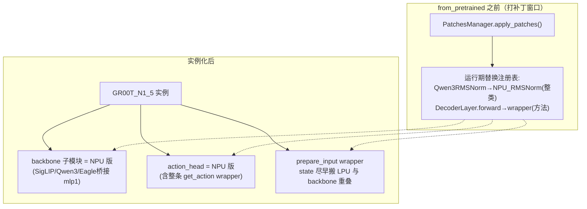
```mermaid
flowchart TB
  subgraph 启动前["from_pretrained 之前（打补丁窗口）"]
    PM["PatchesManager.apply_patches()"] --> REG["运行期替换注册表:<br/>Qwen3RMSNorm→NPU_RMSNorm(整类)<br/>DecoderLayer.forward→wrapper(方法)"]
  end
  subgraph 实例化后
    M["GR00T_N1_5 实例"] --> B1["backbone 子模块 = NPU 版<br/>(SigLIP/Qwen3/Eagle桥接 mlp1)"]
    M --> A1["action_head = NPU 版<br/>(含整条 get_action wrapper)"]
    M --> P1["prepare_input wrapper<br/>state 尽早搬 LPU 与 backbone 重叠"]
  end
  REG -.-> B1 & A1 & P1
```
*图 9-1：自绘——"不动 gr00t/HF 一行源码"的原理：在类被实例化**之前**把符号表里的类/方法换掉，之后 `from_pretrained` 构造出来的天然是 NPU 版子模块*


核心难点：**不动 gr00t 与 HF 源码**，就能让模型用 NPU 算子。做法是"实例化之前打补丁"：

```
① 在 from_pretrained **之前**调用 PatchesManager.apply_patches()
② 把『源模块类/方法』在运行期替换成『NPU 版类/方法』
③ 之后实例化 GR00T_N1_5 时，构造出来的是 NPU 版子模块
```

两种替换方式（`register.py`）：
```python
PatchesManager.register_patch(Q+"Qwen3RMSNorm",    NPU_RMSNorm)          # 整类替换
PatchesManager.register_patch(Q+"Qwen3DecoderLayer.forward", qwen3_decoder_layer_forward_wrapper)  # 方法包装
```

| 组 | 关键补丁（NPU 版） | 替换了什么 |
|---|---|---|
| Qwen3 文本 | `NPU_RMSNorm/_Qwen3MLP/_Qwen3Attention` + forward 包装 | 语言模型各子块 |
| SigLIP 视觉 | `NPU_SiglipVisionEmbeddings/_Attention/_MLP` + forward 包装 | 视觉编码器 |
| Eagle 桥接 | `eagle_backbone_init_wrapper` | 把 mlp1 换成 NPU 版(1152→2048) |
| 动作头 | `NPU_*` 系列 + `npu_action_head_get_action_wrapper` | DiT/action 各块，甚至整条 get_action |
| 顶层 | `gr00t_n1_prepare_input_wrapper` | state 前移：尽早搬到 LPU 与 backbone 计算重叠 |

### 为什么能"整类替换"还能让别处按名 import 的类也生效？
`patch.py` 在替换时会**遍历 `sys.modules`**，把「当前值仍是旧对象 id」的所有属性一并替换，
从而连 `flow_matching_action_head.SinusoidalPositionalEncoding` 这种"别处 from-import 的绑定"也能换到。
这套基建让补丁覆盖面广且可 `remove_patches()` 回滚。

### n1.6 实际结构：transformers_npu 包全景（对照 tag n16-v0.1 实测代码）

上面是 n1.5 视角。到 n1.6，同一套机制收拢成自洽的独立包 `gr00t/transformers_npu/`，并强调
**零侵入**：gr00t 原生文件恢复为上游 release `ead5283`，全部集成改动迁入 patch 层。整体是
"五层纵向栈 + 旁路验证闭环"：

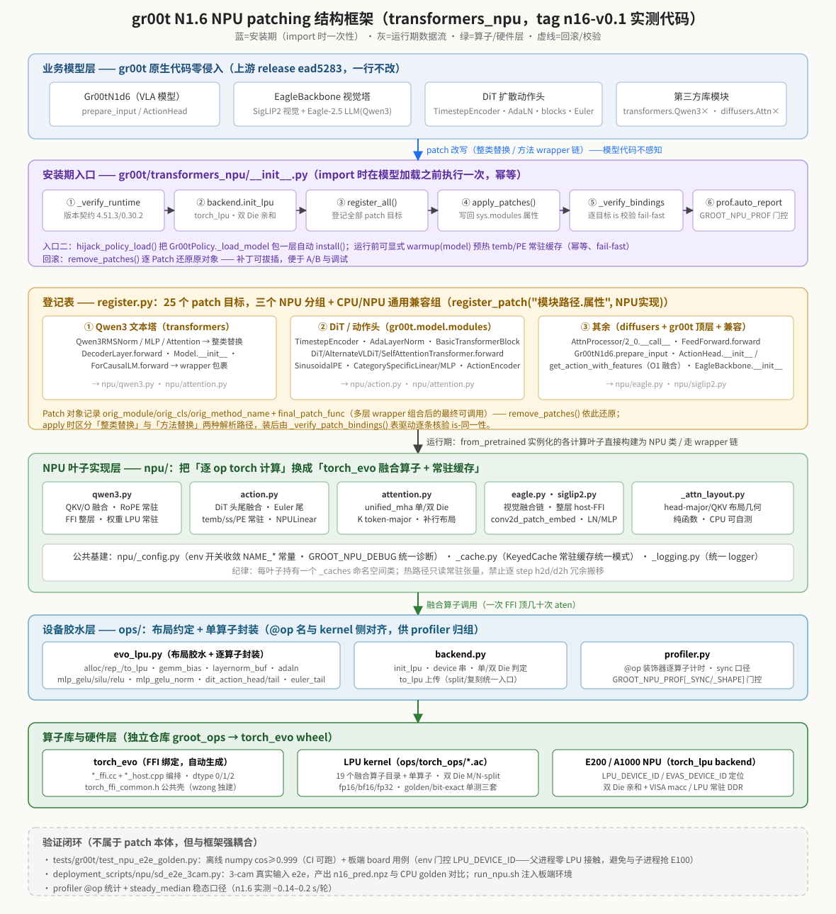
*图 9-2：自绘——对照 n16-v0.1 实测代码逐文件核对：install() 六步流水线、25 个登记目标、npu 叶子、
ops 胶水、torch_evo/LPU。与第 13 章对照：L20 上的 N1.6 实测走的是**未打补丁的原生 GPU 链**
（install() 不执行）；这张图的五层栈是 E200 板端运行 N1.6 时的完整形态。*

逐层读图（与代码对照）：

1. **安装入口**（`__init__.py`，幂等）：`install()` 六步——①版本契约断言
   （`transformers==4.51.3`/`diffusers==0.30.2`，**以板端实测组合为准**，与 pyproject pin
   不一致时以实测为契约）；②`init_lpu` 双 Die 初始化；③`register_all()`；④`apply_patches()`；
   ⑤`_verify_patch_bindings()` 表驱动逐目标核验"该位置当前值 **is** 替换对象"，缺漏当场
   fail-fast——防止"只打上一般补丁、悄悄走 eager 慢路径"；⑥profiler 自动报告。
   另有第二入口 `hijack_policy_load()`（把 `Gr00tPolicy._load_model` 包一层自动 install）；
   权重就位后可显式 `warmup(model)` 预填 temb/PE 常驻缓存，首轮 `get_action` 即命中热路径。
2. **登记表**（`register.py`）：25 个目标 = Qwen3 文本塔 6 + 动作头相关 17（DiT/embodiment 模块，
   含 diffusers 的 AttnProcessor×2 与 FeedForward，以及 `Gr00tN1d6.prepare_input` state 前移）
   + **兼容组 2**（`register_model_compat`：EagleBackbone 构建 + 确定性噪声，CPU/NPU 通用——
   生成 CPU golden 时**只应用这一组**、不碰 LPU，这是三代对照能同机共存的基础）。
   每个 `Patch` 对象记住原绑定，`remove_patches()` 整体拔除回滚。
3. **npu 叶子**（`npu/`）：真正的计算替换实现。统一纪律——每叶子一个 `_caches` 命名空间类、
   热路径只读常驻张量、env 开关集中走 `_config.NAME_*`（诊断统一 `GROOT_NPU_DEBUG`）。
4. **ops 胶水**（`ops/`）：`evo_lpu.py` 把布局约定（head-major、双 Die split、fp16/bf16/fp32）
   封装成 `@op` 命名的逐算子调用；`profiler.py` 按同一 `@op` 名归组计时——所以 profiler
   报表与算子名天然对齐，定位慢点不用猜。
5. **算子库/硬件**：`torch_evo`（groot_ops 仓产出的 wheel）→ `.ac` kernel → E200 双 Die。
   patch 层不重复实现任何 kernel。

debugging 提示：e2e trace 里若模块名仍是**原类名**（逐 op 现算链复活，约 +30ms/轮 host 开销），
说明某叶子绑定没生效——先看安装期两个 fail-fast 是否被绕过，再用 `remove_patches()` 回滚做 A/B。

## 3. 走读 v0.2：融合算子究竟"怎么接进来"的（三级入口）

§2 回答的是"为什么能不改源码"。本节回答的是另一个问题：**接入这件事发生在哪几个时刻、
每个时刻做什么、每个时刻的静默失效点在哪**。这条时间轴是 §2 那张空间分层栈的正交视角。

### 3.1 先定锚：两个仓库、一条 FFI 边界

| 仓库 | tag | commit | 角色 |
|---|---|---|---|
| `groot_ops` | `v0.2` | `7df9a04`（09-11 07:41:41） | **算子供给方**：`ops/torch_ops/<op>/` = `<op>_kernel.ac` + `_host.cpp` + `_ffi.cc` |
| `Isaac-GR00T` | `v0.2` | `57ca788`（09-11 07:41:42） | **集成方**：`gr00t/transformers_npu/`（5270 行 Python），把 `nn.Module` 叶子换成 `torch_evo.<op>` |

两侧唯一的契约是 **`torch_evo.<op>` 的符号名 + 张量布局（形状 / `split_dim` / dtype）**。
同名 tag 不代表代码同源，只代表这一刻 ABI 对得上。所以本章第一句话不是"怎么加速"，而是：
**接入 = 换叶子 + 守布局**。

### 3.2 三级入口总览

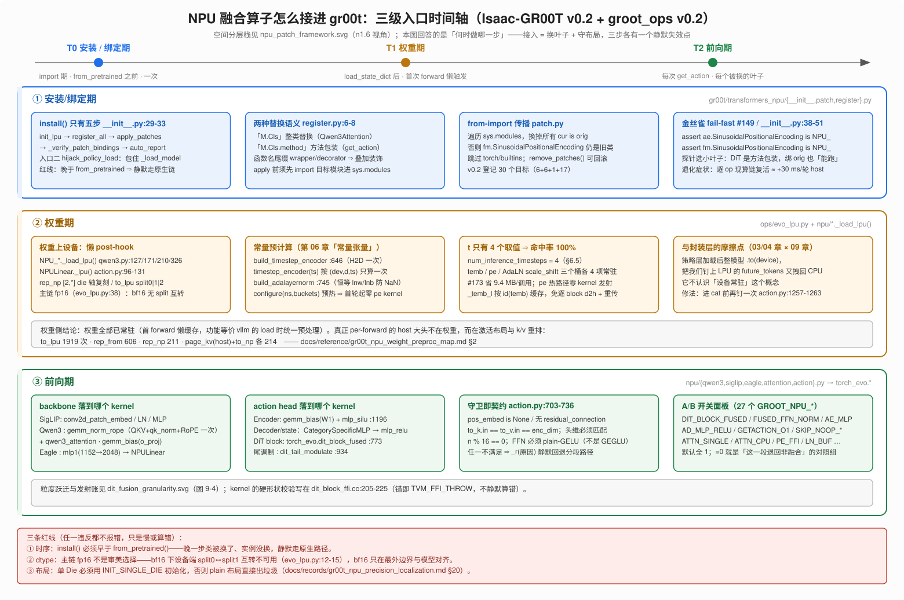
*图 9-3：自绘（`tools/mk_fig_ch09_three_stage.py`）——T0 安装/绑定期、T1 权重期、T2 前向期。
三段各有一个**不报错**的失效点：T0 装晚了 → 静默走原生链；T1 布局/dtype 错 → 算错或出垃圾；
T2 守卫不满足 → 静默回退分段路径。底部三条红线详见 §3.3–§3.5。*

### 3.3 T0 · 安装/绑定期：一次性的符号替换

`gr00t/transformers_npu/__init__.py:24-35` 的 `install()` 只有五步：

```
init_lpu()  →  register_all()  →  apply_patches()  →  _verify_patch_bindings()  →  auto_report()
```

**(a) 时序是硬契约。** `hijack_policy_load()`（`:68-86`）把 `install()` 塞进
`Gr00tPolicy._load_model` 的 `from_pretrained` **之前**。晚一步会怎样？模型已经用原生
`nn.Module` 实例化完了，patch 只改了类对象，实例里的子模块还是原对象——
**静默走回 GPU/CPU 逐算子路径，没有任何报错**。接上第 03 章：NPU 接入是"插在策略层加载前的钩子"，
不是模型的属性。

**(b) 两种替换语义。** `register.py:6-8`：

| 目标串 | 语义 | 例 |
|---|---|---|
| `"<module>.<Class>"` | **整类替换** | `Qwen3Attention → NPU_Qwen3Attention`（`register.py:25`） |
| `"<module>.<Class>.<method>"` | **方法包装** `wrapper(orig)->new` | `FlowmatchingActionHead.get_action`（`register.py:96`） |

`patch.py::_split_target` 按 `.` 段数解析；函数名以 `wrapper`/`decorator` 结尾 ⇒ 当装饰器叠加，
否则当替换对象。**看名字就能猜出它是"换掉"还是"包一层"**——这套代码用命名纪律换掉了显式声明。
另有一条前置条件：`register_all()` 里每个目标模块都先 `import` 进 `sys.modules`
（`:18/31/44/52-56/99`），否则 apply 时解析不到宿主。v0.2 共 **30 个登记目标**：
Qwen3 6 + SigLIP 6 + Eagle 桥接 1 + diffusers AttnProcessor 2 + 动作头 13 + `prepare_input` 1 + `FeedForward` 1。

**(c) from-import 传播 + fail-fast。** `from x import Cls` 在导入瞬间就把 `Cls` 抄进了调用方命名空间，
只改 `x.Cls` 不够——于是 `patch.py` 遍历 `sys.modules` 把所有 `cur is orig_func` 的绑定一并替换
（跳过 torch/builtins）。这个坑的代价被写成了断言（`__init__.py:38-51`）：

```python
assert ae.SinusoidalPositionalEncoding is N    # action_encoder 侧
assert fm.SinusoidalPositionalEncoding is N    # flow_matching_action_head 的 from-import
# 失败症状写在 docstring 里：逐 op 现算链复活，~30ms/轮 host
```

注意探针挑的是 **`SinusoidalPositionalEncoding` 这种小叶子**，不是 DiT。理由很工程化：小叶子只有一条
替换路径，`is` 判定干净无歧义；DiT 是**方法包装**，实例就算绑了 `orig` 也照样"看起来能跑"。
**用最容易静默退化、且断言成本最低的地方当金丝雀。**

### 3.4 T1 · 权重期：懒上设备 + 常量预计算

原生 `load_state_dict` 完成后，各 NPU 类挂的 post-hook `_load_lpu()` 才把权重搬上设备并转布局：
`qwen3.py:127/171/210/326`、`NPULinear._lpu()`（`action.py:96-131`）。布局三态：
`split0` = M-split（行切两 Die）、`split1` = N-split、paged = `split2`，另有 `rep_np` 的 `[2,*]` die 轴复刻。

主链 dtype 是 **fp16 不是 bf16**（`evo_lpu.py:38 H_DT`），原因写在文件头 `:12-15`：
**bf16 下 split0↔split1 布局互转在设备端不可用**。典型的"硬件 ABI 反过来决定数值格式"。

权重侧的真正结论在 `docs/reference/gr00t_npu_weight_preproc_map.md` §1/§4：

> **权重全部已缓存**（首次 forward 常驻，功能等价 vllm 的 load 时统一预处理）；per-forward 的
> host 大头**不在权重**，而在 `to_lpu`(1919 次)、`rep_np`(211)、`rep_from`(606)、
> `page_kv(host)`(214)+`to_np`(214)——**激活布局与 k/v 重排的 host 往返**。

更值得划线的是**常量预计算**，它直接兑现第 06 章"常量张量的另一面课堂"那张表：

| 预计算 | 位置 | 对应第 06 章结论 |
|---|---|---|
| `build_timestep_encoder`（H2D 一次） | `evo_lpu.py:646-673` | temb 只依赖 t |
| `timestep_encoder(ts,…)` 按 `(device,d,ts)` 桶**只算一次** | `evo_lpu.py:674-700` | **t 只有 4 个取值** ⇒ 命中率 100% |
| `NPU_TimestepEncoder.configure(ns,buckets)` + `pe.configure(ah,ns,buckets)` 预热 | `action.py:1240-1251` | 同上，注释原话"ITER1 起零 pe kernel" |
| `build_adalayernorm`（Ada 权重 + **恒等 lnw/lnb**） | `evo_lpu.py:745-757` | AdaLN 的 scale/shift 由 temb 线性生成；恒等 LN 是规避单 Die passthrough 的 NaN 缺陷 |
| `_temb_l` 按 `id(temb)` 缓存 | `evo_lpu.py:107-121` | 同一 forward 各 block 共用 temb，免逐 block d2h+重传 |
| `_ensure_future_token_lpu` | `action.py:1257-1263` | 见下 |

最后一行最有意思：策略层加载完模型会对整模型 `.to(device)`，把我们钉上 LPU 的 `future_tokens`
**又拽回 CPU**——它不认识"设备常驻"这个概念。修法不是去改封装层，而是**进 `cat` 前再钉一次**。
这是第 03/04 章的封装层和第 09 章的设备层互相打脸的地方，工程上选了"最小侵入 + 幂等"。

### 3.5 T2 · 前向期：每个叶子落到哪个 kernel

| 原生模块 | 落到的算子 | file:line |
|---|---|---|
| `Qwen3RMSNorm` | `rmsnorm` | `qwen3.py:140` |
| `Qwen3MLP`（SwiGLU） | `mlp_swiglu` | `qwen3.py:192` |
| `Qwen3Attention` QKV + qk_norm + RoPE | `gemm_norm_rope` **三件事一次发射** | `qwen3.py:469` |
| Qwen3 attention 本体 | `batch_attention`（paged kv，split2） | `evo_lpu.py:371` |
| `o_proj` | `linear`(gemm_bias) | `qwen3.py:486` |
| SigLIP patch embed | `conv2d_patch_embed` | `evo_lpu.py:583` |
| Eagle `mlp1`(1152→2048) 与 `eagle_linear` | `NPULinear`(gemm_bias) | `eagle.py:50-62` |
| **DiT 整个 block** | **`torch_evo.dit_block_fused` 一次 FFI** | `action.py:773-780` |
| DiT 末尾 AdaLN 调制 | `dit_tail_modulate` | `action.py:934` |
| DiT norm3 + GELU FFN | `mlp_gelu_norm` | `action.py:671` |
| `MultiEmbodimentActionEncoder` | `gemm_bias(W1)` + `mlp_silu(W2a→silu→W3)` + `sinusoidal_pe_die` | `action.py:1196-1207` |
| `CategorySpecificMLP`（state_encoder / action_decoder） | `mlp_relu` 单发 | `action.py:1099` |

**"整块融合"的粒度跃迁**是这一节的核心，单独画成图 9-4（§4.3）。

而 `dit_block_fused` **能不能用**，由一串守卫决定（`action.py:703-736`）：`pos_embed is None`、
无 `residual_connection`、`to_k.in == to_v.in == enc_dim`、QKV 头维匹配、`n % 16 == 0`、
FFN 必须是 **plain-GELU**（`net[0]` 是 GELU 内含 `.proj`，不是 GEGLU）。任一条不满足
⇒ `_r(原因)` 返回 None ⇒ 静默回退分段路径。**这串守卫就是 kernel 的需求说明书**——
它比任何文档都新，因为不满足就跑不出性能数据。

配套的 **A/B 开关有 27 个 `GROOT_NPU_*`**（默认全 1，`=0` 回退原路径）：
`DIT_BLOCK_FUSED`(`:65`)、`FUSED_FFN_NORM`(`:41`)、`FUSED_ADLN`(`:38`)、`AE_MLP`(`:48`)、
`AD_MLP_RELU`(`:53`)、`GETACTION_O1`(`:50`)、`SKIP_NOOP_DROPOUT`(`:535`)、`DIT_2D`(`:58`)、
`PE_FFI`(`:43`)、`LN_BUF`(`:982`)、`ATTN_SINGLE`/`ATTN_CPU`(`_attn_layout.py:179-200`)……
**这套开关本身就是"融合 vs 非融合"的对照实验接口**——第 06 章说"要用 A/B 判断误差来自哪一段"，
这里就是那个开关面板（`scripts/module_ab_*.py`、`single_die_op_ab.py` 直接吃它）。

## 4. 底层算子从哪来：groot_ops（torch_evo / 融合算子）

### 4.1 一个算子 = 三件套

`groot_ops/ops/torch_ops/<op>/` 下每个算子是 `<op>_kernel.ac`（设备内核）+ `<op>_host.cpp`（host 启动）
+ `<op>_ffi.cc`（PyTorch/FFI 绑定），通过 `torch_evo` 暴露给 Python，让 `transformers_npu` 的 NPU 类直接调用。
命名能对上 GR00T 结构（`adaln_qkv`、`mlp_gelu_norm`、`dit_block`…），说明加速是按
"模型计算图切块 + 块级融合"来做的。

### 4.2 版本阶梯：op 集合本身就是 changelog

`git ls-tree -d <tag>:ops/torch_ops` 实测：

| tag | 日期 | op 目录数 | 相对上一版新增 |
|---|---|---|---|
| `v0.1` | 09-05 | 24 | 首个单 Die e2e 可发布版（`unified_mha`/`qwen3_attention` K 改 token-major、`gemm_bias` transpose_out） |
| **`v0.2`** | 09-11 | **30** | `adaln_qkv`、`adaln_qkv_mha_out`、`fused_mha_out`、`linear_qkv`、`mlp_gelu_norm`、`dit_block` |
| `v0.4` | — | 36 | `action_encoder`、`dit_action_head`、`dit_action_tail`、`euler_tail`、`randn_normal`、`self_attn_block` |

**v0.2 的 30 个 op**：`adaLayernorm adaln_qkv adaln_qkv_mha_out attention attention_prefill board_init
conv2d_patch_embed dit_block embedding fused_mha_out gemm_bias gemm_norm_rope gemm_rope layernorm
linear_T linear_qkv macc mlp mlp_gelu mlp_gelu_norm proj_out qwen3_attention relu
reshape_and_cache_flash residual_add rmsnorm silu sinusoidal_pe timestep_encoder unified_mha`。

> **[!] 勘误（版本归属）**：本章早先列算子清单时把 `dit_action_head`/`dit_action_tail`/`self_attn_block`/
> `action_encoder`（以及 §6 图里的 `randn_normal`）记在了 v0.2 名下。实测这三个/那组 op **只存在于 `v0.4` tag**
> （`git ls-tree v0.2:ops/torch_ops` 无，`v0.4` 有；相关提交在 `dev_wzong_review170_euler_tail` 线上）。
> CHANGELOG `[0.2.0]` 标题里的"DiT 头尾融合"在 v0.2 指的是 **`gemm_bias(W1)+mlp_silu`（action_encoder 头）
> 与 `mlp_relu`（CategorySpecificMLP 尾）**，不是那四个专用 op。图 9-5 已按 tag 实测重绘并给 v0.4 项加 `[v0.4]` 标记。
> 教训与 §6.7 附录同源：**能 `ls-tree` 出来的事实，就不要靠记忆写。**

### 4.3 融合粒度阶梯：960 → 192 → 64 次发射，然后瓶颈搬家

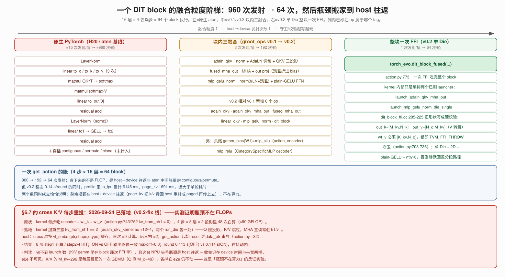
*图 9-4：自绘（`tools/mk_fig_ch09_dit_granularity.py`）——同一个 DiT block 在三种粒度下的样子。
16 层 × 4 去噪步 = 64 个 block 执行：原生 aten ≈15 次发射/层 ⇒ ≈960 次/轮；块内三融合 ⇒ 192 次/轮；
`dit_block_fused` 整块 ⇒ **64 次/轮**。省下来的不是 FLOP，是 host→device 往返与 aten 中间张量的
contiguous/permute。右下红框原为"§6.7 未落地项"，现已改为**该优化落地后的实测结论**（详见 §7）。*

三点读图说明：

1. **"整块"不是新写了个大 kernel。** `dit_block_ffi.cc` 头部注释写得很直白：它内部只是编排两个
   **已经分别测过**的 launcher（`launch_adaln_qkv_mha_out` + `launch_mlp_gelu_norm_die_single`）。
   融合块的正确构造方式是**"把已验证的段落进一次 FFI"**，而不是重写一遍数学。
2. **kernel 把形状写成硬校验。** `dit_block_ffi.cc:205-225`：`out_k=[M_kv,N_k]`、
   `out_v=[N_q,M_kv]`（**V 是转置布局**，对应 §6.8 的维度账本）、`wt_v` 必须 `[K_kv,N_q]`、
   `out_q=[N_q,M_q]`，不满足直接 `TVM_FFI_THROW`。**宁可当场抛，不要静默算错**——
   这与 §3.5 守卫"宁可回退，不要勉强融合"是一体两面。
3. **省发射 ≠ 省时间。** v0.2 tag 稳态 0.14 s/round（板端 v0.2-fix 线现已 ~0.113 s/round，
   device 1 / inject3 口径，别与 tag 口径混用；v0.2-fix 的**定稿纯净树口径是 0.122 s**，
   0.113/0.122/0.174 三数换算见 §10.3 表后脚注），而 profile 里 `to_lpu` 累计 6148 ms、
   `page_kv` 1691 ms（`page_kv` 是把 k/v 搬回 host 重排成 paged 再传上去，`attention.py:306-314`）。
   两个数同时成立恰恰说明：**剩余瓶颈在 host↔device 往返，不在算力**。单 Die 的
   `unified_mha` 稠密非分页路径（`attention.py:278-287`）就是为了绕开 `page_kv` 而生。

## 5. 加速带来的结构变化（理解之前各章的"N1.5"视角)

- **在原版推理**：backbone + action_head 由 HF/torch 原生模块组成（第 04-06 章）。
- **在 NPU 推理**：同一套 `GR00T_N1_5`，但子模块已被补丁替换成调用 `groot_ops` 融合算子的 NPU 版；
  甚至 `get_action` 的整条去噪循环被包装成更高效的版本，并对 `prepare_input` 做"state 前移 + 与 backbone 重叠"。
- 好处：**模型结构、训练/推理接口、数据流（第 01-08 章）完全不变**，只换"底下的算子实现"。

## 6. 实测对比：NPU 逐算子初步接入（未融合）vs NPU 融合算子 pipeline

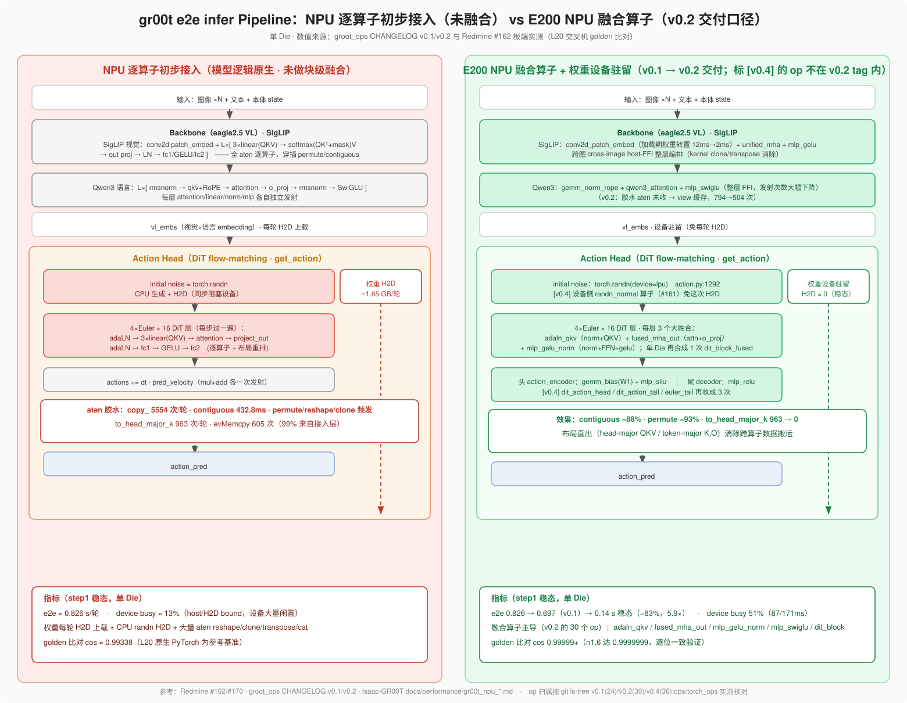
*图 9-5：自绘（`tools/mk_fig_ch09_pipeline_compare.py`）——已按 tag 实测校正 op 归属：
`randn_normal`、`dit_action_head`、`dit_action_tail`、`euler_tail` 属 `v0.4`，在图中显式标 `[v0.4]`。*

上图左列为 **NPU 逐算子初步接入**的 gr00t n1.5 e2e pipeline——模型逻辑仍是原生组织方式，
但每个算子已逐个换成 NPU kernel，**尚未做块级/大粒度融合**（E200 单 Die 实测）；
右列为经 `transformers_npu` 补丁 + `groot_ops` 块级融合改写后的 pipeline：

> **[!] 勘误（基线归属）**：本章早先把左列 0.826 s 标成"原生 PyTorch 在 H20 单卡的 profile 口径"。
> 实为 **NPU 接入算子后的初步测试结果**（逐算子接入、未做大粒度融合），本来就跑在 E200 上——
> 图 9-5 脚本的左列注记（"未融合 / NPU 接入基线"）一直是对的，错在正文叙述。
> 真正的**纯 GPU 原生 PyTorch 参照是 L20 上的 0.686 s/轮**（附录 A.2 / 第 13 章 §3.4 的 TRT 同机
> A/B 基线），两者不是一回事。教训仍是 §4.2 那句：**能核实的事实归属，就不要靠记忆写**。

- **端到端**：单步推理 0.826 s（逐算子初步接入）→ 0.697 s（v0.1）→ 0.14 s（v0.2）（**−83%，约 5.9×**）；
- **设备利用率**：device busy 13% → 51%——融合消掉了大量小算子启动与访存往返，瓶颈从"调度空隙"回到计算本身；
- **数据搬运**：H2D 1.65GB 基本不变（IO 未变），但算子间 `contiguous/permute` 类拷贝核减少 88–93%（`to_head_major_k` 963 次 → 0）；
- **精度**：融合路径输出与原生 golden 余弦相似度 ≥ 0.99999。

> 口径说明：单 Die E200、e2e infer（1 步去噪 × batch 1）；v0.1/v0.2 指标来自 groot_ops CHANGELOG 与
> Redmine #162 的 profile 记录，图为示意重绘，算子分组做了归并。
>
> 并入 TensorRT(L20) 后的**三方对比总表见附录 A.4**，优化方法学对照见附录 A.5。

## 7. 对账：第 06 章的结论，kernel 认不认？

第 06 章是在"数学 + 接口"层推的。这里把它的 8 条结论**逐个按到 v0.2 的 kernel 实参表上**——
这是本课方法论里"结论必须可复跑"的那一半。

| # | 教材结论 | v0.2 代码证据 | 判定 |
|---|---|---|---|
| 1 | §6.7 cross-attn 的 K/V 在一次 `get_action` 的 K 步里恒定，可缓存 | v0.2 tag：`action.py:743` 每次喂 `encoder_l`、`:752` `kv_from_nh1 = 0 if is_cross`、`dit_block_ffi.cc:134-135/205-225` 每步重写 `out_k/out_v`；**2026-09-24 板端 v0.2-fix 线落地**：kernel 加第三态 `kv_from_nh1==2`（`adaln_qkv_kernel.ac` +12/−4）+ host 按 `vl_embs` 缓存（`action.py` +32，`GROOT_NPU_DIT_KV_CACHE`） | ❌ v0.2 tag **未实现**（48 次白算 ≈90 GFLOP）→ ✅ **已落地**：8 次计算 + 24 次复用、ON/OFF **逐位一致**，**但 e2e 无收益**（0.113 vs 0.114 s）；trace 对账：设备 **−6.8 ms/step**、**launch 次数 1228→1228 不变** |
| 2 | §6.7 循环不变量（`state_features`/`future_tokens`/`pos_embs`）该提到循环外 | `action.py:1275-1288`（#152 O1）已提升；`pe.configure` 预热 | ✅ 已做，且有一次**反例回归** `d34a44f`：`pos_ids` 行数误取 `state_horizon(=1)`，16 个 action 行全广播第 0 行位置编码 ⇒ `right_arm/left_hand` cos 掉到 **0.97/0.82** |
| 3 | §6.7 AdaLN 的 scale/shift 只依赖 t，t 只有 4 个取值 | #173 `norm1._scale_shift(temb,n,dev)` 按 `(block,ts)` 缓存（`action.py:821`，省 9.4 MB/调用）；`timestep_encoder` 按 ts 桶常驻 | ✅ **比教材更进一步**：不仅缓存，还吃掉了"t 只取 4 个离散值" |
| 4 | §6.8 DiT self/cross 的 M、kv_len 来源 | `action.py:702` `kv_len = prod(encoder.shape[:-1]) if is_cross else m`；M = 1(state)+32(future)+16(action) = **49**；`attention.py:274` 实测 shape 桶 `LQ64_LKV49`（64 = pad 到 mha_B=64） | ✅ 与 §6.8 序列拼装一致 |
| 5 | §6.8 V 是转置布局 | `dit_block_ffi.cc:214-219`：`out_q=[N_q,M_q]`、`out_v=[N_q,M_kv]`（**转置**）、`out_k=[M_kv,N_k]`，`wt_v` 必须 `[K_kv,N_q]` | ✅ kernel 把转置写成硬校验 |
| 6 | §6.8.5 `encoder_attention_mask` 传而不达 | 原生 `cross_attention_dit.py:172` 该参数被**注释掉**；`dit_block_fused` 的实参表（`action.py:773-780`）里**根本没有 mask 这一位** | ✅ 一致，且 NPU 路径连"传"都省了 |
| 7 | dropout=0.2 仅训练态，推理应关闭 | `GROOT_NPU_SKIP_NOOP_DROPOUT=1`（`action.py:535`）对应原生 `:174` 的 `final_dropout` | ✅ 推理态等价省略 |
| 8 | §6.6 绘图师：t 与动作一起进 encoder | `gemm_bias(W1)` + `mlp_silu`（`:1196-1207`），t 侧 `sinusoidal_pe_die(ts)` 按 ts 缓存 | ✅ 形状一致，且"t 只有 4 值"被 kernel 侧吃干净 |

**一句话总结**：8 条全部得到 kernel 级印证；唯一在 v0.2 tag 上没落地的第 1 条，
**已在 2026-09-24 板端实现并验证**（`kv_from_nh1==2` 第三态，8 次计算 + 24 次复用，
ON/OFF 输出**逐位一致 `maxdiff=0.0`**，`round 0.113 s(OFF) vs 0.114 s(ON)` ⇒ **无端到端收益**；
这两个数是同板 A/B 口径，与 §10.3 账本里定稿的 0.122 s 是同一份代码的不同口径，换算见该表脚注）。
实现细节、三个原坑的兑现方式与落地时新暴露的第 4~6 个坑，全部记在**第 06 章 §6.7 附录「落地实况」**。

这次"预测 → 实现 → 实测无收益"的闭环比优化本身更值钱，它坐实了三件事
（第 3 件来自 2026-09-24 的 ON/OFF 两份 perf trace 对账，复跑脚本 `tools/trace_kv_cache_diff.py`）：

1. **§4.3 的账是对的**：这笔优化省不到 launch 数（K/V gemm 早在每 block 那一次 FFI 里），
   而这台 NPU 的头号货币是 host 往返 ⇒ **省掉每层最肥的一次 GEMM（`M_kv≈296` 对比 Q 侧 `M_q=49`）
   加 ~300 MB/round 权重带宽，e2e 一动不动**。"瓶颈不在算力"从推算变成了反证实验。
2. **融合改变可观测性**：整块融合后这笔白算被吞进 `dit_block_fused` 内部，不再出现在 profiler 顶层——
   从"可见的慢"变成"隐形的慢"。**优化被融合吞掉之后，可观测性也要跟着下沉一层**
   （只能靠 `GROOT_NPU_DIT_KV_CACHE=0/1` 这类 A/B 开关量差值，顶层算子名里找不到它）。
3. **瓶颈判据可以直接被 trace 量出来（不必靠 wall-clock 猜）**：ON/OFF 两份 trace 里
   **kernel 总数 1273=1273、`evLaunchKernel` 1228=1228、`evStreamSynchronize` 26=26、`evMemcpyAsync` 46=46**
   ——发射与往返一条没省（第 1 条的结构性证明）；而 13 类 kernel 里 12 类逐类不动，差值精确落在
   把 K/V 投影折进去的 `adaln_qkv_run_die`（45.83→32.38 ms / 2 步，**单次 466 µs → HIT 185 µs**），
   合计 **−6.8 ms/step**，与 step 表 `Computation` 差、kernel 总时长差**三处口径同数**；
   与此同时设备忙比从 70.2% 掉到 47.8%、空闲 +50 ms，增量最大的空闲在每个 DiT block 末尾
   （`mlp_gelu_norm` 之后 11 µs → 391 µs）——**设备算完在等 host 发射**，这才是"e2e 不动"的时域形状。
   ⚠ 引用那两个 step 的 `Step_time`（ON 反而 +44 ms）前先读 06 章 §6.7 的**反证**：ON 那次采样 host
   全局 ×1.5（连补丁碰不到的 backbone 帧一起慢），属 profiler 扰动/单样本噪声，**不可归因给缓存**。

验证口径（要复跑就用这三条，`deployment_scripts/npu/README.md`）：
`sd_e2e.py --no-prof --rounds 5`（稳态 wall）、`dump_action_all.py` + `cos_check.py`
（526-leaf 逐算子对账，不是只看 `action_pred`）、`validate_npu.sh`（commit 前一键）。
v0.2 的 3cam golden：`action_pred` 0.99999 / `left_hand` 0.99200 / `right_hand` 1.00000。

## 7.5 三处 attention × NPU kernel：分界线画在四条轴上（图 9-9）

06 章 §6.8.9 把三塔 attention 的**语义**并排摊开之后，课堂上紧接着的一问是纯工程的：
**“回到算子接入，这三处 attention 需要各自不同的实现吗？”** 答案是——
**语义上同一族，工程上今天确实是三个核（入口/出口融合是四套），但分界线不画在“哪个塔”上。**

### 7.5.1 先数 trace：一轮推理里三处 attention 各自发的是哪个核

`logs/trace_current_clean/n15_sd3_chrome_trace.json`（N1.5 单轮热轮，2026-09-30 抓）：

| 核符号 | 次数 | 归属（按结构对账） |
|---|---|---|
| `unified_mha_run_die_batch_emb` | **27** | SigLIP 27 层（三相机走 batch 维，embed-major Q/V 直出） |
| `qwen3_attention_run_die` | **12** | Qwen3 12 层；配套 `gemm_norm_rope_run_die_single` ×12 |
| `fused_mha_out_run_die_single_vraw_qraw` | **68** | DiT 16 块 × 4 去噪步 = 64，＋ vl_self_attention 4 层 = 68 |
| `adaln_qkv_run_die` | 64 | DiT 的 adaLN 调制 + QKV 三合一（16 × 4） |
| `linear_qkv_run_fused` | 4 | 这 4 发在 **vl 塔**，不在视觉塔（14 章 §5“计数归因三纪律”第 3 条“导出 ≠ 启用”的又一次印证） |

旁证：另一份 3cam/2iter trace 里 `unified_mha_run_die_batch` ×54 = 27×2、
`qwen3_attention` ×24 = 12×2 ✓。**主链 trace 里 `batch_attention`（paged，带
`k_tab/v_tab/idx/cu/su` + `causal` 实参）与 `reshape_and_cache_flash` 出现 0 次**——
那是 vLLM 血统的第四种实现，备而未用：gr00t 单轮 prefill，根本没有 KV cache 要分页
（06 章 §6.8.8）。

### 7.5.2 为什么不能一个核：四条轴

| 轴 | SigLIP | Qwen3 | DiT ＋ vl |
|---|---|---|---|
| mask | 无（256×256 全双向） | **下三角**：核内生成列阈值，仅对角块走 masked matmul | 无（self 全 token、cross 全 encoder 长度） |
| 头型 | MHA：K 的 head 数 == Q 的 | **GQA 16Q/8KV**：q 头 h → kv 头 h/group，多一层分组索引 | MHA |
| 布局契约 | Q^T **已预乘 scale**；V 显式补 ones 行 `[H,D+1,L]`；L_Q 须是 tile B 的倍数 | Q/K/V **全 token-major**（`gemm_norm_rope` 直出免 permute）；scale 是 FFI 实参（核内 DEQUANT 注入）；ones 行核内生成；L_Q 尾块核内处理 | Q^T head-major + V 补 ones 行；K token-major；**后面直接串 to_out 的 gemm** |
| 编译期 tile B | 128（256 = 2×128 免补零） | 64（调用实参） | DiT 64（T_q=49 → 补零）/ vl 128 |

三份内核源码的自述最能说明“同一族、三份拷贝”：`unified_mha_kernel.ac` 写着
**“统一 MHA flash attention——三 site 通用”**；`qwen3_attention_kernel.ac` 写着
**“结构镜像 unified_mha，增量 = GQA 分组 + 硬件因果 mask”**；`attention_prefill_kernel.ac`
写着“结构对齐 unified_mha”（bf16 type-generic 版）。共享的是骨架（32 核 4 cluster、
K/V 驻 cluster L2 由 4 核复用、online-softmax 滚动归一）；没共享成一份二进制，是因为
① tile B 是**编译期模板**，② 布局契约不同（scale 与 ones 行在 host 还是核内），
③ mask/GQA 分支会拖慢不需要它的那两路。**Qwen3 在 mask 与 GQA 两轴上同时跳出去，
所以它必须独立成核；DiT 与 SigLIP 在四轴上同类**，只差 tile B、batch 布局与出口融合。

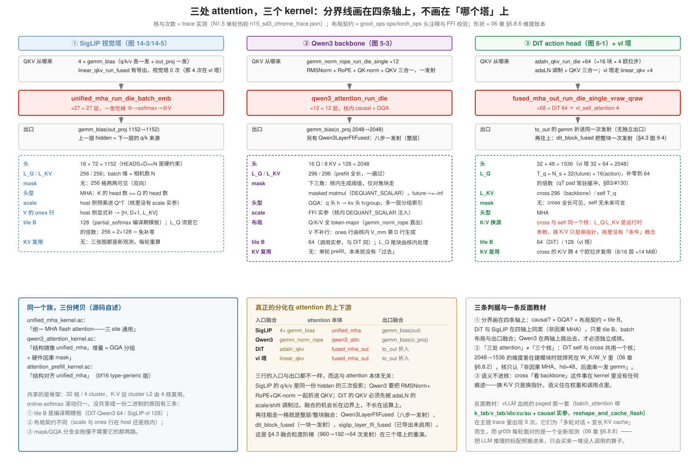

*图 9-9：自绘（`tools/mk_fig_ch09_attention_kernels.py`）——三列 = 三个塔，每列自上而下是
「QKV 怎么来 → attention 本体 → 出口」，红框是真机 trace 里数出来的 kernel 名与次数，
虚线框是该现场的形状/契约属性；底部三块分别是源码自述、上下游融合表、三条判据。*

### 7.5.3 更值得注意的：真正的分化发生在 attention 的**上下游**

| 塔 | QKV 怎么来（入口融合） | attention 本体 | 出口融合 |
|---|---|---|---|
| SigLIP | 4 × `gemm_bias`（q/k/v/o 各一发） | `unified_mha_batch_emb` | `gemm_bias`(out_proj) |
| Qwen3 | `gemm_norm_rope`（RMSNorm+RoPE+QK-norm+QKV 一合） | `qwen3_attention`（token-major 直进直出） | `gemm_bias`(o_proj)；另有 `Qwen3LayerFfiFused` 把整层八步一发射 |
| DiT | `adaln_qkv`（adaLN 调制 + QKV 三合一） | `fused_mha_out`（attention + to_out 一次发射） | 已折进 to_out |
| vl 塔 | `linear_qkv_run_fused` | `fused_mha_out` | 已折进 to_out |

三行的入口与出口都不一样，而这与 attention 本体无关：SigLIP 的 q/k/v 是同一份 hidden
的三次投影；Qwen3 要把 RMSNorm+RoPE+QK-norm 一起折进 QKV；DiT 的 QKV 必须先被 adaLN 的
scale/shift 调制过。**融合的机会长在边界上，不长在运算上**——再往粗走一格就是
`Qwen3LayerFfiFused` / `dit_block_fused` / `siglip_layer_ffi_fused`（后者已导出未启用，
14 章 §6），也就是 §4.3 融合粒度阶梯（960→192→64 次发射）在三个塔上的重演。

**三条判据（带走这三句就够）**：

1. 分界画在**四条轴**上：causal? × GQA? × 布局契约 × tile B；不画在“哪个塔”上。
2. “三处 attention” ≠ “三个核”：DiT 的 self 与 cross **共用** `fused_mha_out`——
   `L_Q/L_KV` 是运行时参数，换 K/V 只是换指针；2048→1536 在建模块时就焊死在
   `W_K/W_V` 里（06 章 §6.8.2），核只认“非因果 MHA、hd=48、后面串一发 gemm”。
3. **语义不进核**：cross“看 backbone”这件事在 kernel 里没有任何痕迹。语义住在权重和
   调用点里；这也是为什么换本体（embodiment）不换核、换 head_dim 才换核。

### 7.5.4 数完核再数钱：第五处 attention 与那张成本表（2026-10-02 实测补记）

§7.5.1 只数了"哪个现场发哪个核"，没数"每个现场花多少钱"。把钱补上之后，第一件要改的口供是：
**gr00t 一轮里有五处 attention，不是三处**——"三件套"是**模块**视角（视觉塔/语言塔/动作头），
kernel 视角还要再切两刀：动作头的 `vl_self_attention`（4 层，独立跑在 backbone 输出上）
和 DiT 内部的 self/cross 两种接法。按 trace 重数一遍成本：

| # | attention 现场 | 层数 × 次/轮 | 本体 kernel | 本体 busy | 所在相 busy / span | 该相气泡 |
|---|---|---|---|---|---|---|
| ① | SigLIP 双向 256² | 27 | `unified_mha_batch_emb` | 3.15 ms | 20.33 / 23.40 ms | 13.1% |
| ② | Qwen3 prefill causal（16Q/8KV，28 层截到 12） | 12 | `qwen3_attention` | 3.66 ms | 19.32 / 20.29 ms | 4.8% |
| ③ | **vl_self_attention 双向 296²** | 4 | `fused_mha_out(vl)` | **3.23 ms** | 7.44 / 13.69 ms | **45.7%** |
| ④ | DiT cross 49×296 | 8 块 × 4 步 = 32 | `fused_mha_out(cross)` | 2.98 ms | （四步合计 32.9 / 83.5 ms） | 60.6% |
| ⑤ | DiT self 49² | 8 块 × 4 步 = 32 | `fused_mha_out(self)` | 1.35 ms | 同上 | 同上 |

三条要记住的：

1. **③ 是最容易被漏掉的钱**：`action_head.vl_self_attention` 只有 4 层，但**单发 806 µs 的 attention
   就是整轮最贵的一发 kernel**。单发时长前六名（trace 逐发排序）：
   **806 vl attention → 731 Qwen3 swiglu → 662 空转 `Fill`（P2 里那发未归因的）→ 473 vl FF →
   470 cross-MISS 的 `adaln_qkv` → 447 vl QKV**——**前六里 vl 塔独占三席**，
   而这四层加起来整相才 7.44 ms，**气泡却高达 45.7%**。权重形状是 `to_q/to_k/to_v/to_out` 全 `[2048,2048]`、FF `[8192,2048]+[2048,8192]`
   （safetensors 头实测），与 backbone **同宽 2048 ⇒ 零投影接缝**，所以它常年不被写进任何架构图。
2. **④⑤ 共用一个核但成本差一倍**（93 µs vs 42 µs）：差的不是语义，是 `L_KV` 从 49 变 296。
   这是 §7.5.2 判据"语义不进核，形状才进核"的钱化版本。
3. **计数纪律第四次生效**（14 章 §5）：`linear_qkv_run_fused` 那 4 发属于 ③，不属于视觉塔；
   按模块名数 kernel 会把它记错地方，按 trace 时间轴切相才数得对（`tools/trace_phase_ledger.py`）。


## 8. 两者的分工一句话总结

| 组件 | 作用 | 让什么跑在 NPU |
|---|---|---|
| `groot_ops` | 自研融合算子库(内核+host+FFI) | 单个计算块 |
| `transformers_npu` | 运行期补丁，把 GR00T 子模块换成 NPU 版 | 整个 GR00T(VLA 推理) |

> 注：实际部署未引入 vllm_evas；"权重预导入/设备驻留"的做法仅在方案调研时参考过 vllm_evas 的相关概念
> （对照结论见 §3.4：布局语义不通用，只借它的"统一入口 + 缓存"组织方式）。

**加速的本质**：保持上层接口/数据流不变，用"模块补丁 + 融合算子"把算力压到自研 NPU 上，
从而在真实机器人上满足实时推理需求。

## 9. 性能优化实例：一次 memory-bound 优化为什么 e2e 归零

> 本课唯一走完「预测 → 实现 → 实测 → 归因」全环的优化案例（§6.7 cross K/V 缓存，
> 数据与坑全在第 06 章 §6.7 附录「落地实况」，复跑 `tools/trace_kv_cache_diff.py`）。
> 把它抽象成一张**瓶颈—货币对照表**，以后任何优化先查表再动手。

| 瓶颈类型 | 货币（省了才算数） | 判据（trace 里看哪一列） | 本例证据 |
|---|---|---|---|
| **算力 bound** | FLOP | `ComputationRatio` 已接近 100% | ❌ 只有 45~70% ⇒ 省 90 GFLOP/round 无感 |
| **带宽 bound** | 字节（权重/激活搬运） | kernel 时长差 + `operator_memory` | ✅ 省到了：`adaln_qkv` 466→185 µs，**−6.8 ms/step** |
| **发射 bound** | launch / FFI 次数 | kernel 总数、`evLaunchKernel` 次数 | ❌ **1273=1273、1228=1228 一条没省** |
| **host 往返 bound** | D2H/H2D + sync 次数 | `evMemcpyAsync`/`evStreamSynchronize` 次数、gap 归因 | ❌ 46=46、26=26；头号项仍是 `to_lpu`/`page_kv`（§4.3） |

**三条可复用的判据**：

1. **先看忙比再谈算力**：设备忙比 < ~70% 时，任何 flop/带宽优化只会把 `Free` 变大。
   本例实测忙比 70.2% → **47.8%**、空闲 **+50 ms**，且空闲增量集中在每个 DiT block 末尾
   （`mlp_gelu_norm` 后 11 µs → 391 µs）——**设备算完在等 host 发射**。
2. **收益必须记在瓶颈那一栏才允许写进 commit**：省 flop 的改动不许报 e2e，省 launch 的改动才配报。
   本例诚实的写法是"设备时间 −6.8 ms/step，e2e 不变"，而不是"无收益 ⇒ 改动无意义"。
3. **归因边界**：碰不到的代码路径也一起变慢 ⇒ 不可归因（本例 ON 样本连 backbone 帧都 ×1.5）。
   单样本 + profiler 扰动只支撑**结构性结论**（次数、逐 kernel 时长、gap 位置），不支撑 wall-clock 结论。

**动手顺序**（这台 NPU 的价目表，从贵到便宜）：**先砍 host 往返与发射次数（§4.3 的 960→192→64）
→ 再砍带宽 → 最后才砍 FLOP**。反向一句：memory-bound 优化不是白做，它把设备时间真省下了
6.8 ms/step，等发射/往返被后续版本（v0.4 融合、`unified_mha` 消 `page_kv`）压掉之后会自动兑现成 e2e
——所以留 `GROOT_NPU_DIT_KV_CACHE` 开关而不删码，**"正确但非当期"也要存档可 A/B**。
（§9 是"一次优化的完整闭环"；把它推广成读任何加速代码的四步方法，见 §10。）

## 10. 全局视角：这轮优化的账本与判据

> §1–§9 是"逐层走读 + 一个实例"。本节把它们**倒过来串一遍**：先问这个负载为什么难，
> 再问每次优化省的是哪种货币，最后把数字钉在同一口径上。往后你读任何一套加速代码，
> 都可以按这四步走（这也是本章想留下的可迁移方法，而不只是 GR00T 的答案）。

### 10.1 负载画像决定打法（为什么不能照搬 LLM 推理优化）

| 负载事实 | 规格（本章/前章已核实） | 对优化的含义 |
|---|---|---|
| 双脑，一半冻结 | Eagle(SigLIP+Qwen3) 冻结，只训动作头 | 一次调用内**前缀恒定** ⇒ 条件量可预计算常驻（§3.4）；§6.7 的"观测=prefill、去噪循环=decode"同构由此成立 |
| 动作头是流匹配而非自回归 | `denoising_steps=4` × DiT 16 block（8 self + 8 cross） | **一次 `get_action` = 4 次完整 DiT 前向**；步数是直接乘在延迟上的第一旋钮（§6） |
| 几何"瘦长"，单算子极小 | `M_q=49`（1+32+16）、`kv_len≈296`（§7 第 4 行） | 单 GEMM 的时间**打不过一次 FFI 调用的固定成本**（实测 60–150 µs；小 kernel 上 FFI 版甚至比厂商原生慢 3–40×）⇒ 融合与常量化远比堆算力有效 |
| 闭环控制，不可重试 | 16 步动作 × 机器人回路 | 精度门禁必须**反归一化后逐通道**判；"整体 cos 差不多"会放行子通道回退（§7 口径提醒同源） |
| 后端生态薄 | 无图捕获可用（FFI 算子被 `evConfigureCall` 禁 + 原生 GEMM 内 stream 同步）；算子有形状/dtype 缺口 | 没有"编译一次就好"这条路 ⇒ 只能**手工图化**（常驻缓冲 + 整块 FFI + 常量下沉 + 异步发射），并且**静默 CPU 回退**成为常态风险 |

一句话对照：**LLM 服务化的仗打在"KV 大、算力紧"；这个负载的仗打在"算子碎、发射多、精度不可糊"。**

### 10.2 四种货币，各归其位

§9 给了对照表，这里把本章已经出现的条目**按货币归档**——读代码时你可以照抄这张表建立自己的账本：

| 货币 | 判据（与板况无关者优先） | 本章已兑现的条目 |
|---|---|---|
| **发射次数** | kernel 总数、`evLaunchKernel` 次数 | 960 → 192 → **64** 次/轮（§4.3 图 9-4）；逐 op 全设备同步 → 边界同步；恒等算子逐个消（dropout 136→0、恒等除法 `evLaunchKernel −272`、pad/ones 常驻，§7 第 7 行同族） |
| **host 往返** | `evMemcpyAsync`/`evStreamSynchronize` 次数、D2H2D 溯源 | 设备驻留后稳态 H2D **1.65 GB/轮 → ≈0**；逐调用重搬权重（曾放大 6–475×）改为权重常驻 + 惰性判设备；随机数下设备（CPU 生成 + H2D 会阻塞设备） |
| **字节/布局搬运** | `contiguous`/`permute`/view-copy 的次数与时长 | 让 kernel **直出下家要的布局**：QKV head-major 直出、K 改 token-major ⇒ `to_head_major_k` **963 → 0**；`contiguous` 432.8 ms/447 → 49.5 ms/55；`residual_add` 54 → 1。**这才是那"88–96%"的真正来源，融合只是它的载体** |
| **FLOP / 带宽** | `Computation`、单 kernel 时长 | 19 个融合算子；常量预计算（`t` 只有 4 值 ⇒ 命中率 100%，scale_shift 缓存省 9.4 MB/调用 **−36%**、RoPE 13 ms → 37 µs）；§9 那次 −6.8 ms/step |

**排序结论**（本机价目表，从贵到便宜）：**先砍往返与发射 → 再砍布局搬运 → 最后才砍 FLOP。**
§9 的反证实验就是这条排序的实证：跳步省算力 ⇒ 收益 100% 落进 idle。

### 10.3 里程碑账本（每一行都标口径，不同口径不可互比）

| 阶段 | 数字 | 口径 |
|---|---|---|
| 接入初期（算子覆盖 100% 那天） | 6.6 → 5.9 → 4.9 s/轮 | 首版 call-site 接入，双 Die 未收口 |
| v0.1 前基线（NPU 逐算子接入，**未融合**） | 0.826 s/轮，device busy ≈13% | E200 单 Die、e2e infer（1 步去噪 × batch 1），§6 图 9-5 左列口径；**[!] 旧版误标"原生 PyTorch/H20"，勘误见 §6** |
| 原生 PyTorch 参照（纯 GPU） | 0.686 s/轮，roofline 达成率 ~2% | **L20** 同机 TRT A/B 的基线（附录 A.2、第 13 章 §3.4）——不是 §6 图 9-5 左列 |
| **v0.1**（§6 表：布局/常驻/残差/去逐 op 同步） | **0.697 s/轮**，FULL cos 0.99338 **逐位持平** | 干净板背靠背 6 轮 mean；精度 A 口径 + 固定噪声 seed |
| 动作头专项段（DiT + head） | 0.981 → **0.328 s/轮（−67%）**，FULL cos 0.99338 → 0.99344 | 同板 A/B + 受控归因；含 §4.3 的 ①–⑤ 五条 |
| **v0.2**（tag `gr00t 57ca788` / `groot_ops 7df9a04`） | **0.14 s/轮**，busy ≈51% | step1 稳态 87.1 ms device / 171 ms wall、641 kernel（§7 基线表口径） |
| v0.2-fix 定稿 | **0.122 s/轮**；`action_pred` vs CPU **0.999995**、vs L20 **0.999998** | 纯净 tag 工作树（`git worktree`，无工作区改动） |
| 稳定性 | 1000/1000 轮无崩溃无 NaN；稳态中位 0.174 s（60 轮短压） | E100 单 Die、三相机 golden；**尖峰全部归因给共享板抢占** |

> **脚注：同一份 v0.2-fix 代码的三个数字（0.113 / 0.122 / 0.174）怎么读**——差别全在板况与压测口径，
> **不是三次性能变化**：
> **0.122 s/轮** = 验收口径，纯净 tag `git worktree`、无工作区改动（本表"定稿"行）；
> **0.113 s/轮** = 开发/实验口径，板端 v0.2-fix 线 + device 1 / inject3（§4.3），§7 的 KV 缓存
> ON/OFF 同板 A/B（0.113 vs 0.114）与附录 A.3 的"≈ L20-TRT"引用的都是这一口径——A/B 两侧同口径，
> 所以结论只依赖两者之差，与 0.122 无冲突；
> **0.174 s/轮** = 共享板 60 轮短压中位（E100、三相机 golden），含抢占干扰，尖峰已全部归因给抢占。
> 三者**禁止互比来判回退/提升**；跨版本结论只用本表内同口径行（即下面纪律②在本表的应用例）。

**口径纪律三条**（写进这一章是因为它被违反过、也救过我们）：
① 共享板卡上墙钟不可信 ⇒ 验收优先看 **kernel 数 / call-count / launch 数 / busy 比**；
② 不同 setup（相机数、device id、参照后端）的 cos **不可互比**，判回退只用**同口径 A/B 之差**；
③ 上板改动一律"同板 A/B + 纯净 tag 复跑"，不接受"我本地跑过"。

### 10.4 三条贯穿全章的纪律（"契约三形态"与它的反面）

1. **契约有三种形态，都得写成断言**：**时序契约**（`install()` 必须早于 `from_pretrained`，§3.3；
   晚一步不报错、静默走原生路径）；**布局契约**（`out_v=[N_q,M_kv]` 转置由 kernel 硬校验，§4.3）；
   **版本契约**（op 集合可直接 `git ls-tree` 出来对账，§4.2）。共同点：**违反时的症状都不是异常**。
2. **"消失的调用次数"比"变快的 kernel"更早反映收益**。恒等/空转操作（eval 期 dropout、恒等 rescale、
   重复常量构造、每步 fresh 分配）是**免费的发射**，也是 call-count 表里最先归零的一列。
   本章 §7 与 §4.3 的多数条目都长这样：不改数值，只让某一列变成 0。
3. **静默失效是本项目的头号风险**，一律用探针固化：绑定金丝雀（§3.3 用最容易退化、断言成本最低的小叶子）、
   缓冲别名 `data_ptr` 断言（§4.3 ③：按 shape 做 key 会让 `qT≡vT` 互覆盖）、
   A/B 开关面板（27 个 `GROOT_NPU_*`，§3.5）、以及 §9 坑 6 说的**"数值对账对失效逻辑是盲区"**
   （逐位一致既可能是"缓存对了"也可能是"两边都错一样"，必须配 HIT/MISS 计数或守卫探针）。

### 10.5 还欠着的账（后续读代码的靶子，按货币排序）

1. **发射**：step1 稳态仍约一半时间在等 host（§7 基线的 ~84 ms free + §9 的 idle 归因：
   空闲集中在每个 block 末尾 11 µs → 391 µs）。候选：把 64 次 block FFI 再合成"**整个动作头一次发射**"
   （常驻参数槽 + 设备端步长推进），或推动 SDK 让 FFI 参与图捕获（当前不可用，§10.1 末行）。
2. **布局**：DiT 的 ATen 残余（708 → ~350 那条线未收口）、`KernelCloneTranspose` 一类的巨型 split 转换
   仍占设备时间的大头（曾测到占设备耗时 42%，同族转置路径比拷贝路径慢三个数量级）。
3. **并行**：双 Die 的 M/N-split kernel 已在位，但当时瓶颈已移向 host ⇒ 收益被发射瓶颈吞掉，于是让位。
   **先修货币再谈并行**，这条排序本身就是结论。
4. **存档项**：§9 的 cross K/V 缓存保留 `GROOT_NPU_DIT_KV_CACHE` 开关与 trace 复跑脚本
   （`tools/trace_kv_cache_diff.py`）。等 1/2 两项落地，它省下的 6.8 ms/step 会自动兑现成端到端收益——
   **"正确但非当期"也要留在可 A/B 的状态，而不是删掉。**
5. **2026-10-02 重排**：§10.7.4 把本清单按"能拿回多少 ms"重排成 P0–P3，并给出 P0 的**已知阻塞点**
   （`df5f000` 把非 Parameter 权重缓存默认关掉，因为非确定性污染）。本清单的顺序仍然有效，
   但量级以 §10.7 的分相账为准。

### 10.6 Perfetto 三轨对比图：旧融合链 vs 当前热轮 vs 当前冷轮（2026-09-30 实测补记）

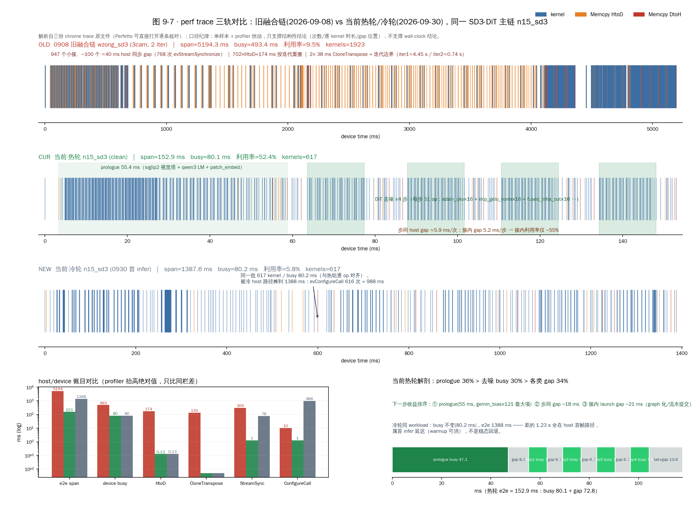
*图 9-7：自绘（`tools/mk_fig_ch09_perfetto_compare.py`，直接解析三份 chrome trace 原文件）。
上半三行是设备时间线（蓝=kernel、橙=HtoD、红=DtoH，每行各自刻度）；左下是同栏账目（log 刻度）；
右下是当前热轮的解剖条。三份 trace 均可直接拖进 Perfetto（ui.perfetto.dev）逐条核对。*

**Perfetto 原生界面截图**（图 9-8，v58.2 本地 UI + 无头 Chrome 自动抓取，
`tools/mk_fig_ch09_perfetto_snapshots.py`；"局部特写"的做法=把时间窗裁成子 trace 再加载，UI 自动 fit 到该窗）：

| (a) OLD 全程 5.2 s：947 个小簇被 gap 撑开，HtoD/同步海洋 | (b) OLD t≈4.45 s：38 ms `KernelCloneTranspose` 迭代边界 |
|---|---|
| 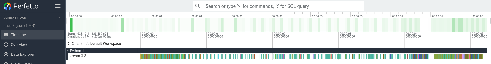 | 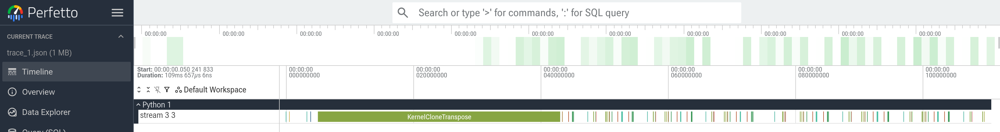 |
| **(c) CUR 热轮全程 153 ms：prologue + 4 个去噪步（绿色概览条的 4 簇）** | **(d) CUR 单去噪步 13.9 ms：16×(adaln→m→a→m) block 指纹，块间 launch gap 肉眼可见** |
| 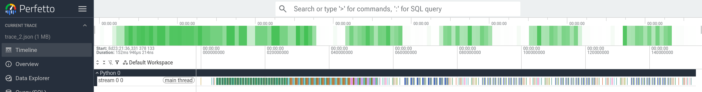 | 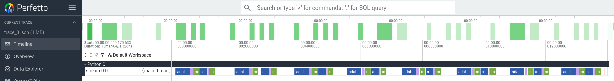 |
| **(e) NEW 冷轮全程 1.39 s：同批 kernel 被 host 首帧路径摊开** | |
| 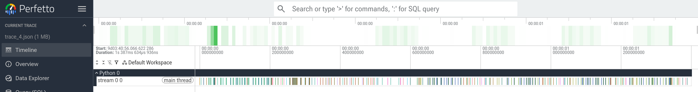 | |

> 截图脚本环境搭法（一次性）：`pip install playwright`；官方 CDN 不可达时从 npmmirror 拉
> Chrome-for-Testing(linux-arm64) 解到 `~/.cache/ms-playwright/cft-153/`；ui.perfetto.dev 本身会被
> 其 CSP（`connect-src` 只放 localhost 固定端口）与首屏 wasm 慢加载卡住——脚本改为把官方
> `perfetto-ui.zip`（GitHub release，走 gh-proxy 镜像）解到 `~/.cache/perfetto-ui/` 本地托管，
> 同一 HTTP 服务 `/traces/*` 与 UI 同源加载，CSP 自然放行。

三份 profile 产物（同一 SD3-DiT 主链的板端 pytorch/LPU trace，落盘 `~/wzong/workspace/embodied/logs/`）：

| 轨 | 文件 | 场景 |
|---|---|---|
| OLD | `trace_3cam_2iter_ae_fused_k67/wzong_sd3_2iter_chrome_trace.json` | 2026-09-08 旧融合链，3-cam、2 iter |
| CUR | `trace_current_clean/n15_sd3_chrome_trace.json` | 当前干净热轮 |
| NEW | `wz_prof_current_20260930_145846/trace/n15_sd3_chrome_trace.json` | 当天新抓**冷轮**（首次 infer） |

关键数字（脚本聚合自 trace 原文件，merge 后 busy）：

| 指标 | OLD | CUR（热） | NEW（冷） |
|---|---|---|---|
| 设备侧跨度 | 5194 ms（2 iter） | **152.9 ms** | 1387.6 ms |
| device busy / 利用率 | 493 ms / **9.5%** | 80.1 ms / **52.4%** | 80.2 ms / 5.8% |
| kernel 数 / 种类 | 1923 / 39 | 617 / 27 | 617 / 27 |
| Memcpy HtoD | **702 次 / 174.4 ms** | 12 次 / 0.13 ms | 12 次 / 0.13 ms |
| `KernelCloneTranspose` | **136 次 / 134.6 ms**（含 2×38 ms） | **0** | **0** |
| `evStreamSynchronize` | 768 次 / 308.9 ms | 15 次 / 1.3 ms | 15 次 / 78 ms（冷） |
| `evConfigureCall` | 10.3 ms | 1.25 ms | **988 ms**（616 次，avg 1.6 ms） |

**三条结构性结论**（按 §10.3 纪律①，只看次数/逐 kernel 时长/gap 位置，不比 wall-clock）：

1. **OLD → CUR 的收益全是"消失的列"**：每迭代重搬权重的 702×HtoD（174 ms）和每迭代 2×38 ms 的
   `KernelCloneTranspose` 巨型 split 转换在热轮里**整列归零**——§10.5 欠账第 2 条（"CloneTranspose
   占设备大头"）在这条 n15_sd3 主链上已兑现；768 次逐 op 全设备同步换成 15 次边界同步后，
   947 个被 ≈40 ms gap 撑开的设备小簇塌缩成 15 个簇，利用率 9.5% → 52.4%。
   迭代边界本身在 trace 里可见：两次 38 ms CloneTranspose 落在 t≈4.6 ms 与 t≈4455 ms
   （iter1 ≈4.45 s 冷路径 + iter2 ≈0.74 s）。
2. **冷轮慢 9× 但 GPU 一点没变慢**：NEW 与 CUR 的 kernel **逐 op 对齐**（617 个、busy 80.2 vs 80.1 ms），
   多出的 1.23 s 全在 host 首帧路径（`evConfigureCall` 616 次共 988 ms、`evMemcpyAsync` avg 4.8 ms、
   sync avg 5.2 ms）。⇒ 这是**首 infer 延迟**（warmup/预热可消），不是稳态回退——与第 13 章
   "秒第 2+ 轮稳态、首轮是一次性 lazy init"的口径纪律同源。
3. **热轮的剩余账**（下一步收益排序，图右下）：① prologue 55.4 ms（siglip2 视觉塔 + qwen3 LM，
   `gemm_bias_run_die`×121 共 10 ms 是最大单项），占 e2e 36%；② 4 个去噪步之间 host gap
   ≈5.9 ms/次 ×3；③ 每步簇内 51 个 op 之间的 launch gap 5.2 ms（avg 103 µs，簇内利用率仅 ~55%）。
   每步构成固定：`adaln_qkv×16 + mlp_gelu_norm×16 + fused_mha_out×16`（16 block × 4 去噪步，
   与第 06 章 §6.7 的 64 次 cross 对位）；另注意每步**首个** `adaln_qkv` 0.46 ms vs 稳态 0.25 ms，
   Perfetto 里放大 t≈63.5 ms 处可查 shape/路由差异。

> 复现：图 9-7 `python3 tools/mk_fig_ch09_perfetto_compare.py [OLD CUR NEW]`（缺省用表内三份路径）；
> 图 9-8 `python3 tools/mk_fig_ch09_perfetto_snapshots.py`（本地 UI + 无头 Chrome 全自动，见上面的环境搭法）。
> 交互对照直接把三份 json 拖进 <https://ui.perfetto.dev>（或本地 `~/.cache/perfetto-ui` 起服务），用
> `select name, sum(dur) from slice group by name` 对账本，用 timeline 看 gap 结构。

### 10.7 一轮 148.7 ms 的两本账：有效算力阶梯 × 气泡瀑布（图 9-10，2026-10-02 实测补记）

课堂上先有了一段"直觉版判断"，本节把它**逐条按到 trace 上**——因为这一章的所有结论都要求
"可复跑"，直觉判断也一样要过这一关：

> **判断原文（要点）**：gr00t 推理的特点是模块多——vit / llm / dit 三种 attention 变体
> （双向、prefill、self+cross 混合）、无 KV cache、多种 MLP（多种激活 glu / silu）、多处 projection
> 维度对齐、多种归一化（rmsnorm / layernorm / adalayernorm）、散算子密布；数据量相对小
> （小 batch、小 hidden 2048/1536）。所以优化重点是**算子融合、缓存持久化、消除冗余计算**
> （尤其 DiT 多轮去噪的冗余），以及**模块间数据布局统一契约**，减少 aten 布局操作与 DMA transpose/reshape。

| 判断 | 实测核对（同一份 trace + 权重头 + config） | 判定 |
|---|---|---|
| 三种 attention 变体 | **五处现场、三个核**（§7.5.4）：SigLIP 27 / Qwen3 12 / vl_self_attn 4 / DiT cross 32 / DiT self 32 | ⚠ 数量要改，方向对 |
| 无 KV cache | 三句分开：DiT self **无也不该有**（49 行每步全变）；DiT cross-K/V **不是无 cache，是一次性上下文复用，且已落地**（§7 第 1 行，`kv_from_nh1==2`）；Qwen3 hook 里 `use_cache/cache_position` 备而未用（prefill 无未来） | ⚠ 要拆成三句 |
| 多种 MLP 与激活 | **4 种激活 5 个核**：`mlp_swiglu`(Qwen3) / `mlp_gelu`(SigLIP gelu-tanh 27 发 + vl 4 发) / `mlp_gelu_norm`(DiT，LN 已折入) / `mlp_silu`(AdaLN 侧 temb) / `mlp_relu`(state/action 编码器) | ✅ |
| 三种归一化 | `rmsnorm`×25（Qwen3，已折进 `gemm_norm_rope`）、`layernorm`×68（SigLIP 55 + vl 7 + DiT 尾，**未融合**）、AdaLN（已折进 `adaln_qkv`；旧版还是独立 `adalayernorm_run_die` 64 发 9.3 ms，现已消失） | ✅ 且已推进一格 |
| 多处 projection 对齐 | 比想象少：**只有 cross 的 `to_k/to_v=[1536,2048]` 两处**（2048→1536 在建模块时焊死，06 章 §6.8.2）；backbone→vl 塔同宽 2048，**零投影接缝** | ✅ 但要收窄 |
| 小 batch / 小 hidden | 1152(SigLIP) / 2048(backbone、vl) / **1536(DiT)**；batch=1；DiT `M_q=49`、`head_dim=48`；backbone 序列 296 | ✅ |
| 重点＝融合 / 常驻 / 消冗余 / 布局契约 | 方向全对，但**排序要按实测重排**：头号损失是 host 气泡（60.9 + 7.8 ms，占墙钟 46%），不是算力、也不是布局搬运（布局那一笔已经兑现，§10.6） | ⚠ 排序要改 |

复跑：`python3 tools/trace_phase_ledger.py [chrome_trace.json]`（缺省即 §10.6 表里的 CUR 那份）。

#### 10.7.1 第一本账：每发 kernel 值多少算力（图 9-10 左）

FLOPs 由**权重形状 × 实测序列长度**算出（形状出处：06 章 §6.8.6 维度账本 + `config.json` +
safetensors 头），µs 取自 trace ⇒ 这是**有效算力**，不是厂商标称峰值；attention 行的 FLOPs
含被融合进去的 `to_out`，同名核按相切窗取中位。

| 每发计算 | 次数 | GFLOP/发 | µs/发 | TFLOPS |
|---|---|---|---|---|
| SigLIP MLP fc1+fc2（M=768） | 27 | 15.23 | 240 | **63.6** |
| vl 塔 FF 2048→8192→2048（M=296） | 4 | 19.86 | 468 | 42.5 |
| Qwen3 MLP swiglu（M=296） | 12 | 22.35 | 727 | 30.7 |
| SigLIP q/k/v/out_proj（M=768） | 109 | 2.04 | 76 | 26.7 |
| Qwen3 QKV+RMSNorm+RoPE 一合（M=296） | 11 | 4.97 | 232 | 21.4 |
| Qwen3 o_proj（M=296） | 12 | 2.48 | 148 | 16.8 |
| vl 塔 QKV 一合（M=296） | 4 | 7.45 | 447 | 16.6 |
| DiT FFN 1536→6144→1536（M=49） | 64 | 1.85 | 186 | 9.9 |
| DiT cross QKV（KV MISS，M_kv=296） | 8 | 3.96 | 466 | 8.5 |
| SigLIP attention（3 相机合批 256²） | 27 | 0.91 | 117 | 7.8 |
| DiT self attn + to_out（49²） | 32 | 0.25 | 42 | 5.9 |
| vl 塔 attn + to_out（296²） | 4 | 3.20 | 806 | 4.0 |
| DiT cross attn + to_out（49×296） | 32 | 0.32 | 93 | 3.4 |
| DiT self QKV（adaLN 调制后 ×3） | 32 | 0.69 | 250 | 2.8 |
| DiT cross QKV（KV HIT，只剩 q） | 24 | 0.23 | 184 | 1.3 |
| Qwen3 attention（causal + GQA） | 12 | 0.36 | 304 | 1.2 |

**同一块 Die、同一族 GEMM，一轮之内跨 54 倍**（63.6 → 1.2）。三条解读：

1. 全轮有用算力 **1.33 TFLOP**，按阶梯顶 63.6 TFLOPS 折算的纯算力下限只要 **21.0 ms**，
   而 busy 已经花掉 80.0 ms ⇒ **busy 里只有 26% 不是空转**；把气泡也算上，整轮有效算力
   9.0 TFLOPS = 阶梯顶的 **14%**。
2. 阶梯的排序几乎就是**行数 M 的排序**（768 / 296 / 49）：DiT 六条全压在 1–10 TFLOPS，
   `M=49` 行、`head_dim=48` 在 64/128 的 tile 上天生打不满。§10.1 那句"单 GEMM 的时间打不过
   一次 FFI 调用的固定成本"，在这里第一次被换算成钱。
3. 反过来读：**别为 DiT 找更快的 GEMM**。同样把 M 从 49 提到 296 才谈得上 3 倍算力，
   而"把 4 个去噪步合成一发"在数学上不成立（步间有数据依赖）⇒ DiT 的出路只剩发射侧与常驻侧（§10.5）。

#### 10.7.2 第二本账：这段时间是设备在算，还是在等 host（图 9-10 右）

`busy = Σkernel`（profiler 顶层看得见）；`span = 相内第一个 kernel 起点 → 最后一个终点`（墙钟）。
两者的差**不在任何 kernel 里**，只能在墙钟里找到——这正是 §9 那次"−6.8 ms 却 e2e 归零"的时域形状。

| 相 | kernel | busy/ms | span/ms | 气泡 |
|---|---|---|---|---|
| SigLIP 27 层 | 230 | 20.33 | 23.40 | 13.1% |
| Qwen3 12 层（`select_layer=12` 截断） | 98 | 19.32 | 20.29 | 4.8% |
| vl_self_attention 4 层 ＋ head 前置 | 35 | 7.44 | 13.69 | **45.7%** |
| DiT 去噪步 1（16 块） | 65 | 9.93 | 22.42 | 55.7% |
| DiT 去噪步 2 | 65 | 7.64 | 21.00 | **63.6%** |
| DiT 去噪步 3 | 65 | 7.68 | 21.74 | 64.7% |
| DiT 去噪步 4 | 58 | 7.62 | 18.34 | 58.5% |
| **合计（相内）** | **617** | **79.96** | **140.88** | **43.2%** |
| 相外空隙（不属于任何 kernel） | — | — | 7.83 | vl→DiT 2.28 ms ＋ 步间 1.82/1.81/1.89 ms |

⇒ **整轮墙钟 ≈ busy 80.0 ＋ 相内气泡 60.9 ＋ 相外 7.8 = 148.7 ms**；碎片度：kernel 617 发 /
27 种、中位 77 µs、**219 发 <50 µs、70 发 <20 µs**、`evLaunchKernel` 616 次 19.8 ms（32 µs/发，
占墙钟 13%）。三条解读：

1. **"DiT 是重点"在墙钟上成立、在算力上不成立**：四个去噪步 span 83.5 ms（占整轮 56%），
   但 busy 只有 32.9 ms（占 busy 41%）⇒ 动作头的账记在**发射侧**。这与 §10.6"每步构成固定
   `adaln_qkv×16 + mlp_gelu_norm×16 + fused_mha_out×16`"是同一件事的两面。
2. **口径调和**（纪律②）：本节"步间 1.8 ms"是**相边界**口径，§10.6 的"≈5.9 ms/次"是**簇级**
   口径（把步内 51 个 op 之间的 launch gap 也算进同一段空档）。两者相加自洽，**不可互替**。
3. **§7 第 1 行那笔 KV 缓存，在这本账里能直接看见形状**：`adaln_qkv` 64 发分成三簇——
   466 µs（cross，KV MISS：要算 296 行 K/V）/ 250 µs（self，四步都一样）/ 184 µs（cross，KV HIT：
   只剩 q）。step1 均值 358 µs，step2-4 均值 217 µs ⇒ 8 × (466−184) ≈ **2.2 ms/步、6.7 ms/轮**
   已经吃掉，与 §7 那笔 −6.8 ms 同数量级（该处为 per-step 表口径，勿与本表互比）。
   **而这 6.7 ms 在 e2e 上归零的原因，就是这张表右半边的气泡。**

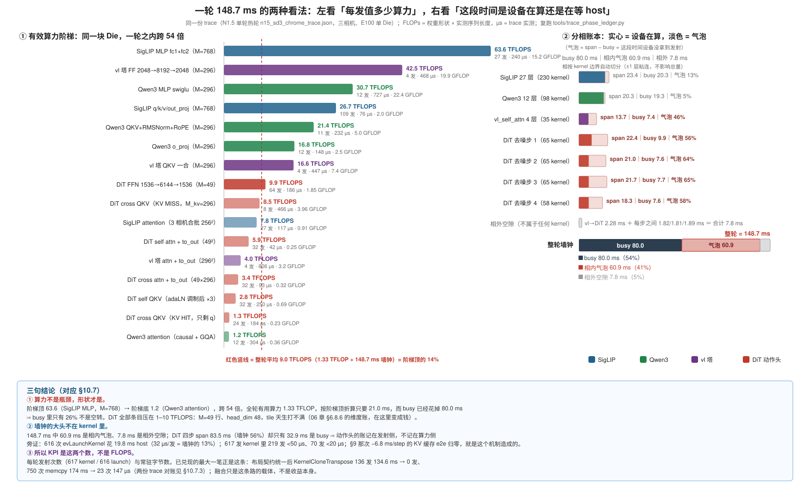

*图 9-10：自绘（`tools/mk_fig_ch09_efficiency_ladder.py`，数据 `tools/trace_phase_ledger.py`）——
左：每发 kernel 的有效算力阶梯（颜色 = 塔，红竖线 = 整轮平均 9.0 TFLOPS）；
右：分相 busy/气泡堆叠条 ＋ 相外空隙 ＋ 整轮墙钟合成条；底部三句结论对应 §10.7.1–§10.7.4。*

#### 10.7.3 "布局统一契约"这一笔已经兑现到什么程度（结构占比，不是 A/B）

判断原文把"减少 aten 布局操作 / DMA transpose"列为重点，**这一笔恰好是全章已兑现最大的单项**
（机理与逐列对账在 §10.6，此处只补结构占比，**两版算子代际不同，禁止当性能 A/B 用**）：

| 结构指标（每迭代口径） | 旧 3cam·2iter | 当前 clean 热轮 |
|---|---|---|
| `KernelCloneTranspose` | 68 发 / 67.3 ms（含一发 38 ms 的巨型 split） | **0 发** |
| 全部转置类占设备时长 | **42%** | 0 |
| `evMemcpyAsync` / D2D | 375 次 / 87 ms | 25 次 / 2.2 ms |
| kernel 总数 | 962 | **617** |
| 设备 busy | 159.5 ms | **80.0 ms** |
| 逐 op 全设备同步 | 384 次 | 15 次边界同步 |

#### 10.7.4 台账：按"能拿回多少 ms"重排（补 §10.5，含一个已记录的阻塞点）

| 优先级 | 欠的是什么 | 量级 | 已记录的现状 / 阻塞点 |
|---|---|---|---|
| **P0** | **发射与常驻**（host 气泡 60.9 ＋ 相外 7.8 ms） | 最多，≈46% 墙钟 | 阻塞点是**已知的**：`df5f000 fix(npu): 非 Parameter 权重缓存默认关闭消除非确定性污染`——权重常驻这条路被非确定性回归关掉了。**先定位非确定性根因，再谈 P0**；`661c89d`（`gemm_norm_rope` 权重/RoPE 常量常驻）证明单点常驻可行 |
| **P1** | **小形状**：SigLIP 的 q/k/v 仍是 3 发独立 `gemm_bias`（109 发 8.2 ms），Qwen3 早就是一发 `gemm_norm_rope`；SigLIP/vl 还有 62 发未融合的 `layernorm_run_die`（2.4 ms，纯带宽，读 3.5 MB 只跑 ~100 GB/s） | ≈2–4 ms ＋ 81 次发射 | 与 §4.3 粒度阶梯同族；`siglip_layer_ffi_fused` 已导出未启用（14 章 §6）就是这条路的现成把手 |
| **P2** | **冗余计算**：cross-K/V ✅ 已做（§7 第 1 行）；AdaLN scale/shift ✅ 已按 `(block, t)` 缓存（§7 第 3 行）；剩下 `sa_embs` 每步 2 发 `KernelCatWithOut`（33 行不变、只有 16 行动作变）、以及一发**单发 662 µs 的 `KernelFillScalarMethod`**（在最后一层 Qwen3 之后、`action_head.vlln` 之前，**本表未归因**——它和 DiT 整个 self-QKV 同量级，值得单独定位） | ≈0.7 ms ＋ 若干发射 | §10.4 纪律 2："消失的调用次数"比"变快的 kernel"更早反映收益 |
| **P3** | **布局搬运** | 已兑现（§10.6、§10.7.3） | 只剩 DiT ATen 残余 708 → ~350 那条线未收口（§10.5 第 2 条） |

**带走的两句**：这个负载的 KPI 不是 FLOPS，是**每轮发射次数**（617 kernel / 616 launch）与
**常驻字节数**；而判断"某笔优化该不该做"的最快算法是 §10.7.2 那本账——
**先问它省的是 busy 还是气泡，落在气泡上的钱，busy 表里永远看不见。**


## 11. 本章小结

- 加速在**算子/模块**两层进行，核心是**运行期打补丁**（`PatchesManager`），不改模型源码。
- 接入是一条**时间轴**（图 9-3）：T0 换符号（早于 `from_pretrained`，否则静默失效）→
  T1 懒上设备 + 常量预计算（t 只有 4 值 ⇒ temb/pe/scale_shift 全常驻）→
  T2 每层落到具体 kernel（守卫即契约，不满足就静默回退）。
- **融合的收益主要是"少一次 host→device 往返"**，不是省 FLOP：960 → 192 → 64 次发射/轮，
  0.826 s（NPU 逐算子初步接入）→ 0.14 s/round；剩下的硬骨头仍是 `to_lpu`/`page_kv` 这类 host 往返。
- **布局与 dtype 是 ABI 不是风格**：fp16 主链（bf16 无 split 互转）、`[2,*]` die 轴复刻、
  单 Die 必须 `INIT_SINGLE_DIE`、V 的转置布局由 kernel 硬校验。
- **版本号也是契约**：op 集合可以直接 `git ls-tree` 出来，本章 §4.2/§6 的勘误就是这么抓出来的。
- **"能省"≠"该省"**：§6.7 的 cross K/V 缓存 2026-09-24 落地后 ON/OFF 逐位一致、**e2e 无收益**——
  省掉最肥的 GEMM 也看不见，因为瓶颈是 host 往返。**先量瓶颈，再做常量提升**（第 06 章 §6.7 附录）。
- **全局视角在 §10**：负载画像 → 四种货币 → 里程碑账本 → 三条纪律 → 欠账清单。
- **两本账在 §10.7**（图 9-10）：有效算力阶梯（同 Die 跨 54 倍，busy 里只有 26% 不是空转）
  与分相气泡瀑布（148.7 ms = busy 80.0 ＋ 气泡 60.9 ＋ 相外 7.8）⇒ KPI 是**发射次数与常驻字节**，不是 FLOPS。
- **三方对比（纯 PyTorch / TRT / NPU）合表在附录 A.4**：同一笔“前端税”账，TRT 用编译器自动清算，
  NPU 用手工图化 + 工程纪律清算；发射单价决定融合粒度（A.5）。
- 对读者：理解"三级入口 + 融合粒度 + 对账口径"即可，无需逐行读 `.ac` 内核。

## 本课提问（v0.2 走读 · 待作答）

**Q1（时序契约）** 如果有人把 `install()` 写在了 `from_pretrained()` **之后**，程序会报错、还是静默出结果？
如果是静默，你会用**哪一个**已有的探针最快证明"叶子没被换掉"（不许加新日志）？

**Q2（落地 §6.7）— 已由实作作答（2026-09-24 板端 v0.2-fix 线，判卷见第 06 章 §6.7 附录）**
现在要把 cross-attn 的 K/V 缓存真正实现。请问：改动主要在 host 侧（`action.py`）
还是 kernel 侧（`dit_block_ffi.cc`）？给出**最小改动契约**——`dit_block_fused` 的实参表里哪些位可以去掉、
哪两个 buffer 要从 `_ditbufs` 的"每步覆盖"变成"跨步只写一次"、`kv_from_nh1` 需要增加什么语义？
以及：为什么这个改动**必须**配 526-leaf `cos_check.py` 全量对账才允许合入，而不能只看 `action_pred` 的 cos？

> **判卷要点**：① 答"主要在 kernel"对——实际只改了 `adaln_qkv_kernel.ac`（+12/−4）与 host（+32），
> `dit_block_ffi.cc` **一行没动**：因为**形参一位都不用去掉**，最小契约就是"加一态、不动签名"，
> 比"删参数"更省（ABI/wheel 不破）。② "哪两个 buffer"= `_ditbufs` 的 `kT/vT`，实作靠 `enc_key` 命中判定
> 实现"跨步只写一次"（第 4 坑：这个 key 应与 `_ditbufs` 的形状 key 合并）。③ 语义 = `kv_from_nh1==2`
> （precomputed/skip），默认 0/1 路径零改动。④ "必须全量对账"的理由要说的是**关节级回退**：
> `action_pred` 的整体 cos 会被大关节稀释，v0.2 当年 `left_hand` 0.992、`right_hand` 1.000 并存，
> 只看总体 cos 会放行小关节回退——实作这次连 `maxdiff=0.0` 都拿到了，但仍要用 526-leaf 兜住"逐位一致"这个断言。

**Q3（布局即 ABI）** `dit_block_ffi.cc:214-218` 强制 `out_v` 是 `[N_q, M_kv]`（转置），而 `out_k` 是
`[M_kv, N_k]`（不转置）。attention 里 Q 和 K 要做内积、V 只被 softmax 权重加权——顺着这个不对称想一想：
**为什么 kernel 宁愿多花一次转置，也要把 V 存成转置？**（提示：收缩轴落在哪一维，以及 LPU 的行并行/复刻语义。）

**Q4（归因）** `GROOT_NPU_DIT_BLOCK_FUSED=0` 回退后精度不变、耗时变长；`GROOT_NPU_PE_FFI=0` 回退后精度也不变、
耗时也变长。这两种"变慢"在**归因意义上**是同一件事吗？如果不是，分别说明它们慢在哪一层
（发射次数 / 数据搬运 / 计算量），并指出各自在 `profiler` 三档报表里应该看哪一档键。

## 自己动手

1. 打开 `transformers_npu/register.py`，数一数动作头(DiT)挂了哪几个补丁，再对照 §3.3(b) 的 30 个目标看有没有漏。
2. 对照 `groot_ops/ops/torch_ops/` 的算子名，指出哪个对应"MLP+GELU+Norm 融合"、哪个对应"多头注意力"。
3. 在 `groot_ops` 仓跑 `git ls-tree -d --name-only v0.2:ops/torch_ops`，与 §4.2 的 30 个 op 对账；
   再跑一次 `v0.4`，数出多出来的 6 个，说出它们分别吃掉了 v0.2 里的哪几次发射。
4. 在 `Isaac-GR00T` 仓从 `action.py:773` 的 `dit_block_fused` 调用点出发，把 44 个实参与
   `dit_block_ffi.cc` 的校验逐一对上号（哪些是输入、哪些是常驻 buffer、哪些是权重）——
   对完你就有了 §6.7 KV 缓存那个改动的完整改动面。

## 附录 · L20 vs E200 硬件账本与 TRT 6.6× 归因（2026-09-28 实测补记）

背景：同一天在 L20 上跑通了官方 n1.5-release 的 TensorRT 部署链（ONNX→引擎→e2e，见第 13 章 §3.4），
顺带把 E200 的硬件规格从板端翻了个底朝天。**先说一个查证结论：E200 的峰值吞吐不在任何一份 SDK PDF
文档里**（本地 14 份 + 板端文档只有架构/容量），真数字在**板端 `ev-qual` 质检日志**与 `ev-smi` 固件信息里。

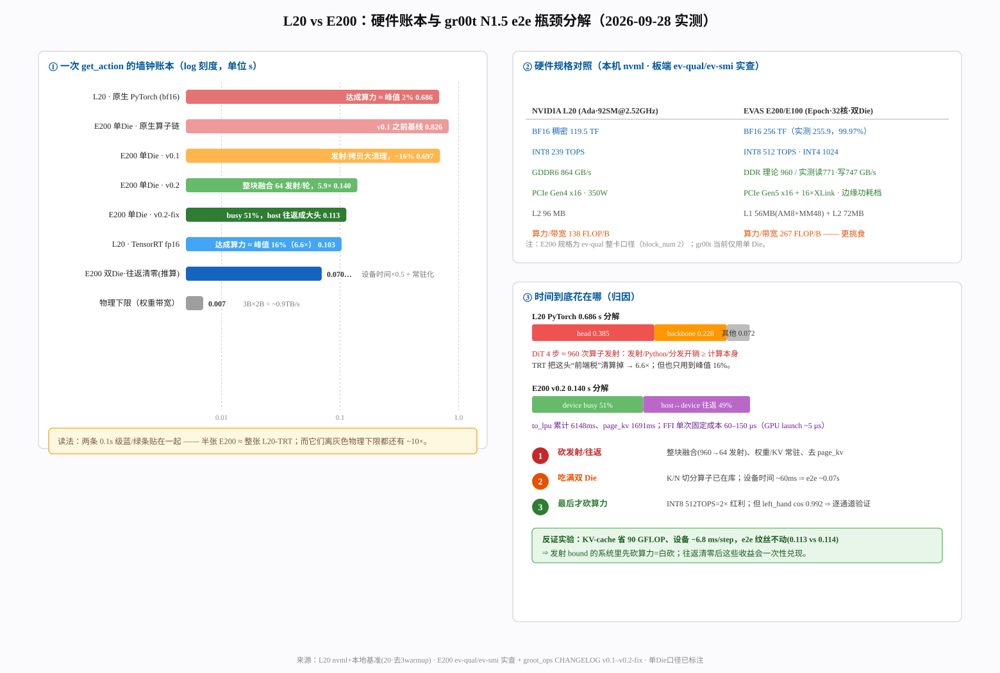
*图 9-6：自绘（`tools/mk_fig_ch09_l20_e200_ledger.py`）。左：e2e 墙钟账本（log 刻度）；右上：硬件规格
（全部实查）；右下：时间归因与攻击次序。*

### A.1 硬件规格（实查口径）

| 指标 | NVIDIA L20（本机 nvml） | EVAS E200/E100（板端 ev-qual / ev-smi） |
|---|---|---|
| 架构 | Ada SM8.9，92 SM @2.52 GHz | Epoch Chiplet，32 核=8 集群×4 核，双 Die，ME/VE/TE 数据流 |
| FP32 矩阵 | 59.8 TF | 64 TF |
| BF16/FP16 稠密 | **119.5 TF** | **256 TF**（实测达成 255.9，99.97%） |
| INT8 / INT4 | 239 TOPS / — | **512 TOPS**（实测 511.8）/ 1024 TOPS（实测 1023.3） |
| 显存/带宽 | 48GB GDDR6 @864 GB/s | 48GB DDR @18 Gbps；GLB↔L2 理论 960、**实测读 771/写 747 GB/s** |
| 片上存储 | L2 96 MB | L1 56MB（AM 8 + MM 48）+ L2 72MB（集群 9MB×8） |
| 互连 | PCIe Gen4 ×16，350 W | **PCIe Gen5 ×16** + 16×XLink 200Gb/s；边缘功耗档 |
| 算力/带宽比 | 138 FLOP/B | **267 FLOP/B（更"挑食"，要求更高复用率）** |

### A.2 TRT 为什么能 6.6×（0.686→0.103 s）——一笔 roofline 账

一次 `get_action` 总计算量 ≈ 1.5–2 TFLOP ⇒ L20 理论下限 ~15 ms、权重带宽下限 ~7 ms。
实测达成率：PyTorch **~2%**、TRT **~16%**。所以 **6.6× 不是 tensor core 多干了 6.6 倍活，
而是把 PyTorch 浪费的 98% 机器时间捡回来**，按贡献排序：

1. **清算"前端税"**：DiT 16 层×4 步 ≈ 960 次算子发射，batch1 下单个 GEMM 几 µs，而 PyTorch
   每次发射的 Python/dispatcher/autograd/临时分配开销 ≥ 计算本身（本章 §4 "省发射≠省时间"的 GPU 版）；
2. **kernel fusion**：AdaLN/bias/激活融进 GEMM 首尾，省中间张量 HBM 往返；
3. **CUDA Graph + 静态 shape**：整图录制回放，host↔device 往返从千次级降到个位数；
4. **权重预打包/最优 tiling**（strongly-typed fp16，Myelin 按固定形状选型）。

### A.3 NPU e2e 优化判断（对照 L20-TRT 0.103 s）

- 现状：E200 **单 Die** v0.2-fix ≈ 0.113 s ≈ L20-TRT（工作树/同板 A/B 口径，定稿纯净树为
  0.122 s，换算见 §10.3 表后脚注），且纸面算力是 L20 的 2.1×、带宽持平；
- 卡点不同：L20-TRT 卡在 kernel 执行效率（已达 16% 峰值）；**E200 卡在 host↔device 往返**
  （busy 仅 51%，`to_lpu`/`page_kv` 为大头，FFI 单次固定成本 60–150 µs vs GPU launch ~5 µs）；
- 路线（顺序即优先级，见 §10 排序）：①往返清零（整块融合 64 发射/轮、权重/KV 常驻、去 `page_kv`）
  → ②双 Die K/N 切分吃满（算子已在库，推算可进 ~0.07 s，**反超 L20-TRT**）
  → ③INT8 红利（512 TOPS=2×，但 `left_hand` cos 0.992 已亮黄灯，须逐通道验证）；
- KV-cache 反证实验（省 90 GFLOP 而 e2e 不动）再次确认：**发射 bound 系统先砍算力=白砍**，
  但收益已埋好，往返清零后会一次性兑现；
- 终局：两家物理下限同为 ~7 ms 档；L20 剩余空间在 FP8/量化，E200 在常驻化+双 Die——
  而**每瓦性能**（边缘功耗档 vs 350 W）才是 NPU 的胜负手。

### A.4 三方对比总表（§6 与 A.2/A.3 合并；2026-09-29 按基线勘误后的口径）

**先读三条表规**：① 三方基线**不同机**，同列内自比、跨列只比"数量级与瓶颈形状"，不比小数点；
② NPU 列的"busy 比"与 TRT 列的"roofline 达成率"是**两种指标**（设备忙闲 vs 峰值算力利用率），
不可互比；③ 标"推算"的数字未实测，禁止进 commit message。

| 指标 | ① 原生 PyTorch（纯 GPU 参照） | ② TensorRT（L20） | ③ NPU 融合链（E200） |
|---|---|---|---|
| 硬件/口径 | L20 48GB（附录 A.2、13 章 §3.4） | L20 同机 A/B | E200 单 Die（双 Die 未收口） |
| 端到端墙钟 | 0.686 s/轮 | **0.103 s**（6.6×） | 0.826 s（逐算子初步接入）→ 0.697（v0.1）→ 0.14（v0.2 tag）→ **0.122 s 定稿**（纯净树；工作树 A/B 口径 0.113，换算见 §10.3 脚注）；双 Die 推算 ~0.07（**未实测**） |
| 设备效率 | roofline 达成 ~2%，busy ≈13% | 达成 ~16%（kernel 效率已是剩余瓶颈） | busy 51%（仍发射/往返 bound，非算力 bound；忙比与达成率**不同指标**） |
| "前端税"清算方式 | 未清算：≈960 次 aten 发射/轮，单次 Python/dispatcher/autograd 开销 ≥ 计算本身 | **编译器自动**：整图编译 + kernel fusion + CUDA Graph 录制回放，host↔device 往返千次级 → 个位数 | **手工图化**：块级融合 64 次 FFI/轮（§4.3）+ 权重/常量设备常驻（§3.4）+ 恒等算子逐个消 |
| 布局搬运 | `to_head_major_k` 963 次、`contiguous` 432.8 ms/447 | 编译器布局传播，transpose/fusion 折进 kernel 首尾，中间张量不落回 HBM | kernel **直出下家布局**（head-major、V 转置硬校验）⇒ 963→0、49.5 ms/55 |
| 数值格式 | fp32/bf16 原生 | fp16 strongly-typed，类型由 Myelin 按固定形状自动选型 | fp16 主链——**硬件 ABI 倒逼**（bf16 无 split0↔1 设备端互转，§3.4），非风格选择 |
| 精度对账 | golden | **本章无逐通道对账记录（空白项）** | 526-leaf：vs CPU 0.999995 / vs L20 0.999998；`left_hand` 0.992 黄灯 ⇒ INT8 门禁先卡在这里 |
| 剩余瓶颈 | dispatch 空隙吞掉计算 | kernel 执行效率（16% 峰值后再榨 FP8/量化） | host↔device 往返（`to_lpu`/`page_kv`；FFI 单次固定成本 60–150 µs vs GPU launch ~5 µs） |
| 物理下限/终局 | — | ~7 ms（权重带宽主导）；剩余空间 FP8 | ~7 ms（带宽持平、算力 2.1×）；剩余空间常驻化+双 Die；**胜负手是每瓦性能** |

### A.5 优化方法对照：编译器自动图化 vs 手工图化 + 工程纪律

一句话总纲：**两家在还同一笔账（§10.2 四种货币），差别在"谁来融合、以什么粒度融合"——
而粒度是由单次发射的单价决定的。**

| 货币/手段 | TRT 的做法 | NPU 链的做法 | 关键差异 |
|---|---|---|---|
| 发射次数 | CUDA Graph 整图录制回放——**一次 replay 吞掉全部细粒度 kernel**，所以 TRT 有"资格"保持 kernel 细碎 | 无图捕获可用（FFI 被 `evConfigureCall` 禁用，§10.1 末行）⇒ 只能**把块做粗**：`dit_block_fused` 整块一次 FFI（内部只是编排已验证的两段 launcher，§4.3） | GPU launch ~5 µs vs FFI 60–150 µs：**发射单价差 1–2 个数量级 ⇒ 融合粒度必须粗 1–2 个数量级** |
| 布局字节 | 编译器全局布局传播，转置折进 kernel epilogue | 人肉布局契约：kernel 直出下家布局、`out_v=[N_q,M_kv]` 写成 FFI 硬校验 | TRT 传播是**自动的**；NPU 布局是 **ABI 契约 + 断言**（§10.4 契约三形态）|
| host 往返/驻留 | 单卡设备，权重天然常驻——**这本账在 TRT 里不存在** | NPU 特有税：`to_lpu`/`page_kv` 的 D2H2D 往返；对策 = 权重懒上设备 + 逐 op 同步改边界同步 | 双芯片结构性差异：TRT 永远不会有的货币，恰是 NPU 的头号货币 |
| 常量折叠 | Myelin 自动折常量、预打包权重 | **人看穿模型语义**：t 只取 4 值 ⇒ temb/pe/scale_shift 全常驻、命中率 100%；恒等 LN 规避单 Die NaN 缺陷 | 通用编译器不知道"t 只有 4 个取值"——**跨动态边界的语义级常量下沉，是手工路径对编译器的超额红利**（第 06 章 §6.7 课堂 → §7 kernel 兑现） |
| 算力/量化 | strongly-typed fp16 由编译器选型；FP8 是下一步 | fp16 主链 + INT8 纸面 2×；但门禁在**反归一化后逐通道** cos（`left_hand` 0.992 已黄灯） | NPU 精度治理更严（闭环控制不可重试）；TRT 链在本章**欠一次同等对账** |
| 回滚/可观测 | 引擎黑盒，只能换 builder 配置整版重编 | 零侵入 patch 可 `remove_patches()` 回滚；27 个 `GROOT_NPU_*` 逐 op A/B；profiler 与 `@op` 同名归组 | "融合 vs 非融合"的对照实验接口，TRT 给不了到单 op 粒度 |

**三条收束**：

1. **同一笔账的两次证明**：TRT 的 6.6× 不过是 §4.3/§9 定律在 GPU 世界的复述——它捡回的 98%
   机器时间正是"前端税"；roofline 达成率 2%→16% 与 busy 13%→51% 是同一场战斗的两种记法。
2. **自动化程度决定工程形态**：TRT 用编译器+生态（图捕获、自动 tiling、量化选型）换人力；
   NPU SDK 缺这一层，就只能用**纪律**换——金丝雀断言、布局硬校验、A/B 面板、口径账本，
   这些在 TRT 工程里根本不存在的"仪式"，是手工图化的必要成本，不是官僚主义。
3. **终局不是互相复制**：TRT 式整图回放消不掉 host↔NPU 往返（双芯片是结构问题），
   NPU 式常驻化+双 Die 落地后（推算 ~0.07 s）将反超 L20-TRT 0.103 s；两家物理下限同为 ~7 ms，
   剩余路径各异——**GPU 靠 FP8，NPU 靠常驻化，胜负手在每瓦性能**。

## 疑问与批注

（预留：记录问题。）
