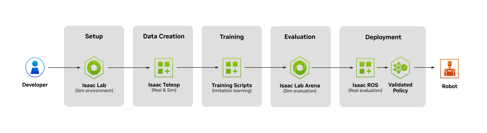
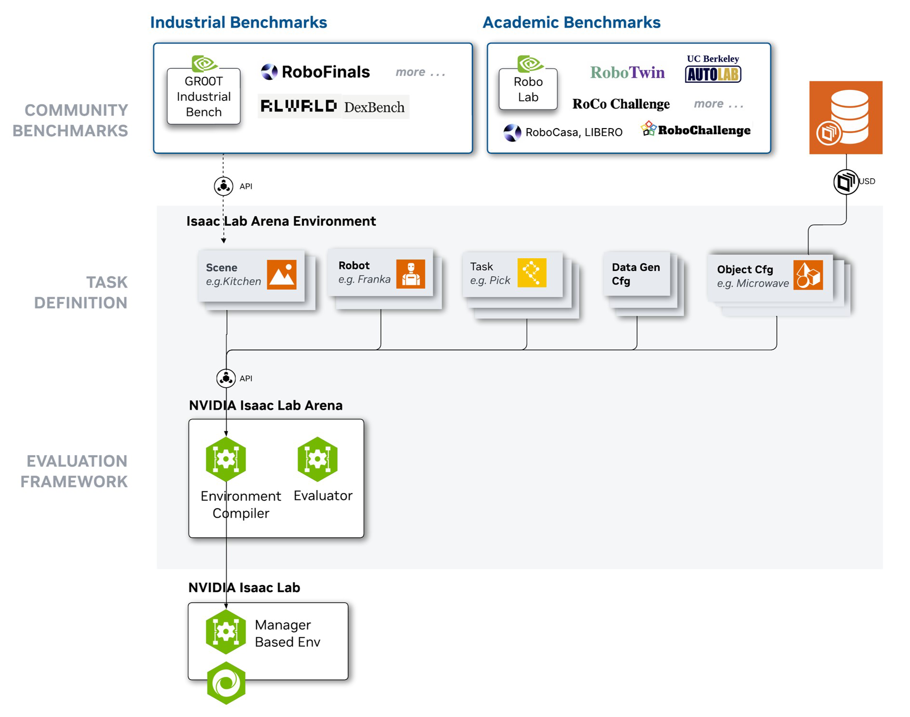
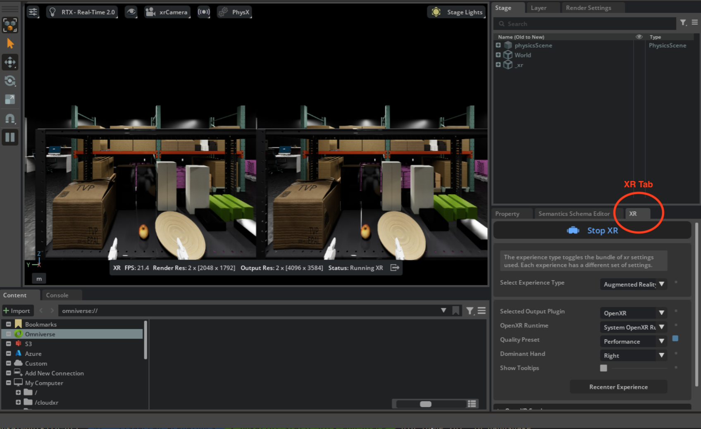
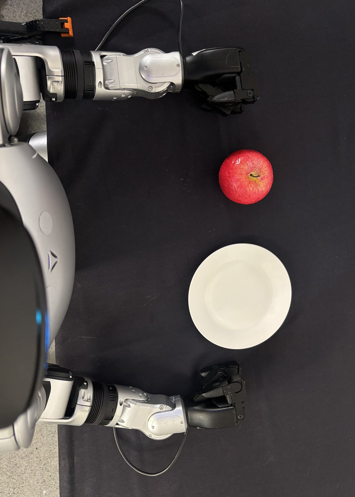
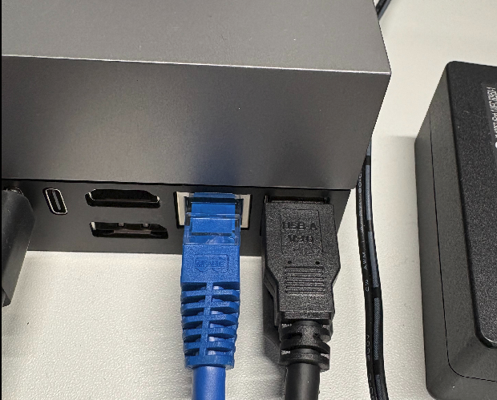
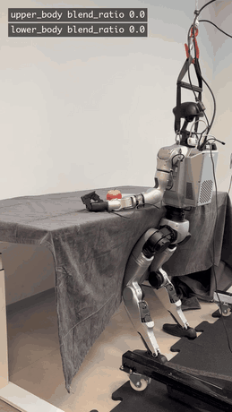
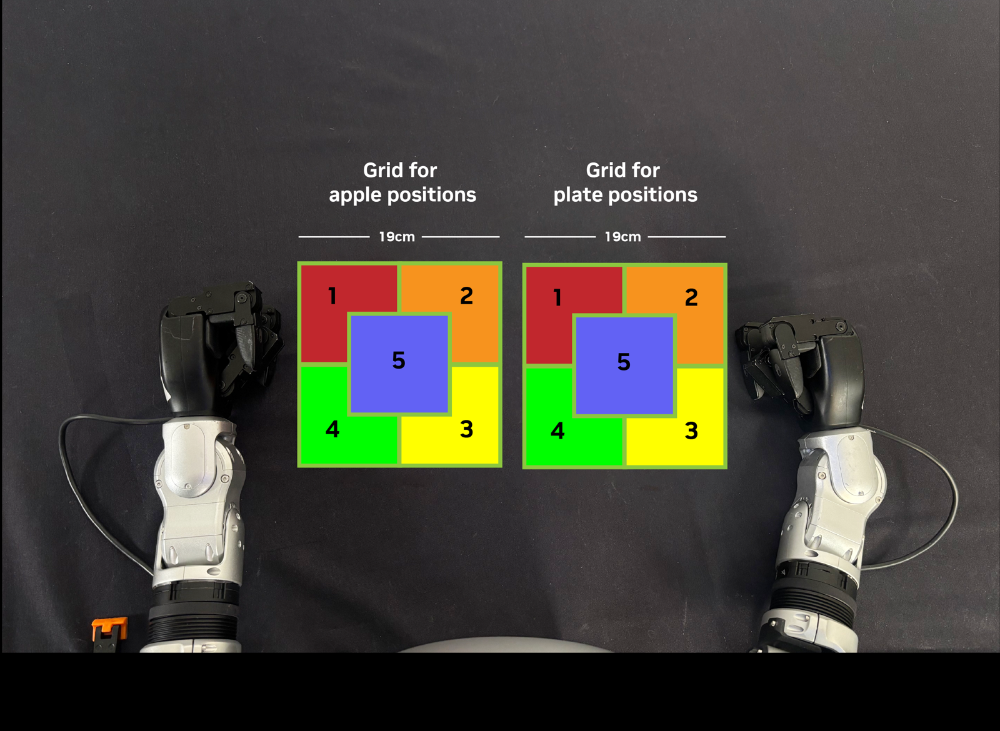
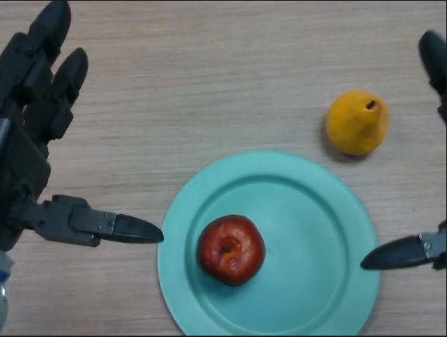

# 11 · 扩充参考：NVIDIA《端到端 Physical AI：GR00T × Unitree G1》教程精读笔记

> 来源：NVIDIA 官方免费课程 **End-to-End Physical AI With the Unitree G1**（GR00T Reference Workflow）。
> 起始页：<https://docs.nvidia.com/learning/physical-ai/gr00t-e2e-workflow/latest/index.html>
> 阅读日期：2026-09-16；全部 25 个内容页已通读，正文快照存于 `/tmp/gr00t_course/txt/`。
> 定位：本课程正文（00–10 章）讲"模型内部如何推理（N1.5）"；本篇讲"官方工程管线如何把模型用于人形机器人落地"，
> 作为**扩充参考**，不改变本课程以 **GR00T-N1.5** 为基准的教学约定（见 README）。
> ⚠️ 版本提示：该教程基于 **GR00T N1.7**（比本课程基线新两代），差异对照见 §7。

---

## 0. 课程定位与总览

- **原文起始页**：<https://docs.nvidia.com/learning/physical-ai/gr00t-e2e-workflow/latest/index.html>
- 这是一条 **参考工作流（reference workflow）**：把受支持的模型、库、框架和一个具体任务打包成可复现的
  Unitree G1 人形机器人策略学习流程；它是"蓝图"而非强制产品栈，团队可整体采用或按需摘取模块。


*图：官方总流程图——Developer → Setup(Isaac Lab 仿真环境) → Data Creation(Isaac Teleop 真机/仿真) → Training(模仿学习脚本) → Evaluation(Isaac Lab-Arena 仿真评估) → Deployment(Isaac ROS 真机评估 → Validated Policy → Robot)。原文图：<a href="https://docs.nvidia.com/learning/physical-ai/gr00t-e2e-workflow/latest/index.html">index.html</a>（本地副本 `images/ch11/`，下同）*
- **"端到端"的六个阶段**：

  1. 环境搭建（软件栈、任务资产、机器人本体、传感器、工作区）
  2. 遥操作与数据采集（仿真或真机）
  3. 数据转换 → **LeRobot 格式**
  4. **GR00T VLA 后训练**（apple pick-and-place 任务）
  5. 仿真中评估（Isaac Lab-Arena，上硬件前的验证闸门）
  6. G1 真机部署（打包后的 VLA 策略跑在物理机器人上）
- 官方架构图：<https://docs.nvidia.com/learning/physical-ai/gr00t-e2e-workflow/latest/_images/Isaac-GR00T-workflow-diagram.png>
- 警告：即使工具链全部接对，**弱数据集、错误的动作映射、不稳定的控制器、不可复现的工作区**仍会让整条管线失效。

两条互独立的工作流（可各自独立完成）：

| 工作流 | 采集格式 | 转换路径 | 训练 | 评估/部署 |
|---|---|---|---|---|
| 仿真（Isaac Lab-Arena） | HDF5 | HDF5 → LeRobot | GR00T 1.7 后训练 | Arena 闭环评估（server-client） |
| 真机（Unitree G1 + Thor） | ROS2 bag / MCAP | MCAP → LeRobot | GR00T 1.7 后训练 | LEAPP 导出 → Jetson Thor 边缘部署 |

---

## 1. Getting Started

### 1.1 概念总览 Concepts Overview
> 原文：<https://docs.nvidia.com/learning/physical-ai/gr00t-e2e-workflow/latest/getting-started/concepts-overview.html>


*图：GR00T VLA 概念图——传感器 token + 文本 token → VLM(System 2) → 扩散 Transformer(System 1) → 动作 token → 人形机器人（原文 concepts-overview 页图）*

**人形机器人如何学任务**：人类操作员通过遥操作演示 → 系统记录"看到什么、身体在哪、哪些动作推进任务" →
GR00T 在演示上做模仿学习，微调出 VLA 策略。人形区别于固定底座机械臂之处：**操作与平衡必须同时求解**。

**任务：apple pick-and-place**。G1 站在桌前，左手拿起红苹果放到白盘上。选它的理由：不需要复杂多步推理，
但完整考验"稳定站立、视觉识别、臂手协调抓取、全身转移调整、目标处释放"，且简单到能逐环节调试。

**核心组件**（各配官方链接）：

| 组件 | 角色 | 官方链接 |
|---|---|---|
| **Isaac Lab-Arena** | 建在 Isaac Lab 之上的开源任务框架：模块化任务定义、GPU 加速大规模并行评估 | <https://developer.nvidia.com/isaac/lab-arena> · <https://github.com/isaac-sim/IsaacLab-Arena> |
| **Isaac Teleop** | 高保真遥操作平台：XR 设备标准接口、**retargeting**（把人的动作映射成机器人可执行指令，补偿肢体比例/关节限位差异）、MCAP 记录 schema；仿真里可用 **CloudXR** 把仿真环境实时串流进头显做第一视角遥操作 | <https://nvidia.github.io/IsaacTeleop/main/index.html> |
| **AGILE（GR00T WBC 的一种控制器）** | 课程推荐的默认全身控制器：**单一端到端速度策略，只管站立与平衡**，让操作员/策略专注上半身任务——即**解耦式全身控制（decoupled whole-body control）** | （GR00T WBC 组件，见原文） |
| **LeRobot 数据集格式** | Hugging Face 的机器学习优化格式：episode 按 `observation.images / observation.state / action` 组织，与 GR00T VLA 训练结构天然对齐 | <https://huggingface.co/docs/lerobot/lerobot-dataset-v3> |
| **MCAP** | 开源多模态机器人日志容器：时间索引、二进制序列化、可选 LZ4/Zstd 压缩，适合实时录制 | （openm.org/mcap） |
| **LEAPP** | *Lightweight Export Annotations for Policy Pipelines*：trace 出"预处理→推理→后处理"整条策略管线，导出模型分段与部署描述符 | <https://github.com/nvidia-isaac/gr00t-leapp-export> |

数据格式分工一句话：**MCAP 擅长采集（快录/可恢复/可回放），LeRobot 擅长训练与共享**。仿真走 HDF5→LeRobot，
真机走 MCAP→LeRobot；转换映射错了，训练质量下降甚至彻底失败（文件看起来却可能是合法的）。

**VLA 输入/输出**（1.7）：

| 类别 | 内容 |
|---|---|
| 视觉输入 | 机载/周边 RGB（腕相机、头相机等） |
| 语言输入 | 自然语言指令，如 `move the apple to the plate` |
| 机器人状态输入 | 本体感受：关节位置、关节速度、末端位姿 |
| 动作输出 | **关节位置目标序列 / action chunk**（一次预测一小段未来动作 → 时序一致性与平滑度更好；即本课程第 01/06 章的 `action_horizon`/action chunking） |

**新本体（new embodiment）适配三件事**：定义动作空间（控哪些关节、合法范围）→ 配置观测空间（相机数量/分辨率、
状态字段映射）→ 在本体数据上后训练。GR00T 训练脚本用配置文件声明本体传感/执行布局（= 本课程第 03 章
embodiment_tag + modality config 的机制，N1.7 演化版）。

**后训练超参表**（原文原样）：

| 超参 | 为什么重要 |
|---|---|
| 学习率 | 太高会覆盖预训练先验；太低无法适配 |
| 批量大小 | 大 batch 稳梯度但吃显存 |
| 训练步数 | 数据少而步数多 → 过拟合 |
| **Action chunk size** | 一次预测多少个未来动作；大 chunk 更平滑但反应变慢 |
| 数据集混合比例 | 多数据源时的采样频率 |

**训练前/中检查**（原文建议）：训练前核对基座 checkpoint、训练计划、输出目录；训练中确认 loss 朝预期方向、
显存稳定、验证 loss 不发散、动作预测误差合理——尽早暴露数据集映射错误。

**为什么真机需要 LEAPP 导出**：训练 checkpoint 为"训练灵活性"而生，带着部署不需要的框架行为；真机要求低延迟
推理管线（观测预处理 → GR00T 推理 → 动作后处理）。LEAPP 把这条管线 trace、导出模型分段并产出部署描述符。
**仿真评估直接用训练 checkpoint，导出仅真机路径需要。**

**推理 vs 评估的定义**（原文强调）：推理 = 冻结权重下用实时观测产出动作；评估 = 推理 + 度量（大量 trial 统计
成功率）。先在仿真评估（失败便宜、世界全状态可自动化、"仿真成功率低 = 还没准备好上硬件"的强信号），
真机评估是最终验证点（识别→抓取→搬运→释放→稳定站立→无安全中止）。

### 1.2 先修要求 Prerequisites
> 原文：<https://docs.nvidia.com/learning/physical-ai/gr00t-e2e-workflow/latest/getting-started/prerequisites.html>

- 通用：Linux + Docker 熟练、中级 Python、人形机器人基本操作常识与真机经验。
- 两条路径共用：**遥操作设备** = Isaac Teleop 支持设备（Meta Quest 3 / PICO 4 Ultra 等，**不含 Apple Vision Pro**）；
  **训练 GPU** = ≥48 GB VRAM（1 卡起步；真机工作流规模化为 8×GPU 推荐）。
- 仿真工作站（按 Isaac Sim 6.0 x86_64 要求）：Ubuntu 22.04/24.04；最低 RTX 4080/16GB VRAM，推荐 RTX 5080，
  理想 RTX PRO 6000 Blackwell/48GB；CPU i7-7代～i9/R5～Threadripper；RAM 32→64GB；盘 50GB→1TB NVMe；
  驱动 580.65.06。注意 **Isaac Sim 不支持无 RT Core 的 GPU（A100/H100 不行）**；需预装 `ffmpeg`。
- 真机：Unitree G1（Dex3-1 手）+ 头部 RealSense（USB3 延长至 Thor）+ **Jetson AGX Thor 开发者套件**
  （T5000：2560 核 Blackwell GPU、14 核 Neoverse-V3AE、128GB LPDDR5X、1TB NVMe、5GbE）。
- 真机工作区规范：标准高度桌 + 黑桌布；红苹果放在**盘子左侧**、左臂可达；白盘；白墙背景；均匀无强阴影照明。

### 1.3 Agent Skills（官方给 AI 代理的技能包）
> 原文：<https://docs.nvidia.com/learning/physical-ai/gr00t-e2e-workflow/latest/getting-started/agents.html>

- 本课程排障技能（RealSense、Isaac Teleop、MuJoCo、ROS 域串扰、图像尺寸等）：
  <https://developer.nvidia.com/downloads/Omniverse/learning/Courses/isaac-gr00t-e2e/End-to-End-Physical-AI-With-the-Unitree-G1-troubleshooting-skill.md>
- Isaac Sim 排障技能：<https://github.com/isaac-sim/IsaacSim/blob/main/skills/isaac-sim-troubleshooting/SKILL.md>
- Physical AI Tutor（逐步辅导）：<https://developer.nvidia.com/downloads/Omniverse/learning/Courses/isaac-gr00t-e2e/Physical-AI-Tutor-skill.md>

---

## 2. 仿真工作流（Simulation Workflow）

### 2.0 总览与任务规格
> 原文：<https://docs.nvidia.com/learning/physical-ai/gr00t-e2e-workflow/latest/simulation-workflow/sim-overview.html>


*图：仿真工作流的 G1"静态苹果放盘"任务场景（原文 sim-overview 页图）*

| 属性 | 值 |
|---|---|
| 任务名 | `galileo_g1_static_pick_and_place` |
| 类别 | 桌面操作、无移动（no locomotion）；技能 = 抓、放 |
| 本体 | Unitree G1，29-DoF 人形，WBC 仅做平衡 |
| 场景 | Galileo Lab 环境 + 单个货架；苹果 = rigid body，目标 = 同一货架上的黏土盘 |
| 物理 | PhysX，200Hz × 4 decimation；**闭环控制 50Hz** |
| 数据互操作 | LeRobot（由遥操作 HDF5 转换） |
| 策略/后训练 | GR00T 1.7（独立 Isaac-GR00T clone 微调，模仿学习） |
| 现成资产 | 数据集 `nvidia/Arena-G1-Static-PickNPlace-Task`；checkpoint `nvidia/GN1x-Tuned-Arena-G1-Static-PickNPlace` |
| 指标 | 成功率 |

架构要点：**训练/评估用独立 Isaac-GR00T clone**（不是 Arena 内 pin 的子模块）；评估走
**server–client 远程策略架构**（GR00T 服务端 + Arena 客户端，ZeroMQ 通信）。

### 2.1 安装与验证 Isaac Lab-Arena
> 原文：<https://docs.nvidia.com/learning/physical-ai/gr00t-e2e-workflow/latest/simulation-workflow/sim-setup-isaac-lab-arena.html>


*图：Isaac Lab-Arena 分层——上层社区基准（工业：GR00T Industrial Bench/RoboFinals/RLWRLD/DexBench；学术：RoboLab/RoboCasa/LIBERO/RoboTwin/RoCo 等）→ 任务定义层（Scene/Robot/Task/DataGenCfg/ObjectCfg + USD 资产）→ 评估框架（Environment Compiler + Evaluator）→ Isaac Lab Manager Based Env（原文 sim-setup 页图）*

1. `git clone --branch release/0.2.1 --recurse-submodules git@github.com:isaac-sim/IsaacLab-Arena.git`
   （递归子模块必须，Arena 依赖 pin 住的 Isaac Lab 等外部仓；跑在 Isaac Sim 6.0.0 + Isaac Lab 3.0.0 的 Docker 里）
2. `./docker/run_docker.sh` 起容器；宿主机 `$HOME/datasets|models|eval` 自动挂载到容器 `/datasets|/models|/eval`
   （也可用 `-d -m -e` 指定）。本工作流用**基础镜像**（不带 `-g`，因为 GR00T 走独立 clone）。
3. 容器内设 `DATASET_DIR=/datasets/isaaclab_arena/static_apple_tutorial`、`MODELS_DIR=/models/...`。
4. 快速验证：`python -m pytest isaaclab_arena/tests/test_g1_static_pick_and_place.py -v`（约 2 分钟、无头带相机）。
   断言两件事：苹果在初始位姿时任务**不**终止；把苹果传送到盘子上方静置后**成功终止条件触发**。
   首跑苹果可能穿过货架——Objaverse 苹果 USD 首拉流 + PhysX 重cook 碰撞体晚一帧，重跑即好（USD 缓存于 `/tmp/Assets/`）。
   完整验证套件 `pytest -m "with_cameras ..."` 三组约 20–30 分钟（可选）。
5. 容器外新终端：独立 clone Isaac-GR00T 并 checkout 到验证过的 commit
   `git checkout 4b1dca9d88d2a0b9ea5a65aa61c82ff89f5c4f0e`，`uv sync` 建独立 venv。
   微调与策略服务端都在这个仓里跑，好处是升级 GR00T 不必重建 Arena 容器。

### 2.2 环境代码 Review（理论课）
> 原文：<https://docs.nvidia.com/learning/physical-ai/gr00t-e2e-workflow/latest/simulation-workflow/sim-environment-code-review.html>
> 源码：<https://github.com/isaac-sim/IsaacLab-Arena/blob/release/0.2.1/isaaclab_arena_environments/galileo_g1_static_pick_and_place_environment.py>

注册模式：`GalileoG1StaticPickAndPlaceEnvironment.get_env()` 组装
`IsaacLabArenaEnvironment(name, embodiment, scene, task, teleop_device, env_cfg_callback)`。

- **调优常量**：货架面 Z=-0.030、隐形货架支撑补丁（0.8×1.5×0.04 Cuboid，`visible=False`，给任务物干净碰撞面）、
  苹果出生点 (0.5785, 0.27)、盘子 (0.5785, 0.06)、`APPLE_SPAWN_XY_RANGE_M=0.0`（当前**确定性摆放**）、
  资产缩放（苹果 0.009、盘 0.5）、USD 原点抬底高度表。
- **资产/设备注册表**：背景复用 `galileo_locomanip` USD（光照/货架/23-D 动作布局已调好）；
  embodiment 默认 `g1_wbc_agile_pink`（AGILE 单策略，替代 HOMIE 的 stand/walk 对）；默认 `lock_waist`（纯上半身任务）；
  指腹接触摩擦单独调参（改善抓取）。
- **机器人初始位姿**：(0.25, 0.08, 0.0) 略朝向桌、保留侧移让双臂可用；`z=0` 是有意的（控制器运行时动态抬骨盆）；
  初始关节角 = 张臂姿态。
- **env_cfg_callback**：关闭背景杂物 prim（`_deactivate_background_prims`）；`num_rerenders_on_reset=1`
  防止 reset 后第一次策略查询看到上一 episode 的末帧相机画面。
- **任务**：`PickAndPlaceTask(episode_length_s=6.0, force_threshold=0.5, velocity_threshold=0.1)`，
  成功判据 = 苹果与**目标资产**接触力 >0.5N 且速度 <0.1m/s（与 loco-manip 版一致以便指标可比）；
  CLI 默认指令 `move the apple to the plate`（换物体要同步改 `--task_description`）。
- **录制与评估 embodiment 的关键区别**（原文高亮）：
  - 遥操作录制用 `g1_wbc_agile_pink`：**PinkIK**（把末端位姿目标解成关节目标）+ AGILE。
  - 闭环策略评估用 `g1_wbc_agile_joint`：**直接关节控制** + AGILE（同一 AGILE 下半身后端）。
  - 原因：录制器把 **PinkIK 产出的关节空间目标**存为 `processed_actions`，策略学的就是这个；
    推理时不再经过 PinkIK，所以要用 joint 双胞胎 embodiment。

### 2.3 遥操作与数据采集（OpenXR）
> 原文：<https://docs.nvidia.com/learning/physical-ai/gr00t-e2e-workflow/latest/simulation-workflow/sim-teleop-and-wbc.html>


*图：仿真遥操的任务场景布置（黑桌布、苹果+盘、机器人站位；原文 sim-teleop 页图）*


*图：头显内 Isaac Teleop 双视口界面——左：起步视角（机器人第一视角 + 场景全景）；右：遥操抓取苹果后的结果视角（原文 sim-teleop 页图）*

- 设备：Meta Quest 3 / PICO 4 Ultra；无头显可用 **Immersive Web Emulator**（桌面 Chrome 打开
  <https://nvidia.github.io/IsaacTeleop/client> 模拟 Quest3，鼠标键盘操作，够跑通管线但训练数据质量差）。
  建议开工前**升级头显固件**。
- **CloudXR 防火墙**（宿主机）：`sudo ufw allow 49100/tcp`（信令）、`47998/udp`（媒体流）、`48322/tcp`（HTTPS 代理）；
  网络要求见 <https://docs.nvidia.com/cloudxr-sdk/latest/requirement/network_setup.html#network-requirements>。
- **启动顺序不可乱**：终端A 容器内 `python -m isaacteleop.cloudxr`（首跑接受 CloudXR EULA，保持开着）→
  终端B 容器内 `source ~/.cloudxr/run/cloudxr.env`（让 Arena 继承 Teleop 环境变量）→ 再跑遥操作脚本。
- 练习（不录制）：
  `python isaaclab_arena/scripts/imitation_learning/teleop.py --viz kit --device cpu galileo_g1_static_pick_and_place --object apple_01_objaverse_robolab --destination clay_plates_hot3d_robolab --teleop_device openxr`
  在应用 XR 页签 Start XR → 头显浏览器开 Isaac Teleop client → 填服务器 IP → 先访问 `https://<ip>:48322/` 接受
  自签证书 → Connect。控制约定：**左摇杆=机身前后左右，右摇杆=下蹲/躯干旋转，手柄=双臂末端目标**。
  卡顿则在 XR > Advanced Settings 降渲染分辨率。
- 录制：
  `python isaaclab_arena/scripts/imitation_learning/record_demos.py --viz kit --device cpu --enable_cameras --dataset_file $DATASET_DIR/arena_g1_static_apple_dataset_recorded.hdf5 --num_demos 20 --num_success_steps 10 --disable_full_sim_buffer_down ... galileo_g1_static_pick_and_place --object ... --destination ... --teleop_device openxr`
  成功条件自动终止并保存（**没有手动保存键**），`--num_success_steps 10` = 成功后再多录 10 帧稳定画面。
- **双人/双视口质检工作流**：默认视口是操作员的立体 XR 视角，**不是**存盘视角！Window > Viewport 2 并切到
  `RobotHeadCam`（`--enable_cameras` 时才存在）——数据集只包含这个画面，出画即"不存在于策略眼中"。
- 采集协议（教程原文 7 条）：正式约 **400 条**高质量演示；先 5 条热身；匀速无抖动；躯干保持固定；
  多样抓取风格（顶抓+侧抓）；无多余碰撞/中途掉落/困惑性恢复动作；释放后静置等自动终止再 Reset；
  每条 200–400 时间步（太长拖慢下游、太短必含突变）。推荐轨迹：右臂移开静置→左臂水平侧向接近→稳固抓取→
  **垂直上提再平移**（勿沿原路倒退，制造轨迹歧义）→ 盘上方低高度短暂停后自然松手→静置等终止。
- 多 session 录制后合并：`merge_demos.py -o 汇总.hdf5 session_a.hdf5 session_b.hdf5`
  （校验 format_version/动作形状/观测键/相机几何一致，顺序重编号；`--dry_run` 只出报告）。
- 回放验证：`replay_demos.py --dataset_file ...`（把录制的动作重新驱动环境；**回放中物体摔落 ≠ 数据坏**，
  属重放动力学差异，先查原始录制质量再决定是否重采）。

### 2.4 数据导出：HDF5 → LeRobot
> 原文：<https://docs.nvidia.com/learning/physical-ai/gr00t-e2e-workflow/latest/simulation-workflow/sim-data-export.html>

- 可跳过采数，直接下载官方 200 条 HDF5：
  `hf download nvidia/Arena-G1-Static-PickNPlace-Task arena_g1_static_apple_dataset_recorded_200_demos.hdf5 --repo-type dataset --local-dir $DATASET_DIR` 后改名。
- 转换：编辑 `isaaclab_arena_gr00t/lerobot/config/g1_static_apple_config.yaml` →
  `python isaaclab_arena_gr00t/lerobot/convert_hdf5_to_lerobot.py --yaml_file ...`。关键映射：

  ```yaml
  data_root: /datasets/isaaclab_arena/static_apple_tutorial
  hdf5_name: "arena_g1_static_apple_dataset_recorded.hdf5"
  language_instruction: "move the apple to the plate"
  task_index: 3
  state_name_sim: "robot_joint_pos"      # 状态来源
  action_name_sim: "processed_actions"   # PinkIK 产出的 43-DoF 关节目标（不是末端位姿！）
  pov_cam_name_sim: "robot_head_cam_rgb" # ego RGB
  fps: 50
  chunks_size: 1000
  ```
- 输出：`<数据集目录>/lerobot/` = parquet（状态/动作）+ MP4（相机）+ 元数据。可 `hf upload` 共享到 Hub。
- 静态任务与 loco-manip 版共用 embodiment 配置（上半身动作通道/观测模态一致，行走通道恒零）。
- 建议先拿一段短录制试转一次，确认字段布局（`observations/camera_obs/robot_head_cam_rgb`）再批量。

### 2.5 GR00T 1.7 微调（仿真数据）
> 原文：<https://docs.nvidia.com/learning/physical-ai/gr00t-e2e-workflow/latest/simulation-workflow/groot-fine-tuning-sim.html>

配置一览：基座 `nvidia/GR00T-N1.7-3B`（首跑自动从 HF 拉取）；**调视觉塔 + 投影 + 扩散头，冻 LLM**；
batch 12；20,000 步；**action_horizon=40**；embodiment `new_embodiment`；RTX 6000 Ada 单卡约 2–3 小时；
≥48GB VRAM、128GB RAM 推荐（云端可用 Brev H100 一键实例）。

```bash
uv run python -m torch.distributed.run --nproc_per_node=1 --standalone \
  gr00t/experiment/launch_finetune.py \
  --base-model-path nvidia/GR00T-N1.7-3B \
  --dataset-path $DATASET_DIR/arena_g1_static_apple_dataset_recorded/lerobot \
  --output-dir $MODELS_DIR/static_apple_n17_finetune \
  --modality-config-path ~/IsaacLab-Arena/isaaclab_arena_gr00t/embodiments/g1/g1_sim_wbc_data_gr00t_n_1_7_config.py \
  --embodiment-tag new_embodiment --global-batch-size 12 --max-steps 20000 --num-gpus 1 \
  --save-steps 5000 --save-total-limit 5 \
  --no-tune-llm --tune-visual --tune-projector --tune-diffusion-model \
  --dataloader-num-workers 8 \
  --color-jitter-params brightness 0.3 contrast 0.4 saturation 0.5 hue 0.08
```

- `--modality-config-path` 指向 **Arena 侧的 `g1_sim_wbc_data_gr00t_n_1_7_config.py`**（注册 WBC 模态布局：
  5 个 state key + 7 个 action key）——训练与服务端**同一个文件**是"单一事实来源"。
- ⚠️ Caution（原文加粗）：**action_horizon 训练时焊死进扩散头，推理不可改**。默认 40 = 50Hz 下 800ms chunk，
  也是**已发布 1.7 基座支持的最大值**（改小如 20 更敏捷但查询更频繁；改大需重训基座）。改动需同步两处：
  modality config 的 `delta_indices=list(range(N))` 与服务 YAML 的 `action_horizon`/`action_chunk_length`。
- AGILE 适配建议：录制保持默认 `g1_wbc_agile_pink`；**不要**用 `g1_wbc_agile_joint` 录制（那要求人直接开 43 个
  关节目标）；checkpoint 表现差最常见三因 = 演示太少/太差、modality/horizon 训练与服务不一致、embodiment 录错。

### 2.6 闭环评估（server–client）
> 原文：<https://docs.nvidia.com/learning/physical-ai/gr00t-e2e-workflow/latest/simulation-workflow/sim-evaluation.html>

- 服务端（独立 Isaac-GR00T venv，容器外）：

  ```bash
  uv run python gr00t/eval/run_gr00t_server.py \
    --modality-config-path ~/IsaacLab-Arena/isaaclab_arena_gr00t/embodiments/g1/g1_sim_wbc_data_gr00t_n_1_7_config.py \
    --model-path ${MODEL_PATH} --embodiment-tag NEW_EMBODIMENT \
    --device cuda --host 0.0.0.0 --port 5555
  # 打印 Server Ready and listening on 0.0.0.0:5555 即就绪
  ```
  （可跳过自训：`hf download nvidia/GN1x-Tuned-Arena-G1-Static-PickNPlace --repo-type model --local-dir $MODEL_PATH`）
- 客户端（Arena 容器内，无需 GR00T 依赖，ZeroMQ 通信）：

  ```bash
  /isaac-sim/python.sh isaaclab_arena/evaluation/policy_runner.py \
    --viz kit \
    --policy_type isaaclab_arena_gr00t.policy.gr00t_remote_closedloop_policy.Gr00tRemoteClosedloopPolicy \
    --policy_config_yaml_path isaaclab_arena_gr00t/policy/config/g1_static_apple_gr00t_closedloop_config.yaml \
    --remote_host localhost --remote_port 5555 \
    --num_steps 600 --enable_cameras \
    galileo_g1_static_pick_and_place --object apple_01_objaverse_robolab \
    --destination clay_plates_hot3d_robolab --embodiment g1_wbc_agile_joint
  ```
- 注意：客户端 YAML 的 `model_path` 必须指向服务端实际 serve 的 checkpoint；`--num_steps 600` 是快测
  （静态任务 6s×50Hz≈300 步/episode；成功率统计用 `--num_episodes 100/1000`，或等价 `--num_steps 30000/300000`）；
  `--num_envs 5` 并行；**策略在哪块 GPU 是服务端的事**（客户端 `--device` 只管 Arena 物理后端）；
  物理后端尽量与采数时一致（CPU 采的加 `--device cpu`）。指标示例
  `{'success_rate': 1.0, 'object_moved_rate': 1.0, 'num_episodes': 5}`；日志里
  `terminated`=成功条件触发，`truncated`=超时。
- 常见故障（原文列表）：
  - `Invalid action shape, expected: 23, received: 50` → 客户端 embodiment 用了 pink（23-D 末端动作），改
    `--embodiment g1_wbc_agile_joint`。
  - 客户端 `ModuleNotFoundError` → `--policy_type`/`--policy_config_yaml_path` 写错。
  - 服务端 `Action key 'left_arm''s horizon must be 40. Got 50` → 训练时注册的动作模态与服务器加载的不一致，
    重训对齐 horizon 或换 `--modality-config-path`。

---

## 3. 真机工作流（Real Robot Workflow）

### 3.0 总览
> 原文：<https://docs.nvidia.com/learning/physical-ai/gr00t-e2e-workflow/latest/real-robot-workflow/real-overview.html>


*图：真机任务实拍——G1 左手取苹果放入白盘（原文 real-overview 页 GIF）*


*图：机器人头部相机视角的任务场景——苹果居左、白盘居右、双手自然放桌（原文 real 工作流页图，也用于 §3.1 构图检查）*

硬件：Unitree G1（Dex3-1 灵巧手）+ 头戴 Intel RealSense + **Jetson AGX Thor**（外接或背包式）。
**Thor 跑全部 Isaac ROS 控制器与策略**：AGILE WBC 管下半身稳定，操作员或 GR00T 策略指挥上半身。

| 步骤 | 教程 | 运行平台 |
|---|---|---|
| 1 | Isaac ROS 配置 | Jetson AGX Thor |
| 2 | G1 硬件与安全 | Thor |
| 3 | 遥操作 G1 | Thor |
| 4 | 录制演示 | Thor |
| 5 | MCAP → LeRobot | x86_64 或 Thor |
| 6 | GR00T 1.7 微调 | x86_64 |
| 7 | LEAPP 导出 | x86_64（Thor 不支持导出） |
| 8 | 真机部署评估 | Thor |

### 3.1 安全与工作区
> 原文：<https://docs.nvidia.com/learning/physical-ai/gr00t-e2e-workflow/latest/real-robot-workflow/g1-introduction-and-safety.html>


*图：NVIDIA Thor 计算单元与 G1 的 USB + 直连以太网接线示意（原文 g1-introduction-and-safety 页图）*
> G1 官方开发者文档：<https://support.unitree.com/home/en/G1_developer/about_G1>

- 该课是**工作流指南，不是机器人操作指南**：开关机/恢复/应急一律以厂商规程与本组织安全规程为准。建议两人协作
  （一人遥操作、一人盯安全）。
- 每次会话前检查：清场、核对桌椅与任务物位置、电缆走向不干涉运动、保证至少一人随时能触发外部急停、
  旁观者在臂展包络外。
- ⚠️ **G1 没有内置急停按钮**。课程引入 safety controller 作为缓解（不能替代真 e-stop）。停机顺序：
  ① `ros2 param set /safety_controller blend_ratio 0.0`（先断控）→ ② launch 终端 Ctrl+C 等干净退出 →
  ③ 最后才拔 G1↔Thor 网线（控制器还活着时拔线是下策，先停栈让安全控制器平滑收尾）。
- 连接：RealSense USB → Thor（背包直插/外接需 USB3 延长线）；**G1↔Thor 以太网必须直连**，禁止交换机或
  USB 转以太网卡。
- 工作区：约 75cm 桌 + 黑桌布；红苹果 + 白盘（直径约 19cm）；**苹果必须始终在盘子左侧**——预训练策略只见过
  这种布局；白墙背景；光照均匀无强阴影且在采数↔部署间保持稳定。起始姿态：骨盆贴近桌沿（几乎接触）、面朝桌、
  头部中立（颈平面平行躯干顶面）。

### 3.2 Isaac ROS 环境（Thor）
> 原文：<https://docs.nvidia.com/learning/physical-ai/gr00t-e2e-workflow/latest/real-robot-workflow/isaac-ros-setup.html>
> 上游文档：Isaac ROS 入门 <https://nvidia-isaac-ros.github.io/getting_started/index.html>；
> RealSense 配置 <https://nvidia-isaac-ros.github.io/getting_started/sensors/realsense_setup.html>；
> 遥操 bringup <https://nvidia-isaac-ros.github.io/repositories_and_packages/isaac_ros_physical_ai/isaac_ros_unitree_g1_teleop_bringup/index.html>；
> GR00T 部署包 <https://nvidia-isaac-ros.github.io/repositories_and_packages/isaac_ros_physical_ai/isaac_ros_unitree_g1_gr00t/index.html>

1. Jetson AGX Thor 按官方快速上手装 JetPack：<https://docs.nvidia.com/jetson/agx-thor-devkit/user-guide/latest/quick_start.html>；
   核验 `cat /etc/nv_tegra_release` 应含 `R38 (release), REVISION: 4.0`；`sudo /usr/sbin/nvpmodel -m 0` 设 MAXN。
2. 工作区：`mkdir -p $HOME/workspaces/isaac_ros-dev/src`；export `ISAAC_ROS_WS`；clone 三个仓：
   `isaac_ros_physical_ai`、`isaac_ros_robots`、`isaac_ros_data_tools`（均在 <https://github.com/NVIDIA-ISAAC-ROS>）。
3. CloudXR 端口（ufw）：`47998/udp`、`49100,48322/tcp`（源码跑 WebXR 客户端再加 `8080,8443/tcp`）。
4. 装 CLI：UTF-8 locale → apt 依赖 → 加 NVIDIA Isaac ROS apt 源（`isaac.download.nvidia.com/isaac-ros/release-4.5 noble-jetpack`）
   → `sudo apt-get install isaac-ros-cli` → `sudo nvidia-ctk runtime configure --runtime=docker --set-as-default`
   （`/etc/docker/daemon.json` 默认 nvidia runtime）→ 用户加 docker 组 → 重启 docker → `docker run --rm --gpus all ubuntu:24.04 nvidia-smi`
   验证容器内看到 Thor GPU → `sudo isaac-ros init docker` → `echo '--ulimit rtprio=99' > ~/.isaac_ros_dev-dockerargs`
   （让 ROS2 controller manager 跑实时线程）。
5. RealSense：先不插摄像头，装 udev 规则（librealsense v2.56.3 的 `99-realsense-libusb.rules` →
   `/etc/udev/rules.d/` + `udevadm reload/trigger`）→ 插摄像头 → 写 `~/.config/isaac-ros-cli/config.yaml` 启用两个
   Docker 层：`gr00t_workflow`（本工作流全部 ROS 包）+ `realsense`（驱动）→ `isaac-ros activate --build-local` →
   `rs-enumerate-devices` / `realsense-viewer` 验证。
6. 之后被启用的工作流包：`isaac-ros-unitree-g1-teleop-bringup`（遥操作）、`isaac-ros-unitree-g1-recorder`（录制）、
   `isaac-ros-unitree-g1-gr00t`（部署）。

### 3.3 真机遥操作
> 原文：<https://docs.nvidia.com/learning/physical-ai/gr00t-e2e-workflow/latest/real-robot-workflow/real-teleop.html>

1. `isaac-ros activate` → `python3 -m isaacteleop.cloudxr --accept-eula` 起 CloudXR（保持运行）。
2. 头显浏览器进 **专用真机客户端页**：<https://nvidia.github.io/IsaacTeleop/client/release-1.3.x/#/real/isaacros>
   → 填 Thor IP → 接受 48322 证书 → Connect。PICO 需在客户端把 **Video Codec 设为 H.264**（其他编解码可能连不上）。
3. **先 MuJoCo 假机验证**（Thor 需接显示器）：`source ~/.cloudxr/run/cloudxr.env` →
   `ros2 launch isaac_ros_unitree_g1_teleop_bringup unitree_g1_teleop.launch.py hardware_type:=mujoco input_mode:=teleop`。
   虚拟龙门架扶住机器人：`g` 开关龙门、`[`/`]` 调绳长。手柄控制验证：手柄姿态→机器人手掌姿态；
   左摇杆转向、右摇杆前后左右走。**注意仿真里 blend_ratio 默认 1.0（直接可动），真机默认 0.0（默认不可动）。**
4. 组网（**Thor 宿主机**、容器外）：`$ISAAC_ROS_WS/src/isaac_ros_robots/isaac_ros_robots_tools/scripts/setup_network.py`
   选连着 G1 的网口（Thor 上通常 `enP2p1s0`）。
5. 真机遥操作：清场；确认**腰部偏航关节接近 0** 再 launch：
   `ros2 launch isaac_ros_unitree_g1_teleop_bringup unitree_g1_teleop.launch.py hardware_type:=real input_mode:=teleop network_interface:=enP2p1s0`
   验证指令流：`ros2 topic echo /xr_teleop/ee_poses`（应每秒多次刷新）；长按右手柄 Home 键 2s 重置头显世界坐标。
6. **使能/断控（安全控制器核心机制）**：`blend_ratio` 平滑插值——launch 时 0.0（只发默认指令），
   `ros2 param set /safety_controller blend_ratio 1.0` 后控制器全量生效。先等日志
   `InferenceController activated`（可能要 ~40s，此前每秒打印等待消息）。**把断控命令留在 shell 历史里随时可呼**。

### 3.4 数据录制（MCAP）
> 原文：<https://docs.nvidia.com/learning/physical-ai/gr00t-e2e-workflow/latest/real-robot-workflow/real-record.html>
> 录制器文档：<https://nvidia-isaac-ros.github.io/repositories_and_packages/isaac_ros_physical_ai/isaac_ros_unitree_g1_recorder/index.html>

- 保持遥操栈运行，另开终端：宿主机 `lsusb | grep -i Intel` 确认相机 → 容器内 `rs-enumerate-devices` →
  `rviz2` 添加 `/realsense_d435_rgb/color/image_raw` 确认画面可见。
- 录制：`ros2 run isaac_ros_unitree_g1_recorder record -- task_description:="move the apple to the plate"`；
  终端 UI：**空格=开始/保存 episode，c=丢弃**。落盘于 `$ISAAC_ROS_WS/recordings/`。相机无数据时：停 app →
  拔插 RealSense → 重启。
- 质量要求：慢而匀速、身体固定；**只有左手干活，侧抓（握瓶式）让 ego 相机看清手和苹果**；完成后左手移出画面
  静持 2–3s 再保存；episode 间微调苹果/盘子位姿（保持站立可达），但苹果种类、盘子、桌高、光照、相机设置
  保持不变；右手基本移出视场（偶尔入镜可接受，部署时也可能入镜）；基线数据集只收干净成功样本，
  失败恢复样本要刻意控制比例；**至少 200 条成功**。

### 3.5 数据导出：MCAP → LeRobot
> 原文：<https://docs.nvidia.com/learning/physical-ai/gr00t-e2e-workflow/latest/real-robot-workflow/real-data-export.html>
> 转换器文档：<https://nvidia-isaac-ros.github.io/repositories_and_packages/isaac_ros_data_tools/isaac_ros_mcap_lerobot_converter/index.html>

- 纯 Python、无 GPU/ROS 依赖，x86 或 Thor 皆可。安装：`isaac_ros_data_tools/isaac_ros_mcap_lerobot_converter` 下
  `uv venv --python 3.12` + `uv pip install -e .`。
- 转换：`mcap-to-lerobot --rosbags-dir $ISAAC_ROS_WS/recordings/<session> --output-dir .../lerobot_output --task "move the apple to the plate" --fps 30 --robot-type unitree_g1`；
  多 session 传多个 `--rosbags-dir` 合成一个数据集（跨 session 顺序编号）；**输出目录已存在会报错**（需先删除）。
- 校验产物：目录含 `data/ meta/ videos/ images/`（images 空是正常的）；`fps` 与录制 `sync_rate`（默认 30Hz）一致；
  episode 数对得上；**附带 `new_embodiment_config_defaults.py`**（微调直接用）。
- 可跳过采数：官方真机数据集 `nvidia/GR00T-N1.7-AppleToPlate`（已是 LeRobot 格式）。
  资产流：`dataset -> training -> checkpoint; dataset + checkpoint -> LEAPP export -> model (ONNX)`。

### 3.6 GR00T 1.7 微调（真机数据）
> 原文：<https://docs.nvidia.com/learning/physical-ai/gr00t-e2e-workflow/latest/real-robot-workflow/real-fine-tuning-and-leapp.html>

- **专用仓**：`nvidia-isaac/gr00t-leapp-export` 分支/tag `gr00t_workflow_0.1`（微调+导出兼容性配套）：
  <https://github.com/nvidia-isaac/gr00t-leapp-export/tree/gr00t_workflow_0.1>；`uv sync --python 3.10`。
- 需先接受两个模型的访问条款并 `uv run hf auth login`：
  [`nvidia/GR00T-N1.7-3B`](https://huggingface.co/nvidia/GR00T-N1.7-3B) 与
  [`nvidia/Cosmos-Reason2-2B`](https://huggingface.co/nvidia/Cosmos-Reason2-2B)（N1.7 的语言模型基座）。
- 配置：`--base-model-path nvidia/GR00T-N1.7-3B`；`--embodiment-tag NEW_EMBODIMENT`；`--max-steps 10000`；
  `--save-steps 2000`；`--global-batch-size 32`；硬件 ≥40GB VRAM（L40/A100/H100/RTX 6000 Ada/RTX PRO 6000）。

  ```bash
  CUDA_HOME=/usr/local/cuda CUDA_VISIBLE_DEVICES=0 \
  PYTORCH_CUDA_ALLOC_CONF=expandable_segments:True \
  uv run python gr00t/experiment/launch_finetune.py \
      --base-model-path nvidia/GR00T-N1.7-3B \
      --dataset-path <dataset-dir> \
      --embodiment-tag NEW_EMBODIMENT \
      --modality-config-path <dataset-dir>/new_embodiment_config_defaults.py \
      --num-gpus 1 --output-dir <output-dir> \
      --max-steps 10000 --save-steps 2000 --global-batch-size 32 --dataloader-num-workers 4
  ```
- 训练前校验 `<dataset-dir>/meta/info.json` 的 `fps`/`total_episodes`/`total_frames`；苹果任务 ≥200 episodes。
- 转换器生成的 modality config 要点：7 个 G1 state keys（`left_leg`…`right_hand`）；**臂 = RELATIVE 动作表征、
  手/腰（及可选移动/力矩键）= ABSOLUTE**；**默认 16 步动作预测 horizon（注意：与仿真工作流的 40 不同）**；
  录制器观察到非零前量力矩时才添加 `effort_<group>` 动作键。默认苹果任务无需再改。
- 参考文档：新本体微调 <https://github.com/nvidia-isaac/gr00t-leapp-export/blob/gr00t_workflow_0.1/getting_started/finetune_new_embodiment.md>；
  模态配置 <https://github.com/nvidia-isaac/gr00t-leapp-export/blob/gr00t_workflow_0.1/getting_started/data_config.md>；
  硬件建议 <https://github.com/nvidia-isaac/gr00t-leapp-export/blob/gr00t_workflow_0.1/getting_started/hardware_recommendation.md>。
- 可跳过微调：官方真机模型 [`nvidia/GR00T-N1.7-ApplePnP-V1`](https://huggingface.co/nvidia/GR00T-N1.7-ApplePnP-V1)。

### 3.7 LEAPP 导出
> 原文：<https://docs.nvidia.com/learning/physical-ai/gr00t-e2e-workflow/latest/real-robot-workflow/real-leapp-export.html>

- 意义：**导出后部署为纯 C++、运行时零 Python**；导出物自带元数据，自动接通所需传感器输入与指令输出，无需额外胶水代码。
  仅 x86_64 支持（Thor 上不支持导出）。
- 命令（trace 约 5–15 分钟，成功标志 `Export completed: <export-name>`）：

  ```bash
  uv run python export/export_with_leapp.py \
      --model_path <checkpoint-dir> \
      --embodiment_tag new_embodiment \
      --dataset_path <lerobot-dataset-dir> \
      --joint_config export/data/g1_joints.json \
      --output_name <export-name>
  ```
- ⚠️ 原文 Important：**G1 微调必须传 `--joint_config export/data/g1_joints.json`**，否则用占位关节名，
  部署时关节映射失败或产出错误动作。
- 产物（LEAPP bundle）：`<export-name>.yaml`（全部策略元数据）、`<export-name>.png`（网络图可视化）、`log.txt`；
  ONNX 权重五件：`backbone.onnx(.data)`、`action_head.onnx(.data)`、`preprocess_state.onnx`、
  `preprocess_video.onnx`、`decode_action.onnx`。部署栈消费这些文件把策略接到正确的传感输入/执行输出。

### 3.8 真机部署与评估
> 原文：<https://docs.nvidia.com/learning/physical-ai/gr00t-e2e-workflow/latest/real-robot-workflow/real-deployment.html>


*图：G1 + GR00T 策略部署实况（原文 real-deployment 页 GIF）*


*图：结构化评估场地标注——苹果区/盘子区各 19×19cm 方格 + 各区中心第 5 位置，5×5=25 组合（原文 real-deployment 页图）*


*图：机器人相机视角的成功终态——苹果已入盘、双手在画面两侧（原文课程页图）*

1. 装官方预训练策略资产：`ros2 run isaac_ros_gr00t_unitree_g1_install install_gr00t_unitree_g1.sh --eula`
   （落到 `$ISAAC_ROS_WS/isaac_ros_assets/models/gr00t_unitree_g1/`；须在与部署同一容器/工作区执行以对齐路径与权限）。
2. 龙门架把机器人送到桌前（躯干几乎贴桌、双手平放桌面后再使能任何控制器；**先落回地面再开下半身**）。
3. 组网同 §3.3（重启过就要重跑 `setup_network.py`）；容器内 **CUDA MPS**：
   `$ISAAC_ROS_WS/src/isaac_ros_physical_ai/isaac_ros_unitree_g1_gr00t/scripts/setup_mps.sh`
   ——GPU 分区让 WBC 实时策略不被 GR00T 推理抢资源，**没有 MPS 两个控制器互相争抢可能失衡摔倒**。
4. 启动部署栈（默认预训练策略）：
   `ros2 launch isaac_ros_unitree_g1_gr00t unitree_g1_gr00t_agile.launch.py hardware_type:=real network_interface:=enP2p1s0 use_foxglove:=false`
   （加载策略上 GPU 最多 30s；可 `use_foxglove:=true` 可视化）。先在 rviz2 确认相机里苹果/盘/桌可见且可达
   （此时两路安全控制器 blend_ratio 均为 0）。
5. **双安全控制器、分步使能**（与遥操不同！）：
   - 下半身：`ros2 param set /safety_controller_lower_body blend_ratio 1.0`（AGILE 平衡接管，机器人自行站稳）；
   - 上半身：`ros2 param set /safety_controller_upper_body blend_ratio 1.0`（策略立即开始取苹果放盘子）。
     自训策略首测**渐进调高** blend_ratio，不要直接 1.0。重跑一轮 = 上半身设回 0.0 → 复位物体 → 再设 1.0。
6. 部署自己的策略：LEAPP bundle 放进挂载进容器的目录（如 `$ISAAC_ROS_WS/policies/`）→
   `chmod -R a+rX`（Triton/ONNX Runtime 需可读）→ launch 加
   `gr00t_leapp_yaml_path:=${ISAAC_ROS_WS}/policies/<...>/your_policy.yaml`（用官方策略则留空）。
7. **结构化评估协议**（课程约定）：桌上标记两个 19×19cm 方格区（苹果区/盘子区），各区中心再标第 5 个位置 →
   苹果 5 位置 × 盘子 5 位置 = **25 种组合**，全组合轮换为 1 轮；官方参考跑 4 轮共 **100 rollouts，成功率 68%**。
   成功率高度依赖与采数环境的一致度；双人执行（一人控策略开关、一人复位场景）。
8. 部署排障：站不起来 → 查实时前提（rtprio、CUDA MPS）与网口；自定义策略不启动 → 查
   `gr00t_leapp_yaml_path` 是否容器内可见；ONNX 加载失败 → `chmod -R a+rX`；行为不稳定 → 上半身归 0、复位重开。

---

## 4. 共享数据采集指南（遥操作采数规范）

> 原文：<https://docs.nvidia.com/learning/physical-ai/gr00t-e2e-workflow/latest/shared/teleoperation-data-collection-guide.html>

这一页是仿真遥操（§2.3）与真机遥操（§3.5）**共用**的采数质量规范，目标是为后训练
（post-training）收集高质量种子演示（seed demonstrations）。工具：Isaac Lab Teleop，
或 Unitree G1 XR 遥操（Meta Quest 3 / PICO 4 Ultra）。

### 4.1 操作协议（Protocol）要点

| 规范项 | 具体要求 | 背后原因 |
|---|---|---|
| **热身 Warm-up** | 正式采数前先做 **5 次练习** | 适应遥操作延迟 |
| **平滑性** | 匀速、避免顿挫/急动 | 抖动的种子演示会污染合成数据增强（synthetic augmentation）质量 |
| **身体固定** | 演示期间躯干/身体保持不动；本任务**只允许左手移动**操作 | 与本任务"无步行动作"的观测-动作分布一致 |
| **物体/场景变化** | 仿真静态苹果任务：环境在 reset 时随机化苹果 XY、盘子固定；真机或想要更宽数据集时，逐条变化苹果与盘子的位置和朝向，但都保持在站立可达（无步行）范围内 | 训练分布 = 部署分布 |
| **抓取接近方式** | 采用**侧向接近**（side approach），让相机能同时看清手和苹果；用"握瓶式"（bottle-holding-style）手姿，**不要从正上方盖住物体** | 保证视觉可观测性，避免手遮挡苹果造成观测歧义 |
| **恢复样本** | 基线数据集只放干净成功演示；抓取失败-恢复样本仅在刻意做更宽数据集时加入，且**限制比例** | 防止失败模式主导训练信号 |
| **固定变量** | 基线数据集中苹果种类、盘子种类、桌高、光照、相机布置全部固定；只有想做更宽泛化数据集时才改变 | 控制变量 |
| **相机视野** | 右臂**基本保持在相机视野外**；右手手指偶尔入画可接受（部署时右手可能入画） | 减少视觉干扰与自遮挡 |
| **成功标准** | 只保存无多余碰撞的干净轨迹；采数时加 `--num_success_steps 10` 记录额外的成功后步数 | 成功后续帧提供稳定的"终止态"样本 |
| **完成行为** | 苹果到达盘子上方后，左手**移出画面并静止保持 2–3 秒**；仿真记录器满足成功条件后自动保存并 reset | 与部署时的收尾行为对齐 |
| **轨迹长度** | 每条演示目标 **200–400 timesteps**；太长拖慢采数，太短往往意味着动作顿挫 | 长度是平滑性的代理指标 |
| **回放校验** | 采完回放相机录制，检查帧质量、轨迹平滑度、任务整体质量 | 数据质量门禁 |

**目标量：手工收集至少 200 条干净成功演示**；时间允许时更多高质量演示可进一步扩充数据集。

### 4.2 示例轨迹模式（6 步）

每条演示遵循如下序列（原文给出的"标准剧本"）：

1. **相机准备**：把右臂移出机器人相机视野，减少视觉杂讯与自遮挡；
2. **接近物体**：左臂从**侧向、近似水平路径**平滑接近苹果；
3. **执行抓取**：以握瓶式手姿闭合夹爪/手指，保持手与苹果在画面内可见；
4. **提起**：先**垂直向上**抬起，再向盘子平移；**不要沿接近路径倒退（backtrack）**；
5. **放置**：把物体降到略高于盘子处，短暂停顿保持稳定姿态后干净松开，让物体落到盘内；
6. **完成**：左手移出画面并静止保持 2–3 秒，然后保存（或等待仿真成功自动终止）。

原文特别解释：**倒退（backtracking）会引入轨迹歧义**，使 GR00T 在训练时难以区分
"接近"与"撤离"两种运动模式——这是 action-chunking 模型对轨迹单调性敏感的直观体现
（对应本课程第 06 章：扩散头拟合的是动作序列的条件分布，方向反转的轨迹会让去噪目标变模糊）。

---

## 5. 资源汇总（官方模型 / 数据集 / 文档 / 仓库）

### 5.1 模型与数据集（可跳过采数/训练直接复现的资产）
> 原文：<https://docs.nvidia.com/learning/physical-ai/gr00t-e2e-workflow/latest/resources/models-and-datasets.html>

| 工作流 | 资产 | Hugging Face 链接 | 何时使用 |
|---|---|---|---|
| 仿真 | 仿真数据集 | [`nvidia/Arena-G1-Static-PickNPlace-Task`](https://huggingface.co/datasets/nvidia/Arena-G1-Static-PickNPlace-Task) | 想跳过仿真遥操采数，直接从官方 **HDF5** 数据集开始（工作流内部再转成 LeRobot 格式） |
| 仿真 | 仿真微调模型 | [`nvidia/GN1x-Tuned-Arena-G1-Static-PickNPlace`](https://huggingface.co/nvidia/GN1x-Tuned-Arena-G1-Static-PickNPlace) | 想跳过仿真后训练，直接在 Isaac Lab-Arena 里评估官方 GR00T checkpoint |
| 真机 | 真机数据集 | [`nvidia/GR00T-N1.7-AppleToPlate`](https://huggingface.co/datasets/nvidia/GR00T-N1.7-AppleToPlate) | 想直接查看/训练 NVIDIA 发布的 Unitree G1 苹果放盘演示（**LeRobot 格式**） |
| 真机 | 真机微调模型 | [`nvidia/GR00T-N1.7-ApplePnP-V1`](https://huggingface.co/nvidia/GR00T-N1.7-ApplePnP-V1) | 想直接用官方真机 pick-and-place 模型上机，而不是自己微调 |

格式注意（原文）：仿真数据集以 HDF5 录制为起点、在工作流内转 LeRobot；真机数据集直接以
LeRobot 格式发布；模型资产是"起点/跳过路径"，上机前必须**对齐模型、数据集、embodiment、
部署配置**四者一致（呼应本课程第 03 章 embodiment tag / modality config 的一致性约束）。

### 5.2 文档链接
> 原文：<https://docs.nvidia.com/learning/physical-ai/gr00t-e2e-workflow/latest/resources/documentation.html>

- Isaac Lab-Arena 文档：<https://isaac-sim.github.io/IsaacLab-Arena/main/index.html>
- Isaac Teleop 文档：<https://nvidia.github.io/IsaacTeleop/main/index.html>
- Isaac ROS 文档：<https://nvidia-isaac-ros.github.io/>
- Isaac GR00T 开发者页：<https://developer.nvidia.com/isaac/gr00t>
- Unitree G1 开发者指南：<https://support.unitree.com/home/en/G1_developer/about_G1>

### 5.3 源码仓库
> 原文：<https://docs.nvidia.com/learning/physical-ai/gr00t-e2e-workflow/latest/resources/repos.html>

- Isaac Lab-Arena：<https://github.com/isaac-sim/IsaacLab-Arena>
- Isaac Teleop：<https://github.com/NVIDIA/IsaacTeleop>
- Isaac ROS（组织）：<https://github.com/NVIDIA-ISAAC-ROS>
- Isaac GR00T：<https://github.com/NVIDIA/Isaac-GR00T>

### 5.4 结语与延伸
> 原文：<https://docs.nvidia.com/learning/physical-ai/gr00t-e2e-workflow/latest/conclusion.html>

课程建议的二刷路径：① 不用官方资产，**自己采数、自己训练**复现演示；② 以本工作流为参考
**做自己的任务**。延伸阅读：NVIDIA Isaac GR00T 参考人形机器人（基于 Unitree H2 Plus，
<https://nvidianews.nvidia.com/news/nvidia-open-humanoid-robot-reference-design>）、
更多 Physical AI 学习内容（<https://docs.nvidia.com/learning/physical-ai>）。

---

## 6. Troubleshooting 汇总（全课程故障模式索引）

> 原文：<https://docs.nvidia.com/learning/physical-ai/gr00t-e2e-workflow/latest/troubleshooting.html>

前提警告：排查硬件/线缆/网络/相机问题前**必须先停机器人**并遵循厂商安全规程。
硬件类问题总参考：<https://nvidia-isaac-ros.github.io/troubleshooting/hardware_setup.html>

### 6.1 RealSense 相机找不到
症状：`rs-enumerate-devices` 不加 sudo 失败（加 sudo 成功）；`rs_launch.py` 报
`failed to set power state` 或 `The requested device ... is NOT found`；`realsense-viewer` 无设备。
- **解法 1（版本/固件）**：确认 `librealsense`、`realsense2_camera`、固件三者版本匹配；
  `rs-enumerate-devices` 查固件版本；需要时从 Intel D400 固件发布页
  （<https://dev.realsenseai.com/docs/firmware-releases-d400>）下载并用 `rs-fw-update -f <binary>` 升级。
- **解法 2（udev 规则）**：检查 `/etc/udev/rules.d/99-realsense-libusb.rules` 是否存在；
  不存在则从 librealsense v2.56.3 下载该规则文件、移入 `/etc/udev/rules.d/`、
  `udevadm control --reload-rules && udevadm trigger`（须在激活 Isaac ROS 环境前于宿主机执行）。

### 6.2 接受证书后 Isaac Teleop UI 部分消失
症状：头显浏览器接受 CloudXR 证书后，Web 客户端 UI 部分消失/不渲染。
解法：升级头显系统与原生浏览器再重试证书接受。**PICO 头显实测版本为 5.15.5**（呼应 §3.5 的 H.264 编码要求）。

### 6.3 MuJoCo 遥操残留干扰真机遥操
症状：启动真机遥操时弹出的却是 MuJoCo 窗口，仿真机器人因无虚拟龙门架而摔倒。
原因：MuJoCo 遥操终端或后台进程仍在运行。解法：关闭 MuJoCo 窗口**并停掉其终端/后台进程**后再启动真机遥操。
（真机没有仿真里的"安全网"，这类串扰必须先排除。）

### 6.4 输入图像宽高必须为偶数
症状：Isaac ROS 节点收到奇数宽/高的图像即退出，日志：
`[NitrosImage]: [convert_to_custom] Image width/height must be even for creation of gxf::VideoBuffer`。
解法：换用产生偶数宽高图像的来源（NITROS VideoBuffer 的硬约束）。

### 6.5 RealSense 不推 IR 立体图
症状：Isaac ROS 环境内 `realsense-viewer` 有深度无 IR；环境外 IR 帧不带 projector 状态元数据。
解法：安装 Kernel 5.15 的 dkms 包（`librealsense2-dkms-dkms_1.3.14_amd64.deb`，
<https://github.com/mengyui/librealsense2-dkms/releases/tag/initial-support-for-kernel-5.15>）；
再在 Isaac ROS 环境内**无 CUDA** 编译 librealsense（`installLibrealsense` 脚本 +
`./buildLibrealsense.sh --no_cuda`）。

### 6.6 RealSense: Failed to resolve the request
任何 RealSense 教程能启动但无图像流。解法：同 6.1 的版本/固件核查（本质多为固件问题）。

### 6.7 RealSense QoS 不兼容
症状：某 RealSense 输出话题未被订阅，日志报 `RELIABILITY_QOS_POLICY` 等不兼容。
解法：在启动图使用的 RealSense 配置文件里，把相关图像 QoS（`depth_qos`/`color_qos`）设为
**`SYSTEM_DEFAULT`**，使发布端与订阅的 Isaac ROS 节点兼容。（本课程第 07 章推理服务是
HTTP/gRPC，这里是 ROS2/DDS 层的 QoS 匹配问题，思路上同属"两端契约必须一致"。）

### 6.8 激光发射器被意外开启
症状：`emitter_enabled` 已设 0 但激光器仍亮。解法（运行时热修）：
`ros2 param set /camera/camera depth_module.emitter_enabled 0`

### 6.9 ROS_DOMAIN_ID 串扰
症状：同网段多台机器人/Thor/ROS2 组时，`ros2 topic list` 出现别人机器人的话题；
节点连错机器人/相机/记录器/部署栈；别的 ROS2 系统一启动行为就变。
原因：DDS 组播发现机制下，同 `ROS_DOMAIN_ID` 的系统会跨网络互相发现。
解法：`echo "${ROS_DOMAIN_ID:-0}"` 查当前域（默认 0）→ `export ROS_DOMAIN_ID=12`
（选唯一值）→ `ros2 node list` / `ros2 topic list` 确认只见预期节点 → 用错域的 launch 全部重启。
参考：<https://docs.ros.org/en/humble/Concepts/Intermediate/About-Domain-ID.html>

### 6.10 D455 红外相机被限到 15fps
症状：D455 infra 规格 90fps 实际只有 ~15fps。解法（已知 RealSense ROS 问题的规避）：
`ros2 param set /camera/camera depth_module.enable_auto_exposure true`

### 6.11 计算单元过流降频（over-current throttling）
症状：接在计算单元（Jetson/Thor 类）上的显示器报 `System throttled due to over-current`，
管线上出现抖动/非确定性行为。
解法：先降载（降图像分辨率/帧率）。需要临时关闭过流降频（仅当前启动有效、重启失效）：

```bash
sudo su
source <(awk '/^function config_hwmon *\(\)/ {flag=1} flag; /^}/ && flag {flag=0}' /etc/systemd/nvpower.sh)
config_hwmon ina3221 curr4_crit 81900 VDD_GPU_SOC
```

查累计降频次数：`cat "$(find /sys/devices -name oc3_event_cnt -print -quit)"`（非 0 即发生过）。
原文警告：关闭过流限制可能导致过热、影响芯片寿命，仅用于摸索工作负载的合理限值。

### 6.12 G1 工作流通用检查单
改命令之前先核对：G1 与 NVIDIA Thor 均已上电且 USB+直连以太网就位；走线不干涉运动包络；
RealSense 连接已被系统枚举；Thor 与 G1 网口在同一预期网段；重启遥操/录制/部署服务前机器人处于安全状态。

---

## 7. 与本课程（N1.5 基准）的映射与版本链

> 本节为本课程自编的对照分析，非课程原文；版本事实分别引自本课程各章与本教程原文。

### 7.1 GR00T 版本链速览

| 维度 | N1.5（本课程基准） | N1.6 | N1.7（本教程所用） |
|---|---|---|---|
| 模型类 / 权重 | `Gr00tN1d5` / `nvidia/GR00T-N1.5-3B` | `Gr00tN1d6` / `nvidia/GR00T-N1.6-3B`（与 N1.5 同架构代际，事件流式接口微调） | G1 任务用 `nvidia/GR00T-N1.7-ApplePnP-V1` 等任务专用 checkpoint |
| 语言/骨干 | Eagle-2 视觉语言骨干（本课程第 05 章） | 同代延续 | 换用 **Cosmos-Reason2-2B** 作为语言/推理塔 |
| action horizon | 默认 16（chunk 执行窗口，第 01/06 章） | 官方 checkpoint 常见 horizon **50** | 微调配置 horizon 上限 **40**，G1 真机部署默认 **16** |
| 入口脚本 | `scripts/inference_service.py` + `gr00t_policy.py`（第 03/07 章） | 同 N1.5 仓库结构 | `launch_finetune.py` / `run_gr00t_server.py`（新仓库布局） |
| 部署形态 | PyTorch 推理服务（HTTP/ORB） | 同左 | **LEAPP 分段 ONNX bundle** + Triton/ONNX Runtime（Isaac ROS 栈） |

注意：本课程 README 已约定**课程永久锁定 N1.5 教学基准**；N1.6 权重仅作资料留存
（本地两份均已完成：`/home/ft/wzong/models/GR00T-N1.6-3B`（HF 源）与 `-modelscope`（ModelScope 源），2026-09-18 复核 4 个 shard 的 SHA256 两两相同，且与 HF `.cache/…/*.metadata` 里的 LFS `sha256` 一致）。

> 更新：本表的版本事实已在后续专题文档中逐项对过一手资料并订正细化
> （如 N1.6 checkpoint `action_horizon=50`/代码默认 16、N1.7 DiT 减回 16 层等），
> 见 `12_GR00T版本演进_N1.5_N1.6_N1.7原理.md`（含附录 A 总表）。

### 7.2 概念映射（N1.7 教程 ↔ 本课程章节）

| N1.7 教程中的机制 | 对应本课程章节/机制 | 关系说明 |
|---|---|---|
| action chunking：策略一次输出 horizon 步动作、执行器按窗口消费（§1.1、§2.6、§3.7） | 第 01 章推理循环、第 06 章扩散头输出 `(B, horizon, action_dim)` | 完全同源；N1.7 只是 horizon 数值与执行策略（异步 chunk 流水）更工程化 |
| horizon 在 checkpoint 配置中焊死、改需重训（§3.7 排障） | 第 03 章 `modality_config`/`transform_config` 与 checkpoint 一致性 | 同一约束：动作窗口是**训练期**决定的，推理侧不可随意改 |
| `new_embodiment` + modality config 接入 G1（§3.6） | 第 03 章 Gr00tPolicy 的 embodiment tag + modality/transform 机制 | N1.7 是该机制的产品化演化：状态/视频/动作三模态 key 与归一化统计仍是一切的地基 |
| LEAPP 把策略切成 `preprocess_state / preprocess_video / backbone / action_head / decode_action` 五个 ONNX（§3.7） | 第 09 章 groot_ops 的 NPU 融合算子切分 | **同一个问题的两种解法**：ONNX/静态图边界要求 vs NPU 算子融合边界要求，都要在"预处理—骨干—头—反归一化"处切开 |
| LEAPP 导出 + Triton 部署（§3.7–3.8） | 第 09 章 `transformers_npu` 补丁路线 | 两条等价路线：N1.7 用导出（改表示），我们用运行时补丁（改后端），都保留 HF 权重语义 |
| 双安全控制器 blend_ratio 渐进接管（§3.5/3.8） | 第 08 章 VLA 管线的"闭环安全"讨论 | 本课程纯软件仿真未涉及；真机部署必须把策略输出当作**不可信输入**做混合限幅 |
| 数据采集 200–400 步/条、≥200 条、禁 backtracking（§4） | 第 02 章数据变换、第 10 章微调实践的数据侧 | 解释为什么 demo_data 的轨迹短且单调：状态-动作对的因果方向必须无歧义 |
| CUDA MPS 隔离 WBC 与 GR00T 推理（§3.8） | 第 09 章 NPU/LPU 卸载动机 | 同一动机的两种实现：GPU 时间片隔离 vs 把负载搬离 GPU |

### 7.3 读后建议

1. 先完成本课程 00–10 章，再回看本教程 §2（仿真闭环）与 §3.7–3.8（LEAPP+部署），
   能立刻看出"第 03 章策略封装"在工业栈里被展开成了什么规模；
2. 做第 09 章 groot_ops 算子切分时，把 LEAPP 的五段 ONNX 切分当作 NVIDIA 官方给出的
   "参考切分边界"对照阅读；
3. 若将来课程升级到 N1.6/N1.7 基准，本文件 §7.1 表是第一张要改的表。

---

## 附录 A：课程 25 页完整索引

> 索引来源（课程起始页）：<https://docs.nvidia.com/learning/physical-ai/gr00t-e2e-workflow/latest/index.html>
> URL 基座统一为 `https://docs.nvidia.com/learning/physical-ai/gr00t-e2e-workflow/latest/`。

| # | 页面 | 完整 URL | 本文对应章节 |
|---|---|---|---|
| 1 | Course Index（起始页） | `…/index.html` | §0 |
| 2 | Concepts Overview | `…/getting-started/concepts-overview.html` | §1.1 |
| 3 | Prerequisites | `…/getting-started/prerequisites.html` | §1.2 |
| 4 | Agent Skills | `…/getting-started/agents.html` | §1.3 |
| 5 | Simulation Workflow Overview | `…/simulation-workflow/sim-overview.html` | §2.0 |
| 6 | Setup Isaac Lab-Arena | `…/simulation-workflow/sim-setup-isaac-lab-arena.html` | §2.1 |
| 7 | Teleoperation & WBC | `…/simulation-workflow/sim-teleop-and-wbc.html` | §2.2 |
| 8 | Environment Code Review | `…/simulation-workflow/sim-environment-code-review.html` | §2.3 |
| 9 | Data Export | `…/simulation-workflow/sim-data-export.html` | §2.4 |
| 10 | GR00T Fine-Tuning (Sim) | `…/simulation-workflow/groot-fine-tuning-sim.html` | §2.5 |
| 11 | Closed-Loop Evaluation | `…/simulation-workflow/sim-evaluation.html` | §2.6 |
| 12 | Real Robot Workflow Overview | `…/real-robot-workflow/real-overview.html` | §3.0 |
| 13 | G1 Introduction & Safety | `…/real-robot-workflow/g1-introduction-and-safety.html` | §3.1 |
| 14 | Isaac ROS Setup | `…/real-robot-workflow/isaac-ros-setup.html` | §3.2–3.3 |
| 15 | Real Teleoperation | `…/real-robot-workflow/real-teleop.html` | §3.5 |
| 16 | Real Data Recording | `…/real-robot-workflow/real-record.html` | §3.5 |
| 17 | Real Data Export | `…/real-robot-workflow/real-data-export.html` | §3.6 |
| 18 | Real Fine-Tuning & LEAPP | `…/real-robot-workflow/real-fine-tuning-and-leapp.html` | §3.7 |
| 19 | LEAPP Export | `…/real-robot-workflow/real-leapp-export.html` | §3.7 |
| 20 | Real Deployment & Evaluation | `…/real-robot-workflow/real-deployment.html` | §3.8 |
| 21 | Teleoperation Data Collection Guide | `…/shared/teleoperation-data-collection-guide.html` | §4 |
| 22 | Models and Datasets | `…/resources/models-and-datasets.html` | §5.1 |
| 23 | Documentation | `…/resources/documentation.html` | §5.2 |
| 24 | Repos | `…/resources/repos.html` | §5.3 |
| 25 | Troubleshooting | `…/troubleshooting.html` | §6 |
| 26 | Conclusion | `…/conclusion.html` | §5.4 |

（全课程共 26 页 = 起始页 + 25 个内容页；除起始页外每页均在本文有对应小节。）

---

*文档整理完成时间：2026-09-16。课程原文版本以 `latest` 链接为准，NVIDIA 可能随时更新页面内容。*
