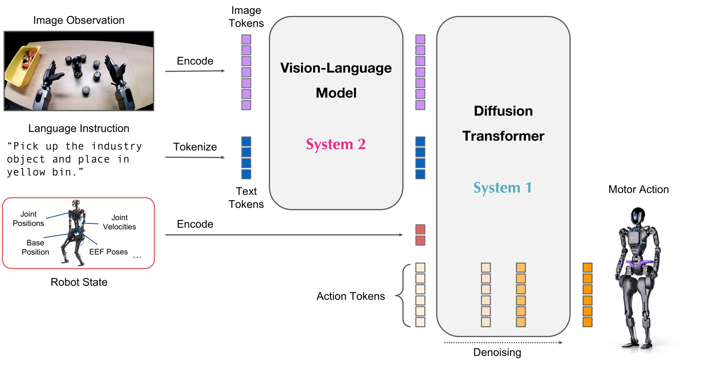
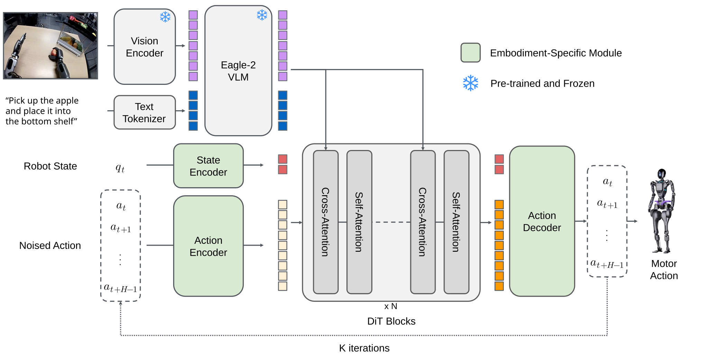
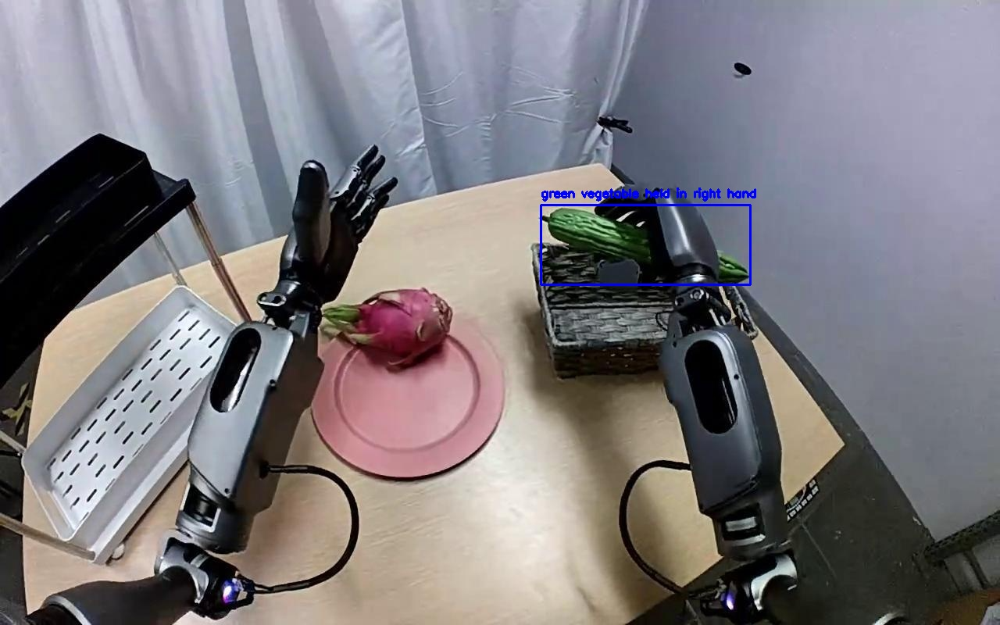
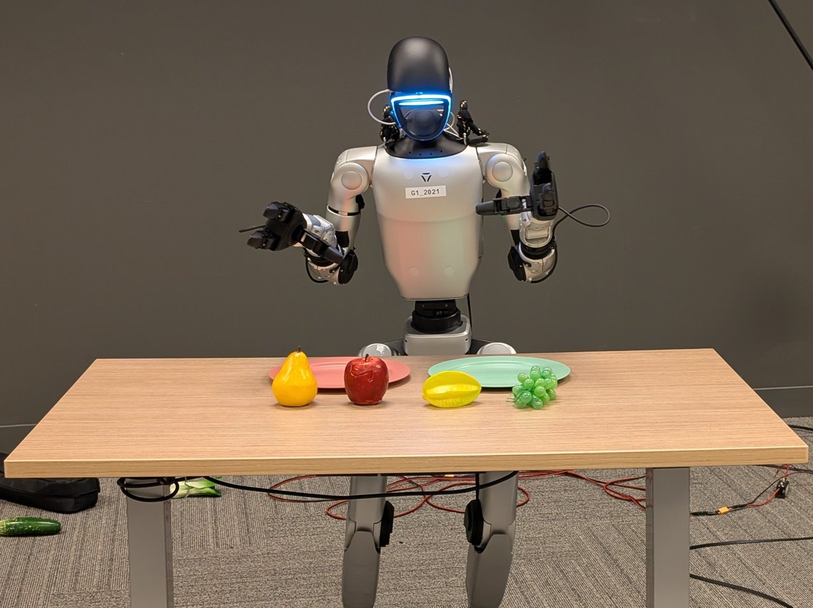
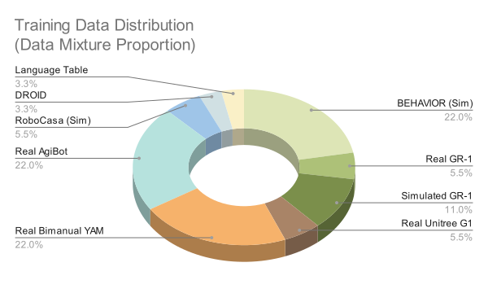

# 12 · GR00T 版本演进专题：N1.5 → N1.6 → N1.7 的逻辑与原理

> 本文是课程扩充参考（与第 11 章并列），专门梳理 GR00T N1 系列三代微调代际
> （N1.5 / N1.6 / N1.7）的**架构改动、数据策略、训练配方与部署链路**的演进脉络，
> 并回答一个核心问题：**每一代到底在解决上一代的什么矛盾？**
>
> 主要资料来源（正文中逐节标注）：
> - GR00T N1 白皮书：<https://arxiv.org/abs/2503.14734>
> - GEAR 博客《GR00T N1.5》（2025-06-11）：<https://research.nvidia.com/labs/gear/gr00t-n1_5/>
> - GEAR 博客《GR00T N1.6》（2025-12-15）：<https://research.nvidia.com/labs/gear/gr00t-n1_6/>
> - N1.6 模型卡：<https://huggingface.co/nvidia/GR00T-N1.6-3B>（本文另附**本地已下载权重的 config.json 实测值**）
> - N1.7 GA 说明（GitHub main README "What's New in GR00T N1.7"）：<https://github.com/NVIDIA/Isaac-GR00T>
> - N1.7 真机模型卡：<https://huggingface.co/nvidia/GR00T-N1.7-ApplePnP-V1>
> - 第 11 章《NVIDIA G1 端到端部署教程精读》（N1.7 生态全记录）：本目录 `11_扩充参考_NVIDIA_G1端到端部署教程精读.md`
>
> 课程基准不变：教学主线仍以 **N1.5**（本仓库 `gr00t_n1_5`）展开；本文属于"往回看懂 N1.5、
> 往前看懂生态"的对照材料。

---

## 0. 三代共用的骨架：先看没变的东西

从 N1 到 N1.7，GR00T 的基本范式从未改变——这也是本课程强调"原理可迁移"的原因
（第 01/04/05/06 章讲的正是这个不变骨架）：

```
RGB 多视角帧 ──► 视觉编码器(SigLIP 系)  ┐
语言指令     ──► VLM 语言塔(Eagle/Cosmos)├──► VLM 特征 ──┐
                                            │             │ cross-attn
机器人状态 q ──► 按 embodiment-ID 索引的 MLP ─┤      Flow-Matching DiT
                                            │      (AdaLN 注入去噪步, 迭代去噪)
语言/embodiment 元数据 ────────────────────┘             │
                                          动作 chunk ◄── MLP 解码(每 embodiment 一个)
```

**三代不变的固定件**（对照 N1.6 模型卡与 N1.7 模型卡的 Architecture 段，几乎逐字相同）：

1. **双系统分工**：VLM = System 2（慢感知/推理），flow-matching DiT = System 1（快动作生成），端到端联合训练（N1 白皮书原文即如此定义：<https://arxiv.org/abs/2503.14734>）；
2. **动作头永远是 flow matching / rectified-flow DiT**（引 Rectified Flow 与 π0：arXiv 2209.03003、2410.24164），前向加噪学速度场、推理从噪声迭代重建动作（本课程第 06 章）；
3. **变长状态用 embodiment 索引 MLP + 补零到配置的最大维度**；每 embodiment 独立的动作编解码 MLP（本课程第 03 章 embodiment 机制）；
4. **多视角图像 token 拼接成一条序列，后接语言 token** 送入 DiT cross-attention（第 04 章）；
5. **AdaLN 注入扩散步条件**（第 04 章 DiT 细节）；
6. **跨本体（cross-embodiment）预训练 + 小数据后训练（post-training）**的配方不变；
7. **数据三源混合**：真机遥操 + 仿真/合成数据 + 人类视频，比例逐代调整（下文演进主线之一）。

**演进只发生在四个旋钮上**：①语言塔选型与冻结策略；②动作头容量；③动作空间参数化；
④数据配方与部署链路。下面按代际逐个拆。


*图：N1.6/N1.7 模型卡共用的官方架构示意——图像 token / 文本 token 进入 VLM（System 2），机器人状态（关节位置/速度、底座位姿、EEF 位姿）直接编码进动作侧，动作 token 在 Diffusion Transformer（System 1）中迭代去噪输出电机动作（原文：Isaac-GR00T 仓库 `media/model-architecture.png`，本地 `images/ch12/`，下同）*


---

## 1. 起点：GR00T N1（2025-03，白皮书）

> 原文：<https://arxiv.org/abs/2503.14734>（摘要已核）

- 首次提出上文的"双系统 VLA"结构：Eagle VLM（System 2）+ flow-matching DiT（System 1），紧耦合、联合训练；
- 训练数据 = 真机轨迹 + 人类视频 + 合成数据（Isaac GR00T-Mimic/Blueprint 管线）的异构混合；


*图：N1 白皮书的数据金字塔——底层海量 Web 数据与人类视频（Ego4D/Common Crawl/Reddit/Wikipedia/EPIC-KITCHENS），中层仿真合成数据，顶层稀缺的真机数据；越往上越贵、越靠近部署分布。原文：[arXiv:2503.14734](https://arxiv.org/abs/2503.14734)*
- 在多个仿真本体上超过 SOTA 模仿学习基线；在 Fourier GR-1 人形上实现语言条件双臂操作；
- 遗留问题（由后两代分别回答）：**语言跟随不可靠**、**新物体/新动词泛化差**、**动作空间用绝对量、跨本体难共享先验**、**只有研究级推理代码、没有部署链路**。

---

## 2. N1 → N1.5：治好"听不懂话"和"换物体就废"

> 原文：<https://research.nvidia.com/labs/gear/gr00t-n1_5/>（本目录代码 `Isaac-GR00T/gr00t/model/gr00t_n1.py`、`model_type="gr00t_n1_5"` 即该代实现，本课程第 04/05 章逐行讲过）

N1.5 的主题词是**语言跟随 + 泛化**，三个改动全部指向这两点：

### 2.1 架构改动（原文"Model and Data Updates"）

| 改动 | 内容 | 动机与效果（原文数据） |
|---|---|---|
| **VLM 全程冻结** | 预训练和微调都冻结 VLM | 保住预训练 VLM 的语言/接地能力不被机器人小数据破坏 |
| **简化 adapter** | 视觉编码器→LLM 的 adapter MLP 简化，并给送入 LLM 的**视觉与文本 token 各加一层 LayerNorm** | "极大地改善了语言跟随与泛化"。从零训练对比：Language Table 52.8%→**93.2%**，Sim GR-1 Language 36.4%→**54.4%** |
| **换更强的接地 VLM** | 从 Eagle 2.5 起步、面向 grounding/物理理解调优 | GR-1 grounding IoU 40.4（Qwen2.5-VL-3B 仅 35.5）；RefCOCOg-val 89.6（vs 85.2） |
| **加 FLARE 世界建模损失** | 不生成未来帧，而是把内部表征**对齐到目标未来嵌入**（FLARE 项目）；损失系数 0.2，预训练/后训练都加 | 提升策略本身 + **解锁"从人类视频学习"**：10 个从未见过的物体，0-shot 从 N1 的 0% → 15%；用含这些物体的人类视频 FLARE 共训后到 **55%** |

对照本仓库代码：这三条分别落在 backbone 冻结逻辑（第 05 章《冻结 Backbone_Eagle》）、
`projector`/adapter 结构与 `select_layer=16` 特征抽层（第 04 章）。


*图：N1.5 官方博客架构图（Eagle VLM → DiT 动作头，冻结策略与 adapter 位置可见）*


*图：N1.5 VLM 接地能力示例（带指称表达的标注与模型输出，原文 n1_5 博客图）*


### 2.2 数据改动

- 预训练混合：内部 GR-1 真机 + OpenXE + 仿真 GR-1（DexMG）+ **DreamGen 神经轨迹**（用视频世界模型"做梦"生成新动词数据）+ AgiBot-Beta；


*图：N1.5 博客公开的预训练数据混合分布（原文 n1_5 博客 `train_data_mix.svg`）*

- **DreamGen 效果**（原文）：12 个全新动词任务，N1 只有 13.1%（基本只会重复 pick-and-place），N1.5 达 **38.3%**——泛化到了"没采过遥操数据的新行为"（但仍是在 DreamGen 轨迹上显式训练过的，非完全 zero-shot）。

### 2.3 训练配方（原文）

250K steps、1K H100、global batch 16384，AdamW + cosine（warmup 0.05），FLARE 系数 0.2。

### 2.4 端到端结果（原文实验表）

- 真机 GR-1 语言跟随任务：语言跟随率 46.6%→**93.3%**，总成功率 43.3%→**83.0%**（两模型都能"拿起某个水果"，差别全在**是否按指令选对物体**——语言跟随是唯一的瓶颈）；
- Unitree G1 后训练（1K 遥操演示）：N1 44.0% → N1.5 **98.8%**（已见物体）；5 种全新物体仍有 **84.2%**。


*图：G1 后训练评估场景——桌上目标物+干扰物，指令指定其一放盘（原文 n1_5 博客图）*


*图：§2.1 FLARE 新物体泛化实验所用的 10 个预训练未见物体（原文 n1_5 博客图）*


### 2.5 小结：N1.5 留下的新矛盾

冻结 VLM + 小容量 DiT 保住了语言，但**动作容量与控制精度被牺牲**（DiT 仅 16 层、
action_horizon 16、状态/动作维 29 的上限），且动作仍是**绝对关节角/EEF**——
双臂、行走操作（loco-manipulation）、人类数据共享都推不动。这就是 N1.6 的切入点。

---

## 3. N1.5 → N1.6：加容量、换动作空间、灌真机数据

> 原文（研究博客）：<https://research.nvidia.com/labs/gear/gr00t-n1_6/>（2025-12-15）
> 原文（模型卡）：<https://huggingface.co/nvidia/GR00T-N1.6-3B>
> **实测**：本地已下载权重 `/home/ft/wzong/models/GR00T-N1.6-3B/config.json` 关键字段：
> `model_type=Gr00tN1d6`、`backbone_model_type=eagle`、`action_horizon=50`、
> `select_layer=16`、`tune_top_llm_layers=4`、`backbone_embedding_dim=2048`——与博客逐项互证。

N1.6 的主题词是**控制能力升级**：博客开头即说在仿真操作基准与真机双臂 YAM、AgiBot Genie-1、
Unitree G1 上全面超过 N1.5，并预期"用户后训练表现也会更好"。

### 3.1 架构改动（博客原文四条 + 模型卡两条）

| # | 改动 | 原理分析 |
|---|---|---|
| 1 | **基座 VLM 换成 NVIDIA 内部 Cosmos-2B VLM 变体**：支持可变分辨率、**按原始长宽比编码图像不补零**；除通用视觉语言任务外还在"下一动作预测"等**具身推理任务**上训练过 | 补零会浪费 token 并引入伪边缘；具身推理预训练让 VLM 特征天生更接近动作分布。注意：**开源 GA 权重实际加载的是 vendored `nvidia/Eagle-Block2A-2B-v2`**（N1.7 README 的 diff 列表明确写出，且本地 config `backbone_model_type=eagle` 佐证）——即研究版内部变体与开源发布版在这里有差异，读博客时要留意 |
| 2 | **DiT 从 16 层加到 32 层（2×）** | 直接回应 N1.5 的动作容量瓶颈；代价是推理变慢（N1.7 又减回去了，见 §4） |
| 3 | **删掉 N1.5 的 post-VLM 4 层 transformer adapter；改为预训练时解冻 VLM 顶部 4 层**（本地 config `tune_top_llm_layers=4` 实证） | 冻结光谱的再平衡：N1.5 靠"全冻+adapter"保语言，N1.6 判断顶 4 层可安全微调以对齐动作特征，省掉 adapter 的算力/延迟，也少一个信息瓶颈 |
| 4 | **多数本体改为预测"状态相对动作 chunk"（relative action），不再输出绝对关节角/EEF** | 相对动作与起始位姿解耦 → 平滑、准；但博客同时警告：**小数据集下相对动作误差会累积、削弱纠错能力**——第一次把动作空间的 trade-off 写进官方文档 |
| 5 | （模型卡）VLM 特征→DiT 之间的 **MLP connector 改版**；并**联合 flow-matching 与世界建模目标**训练 | 世界建模目标从 N1.5 的 FLARE 损失演化而来，此处已内化为训练目标的一部分 |

### 3.2 数据改动（博客原文）

在 N1.5 混合之上**新增数千小时遥操真机数据**：

- 双臂 **YAM** 机械臂（插 GPU 导轨、码碗架、叠 T 恤、左右手交接方块）；
- **AgiBot Genie-1**（叠衣、收餐具、装水果袋）；
- 仿真 **Galaxea R1 Pro × BEHAVIOR** 套件；
- **Unitree G1 全身行走操作（whole-body loco-manipulation）**（放杯子进架、从购物车取物、开抽屉捡橡皮、把鞋装箱……）。

数据权重表以"训练数据加权分布图"形式公开（博客 Figure）。


*图：N1.6 博客公开的预训练数据加权分布（新增 YAM/AgiBot/G1 全身/仿真 Galaxea 占比可见；原文 `training_data_distribution_v3.svg`）*
对比 N1.5（以 GR-1 单臂/双臂
+ OpenX + 合成数据为主），N1.6 的重心明显转向**大规模真机双臂 + 全身控制**。

### 3.3 训练与后训练配方（博客 Discussion 一节，价值极高）

- 预训练：300K steps，global batch 16384（N1.5 是 250K steps）；后训练：任务小数据集
  **10K–30K steps、batch ≤1K**；
- **相对动作设为默认动作空间**（见上 trade-off）；
- **归一化统计量的选择规则**：任务分布 ≈ 预训练分布 → 用**预训练统计量**；不同 → 用
  **后训练统计量**，否则欠拟合。（对应本课程第 02 章"模型活在标准空间"——统计量选错=标准空间错位）；
- N1.6 **收敛更快**→ 更容易过拟合：对策是**更强的状态正则（state dropout）、更多数据增强、与预训练数据共训（co-training）**；
- 模型实测不佳时推荐 **DAgger**（人机共采纠错数据再训）；
- **RTC（Real-Time Chunking，训练+推理两侧都用）**：异步 rollout 时把"上一 chunk 未执行完的动作"作为约束拼进当前去噪，提高流畅性与鲁棒性——在 G1 与双臂 YAM 实验中使用。**这正是本课程第 01/06 章"滑动窗口衔接 chunk"问题的官方正式解法**；
- 仍未解决：**多任务语言跟随与 OOD 任务泛化**——更细的子任务标注有帮助，但远谈不上稳健，"will be a continuous effort"。

---

## 4. N1.6 → N1.7：换开源生态语言塔、人类视频先验、全身控制与部署闭环

> 原文（GA 公告 + "What's New / Detailed changes from N1.6"）：<https://github.com/NVIDIA/Isaac-GR00T>（main 分支 README）
> 原文（真机模型卡）：<https://huggingface.co/nvidia/GR00T-N1.7-ApplePnP-V1>
> 原文（N1.7 生态使用全流程）：本目录第 11 章（25 页 E2E 教程精读）

N1.7 的主题词是**"研究模型 → 产品化闭环"**：性能与 N1.6 相当（官方原话 comparable
performance），但换语言塔、吃人类视频、许可证放开、部署链路补齐。

### 4.1 模型栈改动（README "Detailed changes from N1.6" 逐条，均为代码级事实）

| 项 | N1.6 | N1.7 | 解读 |
|---|---|---|---|
| 模型包 | `gr00t_n1d6` | `gr00t_n1d7` | 代码路径/processor 元数据整体迁移命名空间 |
| **VLM 骨干** | vendored Eagle（Eagle-Block2A-2B-v2） | **`nvidia/Cosmos-Reason2-2B`（Qwen3-VL 架构）**，gated 模型 | 换入开源可复用的 Qwen3-VL 生态；同为"可变分辨率、原始长宽比不补零"（该能力 N1.6 博客已引入，N1.7 落到开源权重）；首次加载需 HF 授权（`GatedRepoError`） |
| transformers | 4.51.3 | 4.57.3 | 跟随 Qwen3-VL 栈 |
| `select_layer` | 16 | 代码默认 **12**；基座 ckpt 实测 **16**（§6.1 修订） | 若真取 12 层，逻辑是 Qwen3-VL 深层更专门化、动作对齐点更浅；但发布基座并未改 |
| `tune_top_llm_layers` | 4 | **0** | **回到"完全冻结 VLM"**——N1.5 哲学的回归：后训练不再微调语言塔，防遗忘优先 |
| `load_bf16` | ckpt true | 代码默认 false；基座 ckpt 实测 **true**（§6.1 修订） | NPU/融合算子的 dtype 假设以 ckpt 为准，勿按差异清单改成 bf16-off |
| state/action 维度上限 | ckpt 128/128（GR1 运行时 29 维） | ckpt **132/132** | 为全身控制（腿+手+灵巧手）扩容；也是第 11 章 G1 全身 embodiment 的前提（N1.5 ckpt 为 64/32，§6.1） |
| `action_horizon`（代码默认） | 16 | **40** | ⚠️ 注意分层：N1.6 **checkpoint** config 实测 50（见 §3 实测），N1.7 代码默认 40；第 11 章 G1 真机部署的执行窗口默认 16。**预测 horizon ≠ 执行 horizon**：N1.7 把 rollout 参数从 `--action-horizon` 改名为 `--execution-horizon`，正是为了说清"每次调模型执行多少步" |
| DiT 层数 | ckpt 32 | 代码默认 **16**；基座 ckpt 实测 **32**（§6.1 修订） | "动作头减半"暂未发生在发布基座上；边缘部署收益目前靠 TRT 全管线而非减层 |

### 4.2 训练与数据改动（README "What's New" 两条头条）

1. **相对 EEF 动作空间全本体共享**：所有机器人+人类 embodiment 统一用"当前位姿的增量"
   表示动作。这是对 N1.6 "relative action" 的收口——N1.6 说"多数本体用相对动作"，
   N1.7 把它升格为**跨本体通用语言**；
2. **20K 小时 EgoScale 人类视频进入预训练**：因为相对 EEF 表示在人与机器人数据上**一致**，
   操作先验可从人类视频直接迁移到机器人控制。这是 N1.5 FLARE"从人类视频学习"路线的
   规模化终点：FLARE 证明了可行性（第 2.1 节 55% 实验）→ N1.6 把世界建模内化进训练目标 →
   N1.7 用统一动作表示把人类视频直接喂进预训练。**三代在这条线上的因果链非常完整。**

### 4.3 全身控制与生态（README SONIC 一节 + LeRobot 一节）

- **GEAR-SONIC 全身控制**（<https://github.com/NVlabs/GR00T-WholeBodyControl>）：
  `UNITREE_G1_SONIC` embodiment 下，VLA 只输出**紧凑的隐式动作 token**，由学习式全身控制器
  解码为腿/臂/手全关节指令——单策略端到端产出"语言条件的操作+行走"。VLA 与控制器的
  分工从 N1.7 开始进入"分层动作表示"阶段（对比：第 11 章 E2E 教程用的 decoupled WBC +
  `UNITREE_G1` tag 是另一条兼容路线）；
- **数据集规范**：LeRobot v2 + 追加 `meta/modality.json` 描述 state/action/video 结构——
  本课程第 02/03 章 modality config 机制的标准化定型；支持多数据集路径 + `ds_weights_alpha` 混合权重；
- **LeRobot 原生集成**：LeRobot 侧以 `groot` policy type 训练/评估/rollout；
- **部署**：全管线 **ONNX + TensorRT 导出**（即第 11 章 LEAPP 五段 bundle 的通用化），
  多平台（dGPU/Jetson Thor/Orin/DGX Spark）安装矩阵与一致性加固；
- **许可证翻转**：N1.6 = NVIDIA 单向**非商业**许可（模型卡链接 OneWay-Noncommercial），
  N1.7 = **Apache 2.0 / NVIDIA Open Model Agreement，可全商用**——开源生态意义的分量不亚于技术改动。

---

## 5. 演进逻辑总纲：五条主线看懂三代

### 主线① 语言塔：持续换更强的开源 VLM，冻结光谱来回摆

```
N1     Eagle-2（VLM 与 DiT 联合训练）
N1.5   Eagle-2.5 接地调优版 → 全程冻结 + 简化 adapter + 双向 LayerNorm   （保语言，防遗忘）
N1.6   内部 Cosmos-2B 变体（开源版权重=vendored Eagle-Block2A-2B-v2）
       → 删 adapter、解冻顶 4 层                                        （对齐动作特征，省瓶颈）
N1.7   Cosmos-Reason2-2B（Qwen3-VL 架构，gated）
       → 再回全冻（tune_top_llm_layers=0）；取特征层"12"只是代码默认，
         已发布 3B 基座 ckpt 实测仍 16（见 §6.1，2026-09-18 修订）      （防遗忘回归 + 换开源生态）
```

摆动的本质是同一对矛盾的两次校正：**VLM 表征越贴近动作分布越好训 vs. 越微调越容易丢语言/接地能力**。
N1.5 用"冻死+对齐层"解决，N1.6 试探"解冻顶层"，N1.7 拿到更强的推理型 VLM 后发现
"不动它、只换抽头位置"更划算。工程启示：**取哪一层特征（select_layer）与冻不冻同样重要**。

### 主线② 动作头容量：16 → 32 →（宣称 16，实测基座仍 32）

DiT 加到 32 层（N1.6）换控制精度；官方 N1.7 差异清单宣称砍回 16 层，把延迟预算让给
边缘部署（ONNX/TRT/Thor）。**但 2026-09-18 对已发布 GR00T-N1.7-3B 基座 config.json 的
实测是 32 层**（§6.1）——"16 层"只是 n1.7 代码里新建/微调模板的默认值，基座权重没有瘦身。
所以这条主线目前只走到"16 → 32 → 32(发布) + 16(模板)"。
**动作头容量从来不是独立超参，它是"精度需求 × 部署延迟预算"的解——而"宣称值"与
"发布权重值"还隔着一层，永远以 ckpt config 为准。**

### 主线③ 动作空间：绝对 → 相对（多数）→ 相对 EEF 一统人机

- N1/N1.5：绝对关节角/EEF——简单直接、无误差累积，但跨本体、跨初始位姿难迁移；
- N1.6：多数本体相对动作——更平滑更准，官方首次记录"小数据误差累积"副作用；
- N1.7：相对 EEF 成为**人与机器人共享的动作语言**——直接解锁 20K 小时人类视频预训练。

一步比一步激进，但每一步的代价（误差累积、表示能力上限）都被官方文档明确记录。
配置自己的机器人时（第 11 章 `finetune_new_embodiment` 指引），这是第一决策点。

### 主线④ 数据引擎：真机 → 合成 → 人类视频，杠杆逐级放大

```
N1     真机遥操 + OpenX + Isaac 合成管线(IsaacLab/Blueprint)
N1.5   + DreamGen 神经轨迹(世界模型造新动词) + FLARE 人类视频对齐(表征层借力)
N1.6   + 数千小时真机遥操(YAM/AgiBot/G1全身)——真机侧加杠杆
N1.7   + 20K 小时 EgoScale 人类视频(端到端预训练)——人类数据侧加到最大杠杆
```

杠杆排序：真机最贵最真 < 仿真/神经合成便宜但有效域窄 < 人类视频无限但需要
**统一动作表示**这根传动轴。三代刚好把"造传动轴（相对EEF）→ 挂上飞轮（人类视频）"走完。

### 主线⑤ 部署与生态：研究代码 → 产品闭环

| 维度 | N1.5（本课程） | N1.6 | N1.7 |
|---|---|---|---|
| 入口 | `scripts/inference_service.py`、`gr00t_policy.py` | 同左（n1d6 分支） | `run_gr00t_server.py`、`launch_finetune.py`、`--execution-horizon` |
| 依赖管理 | pip + conda(py3.10) | 同左 | 官方推荐 **uv** + 平台矩阵（x86 仍是 py3.10.\*/CUDA12.8，py3.12 仅 Thor/Spark/CUDA13）；实测不装 uv、用 conda 克隆 + PYTHONPATH 也能完整复现（§6.3） |
| 数据格式 | 自有格式/LeRobot 过渡 | LeRobot v2 + modality.json 定型 | 同左 + 多数据集混合权重 |
| 部署 | PyTorch 推理服务 | 同左 + 内部 RTC | **全管线 ONNX/TensorRT**（LEAPP 分段 bundle）+ Triton + Isaac ROS 栈 |
| 推理时技术 | 滑窗执行 chunk（课程第 01 章） | **RTC**（训练+推理） | RTC + 异步服务加固 |
| 许可证 | Apache 2.0 | **非商业**单向许可 | **Apache 2.0 / Open Model（可商用）** |
| 生态 | 独立仓库 | 独立仓库 | 独立仓库 + **LeRobot `groot` policy** 双入口 |

一个耐人寻味的细节：N1.6 是许可证最收紧、架构最"研究"的一代——**性能巅峰代往往先闭源试水，
下一世代再产品化开源**（N1.7 官方自述性能"comparable to N1.6"但全面放开），节奏与
LLM 界的 open-weight 发布策略如出一辙。

---

## 6. 实机对照：同一台 L20 上看三代

> 本节是全文的"对实"修订：上一章讲的是官方宣称的演进逻辑，本节把三代权重拉到**同一台
> NVIDIA L20（48 GB）**上逐配置、逐入口对照。完整命令、报错原文与坑清单在第 13 章
> （`13_L20实战_端到端推理执行手册.md`），本节只讲"对照说明了什么"。
> 一句话主线：**代码默认值 ≠ 发布权重值，一切以 ckpt 的 config.json 为准**——
> 这正是第 02 章"推理契约"纪律的又一次落地。

### 6.1 三代 ckpt 配置实测对照（直接读本地权重）

| 配置项 | N1.5 ckpt | N1.6 ckpt | N1.7 ckpt（tag n1.7-release） |
|---|---|---|---|
| `model_type` / 架构类 | `GR00T_N1_5` | `Gr00tN1d6` | `Gr00tN1d7` |
| 骨干来源 | config 无 `model_name`（Eagle 写死在代码） | `nvidia/Eagle-Block2A-2B-v2` | `nvidia/Cosmos-Reason2-2B`（gated） |
| DiT `num_layers` | 16 | 32 | **32**（代码默认 16） |
| `select_layer` | 12 | 16 | **16**（代码默认 12） |
| `action_horizon` | 16 | 50 | 40 |
| `max_state_dim` / `max_action_dim` | 64 / 32 | 128 / 128 | 132 / 132 |
| `use_relative_action` | 无此字段（绝对动作） | True | config 无（相对性移到 embodiment tag） |
| `load_bf16` | 无此字段 | True | **True**（代码默认 False） |
| 张量数 / ckpt 体积 | 899 / 5.45 GB | 1106 / 6.57 GB | 1031 / 6.91 GB |

三处"宣称 vs 实测"的修正（正文 §4.1、主线①②已同步改写，此处留档）：

1. **DiT "动作头减层到 16"没有发生**：n1.7 代码模板默认 16，但发布基座 ckpt 实测 32。
2. **`select_layer` 16→12 没有发生**：README 差异清单如此写，发布基座仍是 16。
3. **bf16**：差异清单说"默认 bf16"，代码默认确实是 False，但 ckpt config 是 True——
   跑官方权重实际就是 bf16 路径。groot_ops 融合算子的 dtype 假设（统一编码
   0=fp16/1=bf16/2=fp32）必须以 ckpt config 为准，不能按 README 差异清单反推。

证据强度注记：n1.7 ckpt config 里还有 `tune_llm/tune_visual=True`，属**训练期字段**，
不能反推推理期行为，故未列入上表解读。

### 6.2 backbone 的两种形态：vendored 单权重集 vs gated 双 repo

- N1.5 / N1.6（开源版）：backbone 权重直接并入大模型仓库，**一个 snapshot 自包含**，
  下载即用。
- N1.7：backbone `Cosmos-Reason2-2B` 是**独立 gated 仓库**（镜像上 403，正式流程需
  HF 授权）——§4.1"换开源生态语言塔"带来的新部署负担：权重从一套变两套。
- 实测发现的关键事实：把 backbone 的**结构**摆好后，发布 ckpt 的 state_dict
  **恰好覆盖全部 1031 个 key（0 missing / 0 extra，含 494 个 backbone 张量）**——
  即最终推理权重里骨干的官方预训练权重并未被单独使用。因此本地用"占位
  safetensors + ckpt 全量覆盖"即可等价跑通三代同机对照。
  （此为受限网络下的等价性实测，非官方推荐流程；有 HF 授权仍应走官方双仓库。）

### 6.3 入口脚本与环境依赖：三代实测映射表

| 项 | N1.5 | N1.6 | N1.7 |
|---|---|---|---|
| 开环评测入口 | `scripts/eval_policy.py` | `gr00t/eval/open_loop_eval.py`（旧入口已不存在） | 同 N1.6 |
| 推理服务 | `scripts/inference_service.py --server` | `scripts/deployment/run_gr00t_server.py` | 同 N1.6 |
| 最小自跑脚本 | 无 standalone | `standalone_inference_script.py`（pytorch / tensorrt 两模式） | 同脚本，`--inference-mode` 增至 **3 种**（+`trt_full_pipeline`，--help 实测） |
| conda 环境 | `gr00t` | 复用同一 env | 4.51.3 无 `Qwen3VLForConditionalGeneration`（实测 ImportError）→ 克隆 `gr00t_n17`（transformers 4.57.3） |
| uv 必需？ | 不适用 | 不适用 | 官方推荐 uv；实测 conda 克隆 + `PYTHONPATH=$PWD` 即可完整复现（x86 仍是 py3.10.\*，py3.12 仅 Thor/Spark） |
| 视频解码 | decord 回退 | decord 回退 | 必须 `--video-backend decord`：torchcodec 0.11 与 torch 2.9 ABI 不匹配（缺 `torch_dtype_float4_e2m1fn_x2`），aarch64 无更旧 wheel |
| e2e 实测（同机 L20） | MSE 0.0391（14 维）/ 0.569 s | MSE 1.178（29 维）/ 0.442 s | MSE 0.0199（droid 17 维，零样本）/ 1.71 s（修复后；修复前 40.28 s，见 §6.6） |

服务冷启动实测：N1.5 约 1 分钟、N1.6 约 50 s 到 `Server is ready`——权重 shard 本身
只占几秒，大头在 config/processor 组装（第 13 章 §2/§4）。

### 6.4 动作空间演进：落到实机上的形态

- **N1.5（绝对动作，关节空间）**：GR1 在 32 维上限里实际用 29 维；`eval_policy`
  arms_only 14 维口径开环 MSE **0.0391**、0.569 s/步（第 13 章 §3 实测）。
- **N1.6（相对动作进入模型 config）**：GR1 仍是 29 维，但语义换成
  `use_relative_action=True`；实测开环 MSE 到了 **~1.2 量级**（standalone 1.178 /
  open_loop_eval 1.214 / ZMQ 1.358，第 13 章 §4）。**这两代 MSE 不可直接横比**——
  维度口径（14 vs 29）、动作语义（绝对 vs 相对）、评测子集都不同。想跨代比性能，
  必须先在 unnormalized 同一空间、同一子集、同一执行口径下重测。这正是第 02 章
  "MSE 数字必须带口径"纪律的现实版案例。
- **N1.7（相对 EEF 一统人机）**：维度上限扩到 132/132；相对性不再是模型 config
  字段，而是绑进 embodiment tag（`OXE_DROID_RELATIVE_EEF_RELATIVE_JOINT`）。官方
  零样本演示（`demo_data/droid_sample`）即靠该 tag 免微调。实机首测（同机 L20，
  `processor_config.json` 里该 tag 逐通道声明 `eef_9d=RELATIVE/XYZ_ROT6D`、
  `gripper=ABSOLUTE`、`joint_position=RELATIVE`，实测输出 17 维 = 9+1+7）：
  两条 droid 轨迹 × 25 步，unnormalized MSE **0.0033 / 0.0366，均值 0.0199**，
  延迟 **1.71 s/步**（第 13 章 §5）。**这个 0.0199 与 N1.6 的 ~1.2 不可横比**
  ——维度集（17 vs 29）、数据集（droid vs GR1 demo）、微调语境（官方零样本演示 vs
  拿 GR1 demo 硬喂）全不同；同理与 N1.5 的 0.0391 也不可横比。三代的正确读法是
  "各自口径下都跟得住 GT"，而不是"数字逐代变小"。

### 6.5 部署宣称落地了多少

- **全管线 TRT**：不是一句口号——`--inference-mode trt_full_pipeline` 在本地代码
  --help 里真实存在；ckpt 自带 README 给出**分平台逐段计时表**，其中就有本机同款
  L20：PyTorch Eager 140.3 ms / 7.1 Hz → torch.compile 73.1 ms → **TRT 全管线
  42.8 ms / 23.3 Hz（3.28×）**；Orin 因 TRT 10.3 不支持骨干引擎而降级为 DiT-only
  TRT（216.5 ms / 4.6 Hz）。注意该表是官方口径（其输入分辨率/horizon 与第 13 章
  自测的 N1.6 0.442 s/步 条件不同，不可直接互比），价值在于官方首次公开了
  **分段延迟构成**——正好对应第 11 章 §3.7 的 ONNX 五段切分与 groot_ops 融合边界。
- **平台矩阵属实**：x86 CUDA12.8/py3.10.\*、Orin 12.6、Thor/Spark CUDA13/py3.12；
  "py3.12"对 x86 并不适用（常见误读）。
- **容量换延迟的实机代价**：N1.5→N1.6 同机同法，ZMQ 往返 0.596 s → 1.358 s
  （第 13 章 §6 总表）——主线②"DiT 16→32 层 + horizon 16→50"的容量提升，
  在推理侧是逐毫秒支付的。

### 6.6 一页小结

其中最后一行背后是一次完整的环境层事故（第 13 章 §5.4）：N1.7 在同机上首跑 **40.28 s/步**，
分段计时把它关进 `model.get_action()`，栈采样指向 `Qwen3VLVisionPatchEmbed`，根因是
transformers 4.57.3 把 `pixel_values` 重排成 `[1024,3,2,16,16]`（batch=1024、空间 1×1 的
退化 Conv3d）在本机 aarch64 + torch 2.9 + cu128 上落进病态实现；换成等价的
`F.linear`（kernel==stride ⇒ 每 patch 一次线性映射，输入/权重必须同序展平）后
**1.71 s/步（24×）**，端到端 MSE 与修复前一致（0.019936 vs 0.019938）。
教训：**跨代移植的瓶颈常常不在"模型变了"，而在"模型 × 这套库/这台机器"的交界面上**，
只有实测分段计时能把它抓出来。

| 实机教训 | 对应课程资产 |
|---|---|
| 代码默认值 ≠ ckpt 值，config 要逐字段拆开对 | 第 02 章 推理契约 |
| MSE/延迟必须绑定 语义+口径+子集+硬件 才可引用 | 第 02 章 归一化 / 第 13 章 测法 |
| 换 gated 开源骨干 = 权重双仓库 + 授权链路，是新的部署风险点 | 第 10、13 章 下载渠道与环境 |
| 模型卡/README 也是"宣称"来源；官方 TRT 分段表藏在 ckpt 目录里 | 第 11 章 读文档方法论 |
| 跨代性能对比先统一口径，否则数字没有意义 | 第 13 章 数字记录规范 |
| 环境层灾难（退化算子形状 × cuDNN/宿主架构）也只能靠分段计时 + 栈采样实测抓 | 第 13 章 §5.4 / `tools/n17_arm_patch.py` |
| 等价改写要"层内误差 + 端到端复跑"双重验证，且注意展平顺序 | 第 13 章 §5.4 |

## 7. 对本课程（N1.5 基准）与 groot_ops 的实际意义

1. **哪些代码会随版本升级而变**（若未来迁移基准）：模型包名（`gr00t/model/gr00t_n1.py`
   `model_type="gr00t_n1_5"` → `gr00t_n1d6` → `gr00t_n1d7`）、backbone 加载
   （Eagle → Qwen3-VL/gated）、`action_horizon`（16→50(ckpt)/40(code)→40）、
   state/action 维度（29→132）、bf16 默认、服务/微调脚本更名。
   第 11 章 §7.1 的版本表与本文互为校订（本文所有数字均对过一手资料或本地 config）。
2. **哪些原理永远不用重学**（课程资产）：归一化双向变换、embodiment MLP、
   flow-matching 去噪、cross-attention 注入、chunk 滑窗——三代逐字不变（§0）。
3. **groot_ops/NPU 视角的三个直接抓手**：
   - N1.7 官方 ONNX 五段切分（preprocess_state / preprocess_video / backbone /
     action_head / decode_action）是融合算子边界设计的"官方参考答案"（第 11 章 §3.7）；
   - DiT 层数（16↔32）、`select_layer`（16↔12）、bf16 开关在 n1.7 的 README 差异清单
     与发布 ckpt 实测间存在出入（§6.1：ckpt 实为 32/16/bf16-on）——统一 dtype 编码
     （0=fp16,1=bf16,2=fp32）与 shape 假设一律以 checkpoint config 为准；
   - N1.6 的 RTC 与 N1.7 的 execution-horizon 语义，直接对应我们在推理服务侧
     （第 07/08 章）该暴露的异步 chunk 接口。
4. **读 NVIDIA 研究博客的方法论**：研究版与开源发布版可能有实现差异（本文 §3.1#1 的
   Cosmos-2B vs Eagle-Block2A 就是实例）——**以 config.json / 代码 diff 为准**，
   博客负责讲"为什么"。

---

## 附录 A：三代关键数字总表

| 项目 | N1.5 | N1.6 | N1.7 |
|---|---|---|---|
| 发布日期 | 2025-06-11（博客） | 2025-12-15（博客） | 2026 年 GA（ApplePnP 衍生卡标注 HF 发布 2026-07-01） |
| 参数量 | 3B | 3B | 3B |
| VLM | Eagle-2.5 接地版（2.1B） | 内部 Cosmos-2B 变体（开源版=Eagle-Block2A-2B-v2） | Cosmos-Reason2-2B（Qwen3-VL） |
| VLM 冻结策略 | 全冻 + 简化 adapter + LN | 删 adapter，解冻顶 4 层 | 全冻（代码默认 tune_top_llm_layers=0）；select_layer 代码默认 12 / ckpt 实测 16（§6.1） |
| DiT 层数 | 16 | 32 | 代码默认 16 / **ckpt 实测 32**（§6.1，2026-09-18 修订） |
| 动作空间 | 绝对关节/EEF | 相对动作（多数本体，默认） | 相对 EEF（人+机统一） |
| action_horizon | 16 | ckpt 50 / code 16 | ckpt 40 / code 40（G1 真机执行窗口默认 16） |
| state/action 维度上限（ckpt） | 64 / 32 | 128 / 128 | 132 / 132（运行时按 tag 实际取维：GR1 29 维、droid 17 维，第 13 章实测） |
| 张量数 / ckpt 体积 | 899 / 5.45 GB | 1106 / 6.57 GB | 1031 / 6.91 GB（§6.1） |
| 预训练步数/batch | 250K / 16384 | 300K / 16384 | 未公布（含 20K h EgoScale 人类视频） |
| 标志性数据新增 | DreamGen、FLARE 人类视频 | 数千 h 双臂/全身真机遥操 | 20K h EgoScale 人类视频 |
| 世界建模 | FLARE 损失（系数 0.2） | 联合世界建模目标 | 具身推理型 VLM（下一动作预测） |
| 推理时增强 | chunk 滑窗 | RTC（训练+推理） | RTC + 服务加固 |
| 部署 | PyTorch 服务 | 同左 | 全管线 ONNX/TRT、Triton、Isaac ROS、LeRobot |
| 许可证 | Apache 2.0 | 非商业单向 | Apache 2.0 / Open Model 可商用 |
| 代表结果 | GR-1 语言跟随 93.3%；G1 后训练 98.8% | 双臂 YAM/AgiBot/G1 全身全面超 N1.5（博客视频实证） | 与 N1.6 comparable；官方 G1 苹果放盘 100 rollouts 68%（第 11 章 §3.8） |
| **本机 e2e 实测**（同机 L20，见第 13 章） | MSE 0.0391（14 维）/ 0.569 s | MSE 1.178（29 维）/ 0.442 s | MSE 0.0199（droid 17 维，零样本）/ 1.71 s（环境层修复后；修复前 40.28 s） |
| 权重可得性（本机） | HF 缓存完整 | HF 与 ModelScope 各一份，SHA256 逐 shard 一致 | ModelScope 完整（1031 张量）；HF 目录停在 ~190 MB；骨干 gated 需授权（§6.2 用占位结构等价跑通） |

## 附录 B：全部引用链接

- N1 白皮书：<https://arxiv.org/abs/2503.14734>
- N1.5 GEAR 博客：<https://research.nvidia.com/labs/gear/gr00t-n1_5/>
- N1.6 GEAR 博客：<https://research.nvidia.com/labs/gear/gr00t-n1_6/>
- N1.5 模型卡：<https://huggingface.co/nvidia/GR00T-N1.5-3B>
- N1.6 模型卡：<https://huggingface.co/nvidia/GR00T-N1.6-3B>（ModelScope 镜像 `nv-community/GR00T-N1.6-3B`，已核逐字节一致）
- N1.7 仓库（GA 公告与 diff 清单）：<https://github.com/NVIDIA/Isaac-GR00T>；n1d6 历史分支：<https://github.com/NVIDIA/Isaac-GR00T/tree/n1d6>
- N1.7 模型集合：<https://huggingface.co/collections/nvidia/gr00t-n17>；ApplePnP 模型卡：<https://huggingface.co/nvidia/GR00T-N1.7-ApplePnP-V1>
- N1.7 发布新闻：<https://nvidianews.nvidia.com/news/foundation-model-isaac-robotics-platform>
- GEAR-SONIC 全身控制：<https://github.com/NVlabs/GR00T-WholeBodyControl>
- LeRobot GR00T 集成：<https://github.com/huggingface/lerobot/blob/main/docs/source/groot.mdx>
- FLARE / DreamGen / π0 / Rectified Flow / Eagle-2.5：分别见 arXiv（FLARE、DreamGen 见 N1.5 博客内链；π0 arXiv:2410.24164；Rectified Flow arXiv:2209.03003；Eagle-2.5 arXiv:2504.15271）
- 第 11 章（N1.7 E2E 教程 25 页精读）：本目录 `11_扩充参考_NVIDIA_G1端到端部署教程精读.md`

*整理时间：2026-09-16；2026-09-18 修订：新增 §6 实机对照（同机 L20 三代实测），并按 ckpt
实测修正 §4.1 / 主线①② / 附录 A 中与发布权重不符的「宣称」数字。N1.7 仍在快速迭代，
数字以 GitHub main / HF 模型卡当时版本为准。*
