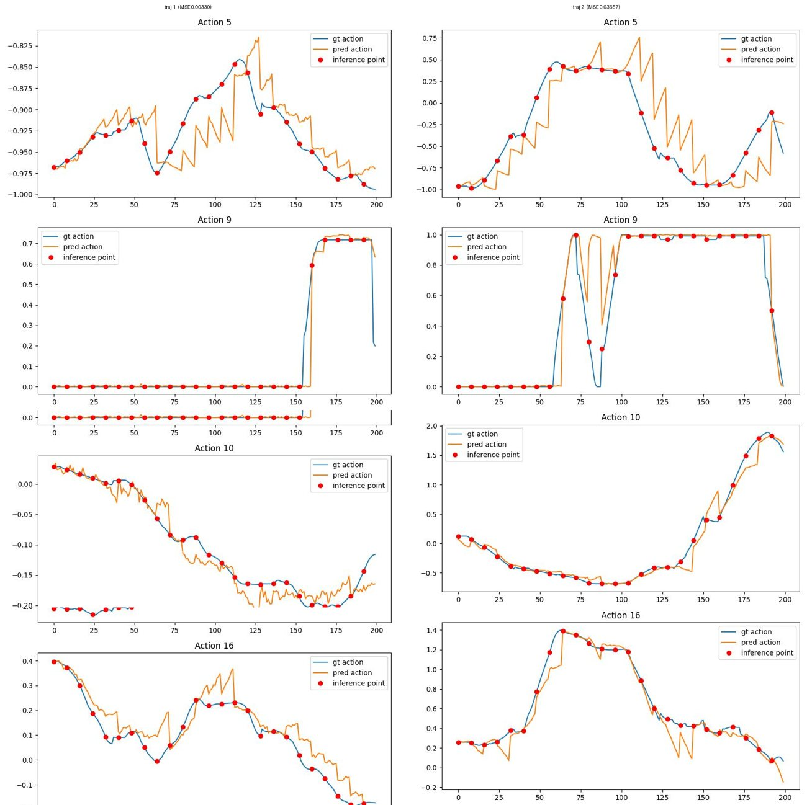
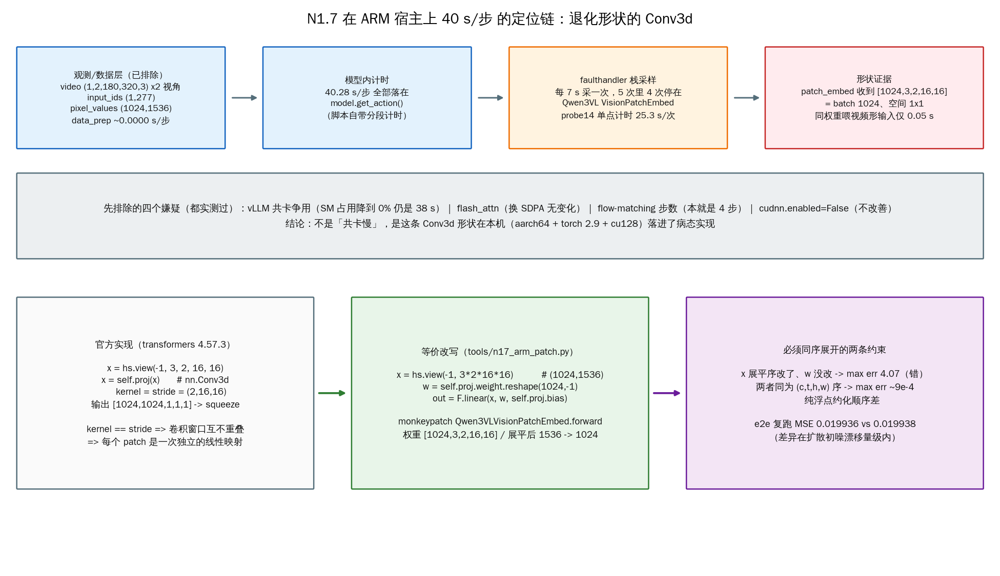
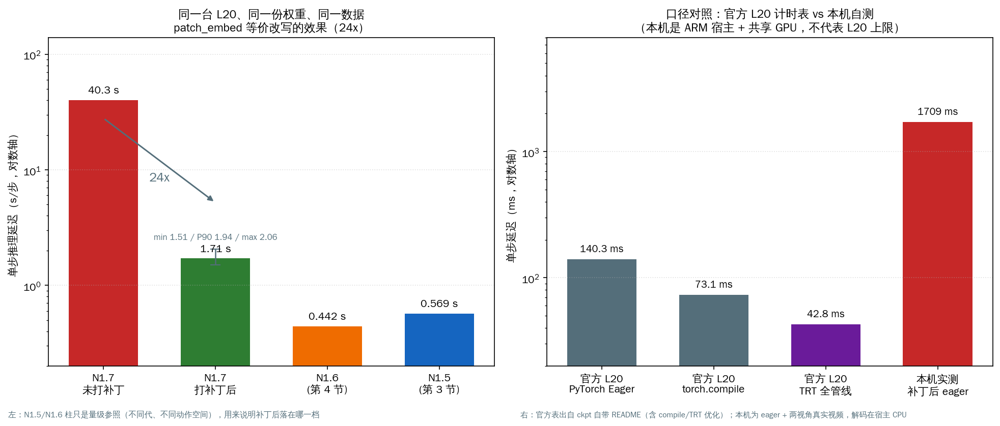

# 13 · L20 实战：N1.5 / N1.6 / N1.7 端到端推理执行手册（实测记录）

> 本章是**实操手册**：在一台 8×NVIDIA L20 的共享 GPU 机器（huangshan）上，把前 12 章讲的
> 推理框架**真正跑起来**——N1.5（课程基准）与 N1.6（社区新版）先双版本并存，各自把
> "单进程开环"和"ZMQ 服务化"两条路各实测跑通一遍；§5 再把最新发布的 **N1.7** 用
> "占位骨干 + 补丁注入"的方式在同机跑通，并完整复盘一次 40 s/步 的性能事故。
> 所有命令、数值、坑都来自 2026-09-16~18 的实际执行记录，不是设想稿。
>
> 注意：本章不改变课程"N1.5 教学基准"的约定（见 README"课程基准版本"）——N1.6 / N1.7
> 部分是"同机跑通并留档"，供版本演进（第 12 章）提供落地手感。

## 1. 硬件与基座环境（先摸清再动手）

| 项 | 值 |
|---|---|
| GPU | 8 × L20 48 GB（共享机器，每卡常被其他租户占 ~28 GB；本章固定用 `CUDA_VISIBLE_DEVICES=3`） |
| conda 环境 | `gr00t`（Python 3.11，torch 2.9.0+cu128，**transformers 4.51.3**） |
| N1.5 权重 | `~/.cache/huggingface/hub/models--nvidia--GR00T-N1.5-3B/snapshots/869830fc…/`（5.1 GB） |
| N1.6 权重 | `/home/ft/wzong/models/GR00T-N1.6-3B`（6.2 GB，HF 与 ModelScope **双源各下一份**；2026-09-18 复核：4 个 shard 的 SHA256 两两相同，且与 HF `.cache/…/*.metadata` 里记录的 LFS `sha256` 一致，safetensors 头部推导字节数亦相符） |
| N1.7 权重 | `/home/ft/wzong/models/GR00T-N1.7-3B-modelscope`（6.9 GB / 1031 张量，ModelScope 源完整；同模型的 HF 目录只下到 ~190 MB 就长期停滞，只剩 `.incomplete`） |
| N1.7 conda 环境 | `gr00t_n17`（Python 3.11，torch 2.9.0+cu128，**transformers 4.57.3**，flash_attn 2.8.3，decord 0.6.0） |
| 宿主架构 | GPU 是 L20，但**宿主 CPU 是 aarch64（ARM）**——§5.4 那次 40 s/步 的事故与它直接相关 |
| 网络 | huggingface.co 不可达 → 全程离线：`HF_HUB_OFFLINE=1`（n1.6 另加 `TRANSFORMERS_OFFLINE=1`） |

一个关键巧合：n1.6 `pyproject.toml` 把 transformers 钉在 **4.51.3**，与现有 `gr00t` 环境
**恰好同版**；torch（2.9.0 vs pin 2.7.1）、diffusers（0.30.2 vs pin 0.35.1）不一致，但本章
§3/§4 的四条 n1.5 / n1.6 路径（以及 §5 的 N1.7 路径）全部实测跑通、输出数值合理——
"未逐包对齐也能跑"是被验证过的（N1.7 另需 transformers 4.57.3，那是唯一绕不过去的硬版本门槛）。
若日后遇到诡异行为，第一嫌疑仍是依赖未对齐（可 `conda create --clone gr00t -n gr00t_n16` 再对齐）。

## 2. 多版本并存：不动 n1.5，把 n1.6 / n1.7 "借"出来

课程/A-B 实验/NPU 集成全部依赖 `Isaac-GR00T/` 当前检出的 `groot_ops_patch_n15` 分支，
**绝不能原地 checkout 成 n1.6**。正确姿势是 git worktree + PYTHONPATH + 增量装包：


```bash
# ① 建分支 + 工作树（在 Isaac-GR00T/ 下；两个 tag 本地都已 fetch，无需联网）
git branch n1.6 n1.6-release            # = ead5283 "Internal Submodule Purge Fix"
git worktree add ../Isaac-GR00T-n1.6 n1.6   # 另有 n1.6.1-release 补丁 tag，本章用 n1.6-release

# ② 一次性补依赖（纯增量，不动任何现有包）
pip install lmdb==1.7.5    # n1.6 的 Eagle 动态模块 import 检查硬依赖，缺了直接 ImportError

# ③ 跑前自检（每次都要做！）
cd ../Isaac-GR00T-n1.6
python -c "import gr00t; print(gr00t.__file__)"                  # → Isaac-GR00T/…（editable，n1.5）
PYTHONPATH=$PWD python -c "import gr00t; print(gr00t.__file__)"  # → Isaac-GR00T-n1.6/…（这才对）
```

N1.7 同理再开一个工作树（三个 tag 本地都已 fetch）：

```bash
git branch n1.7 n1.7-release            # = 23ace64 "GR00T N1.7 Release"
git worktree add ../Isaac-GR00T-n1.7 n1.7
conda create --clone gr00t -n gr00t_n17 -y && conda activate gr00t_n17
pip install transformers==4.57.3        # 4.51.3 里没有 Qwen3VLForConditionalGeneration（实测 ImportError）
```

`gr00t` 主环境因此**完全没被动过**（transformers 仍是 4.51.3），三代互不干扰。

**为什么 PYTHONPATH 能覆盖 editable 安装？** n1.5 是 `pip install -e .` 装的（PEP 660），
site-packages 里那个 `__editable___gr00t_…_finder` 是 `sys.meta_path.append(...)` 进去的
——排在默认 PathFinder **之后**。所以只要 `PYTHONPATH` 指到 n1.6 worktree，按 `sys.path`
查找就先命中 n1.6 的 `gr00t/` 包，editable finder 根本轮不到。第③步自检打印的路径
就是"我现在 import 的到底是哪一版"的**唯一判据**：忘了 `PYTHONPATH` 不会报错，
只会**静默地用 n1.5 的代码去 load n1.6 权重**，那是最难查的一类事故。

## 3. N1.5 实测（课程基准，两条路）

### 3.1 路径① 单进程开环（第 03/04 章的 Gr00tPolicy 直用）

```bash
cd /home/ft/wzong/workspace/embodied/gr00t/Isaac-GR00T
N15_MODEL=~/.cache/huggingface/hub/models--nvidia--GR00T-N1.5-3B/snapshots/869830fc749c35f34771aa5209f923ac57e4564e

CUDA_VISIBLE_DEVICES=3 HF_HUB_OFFLINE=1 python scripts/eval_policy.py \
  --plot --model-path $N15_MODEL \
  --dataset-path demo_data/robot_sim.PickNPlace/ \
  --video-backend decord --save-plot-path /tmp/n15_eval_traj.jpeg
```

实测输出（traj 0，默认 150 步、`fourier_gr1_arms_only`、denoising=4、chunk 16）：

```
Unnormalized Action MSE across single traj: 0.03913
pred_action_joints vs time (150, 14)
```

- **必须显式 `--video-backend decord`**：脚本默认 `torchcodec`，本机未装，会在建数据集时报错。
- 曲线节选（右臂前三维；红点=每 16 步一次真实推理，其余步用 chunk 内动作填充——正是第 06 章
  "一次去噪、整块执行"的可视化）：


### 3.2 路径② ZMQ 服务化（复现第 07 章的请求旅程）

```bash
# 终端 A：起服务（默认 data_config=fourier_gr1_arms_waist，监听 tcp://0.0.0.0:5555）
CUDA_VISIBLE_DEVICES=3 HF_HUB_OFFLINE=1 python scripts/inference_service.py \
  --server --model-path $N15_MODEL
# 约 1 分钟后打印 "Server is ready and listening on tcp://0.0.0.0:5555"

# 终端 B：同一脚本不带 --model-path 即自动变纯客户端（RobotInferenceClient 走 ZMQ）
CUDA_VISIBLE_DEVICES=3 HF_HUB_OFFLINE=1 python scripts/eval_policy.py \
  --video-backend decord --steps 48 --plot --save-plot-path /tmp/n15_zmq_traj.jpeg
```

实测：48 步 MSE=**0.0352**，输出 `action.left_arm/right_arm/left_hand/right_hand/waist`
五个键。**注意一个易踩的概念坑**：客户端打印的 modality config 来自
`policy.get_modality_config()`——即**契约由服务端定义**。服务端默认是
`arms_waist`（含 waist，29 维 state / 5 组 action），与客户端脚本默认的
`arms_only` 并不相同；3.1 与 3.2 的 MSE 本来就测在不同步窗（150 vs 48）与不同维度契约上，
**不能**用来证明"过网有没有失真"（07 章已证：MsgSerializer 无损）。

### 3.3 单步延迟探针（本章工具）

`tools/l20_latency_probe.py`：同一 obs 连打 6 次 `get_action`，去 warmup 取均值。

```bash
CUDA_VISIBLE_DEVICES=3 HF_HUB_OFFLINE=1 python tools/l20_latency_probe.py inprocess   # 0.569 s/步
# 起服务后：
python tools/l20_latency_probe.py zmq                                                # 0.596 s/步
```

ZMQ 化只加 **≈27 ms（≈5%）**——MsgPack+numpy 序列化与本机回环的代价，量级上完全对得上
第 07 章"传输层不改变数值、只加固定小开销"的论断。

## 4. N1.6 实测（worktree + PYTHONPATH，四条命令）

> 注意分层：n1.6 仓库里的 `gr00t/transformers_npu/` NPU patch 层（全景图见第 09 章 §2）在
> 本机 L20 上**不激活**——下面四条命令全部走纯 PyTorch GPU 原生链；只有上 E200 板端
> （`install()` + torch_evo）才走 patch 链。正因为 patch 层零侵入，同一份代码两边都能跑。

```bash
cd /home/ft/wzong/workspace/embodied/gr00t/Isaac-GR00T-n1.6
export CUDA_VISIBLE_DEVICES=3 HF_HUB_OFFLINE=1 TRANSFORMERS_OFFLINE=1 PYTHONPATH=$PWD
N16_MODEL=/home/ft/wzong/models/GR00T-N1.6-3B

# 路径①a：官方 README 推荐入口（3 条轨迹 × 25 步，异步预取计时）
python scripts/deployment/standalone_inference_script.py \
  --model-path $N16_MODEL --dataset-path demo_data/gr1.PickNPlace \
  --embodiment-tag GR1 --traj-ids 0 1 2 --inference-mode pytorch --action-horizon 8

# 路径①b：进程内开环（n1.6 世界里与 n1.5 eval_policy 对位的是 gr00t/eval/open_loop_eval.py）
python gr00t/eval/open_loop_eval.py --model-path $N16_MODEL \
  --dataset-path demo_data/gr1.PickNPlace --embodiment-tag GR1 --steps 100 --traj-ids 0

# 路径② 终端 A：服务化（对应 n1.5 的 inference_service.py --server）
python gr00t/eval/run_gr00t_server.py --embodiment-tag GR1 --model-path $N16_MODEL
# 路径② 终端 B：客户端（open_loop_eval 不带 --model-path 即走 PolicyClient→:5555）
python gr00t/eval/open_loop_eval.py --dataset-path demo_data/gr1.PickNPlace \
  --embodiment-tag GR1 --steps 32 --traj-ids 0
```

实测要点：

- standalone 计时（脚本自带，去掉 warmup 共 72 步）：**平均 0.442 s/步**（min 0.395 / P90 0.475 /
  max 0.527），模型加载 40.6 s。**首次运行会额外花数分钟做 triton matmul autotune**（日志里
  `AUTOTUNE benchmarking … for 15 choices`），是一次性的，别当成卡死。
- 开环 MSE：traj 0/1/2 = 1.276 / 1.071 / 1.188（均值 1.178）；`open_loop_eval` 进程内 100 步
  MSE=1.214；经 ZMQ 32 步 MSE=1.358。
- 臂通道跟踪良好、手/腰通道围绕 0 高频抖——与第 02 章 §7.6 的实测结论一致（GR1 手部通道
  GT≈0，模型输出近噪声，聚合 MSE 被其支配）。前 12 维（双臂）实测曲线重排如下
  （蓝=GT，橙=预测，红点=推理时刻）：


- n1.6 的视频解码同样回退 decord（torchcodec 未装），只影响数据加载速度，不影响数值。
- n1.6 服务从起进程到 `Server is ready` 约 50 s（权重 shard 加载本身只有 ~4 s，大头在
  Eagle processor/模型组装）。

## 5. N1.7 实测（三代闭环，外加一次 40 s/步 的性能事故）

N1.7 是这一代里**唯一需要动权重获取方式**的版本：骨干换成了 gated 的
`nvidia/Cosmos-Reason2-2B`。本节先把"受限网络下如何等价跑通"讲清楚，再给出实测的
MSE/延迟，最后完整复盘一次**环境层**（不是模型层）的性能事故——它的教学价值比数字更高。

### 5.1 权重与"占位骨干"：绕不开 gated，就只借结构

- 权重：`/home/ft/wzong/models/GR00T-N1.7-3B-modelscope`（6.9 GB，2 个 shard
  4 990 519 232 + 1 919 980 184 B，**safetensors 头部推导的字节数与实际文件逐 shard 相符**，
  共 **1031 个张量**）。同一模型的 HF 目录 `GR00T-N1.7-3B` 当时只落到 ~190 MB 就长期停滞，
  只剩 `.cache/huggingface/download/*.incomplete`（73 MB / 115 MB），没有可用分片。
- 骨干：镜像站上 `Cosmos-Reason2-2B` 的权重是 403（gated）。但把 ckpt 的
  `model.safetensors.index.json` 摊开数一遍就会发现：发布权重的 state_dict
  **恰好覆盖全部 1031 个 key（0 missing / 0 extra，其中 494 个是 backbone 张量）**——
  也就是说最终推理权重里，骨干的官方预训练权重并没有被"另外再用一次"。
  于是**只要把骨干的结构摆好，权重让大 ckpt 覆盖**即可等价跑通：

  ```bash
  # ① 骨干目录：非 gated 可下载的结构类文件全部软链过来
  mkdir -p ~/wzong/models/nvidia/Cosmos-Reason2-2B
  ln -s ~/wzong/models/Cosmos-Reason2-2B-modelscope/{config.json,tokenizer*.json,vocab.json,merges.txt,\
  preprocessor_config.json,video_preprocessor_config.json,chat_template.json,generation_config.json} \
      ~/wzong/models/nvidia/Cosmos-Reason2-2B/
  # ② 放一个只含 "__placeholder__" 键的 84 字节 model.safetensors（只为让 from_pretrained 找到文件）
  # ③ 两处 model_name 都改成本地路径（备份 .orig）：
  #    config.json            -> "model_name": "/home/ft/wzong/models/nvidia/Cosmos-Reason2-2B"
  #    processor_config.json  -> "processor_kwargs": { ..., "model_name": 同上 }
  ```

  漏改 `processor_config.json` 那一处，构造 processor 时仍会去联网找 gated repo；
  启动日志里的 `Some weights of the model checkpoint … were not used: ['__placeholder__']`
  是**预期**输出，不是权重损坏。
- 加载后必须核对的三件事（第 02 章"契约"纪律）：实际 attention 实现是
  `flash_attention_2`（ckpt `use_flash_attention=true`）、LM 只取到
  `select_layer=16`、观测形状 `video (1,2,180,320,3)×2 视角 / input_ids (1,277) /
  pixel_values (1024,1536) + image_grid_thw 4×[1,16,16]`。

### 5.2 跑通命令（patch 走 PYTHONPATH，仓库一行不改）

```bash
cd /home/ft/wzong/workspace/embodied/gr00t/Isaac-GR00T-n1.7     # tag n1.7-release = 23ace64
conda activate gr00t_n17                                         # transformers 4.57.3（4.51.3 无 Qwen3VL）
export CUDA_VISIBLE_DEVICES=3 HF_HUB_OFFLINE=1 TRANSFORMERS_OFFLINE=1
N17_MODEL=/home/ft/wzong/models/GR00T-N1.7-3B-modelscope
TOOLS=/home/ft/wzong/workspace/embodied/gr00t/inference_learning/tools

PYTHONPATH=$PWD:$TOOLS python - \
  --model-path $N17_MODEL --dataset-path demo_data/droid_sample \
  --embodiment-tag OXE_DROID_RELATIVE_EEF_RELATIVE_JOINT \
  --traj-ids 1 2 --inference-mode pytorch --action-horizon 8 --video-backend decord \
  <<'PY'
import runpy, n17_arm_patch                     # 5.4 节那个 60 行补丁
print("patched classes:", n17_arm_patch.apply())  # 期望输出 1
runpy.run_path("scripts/deployment/standalone_inference_script.py", run_name="__main__")
PY
```

三个必带项：

1. `--video-backend decord`：`gr00t_n17` 里的 torchcodec 0.11 与 torch 2.9 **ABI 不匹配**
   （缺符号 `torch_dtype_float4_e2m1fn_x2`，那是 torch≥2.10 的符号），而 aarch64 上
   能装到的 torchcodec 全都 ≥0.11——只能退回 decord 0.6.0（只影响解码速度，不影响数值）。
2. `--embodiment-tag OXE_DROID_RELATIVE_EEF_RELATIVE_JOINT`：`demo_data/droid_sample` 的
   零样本演示就靠它。把 `processor_config.json` 里这个 tag 摊开看，"相对性"是**逐通道**声明的：
   `eef_9d → RELATIVE / XYZ_ROT6D`、`gripper_position → ABSOLUTE`、
   `joint_position → RELATIVE`（第 12 章主线③的实机证据）。
3. `PYTHONPATH` 指到 `$PWD` 与 `$TOOLS`：前者是"我在跑 n1.7 而不是 n1.5"的唯一判据
   （§2），后者是把 5.4 的补丁挂进来的通道。

### 5.3 实测结果：零样本 MSE 与曲线形状

| 项 | 实测值 |
|---|---|
| 模型加载 | 39.3 s |
| 评测口径 | droid 两轨迹 × 25 步（`--action-horizon 8`），17 维 = eef_9d(9) + gripper(1) + joint_position(7) |
| MSE（unnormalized） | traj 1 = **0.003298**，traj 2 = **0.036574**，平均 **0.019936**（MAE 平均 0.0770） |
| 单步延迟 | **1.7094 s**（min 1.506 / P90 1.942 / max 2.058），打补丁前 40.2765 s |



怎么读这张图（蓝=GT，橙=预测，红点=发起推理的时刻）：

- **gripper（第 3 行）** 近方波，开/闭时机几乎全对——离散语义通道最容易"看起来像成功"。
- **joint（第 2/4 行）** 平滑跟踪；traj 2 尾段（第 4 行，step≈150 之后）预测没跟住 GT 的下探，
  这就是 0.0366 那条轨迹的主要误差来源。**没跟住的地方要敢指出来**，别只看平均值。
- **rot6d 通道（第 1 行）** 呈明显锯齿：`action_horizon=8` 意味着一次推理出 8 步、执行完再问一次，
  相邻动作块在旋转参数化上不完全接得上——这是 chunk 执行的固有形态，不是 bug
  （和第 02 章 §7.6、真机 #168 里"相邻块互相矛盾"是同一条线的现象）。

**口径警告**：这个 0.0199 与 §4 里 N1.6 的 ~1.2 **不可比**。维度口径（17 vs 29）、
数据集（droid vs GR1 demo）、动作语义（相对 EEF vs 相对动作）、微调语境（droid 官方零样本
演示 vs 拿 GR1 demo 硬喂）全都不同。跨代比性能必须先统一 unnormalized 空间 + 同一子集 +
同一执行口径，否则数字没有意义。

### 5.4 一次真实的性能事故：40.28 s/步 → 1.71 s/步（24×）

这是本章最值得抄进笔记的一段，因为它**不在模型里，而在"模型 × 这台机器"的交界面上**。



**现象**：脚本自带的分段计时说得很清楚——`Total data preparation: 0.0018s (avg 0.0000 per
step)`，`Total inference: 1933.27s (avg 40.2765s per step)`。也就是说 40 s 全在
`model.get_action()` 里，观测处理清白（§1 那张观测形状表就是排除法的第一步）。

**排除（每一步都真的做了对照）**：

| 嫌疑 | 实验 | 结论 |
|---|---|---|
| 共卡 vLLM 抢 SM | 等 resident vLLM 的 SM 占用降到 0% 再测 | 仍 38 s/步，**排除** |
| flash_attn 在 ARM 上退化 | 换 SDPA | 无变化，**排除** |
| flow-matching 去噪步数太多 | 查 ckpt：`num_inference_timesteps=4`（与 N1.5/N1.6 同） | **排除** |
| cuDNN 引擎选择 | `torch.backends.cudnn.enabled=False` | 不改善，**排除**（但把方向指到了卷积上） |

**定位**：`py-spy` 在这台机器上被 ptrace 限制挡住，改用标准库 `faulthandler`——
在推理线程里以 7 s 周期打栈，采 5 次，**4 次停在 `Qwen3VLVisionPatchEmbed`**。
再用单点微基准（`/tmp/n17_probe14.log`）量这一层：**25.3 s/次**，每步一次，对得上 40 s。

**根因**：transformers 4.57.3 的实现把 `pixel_values (1024,1536)` 重排成
`[1024, 3, 2, 16, 16]` 再送进 `nn.Conv3d(kernel=stride=(2,16,16))`——
等价于 **batch=1024、空间尺寸 1×1** 的卷积。同一份权重喂进"视频形"输入
`[1,3,180,320]` 时同一层只要 **0.05 s**。也就是形状本身让本机的卷积实现
（aarch64 宿主 + torch 2.9 + cu128）落进了病态路径。

**修复**（`tools/n17_arm_patch.py`，60 行，monkeypatch 一个 forward）：
`kernel == stride` 的卷积窗口互不重叠 ⇒ 每个 patch 是一次独立的线性映射 ⇒
`F.linear(x.view(-1, 3·2·16·16), proj.weight.reshape(1024, -1), bias)`。

- **顺序是唯一有坑的地方**：输入按 (c,t,h,w) 自然展平，权重必须**同序** `reshape`。
  只改 x 不改 w → 与原实现 max err **4.07**（错的）；两者同序 → fp32 对照 max err
  **~9e-4**（纯浮点约化顺序差）。脚本自带 `--self-test`，本机实测 **6.79e-4** 通过。
- **端到端等价性**：打补丁后重跑同一命令，MSE 平均 **0.019936** vs 未打补丁
  **0.019938**（traj 1：0.00329813 vs 0.00330799；traj 2：0.03657430 vs 0.03656733），
  差异在第 06 章"扩散初噪每次随机"的复跑漂移量级内 ⇒ 等价改写成立。



**边界与诚实声明**（引用这段数字时必须带上）：

- 本机是 **ARM 宿主 + 共享 GPU + eager** 路径，1.71 s/步**不代表 L20 的上限**；
  同一张 L20 在官方 ckpt README 计时表里是 eager 140.3 ms / compile 73.1 ms /
  TRT 全管线 42.8 ms（口径含优化、且由 NVIDIA 自测）。
- 本结论只对"这一套版本组合（transformers 4.57.3 + torch 2.9.0+cu128 + aarch64 宿主）"
  负责，**没有在第二台 ARM 机器上复测**，不能升级为"ARM 上 N1.7 都慢 24 倍"。
- 反向教训同样重要：**没有分段计时，就没有这次归因**。standalone 脚本把
  data_prep / inference 分开打印，才让"40 s 在模型里"这句话在 5 分钟内成立。

## 6. 实测汇总与解读纪律

| 版本 | 路径 | 入口 | 步数 | MSE（未反归一化） | 单步延迟 |
|---|---|---|---|---|---|
| N1.5 | 进程内 | `scripts/eval_policy.py` | 150 | 0.0391（arms_only 14 维） | 0.569 s（1.8 Hz） |
| N1.5 | ZMQ | `inference_service.py --server` + 同脚本客户端 | 48 | 0.0352（arms_waist 契约） | 0.596 s（1.7 Hz） |
| N1.6 | 进程内 | `scripts/deployment/standalone_inference_script.py` | 3×25 | 1.178 均值（全身 29 维） | 0.442 s（2.3 Hz） |
| N1.6 | 进程内 | `gr00t/eval/open_loop_eval.py` | 100 | 1.214 | —（脚本不报计时） |
| N1.6 | ZMQ | `run_gr00t_server.py` + `open_loop_eval` 客户端 | 32 | 1.358 | —（同上） |
| N1.7 | 进程内 | `standalone_inference_script.py`（+`n17_arm_patch`） | 2×25 | 0.0199（droid 17 维，零样本） | 1.709 s（未打补丁 40.277 s） |


四条**解读纪律**（比数字本身更重要）：

1. **MSE 不能跨行竖着比。** 0.039 vs 1.18 的"30 倍差距"几乎全部来自评测维度集不同：
   n1.5 只评双臂 14 维（跟踪好的维度），n1.6 评全身 29 维（含 15 个 GT≈0 的手/腰噪声维）；
   而 N1.7 那一行的 0.0199 又是第三套口径（droid 17 维 + 官方零样本演示集）。
   **五个数字、四套口径**，这正是第 02 章"聚合指标会被噪声维度支配"教训的现场重演。
2. **同版本内 ZMQ 与进程内 MSE 的微小差异来自步窗不同**（48 vs 150、32 vs 100 步，评的
   帧集合不同），不是传输失真——07 章已证传输无损，本章延迟数据进一步显示开销仅 ~5%。
3. **延迟数字要带"环境标签"。** 同一段模型代码、同一块 GPU，只因为宿主 CPU 架构不同，
   单步就能从 1.71 s 变成 40.28 s（§5.4）。引用延迟前先说清：什么 GPU、什么宿主架构、
   eager 还是 compile/TRT、是否与人共卡、瓶颈在 GPU 还是宿主 CPU。
4. **延迟数字要带模式标签。** 官方 README 的 38–44 ms 是 H100/RTX4090 + `torch.compile`；
   本机是 L20 + pytorch eager，0.44–0.60 s/步属预期量级（约 10 倍差距，**未**在本机验证
   compile 能追平多少，不下结论）。L20 上真上采样的正确姿势是执行一个 chunk（16 步）再
   推理一次，16×0.5 s ≈ 8 s 一个动作块，对慢任务够用。

## 7. 坑清单（每条都真实咬过人）

| 坑 | 症状 | 处置 |
|---|---|---|
| 忘设 `PYTHONPATH` | n1.6 目录里跑的却是 n1.5 包（静默！） | 每次先 `python -c "import gr00t; print(gr00t.__file__)"` |
| 缺 `lmdb` | n1.6 加载 processor 时 `ImportError: … requires … lmdb` | `pip install lmdb==1.7.5`（纯增量） |
| 默认 video_backend=torchcodec | 建数据集即报错 | 显式 `--video-backend decord`（或装 torchcodec） |
| triton autotune | 首跑"卡住"数分钟 | 正常，一次性；看日志有无 `AUTOTUNE benchmarking` |
| 5555 端口 | 第二个 server 起不来 / client 连到旧 server | 起服务前 `ss -ltnp \| grep 5555`；收工 `kill` 旧 PID |
| 服务端契约 ≠ 客户端默认 | ZMQ 版多出一个 waist 键、MSE 对不上 | 记住 modality 由 **server** 定义（`policy.get_modality_config()`） |
| 共卡显存 | 别的租户占 28 GB 后加载偶发 OOM | 换空闲卡（`nvidia-smi` 选卡后改 `CUDA_VISIBLE_DEVICES`） |
| albumentations 联网检查 | 启动慢 / read timeout 警告 | 无害；`NO_ALBUMENTATIONS_UPDATE=1` 消除 |
| 默认走 torchcodec（n1.7 环境） | 建数据集即报 `undefined symbol: torch_dtype_float4_e2m1fn_x2` | torchcodec 0.11 与 torch 2.9 ABI 不匹配且 aarch64 无更旧 wheel → `--video-backend decord` |
| N1.7 gated 骨干 403 | `Cosmos-Reason2-2B` 下不下来，卡在 processor 构造 | §5.1 占位骨干（结构软链 + `__placeholder__` 权重 + 改两处 `model_name`，留 `.orig`）；有授权仍应走官方双仓库 |
| ARM 宿主上的退化 Conv3d | N1.7 单步 40 s，且**没有任何报错** | `tools/n17_arm_patch.py`（§5.4）；`--self-test` 先验等价性，再看 e2e MSE 是否复现 |
| HF 长时下载假活 | 目录里只有 `.incomplete`，`du` 长时间不涨 | 判进度只看 `.cache/huggingface/download/*.metadata` 是否落盘（每个文件下完才写）。本机实测：N1.6 的 5 GB 分片走 HF 用了约 **39 h**（同时走 ModelScope 只要 ~1.5 h）；N1.7 那份 HF 干脆停在 ~190 MB 不再动 |

## 8. 本章小结

- 一台机器、一个 conda 环境里可以同时跑两代 GR00T：**worktree 隔离代码、PYTHONPATH 隔离
  包解析、离线开关隔离网络**，对 n1.5 主线零侵入、可整体回滚。
- N1.5：开环 MSE 0.039（14 维）/0.569 s/步；ZMQ 化 +27 ms。N1.6：MSE 1.18（29 维）/
  0.442 s/步，首跑有 autotune。数字都记得带上"模式标签"和"维度口径"再引用。
- N1.7：同机用"占位骨干"等价跑通，droid 零样本 MSE 0.0199（17 维，与上两行**不可横比**）；
  首跑 40.28 s/步 是 ARM 宿主上退化 Conv3d 造成的，`n17_arm_patch.py` 等价改写后 1.71 s/步（24×）。
- 入口对应关系值得背下来：n1.5 `eval_policy ↔ n1.6 open_loop_eval`（开环），
  n1.5 `inference_service --server ↔ n1.6 run_gr00t_server`（服务化）；
  n1.6 额外有 `standalone_inference_script`（官方 README 计时入口，N1.7 复用它并有第 3 种
  `--inference-mode trt_full_pipeline`）。
- 方法论上本章留下三件可复用的工具：**分段计时**（把"慢"关进模型/数据的某一侧）、
  **栈采样 + 单点微基准**（`faulthandler` 绕开 py-spy 的 ptrace 限制）、
  **等价改写的双重验证**（层内 fp32 误差 + 端到端 MSE 复跑）。

## 自己动手

1. 复跑 3.1，观察你的 MSE 与 0.0391 的关系。先想：`eval_policy.py` 全文没有
   `seed=`（自己 grep 验证），扩散初噪每次随机——所以复跑必然有漂移，漂在什么量级？
   再把 `--steps` 改成 48 重跑，比较"同一步窗的复跑漂移"与"换步窗的差"哪个大。
2. 用 `tools/l20_latency_probe.py` 把 `denoising_steps` 从 4 改成 8，量一下延迟近似翻倍吗？
   结合第 06 章 DiT 每步一次前向的结构解释你的观测。
3. 把 n1.6 服务化路径跑通后，用 `ss -ltnp | grep 5555` 确认监听进程 PID，再用
   07 章的 `MsgSerializer` 思路猜测：如果客户端把某张图 resize 坏了，服务端哪一层能
   抓住它？（呼应 02 章 §7.6 的"尺寸闸门"。）
4. 复跑 §5.2 之前先做 `python tools/n17_arm_patch.py --self-test`，体会"改动的正确性"
   与"改动的有效性"为什么要分开验证。再故意造一次 §5.4 的错误顺序（只改 x 不改 w），
   看 self-test 报出的误差量级，然后回答：为什么**只看端到端 MSE 不足以发现这类错误**？
5. §5.4 的四个排除实验里，哪一个最能缩小搜索空间？如果手边没有 `faulthandler`
   （比如线上只允许加日志），你会怎么在 30 分钟内把 40 s 定位到某一层？

## 疑问与批注

（学生区）
