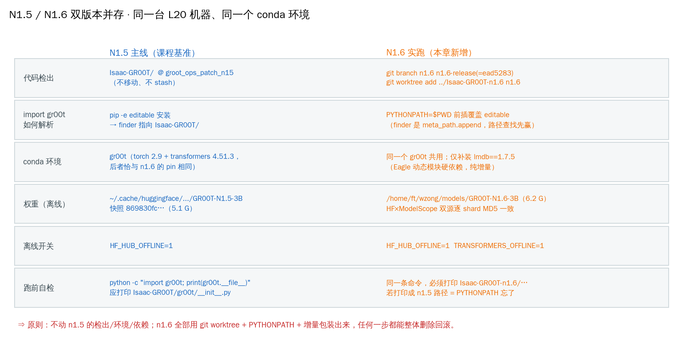
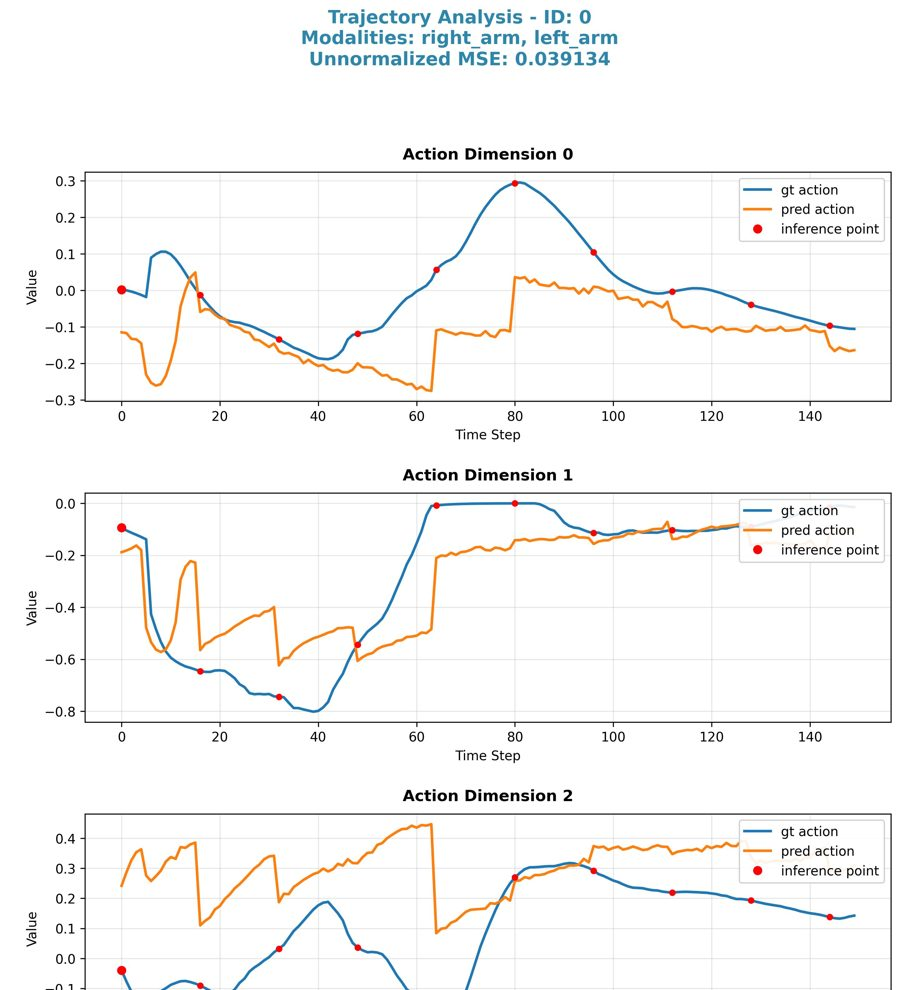
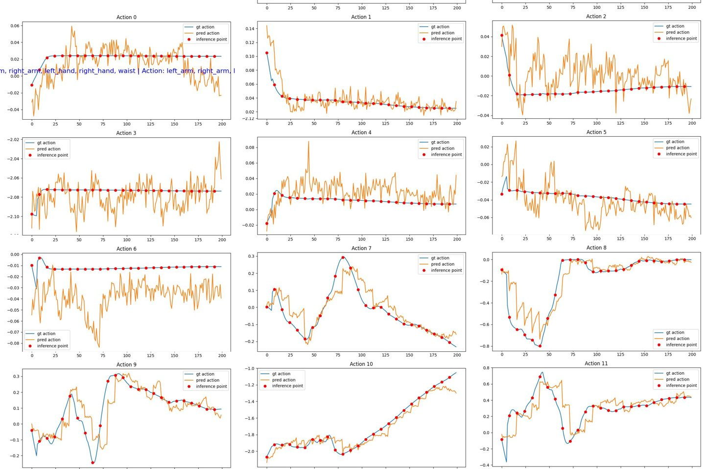
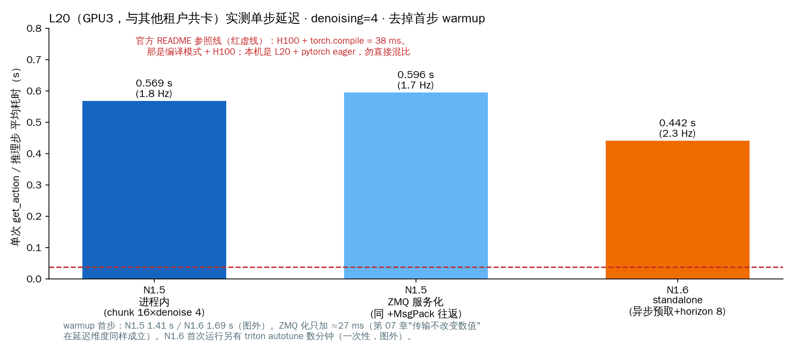
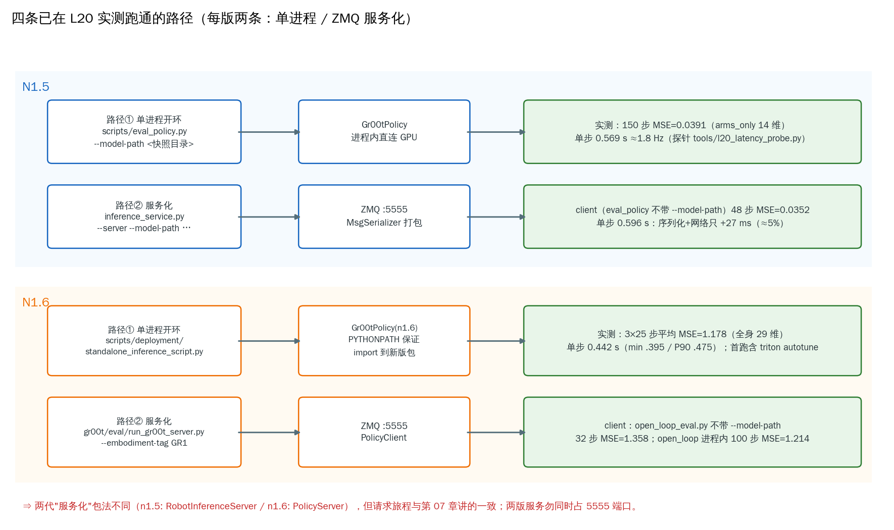

# 13 · L20 实战：N1.5 / N1.6 端到端推理执行手册（实测记录）

> 本章是**实操手册**：在一台 8×NVIDIA L20 的共享 GPU 机器（huangshan）上，把前 12 章讲的
> 推理框架**真正跑起来**——N1.5（课程基准）与 N1.6（社区新版）双版本并存、各自把
> "单进程开环"和"ZMQ 服务化"两条路各实测跑通一遍。所有命令、数值、坑都来自
> 2026-09-17/18 的实际执行记录，不是设想稿。
>
> 注意：本章不改变课程"N1.5 教学基准"的约定（见 README"课程基准版本"）——N1.6 部分
> 是"同机跑通并留档"，供版本演进（第 12 章）提供落地手感。

## 1. 硬件与基座环境（先摸清再动手）

| 项 | 值 |
|---|---|
| GPU | 8 × L20 48 GB（共享机器，每卡常被其他租户占 ~28 GB；本章固定用 `CUDA_VISIBLE_DEVICES=3`） |
| conda 环境 | `gr00t`（Python 3.11，torch 2.9.0+cu128，**transformers 4.51.3**） |
| N1.5 权重 | `~/.cache/huggingface/hub/models--nvidia--GR00T-N1.5-3B/snapshots/869830fc…/`（5.1 GB） |
| N1.6 权重 | `/home/ft/wzong/models/GR00T-N1.6-3B`（6.2 GB，HF 与 ModelScope 双源下载、逐 shard MD5 一致） |
| 网络 | huggingface.co 不可达 → 全程离线：`HF_HUB_OFFLINE=1`（n1.6 另加 `TRANSFORMERS_OFFLINE=1`） |

一个关键巧合：n1.6 `pyproject.toml` 把 transformers 钉在 **4.51.3**，与现有 `gr00t` 环境
**恰好同版**；torch（2.9.0 vs pin 2.7.1）、diffusers（0.30.2 vs pin 0.35.1）不一致，但本章
四条执行路径全部实测跑通、输出数值合理——"未逐包对齐也能跑"是被验证过的。
若日后遇到诡异行为，第一嫌疑仍是依赖未对齐（可 `conda create --clone gr00t -n gr00t_n16` 再对齐）。

## 2. 双版本并存：不动 n1.5，把 n1.6 "借"出来

课程/A-B 实验/NPU 集成全部依赖 `Isaac-GR00T/` 当前检出的 `groot_ops_patch_n15` 分支，
**绝不能原地 checkout 成 n1.6**。正确姿势是 git worktree + PYTHONPATH + 增量装包：



```bash
# ① 建分支 + 工作树（在 Isaac-GR00T/ 下；两个 tag 本地都已 fetch，无需联网）
git branch n1.6 n1.6-release            # = ead5283 "Internal Submodule Purge Fix"
git worktree add ../Isaac-GR00T-n1.6 n1.6   # 另有 n1.6.1-release 补丁 tag，本章用 n1.6-release

# ② 一次性补依赖（纯增量，不动任何现有包）
pip install lmdb==1.7.5    # n1.6 的 Eagle 动态模块 import 检查硬依赖，缺了直接 ImportError

# ③ 跑前自检（每次都要做！）
cd ../Isaac-GR00T-n1.6
python -c "import gr00t; print(gr00t.__file__)"                  # → Isaac-GR00T/…（editable，n1.5）
PYTHONPATH=$PWD python -c "import gr00t; print(gr00t.__file__)"  # → Isaac-GR00T-n1.6/…（这才对）
```

**为什么 PYTHONPATH 能覆盖 editable 安装？** n1.5 是 `pip install -e .` 装的（PEP 660），
site-packages 里那个 `__editable___gr00t_…_finder` 是 `sys.meta_path.append(...)` 进去的
——排在默认 PathFinder **之后**。所以只要 `PYTHONPATH` 指到 n1.6 worktree，按 `sys.path`
查找就先命中 n1.6 的 `gr00t/` 包，editable finder 根本轮不到。第③步自检打印的路径
就是"我现在 import 的到底是哪一版"的**唯一判据**：忘了 `PYTHONPATH` 不会报错，
只会**静默地用 n1.5 的代码去 load n1.6 权重**，那是最难查的一类事故。

## 3. N1.5 实测（课程基准，两条路）

### 3.1 路径① 单进程开环（第 03/04 章的 Gr00tPolicy 直用）

```bash
cd /home/ft/wzong/workspace/embodied/gr00t/Isaac-GR00T
N15_MODEL=~/.cache/huggingface/hub/models--nvidia--GR00T-N1.5-3B/snapshots/869830fc749c35f34771aa5209f923ac57e4564e

CUDA_VISIBLE_DEVICES=3 HF_HUB_OFFLINE=1 python scripts/eval_policy.py \
  --plot --model-path $N15_MODEL \
  --dataset-path demo_data/robot_sim.PickNPlace/ \
  --video-backend decord --save-plot-path /tmp/n15_eval_traj.jpeg
```

实测输出（traj 0，默认 150 步、`fourier_gr1_arms_only`、denoising=4、chunk 16）：

```
Unnormalized Action MSE across single traj: 0.03913
pred_action_joints vs time (150, 14)
```

- **必须显式 `--video-backend decord`**：脚本默认 `torchcodec`，本机未装，会在建数据集时报错。
- 曲线节选（右臂前三维；红点=每 16 步一次真实推理，其余步用 chunk 内动作填充——正是第 06 章
  "一次去噪、整块执行"的可视化）：



### 3.2 路径② ZMQ 服务化（复现第 07 章的请求旅程）

```bash
# 终端 A：起服务（默认 data_config=fourier_gr1_arms_waist，监听 tcp://0.0.0.0:5555）
CUDA_VISIBLE_DEVICES=3 HF_HUB_OFFLINE=1 python scripts/inference_service.py \
  --server --model-path $N15_MODEL
# 约 1 分钟后打印 "Server is ready and listening on tcp://0.0.0.0:5555"

# 终端 B：同一脚本不带 --model-path 即自动变纯客户端（RobotInferenceClient 走 ZMQ）
CUDA_VISIBLE_DEVICES=3 HF_HUB_OFFLINE=1 python scripts/eval_policy.py \
  --video-backend decord --steps 48 --plot --save-plot-path /tmp/n15_zmq_traj.jpeg
```

实测：48 步 MSE=**0.0352**，输出 `action.left_arm/right_arm/left_hand/right_hand/waist`
五个键。**注意一个易踩的概念坑**：客户端打印的 modality config 来自
`policy.get_modality_config()`——即**契约由服务端定义**。服务端默认是
`arms_waist`（含 waist，29 维 state / 5 组 action），与客户端脚本默认的
`arms_only` 并不相同；3.1 与 3.2 的 MSE 本来就测在不同步窗（150 vs 48）与不同维度契约上，
**不能**用来证明"过网有没有失真"（07 章已证：MsgSerializer 无损）。

### 3.3 单步延迟探针（本章工具）

`tools/l20_latency_probe.py`：同一 obs 连打 6 次 `get_action`，去 warmup 取均值。

```bash
CUDA_VISIBLE_DEVICES=3 HF_HUB_OFFLINE=1 python tools/l20_latency_probe.py inprocess   # 0.569 s/步
# 起服务后：
python tools/l20_latency_probe.py zmq                                                # 0.596 s/步
```

ZMQ 化只加 **≈27 ms（≈5%）**——MsgPack+numpy 序列化与本机回环的代价，量级上完全对得上
第 07 章"传输层不改变数值、只加固定小开销"的论断。

## 4. N1.6 实测（worktree + PYTHONPATH，四条命令）

```bash
cd /home/ft/wzong/workspace/embodied/gr00t/Isaac-GR00T-n1.6
export CUDA_VISIBLE_DEVICES=3 HF_HUB_OFFLINE=1 TRANSFORMERS_OFFLINE=1 PYTHONPATH=$PWD
N16_MODEL=/home/ft/wzong/models/GR00T-N1.6-3B

# 路径①a：官方 README 推荐入口（3 条轨迹 × 25 步，异步预取计时）
python scripts/deployment/standalone_inference_script.py \
  --model-path $N16_MODEL --dataset-path demo_data/gr1.PickNPlace \
  --embodiment-tag GR1 --traj-ids 0 1 2 --inference-mode pytorch --action-horizon 8

# 路径①b：进程内开环（n1.6 世界里与 n1.5 eval_policy 对位的是 gr00t/eval/open_loop_eval.py）
python gr00t/eval/open_loop_eval.py --model-path $N16_MODEL \
  --dataset-path demo_data/gr1.PickNPlace --embodiment-tag GR1 --steps 100 --traj-ids 0

# 路径② 终端 A：服务化（对应 n1.5 的 inference_service.py --server）
python gr00t/eval/run_gr00t_server.py --embodiment-tag GR1 --model-path $N16_MODEL
# 路径② 终端 B：客户端（open_loop_eval 不带 --model-path 即走 PolicyClient→:5555）
python gr00t/eval/open_loop_eval.py --dataset-path demo_data/gr1.PickNPlace \
  --embodiment-tag GR1 --steps 32 --traj-ids 0
```

实测要点：

- standalone 计时（脚本自带，去掉 warmup 共 72 步）：**平均 0.442 s/步**（min 0.395 / P90 0.475 /
  max 0.527），模型加载 40.6 s。**首次运行会额外花数分钟做 triton matmul autotune**（日志里
  `AUTOTUNE benchmarking … for 15 choices`），是一次性的，别当成卡死。
- 开环 MSE：traj 0/1/2 = 1.276 / 1.071 / 1.188（均值 1.178）；`open_loop_eval` 进程内 100 步
  MSE=1.214；经 ZMQ 32 步 MSE=1.358。
- 臂通道跟踪良好、手/腰通道围绕 0 高频抖——与第 02 章 §7.6 的实测结论一致（GR1 手部通道
  GT≈0，模型输出近噪声，聚合 MSE 被其支配）。前 12 维（双臂）实测曲线重排如下
  （蓝=GT，橙=预测，红点=推理时刻）：



- n1.6 的视频解码同样回退 decord（torchcodec 未装），只影响数据加载速度，不影响数值。
- n1.6 服务从起进程到 `Server is ready` 约 50 s（权重 shard 加载本身只有 ~4 s，大头在
  Eagle processor/模型组装）。

## 5. 实测汇总与解读纪律

| 版本 | 路径 | 入口 | 步数 | MSE（未反归一化） | 单步延迟 |
|---|---|---|---|---|---|
| N1.5 | 进程内 | `scripts/eval_policy.py` | 150 | 0.0391（arms_only 14 维） | 0.569 s（1.8 Hz） |
| N1.5 | ZMQ | `inference_service.py --server` + 同脚本客户端 | 48 | 0.0352（arms_waist 契约） | 0.596 s（1.7 Hz） |
| N1.6 | 进程内 | `scripts/deployment/standalone_inference_script.py` | 3×25 | 1.178 均值（全身 29 维） | 0.442 s（2.3 Hz） |
| N1.6 | 进程内 | `gr00t/eval/open_loop_eval.py` | 100 | 1.214 | —（脚本不报计时） |
| N1.6 | ZMQ | `run_gr00t_server.py` + `open_loop_eval` 客户端 | 32 | 1.358 | —（同上） |





三条**解读纪律**（比数字本身更重要）：

1. **MSE 不能跨行竖着比。** 0.039 vs 1.18 的"30 倍差距"几乎全部来自评测维度集不同：
   n1.5 只评双臂 14 维（跟踪好的维度），n1.6 评全身 29 维（含 15 个 GT≈0 的手/腰噪声维）。
   这正是第 02 章"聚合指标会被噪声维度支配"教训的又一次现场重演。
2. **同版本内 ZMQ 与进程内 MSE 的微小差异来自步窗不同**（48 vs 150、32 vs 100 步，评的
   帧集合不同），不是传输失真——07 章已证传输无损，本章延迟数据进一步显示开销仅 ~5%。
3. **延迟数字要带模式标签。** 官方 README 的 38–44 ms 是 H100/RTX4090 + `torch.compile`；
   本机是 L20 + pytorch eager，0.44–0.60 s/步属预期量级（约 10 倍差距，**未**在本机验证
   compile 能追平多少，不下结论）。L20 上真上采样的正确姿势是执行一个 chunk（16 步）再
   推理一次，16×0.5 s ≈ 8 s 一个动作块，对慢任务够用。

## 6. 坑清单（每条都真实咬过人）

| 坑 | 症状 | 处置 |
|---|---|---|
| 忘设 `PYTHONPATH` | n1.6 目录里跑的却是 n1.5 包（静默！） | 每次先 `python -c "import gr00t; print(gr00t.__file__)"` |
| 缺 `lmdb` | n1.6 加载 processor 时 `ImportError: … requires … lmdb` | `pip install lmdb==1.7.5`（纯增量） |
| 默认 video_backend=torchcodec | 建数据集即报错 | 显式 `--video-backend decord`（或装 torchcodec） |
| triton autotune | 首跑"卡住"数分钟 | 正常，一次性；看日志有无 `AUTOTUNE benchmarking` |
| 5555 端口 | 第二个 server 起不来 / client 连到旧 server | 起服务前 `ss -ltnp \| grep 5555`；收工 `kill` 旧 PID |
| 服务端契约 ≠ 客户端默认 | ZMQ 版多出一个 waist 键、MSE 对不上 | 记住 modality 由 **server** 定义（`policy.get_modality_config()`） |
| 共卡显存 | 别的租户占 28 GB 后加载偶发 OOM | 换空闲卡（`nvidia-smi` 选卡后改 `CUDA_VISIBLE_DEVICES`） |
| albumentations 联网检查 | 启动慢 / read timeout 警告 | 无害；`NO_ALBUMENTATIONS_UPDATE=1` 消除 |

## 7. 本章小结

- 一台机器、一个 conda 环境里可以同时跑两代 GR00T：**worktree 隔离代码、PYTHONPATH 隔离
  包解析、离线开关隔离网络**，对 n1.5 主线零侵入、可整体回滚。
- N1.5：开环 MSE 0.039（14 维）/0.569 s/步；ZMQ 化 +27 ms。N1.6：MSE 1.18（29 维）/
  0.442 s/步，首跑有 autotune。数字都记得带上"模式标签"和"维度口径"再引用。
- 入口对应关系值得背下来：n1.5 `eval_policy ↔ n1.6 open_loop_eval`（开环），
  n1.5 `inference_service --server ↔ n1.6 run_gr00t_server`（服务化）；
  n1.6 额外有 `standalone_inference_script`（官方 README 计时入口）。

## 自己动手

1. 复跑 3.1，观察你的 MSE 与 0.0391 的关系。先想：`eval_policy.py` 全文没有
   `seed=`（自己 grep 验证），扩散初噪每次随机——所以复跑必然有漂移，漂在什么量级？
   再把 `--steps` 改成 48 重跑，比较"同一步窗的复跑漂移"与"换步窗的差"哪个大。
2. 用 `tools/l20_latency_probe.py` 把 `denoising_steps` 从 4 改成 8，量一下延迟近似翻倍吗？
   结合第 06 章 DiT 每步一次前向的结构解释你的观测。
3. 把 n1.6 服务化路径跑通后，用 `ss -ltnp | grep 5555` 确认监听进程 PID，再用
   07 章的 `MsgSerializer` 思路猜测：如果客户端把某张图 resize 坏了，服务端哪一层能
   抓住它？（呼应 02 章 §7.6 的"尺寸闸门"。）

## 疑问与批注

（学生区）
