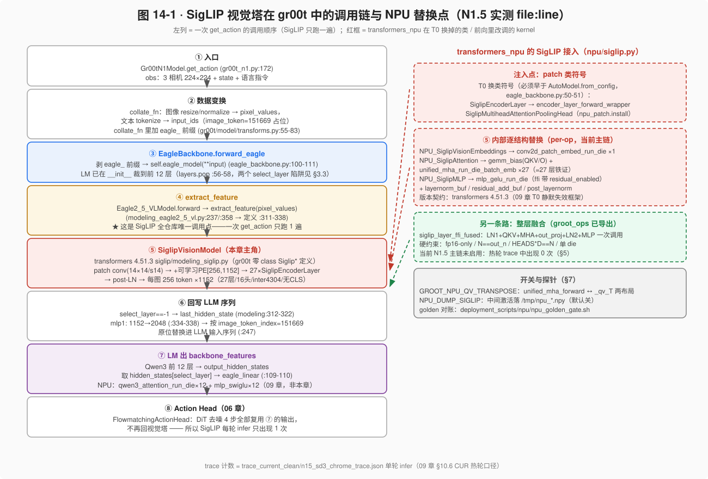
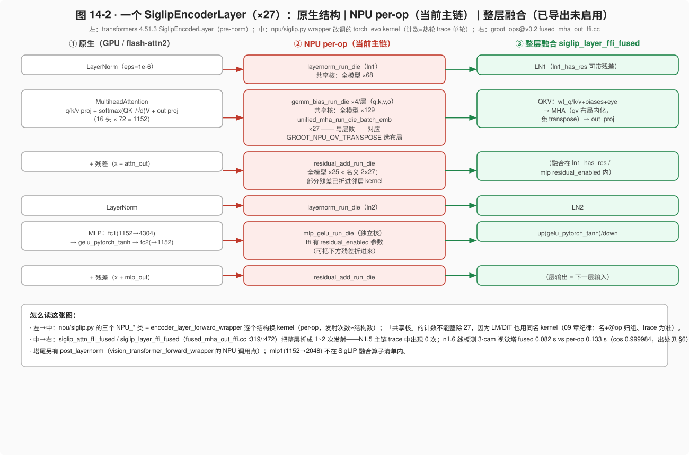
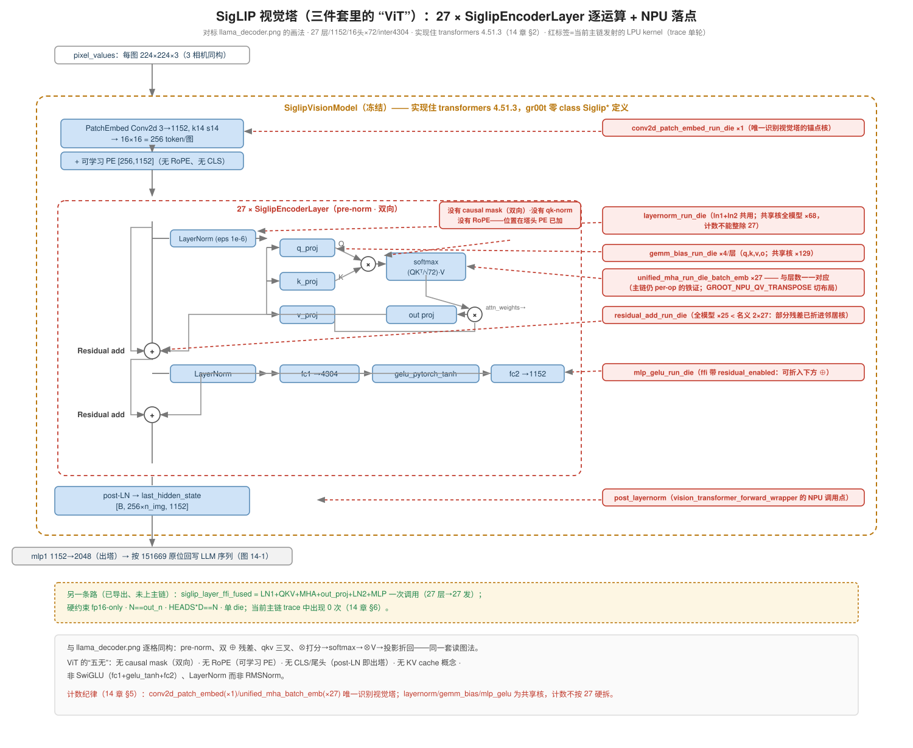

# 14 · SigLIP 视觉塔：从调用链到 NPU 融合算子

> 本章把"视觉塔那一半"专项收口：SigLIP 的实现在哪、被谁在何时调用、
> `transformers_npu` 如何把它逐个结构换到 LPU kernel（当前主链）、`groot_ops`
> 又备好的"整层一次调用"融合入口为何还没上主链。
> **基准**：`Isaac-GR00T@n1.5-release` + `transformers 4.51.3` + `groot_ops@v0.2(7df9a04)`；
> trace 口径 = 09 章 §10.6 的 CUR 热轮（`trace_current_clean/n15_sd3_chrome_trace.json`，单轮 infer）。
> 前置：05 章（视觉塔结构与图 5-1/5-2）、09 章（T0/T1/T2 三级入口、静默失效框架）。

## 1. 为什么单列一章

> **分工定位**：SigLIP 的原生结构与参数全表在 05 章 §2.5（图 5-1/5-2）；本章的主语是
> **NPU 接入**——调用链（§3）只讲到"能归因算子"为止，随后就交给 kernel/trace。
> 所以它是 09 章方法论（T0/T1/T2、版本契约、计数纪律）在视觉塔上的**专项落实**，
> 排在 09/13 之后、作为专题存在，而不是 05 章的续篇。"三件套（ViT+LLM+DiT）"这个
> 心智模型本身的校准，在 04 章 §1.1。

1. **它在瓶颈上**。热轮一轮 infer 的 prologue（backbone 段）≈55 ms，占整轮 36%（09 章 §10.6），
   而 prologue 里视觉塔 27 层是最大的逐层发射源：`unified_mha_run_die_batch_emb` 单轮恰好 ×27，
   与层数一一对应——这就是"每层都在单独发 attention kernel"的铁证。
2. **它每轮只跑一遍**（DiT 去噪 4 步复用 backbone 特征，06 章），所以视觉塔的融合收益
   不会被"步数摊销"稀释，也不会被误记到去噪头上——归因干净。
3. **代码形态特殊**：本地 `gr00t/transformers_npu/npu/siglip.py` **源码被删只剩 pyc**。
   本章顺带演示一套"marshal 考古"方法（§4.1），从字节码符号表重建接入清单——
   这与 09 章"版本契约/静默失效"是同一件事的两面：先要能*看见*接了什么，才谈得上验证没失效。

## 2. 实现归属：SigLIP 的"身体"在 transformers 里，不在 gr00t 里

在 gr00t 仓库里 `grep -r "class Siglip"` 结果是**零**。所有 `SiglipEncoderLayer / SiglipVisionModel`
的类定义都在 `site-packages/transformers/models/siglip/modeling_siglip.py`（conda env `gr00t`，4.51.3）。
gr00t 里能 grep 到的只有三处**胶水**（`gr00t/model/backbone/eagle2_hg_model/modeling_eagle2_5_vl.py`，
vendored remote-code）：

| 位置 | 内容 | 性质 |
| --- | --- | --- |
| `:22` | `from transformers.models.siglip.modeling_siglip import SiglipVisionModel` | import |
| `:110-112` | `model_type=="siglip_vision_model"` → 强制 `_attn_implementation="flash_attention_2"` → 实例化 | 分派实例化 |
| `:62` | `_no_split_modules` 列表里的字符串 `"SiglipEncoderLayer"` | **只是字符串**（device_map 切层用），不是调用 |

所以"SigLIP 怎么算"（LN→MHA→残差→LN→MLP→残差的 pre-norm 结构、`gelu_pytorch_tanh`）
由 transformers 决定；而"NPU 换掉它"（09 章 T0）也只能 patch **transformers 的类符号**。
这正是版本契约的由来：**transformers 一旦升版、类名/前向签名一变，补丁静默失效**。

塔本体参数（`eagle2_hg_model/config.json`，结构详见 05 章 §2.5 与图 5-1）：
27 层 / hidden 1152 / 16 头（head_dim 72）/ patch 14 / 输入 224 / MLP inter 4304 /
**无 CLS**（没有 pooling head 那条路，见 §4.2）/ 可学习 PE `[256,1152]` / 每图 `(224/14)² = 256` token。

## 3. 调用链：一次 get_action 里 SigLIP 出现在哪（图 14-1）



*图 14-1：左列八步 = 一次 `get_action` 的调用顺序（file:line 实测）；右侧红虚线框 = `transformers_npu` 的替换点，绿框 = groot_ops 已导出但主链未启用的整层融合。再生成：`tools/mk_fig_ch14_siglip_flow.py`。*

### 3.1 逐级走读

1. `Gr00tN1Model.get_action`（`gr00t_n1.py:172`）收到 obs（3 相机 224×224 + state + 语言指令）。
2. collate（`gr00t/model/transforms.py:55-83`）：`Eagle2_5_VLProcessor` 出 `pixel_values / input_ids`，
   且**所有 key 加 `eagle_` 前缀**——这是 backbone 与 state/language 处理器共用一个 batch 的分隔手段。
3. `EagleBackbone.forward_eagle`（`eagle_backbone.py:100-111`）：剥 `eagle_` 前缀 →
   `self.eagle_model(**input, output_hidden_states=True)` → 取
   `hidden_states[select_layer]` → 过 `eagle_linear` 出 `backbone_features`。
4. Eagle 前向内 `Eagle2_5_VLModel.forward` 调 `extract_feature(pixel_values)`
   （调用点 `:237` / `:358`，定义 `:311-338`）。
5. **`extract_feature` 是 SigLIP 全仓库唯一调用点**：`select_layer==-1` 时直接取
   `vision_model(...).last_hidden_state`（`:312-322`）→ `mlp1`（1152→2048，`:334-338`）。
6. 回写：`input_ids == image_token_index(151669)` 的位置**原位替换**为视觉嵌入（`:247`）。
7. Qwen3 前 12 层消费图文混合序列，出 `backbone_features`（LM 侧 NPU：
   `qwen3_attention_run_die×12 + mlp_swiglu×12`，那是 09 章的戏份）。
8. Action Head：DiT 去噪 **4 步全部复用第 7 步的输出，不再回视觉塔**——
   所以 trace 里 `conv2d_patch_embed_run_die` 单轮只出现 ×1。

### 3.2 一次还是多次：用 trace 验证"心智模型"

"DiT 复用 hidden、SigLIP 每轮只跑一遍"不是从注释里读来的，是 trace 里数出来的：
`conv2d_patch_embed_run_die` ×1、`unified_mha_run_die_batch_emb` ×27（=27 层×1 遍）。
若哪天重构后这个 27 变成 27×K，说明有人把编码挪进了去噪循环——正是 06 章 §6.5
"循环内编码坍缩事故"的监测器。**计数即断言**。

### 3.3 陷阱备忘：两个同名 `select_layer`

| 出处 | 语义 | 典型值 |
| --- | --- | --- |
| eagle config（`modeling_eagle2_5_vl.py:99`） | **视觉塔**取层：-1=last_hidden_state，否则取 `hidden_states[k]` | -1 |
| backbone 配置（`eagle_backbone.py:56-58`） | **LM**：加载后 `layers.pop` 裁到前 k 层 + 特征 tap 层 | 12 |

两个 `select_layer` 同名不同物、作用于塔的不同部位；改任何一个都不会报错，只会悄悄改特征来源。
05 章批注已记过一次，这里再钉一遍：**读 backbone 代码先问"哪个 select_layer"**。

## 4. T0 注入点：NPU 补丁换掉了哪些符号

### 4.1 pyc 考古：源码只剩字节码时怎么读

`gr00t/transformers_npu/npu/siglip.py` 本地只剩 `__pycache__/siglip.cpython-311.pyc`。
用 `marshal` 直读字节码常量表即可重建结构（python3.11 环境下）：

```python
import marshal
code = marshal.loads(open('gr00t/transformers_npu/npu/__pycache__/siglip.cpython-311.pyc','rb').read()[16:])
def walk(c, d=0):
    print(' '*d + c.co_name)
    for k in c.co_consts:
        if hasattr(k, 'co_names'): walk(k, d+1)
walk(code)
```

得到的骨架（实测输出）：

```
NPU_SiglipVisionEmbeddings   __init__ / _load_lpu / forward
NPU_SiglipAttention          __init__ / _load_lpu / _buf / _tables / forward
_attl_unified_siglip
NPU_SiglipMLP                __init__ / _load_lpu / forward
siglip_encoder_layer_forward_wrapper → new_forward
siglip_encoder_forward_wrapper      → new_forward
vision_transformer_forward_wrapper  → new_forward
_dump / _sav / _ln
```

`_load_lpu`（T1 权重期懒上设备）、`_buf/_tables`（T2 前向期预分配/常量表）正是
09 章三级入口里 T1/T2 的形态；`_dump/_sav` + 字符串 `'/tmp/npu_%s.npy'`、
`NPU_DUMP_SIGLIP` 是探针（§7）。

### 4.2 替换点清单（从 `npu_patch.pyc` 提取）

| transformers 符号 | 换成 | 注入时机 |
| --- | --- | --- |
| `siglip.modeling_siglip.SiglipEncoderLayer` | `siglip_encoder_layer_forward_wrapper` 的 `new_forward`（内部逐结构走 NPU_* 类） | `install_backbone_whole` |
| `siglip.modeling_siglip.SiglipMultiheadAttentionPoolingHead` | `_npu_siglip_pooling_forward` | `install()` |
| （塔级）`vision_transformer_forward_wrapper`、`siglip_encoder_forward_wrapper` | 包 `SiglipVisionTransformer/SiglipEncoder.forward` | 同上 |

两条纪律（09 章 §3.3 的老结论，此处对号入座）：

- **必须早于 `AutoModel.from_config`**（`eagle_backbone.py:50-51`）：类符号替换发生在
  实例化之前才生效；晚一步就是静默失效，症状是"逐 op 现算链复活，~30 ms/轮 host"。
- 换的是 **transformers 模块上的类符号**，不是 gr00t 的胶水——所以版本契约锁的是
  `transformers==4.51.3`，与 gr00t 自身改不改无关。

## 5. Per-op 接入清单：当前主链每一层发什么核（图 14-2）



*图 14-2：同一个 SiglipEncoderLayer（×27）的三栏映射——原生结构 | 当前主链的 per-op kernel | groot_ops 已导出的整层融合。再生成：`tools/mk_fig_ch14_siglip_flow.py`。*

`groot_ops@v0.2` 中 SigLIP 相关算子（`ops/torch_ops/` 三件套 + `*_ffi.cc`）与主链实测计数：

| 层内结构 | ffi 名（torch_evo.*） | kernel 符号 | 单轮 trace 计数 | 归因备注 |
| --- | --- | --- | --- | --- |
| patch embed conv | `conv2d_patch_embed` | `conv2d_patch_embed_run_die(/v2)` | **×1** | 唯一识别视觉塔 |
| LN1 / LN2 / 塔尾 post-LN | `layernorm` | `layernorm_run_die(/v2)` | ×68 | **共享核**（LM/头也用），不能整除 27 |
| q/k/v/out 投影 | `gemm_bias`（导出名见 `gemm_bias_msplit`） | `gemm_bias_run_die(/v2/_m_split)` | ×129 | 共享核；视觉名义 4×27=108 |
| MHA 本体 | `unified_mha`、`unified_mha_qv_emb` | `unified_mha_run_die_batch_emb` | **×27** | 与层数一一对应 |
| MLP（fc1+gelu+fc2） | `mlp_gelu(+_msplit/relu/silu)` | `mlp_gelu_run_die(/_m_split/_v2)` | ×31 | ffi 带 `residual_enabled`（残差可折入） |
| 残差加 | `residual_add` | `residual_add_run_die` | ×25 | **< 名义 2×27**：部分残差已折进邻居核 |
| （备而未用）QKV 三合一 | `linear_qkv` | `linear_qkv_run_fused` | ×4 | 计数显示**不走视觉塔**（视觉 qkv 仍是 4 发 gemm_bias） |

pyc 侧的调用点符号与之对得上：`conv2d_patch_embed, gemm_bias, layernorm_buf, mlp_gelu,
residual_add_buf, unified_mha_forward / unified_mha_forward_qv_T, clone_split, post_layernorm`。

**计数归因三纪律**（本章反复用到的方法论）：

1. **名 + @op 归组、trace 为准**：先按 kernel 名归组，再与结构对数，不吻合处以 trace 为准。
2. **区分"唯一识别核"与"共享核"**：`conv2d_patch_embed(×1)`、`unified_mha_batch_emb(×27)`
   唯一属于视觉塔，是锚点；`layernorm/gemm_bias/mlp_gelu` 全模型共用，计数不能按
   "27 层教科书结构"硬拆（否则一定得出"数目对不上"的假 bug）。
3. **导出 ≠ 启用**：`linear_qkv_run_fused` 有导出、有 ×4 计数，但那 4 次不在视觉塔；
   验证"某个融合是否真在跑"，永远看它的 kernel 在 trace 里的次数。

图 14-2 是"结构→核"的三栏账本；图 14-3 换成与 01 章 llama_decoder.png 同款的
**逐运算画法**：主干竖线 = hidden 逐级下行、左侧绕行 = 残差、中间 qkv 三叉 →
⊗ 打分 → softmax → ⊗V → out proj 折回，MLP 展开为 fc1→gelu_tanh→fc2。
**右侧红标签 = 当前主链真正发射的 LPU kernel 及其 trace 计数**，一眼看清
"每一格运算落在哪个核上"。ViT 与 Llama 骨架的五处不同（无 causal mask、无 RoPE、
无 CLS/尾头、无 KV cache、非 SwiGLU）在图底部集中列出。


*图 14-3：自绘（`tools/mk_fig_vit_llm_dit_stacks.py`）——pre-norm 双残差与 llama_decoder.png 逐格同构；红标签计数纪律见 §5 末三条。与 05 图 5-3、06 图 6-1 同一套读图语法。*

## 6. 另一条路：整层一次调用 `siglip_*_ffi_fused`（已导出，主链未启用）

`groot_ops@v0.2 ops/torch_ops/fused_mha_out/fused_mha_out_ffi.cc` 里备着两档融合：

- **`siglip_attn_ffi_fused`**（`:319` 起）：python 侧一次调用吃掉
  `qT.reshape[H,D,N,L]` 的转场布局 + attention（09 章"布局货币"的极致形态——
  不再 transpose，直接让下家按上家的布局读）。约束：fp16-only（`:344`）、单 die（`:415`）。
- **`SiglipLayerFfiFusedForward` / `siglip_layer_ffi_fused`**（`:472` 起）：
  **LN1(可带残差 `ln1_has_res`) → QKV(wt_q/k/v+biases, eye) → MHA → out_proj → LN2 →
  MLP(up/down) 一次调用**。硬约束：fp16-only（`:489`）、`N==out_n`（`:490`）、
  `HEADS*D==N`、single-die only（`:519`）。SigLIP 恰好 1152=16×72 全对得上——
  约束就是照它设计的。

**现状**：N1.5 主链热轮 trace 里 `siglip_layer/attn_ffi_fused` 出现 **0 次**——
融合核已随 `.so` 导出，但接入层（`npu/siglip.py`）仍停在 per-op。收益预期见下条 n1.6 板测。

**n1.6 线的演进**（⚠ 出处：n1.6 skill 记录与板测，**非本 checkout 代码**，勿混入 v0.2 事实）：
多相机把注意力变成 cross-image 整段，与 within-image 融合假设不符（cos 掉到 **0.71**），
于是把整层融合**拆回** `siglip_layer_ffi_proj + pad + mha` 三档；3-cam 视觉塔
fused **0.082 s** vs per-op **0.133 s**（cos 0.999984）；另踩实 **o_proj 零 bias 须走 fp32**。
教学点：融合粒度不是越粗越好——**布局假设与数据形状（几路相机、注意力跨不跨图）决定粒度**，
这正是 09 章 §4.3"融合粒度阶梯"在视觉塔上的重演。

## 7. 开关、探针与 golden 对账

| 手段 | 位置/形态 | 用法 |
| --- | --- | --- |
| `GROOT_NPU_QV_TRANSPOSE` | `npu/siglip.py`（pyc 字符串实证） | 切 `unified_mha_forward` ↔ `unified_mha_forward_qv_T` 两种 qv 布局；布局类问题的第一个开关 |
| `NPU_DUMP_SIGLIP` | 同上；落 `/tmp/npu_%s.npy`、`/tmp/npu_vl_embs.npy` | 默认关；开后逐 op 落中间激活，与 GPU golden 逐层对 cos |
| golden 门禁 | `Isaac-GR00T/deployment_scripts/npu/npu_golden_gate.sh` | 换核/换布局/升 transformers 后的一键对账 |
| pyc 考古 | §4.1 的 marshal 片段 | 源码缺失时重建接入清单（只读，无副作用） |

## 8. 本章小结

一条链背下来：`get_action → collate(eagle_前缀) → forward_eagle → extract_feature(唯一调用点)
→ SiglipVisionModel(27 层, transformers 实现) → mlp1 → 按 151669 原位回写 → LM 12 层 → DiT 复用不再回塔`。

三句话带走：

1. **实现与胶水分离**：SigLIP 住在 transformers 里，NPU 接入本质是 patch transformers 的类符号，
   所以版本契约锁 transformers==4.51.3，且必须早于 `AutoModel.from_config`。
2. **当前主链是 per-op**：每层约 7~8 发核（LN、4×gemm_bias、unified_mha、mlp_gelu、残差），
   锚点计数 `conv2d×1 / unified_mha×27`；整层融合 `siglip_layer_ffi_fused` 已导出未启用。
3. **融合粒度跟着布局与数据形状走**：n1.6 因 cross-image 注意力把整层融合拆回三档，
   反而更快更准（0.082 s vs 0.133 s，cos 0.999984）。

## 疑问与批注

（待补充）

## 自己动手

1. **数一遍**：用 §5 的口径自己解析 `trace_current_clean/n15_sd3_chrome_trace.json`
   （json 一次 `json.load`，按 `ph=='X'` 的 `name` 计数），复现
   `conv2d_patch_embed_run_die ×1 / unified_mha_run_die_batch_emb ×27`；
   再回答：为什么 `residual_add_run_die` 只有 25 而不是 54？（提示：两个 kernel 名。）
2. **考古一遍**：对 `gr00t/model/__pycache__/npu_patch.cpython-311.pyc` 跑 §4.1 的 walk，
   找出 `install` 与 `install_backbone_whole` 各自 patch 的符号，并解释为什么后者必须
   在 `AutoModel.from_config`（`eagle_backbone.py:50`）之前发生。
3. **推演一遍**：假设要把 `siglip_layer_ffi_fused` 开上 N1.5 主链，动手前检查清单至少
   应包含哪 5 项？（参考：§6 的四条硬约束 + §7 的 golden 门禁 + 09 章静默失效判据；
   答对 4 条以上再动手。）
