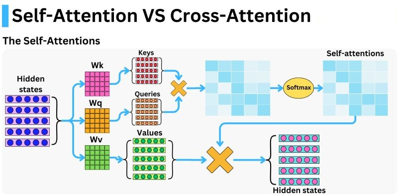
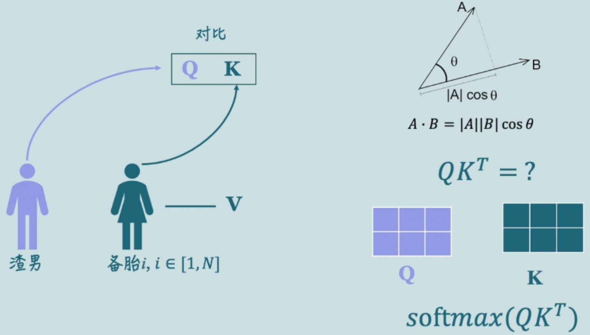

---

# 📑 目录

* [📌 注意力机制 Attention](#注意力机制-attention)
  * [🔹 基本原理：自注意力（Self-Attention）](#基本原理自注意力self-attention)
  * [🔹 多头注意力机制 Multi-Head Attention](#多头注意力机制multi-head-attention)
  * [🔹 掩码注意力 Masked Attention](#掩码注意力masked-attention)
  * [🔹 一句话理解 Attention](#一句话理解-attention)
  * [🔹 注意力优化技术](#注意力优化技术)
  * [🔹 MQA与GQA 详解](#多头注意力机制-mqa与gqa)
  * [🔹 Flash Attention 优化](#flash-attention)
  * [🔹 Flash Attention 优化：Streaming Softmax](#flash-attention-的关键优化streaming-softmax)

---

以下是《📌 注意力机制 Attention》小节的技术总结，聚焦于 LLaMA 等大模型所采用的注意力机制及其演进

---

# 注意力机制 Attention

注意力机制（Attention Mechanism）是大型语言模型（LLM）的核心组件，它决定了模型在处理输入序列时如何动态地聚焦于最相关的信息。自从 Transformer 架构引入自注意力机制以来，注意力成为语言建模中提升表达能力与并行计算效率的关键手段。
在深度学习中，**注意力机制**的核心思想是：**在处理一组输入信息时，模型可以自动地“关注”最相关的部分**。这种机制帮助模型动态地分配“注意力权重”，类似人类在处理信息时聚焦重点。


## 基本原理：自注意力（Self-Attention）

在自注意力机制中，模型为输入序列中的每个位置计算一个“注意力分数”，以衡量该位置与其他位置的关系。计算公式如下：

$$
\text{Attention}(Q, K, V) = \text{softmax}\left(\frac{QK^T}{\sqrt{d_k}}\right)V
$$

其中：

* $Q$：Query 向量，表示当前关注的位置；
* $K$：Key 向量，表示参考的上下文位置；
* $V$：Value 向量，表示每个位置的值信息；
* $d_k$：Key 向量的维度，用于缩放防止梯度爆炸。

这种机制允许模型从输入序列的所有位置中“挑选”出最重要的信息，并对其进行加权组合。


[](https://raw.githubusercontent.com/zongwave/pixelcraft/main/ai/llm/attention/diagram/self-attention_sdpa.jpg)

---

## 多头注意力机制（Multi-Head Attention）

为了提升表达能力，Transformer 使用了 **多头注意力机制（Multi-Head Attention）**，即在不同的子空间中并行计算多个注意力输出，并将它们拼接融合：

$$
\text{MultiHead}(Q, K, V) = \text{Concat}(\text{head}_1, \dots, \text{head}_h)W^O
$$

每个 head 计算方式为：

$$
\text{head}_i = \text{Attention}(QW^Q_i, KW^K_i, VW^V_i)
$$

这种方式使模型能够同时关注不同位置、不同语义维度的信息。
模型将 Q、K、V 切分成多个子空间，**并行计算多个注意力头**，让每个头关注不同的信息粒度：

---

在多头注意力（Multi-Head Attention, MHA）机制中，我们通常处理的是三类张量：**输入嵌入（input embedding）**、**QKV投影矩阵**、**注意力得分（attention score）**。

---

我们现在以 **Decoder 自注意力（Self-Attention）** 为例，假设 `L_q = L_k = L`，即 query、key 来自同一个 decoder 序列，维度统一记为 $L$，我们来**逐步推导 softmax 的计算维度**。

---

### ✅ 前提设定（多头注意力）

设：

* batch size：$B$
* head 数量：$H$
* 每个 head 的维度（即特征维度）：$D$
* decoder 输入序列长度：$L$
* 总 hidden\_dim = $H \times D$

输入为 decoder 序列 `X ∈ ℝ^{B × L × hidden_dim}`，经过 Q/K/V 的线性变换与 reshape 得到：

* $Q ∈ ℝ^{B × H × L × D}$
* $K ∈ ℝ^{B × H × L × D}$
* $V ∈ ℝ^{B × H × L × D}$

---

### 🧩 输入维度定义

* `batch_size = B`（样本数量）
* `seq_len = L`（序列长度）
* `hidden_dim = D`（通常等于 `num_heads × head_dim`）
* `num_heads = H`
* `head_dim = d = D / H`（每个注意力头的维度）

输入张量的维度为：

```python
input: (B, L, D)
```

---

### 🔁 Q/K/V 投影矩阵的维度

每个输入通过线性投影变成 Q、K、V 向量：

```python
Q = input @ W_Q    # shape: (B, L, D)
K = input @ W_K    # shape: (B, L, D)
V = input @ W_V    # shape: (B, L, D)
```

其中 `W_Q, W_K, W_V ∈ ℝ^{D × D}`，也可以看成是：

```python
W_Q = nn.Linear(D, D)
```

再 reshape 成多头形式（按 `H` 个头分开）：

```python
Q → (B, H, L, d)
K → (B, H, L, d)
V → (B, H, L, d)
```

---

### 🧮 Attention Score 的计算


注意力得分是通过 Q 与 K 的点积得到的：（QK^T）

我们做矩阵乘法：

$$
\text{score} = \frac{Q \cdot K^T}{\sqrt{D}}  
$$

其中 $K^T$ 是对最后两个维度做转置（D 和 L），所以：

* $Q ∈ ℝ^{B × H × L × D}$
* $K^T ∈ ℝ^{B × H × D × L}$
* → 打分结果为：

  $$
  \text{score} ∈ ℝ^{B × H × L × L}
  $$

这是一个 **L × L 的打分矩阵**，即第 $i$ 个位置的 token 对所有 key 的打分。


```python
score = Q @ K.transpose(-1, -2) / sqrt(d)
```

其维度为：

```python
score: (B, H, L, L)
```

解释：

* 每个头的 Q 是 `(L, d)`，K 是 `(L, d)`，所以 `Q × Kᵗ → (L, L)`
* 有 `H` 个头，所以最终是 `(B, H, L, L)`，表示每个位置对所有其他位置的关注程度

---


### ✅ Softmax 操作维度

Softmax 是在最后一维（即 key 序列维度）进行的：

$$
\text{attention\_weights}_{i,j} = \frac{\exp(\text{score}_{i,j})}{\sum_{j'} \exp(\text{score}_{i,j'})}
$$

因此：

* 对 shape 为 $[B × H × L × L]$ 的 score：

  * **在最后一个维度（L\_k）上做 softmax**
  * 每一个 query（共 L\_q 个）对所有 key（L\_k 个）计算注意力权重

---

### ✅ 应用权重计算输出

最后一步是将注意力权重乘上 Value：

$$
\text{output} = \text{softmax(score)} × V
$$

即：

* $[B × H × L × L]$ × $[B × H × L × D]$
* 得到 $output ∈ ℝ^{B × H × L × D}$

再 reshape 回 $[B × L × (H×D)]$ 即可。

---

### 🧠 总结（Decoder 自注意力模式下）


| 步骤               | 矩阵     | 维度（假设 L\_q = L\_k = L） | 操作维度说明            |
| ---------------- | ------ | ---------------------- | ----------------------------- |
| Input           |         | `(B, L, D)`            |    原始输入嵌入                 |
| Q/K/V           |         | `(B, L, D)`            | 投影后的查询、键、值           |
| Q/K/V (头分离后) |         | `(B, H, L, d)`         |  拆分为多个头，每头维度为 `d = D / H` |
| Q                | Query  | $B × H × L × d$        | —                             |
| K                | Key    | $B × H × L × d$        | —                             |
| V                | Value  | $B × H × L × d$        | —                             |
| Q·Kᵀ             | Scores | $B × H × L × L$        | 最后两个 L 是：每个 query 对所有 key 的打分 |
| Softmax          | —      | $B × H × L × L$        | **在最后一个维度做 softmax（L\_k）**    |
| Attention Output | —      | $B × H × L × d$        | 对每个 query 得到加权和               |


---

## 掩码注意力（Masked Attention）

在 LLM 里，**我们不希望模型偷看未来的信息**。所以在训练中对未来位置进行掩码处理，仅允许模型关注当前及以前的位置（即“左下三角”注意力矩阵）。

在 Transformer 中使用的掩码（mask）机制有助于限制模型的注意力范围，防止非法信息泄漏（如未来信息）或处理缺失/填充内容。常见的 Mask 类型主要包括以下几种：

---

### ✅ Transformer 中常见的 Mask 类型

| 掩码名称             | 英文名                           | 用途                   | 说明                                           |
| ---------------- | ----------------------------- | -------------------- | -------------------------------------------- |
| **填充掩码**         | Padding Mask                  | 屏蔽掉输入中无效的 padding 部分 | 防止模型关注填充（<pad>）token，常用于编码器和解码器              |
| **序列掩码 / 自回归掩码** | Causal Mask / Look-ahead Mask | 防止模型看到“未来”的 token    | 生成任务中使用，仅允许当前 token 看到之前位置的输出（左下三角）          |
| **解码器编码器掩码**     | Encoder-Decoder Mask          | 控制解码器对编码器输出的注意力      | 一般结合 padding mask，防止关注编码器输出中的 pad 部分         |
| **显式注意力掩码**      | Custom Attention Mask         | 根据任务自定义的注意力限制        | 例如只让某些 token 关注特定位置，或构建稀疏注意力模式（如 Longformer） |

---

### 🔍 各种 Mask 的具体形式与示意图

**1. Padding Mask（填充掩码）**

**输入示例**：

```text
[CLS] I love NLP [PAD] [PAD]
```

**掩码矩阵**：

```text
[1, 1, 1, 0, 0]  ← 1 表示保留，0 表示屏蔽
```

常用于：编码器和解码器的 self-attention、cross-attention。

---

**2. Causal / Look-ahead Mask（自回归掩码）**

限制模型只能看见当前位置及之前的 token。下图是一个 4×4 的 Causal Mask：

```
[[1, 0, 0, 0],
 [1, 1, 0, 0],
 [1, 1, 1, 0],
 [1, 1, 1, 1]]
```

也可表示为布尔型：

```python
mask = torch.tril(torch.ones(seq_len, seq_len)).bool()
```

常用于：解码器中的 self-attention。

---

**3. Encoder-Decoder Mask（解码器跨注意力掩码）**

用于限制 decoder 在 cross-attention 阶段仅关注 encoder 有效输出。

通常配合 padding mask，例如：

```text
encoder输出: "I love NLP [PAD]"
→ mask:       [1, 1, 1, 0]
```

---

**4. Custom Attention Mask（任务特定掩码）**

如稀疏注意力、局部窗口注意力、可学习 mask：

* [Longformer](https://arxiv.org/abs/2004.05150): 局部 + 全局 mask
* [BigBird](https://arxiv.org/abs/2007.14062): 随机 + 全局 + 局部注意力 mask
* [Perceiver](https://arxiv.org/abs/2103.03206): latent-to-input 的异构 mask

---

### 🧠 补充：掩码在实现中的表现形式

| 类型       | 实现中形式                                        | 应用位置               |
| -------- | -------------------------------------------- | ------------------ |
| 布尔型 Mask | `True/False` 矩阵                              | PyTorch、TensorFlow |
| 值 Mask   | 用 `-inf` 或 `-1e9` 等填充被 mask 位置，在 softmax 前屏蔽 | logits 上操作，数值稳定性高  |
| 权重 Mask  | 在 attention score 上乘权重                       | 特定稀疏注意力实现中         |

---


### ✅ 背景：Causal Mask 的作用

在 **自回归语言模型（如 GPT）** 中，causal mask 用于防止当前 token 看到未来的 token。

核心思想是在 `attention_scores` 上加一个 **下三角矩阵的 mask**，用 `-inf`（或非常大的负数）填充非法位置，然后再进行 softmax，从而将其注意力值变为 0。

---

### 🧪 示例：PyTorch + HuggingFace 中计算 attention scores + causal mask

```python
import torch
import torch.nn.functional as F

# 假设我们有一个 batch size = 1, 序列长度为 5，hidden_dim = 8
seq_len = 5
d_k = 8  # 注意力维度

# 模拟查询、键张量（Q, K），形状: [batch_size, num_heads, seq_len, d_k]
Q = torch.rand(1, 1, seq_len, d_k)
K = torch.rand(1, 1, seq_len, d_k)

# 1. 计算 Attention Score: QK^T / sqrt(d_k)
attention_scores = torch.matmul(Q, K.transpose(-2, -1)) / d_k**0.5
# 结果维度: [1, 1, seq_len, seq_len]

# 2. 构造 Causal Mask：下三角为1，上三角为0
causal_mask = torch.tril(torch.ones(seq_len, seq_len)).bool()  # shape: [seq_len, seq_len]
causal_mask = causal_mask.unsqueeze(0).unsqueeze(0)  # -> [1, 1, seq_len, seq_len]

# 3. 应用 mask: 将无效位置设为 -inf
attention_scores = attention_scores.masked_fill(~causal_mask, float('-inf'))

# 4. Softmax 归一化
attention_probs = F.softmax(attention_scores, dim=-1)

# 5. Attention_probs 即为 masked attention weights
print(attention_probs)
```

---

### 🎯 注意事项

* `masked_fill(~mask, -inf)` 中使用 `~` 是因为 mask 为 “允许位置”，我们要屏蔽的是“不允许的位置”。
* 在实际模型中，batch\_size 和 num\_heads 通常 >1，代码中会进行广播处理。
* HuggingFace 中，这部分通常由 `modeling_utils.py` → `apply_attention_mask()` 或 `attn_mask` 参数内部处理。

---

### 📌 与 HuggingFace 源码结合

在如 GPT2 模型中（`transformers/models/gpt2/modeling_gpt2.py`），你会看到类似如下逻辑：

```python
# attention_scores: [batch, heads, query_len, key_len]
attention_scores = torch.matmul(query, key.transpose(-1, -2)) / math.sqrt(self.head_dim)

# apply causal mask (lower triangular)
if causal_mask is not None:
    attention_scores = attention_scores.masked_fill(causal_mask == 0, -inf)

# softmax
attention_probs = nn.Softmax(dim=-1)(attention_scores)
```

---


## 一句话理解 Attention

> 给每个输入打分，再根据分数对它们加权求和，形成最终输出。

---

### 📐 数学公式与直观解释

经典的 **Scaled Dot-Product Attention** 公式如下：

$$
\text{Attention}(Q, K, V) = \text{softmax}\left(\frac{QK^T}{\sqrt{d_k}}\right)V
$$

* **Q（Query）**：当前要处理的位置，代表“我想找什么样的信息”
* **K（Key）**：输入中的其他位置，代表“我能提供什么”
* **V（Value）**：输入的实际内容，“我要传递的值”

### 通俗类比：渣男筛选备胎

你可以把 Q 看成“渣男的择偶标准”，K 看成“备胎们的条件”，V 是“每个备胎能提供的价值”。
当渣男（Query）去挑选备胎时，他会：

1. 拿自己的择偶标准（Q）去和每个备胎的条件（K）**点乘**算相似度。
2. 对相似度打分（通过 softmax 转成概率）。
3. 用这个分数加权每个备胎的价值（V）——这决定了他最终会“最关注哪位”。


[](https://raw.githubusercontent.com/zongwave/pixelcraft/main/ai/llm/attention/diagram/qkv.png)


### 为什么要除以 $\sqrt{d_k}$？

点积的值随着向量维度 $d_k$ 增大会变大，从而导致 softmax 输出非常尖锐，模型可能过度关注少数输入。因此除以 $\sqrt{d_k}$ 起到归一化的作用，让 softmax 更平滑，梯度更稳定。

---


### 🚀 小结

| 组成           | 含义     | 类比               |
| ------------ | ------ | ---------------- |
| Q            | 你想找的信息 | 渣男的择偶要求          |
| K            | 候选项的描述 | 每个备胎的实际条件        |
| V            | 候选项的内容 | 每个备胎能带来的“价值”     |
| 点积 + softmax | 匹配度评估  | 谁更符合要求就更受关注      |
| 加权求和         | 输出融合   | 形成当前 token 的最终表示 |

---


## 注意力优化技术

以下是 **7种注意力优化技术** 按照**在大模型实际部署中的实用性**进行的排序与通俗解释。排序标准综合了：当前主流模型（如 LLaMA、GPT-3.5/4、Mixtral、Claude 等）的采用情况、推理加速效果、部署复杂度与对精度的影响。

---

**🥇 1. FlashAttention ✅【高实用性｜广泛部署】**

* **原理**：将注意力计算拆成小块（tile），避免中间结果写入显存，减少内存访问。
* **通俗解释**：就像洗衣服时不每洗一件就晾一次，而是洗一批、脱水一批、一次晾好，大大节省操作时间。
* **已应用于**：LLaMA2/LLaMA3、GPT-NeoX、Mistral 等。
* **优点**：大幅提升训练和推理速度；不改动模型结构；几乎无精度损失。

---

**🥈 2. KV 缓存（Key-Value Caching） ✅【必备于推理｜部署实用性极高】**

* **原理**：只计算新 token 的 Query，历史 Key/Value 用缓存直接参与计算，避免重复工作。
* **通俗解释**：像写作文时，你不会每次从头阅读所有内容再写新句子，而是记住前面写了什么，只思考接下来怎么接。
* **已应用于**：几乎所有大模型推理部署，如 GPT-2/3/4、LLaMA、Mixtral。
* **优点**：推理提速数十倍；无损精度；实现简单。

---

**🥉 3. Multi-Query Attention（MQA） / Grouped-Query Attention（GQA） ✅【推理资源优化利器】**

* **原理**：

  * MQA：所有 attention head 共享同一套 K/V。
  * GQA：多个 Q head 共享一组 K/V，兼顾速度与表达力。
* **通俗解释**：就像多个客户服务代表（Q）只需看一份共享 FAQ 文档（K/V），不用每人准备一套资料。
* **已应用于**：GPT-3.5、GPT-4、LLaMA2 等几乎所有新一代模型。
* **优点**：显著减少内存与计算量；精度影响很小。

---

**🏅 4. Rotary Positional Embedding（RoPE） ✅【广泛部署｜精度增强】**

* **原理**：把位置编码“融入” Q/K 的方向（相位），让模型感知相对位置，而非绝对编号。
* **通俗解释**：就像你记得某句话在“前面几句”而不是“第42句话”。
* **已应用于**：LLaMA系列、ChatGLM、RWKV 等。
* **优点**：轻量、无参数；支持无限扩展位置；提升上下文理解力。

---

**🧩 5. 编译器级优化（Operator Fusion） ⚙️【训练/部署深度优化】**

* **原理**：将注意力内多个子操作（QKV投影、Softmax、Dropout等）合并为一个高效 kernel。
* **通俗解释**：像是把切菜、炒菜、装盘合并成自动炒菜机，一键完成整个流程。
* **已应用于**：FlashAttention、TensorRT、XLA、OneDNN、AITemplate等框架。
* **优点**：自动优化，节省硬件资源；可与 FlashAttention 等结合使用。

---

**🧠 6. 分组/局部注意力（Grouped / Sliding Window Attention） 🔍【长序列处理专用】**

* **原理**：每个 token 只看邻近一小段内容，避免全局注意力。
* **通俗解释**：像看小说时你只关注当前一页而不是整本书，节省精力。
* **已应用于**：Longformer、BigBird、ChatGLM3-6B（可选）、Claude（混合形式）。
* **优点**：可处理上万 token 长文本；计算从 \$O(n^2)\$ 降为 \$O(nw)\$。
* **限制**：适合特定场景，可能损失全局语义。

---

**🧪 7. 稀疏注意力 / MoE-Attention（专家路由注意力） ⚗️【前沿探索中】**

* **原理**：仅激活部分注意力路径或 Head，减少冗余计算。
* **通俗解释**：就像面对考试题目，你只做会的题，省时间又不拖后腿。
* **已应用于**：MoE 模型（Mixtral）、一些前沿 Sparse-Attention 研究。
* **优点**：计算量下降显著，潜力巨大。
* **限制**：部署复杂，训练调优难度高。

---

**🧾 总结表格（按实用性排序）**

| 排名  | 优化技术               | 主要作用           | 应用阶段  | 是否常用   | 简要说明                |
| --- | ------------------ | -------------- | ----- | ------ | ------------------- |
| 🥇  | FlashAttention     | 加速注意力计算，减少显存写入 | 训练+推理 | ✅ 常用   | 核心 Attention 实现替代方案 |
| 🥈  | KV 缓存              | 避免重复历史计算       | 推理    | ✅ 必备   | 缓存历史 Key/Value      |
| 🥉  | MQA / GQA          | 降低显存/计算量       | 推理    | ✅ 广泛   | 多头注意力共享 Key/Value   |
| 4️⃣ | RoPE               | 引入相对位置信息       | 训练+推理 | ✅ 主流   | 更自然的位置信息建模          |
| 5️⃣ | 编译器融合优化            | 减少中间计算节点       | 编译部署  | ✅ 隐性常见 | Kernel 融合，提升执行效率    |
| 6️⃣ | 分组/局部注意力           | 降低长序列计算复杂度     | 长文本任务 | ⚠️ 特定  | 长文本推理，适用于专用模型       |
| 7️⃣ | 稀疏 / MoE-Attention | 稀疏激活关键路径       | 研究探索中 | ⚗️ 前沿  | 尚在研究与尝试阶段           |

---

我们继续详细解释 **MQA（Multi-Query Attention）** 和 **GQA（Grouped-Query Attention）**，包括它们的背景动因、结构差异、性能影响，并配以图示和代码帮助理解。

---


## 多头注意力机制 MQA与GQA


在大模型尤其是推理阶段中，注意力机制的瓶颈之一在于 **Key 和 Value 的重复计算与存储**。传统的多头注意力（Multi-Head Attention）为每个头独立计算 Q、K、V，这带来精度上的灵活性，但也显著增加了内存和带宽压力。

因此，出现了以下优化方案：

### ✅ 1. MQA（Multi-Query Attention）

#### 🌟 定义

MQA 是一种**共享 Key 和 Value** 的注意力机制。虽然有多个 Query 头，但所有这些头**共享同一组 K 和 V**。

#### 📈 优势

* **减少 KV 缓存的大小**（从 `h × T × d` 降为 `1 × T × d`，其中 `h` 是注意力头数）
* 减少带宽与计算资源，推理加速显著，特别适合长序列生成。

#### 🔧 结构示意图

```text
      Q1      Q2      Q3      ...     Qh
       │       │       │              │
       └───────┴───────┴───────...────┘
               ↓ (attention score with)
             Shared K, Shared V
```

#### 🧠 示例代码（PyTorch）

```python
import torch
import torch.nn.functional as F

batch_size, seq_len, dim = 1, 10, 512
num_heads = 8
head_dim = dim // num_heads

# MQA: Q is per-head, K and V are shared
Q = torch.randn(batch_size, num_heads, seq_len, head_dim)
K = torch.randn(batch_size, 1, seq_len, head_dim)   # Shared K
V = torch.randn(batch_size, 1, seq_len, head_dim)   # Shared V

# Attention scores: [B, h, T, T]
scores = torch.matmul(Q, K.transpose(-2, -1)) / head_dim**0.5
attn_weights = F.softmax(scores, dim=-1)
output = torch.matmul(attn_weights, V)  # V is shared
```

---

### ✅ 2. GQA（Grouped-Query Attention）

#### 🌟 定义

GQA 介于传统 MHA 和 MQA 之间。将多个头划分为组，每组共享一套 K 和 V。比如 `16 个 Q 头 + 4 组 KV`。

#### 📈 优势

* **在节省计算的同时，保留部分多样性与表达能力**
* 是多数大模型（如 GPT-3.5、LLaMA）当前采用的折中策略

#### 🔧 结构示意图

```text
     ┌──── Q1 ────┐
     │            │
     └──── Q2 ────┘ ┐
                    │ G1 共享 K/V
     ┌──── Q3 ────┐ ┘
     │            │
     └──── Q4 ────┘ ┐
                    │ G2 共享 K/V
        ...        ┘
```

#### 🧠 示例代码（PyTorch）

```python
num_query_heads = 8
num_kv_heads = 2  # group size = 4
group_size = num_query_heads // num_kv_heads

Q = torch.randn(batch_size, num_query_heads, seq_len, head_dim)
K = torch.randn(batch_size, num_kv_heads, seq_len, head_dim)
V = torch.randn(batch_size, num_kv_heads, seq_len, head_dim)

outputs = []
for i in range(num_query_heads):
    group_id = i // group_size
    q = Q[:, i]
    k = K[:, group_id]
    v = V[:, group_id]
    score = torch.matmul(q, k.transpose(-2, -1)) / head_dim**0.5
    attn = F.softmax(score, dim=-1)
    out = torch.matmul(attn, v)
    outputs.append(out)

output = torch.stack(outputs, dim=1)
```

---

#### 📊 对比总结

| 特性           | MHA（标准）   | MQA          | GQA                     |
| ------------ | --------- | ------------ | ----------------------- |
| Query 头数     | 多         | 多            | 多                       |
| Key/Value 数量 | 每个头独立     | 单组共享         | 每组共享                    |
| 表达能力         | 强         | 弱            | 中等                      |
| 推理速度/效率      | 低         | 高            | 较高                      |
| 应用例子         | BERT, ViT | PaLM, Gemini | GPT-3.5, LLaMA, Mistral |

---

#### 🚀 实战建议

* 如果你在部署场景中关注推理效率，**MQA 和 GQA 是必须掌握的技术**。
* LLaMA 默认采用 GQA，参数比例为：`n_q_heads = 32, n_kv_heads = 8`，即每 4 个 Q 头对应一组 KV。
* 编写自己的模型实现时，GQA 需要注意 **Q 和 KV 的分组匹配关系**，否则输出维度可能不一致。


---


## Flash Attention

Flash Attention 是一种**高效计算 Transformer 中注意力（Attention）机制**的优化方法，旨在减少内存访问、加快训练速度，并提升计算精度。

---

### 🔧 背景问题

标准的 **Scaled Dot-Product Attention** 计算如下：

```python
Attention(Q, K, V) = softmax(QKᵀ / √d_k) @ V
```

这一过程存在两个主要瓶颈：

1. **中间矩阵太大**：QKᵀ 是一个 (seq\_len, seq\_len) 的大矩阵，会消耗大量显存（尤其是长序列时）。
2. **内存带宽受限**：需要频繁读写中间结果（QKᵀ、softmax、最终结果），造成显存读写瓶颈。

---

### 💡 Flash Attention 的核心思想

**边算边 softmax，直接写入最终输出结果，避免中间缓存！**

> 其灵感来自数值稳定的 softmax 与分块矩阵乘法。

#### 核心优化点：

| 优化维度           | 说明                                              |
| -------------- | ----------------------------------------------- |
| ✅ 分块处理         | 将序列划分为多个块，块内计算 attention，降低内存压力                 |
| ✅ Fused Kernel | 使用 GPU 的 CUDA kernel 融合 QK、Softmax、V 操作，一次性完成   |
| ✅ 避免中间保存       | 不显式保存 QKᵀ 或 Softmax(QKᵀ)，只保留最终输出                |
| ✅ 数值稳定性        | 采用 `log-sum-exp` trick 在块级别稳定 softmax 计算，防止梯度爆炸 |

---

### 📉 成果对比（论文中的结论）

* **速度提高 2x\~4x**
* **显存使用降低 10x（尤其在长序列）**
* **支持更长序列（10K+）且保持精度**
* **用于 GPT、BERT、ViT、T5 等模型中性能显著优于传统 Attention**

---

### 🧪 Flash Attention 原理图解（逻辑流程）

```text
     Q          K           V
     ↓          ↓           ↓
[块级 matmul] × [转置 K]           ← 不缓存 QKᵀ
     ↓
[数值稳定 softmax]                 ← 每个块内部做
     ↓
[matmul with V]                   ← 直接生成结果
     ↓
   Output
```

---


### 🚀 应用场景

* 长序列训练：e.g. 文本生成、音乐建模、蛋白质序列等
* 训练大语言模型（LLM）：如 GPT-3、PaLM、LLaMA 等
* Hugging Face、OpenAI、PyTorch 都已支持 FlashAttention 1/2

---

### 🧮 FlashAttention vs Standard Attention

| 方面   | 标准 Attention | FlashAttention               |
| ---- | ------------ | ---------------------------- |
| 显存消耗 | O(seq\_len²) | O(seq\_len)（线性级别）            |
| 计算速度 | 慢            | 快（CUDA 加速）                   |
| 可扩展性 | 难以扩展到长序列     | 易于扩展（10K+ token）             |
| 精度   | 无优化          | 稳定（块内 softmax + log-sum-exp） |


---


### ✅ 原理简述：为什么可以不显式保存中间矩阵？

在标准的注意力计算中，存在以下步骤：

```
Attention(Q, K, V) = softmax(QKᵀ / √d) @ V
```

* 通常需要显式计算出 `QKᵀ`，这是一个 `seq_len x seq_len` 的矩阵。
* 然后对其做 Softmax，并与 V 相乘。
* **内存开销** = 显式保存 `QKᵀ` 和 `softmax(QKᵀ)`，尤其当 `seq_len` 很长时，占用显存巨大。

---

### ⚡ Flash Attention 如何优化？


Flash Attention 之所以能够**避免中间保存 QKᵀ 和 Softmax(QKᵀ)**，核心就是采用了 **fused kernel（融合内核）**，并结合 **块状计算（tiling）** 和 **流式（streaming）Softmax** 技术来实现。这种方式在性能与显存优化上都有显著优势。

#### 1. **块状计算（Tiling）**

* 将 Q、K、V 拆成小块（tile），例如 64x64。
* 一次只处理一个 tile，从而避免一次性存入完整的 `QKᵀ` 矩阵。

#### 2. **在线 Softmax 归一化（Streaming Softmax）**

* Softmax 不需要先获得全部的 `QKᵀ` 结果。
* 可以通过如下公式 **分步归一化**：

  $$
  \text{softmax}(x) = \frac{e^{x_i - \max(x)}}{\sum_j e^{x_j - \max(x)}}
  $$

  在处理块的时候，维护：

  * 当前最大值 `m`（用于数值稳定性）
  * 当前 `exp_sum`（分母部分）
  * 当前累积的 `weighted_V`（最终结果）


---


## Flash Attention 的关键优化：Streaming Softmax

FlashAttention 的目标是避免构建完整的 $QK^\top$ 矩阵，也就是避免显式存储 logits（注意力得分），而是 **在分块计算的过程中就完成 softmax 归一化与加权求和**。

这依赖于 softmax 可数值稳定地 **分块更新**，即：

### ✅ 分块更新的三个状态变量：

1. **最大值 $m$**：每一块的最大 logits
2. **规范化分母 $Z = \sum_j e^{x_j - m}$**（用于归一化）
3. **当前累积的 weighted\_sum：$\sum_j \text{softmax}_j \cdot V_j$**

---

### Softmax 的定义与数值稳定形式

对于向量 $x = [x_1, x_2, \dots, x_n]$，softmax 是：

$$
\text{softmax}(x_i) = \frac{e^{x_i}}{\sum_{j=1}^{n} e^{x_j}}
$$

为了防止数值溢出，通常使用稳定形式：

$$
\text{softmax}(x_i) = \frac{e^{x_i - m}}{\sum_j e^{x_j - m}}, \quad \text{其中 } m = \max_j x_j
$$

---

### 🚧 为什么可以分块更新？

**1. 最大值可以逐步更新**

设：

* 块1的最大值为 $m_1$
* 块2的最大值为 $m_2$

那么总的最大值就是 $m = \max(m_1, m_2)$

---

**2. 分母 $Z$（归一化项）可以这样更新：**

设：

* 第一块归一化项是：

  $$
  Z_1 = \sum_{j \in \text{block}_1} e^{x_j - m_1}
  $$
* 第二块是：

  $$
  Z_2 = \sum_{j \in \text{block}_2} e^{x_j - m_2}
  $$

如果 $m_1 \ne m_2$，则不能直接相加它们，需要转换到共同基准的最大值 $m = \max(m_1, m_2)$，这时有：

$$
Z = e^{m_1 - m} \cdot Z_1 + e^{m_2 - m} \cdot Z_2
$$

这就是 **指数的乘法可合并性**：

> $$
> e^{x - m_1} = e^{x - m} \cdot e^{m - m_1}
> $$

---

**3. 加权值也可以更新**

类似地，softmax 的输出部分是：

$$
\sum_j \text{softmax}(x_j) \cdot V_j = \sum_j \frac{e^{x_j - m}}{Z} \cdot V_j
$$

对于分块更新时，每一块的加权和为：

$$
\text{weighted}_1 = \sum_{j \in \text{block}_1} e^{x_j - m_1} \cdot V_j
$$

更新到全局基准 $m = \max(m_1, m_2)$ 下：

$$
\text{weighted} = e^{m_1 - m} \cdot \text{weighted}_1 + e^{m_2 - m} \cdot \text{weighted}_2
$$

最终归一化：

$$
\text{Output} = \frac{\text{weighted}}{Z}
$$

---

### 🧾 Z\_new 是什么？

* 在每一块中计算 softmax 时，我们记录当前块的最大值 $m_i$，并计算其局部归一化因子 $Z_i$
* 当下一个块到来时，我们更新全局最大值 $m$，然后使用：

  $$
  Z_{\text{new}} = e^{m_1 - m} \cdot Z_1 + e^{m_2 - m} \cdot Z_2
  $$
* 这一步就是更新归一化因子 $Z$，因此：

> ✅ **Z\_new 就是 softmax 总归一化分母，已考虑所有已处理块并基于最新最大值重新标准化过后的结果**

---

### 🚀 为什么这是优化？

**1. 减少内存使用**

   * 不保存 $QK^\top$
   * 不保存中间 softmax 值
   * 避免缓存 logits 和 softmax 整个矩阵

**2. 提升计算效率**

   * 分块计算时，直接执行 fused kernel 完成 score + softmax + weight sum
   * Cache locality 更好，尤其适合 GPU 上快速寄存器操作

**3. 易于并行化**

   * 每个块可以独立处理，只需合并状态变量（最大值、Z、weighted sum）

---

### ✅ 总结

| 项目     | 原始 Softmax           | FlashAttention（Streaming Softmax） |
| ------ | -------------------- | --------------------------------- |
| 最大值    | 一次性计算                | 分块更新（取最大）                         |
| 分母 Z   | 一次性求和                | 分块转换 + 归一化累加                      |
| 输出     | 先求所有 softmax 再加权     | 在每块中直接累加 weighted sum             |
| 内存占用   | 需要存 logits 和 softmax | 只保留当前最大值、Z 和结果                    |
| 关键数学机制 | softmax 的归一化结构       | 指数运算的乘法拆解能力                       |


### **Fused kernel（融合内核）**

* 将 `QKᵀ` 的点积、Softmax 和 `@ V` 三个操作 **融合成一个 CUDA 核函数（kernel）**，直接计算最终输出：

  $$
  \text{Output} = \text{Softmax}(QKᵀ / \sqrt{d}) @ V
  $$

* 这样可以避免中间变量的显式存储，直接将每个 tile 的结果写入输出张量。

---

### ✅ 优点总结

| 优化目标     | Flash Attention 如何实现       |
| -------- | -------------------------- |
| ⬇️ 显存占用  | 不存 `QKᵀ`，不存 `softmax(QKᵀ)` |
| ⬆️ 计算效率  | Fused kernel 合并多步骤为一步      |
| 🧠 数值稳定性 | 利用最大值归一化逐块计算 softmax       |
| 📏 支持长序列 | 显存优化使其支持更长的序列（几千 token）    |

---

### ✅ 对应代码（PyTorch 伪代码）

```python
# flash-attn 会直接用 fused kernel：
from flash_attn.flash_attn_interface import flash_attn_unpadded

output = flash_attn_unpadded(q, k, v, dropout_p=0.0, softmax_scale=None, causal=True)
```

---

### 🧠 总结

> Flash Attention 利用 fused kernel 将 QKᵀ 点积、Softmax、乘 V 融合为一步，避免中间显存开销，提升长序列处理能力，是现代高效 Transformer 架构（如 GPT-NeoX、PaLM、LLaMA）的关键优化组件之一。


---