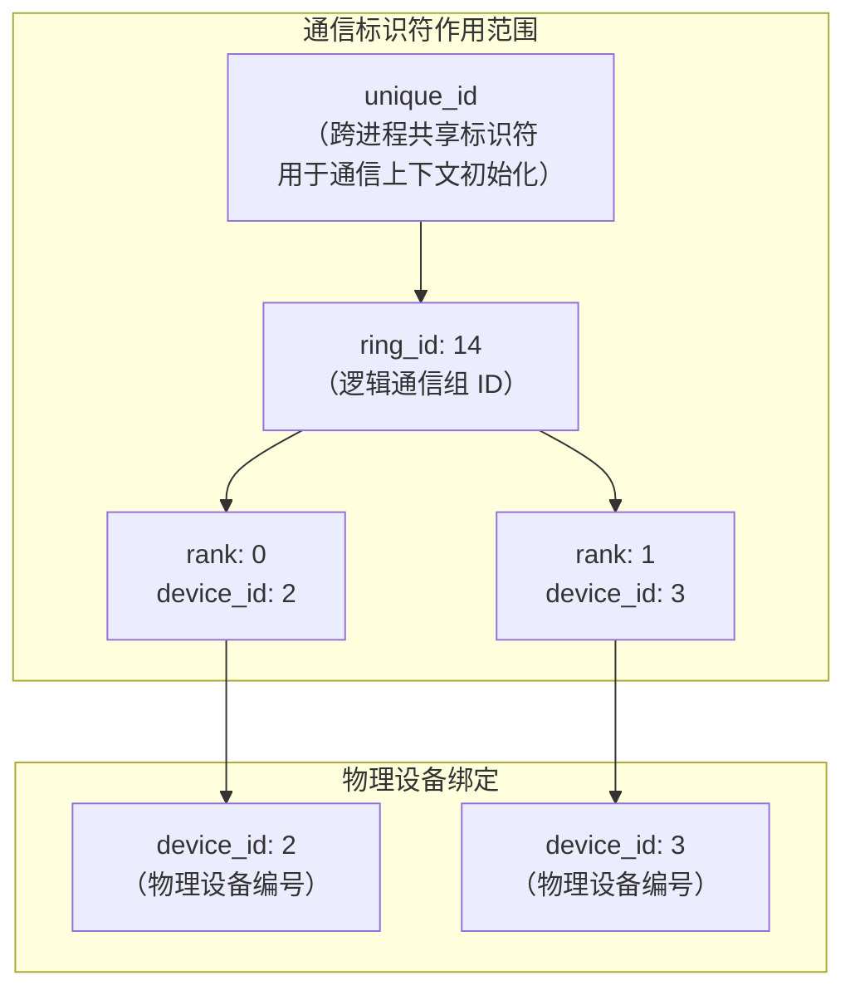
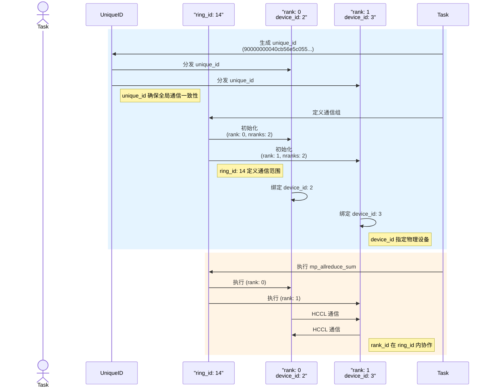
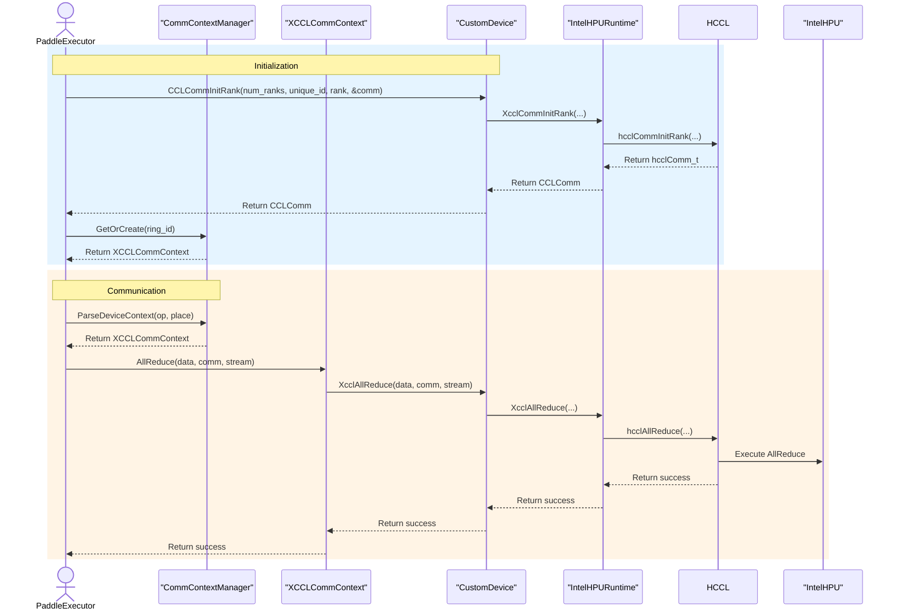

# 📑 CCL 技术总结目录

- [分布式通信标识符概览](#分布式通信标识符概览)
- [空间时间关系图](#空间时间关系图)
- [Paddle -> HPU 集体通信时序图](#paddle---hpu-集体通信时序图)
  - [时序图描述](#时序图描述)
  - [Paddle -> HPU 集体通信算子调用时序](#paddle---hpu-集体通信算子调用时序)
- [CCL 常用函数](#ccl-常用函数)

## 分布式通信标识符概览

以下表格总结了 `ring_id`、`rank_id`、`device_id` 和 `unique_id` 在 PaddlePaddle 分布式计算中的关系：

| 概念         | 定义                                      | 作用                                      | 示例（基于日志）                            | 与其他概念的关系                                      |
|--------------|-------------------------------------------|-------------------------------------------|---------------------------------------------|-------------------------------------------------------|
| **`ring_id`** | 通信组的标识符，表示一个通信环或子域    | 定义通信的范围和分组，允许多个独立通信组 | `ring_id: 14` (mp_allreduce_sum 的通信组)   | 定义 `rank_id` 的作用范围，与 `unique_id` 共同确定通信域 |
| **`rank_id`** | 通信组内进程的唯一编号，从 0 到 nranks-1 | 标识组内进程的身份和数据分片             | `rank: 0, nranks: 2` (进程 0)<br>`rank: 1` | 在特定 `ring_id` 内唯一，可与 `device_id` 对应或不对应 |
| **`device_id`**| 物理设备的编号，标识硬件设备            | 指定计算和通信运行的物理位置              | `set device id to 2` (HPU 2)<br>`set device id to 3` | 与 `rank_id` 可一一对应，也可多对一，独立于 `ring_id`  |
| **`unique_id`**| 全局通信域的唯一标识符                  | 初始化通信上下文，确保所有 rank 一致性    | `unique_id = 90000000040cb56e5c055...`     | 跨所有 `ring_id` 和 `rank_id`，绑定整个通信任务        |




## 空间时间关系图

以下是 `ring_id`、`rank_id`、`device_id` 和 `unique_id` 的空间和时间关系的可视化表示：



## Paddle -> HPU 集体通信时序图

以下是 PaddlePaddle 在 HPU 上执行集体通信（以 `allreduce` 为例）的完整流程，包括初始化、参数设置、执行操作（Op）以及完成清场的时空图描述。图中展示了多个 HPU 设备在时间轴上的协作过程。

### 时序图描述
1. **初始化阶段**:
   - 生成全局唯一的 `unique_id`，用于标识整个通信任务。
   - 为每个通信组分配 `ring_id`，确定通信范围。
   - 设置每个进程的 `rank_id` 和对应的 `device_id`，绑定到物理 HPU 设备。

2. **参数设置阶段**:
   - 配置通信组内的进程数量（`nranks`）和通信算法（如 Ring AllReduce）。
   - 指定输入和输出张量，以及通信操作类型（例如 `sum`、`max`）。

3. **执行操作（Op）阶段**:
   - 各 HPU 根据 `ring_id` 和 `rank_id` 执行数据分片和通信。
   - 通过 HPU 硬件加速完成集体通信（如 `allreduce`）。

4. **完成清场阶段**:
   - 同步所有 HPU，确保通信完成。
   - 释放通信上下文和临时缓冲区，清理资源。

### Paddle -> HPU 集体通信算子调用时序



## CCL 常用函数

在分布式推理中，\*\*集合通信（collective communication）\*\*函数是实现多设备（多卡、多节点）协同计算的基础，尤其是在模型拆分（如 Tensor Parallelism）、专家模型（如 MoE）、多卡推理加速等场景中非常关键。下面我将分三部分介绍：

---

### 📌 一、常见集合通信函数及用途

| 通信函数                | 含义                            | 用途与适用场景                                                       |
| ------------------- | ----------------------------- | ------------------------------------------------------------- |
| **broadcast**       | 广播：一个源进程将数据发送给组内所有进程          | 初始化权重同步（例如加载 checkpoint 后），或者固定 master 生成的随机数                 |
| **all\_reduce**     | 所有进程执行归约操作（如求和、求平均）并将结果广播给所有人 | 梯度/激活求和，TP 模块中跨卡加和（如 KV-cache、attention logits）               |
| **reduce**          | 所有进程的结果归约到一个目标进程              | 少用。可用于收集某些调试信息或聚合中间结果                                         |
| **all\_gather**     | 所有进程各自发送张量，最终所有人收集到所有人的张量     | TP/EP 场景中，收集部分张量，如 token 分片后的输出                               |
| **gather**          | 所有进程将数据收集到一个进程                | 检查点保存、日志记录场景                                                  |
| **scatter**         | 一个进程将不同数据分发给各个进程              | 初始化阶段或模型分片                                                    |
| **reduce\_scatter** | 先执行归约操作（如 sum），再将归约结果分发给各个进程  | All-Reduce 的优化版本，常用于梯度同步或并行 attention logits 合并               |
| **all\_to\_all**    | 所有进程之间相互发送数据（任意映射）            | MoE 的核心：token 和 expert 分配时的 token shuffle、expert parallel 的通信 |

---

### 📌 二、常见使用场景与时机

| 场景                       | 使用的通信函数                                      | 时机                                 | 说明                           |
| ------------------------ | -------------------------------------------- | ---------------------------------- | ---------------------------- |
| **模型初始化**                | broadcast                                    | 推理启动后同步参数                          | 保证每张卡模型一致，尤其在 checkpoint 加载后 |
| **Tensor Parallel (TP)** | all\_reduce / reduce\_scatter / all\_gather  | attention/logits 处理、KV 合并、线性层切分后合并 | TP 对激活和权重切片，需要通信合并或分发        |
| **Expert Parallel (EP)** | all\_to\_all / all\_gather / reduce\_scatter | MoE 模型中 token 分发到 expert，或收回结果     | 通常需要 token -> expert 的分配与交换  |
| **Data Parallel (DP)**   | all\_reduce                                  | 梯度同步（训练）                           | 推理中主要用于状态一致性，DP用得较少          |
| **KV Cache 合并**          | all\_gather 或 all\_reduce                    | 分布式 attention 中多个 head 的 cache 合并  | 必须保证上下文一致性                   |
| **输出拼接**                 | all\_gather / gather                         | 推理输出阶段                             | 多卡生成的 token 串需拼接为完整文本        |

---

### 📌 三、实际库与函数接口（示例）

各深度学习框架（如 PyTorch、Paddle、DeepSpeed）都提供了集合通信接口。

#### ✅ PyTorch 示例（torch.distributed）

```python
import torch.distributed as dist

# all_reduce: 用于同步激活或梯度
dist.all_reduce(tensor, op=dist.ReduceOp.SUM)

# all_gather: 分布式推理输出收集
output_list = [torch.empty_like(tensor) for _ in range(world_size)]
dist.all_gather(output_list, tensor)

# all_to_all: MoE 中 token 到 expert 的数据交换
dist.all_to_all(output_tensor, input_tensor)
```

#### ✅ Paddle 示例（paddle.distributed）

```python
import paddle.distributed as dist

# AllReduce
dist.all_reduce(tensor, op=dist.ReduceOp.SUM)

# AllGather
dist.all_gather(tensor_list, tensor)

# AllToAll
dist.all_to_all(out_tensor, in_tensor)
```

---

### 📌 四、总结与建议

* 对于 **Tensor Parallel**，主要关注 `all_reduce`、`reduce_scatter`。
* 对于 **Expert Parallel（MoE）**，核心是 `all_to_all` 与 `all_gather`。
* **推理阶段**由于不涉及参数更新，但仍需激活同步、输出合并等集合通信。
* 在高性能推理部署中，使用 **Ring-AllReduce**、**NCCL/A2A 优化通信库** 可极大提高效率。

---
