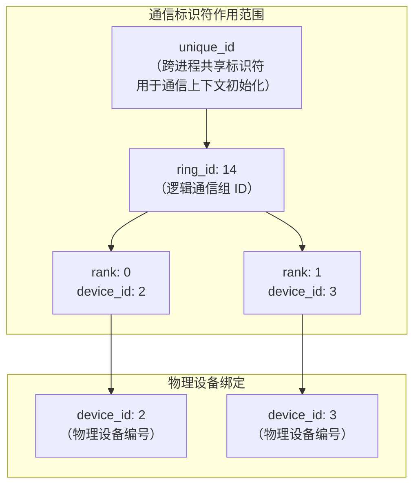
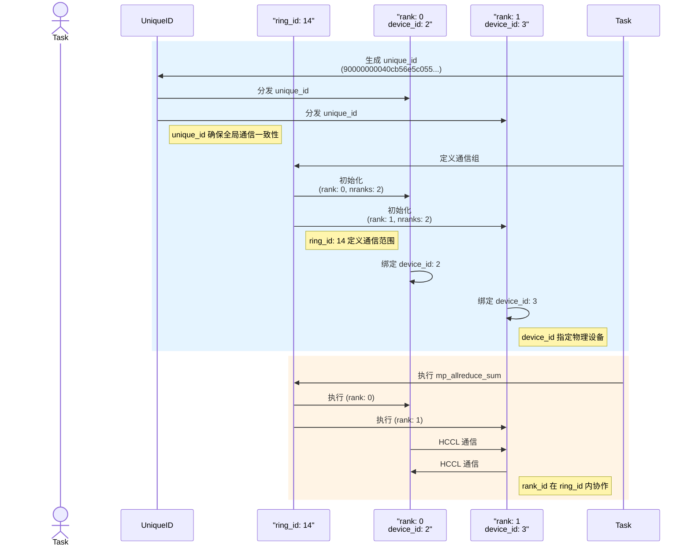
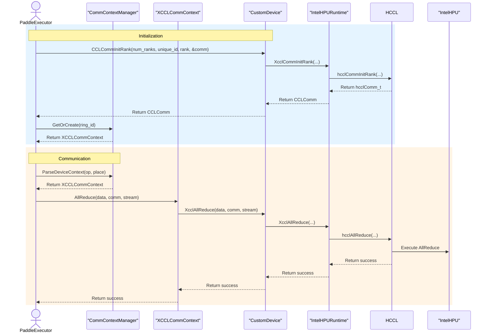

# 📑 CCL 技术总结目录

- [分布式通信标识符概览](#分布式通信标识符概览)
- [空间时间关系图](#空间时间关系图)
- [Paddle -> HPU 集体通信时序图](#paddle---hpu-集体通信时序图)
  - [时序图描述](#时序图描述)
  - [Paddle -> HPU 集体通信算子调用时序](#paddle---hpu-集体通信算子调用时序)

## 分布式通信标识符概览

以下表格总结了 `ring_id`、`rank_id`、`device_id` 和 `unique_id` 在 PaddlePaddle 分布式计算中的关系：

| 概念         | 定义                                      | 作用                                      | 示例（基于日志）                            | 与其他概念的关系                                      |
|--------------|-------------------------------------------|-------------------------------------------|---------------------------------------------|-------------------------------------------------------|
| **`ring_id`** | 通信组的标识符，表示一个通信环或子域    | 定义通信的范围和分组，允许多个独立通信组 | `ring_id: 14` (mp_allreduce_sum 的通信组)   | 定义 `rank_id` 的作用范围，与 `unique_id` 共同确定通信域 |
| **`rank_id`** | 通信组内进程的唯一编号，从 0 到 nranks-1 | 标识组内进程的身份和数据分片             | `rank: 0, nranks: 2` (进程 0) `rank: 1` | 在特定 `ring_id` 内唯一，可与 `device_id` 对应或不对应 |
| **`device_id`**| 物理设备的编号，标识硬件设备            | 指定计算和通信运行的物理位置              | `set device id to 2` (HPU 2) `set device id to 3` | 与 `rank_id` 可一一对应，也可多对一，独立于 `ring_id`  |
| **`unique_id`**| 全局通信域的唯一标识符                  | 初始化通信上下文，确保所有 rank 一致性    | `unique_id = 90000000040cb56e5c055...`     | 跨所有 `ring_id` 和 `rank_id`，绑定整个通信任务        |

## 空间时间关系图

以下是 `ring_id`、`rank_id`、`device_id` 和 `unique_id` 的空间和时间关系的可视化表示：

## Paddle -> HPU 集体通信时序图

以下是 PaddlePaddle 在 HPU 上执行集体通信（以 `allreduce` 为例）的完整流程，包括初始化、参数设置、执行操作（Op）以及完成清场的时空图描述。图中展示了多个 HPU 设备在时间轴上的协作过程。

### 时序图描述
1. **初始化阶段**:
   - 生成全局唯一的 `unique_id`，用于标识整个通信任务。
   - 为每个通信组分配 `ring_id`，确定通信范围。
   - 设置每个进程的 `rank_id` 和对应的 `device_id`，绑定到物理 HPU 设备。

2. **参数设置阶段**:
   - 配置通信组内的进程数量（`nranks`）和通信算法（如 Ring AllReduce）。
   - 指定输入和输出张量，以及通信操作类型（例如 `sum`、`max`）。

3. **执行操作（Op）阶段**:
   - 各 HPU 根据 `ring_id` 和 `rank_id` 执行数据分片和通信。
   - 通过 HPU 硬件加速完成集体通信（如 `allreduce`）。

4. **完成清场阶段**:
   - 同步所有 HPU，确保通信完成。
   - 释放通信上下文和临时缓冲区，清理资源。

### Paddle -> HPU 集体通信算子调用时序

