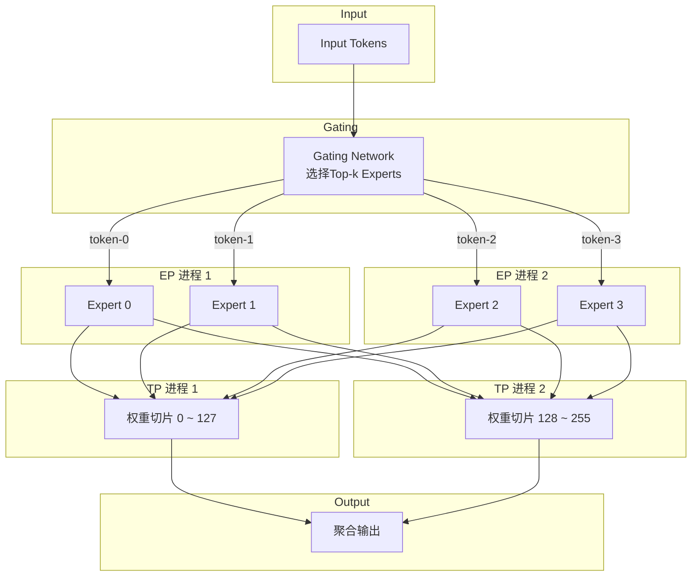

---

# 🤖 大模型分布式推理与训练中的并行技术概述

## 📑目录

1. [引言](#引言)
2. [大模型中的并行技术](#大模型中的并行技术)
   * [2.1 数据并行（Data Parallel, DP）](#数据并行data-parallel-dp)
   * [2.2 模型并行（Model Parallel, MP）](#模型并行model-parallel-mp)
   * [2.3 张量并行（Tensor Parallel, TP）](#张量并行tensor-parallel-tp)
   * [2.4 专家并行（Expert Parallel, EP, MoE）](#专家并行expert-parallel-ep-moe)
3. [主流分布式训练与推理框架](#主流分布式训练与推理框架)
   * [3.1 PyTorch Distributed](#pytorch-distributed)
   * [3.2 Megatron-LM](#megatron-lm)
   * [3.3 DeepSpeed](#deepspeed)
4. [MoE 并行实践案例分析](#moe-并行实践案例分析)
   * [4.1 混合专家 MoE 架构简介](#混合专家-moe-架构简介)
   * [4.2 EP/TP 并行示例](#eptp-并行示例)
   * [4.3 分布式环境初始化与配置](#分布式环境初始化与配置)
   * [4.4 EP/TP 的作用逻辑](#eptp-的作用逻辑)
   * [4.5 计算融合与 all-reduce](#计算融合与-all-reduce)
   * [4.6 调试与日志记录](#调试与日志记录)
   * [4.7 总结对比表](#总结对比表)


---

## 引言

随着大语言模型（LLM）参数规模的指数级增长，单个计算节点无法承载整个模型的推理和训练任务。分布式并行技术因此成为关键支撑。不同类型的并行策略各有适用场景，常见的包括数据并行（DP）、模型并行（MP）、张量并行（TP）以及专家并行（EP）等，尤其是在 MoE 架构中，常常复合使用 TP 与 EP 技术。

---

## 大模型中的并行技术

### 数据并行（Data Parallel, DP）

数据并行是最常见的并行方式，将相同模型副本复制到多个设备上，各设备处理不同的小批量数据，并在每个训练步后同步梯度。

* **优点**：简单高效，易于扩展。
* **缺点**：当模型过大时，单个设备难以容纳整个模型结构。

### 模型并行（Model Parallel, MP）

模型并行将模型结构划分至多个设备执行，例如一部分层在 GPU0 上，另一部分在 GPU1 上。

* **优点**：可突破单卡显存限制。
* **缺点**：通信复杂，效率依赖模型划分粒度。

### 张量并行（Tensor Parallel, TP）

张量并行是一种细粒度模型并行，将某些权重矩阵在维度上划分为多个子块，各设备分别负责计算这些子块。

* **应用场景**：适用于 Transformer 中如线性层、注意力头的并行。
* **Megatron-LM** 使用广泛。
* **图示示例**：见后文 EP/TP 并行图示。

### 专家并行（Expert Parallel, EP, MoE）

专家并行专用于 Mixture-of-Experts 架构。多个专家模块分布在不同设备，前向时仅激活部分专家，实现稀疏计算。

* **特点**：

  * 每个 token 仅路由到 top-k 个专家。
  * 路由器模块决定路由路径。
* **并行方式**：

  * 通常与 TP 组合，实现 token 与张量的高效划分。

---

## 主流分布式训练与推理框架

### PyTorch Distributed

PyTorch 官方的分布式通信库，支持：

* `torch.distributed.init_process_group`
* 通信后端：NCCL, Gloo, MPI
* 通用并行模式（DP、基本 MP）

示例初始化：

```python
import torch.distributed as dist

if not dist.is_initialized():
    dist.init_process_group(backend="nccl")  # 或 gloo
```

### Megatron-LM

Megatron-LM 是 NVIDIA 开源的训练框架，专为大模型高效训练设计，支持：

* 高效 TP（张量并行）
* Pipeline Parallel（流水线并行）
* Mixed precision 训练

特点：

* 针对 Transformer 模块高度优化
* 强依赖 NVIDIA GPU/NCCL 通信

### DeepSpeed

DeepSpeed 是 Microsoft 开源的训练推理加速框架，支持：

* ZeRO 优化器（显存/通信优化）
* MoE 并行（与 Fairscale 或自研路由器兼容）
* 混合精度推理（FP16, INT8）

适用于推理与训练阶段。

---

## MoE 并行实践案例分析

### 混合专家 MoE 架构简介

MoE（Mixture of Experts）是一种稀疏激活的模型结构，通过 gating 网络将输入动态路由到少数几个专家子网络。

基本公式为：

$$
\text{MoE}(x) = \sum_{i=1}^{N} G_i(x) \cdot E_i(x)
$$

其中：

* $G_i(x)$：gating 得分
* $E_i(x)$：第 $i$ 个专家
* $N$：专家数

并行实践中常采用：

* 张量并行（TP）：切分专家内部线性层
* 专家并行（EP）：每个专家部署在独立进程

---

### EP/TP 并行示例

我们将 4 个进程分为：`world_size=4`, `ep_size=2`, `tp_size=2`
* 2 个专家并行组（ep\_group）
* 每组内部再切分为 2 个张量并行组（tp\_group）

| global\_rank | ep\_rank | tp\_rank | tp\_group (tp_id)| ep\_group (ep_id)|
| ------------ | -------- | -------- | ---------      | ---------      |
| 0            | 0        | 0        | \[0,1] (tp0)    | \[0,2] (ep0)    |
| 1            | 0        | 1        | \[0,1] (tp1)    | \[1,3] (ep0)    |
| 2            | 1        | 0        | \[2,3] (tp0)    | \[0,2] (ep1)    |
| 3            | 1        | 1        | \[2,3] (tp1)    | \[1,3] (ep1)    |


#### EP/TP 图示



---

### 分布式环境初始化与配置

在 PaddlePaddle 或 PyTorch 中，常用以下代码初始化环境：

```python
import paddle.distributed as dist

if not dist.is_initialized():
    try:
        dist.init_parallel_env()
    except Exception as e:
        raise RuntimeError("Failed to initialize distributed environment") from e

global_rank = dist.get_rank()
world_size = dist.get_world_size()
```

TP/EP 分组方式如下：

```python
ep_size = 2
tp_size = 2
global_rank = dist.get_rank()

ep_rank = global_rank // tp_size
tp_rank = global_rank % tp_size

ep_group = [i for i in range(world_size) if i // tp_size == ep_rank]
tp_group = [i for i in range(world_size) if i % tp_size == tp_rank]
```

---


###  EP/TP 的作用逻辑

#### EP：专家分布

```python
self.experts_min = self.ep_rank * self.experts_per_rank
self.experts_max = (self.ep_rank + 1) * self.experts_per_rank - 1
```

MoE 前向后：

```python
if self.ep_size > 1:
    dist.all_reduce(final_hidden_states, op=SUM, group=self.ep_group)
```

---

#### TP：专家内部并行

```python
ffn_dim_per_tp = ffn_dim // tp_size
w1 = [Tensor(shape=[hidden_dim, ffn_dim_per_tp]) for _ in experts]
```

TP 汇总输出：

```python
if self.tp_size > 1:
    dist.all_reduce(final_hidden_states, op=SUM, group=self.tp_group)
```

---


### 计算融合与 all-reduce

分布式 MoE 中，Paddle 使用 `paddlenlp_ops.mixture_of_experts` 进行融合：

* 每个进程执行其局部 expert 权重
* 前向后 `ep_group` 和 `tp_group` 中都执行 `dist.all_reduce`

---

### 调试与日志记录

```python
logger = logging.getLogger(f"moe_ep_rank_{ep_rank}_tp_rank{tp_rank}")
```

日志区分不同 rank，便于观察行为：

```
test_logs_ep_rank_0_tp_rank_1.log
```

---

### 总结对比表

| 项目                      | 说明                                                        |
| ----------------------- | --------------------------------------------------------- |
| **EP（Expert Parallel）** | 将专家均分到多个进程，每个进程处理部分专家                                     |
| **TP（Tensor Parallel）** | 将单个专家的参数矩阵在多个进程上拆分                                        |
| **通信组划分**               | ep\_group: 同一 TP Rank 的所有 EP；tp\_group: 同一 EP Rank 的所有 TP |
| **同步方式**                | 使用 all\_reduce 保证输出一致                                     |
| **参数划分逻辑**              | `generate_moe_params_static()` 中根据 `tp_rank` 分割专家权重       |

---

