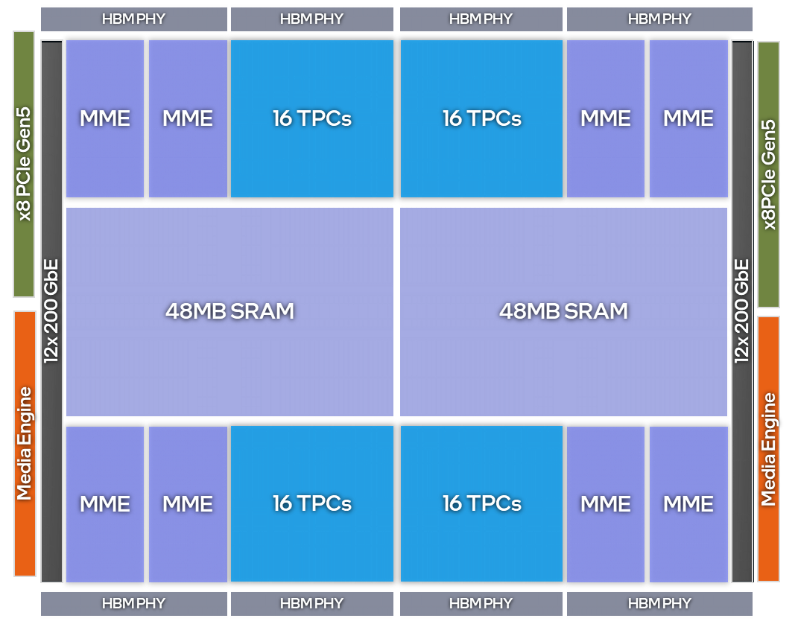
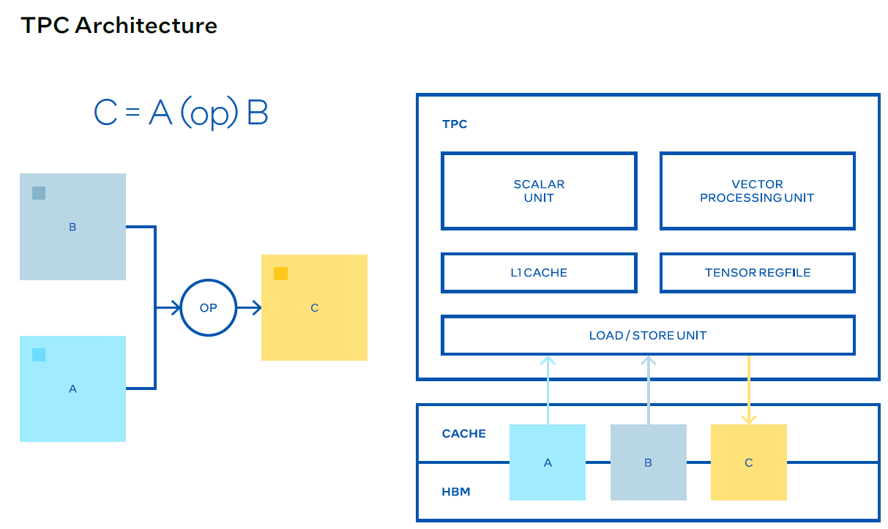

## 📑 目录

- [Intel Gaudi 3 AI 加速器关键规格总结（面向大模型推理部署）](#intel-gaudi-3-ai-加速器关键规格总结面向大模型推理部署)
  - [📌 核心计算能力](#核心计算能力)
  - [🧠 存储与带宽](#存储与带宽)
  - [🔌 I/O 与系统互联](#io-与系统互联)
  - [⚙️ 架构特性与优化重点](#️架构特性与优化重点)
  - [✅ 推理部署优化建议](#推理部署优化建议)
- [Intel Gaudi 3 AI 加速器架构概要：MME 与 TPC 模块](#intel-gaudi-3-ai-加速器架构概要)
  - [📌 MME（Matrix Multiplication Engine）](#mmematrix-multiplication-engine)
  - [📌 TPC（Tensor Processor Core）](#tpctensor-processor-core)
  - [📈 MME 与 TPC 协同关系](#mme-与-tpc-协同关系)
  - [🔁 MME vs TPC 总结对比表](#mme-vs-tpc-总结对比表)
  - [🔤 附注：术语解释](#附注术语解释)
- [🧠 Intel Gaudi 3 TPC 模块：用户可编程能力总结](#intel-gaudi-3-tpc-用户可编程能力总结)
  - [📌 TPC 简介](#tpc-简介)
  - [💻 编程语言：TPC-C（C99 衍生）](#编程语言tpc-cc99-衍生)
  - [🔢 支持的数据类型（SIMD 向量类型）](#支持的数据类型simd-向量类型)
  - [🧠 内存模型](#内存模型)
  - [🧪 内建全局变量 & 函数（随机数、Lane ID 等）](#内建全局变量--函数随机数lane-id-等)
  - [📈 使用场景与调优建议](#使用场景与调优建议)
  - [🛠️ 示例：TPC 内核编写](#示例内核编写)
  - [📚 总结](#总结)

---


## Intel Gaudi 3 AI 加速器关键规格总结（面向大模型推理部署）

Intel Gaudi 3 是一款为 AI 推理和训练设计的高性能加速器，其硬件架构与数据传输设计专为深度学习工作负载（尤其是大语言模型 LLM）进行了优化。以下是与 LLM 推理部署和性能调优密切相关的核心硬件指标与特性。

### 核心计算能力

| 指标类型                   | Gaudi 2 | **Gaudi 3** | 增幅        | 说明                          |
| ---------------------- | ------- | ----------- | --------- | --------------------------- |
| **FP8 GEMM TFLOPS**    | 865     | **1678**    | >1.9×     | 高效支持 Transformer 中主干 matmul |
| **BF16 GEMM TFLOPS**   | 432     | **1678**    | **>3.8×** | 更适合精度敏感型推理                  |
| **Vector BF16 TFLOPS** | 11      | **28.7**    | 2.6×      | 非矩阵类运算能力提升                  |
| **MME 单元数**            | 2       | **8**       | 4×        | 并行矩阵乘处理能力翻倍                 |
| **TPC 单元数**            | 24      | **64**      | 2.67×     | 用于处理非 GEMM 操作（如激活函数、归一化）    |

> 💡 **MME**：Matrix Multiplication Engine，主要负责 Transformer 模型中的 FC、Conv、BatchGEMM 等操作
> 💡 **TPC**：Tensor Processing Cluster，是 VLIW SIMD 架构，用于非矩阵运算（如 Softmax、LayerNorm）

[](https://raw.githubusercontent.com/zongwave/pixelcraft/main/ai/llm/hpu/diagram/gaudi3_block.png)

### 存储与带宽

| 指标类型               | Gaudi 2      | **Gaudi 3**       | 增幅      | 说明                      |
| ------------------ | ------------ | ----------------- | ------- | ----------------------- |
| **HBM 容量**         | 96 GB        | **128 GB**        | 1.33×   | 支持更大参数模型和 KV cache      |
| **HBM 带宽**         | 2.46 TB/s    | **3.7 TB/s**      | 1.5×    | 关键提升推理吞吐与 KV-cache 读取效率 |
| **On-die SRAM 容量** | 48 MB        | **96 MB**         | 2×      | 提升寄存局部计算性能              |
| **On-die SRAM 带宽** | 6.4/6.4 TB/s | **12.8/6.4 TB/s** | read 翻倍 | 降低访问主存频率、加速算子           |

### IO 与系统互联

| 指标类型            | Gaudi 2         | **Gaudi 3**          | 增幅    | 说明             |
| --------------- | --------------- | -------------------- | ----- | -------------- |
| **网络互联带宽（双向）**  | 600 GB/s        | **1200 GB/s**        | 2×    | 适合大规模多卡模型分布推理  |
| **Host 接口**     | PCIe Gen4 x16   | **PCIe Gen5 x16**    | 2× 带宽 | 更快主机-设备数据交换    |
| **Host 接口带宽峰值** | 64 GB/s (32/32) | **128 GB/s (64/64)** | 2×    | 加快输入输出传输与控制信令  |
| **视频解码器数量**     | 8               | 14                   | —     | 加速多模态场景中的媒体预处理 |

### 架构特性与优化重点

* **双芯片封装 + 高带宽桥接互连**：单芯片封装的透明化互联设计，在软件上等效于单一大芯片，便于高效使用所有计算资源。
* **异构计算引擎（MME + TPC）**：可针对 LLM 中主干路径（matmul）与辅助操作（激活、归一化）分别优化调度。
* **FP8 / BF16 支持**：符合主流 LLM 模型训练与推理的低精度规范，平衡吞吐与精度。

---

### 推理部署优化建议

1. **大模型 KV-cache 优化**：利用 128GB HBM 和 12.8TB/s SRAM 读带宽，实现高效缓存与查表操作。
2. **模型并行推荐**：

   * 使用 TPC 执行 token-wise 操作（如 LayerNorm、Softmax）；
   * 利用 8 个 MME 单元执行大规模 FC/WQKV 乘法。
3. **通信优化**：充分利用 1200GB/s 网络带宽，在多卡推理中使用 Ring/AllReduce/Broadcast 通信优化策略。
4. **Host-Device 数据预取**：结合 PCIe Gen5 高带宽，提前加载 prompt/token embedding，可减少 latency。

---


## Intel Gaudi 3 AI 加速器架构概要

### MME（Matrix Multiplication Engine）

[](https://raw.githubusercontent.com/zongwave/pixelcraft/main/ai/llm/hpu/diagram/mme.png)


#### 功能定位

专用于矩阵乘法相关计算任务（如 FC 层、Conv、BatchGEMM），是大模型中执行 GEMM 运算的核心模块。

#### 架构规格

* **数量**：8 个 MME 单元
* **每个 MME**：

  * 内含 **64K Multiply-Accumulate Units (MACs)**
  * 高并行度执行矩阵乘法
* **性能指标**：

  * **Peak FP8/BF16 GEMM Throughput**：1678 TFLOPS（整卡）
* **数据调度机制**：

  * 支持 **基于共享维度 K 的切分**，不同 MME 对 A 和 B 的切片进行并行乘法
  * 支持 **智能缓存复用**：如 MME0、MME2、MME4、MME6 可共享 A 的上半部分
* **内存访问**：

  * 数据优先从缓存读取，减少 HBM 访问
  * 与 HBM 高速带宽（3.7 TB/s）深度协同

#### 推理调优相关要点

* MME 是执行大模型中 Attention、MLP 中 FC 层的主要算子位置
* 优化点包括：

  * 减少内存带宽压力（提前缓存输入）
  * 按照 MME 的切分逻辑组织输入张量
  * Graph Compiler 会根据输入形状、K 维度选择最佳并行策略

---

### TPC（Tensor Processor Core）

[](https://raw.githubusercontent.com/zongwave/pixelcraft/main/ai/llm/hpu/diagram/tpc.png)


#### 功能定位

处理非-GEMM 类型计算（如 LayerNorm、激活函数、索引操作），可执行任意张量操作。

#### 架构规格

* **数量**：64 个
* **VLIW SIMD 架构**：

  * 256 Byte 宽度
  * 支持多种精度格式（FP32、FP16、BF16、FP8-E4M3/E5M2，以及 INT/UINT8\~32）
* **子模块**：

  * **Scalar Unit / Vector Processing Unit**
  * **Tensor Register File**
  * **Load/Store Unit**
  * **L1 Cache**

#### 特性亮点

* **DMA-Free 架构**：TPC 内部可自动处理张量载入，无需显式 DMA 控制
* **微秒级 Kernel 支持**：即使是短小核函数也可获得高利用率
* **流水线优化**：多个内核可无缝连续执行，消除 pipeline 空洞
* **支持复杂数据路径**：支持 cache / HBM 输入，无需开发者手动分配

#### 推理调优相关要点

* LayerNorm、GELU、Mask 等操作更适合分配给 TPC
* 利用 TPC 支持多数据类型，在推理阶段合理选取 BF16 / INT8 可提升性能
* 利用 TPC 的低延迟优势处理小规模逐元素运算，减轻主核压力

---

### MME 与 TPC 协同关系

| 模块类型    | 主要用途    | 典型任务               | 并行策略        | 是否适合 FP8       | 适合小 batch |
| ------- | ------- | ------------------ | ----------- | -------------- | --------- |
| **MME** | 大型矩阵乘法  | FC, Attention QK/V | 多 MME K 维切片 | ✅ Yes          | ❌ 不适合     |
| **TPC** | 标量/向量操作 | LayerNorm, Softmax | SIMD 并行     | ✅ 支持 FP8 & INT | ✅ 支持短小核   |

---

### MME vs TPC 总结对比表

| 特征   | MME                  | TPC                  |
| ---- | -------------------- | -------------------- |
| 主要用途 | GEMM / BatchGEMM     | 通用张量计算               |
| 计算结构 | 高吞吐矩阵乘单元             | SIMD + VLIW 张量核      |
| 吞吐特点 | 高吞吐但需要大矩阵以充分利用       | 小任务也可高效利用            |
| 编程接口 | 编译器调度（不可编程）          | 可编程，高灵活性             |
| 使用场景 | FC/Attention/QKV 矩阵乘 | 激活、归一化、位置编码等         |
| 典型精度 | BF16 / FP16          | FP32 / BF16 / INT8 等 |

---

### 附注：术语解释

* **GEMM**：General Matrix Multiply，表示一般矩阵乘法 `C = A × B`。
* **Batch GEMM**：对多个 GEMM 任务同时进行计算，提升利用率（如一个 batch 的多个样本）。
* **MAC（Multiply-Accumulate）**：乘加单元，是神经网络中核心的计算单元。

---

以下是对 Intel Gaudi 3 加速器中 **TPC 模块的用户可编程性**的总结，重点整理了与大模型推理部署、算子自定义、优化相关的编程模型、内存模型和可用的 SIMD 数据类型。
---

## Intel Gaudi 3 TPC 用户可编程能力总结

### TPC 简介

**TPC（Tensor Processor Core）** 是 Gaudi 加速器中的可编程核心，专为执行非线性深度学习算子（如 BatchNorm、Pooling、LayerNorm 等）而设计。其特点包括：

* ✅ **VLIW4 SIMD 架构**（Very Long Instruction Word + Single Instruction Multiple Data）
* ✅ 面向高吞吐、低延迟的非 GEMM 操作优化
* ✅ 支持 **用户使用类 C 语言编写内核函数**（TPC-C）

---

### 编程语言：TPC-C（C99 衍生）

TPC 使用一种基于 C99 的语言 TPC-C 编写，具备以下特点：

* **类 C 语法**，支持函数、变量、控制流
* 扩展数据类型用于向量计算（见下文）
* 无需显式控制 DMA（TPC 自动调度 tensor 读写）
* 只能通过内建 intrinsics 操作内存地址（如 `a_gen_addr_i_b()`）

---

### 支持的数据类型（SIMD 向量类型）

TPC 支持多种内建向量类型用于大规模并行运算：

| 类型名         | 说明                        |
| ----------- | ------------------------- |
| `float64`   | 64 × float32              |
| `bfloat128` | 128 × bfloat16            |
| `ushort128` | 128 × int16/uint16        |
| `int64`     | 64 × int32                |
| `uint64`    | 64 × uint32               |
| `char256`   | 256 × int8                |
| `uchar256`  | 256 × uint8               |
| `bool256`   | 256 × 1-bit bool（仅支持逻辑运算） |
| `int5`      | 张量偏移的 5D 坐标（张量下标）         |
| `tensor`    | 指向张量对象的 opaque handle     |

> 每个 TPC 核心每周期可处理：
>
> * 64 × float32 / int32 ops
> * 128 × int16 ops
> * 256 × int8 ops

---

### 内存模型

#### 🧩 Global Memory（全局内存）

* 用于存放张量（由 Gaudi runtime 分配，用户不可动态申请）
* 地址初始化需用内建函数 `a_gen_addr_*`
* 非一致性（需调用 `aso()` 确保读后写语义）
* 无法使用 `malloc/free`
* 使用 `__global__` 修饰符声明全局指针

示例：

```c
__global__ int* ptr = a_gen_addr_i_b(tensor_obj, offset);
int tmp = *ptr;
*ptr = tmp + 1;
```

#### 🔒 限制：

* 不可使用全局指针访问局部变量
* 不可静态声明全局数组（非法）：`__global__ int64 array[64];`

---

#### 🧩 Local Memory（局部内存）

* 每个 TPC 核心有独立的局部内存
* 支持 **静态分配**（编译期），不支持动态分配
* 使用 `__local__` 修饰符定义
* 自动顺序一致性（不需 memory barrier）

大小规格：

* **标量类型：1 KB**
* **向量类型：16 KB（若用特殊函数则为 80 KB）**

示例：

```c
__local__ float64 constants[3];
constants[0] = v_f32_ld_tnsr_i_b(coord, inputA, 1, 0);
```

---

### 内建全局变量 & 函数（随机数、Lane ID 等）

#### 🔄 伪随机数（LFSR）

* `read_lfsr_b()`：返回 `char256` 随机向量（破坏性读取）
* `write_lfsr_b(seed)`：设置种子

示例：

```c
char256 rand = read_lfsr_b();
```

#### 🧩 LANE ID（向量 lane ID 获取）

* `read_lane_id_4b_b()` → 返回 `uint64`（64 × int32）
* `read_lane_id_2b_b()` → 返回 `ushort128`
* `read_lane_id_1b_b()` → 返回 `uchar256`

结合掩码操作示例：

```c
uint64 lane_id_32 = read_lane_id_4b_b();
bool256 mask = bv_u32_cmp_eq_v_s(lane_id_32, 7);
float64 result = v_f32_mov_s_vb(val, result, mask, 0);
```

---

### 使用场景与调优建议

| 场景                        | 是否推荐使用 TPC | 原因/说明                 |
| ------------------------- | ---------- | --------------------- |
| LayerNorm / GELU / SiLU 等 | ✅ 是        | 小型逐元素算子，TPC SIMD 高效执行 |
| ArgMax / TopK / Sort      | ✅ 是        | 可通过手动实现向量比较与替换        |
| BatchNorm / Pooling       | ✅ 是        | 非线性结构，MME 不支持         |
| Attention QK/VO 矩阵乘法      | ❌ 否        | 应使用 MME 进行 GEMM       |
| 大模型中自定义精度核函数              | ✅ 是        | 可用 INT8/FP8 手动实现轻量级算子 |

---


### 示例：内核编写


```c
__local__ int localArray[5];

void main (tensor t1)
{
  int5 offset = {0,1,2,3,3};
  __global__ int* pointer = a_gen_addr_i_b(t1, offset);
  int tmp = *pointer;
  tmp = tmp + localArray[0];
  *pointer = tmp;
}
```

---

### 总结

* TPC 提供了高度可控的 SIMD 编程模型，适合用于推理阶段的细粒度优化与算子融合。
* 用户可基于 C99 衍生语言，灵活定义非矩阵操作算子。
* 推荐掌握 TPC 编程用于自定义 LayerNorm、Indexing、Activation 等推理关键路径。
* 搭配 Graph Compiler，可实现 MME + TPC 的任务拆分与调度协同。

---


---


