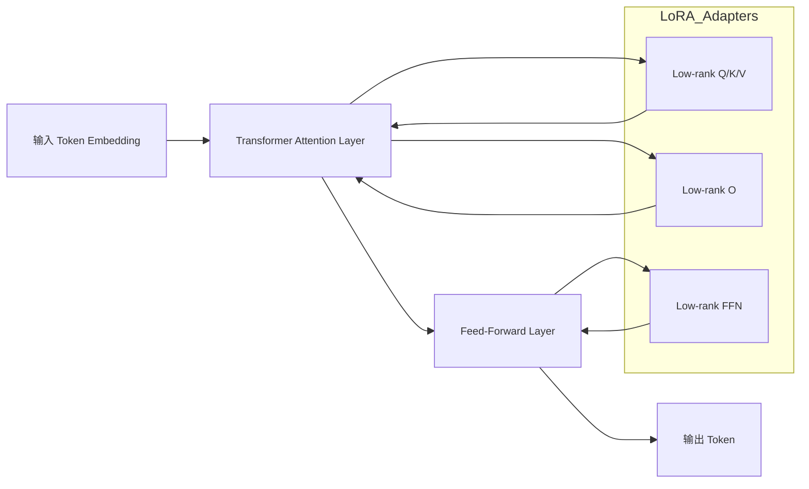

---

# 📑 目录

* [LoRA (Low-Rank Adaptation) 技术总结](#lora-low-rank-adaptation-技术总结)

  * [1. 概念](#1-概念)

    * [1.1 定义](#11-定义)
    * [1.2 特点](#12-特点)

  * [2. 数学原理](#2-数学原理)

    * [2.1 线性层低秩表示](#21-线性层低秩表示)
    * [2.2 Transformer 中应用](#22-transformer-中应用)

  * [3. 优势与适用场景](#3-优势与适用场景)

  * [4. LoRA 微调流程](#4-lora-微调流程)

    * [4.1 流程示意](#41-流程示意)
    * [4.2 Python 代码示例](#42-python-代码示例)

  * [5. 在多模态大模型中的应用](#5-在多模态大模型中的应用)

    * [5.1 输入投影层微调](#51-输入投影层微调)
    * [5.2 输出投影层微调](#52-输出投影层微调)
    * [5.3 LLM 主干微调](#53-llm-主干微调)
    * [5.4 多模态指令微调](#54-多模态指令微调)

  * [6. 实践建议](#6-实践建议)

---

# LoRA (Low-Rank Adaptation) 技术总结

## 1. 概念

**LoRA**（Low-Rank Adaptation）是一种**参数高效微调（PEFT）技术**，用于在不修改大模型原始权重的情况下进行任务特定微调。核心思想是：只训练**低秩矩阵**作为适配器来学习任务相关更新，而冻结原始大模型参数。

### 1.1 定义

* 冻结大部分模型权重，只训练少量参数
* 显著降低显存占用和计算成本
* 可复用多个 LoRA adapter 来支持多任务

### 1.2 特点

* 高效：训练参数量远少于原模型
* 显存友好：只更新低秩矩阵
* 可组合：不同任务可复用多个 LoRA adapter

---

## 2. 数学原理

假设一个线性层权重矩阵 \$W\_0 \in \mathbb{R}^{d \times k}\$，在 LoRA 中，我们将微调更新表示为低秩矩阵乘积：

$$
\Delta W = A B
$$

其中：

* \$A \in \mathbb{R}^{d \times r}\$，\$B \in \mathbb{R}^{r \times k}\$
* \$r \ll \min(d, k)\$ 是低秩维度
* \$\alpha\$ 是缩放系数

最终权重：

$$
W = W_0 + \alpha \Delta W = W_0 + \alpha A B
$$

**直观理解**：

* \$W\_0\$ 是原始模型能力
* \$A B\$ 是任务适配器，仅学习任务特定更新

### 2.1 线性层低秩表示

* 微调参数量大幅减少
* 保持原始能力不变

### 2.2 Transformer 中应用

#### 注意力层

```
Q' = Q0 + α * A_Q B_Q
K' = K0 + α * A_K B_K
V' = V0 + α * A_V B_V
O' = O0 + α * A_O B_O
```

#### 前馈层 (FFN)

```
FFN_out = FFN0(x) + α * A_FFN B_FFN * x
```

> 所有原始权重保持冻结，只训练低秩矩阵 A 和 B

---

## 3. 优势与适用场景

* **参数高效**：微调参数远少于原模型参数
* **显存友好**：只计算低秩矩阵梯度
* **可复用**：不同任务保存不同 LoRA adapter
* **易于组合**：支持多任务多模态任务切换

---

## 4. LoRA 微调流程

### 4.1 流程示意



### 4.2 Python 代码示例

```python
import torch
import torch.nn as nn

class LoRALinear(nn.Module):
    def __init__(self, in_features, out_features, r=4, alpha=1.0):
        super().__init__()
        self.weight = nn.Parameter(torch.zeros(out_features, in_features))  # frozen weight
        self.A = nn.Parameter(torch.randn(out_features, r) * 0.01)
        self.B = nn.Parameter(torch.randn(r, in_features) * 0.01)
        self.alpha = alpha
        self.r = r

    def forward(self, x):
        delta = self.alpha * (self.A @ self.B)
        W = self.weight + delta  # weight is frozen, delta is trainable
        return x @ W.T

# 示例：微调 Transformer 的 Q/K/V 矩阵
q_lora = LoRALinear(1024, 1024, r=8, alpha=16)
x = torch.randn(2, 10, 1024)
out = q_lora(x)
```

---

## 5. 在多模态大模型中的应用

### 5.1 输入投影层微调

* LoRA 可微调 **input projector**
* 提升模态特征对齐能力

### 5.2 输出投影层微调

* LoRA 可训练 **output projector**
* 改善解码器条件信号

### 5.3 LLM 主干微调

* LoRA 附加到注意力和 FFN 层
* 原始 LLM 参数冻结

### 5.4 多模态指令微调

* 在多模态指令数据上微调 LoRA
* 可在保持 projector 固定的前提下，让 LLM 学会遵循指令

---

## 6. 实践建议

* **低秩 r**：4\~16，根据任务复杂度选择
* **缩放 α**：与 r 成正比
* **冻结原模型**：节省显存
* **可复用 Adapter**：不同任务、不同模态使用不同 LoRA
* **结合 PEFT 框架**：HuggingFace PEFT、PaddleNLP PEFT

---

