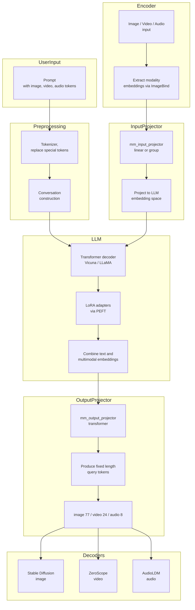
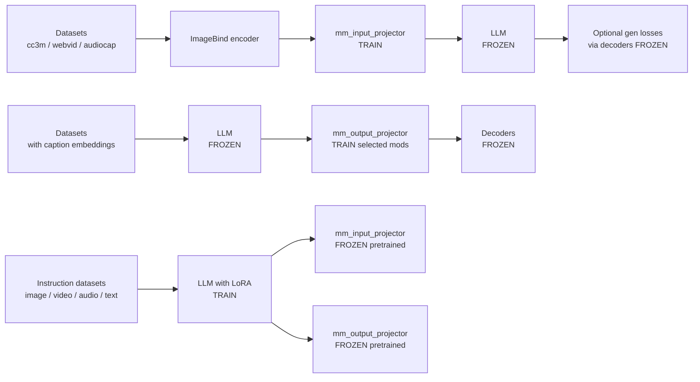

---

# 📑 多模态大模型技术总结

## 目录

* [1. 核心架构与原理](#1-核心架构与原理)

  * [1.1 输入处理层](#1-1-输入处理层)

    * [1.1.1 多模态编码器](#1-1-1-多模态编码器)
    * [1.1.2 输入投影层](#1-1-2-输入投影层)
  * [1.2 核心骨干网络](#1-2-核心骨干网络)

    * [1.2.1 大语言模型](#1-2-1-大语言模型)
  * [1.3 输出生成层](#1-3-输出生成层)

    * [1.3.1 输出投影层](#1-3-1-输出投影层)
    * [1.3.2 多模态解码器](#1-3-2-多模态解码器)

* [2. 训练与微调策略](#2-训练与微调策略)

  * [2.1 阶段一：模态对齐预训练](#2-1-阶段一模态对齐预训练)
  * [2.2 阶段二：输出对齐预训练](#2-2-阶段二输出对齐预训练)
  * [2.3 阶段三：指令微调](#2-3-阶段三指令微调)

* [3. 关键实现细节与挑战](#3-关键实现细节与挑战)

  * [3.1 参数高效微调 (PEFT)](#3-1-参数高效微调-peft)
  * [3.2 推理与部署优化](#3-2-推理与部署优化)
  * [3.3 挑战](#3-3-挑战)

---

## 1. 核心架构与原理

多模态大模型通常采用 **“编码器-骨干-解码器”** (Encoder-Backbone-Decoder) 的通用范式。Next-GPT 是该范式的典型代表。

---

### 1.1 输入处理层

#### 1.1.1 多模态编码器

* **图像编码器 (Image Encoder)**

  * 模型：CLIP ViT 或 BLIP-2 Q-Former
  * 功能：将图像编码为固定数量 token 特征 `V = [v1, ..., vN]`

* **音频编码器 (Audio Encoder)**

  * 模型：ImageBind、CLAP 或 Whisper
  * 功能：将音频波形编码为序列特征 `A_enc = [a1, ..., aM]`

* **视频编码器 (Video Encoder)**

  * 方法：均匀采样帧，使用图像编码器编码；音频轨可单独编码，再融合视觉和音频特征

#### 1.1.2 输入投影层

* 功能：将不同模态的编码特征 `(V, A_enc, ...)` 投影到 LLM 的嵌入空间
* 实现：线性层 (`nn.Linear`) 或组线性
* 重要性：实现模态对齐的关键，使 LLM 能理解非文本模态

---

### 1.2 核心骨干网络

#### 1.2.1 大语言模型

* 模型：开源自回归 LLM，如 LLaMA、Vicuna、Qwen
* 功能：接收文本 token + 投影后的非文本 token
* 输入格式：
  `[Text_Tokens] + [IMG] + [Projected_Image_Tokens] + ...`
  使用 `<Image>`、`<Audio>` 等特殊 token 指示模态

---

### 1.3 输出生成层

#### 1.3.1 输出投影层

* 功能：将 LLM hidden states 转换为解码器 query token
* 实现：线性层

#### 1.3.2 多模态解码器

* 文本解码器：LLM 本身
* 图像解码器：潜在扩散模型（LDM，如 Stable Diffusion）
* 音频/视频解码器：AudioLDM、VideoLDM 或 CogVideo

---

## 2. 训练与微调策略

多模态大模型训练通常采用**三阶段训练流程**：

1. **编码端预训练 (Pretrain Encoder)**：训练输入投影层，使 LLM 能理解多模态输入
2. **解码端预训练 (Pretrain Decoder)**：训练输出投影层，使 LLM 输出可被解码器理解
3. **指令微调 (Instruction Fine-tuning)**：微调 LLM（LoRA），实现多模态指令任务

---

### 2.1 阶段一：模态对齐预训练

* **脚本**：`pretrain_enc.sh`
* **训练对象**：输入投影层
* **冻结**：LLM、输出投影层、解码器
* **目标**：让输入投影器学会把模态 embedding 翻译为 LLM 能理解的语言

---

### 2.2 阶段二：输出对齐预训练

* **脚本**：`pretrain_dec.sh`
* **训练对象**：输出投影层
* **冻结**：LLM、解码器
* **目标**：让输出投影器学会把 LLM hidden states 翻译为解码器 query token

---

### 2.3 阶段三：指令微调

* **脚本**：`train_mem.sh`
* **训练对象**：LLM（LoRA 微调）
* **冻结**：输入/输出投影层
* **目标**：学会多模态指令对话与生成

---

### 🔑 小结

* **阶段一**：训练输入翻译器
* **阶段二**：训练输出翻译器
* **阶段三**：微调 LLM（LoRA）实现完整多模态指令任务

---

## 3. 关键实现细节与挑战

### 3.1 参数高效微调 (PEFT)

* 技术：LoRA
* 应用：可附加到 LLM 的注意力层 (Q/K/V/O) 和 FFN 层
* 优势：减少可训练参数，降低计算成本，允许快速定制多种能力

---

### 3.2 推理与部署优化

* 静态图编译：TorchScript 或 ONNX
* 算子融合：Linear + LayerNorm 等
* 权重量化：FP16 → INT8/INT4
* KV-Cache：缓存 Key/Value 提高自回归生成速度

---

### 3.3 挑战

* 模态对齐
* 训练稳定性
* 计算成本
* 生成质量与可控性

---

