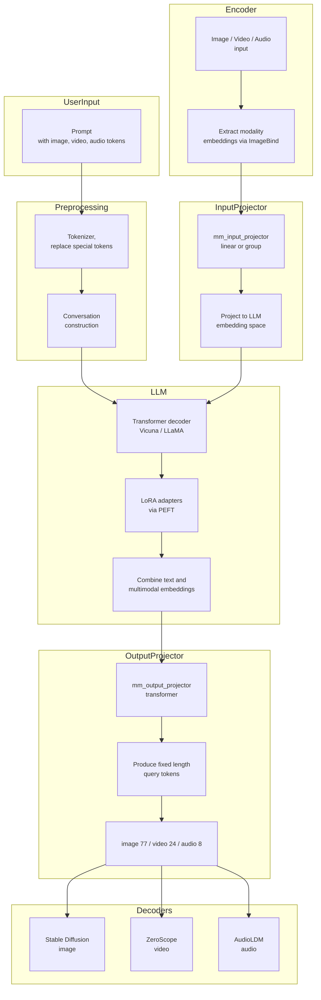
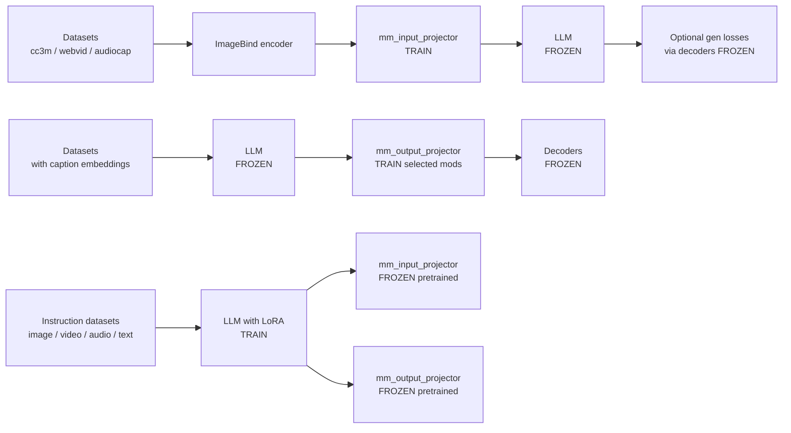
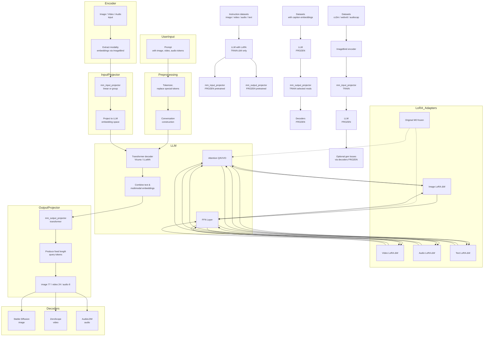

---

# 📑 多模态大模型技术总结

## 目录

* [1. 核心架构与原理](#1-核心架构与原理)

  * [1.1 输入处理层](#11-输入处理层)

    * [1.1.1 多模态编码器](#111-多模态编码器)
    * [1.1.2 输入投影层](#112-输入投影层)
  * [1.2 核心骨干网络](#12-核心骨干网络)

    * [1.2.1 大语言模型](#121-大语言模型)
  * [1.3 输出生成层](#13-输出生成层)

    * [1.3.1 输出投影层](#131-输出投影层)
    * [1.3.2 多模态解码器](#132-多模态解码器)

* [2. 训练与微调策略](#2-训练与微调策略)

  * [2.1 阶段一 模态对齐预训练](#21-阶段一-模态对齐预训练)
  * [2.2 阶段二 输出对齐预训练](#22-阶段二-输出对齐预训练)
  * [2.3 阶段三 指令微调](#23-阶段三-指令微调)

* [3. 关键实现细节与挑战](#3-关键实现细节与挑战)

  * [3.1 参数高效微调 PEFT](#31-参数高效微调-peft)
  * [3.2 推理与部署优化](#32-推理与部署优化)
  * [3.3 挑战](#33-挑战)

---

## 1. 核心架构与原理

多模态大模型通常采用 **“编码器-骨干-解码器”** (Encoder-Backbone-Decoder) 的通用范式。Next-GPT 是该范式的典型代表。



---

### 1.1 输入处理层

#### 1.1.1 多模态编码器

* **图像编码器**：CLIP ViT 或 BLIP-2 Q-Former
  功能：将图像编码为固定数量 token 特征 `V = [v1, ..., vN]`

* **音频编码器**：ImageBind、CLAP 或 Whisper
  功能：将音频波形编码为序列特征 `A_enc = [a1, ..., aM]`

* **视频编码器**：均匀采样帧并使用图像编码器，音频轨可单独编码，再融合视觉和音频特征

#### 1.1.2 输入投影层

* 功能：将模态特征 `(V, A_enc, ...)` 投影到 LLM 的嵌入空间
* 实现：线性层 (`nn.Linear`) 或组线性
* 重要性：实现模态对齐，使 LLM 理解非文本模态

---

### 1.2 核心骨干网络

#### 1.2.1 大语言模型

* 模型：LLaMA、Vicuna、Qwen
* 功能：接收文本 token + 投影后的非文本 token
* 输入格式：
  `[Text_Tokens] + [IMG] + [Projected_Image_Tokens] + ...`
  使用 `<Image>`、`<Audio>` 等特殊 token 指示模态

---

### 1.3 输出生成层

#### 1.3.1 输出投影层

* 功能：将 LLM hidden states 转换为解码器 query token
* 实现：线性层

#### 1.3.2 多模态解码器

* 文本解码器：LLM 本身
* 图像解码器：潜在扩散模型（LDM，如 Stable Diffusion）
* 音频/视频解码器：AudioLDM、VideoLDM 或 CogVideo

---

## 2. 训练与微调策略

三阶段训练流程：



### 2.1 阶段一 模态对齐预训练

* 脚本：`pretrain_enc.sh`
* 对象：输入投影层
* 冻结：LLM、输出投影层、解码器
* 目标：将模态 embedding 翻译为 LLM 可理解的语言

### 2.2 阶段二 输出对齐预训练

* 脚本：`pretrain_dec.sh`
* 对象：输出投影层
* 冻结：LLM、解码器
* 目标：将 LLM hidden states 翻译为解码器 query token

### 2.3 阶段三 指令微调

* 脚本：`train_mem.sh`
* 对象：LLM（LoRA 微调）
* 冻结：输入/输出投影层
* 目标：学会多模态指令对话与生成

---

## 3. 关键实现细节与挑战

### 3.1 参数高效微调 PEFT（LoRA）

**LoRA**：仅训练低秩矩阵适配器，冻结原始 LLM 权重。

#### 原理

```
ΔW = A B,  W = W0 + α ΔW
```

* \$A \in R^{d×r}\$, \$B \in R^{r×k}\$, \$r \ll min(d,k)\$
* α 为缩放系数

#### Transformer 应用

* 注意力层 Q/K/V/O：`Q' = Q0 + α * A_Q B_Q` 等
* FFN 层：`FFN_out = FFN0(x) + α * A_FFN B_FFN * x`

#### Python 示例

```python
import torch
import torch.nn as nn

class LoRALinear(nn.Module):
    def __init__(self, in_features, out_features, r=4, alpha=1.0):
        super().__init__()
        self.weight = nn.Parameter(torch.zeros(out_features, in_features))
        self.A = nn.Parameter(torch.randn(out_features, r) * 0.01)
        self.B = nn.Parameter(torch.randn(r, in_features) * 0.01)
        self.alpha = alpha

    def forward(self, x):
        delta = self.alpha * (self.A @ self.B)
        W = self.weight + delta
        return x @ W.T

q_lora = LoRALinear(1024, 1024, r=8, alpha=16)
x = torch.randn(2, 10, 1024)
out = q_lora(x)
```


#### Next-GPT 应用

1. 输入投影层：微调 input projector
2. 输出投影层：微调 output projector
3. LLM 本体：附加 LoRA 到注意力和 FFN 层
4. 多模态指令微调：高效适配不同任务

### 3.2 推理与部署优化

* 静态图编译（TorchScript/ONNX）
* 算子融合（Linear + LayerNorm）
* 权重量化（FP16 → INT8/INT4）
* KV-Cache 加速自回归生成

### 3.3 挑战

* 模态对齐
* 训练稳定性
* 计算成本
* 生成质量与可控性

---

# 📑 多模态大模型技术总结（含 LoRA Adapter 流程图）

---



---

### 💡 说明

1. **LoRA Adapter 模态**

   * `LA_IMG`：图像 LoRA ΔW
   * `LA_VID`：视频 LoRA ΔW
   * `LA_AUD`：音频 LoRA ΔW
   * `LA_TEXT`：文本 LoRA ΔW

2. **训练阶段**

   * 阶段一：输入投影训练（冻结 LLM 与输出投影）
   * 阶段二：输出投影训练（冻结 LLM）
   * 阶段三：LLM 微调（只更新各模态 LoRA ΔW，原始权重冻结）

3. **可视化效果**

   * 左：数据流入
   * 中：LLM + LoRA ΔW 按模态独立
   * 右：输出生成器
   * LoRA 插入点和训练状态清晰

---

