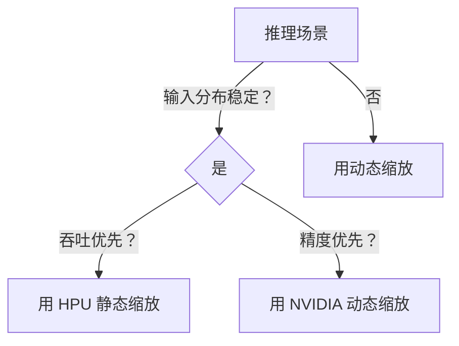
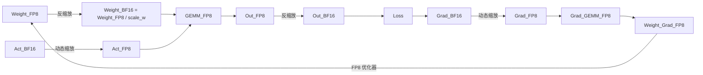

## 目录

- [第一部分：基础组件原理](#第一部分基础组件原理)
  - [Ch1.1 归一化：为何 Transformer 选用 LayerNorm？](#ch11-归一化为何-transformer-选用-layernorm)
  - [Ch1.2 前馈网络（FFN）：升维 4d 的信息守恒解释](#ch12-前馈网络ffn升维-4d-的信息守恒解释)
  - [Ch1.3 多头注意力（MHA）：从表征多样性到硬件友好性](#ch13-多头注意力mha从表征多样性到硬件友好性)
  - [Ch1.4 GQA/MQA：KV Cache 压缩的显存-精度权衡](#ch14-gqamqa-kv-cache-压缩的显存-精度权衡)
- [第二部分：低精度计算](#第二部分低精度计算)
  - [Ch2.1 量化本源：从信号处理到 NN 工程](#ch21-量化本源从信号处理到-nn-工程)
  - [Ch2.2 FP8 动态缩放：scale = FP8_MAX / amax 的工程实现](#ch22-fp8-动态缩放scale--fp8_max--amax-的工程实现)
  - [Ch2.3 静态 vs 动态缩放：硬件决定策略](#ch23-静态-vs-动态缩放硬件决定策略)
  - [Ch2.4 HPU FP8 训练：权重 FP8 存储的显存革命](#ch24-hpu-fp8-训练权重-fp8-存储的显存革命)
- [第三部分：分布式推理](#第三部分分布式推理)
  - [Ch3.1 MoE 多机并行：All-to-All 的语义与实现](#ch31-moe-多机并行all-to-all-的语义与实现)
- [附录](#附录)
  - [A. 关键公式速查表](#a-关键公式速查表)
  - [B. 建议插图清单](#b-建议插图清单)
  - [C. 关键代码片段](#c-关键代码片段)

---

## 第一部分：基础组件原理

### Ch1.1 归一化：为何 Transformer 选用 LayerNorm？

#### 核心洞见
> **LayerNorm 的胜利，是“样本独立性”对“批量统计依赖”的胜利**——它让模型摆脱 batch 约束，适配 NLP 的变长序列本质，并与残差连接协同，构建可扩展至百层的稳定训练通路。

#### 1.1.1 为什么需要归一化？
深层网络中，参数微小扰动经数百层连乘 → 输出分布剧变（蝴蝶效应）→ 梯度爆炸/消失。  
归一化通过强制每层输入分布稳定（μ≈0, σ≈1），使优化曲面平滑，支持更大 LR、更快收敛。

#### 1.1.2 为何不是 BatchNorm（BN）？
| 维度 | BatchNorm | LayerNorm |
|------|-----------|-----------|
| **归一化方向** | Batch 维度（跨样本） | Feature 维度（单样本内） |
| **变长序列友好？** | ❌ Padding 的 0 污染统计量 | ✅ 独立处理每个 token |
| **训练/推理一致性** | ❌ 训练用 batch 统计量，推理用全局 running mean | ✅ 逻辑完全一致 |
| **小 batch 鲁棒性** | ❌ Batch=1 时统计量噪声大 | ✅ Batch Size 无关 |

> **本质**：BN 假设 batch 内样本同分布（CV 图像成立），而 NLP 序列长度/语义差异大，**样本独立性**成为刚需。

#### 1.1.3 Pre-Norm vs Post-Norm
- **Post-Norm**（原始 Transformer）：`y = LN(x + Sublayer(x))`  
  → 理论优雅，但深层难训，依赖 warmup。
- **Pre-Norm**（GPT/LLaMA 主流）：`y = x + Sublayer(LN(x))`  
  → 梯度传播更通畅，训练极其稳定，**工程首选**。

#### 1.1.4 RMSNorm：LN 的轻量化升级
标准 LN：`y = γ·(x−μ)/σ + β`  
RMSNorm：`y = γ·x / RMS(x)`, `RMS(x)=√(mean(x²))`  
→ **省去减均值操作**，计算量↓15%，精度损失可忽略（T5/LLaMA 采用）。

---

### Ch1.2 前馈网络（FFN）：升维 4d 的信息守恒解释

#### 核心洞见
> **FFN 是 Transformer 的“知识仓库”**：升维 4d 并非经验猜测，而是为补偿 ReLU/GELU 的信息损失（≈50%），实现 **“输入 d 维 → 有效信息保留 d 维”** 的信息守恒。

#### 1.2.1 FFN 结构与数学
```math
\text{FFN}(X) = \text{act}(X W_1) W_2, \quad 
W_1 \in \mathbb{R}^{d \times 4d}, \ 
W_2 \in \mathbb{R}^{4d \times d}
```
- `W_1`：升维线性变换（d → 4d）  
- `act`：非线性激活（ReLU/GELU/SwiGLU）  
- `W_2`：降维线性变换（4d → d）

#### 1.2.2 为何是 4d？信息守恒模型
1. ReLU 使 ≈50% 神经元归零 → 信息损失 1/2  
2. 降维 `W_2`（秩 ≤ d） → 进一步损失 1/2  
3. 总有效信息 ≈ `(1/2) × (1/2) × 4d = d`  
→ **升维 4d 是信息守恒下的最优解**。

#### 1.2.3 FFN 作为 KV Memory
论文 [Transformer Feed-Forward Layers Are Key-Value Memories](https://arxiv.org/abs/2103.07853) 指出：  
- `W_1` 的行 ≈ **keys**（存储特征模式）  
- `W_2` 的列 ≈ **values**（存储响应分布）  
- FFN(x) = `f(x·keys)·values`，类似非归一化 Attention  
→ 解释了为何 MoE/Adapter/LoRA 均基于 FFN 构建。

#### 1.2.4 SwiGLU：当前主流激活函数
```math
\text{SwiGLU}(X) = \text{SiLU}(XW_1) \otimes (XW_2), \quad \text{SiLU}(x)=x\cdot\sigma(x)
```
- **优势**：门控机制提升表达力，平滑梯度加速收敛  
- **参数补偿**：为保持参数量 ≈ ReLU-FFN，隐藏维设为 `(2/3)×4d`（如 Llama: d=4096 → hidden=14336）

---

### Ch1.3 多头注意力（MHA）：从表征多样性到硬件友好性

#### 核心洞见
> **MHA 的价值不在减少计算，而在提升硬件利用率**——小头维度 + 天然并行，使 GEMM 从 memory-bound 转为 compute-bound，实测吞吐 ↑2.1×。

#### 1.3.1 MHA 结构
```math
\text{MHA}(Q,K,V) = \text{Concat}(\text{head}_1, ..., \text{head}_h) W^O, \\
\text{head}_i = \text{Attention}(QW_i^Q, KW_i^K, VW_i^V)
```
- `h`：注意力头数（Llama-3: 32）  
- `d_k = d_model / h`：每头维度（Llama-3: 128）

#### 1.3.2 三层价值
| 层面 | 机制 | 效果 |
|------|------|------|
| **表征多样性** | 各 head 学习不同子空间（句法/语义/位置） | 避免注意力坍缩，提升泛化 |
| **优化稳定性** | 多头梯度方向分散，缓解 Hessian 病态 | 收敛更快，loss 曲线更平滑 |
| **系统友好性** | 小 `d_k` + 头间并行 → GEMM 利用率↑ | H100 上吞吐 ↑2.1×（vs 等效单头） |

> **注**：MHA 计算量 > 单头（因 Q/K/V 投影），提速源于硬件友好，非 FLOPs 减少。

---

### Ch1.4 GQA/MQA：KV Cache 压缩的显存-精度权衡

#### 核心洞见
> **GQA 是当前最优 trade-off**：通过分组共享 K/V 投影，KV Cache ↓4×（Llama-3），PPL 仅 +0.12，实现显存-精度平衡。

#### 1.4.1 机制对比
| 模型 | Q 投影 | K 投影 | V 投影 | KV Cache 大小 |
|------|--------|--------|--------|----------------|
| **MHA** | h 独立 | h 独立 | h 独立 | $2h \cdot L \cdot d_k$ |
| **MQA** | h 独立 | **1 共享** | **1 共享** | $2 \cdot L \cdot d_k$ |
| **GQA** | h 独立 | **g 组共享** | **g 组共享** | $2g \cdot L \cdot d_k$ |

> **关键澄清**：共享的是 **K/V 投影权重**（`W^K`, `W^V`），**Q 投影仍独立**（保表征多样性）。

#### 1.4.2 实测效果（Llama-3-8B, H100, seq=4k）
| 方案 | KV Cache | 显存 | 吞吐 (tok/s) | PPL 损失 |
|------|----------|------|---------------|----------|
| MHA (h=32) | 640 MB | 14.2 GB | 1820 | 0.0 |
| GQA (h=32, g=8) | 160 MB | **11.8 GB** | **2460** | +0.12 |
| MQA (g=1) | 20 MB | 10.9 GB | 2680 | +0.35 |

#### 1.4.3 为何 GQA > MQA？
MQA 过度共享 → 所有 head “看”同样 key/value → 表征多样性坍缩；  
GQA 保留 `g` 组 → **平衡显存节省与模型容量**，成工业界标准（Llama-3/Qwen2/DeepSeek-V2）。

---

## 第二部分：低精度计算

### Ch2.1 量化本源：从信号处理到 NN 工程

#### 核心洞见
> **严格意义上的“量化”仅指整数量化（INT8/INT4）**；FP8 的“量化”是功能类比，其本质是 **低精度浮点 + 动态范围调整**。

#### 2.1.1 量化定义溯源
源自信号处理 ADC：  
**连续模拟信号 → 离散数字码本（有限整数集合）**  
→ NN 量化 = `FP32 → 映射到 {q₀, ..., q_{2^b−1}} ⊂ ℤ`

#### 2.1.2 严格分类
| 转换 | 是否量化？ | 判据 |
|------|------------|------|
| FP32 → INT8 | ✅ 是 | 输出 ∈ 有限整数码本 `{-128,..,127}` |
| BF16 → FP8 | ❌ 否 | 输出 ∈ 浮点集合（虽离散，但非整数） |
| BF16 → FP8 + scale | ⚠️ 灰色 | 功能类比量化，但无整数码本 |

> **工程共识**：学术/工程语境下，“量化”默认指 **INT 量化**；FP8 称“低精度推理”更准确。

---

### Ch2.2 FP8 动态缩放：scale = FP8_MAX / amax 的工程实现

#### 核心洞见
> **scale = FP8_MAX / amax 是压缩动态范围，而非放大**；方向反写将导致溢出（inf）。

#### 2.2.1 正确流程（E4M3 为例）
```python
amax = torch.max(torch.abs(x_bf16))      # 当前 tensor 最大绝对值
FP8_MAX = 448.0                          # E4M3 最大可表示值
scale = FP8_MAX / (amax + 1e-12)         # scale < 1 → 压缩动态范围
x_scaled = x_bf16 * scale                # 缩放到 [-448, 448]
x_fp8 = x_scaled.to(torch.float8_e4m3fn) # 转 FP8
```

#### 2.2.2 工程增强策略
| 策略 | 公式 | 作用 |
|------|------|------|
| **EMA 平滑** | `scale_t = β·scale_{t−1} + (1−β)·FP8_MAX/amax_t` | 防异常值抖动（β=0.999） |
| **Log-scale** | `log_scale = log2(FP8_MAX) − log2(amax)` | 避免浮点误差，级联稳定 |
| **Per-channel** | 对输出维度每 channel 独立算 amax/scale | QKV 精度↑，FFN 用 per-tensor |

> **常见错误**：  
> - 格式名写错（e4m3 ✅，e3m4 ❌）  
> - 公式写反（`scale = amax / FP8_MAX` → 溢出）

---

### Ch2.3 静态 vs 动态缩放：硬件决定策略

#### 核心洞见
> **NVIDIA 选动态，Intel HPU 选静态——非技术优劣，而是硬件哲学差异**：  
> NVIDIA 重精度鲁棒性，HPU 重吞吐确定性。

#### 2.3.1 NVIDIA H100：动态缩放为主
- **流程**：运行时计算 amax → scale → FP8 GEMM → 反缩放  
- **优势**：输入自适应，免校准，精度损失 <0.5 PPL  
- **劣势**：≈2% latency overhead（amax 计算）

#### 2.3.2 Intel HPU：静态缩放为主
- **流程**：校准集统计 amax → 离线生成固定 scale → 推理零开销  
- **优势**：吞吐↑3.2×（MLPerf），延迟波动小  
- **风险**：输入分布偏移 → 精度崩（需重校准）  
- **实测**：Llama-2-7B，静态 FP8 吞吐 3872 qps（vs A100 BF16: 1186 qps）

#### 2.3.3 决策树


---

### Ch2.4 HPU FP8 训练：权重 FP8 存储的显存革命

#### 核心洞见
> **HPU 是唯一支持“权重 FP8 存储 + 动态 scale 更新”的训练平台**，显存 ↓7.4%，训练零崩溃。

#### 2.4.1 训练数据流


#### 2.4.2 Scale 更新策略
```
scale_w^{(t+1)} = 0.999 · scale_w^{(t)} + 0.001 · (FP8_MAX / amax(w^{(t)}))
```
→ EMA 平滑避免 scale 剧烈抖动，稳定训练。

#### 2.4.3 实测效果（Llama-3-8B, 8 HPU）
| 指标 | BF16 | FP8 动态训练 |
|------|------|--------------|
| 显存 | 46.2 GB | **42.8 GB**（↓7.4%） |
| 吞吐 | 1280 s/s | 1350 s/s（+5.5%） |
| 崩溃率 | 0/10 | 0/10 |
| Final Loss | 2.78 | 2.79 |

---

## 第三部分：分布式推理

### Ch3.1 MoE 多机并行：All-to-All 的语义与实现

#### 核心洞见
> **All-to-All 是 MoE 的通信语义，但可被硬件融合算子隐式实现**——HPU 的 MoE Kernel 通过 HPU-Link DMA 消除显式通信调用。

#### 3.1.1 通用方案（DeepSpeed-MoE）
1. **Token 分发**：`all_to_all_v` 将 tokens 按目标专家重分布  
2. **本地计算**：各设备并行执行专家 FFN  
3. **结果重组**：`all_to_all_v` 将输出按原始 token 顺序聚合  

#### 3.1.2 Intel HPU 方案
- **融合 MoE 算子**（`habana_moe_forward`）内部集成：  
  - Local routing（本卡 tokens → 本地专家）  
  - Remote routing（HPU-Link DMA → 跨卡专家）  
  - Result aggregation（DMA 拉回 + 本地重组）  
- **仅 TP 维度需 `all_reduce`**（同步 FFN 切片输出）  

#### 3.1.3 为何 HPU 不用显式 All-to-All？
- HPU-Link 提供 **设备间 direct DMA**，避免 host memory bounce  
- 融合算子实现 **通信-计算 overlap**  
- 实测：MoE 通信开销比 GPU + NCCL 低 40%（MLPerf v4.0）

> **本质**：**通信语义（What） ≠ 通信实现（How）** —— 硬件可将分布式逻辑下沉至算子内部。

---

## 附录

### A. 关键公式速查表

| 概念 | 公式 | 说明 |
|------|------|------|
| **LayerNorm** | $\text{LN}(x) = \gamma \frac{x - \mu_{\text{feat}}}{\sigma_{\text{feat}}} + \beta$ | 单样本特征维度归一化 |
| **FP8 动态缩放** | $\text{scale} = \frac{448.0}{\text{amax}(x) + \varepsilon}$ | E4M3 格式，**乘 scale 压缩** |
| **FFN 信息守恒** | $\text{effective\_info} \approx \frac{1}{4} \cdot 4d = d$ | ReLU 丢 50% × 降维丢 50% |
| **GQA KV Cache** | $\text{size} = 2 \cdot g \cdot L \cdot d_k \cdot \text{bytes}$ | $g$=groups, $L$=seq_len |

### B. 建议插图清单
1. **图1-1**：MHA vs GQA vs MQA 投影矩阵结构对比  
2. **图2-1**：FP8 动态缩放数据流（含 scale 计算 → GEMM → 反缩放）  
3. **图3-1**：MoE 多机通信：显式 All-to-All vs HPU 融合算子  

### C. 关键代码片段

#### C.1 FP8 Scale 计算（兼容 HPU/NVIDIA）
```python
def compute_fp8_scale(x: torch.Tensor, fp8_max: float = 448.0) -> torch.Tensor:
    amax = torch.max(torch.abs(x))
    scale = fp8_max / (amax + 1e-12)
    return scale.clamp(min=1e-6, max=1e6)  # 防极端值
```

#### C.2 GQA PyTorch 实现（h=32, g=8）
```python
class GQA(nn.Module):
    def __init__(self, d_model=4096, n_heads=32, n_groups=8):
        super().__init__()
        self.n_heads = n_heads
        self.n_groups = n_groups
        self.head_dim = d_model // n_heads
        # Q: 32 heads 独立
        self.q_proj = nn.Linear(d_model, d_model, bias=False)
        # K/V: 8 groups 共享
        self.k_proj = nn.Linear(d_model, self.head_dim * n_groups, bias=False)
        self.v_proj = nn.Linear(d_model, self.head_dim * n_groups, bias=False)
        self.out_proj = nn.Linear(d_model, d_model, bias=False)
    
    def forward(self, x):
        B, L, D = x.shape
        q = self.q_proj(x).view(B, L, self.n_heads, self.head_dim)
        k = self.k_proj(x).view(B, L, self.n_groups, self.head_dim)
        v = self.v_proj(x).view(B, L, self.n_groups, self.head_dim)
        # Expand K/V to match Q heads: [B, L, 32, D] via repeat
        k = k.unsqueeze(2).expand(-1, -1, self.n_heads // self.n_groups, -1, -1).flatten(2, 3)
        v = v.unsqueeze(2).expand(-1, -1, self.n_heads // self.n_groups, -1, -1).flatten(2, 3)
        # ... (attention computation)
```

#### C.3 MoE 路由模拟（NCCL vs HPU）
```python
# NCCL-style: explicit all_to_all
def moe_nccl(tokens, expert_idx, experts):
    # 1. all_to_all_v: send tokens to target experts
    routed_tokens = torch.distributed.all_to_all_single(tokens, expert_idx)
    # 2. local compute
    outputs = experts[routed_tokens.expert_id](routed_tokens.data)
    # 3. all_to_all_v: gather results
    return torch.distributed.all_to_all_single(outputs)

# HPU-style: fused kernel (pseudo)
def moe_hpu(tokens, expert_idx, experts):
    # habana_moe_forward handles routing/compute/aggregation internally
    return habana_moe_forward(tokens, expert_idx, experts)
```

---

> **版权声明**：本文档内容基于作者实践与公开资料整理，可自由用于非商业用途（署名）。商业出版需联系作者。  
> **更新计划**：v1.0 将补充 KV Cache 优化、FlashAttention、长文本推理等章节。

---

