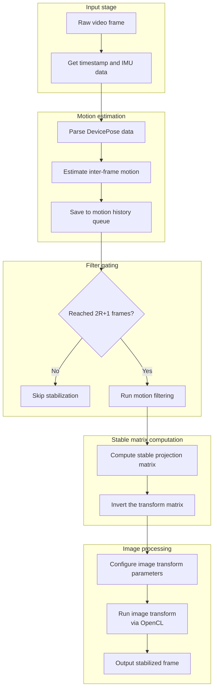
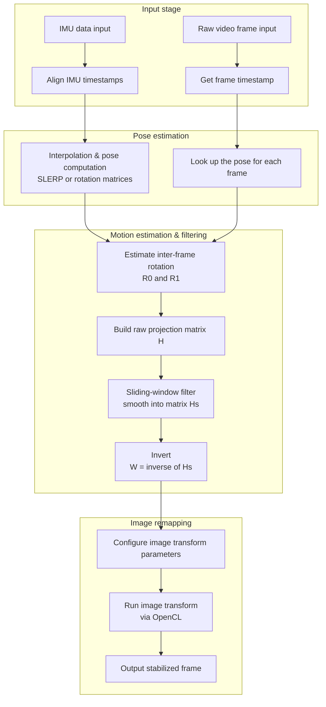

**English | [中文](./dvs_gyro.md)**

---

# libxcam Digital Video Stabilization — Technical Summary

## Table of Contents

* [libxcam Digital Video Stabilization — Technical Summary](#libxcam-digital-video-stabilization--technical-summary)

  * [Table of Contents](#table-of-contents)
  * [1. Core Idea](#1-core-idea)
  * [2. Main Algorithm Steps](#2-main-algorithm-steps)
    * [Step 0: IMU Interpolation & Synchronization](#step-0-imu-interpolation--synchronization)
    * [Step 1: IMU Device Pose → Projection Matrix](#step-1-imu-device-pose--projection-matrix)
    * [Step 2: Gaussian-Filtered Transformation Matrices](#step-2-gaussian-filtered-transformation-matrices)
    * [Step 3: Image Projection Compensation](#step-3-image-projection-compensation)
  * [3. Mathematical Modeling Details](#3-mathematical-modeling-details)
  * [4. Key Techniques Used](#4-key-techniques-used)
  * [5. Pros & Cons (Algorithmic View)](#5-pros--cons-algorithmic-view)
  * [6. Source Structure & Deployment Advice](#6-source-structure--deployment-advice)
    * [6.1 Source Module Structure](#61-source-module-structure)
    * [6.2 Image-Processing Implementation Details](#62-image-processing-implementation-details)
    * [6.3 Deployment Advice & Optimization Directions](#63-deployment-advice--optimization-directions)
  * [7. Summary (Compact Formula Form)](#7-summary-compact-formula-form)

---

## 1. Core Idea

> Use IMU data (gyroscope, accelerometer) to estimate inter-frame camera motion, then inverse-compensate the shake by transforming the image projection matrices — yielding a stabilized picture.

* **Inertial-model based**: unlike classic optical-flow methods, this algorithm estimates the camera pose trajectory directly from IMU data, avoiding image-matching errors.
* **Motion estimation + filtering**: extract the transformation matrix between each frame and the reference, then filter over a time window to remove abrupt changes.
* **Geometric correction**: inverse-transform the projection matrix for stable image output; pixel processing is OpenCL-accelerated.

### DVS Demo

---

## 2. Main Algorithm Steps

### Step 0: IMU Interpolation & Synchronization

* Align the timestamps of differently-sampled IMU streams (gyro, accelerometer) to the video-frame clock;
* Interpolate device poses precisely with linear interpolation or spherical linear interpolation of quaternions (SLERP) for a smooth pose trajectory;
* Output a continuous device-pose sequence for downstream processing.

### Step 1: IMU Device Pose → Projection Matrix

* Read the interpolated device pose (rotation matrix R and position t);

* Combine the camera intrinsic matrix K with the extrinsic pose to build the homogeneous projection matrix:

  $$
  H = K \cdot R_1 \cdot R_0^{-1} \cdot K^{-1}
  $$

* This yields the inter-frame image projection transform.

### Step 2: Gaussian-Filtered Transformation Matrices

* Apply Gaussian-weighted averaging to the projection-matrix sequence within a sliding window to suppress abrupt changes and jitter;
* Window size and weights trade stability against responsiveness;
* Produces the smooth ideal projection matrix $H_{\text{smooth}}$.

### Step 3: Image Projection Compensation

* Compute the inverse of the stabilized transform:

  $$
  W = H_{\text{smooth}}^{-1}
  $$

* Inverse-map every pixel coordinate and resample the image;

* Use OpenCL for parallel affine/perspective warping to maximize throughput;

* Output the stabilized frame.

### Overall Algorithm Flow

---

## 3. Mathematical Modeling Details

| Model Component | Formula |
| ------ | ----------------------------------------------------------------------------------- |
| Camera intrinsics | $K = \begin{bmatrix} f_x & s & c_x \\ 0 & f_y & c_y \\ 0 & 0 & 1 \end{bmatrix}$ |
| Extrinsic pose estimation | $R_1, R_0$ rotation matrices interpolated from IMU quaternions |
| Inter-frame projection | $H = K R_1 R_0^{-1} K^{-1}$ |
| Stabilization filter | $H_{\text{smooth}} = \sum w_i \cdot H_i$ |
| Image inverse mapping | $(x, y) = H^{-1}(x', y', 1)$, then sample & reconstruct the image |

---

## 4. Key Techniques Used

| Technique | Description |
| ------------- | ---------------------------------------- |
| **IMU sync & interpolation** | Align asynchronous IMU data with video frames, typically via linear interpolation / SLERP |
| **Pose-to-projection modeling** | Build homogeneous projection matrices from rotation matrices to estimate inter-frame image transforms |
| **Gaussian sliding-window filter** | Weighted averaging to remove local jitter and improve stability |
| **Projection-matrix inversion** | Apply the inverse of the ideal stabilized matrix as compensation, preventing image drift |
| **GPU-parallel sampling** | OpenCL kernels perform affine/perspective sampling to guarantee real-time performance |

---

## 5. Pros & Cons (Algorithmic View)

### ✅ Pros

* **Accurate pose modeling** — effectively removes hand-shake jitter;
* **Image-agnostic** — works with blur, occlusion, etc.;
* **Good real-time behavior** — runs OpenCL-accelerated even on edge devices;
* **No optical-flow failure modes** — no dependence on image feature matching, hence robust.

### ❌ Potential Cons

* Depends on IMU accuracy and timing alignment; consistency varies across devices;
* Fast motion or large rotations can produce black borders or distortion;
* No compensation for non-rigid shake (e.g. zoom changes from a wobbling lens).

---

## 6. Source Structure & Deployment Advice

### 6.1 Source Module Structure

* **IMU data module**: time synchronization, interpolation, and pose computation, delivering continuous, smooth device-pose data;
* **Motion-estimation module**: computes inter-frame projection matrices $H$ from device poses, supporting rotation-matrix construction and multiplication;
* **Filter module**: sliding-window Gaussian filtering to smooth the motion-trajectory matrices;
* **Image-transform module**:

  * configures image sampling parameters and computes the inverse transform;
  * implements OpenCL kernels for efficient projection warping and sampling;
* **Scheduling/interface module**: connects the video and IMU streams, manages buffers, and coordinates module calls.

### 6.2 Image-Processing Implementation Details

* 2-D coordinate mapping: target-frame pixels are mapped back into the source image coordinates;
* With OpenCL parallelism, every output pixel is sampled and interpolated (typically bilinear);
* Projection matrices are preloaded into device constant memory to cut kernel-invocation overhead;
* Input/output image buffers are managed carefully to avoid data-transfer bottlenecks and keep real-time performance.

### 6.3 Deployment Advice & Optimization Directions

To deploy DVS (Digital Video Stabilization) efficiently and robustly in a real system, the following are the key optimization points:

#### 1. Timing Synchronization & Calibration

- **IMU-to-frame alignment**: prefer hardware timestamp alignment (sync trigger signals, PTP), or software-calibrated interpolation (linear, SLERP) to raise sync precision.
- **Sensor calibration**: calibrate IMU mounting angles, focal length, principal point, etc. per camera model to keep projection matrices accurate.

#### 2. Filtering & Border Handling

- **Smoothing-parameter tuning**: per scenario (handheld, small vehicle platform), adjust the Gaussian window radius (2R+1) and weight distribution to balance "jitter removal" against "motion responsiveness".
- **Black-border compensation & cropping**: where projection introduces black borders, options include:
  - automatic cropping of the stable region;
  - edge stretching / mirror padding;
  - multi-frame assembly or content-aware inpainting.

#### 3. Performance & Engineering

- **Multithreading & pipelining**: decouple IMU processing, projection computation, and image warping into separate threads/async modules to raise concurrency and cut latency.
- **Hardware acceleration**:
  - adapt and tune the OpenCL kernels (memory access patterns, thread organization);
  - offload warping to GPUs, DSPs, or dedicated vision accelerators (VPU).

#### 4. Algorithm Extension Directions

- **Incorporate image content**: the current algorithm derives trajectories purely from IMU and struggles with drastic content change or non-rigid motion. Possible additions:
  - optical flow, feature-point tracking as image-level cues;
  - multi-modal fusion (LiDAR, visual-inertial SLAM) for robustness;
- **Complex-scene adaptation**: for night, strong light, blur and other low-quality conditions, improve tolerance to noise and uncertain motion.

---

## 7. Summary (Compact Formula Form)

* Let the raw inter-frame transform be $H_t$ and the target smooth trajectory $\bar{H}_t$; the image compensation is:

  $$
  W_t = \bar{H}_t^{-1}
  $$

* The final stabilized image is:

  $$
  I^{\text{stable}}_t(x, y) = I_t(W_t(x, y))
  $$

---

## Appendix A: libxcam DVS Source Structure

> The diagram below shows the module-level flow of Digital Video Stabilization in libxcam:

---
