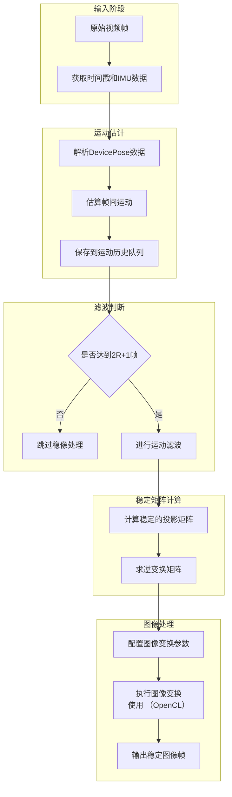
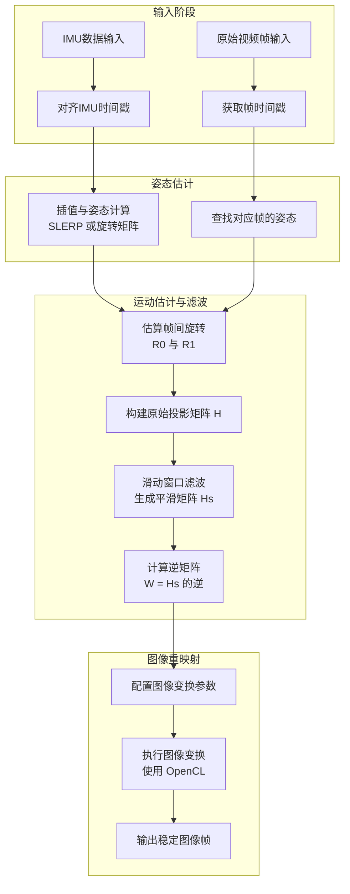

---

# libxcam Digital Video Stabilization 技术总结

## 目录

* [libxcam Digital Video Stabilization 技术总结](#libxcam-digital-video-stabilization-技术总结)

  * [目录](#目录)
  * [1. 核心算法思想](#1-核心算法思想)
  * [2. 算法主要步骤](#2-算法主要步骤)
    * [步骤零：IMU 插值与同步](#步骤零imu-插值与同步)
    * [步骤一：IMU 设备姿态 → 投影矩阵](#步骤一imu-设备姿态-→-投影矩阵)
    * [步骤二：高斯滤波平滑变换矩阵](#步骤二高斯滤波平滑变换矩阵)
    * [步骤三：图像投影补偿](#步骤三图像投影补偿)
  * [3. 数学建模细节](#3-数学建模细节)
  * [4. 使用的关键技术](#4-使用的关键技术)
  * [5. 优缺点分析（算法角度）](#5-优缺点分析算法角度)
  * [6. 源码结构与实际部署建议](#6-源码结构与实际部署建议)
    * [6.1 源码模块结构](#61-源码模块结构)
    * [6.2 OpenCL 图像处理实现细节](#62-图像处理实现细节)
    * [6.3 实际部署建议与优化方向](#63-实际部署建议与优化方向)
  * [7. 总结（简明公式版）](#7-总结简明公式版)

---

## 1. 核心算法思想

> 使用 IMU 数据（如陀螺仪、加速度计）估计帧间相机运动，通过图像投影矩阵变换逆向补偿抖动，实现画面稳像。

* **基于惯性测量建模**：与传统光流法不同，本算法依赖 IMU 数据直接估计相机姿态轨迹，避免图像匹配误差。
* **运动估计 + 滤波**：提取每帧与参考帧之间的变换矩阵，使用时间窗口滤波消除突变。
* **图像几何矫正**：将图像投影矩阵反变换，实现图像稳定输出，处理由 OpenCL 加速。

### DVS 效果演示

---

## 2. 算法主要步骤

### 步骤零：IMU 插值与同步

* 将不同频率的 IMU 数据（陀螺仪、加速度计）时间戳与视频帧时间对齐；
* 使用线性插值或四元数球面线性插值（SLERP）对设备姿态进行精确插值，保证平滑姿态轨迹；
* 输出连续的设备姿态序列供后续处理。

### 步骤一：IMU 设备姿态 → 投影矩阵

* 读取插值后的设备姿态（旋转矩阵 R 和位置 t）；

* 根据相机内参矩阵 K 结合外参姿态，构造齐次投影矩阵：

  $$
  H = K \cdot R_1 \cdot R_0^{-1} \cdot K^{-1}
  $$

* 得到两帧之间的图像投影变换。

### 步骤二：高斯滤波平滑变换矩阵

* 在滑动窗口内对投影矩阵序列使用高斯加权平均滤波，减少突变与抖动；
* 窗口大小和权重参数可调节以权衡稳定性和响应速度；
* 生成平滑的理想稳态投影矩阵 \$H\_{\text{smooth}}\$。

### 步骤三：图像投影补偿

* 计算稳态变换的逆矩阵：

  $$
  W = H_{\text{smooth}}^{-1}
  $$

* 对每个像素坐标做逆变换采样，进行图像重映射；

* 利用 OpenCL 进行并行加速的图像仿射或透视变换，提高处理效率；

* 输出稳定后的图像帧。

### 算法整体流程图

---

## 3. 数学建模细节

| 模型组件   | 数学表达式                                                                               |
| ------ | ----------------------------------------------------------------------------------- |
| 相机内参   | $K = \begin{bmatrix} f_x & s & c_x \\ 0 & f_y & c_y \\ 0 & 0 & 1 \end{bmatrix}$ |
| 外参姿态估计 | $R_1, R_0$ 从 IMU 四元数插值计算得到旋转矩阵                                                  |
| 帧间投影矩阵 | $H = K R_1 R_0^{-1} K^{-1}$                                                     |
| 稳像滤波   | $H_{\text{smooth}} = \sum w_i \cdot H_i$                                       |
| 图像反变换  | $(x, y) = H^{-1}(x', y', 1)$，采样并重构图像                                              |

---

## 4. 使用的关键技术

| 技术组件          | 描述说明                                     |
| ------------- | ---------------------------------------- |
| **IMU数据同步插值** | 将异步 IMU 数据与视频帧对齐，通常用线性插值/球面线性插值（SLERP）完成 |
| **姿态到投影建模**   | 使用旋转矩阵构建齐次投影矩阵，用于帧间图像变换估计                |
| **高斯滤波滑动窗口**  | 实施加权平均去除局部抖动，提升画面稳定性                     |
| **投影矩阵逆运算**   | 将理想稳像矩阵反变换后作为补偿，避免图像漂移                   |
| **GPU并行图像采样** | OpenCL 内核函数对图像做仿射或透视采样，确保实时性能            |

---

## 5. 优缺点分析（算法角度）

### ✅ 优点

* **姿态建模准确**，能有效消除由手持抖动带来的跳动；
* **对图像不敏感**，可适用于模糊、遮挡等情况；
* **实时性好**，在边缘设备上能以 OpenCL 加速运行；
* **避免光流失败**，不依赖图像特征点匹配，鲁棒性高。

### ❌ 潜在缺点

* 依赖 IMU 精度和时序对齐，设备间一致性差；
* 高速运动或大角度旋转时，容易产生黑边或扭曲；
* 对非刚体抖动（如晃动镜头的焦距变化）无补偿能力。

---

## 6. 源码结构与实际部署建议

### 6.1 源码模块结构

* **IMU数据处理模块**：负责时间同步、插值、姿态计算，提供连续平滑的设备姿态数据；
* **运动估计模块**：基于设备姿态计算帧间投影矩阵 $H$，支持旋转矩阵构造与矩阵乘法；
* **滤波模块**：实现滑动窗口高斯滤波，对运动轨迹矩阵平滑处理；
* **图像变换模块**：

  * 配置图像采样参数，计算逆变换矩阵；
  * 使用 OpenCL 编写核函数，执行高效的图像投影变换与采样；
* **调度与接口模块**：连接视频输入流、IMU数据流，管理缓冲区，协调各模块调用。

### 6.2 图像处理实现细节

* 使用二维坐标映射，将目标帧像素映射回源图像坐标系；
* 利用OpenCL的并行计算能力，针对每个输出像素执行采样和插值（通常是双线性插值）；
* 预先加载投影变换矩阵至设备常量内存，减少核函数调用开销；
* 管理输入输出图像缓冲区，避免数据传输瓶颈，保证实时性能。

### 6.3 实际部署建议与优化方向

为了在实际系统中高效、稳定地部署 DVS（Digital Video Stabilization）算法，以下几个方面是关键优化点：

#### 1. 时序同步与校准

- **IMU 与视频帧的时间对齐**：推荐采用硬件时间戳对齐机制（如同步触发信号、PTP 协议），或通过软件校准插值方式（如线性插值、SLERP）提高时间同步精度。
- **传感器内参校准**：根据具体摄像头型号，对 IMU 安装角度、焦距、主点等内参进行标定，以确保投影矩阵的准确性。

#### 2. 滤波与黑边处理

- **平滑滤波参数调节**：针对不同场景（如手持设备、小型车载平台），可调整高斯滤波窗口半径（即 2R+1）与权重分布，以在“去抖动稳定性”与“运动响应性”之间取得平衡。
- **黑边补偿与裁剪策略**：因图像投影导致的边缘黑边现象，可采用如下处理方式：
  - 自动裁剪稳定区域；
  - 边缘拉伸、镜像扩展；
  - 多帧拼接或基于内容填充算法（Inpainting）。

#### 3. 性能优化与工程落地

- **多线程与流水线并发处理**：将 IMU 数据处理、投影矩阵计算与图像变换操作解耦为多个线程或异步模块，提高并发处理效率，降低延迟。
- **硬件加速支持**：
  - 针对 OpenCL 核心的适配与调优（如内存访问模式、并行线程组织）；
  - 利用 GPU、DSP 或专用视觉加速芯片（如 VPU）进行图像变换运算。

#### 4. 算法拓展方向

- **引入图像内容信息**：当前算法主要基于 IMU 推算运动轨迹，难以处理内容剧烈变化或非刚体运动。可引入：
  - 光流、特征点追踪等图像层信息；
  - 结合多模态数据（如 LiDAR、视觉惯性 SLAM）增强稳像鲁棒性；
- **复杂场景适配**：针对夜间、强光、模糊等低质量图像场景，增强对噪声与不确定运动的容错能力。

---

## 7. 总结（简明公式版）

* 设帧间原始变换为 \$H\_t\$，目标平稳轨迹为 \$\bar{H}\_t\$，图像补偿为：

  $$
  W_t = \bar{H}_t^{-1}
  $$

* 最终稳定图像由：

  $$
  I^{\text{stable}}_t(x, y) = I_t(W_t(x, y))
  $$

---

## 附录 A：libxcam DVS 源码结构图

> 下图展示了 libxcam 中 Digital Video Stabilization 的模块级处理流程：

---