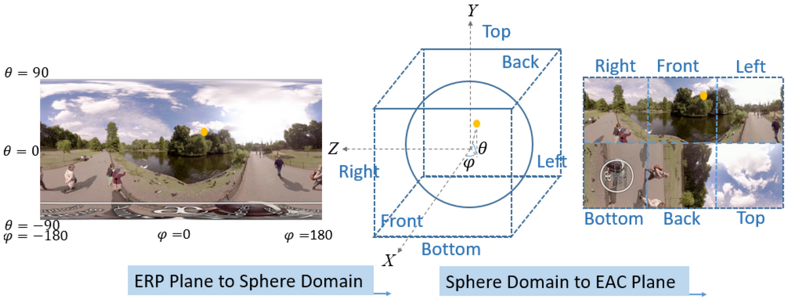
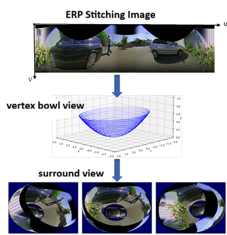
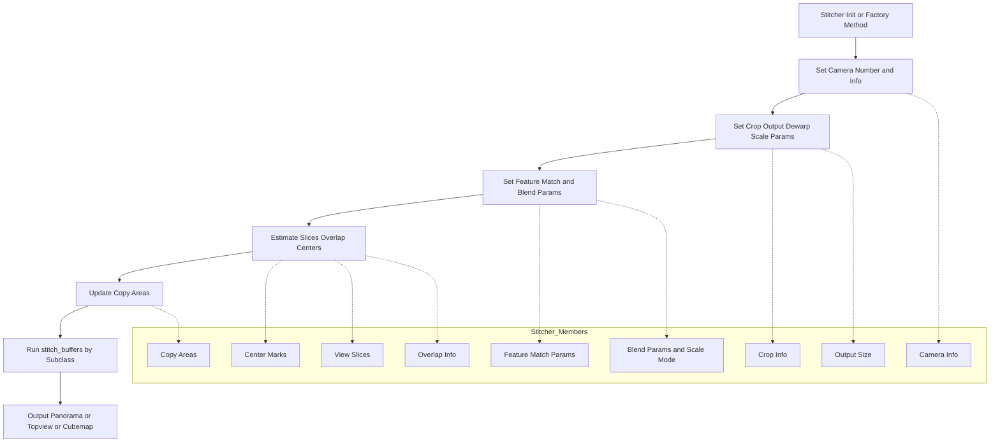
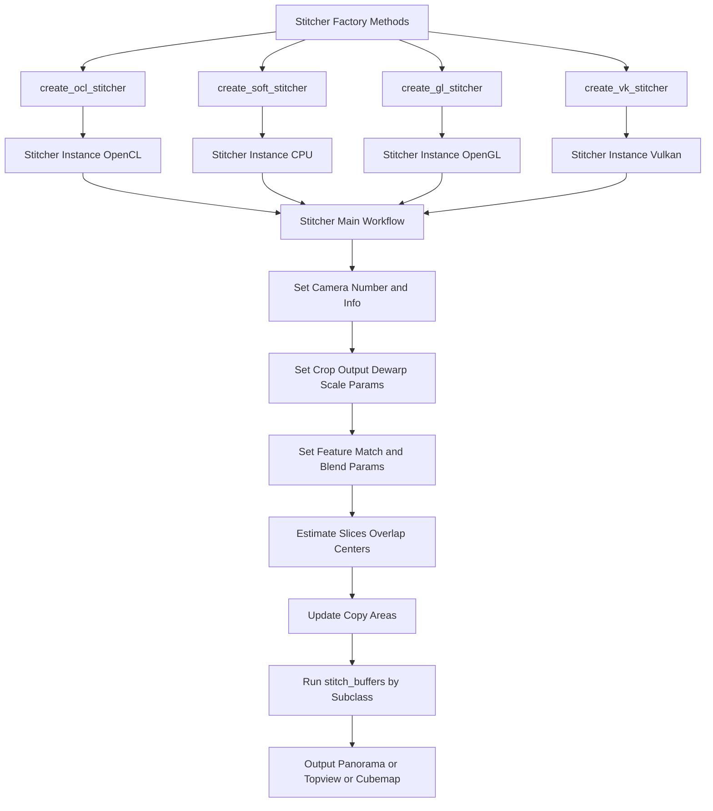
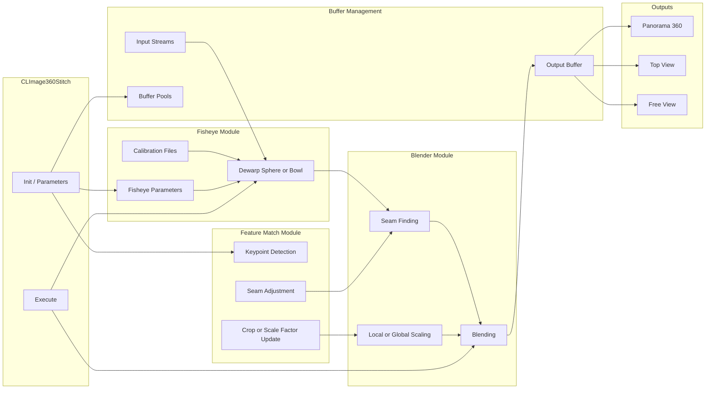
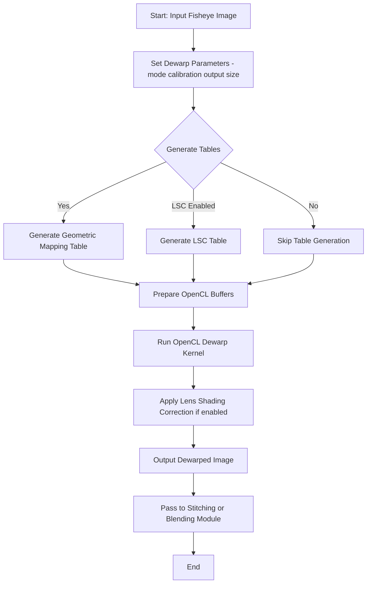
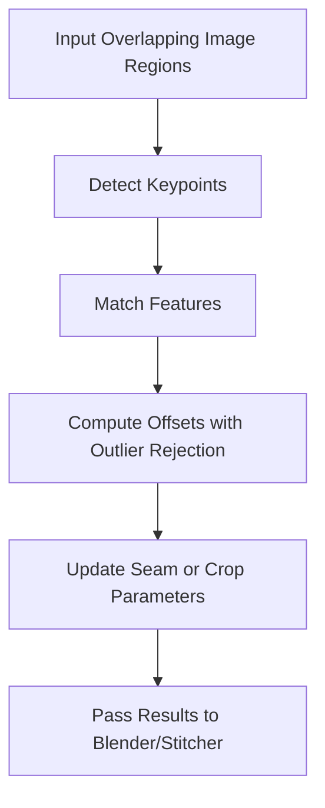
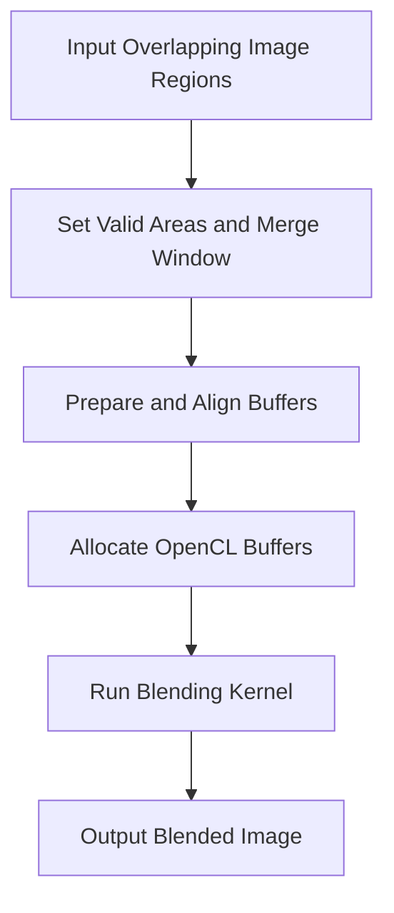

# libxcam Video Stitching

---

## 360 Stitching algorithum integration in application

### 8K 360 Stitching

 [](https://github.com/zongwave/pixelcraft/blob/master/cv/diagram/xcam_360_video_stitching_3_cams.png)


### Surround View for automotive

 [](https://github.com/zongwave/pixelcraft/blob/master/cv/diagram/xcam_360_video_stitching_3_cams.png)
.png


## Stitcher Interface

The **Stitcher Module** defines the core interface and logic for 360-degree image stitching in the libxcam framework. It provides an abstract base class (`Stitcher`) and factory methods to create stitching instances for different hardware backends, including OpenCL (GPU), CPU, OpenGL, and Vulkan.

**Key responsibilities:**
- **Backend Abstraction:**  
  Provides static factory methods:
  - `create_ocl_stitcher()` for OpenCL (GPU) stitching
  - `create_soft_stitcher()` for CPU stitching
  - `create_gl_stitcher()` for OpenGL stitching
  - `create_vk_stitcher()` for Vulkan stitching  
  This makes the stitching pipeline flexible and able to run on different acceleration platforms.

- **Camera and Crop Management:**  
  Handles camera parameters, cropping info, and viewpoint ranges.

- **Geometric Model Support:**  
  Supports bowl, sphere, and cubemap projections for flexible output types.


  [](https://github.com/zongwave/pixelcraft/blob/master/cv/diagram/stitching_erp_cubemap.png)


- **Overlap and Seam Calculation:**  
  Calculates overlapping regions and valid areas between adjacent camera views, managing seam placement for smooth blending.


- **Feature Match Integration:**  
  Supports configuration and tracking of feature match regions for adaptive seam adjustment.


- **Vertex and Texture Mapping:**  
  Generates 3D-2D mappings for various projections (panorama, topview, cubemap).

 [](https://github.com/zongwave/pixelcraft/blob/master/cv/diagram/surround_view.png)


- **Pipeline Coordination:**  
  Orchestrates the sequence: camera info → view slices → crop info → center marking → overlap estimation → copy area update.




---


## C API for 360 Stitching

This file provides the C-style API for initializing, configuring, and executing the 360 stitching pipeline in libxcam. It acts as a wrapper around the internal C++ context and handler classes, exposing a simple interface for external applications.

### Key API Functions

- **xcam_create_handle(const char *name)**
  - Creates and returns a new stitching context handle by name.

- **xcam_destroy_handle(XCamHandle *handle)**
  - Destroys and cleans up the given stitching context handle.

- **xcam_handle_init(XCamHandle *handle)**
  - Initializes the handler for the given context. Must be called after creation.

- **xcam_handle_uinit(XCamHandle *handle)**
  - Uninitializes the handler, releasing resources.

- **xcam_handle_get_usage(XCamHandle *handle, char *usage_buf, int *usage_len)**
  - Retrieves usage/help information for the handle.

- **xcam_handle_set_parameters(XCamHandle *handle, const char *params)**
  - Sets parameters for the context using a string of key=value pairs.

- **xcam_handle_execute(XCamHandle *handle, XCamVideoBuffer **buf_in, XCamVideoBuffer **buf_out)**
  - Executes the main processing (e.g., 360 stitching) on the input buffers and writes results to the output buffers.

### Buffer Utilities

- **append_extbuf_to_xcambuf(XCamVideoBuffer *extbuf)**
  - Wraps an external buffer as an internal buffer.

- **copy_extbuf_to_xcambuf(XCamHandle *handle, XCamVideoBuffer *buf)**
  - Copies data from an external buffer to an internal buffer.

- **copy_xcambuf_to_extbuf(XCamVideoBuffer *extbuf, const SmartPtr<VideoBuffer> &xcambuf)**
  - Copies data from an internal buffer to an external buffer.

---

**Summary:**  
These APIs allow external (C or C++) applications to create, configure, and run the 360 stitching pipeline in libxcam, handling buffer conversion and resource management internally. They provide a simple and unified interface for integrating 360 stitching into

---



---

## Stitching Algorithm Design Framework

### 1. Input & Output Management

* **Input streams**:

  * Multiple fisheye camera inputs handled via `CLStream`.
  * Provides buffer pool management, frame reading, looping, and rewind support.
* **Output streams**:

  * Stitched panorama output.
  * Optional **Top View** and **Free View** projections.
  * Handles file writing, buffer allocation, and output formats.

---

### 2. Core Stitcher

* **`CLImage360Stitch`** is the central class encapsulating the pipeline.
* Key functions:

  * **Dewarping** (sphere / bowl models).
  * **Feature Matching** (OpenCV-based, optional).
  * **Seam Finding & Blending** for smooth transitions.
  * **Lens Shading Correction (LSC)**.
  * **Scaling** (local/global modes).
  * **Multi-view Projection** (panorama, top view, free view).

---

### 3. Configuration & Parameters

* **Camera parameters**: intrinsic and extrinsic calibration files.
* **Resolution presets**: e.g., `1080p2cams`, `4k2cams`, `8k6cams`.
* **Runtime options**: enable/disable seam finder, fisheye map, LSC, save debug views, loop count for performance tests.

---

### 4. Processing Pipeline

1. Load multi-stream inputs and create buffer pools.
2. Initialize **Stitcher** with OpenCL context and configuration.
3. For each frame:

   * Read frames from all input streams.
   * Bind them to a stitched buffer.
   * Run `stitcher->execute()` to perform real-time stitching.
   * Optionally generate top view / free view projections.
   * Write output frames to file.
   * Collect FPS and latency statistics.

---

### 5. Debug & Visualization

* **Input debug**: fisheye lens centers, radius visualization.
* **Output debug**: optional frame dumps, frame number overlays, multiple view outputs.

---

### 6. Overall Framework (High-level Flow)

```
Multi-Stream Input (fisheye cams/files)
        │
        ▼
  Buffer Management (CLStream + CLBufferPool)
        │
        ▼
  CLImage360Stitch
   ├── Fisheye Dewarp (sphere/bowl)
   ├── Feature Matching (optional, OpenCV)
   ├── Seam Finding + Blending
   ├── Lens Shading Correction (LSC)
   ├── Scaling (local/global)
   └── Multi-view Projection (panorama, topview, freeview)
        │
        ▼
 Multi-Stream Output (NV12, files, debug images, FPS stats)
```

---

✅ In short: the framework demonstrates a **complete real-time stitching pipeline** — from **multi-camera input management → GPU-based dewarping & stitching → blending & correction → multiple output views → performance measurement**. It’s modular, configurable, and extensible to a production-grade VR stitching system.





---

## Fisheye Module: CLFisheyeHandler

The `CLFisheyeHandler` is responsible for fisheye image dewarping and lens shading correction in the stitching pipeline. Its main features include:

- **Dewarping Modes**: Supports both sphere and bowl models for fisheye correction, configurable per camera.
- **OpenCL Acceleration**: Uses OpenCL kernels for efficient GPU-based dewarping and optional lens shading correction (LSC).
- **Geometric & LSC Table Generation**: Automatically generates geometric mapping tables and LSC tables based on camera parameters and output requirements.
- **Flexible Parameterization**: Allows setting output size, destination range, fisheye intrinsic/extrinsic parameters, and LSC arrays or thresholds.
- **Buffer Management**: Converts input video buffers to OpenCL images and manages output buffers for downstream modules.
- **Factory Pattern**: Provides a factory function to create and configure the handler with the appropriate kernel(s) and options.

**Typical workflow:**
1. Initialize the handler with the desired dewarp mode and options.
2. Set parameters such as output size, fisheye calibration, and LSC.
3. Prepare input/output buffers and generate mapping tables.
4. Execute the OpenCL kernel(s) for dewarping and correction.
5. Pass the corrected images to the next stage in the pipeline.

This module is essential for correcting fisheye distortion and ensuring high-quality, artifact-free stitching results in multi-camera panoramic systems.

---



---

## Feature Match Module

The `FeatureMatch` module is responsible for optical flow-based feature matching between overlapping image regions, which is essential for adaptive seam placement and high-quality blending in multi-camera stitching.

**Key features:**
- **Offset Calculation:** Computes robust mean X/Y offsets between matched features, using outlier rejection for reliable alignment.
- **Configuration:** Allows setting matching parameters such as minimum corner count and error thresholds.
- **Crop Rectangle Management:** Supports defining and retrieving regions of interest in the input images.
- **Result Retrieval:** Provides interfaces to get the current X/Y offsets for seam adjustment and image alignment.
- **Extensibility:** Designed as a base class for specific feature matching algorithms in the stitching pipeline.

**Typical workflow:**
1. Initialize the `FeatureMatch` object and configure matching parameters.
2. Set crop rectangles for the left and right image regions.
3. Perform feature matching and compute robust offsets.
4. Retrieve the calculated offsets for use in seam finding and blending.



---


## Blender Module

The **Blender Module** is responsible for merging overlapping image regions from multiple cameras into a seamless panoramic output. It leverages OpenCL for efficient GPU-accelerated blending.

**Key features:**
- **Blending Kernels:** Uses OpenCL kernels (e.g., `CLBlenderScaleKernel`) to blend and scale image regions, supporting both Y and UV planes.
- **Merge Window Management:** Automatically calculates and manages the merge window and valid areas for each input image to ensure proper overlap and alignment.
- **Flexible Scaling Modes:** Supports local and global scaling modes for different blending strategies.
- **Buffer Management:** Prepares and aligns input/output buffers for optimal GPU processing.
- **Input Swapping:** Supports swapping input indices to handle different image orderings.
- **Integration:** Designed to work as part of the overall stitching pipeline, receiving dewarped images and outputting blended results.

**Typical workflow:**
1. Prepare input and output buffers, ensuring proper alignment and format.
2. Set valid areas and merge windows for overlapping regions.
3. Allocate OpenCL buffers and prepare kernel arguments.
4. Run the blending kernel to merge input images into a seamless output.
5. Pass the blended image to the next stage (e.g., final output or further processing).



---
