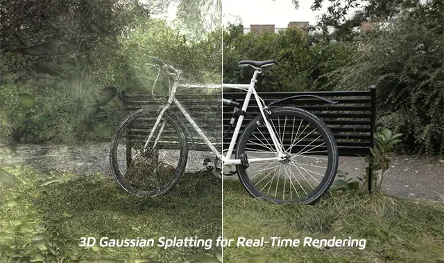
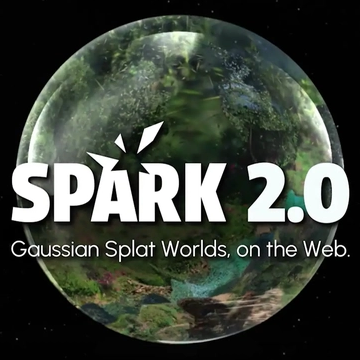
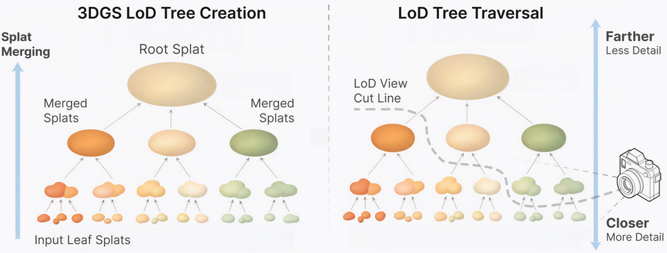
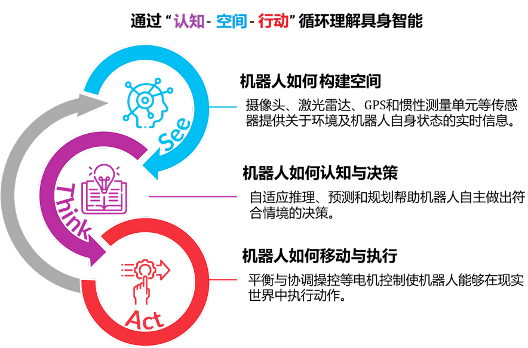
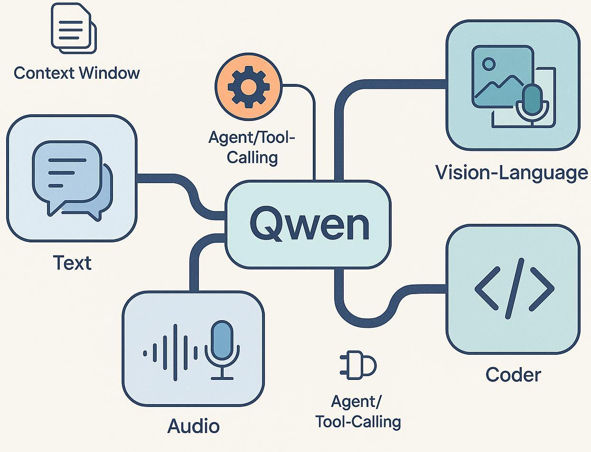
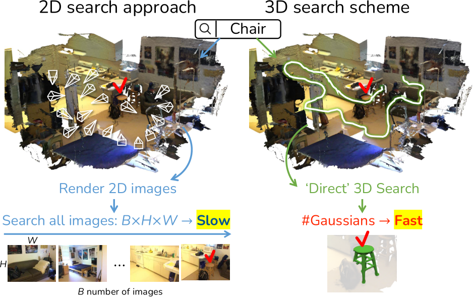
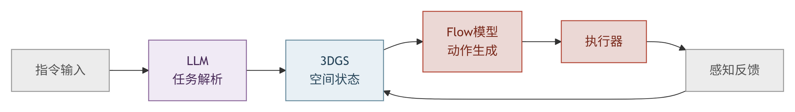

## 3DGS：物理世界的操作系统

### —— 兼论通往具身智能的技术路径

过去十年，AI 学会了 “读” 和 “写”；而未来十年，AI 必须学会 “看”、“建” 和 “做”。

近两年，一个原本属于计算机图形学与三维重建领域的技术 —— 3D Gaussian Splatting（3DGS）—— 正在快速 “出圈”。从学术论文到工业系统，其演进速度远超预期（Kerbl et al., 2023）。

更值得关注的是，这种演进不再局限于 “渲染更快”，而开始指向一个更宏大的问题：**机器如何在真实世界中构建、维护并使用一个可计算的三维表示。**

### 一个正在发生的信号：从渲染技术到世界级系统

2026年4月，World Labs 发布了 Spark 2.0，对基于 3DGS 的 Web 端渲染系统进行了系统级升级。

与早期工作不同，Spark 2.0 的目标不再只是 “高效渲染单个场景”，而是：**在任意设备上，流式加载并实时呈现一个可扩展的三维世界。**

其核心技术包括：

- **连续层次细节（Level-of-Detail, LoD）系统**：基于高斯层次结构（splat tree），动态选择渲染子集，使计算复杂度与视点相关而非与场景规模相关；

- **渐进式流式加载（Progressive Streaming）**：按视点优先级逐步加载 3DGS 数据，实现“边加载边交互”；

- **虚拟内存机制（Virtual Memory）**：在固定 GPU 内存预算下调度海量高斯数据，使浏览器端也能访问超大规模三维场景。

从系统角度看，这些设计带来了三个关键变化：

1. 渲染复杂度与场景规模解耦
2. 数据可跨设备流式访问
3. 多对象可统一组织于同一空间

这意味着：**3DGS 正在从“单场景表示方法”，演进为“可组合的三维世界表示系统”。**

值得注意的是，Spark 最初即服务于 “世界模型（World Model）” 方向的探索。在这一背景下，3DGS 不再只是图形学技术，而开始承担 “世界状态表达” 的角色。

### 一、为何需要“三位一体”？具身智能的三块拼图

如果将视角进一步拉高，可以看到一个逐渐清晰的技术共识：**通用具身智能依赖三类能力的统一 —— 认知、空间与行动。**

这对应着一个具有现实可行性的技术组合：

> **具身智能 ≈ 多模态 LLM（认知） + 3DGS（空间） + Flow-based 生成模型（行动）**

#### 1. 多模态LLM：机器的“认知中枢”

当人类发出指令 “把那个红色的杯子拿给我”，系统首先需要完成：语义理解、跨模态对齐、任务分解。多模态模型（如 GPT-4V、Qwen-VL、LLaVA）已经在这一层面表现出强大能力（Liu et al., 2023）。

但其输出仍然是符号层信息，无法直接回答：杯子的位置与姿态、是否被遮挡、抓取所需的物理约束。这些问题需要一个空间层表示来承载。

#### 2. 3DGS：机器的“空间眼”

传统三维表示存在明显取舍：Mesh/点云几何明确但表达能力有限；NeRF 表达连续但推理成本高（Mildenhall et al., 2020）。

3DGS 提供了一种新的平衡：实时渲染能力、显式结构（高斯集合）、可微分优化、可扩展属性（语义/动态）。

从表示学习角度看：3DGS 是一种介于显式几何与隐式场之间的**半显式可微表示**（JUNSEONG KIM et al., 2025）。近期工作进一步探索将语义信息注入 3DGS，使其从 “可视化表示” 走向 “可查询空间结构”。

换句话说：**3DGS 正在成为一种 “空间数据库”。**

#### 3. Flow-based 生成模型：机器的 “运动神经”

在行动层，问题转化为：如何生成连续且可控的动作。

扩散策略方法（如 Diffusion Policy）已验证其表达能力（Chi et al., 2023），但推理成本较高。Flow Matching 提供了一种更高效的路径（Lipman et al., 2022）：将生成过程建模为概率流，使用常微分方程 (ODE, Ordinary Differential Equation) 进行连续求解，支持更少步甚至单步生成。结合 Transformer 架构（如 DiT），可在保证表达能力的同时显著降低延迟（Peebles & Xie, 2023）。

从方法论上看：Flow Matching 正在成为连接扩散模型与连续流模型的关键桥梁。

### 二、从感知到行动：具身智能的闭环结构

将三者组合，可以形成一个完整闭环：

> **指令 → LLM（任务解析） → 3DGS（空间状态） → Flow模型（动作生成） → 执行 → 感知反馈 → 更新**

这一架构具有三个关键特征：**闭环（Closed-loop）、实时（Real-time）、可微（Differentiable）。**

三者分工明确：LLM 负责决策与规划，3DGS 负责世界建模，Flow 模型负责控制生成。

### 三、技术趋势：从分散方案走向统一范式

从学术界到工业界，不同技术路径正在收敛：多模态模型统一认知能力，三维表示强化空间理解，生成模型驱动连续控制。其共同指向是：**构建一个统一的 “认知—空间—行动” 系统。**

而 3DGS 的出现，使 “空间层” 首次具备与其他两层匹配的工程可行性。

### 四、工程现实：3DGS 落地仍面临挑战

尽管前景清晰，但工程实践仍存在门槛：理论复杂（体渲染、球谐函数等）、工程链路长（SfM/MVS → NeRF → 3DGS）、性能优化困难（GPU 与数据结构）。

当前开源生态的普遍问题是：**“能跑通” 不等于 “能理解、能优化”。**

### 五、写在最后：一条仍在展开的技术路径

三维重建技术正在经历一次重要转变：从离线建模工具，到在线感知系统，再到具身智能基础设施。

3DGS 只是这一过程中的关键节点，但其背后是一个更深层的趋势：**世界模型正在从抽象走向可计算、可交互、可实时。**

对于希望系统掌握这一领域的读者，我们在《三维重建技术与实践：基于 NeRF 与 3DGS 》中，尝试从多视图几何、神经表示到工程实现进行完整梳理。这本书更关注：技术体系、原理理解、工程贯通。

如果你正在思考空间智能或具身系统，这或许是一条值得深入的路径。

### 参考文献

- Chi, C. et al. (2023). Diffusion Policy: Visuomotor Policy Learning via Action Diffusion. *arXiv:2303.04137*.
- Kerbl, B. et al. (2023). 3D Gaussian Splatting for Real-Time Radiance Field Rendering. *ACM TOG (SIGGRAPH)*.
- JUNSEONG KIM. et al. (2025). Dr. Splat: Directly Referring 3D Gaussian Splatting via Direct Language Embedding Registration. *CVPR*.
- Lipman, Y. et al. (2022). Flow Matching for Generative Modeling. *arXiv:2210.02747*.
- Mildenhall, B. et al. (2020). NeRF: Representing Scenes as Neural Radiance Fields. *ECCV*.
- Peebles, W. & Xie, S. (2023). Scalable Diffusion Models with Transformers. *ICCV*.
- Liu, H. et al. (2023). Visual Instruction Tuning (LLaVA). *arXiv:2304.08485*.

---

**《三维重建技术与实践：基于NeRF与3DGS》**  
机械工业出版社 | ISBN：978-7-111-80414-7