# 3D Gaussian Splatting 技术总结

## 目录
- [3D Gaussian Splatting 技术总结](#3d-gaussian-splatting-技术总结)
  - [目录](#目录)
  - [1. 基本原理](#1-basic-concept)
  - [2. 可微光栅化](#2-gaussian-rasterizer)
  - [3. 光栅化实现](#3-3dgs-rasterizer-implementation)


---


## **1. Basic Concept**

3D Gaussian Splatting（3DGS）是一种近两年兴起的高效 3D 场景表示与渲染方法，它的核心思想是用\*\*连续的、高斯分布形状的点（Gaussian primitives）\*\*来替代传统的体素网格或三角网格表示，并利用高效的 GPU 栅格化（rasterization）管线来快速渲染。

* **场景表示**

  * 不用稠密的体素（如 NeRF 中的体积采样），而是将场景离散为一组带有位置、方向、形状、颜色和透明度属性的**各向异性 3D 高斯体**。
  * 每个高斯由以下参数描述：

    $$
    \mu \in \mathbb{R}^3 \quad\text{(中心位置)},\quad
    \Sigma \in \mathbb{R}^{3\times 3} \quad\text{(协方差矩阵)},\quad
    \mathbf{c} \quad\text{(颜色)},\quad
    \alpha \quad\text{(透明度)}
    $$
  * 协方差矩阵决定了高斯体的形状与方向，可以是椭球形且可旋转。

* **渲染思路**

  * 对每个视图，将 3D 高斯投影到 2D 图像平面，得到一个椭圆形的 2D 高斯“斑点”。
  * 根据视点与高斯的深度关系进行前向排序（或深度测试），再进行加权透明度混合。
  * 最终的像素颜色由多个 splat 按透明度 α 累加融合而成，类似 alpha blending。

* **优点**

  * **稀疏高效**：只渲染可见高斯，避免了 NeRF 那种固定分辨率的 3D 采样开销。
  * **训练速度快**：梯度可直接通过 rasterizer 回传，无需体积积分。
  * **实时渲染**：可在 GPU 上利用传统 rasterization 管线 + shader 实现，每帧毫秒级。

---

## **2. Gaussian Rasterizer**

3DGS 的渲染核心就是它的**高斯栅格化器（Gaussian Rasterizer）**，和三角形栅格化相似，但针对的是**椭球形 splat** 而不是平面三角形。

* **输入**：一批 3D 高斯体（位置、形状、颜色、透明度）
* **步骤**：

  1. **投影**

     * 将 3D 高斯中心 $\mu$ 通过相机投影矩阵映射到 2D 图像坐标。
     * 协方差矩阵通过雅可比变换映射到屏幕空间，得到 2D 椭圆的形状矩阵。
  2. **屏幕覆盖范围计算**

     * 计算椭圆包围盒（bounding box），确定它影响的像素范围，减少无效像素访问。
  3. **光栅化（Rasterization）**

     * 遍历包围盒内的像素，计算该像素到椭圆中心的归一化距离：

       $$
       d^2 = (\mathbf{x} - \mathbf{\mu}_{2D})^\top \Sigma_{2D}^{-1} (\mathbf{x} - \mathbf{\mu}_{2D})
       $$
     * 根据高斯函数值 $G(d)$ 和透明度 α 计算对该像素的颜色贡献。
  4. **深度与混合**

     * 按高斯中心深度排序，依次进行 α-blending：

       $$
       C_{\text{out}} = C_{\text{prev}} + (1 - \alpha_{\text{prev}}) \cdot \alpha_{\text{curr}} \cdot C_{\text{curr}}
       $$
     * 可使用 GPU 硬件的 Early-Z 测试或排序优化。
  5. **梯度反传**

     * 由于所有投影、距离计算、混合公式都是可微的，因此可直接反向传播更新高斯的参数。

---

✅ **一句话总结**：
3DGS 用少量各向异性高斯代替稠密体积采样，通过可微的 GPU 高斯栅格化器直接在屏幕空间渲染并反传梯度，实现了**高效、实时、可训练**的 3D 场景表示。

---


## **3. 3dgs rasterizer implementation**

3D Gaussian Splatting（3DGS）论文作者 Inria GraphDeco 团队开源实现里的 **核心 rasterizer（光栅化器）**，它负责把 3D 高斯直接在 GPU 上投影并渲染到屏幕像素，并且是 **可微分的**（forward + backward 都实现了）。

这个 rasterizer **不是**用传统的 OpenGL 三角形管线，而是自己写的 CUDA Kernel 做光栅化。
目标是：

1. **投影**：把 3D 高斯中心和形状（协方差）投影到屏幕，得到 2D 椭圆。
2. **切片 binning**：将椭圆影响的像素范围分成 **tile（瓦片）** 处理，减少线程竞争。
3. **排序**：同一个 tile 内，高斯按深度排序，保证正确的 α-blending 顺序。
4. **渲染**：每个 tile 独立 blending 出结果（颜色、alpha、深度）。
5. **反向传播**：对可训练参数（位置、旋转、颜色、透明度等）计算梯度。

---

### 3.1 Forward 渲染流程解析

对应 `Rasterizer::forward()`，主要步骤如下（我加了和 3DGS 理论的对应关系）：

### **Step 1: 投影 & 椭圆变换计算**

```cpp
CHECK_CUDA(FORWARD::preprocess(...))
```

* 把每个高斯 `(means3D, scales, rotations, opacities)` 投影到 2D（相机矩阵）。
* 通过雅可比变换把 3D 协方差变换成屏幕空间 2D 协方差，得到 **conic matrix**（椭圆形状）。
* 计算高斯覆盖的像素半径 `radii`（bounding circle）。
* 输出：

  * `means2D`：屏幕空间中心点
  * `depths`：中心深度
  * `cov3D`：3D 协方差（可能更新过）
  * `conic_opacity`：用于 blending 的高斯系数
  * `rgb`：球谐光照结果（或直接的颜色）

---

### **Step 2: 瓦片覆盖统计 & 前缀和**

```cpp
cub::DeviceScan::InclusiveSum(..., tiles_touched, point_offsets, P)
```

* 每个高斯会影响若干个 tile（瓦片）。
* `tiles_touched[i]` = 高斯 i 影响的 tile 数量。
* 前缀和得到每个高斯在**全局 tile-list 数组**的写入起始位置。

---

### **Step 3: 高斯实例化（1\:N 扩展）**

```cpp
duplicateWithKeys<<<>>>()
```

* 一个高斯可能被复制成多个“实例”，每个实例对应一个 tile。
* 为每个实例生成：

  * **key** = `[tile_id | depth_bits]` （高位是 tile ID，低位是深度）
  * **value** = 高斯的索引
* 这样可以用一次 radix sort 同时按 tile 分组 & tile 内按深度排序。

---

### **Step 4: 排序**

```cpp
cub::DeviceRadixSort::SortPairs(...)
```

* 把 `(key, value)` 排序：

  * tile 内深度有序
  * tile 之间相互独立
* 排序结果 `point_list` 是按 tile 分好块的高斯索引数组。

---

### **Step 5: tile 范围标记**

```cpp
identifyTileRanges<<<>>>()
```

* 找到每个 tile 在 `point_list` 中的 `[start, end)` 索引区间。
* 后续渲染时，tile 可以直接按自己的范围处理。

---

### **Step 6: 每个 tile 渲染**

```cpp
FORWARD::render(tile_grid, block, ...)
```

* 每个 tile 一个 CUDA block。
* 对 tile 范围内的高斯：

  * 根据 2D 椭圆公式计算该像素的高斯权重
  * 做 α-blending（前向累积颜色和 alpha）
* 写出结果到 `out_color` 和 `depth`。

---

### 3.2 Backward 梯度计算

`Rasterizer::backward()` 逻辑和 forward 类似，但做两件事：

1. **像素到高斯梯度反传**
   `BACKWARD::render()` 从 `dL/dpixel` 反推到：

   * 高斯的屏幕位置 `dL/dmean2D`
   * 椭圆形状 `dL/dconic`
   * 颜色梯度 `dL/dcolor`
   * 深度梯度 `dL/dinvdepth`
2. **屏幕空间梯度 → 3D 空间梯度**
   `BACKWARD::preprocess()` 把 2D 梯度反投影到 3D 高斯参数：

   * `dL/dmean3D`
   * `dL/dscale`（大小）
   * `dL/drot`（旋转）
   * `dL/dcov3D`（协方差）

这样就可以直接用这些梯度更新 3DGS 模型的可训练参数。

---

### 3.3 关键优化点

* **tile-based binning**：减少线程发散，提升内存访问局部性。
* **key 合并 tile+depth**：用一次排序搞定分组+排序。
* **CUDA cooperative groups**：线程协作减少原子操作。
* **CUB 前缀和 & radix sort**：调用高效的 GPU 并行算法库。
* **全流程可微**：forward/backward 都用同样的 tile 结构，方便梯度计算。

---

### 3.4 总结一句话

这个 rasterizer 本质上是 **“CUDA 实现的可微高斯光栅化 + tile 并行优化”**，流程是：

> **3D 高斯 → 投影成 2D 椭圆 → 确定影响 tile → 按 tile+深度排序 → 每 tile 并行 blending → 输出颜色 & 深度 → 可微反传更新参数**

---


## 4.

好，那我给你画一张 **3DGS Gaussian Rasterizer 数据流图**，按 forward 渲染路径来展示代码里的主要步骤和数据流。

---

### **3DGS Rasterizer Forward 数据流图**

```mermaid

flowchart TB
    %% Forward Pass (Green)
    subgraph ForwardPass
    direction TB
    A["输入 3D 高斯参数<br/>means3D, scales, rotations, opacities, colors..."]:::forward --> B["1 投影与椭圆变换<br/>preprocess<br/>• 3D 到 2D 投影 means2D depths<br/>• 屏幕空间协方差 conic<br/>• 球谐光照 颜色 rgb"]:::forward
    B --> C["2 计算影响的 tile 数量<br/>count_tiles<br/>• 根据 2D 椭圆包围盒统计覆盖瓦片"]:::forward
    C --> D["3 前缀和扫描<br/>prefix sum<br/>• 每个高斯在 tile 列表的起始位置"]:::forward
    D --> E["4 高斯实例化到 tile<br/>duplicateWithKeys<br/>• 生成 key tile_id + depth<br/>• 一个高斯 对应 多个 tile 实例"]:::forward
    E --> F["5 按 tile 深度排序<br/>radix sort<br/>• tile 内深度有序<br/>• tile 间互不干扰"]:::forward
    F --> G["6 标记 tile 范围<br/>identifyTileRanges<br/>• 每个 tile 对应 point_list 的区间"]:::forward
    G --> H["7 渲染 tile<br/>render kernel<br/>• 遍历 tile 范围内高斯<br/>• 计算像素高斯值<br/>• alpha blending<br/>• 输出颜色和深度"]:::forward
    H --> I["输出图像<br/>out_color RGB, out_depth 深度图"]:::forward
    end

    %% Backward Pass (Orange)
    subgraph BackwardPass
    direction TB
    I --> H_b["7'. 渲染梯度反传<br/>render kernel bwd<br/>• 像素梯度回传到高斯贡献<br/>• 计算颜色 透明度 深度梯度"]:::backward
    H_b --> G_b["6'. tile 范围梯度反传<br/>• 确定哪些高斯被影响"]:::backward
    G_b --> F_b["5'. 排序梯度反传<br/>• 恢复 tile 内高斯顺序梯度"]:::backward
    F_b --> E_b["4'. 实例化梯度反传<br/>• 聚合多个 tile 实例的梯度到同一高斯"]:::backward
    E_b --> D_b["3'. 前缀和梯度反传<br/>• 还原 tile 索引相关梯度"]:::backward
    D_b --> C_b["2'. tile 数量梯度反传<br/>• 椭圆包围盒参数梯度"]:::backward
    C_b --> B_b["1'. 投影与椭圆梯度反传<br/>• 坐标梯度<br/>• 协方差梯度<br/>• 光照梯度"]:::backward
    B_b --> A["更新 3D 高斯参数<br/>means3D, scales, rotations, opacities, colors..."]:::backward
    end

    %% Styles
    classDef forward fill:#d4f8d4,stroke:#2e7d32,stroke-width:1px,color:#1b5e20,font-weight:bold;
    classDef backward fill:#ffe4cc,stroke:#e65100,stroke-width:1px,color:#bf360c,font-weight:bold;


```



---

### **说明**

* **① 投影与椭圆变换** 对应 `FORWARD::preprocess`，核心是把 3D 高斯映射到屏幕空间并求 2D 椭圆形状矩阵。
* **②\~③** 是用 CUB 的前缀和快速计算 tile 索引。
* **④\~⑤** 用 key 合并 tile id 和深度，方便一次 radix sort 完成分组+排序。
* **⑥\~⑦** 是 tile 并行渲染，最大化 GPU 并行效率。
* backward 时，整体流程反过来，梯度一路反传回 3D 高斯参数。

---

