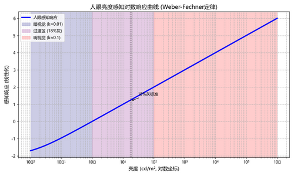
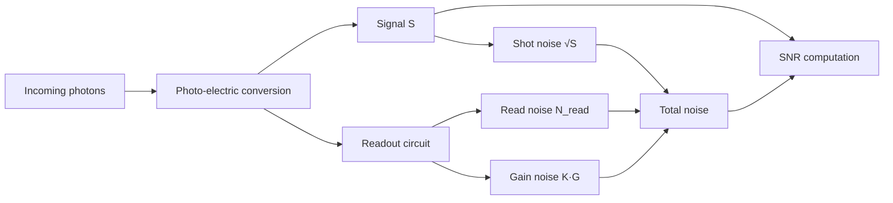
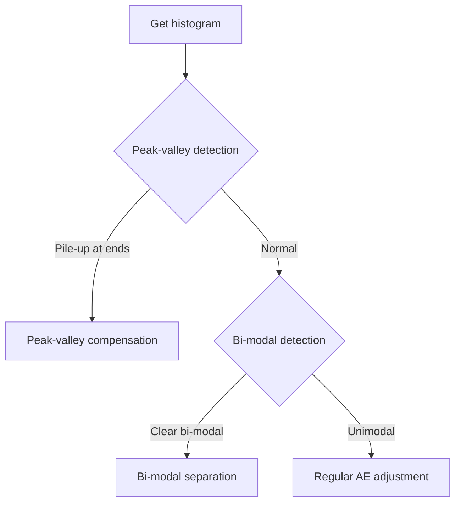
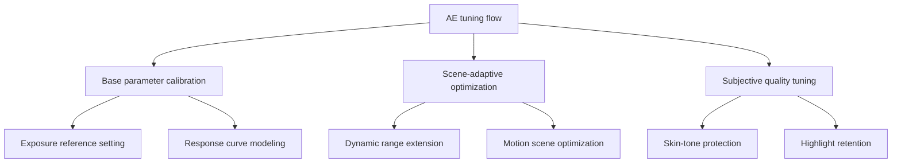

**English | [中文](./ae_v2.md)**

# Auto Exposure (AE) — Technical Summary

## Table of Contents
- [Auto Exposure (AE) — Technical Summary](#auto-exposure-ae--technical-summary)
  - [Table of Contents](#table-of-contents)
  - [1. Core Objective of AE](#1-core-objective-of-ae)
    - [Physical Definition](#physical-definition)
    - [Human Visual Perception Basis](#human-visual-perception-basis)
    - [Logarithmic Luminance Response of the Human Eye](#logarithmic-luminance-response-of-the-human-eye)
      - [Weber–Fechner Law](#weberfechner-law)
  - [2. Application in Camera Exposure](#2-application-in-camera-exposure)
  - [3. Mainstream AE Algorithm Taxonomy](#3-mainstream-ae-algorithm-taxonomy)
    - [3.1 Statistics-based AE](#31-statistics-based-ae)
      - [Histogram-based AE Control Strategies](#histogram-based-ae-control-strategies)
      - [Peak-Valley Balancing](#peak-valley-balancing)
      - [Bi-modal Separation](#bi-modal-separation)
      - [Adaptive-weighted Histogram](#adaptive-weighted-histogram)
    - [3.2 Multi-exposure Fusion Techniques Compared](#32-multi-exposure-fusion-techniques-compared)
  - [4. Evaluation Metrics](#4-evaluation-metrics)
    - [4.1 Objective Metrics](#41-objective-metrics)
    - [4.2 Subjective Criteria](#42-subjective-criteria)
  - [5. AE Tuning](#5-ae-tuning)
    - [Core Framework](#core-framework)
    - [5.1 Base Parameter Calibration](#51-base-parameter-calibration)
      - [Exposure Reference Setting](#exposure-reference-setting)
      - [Dynamic Reference Adjustment (Modern AI Cameras)](#dynamic-reference-adjustment-modern-ai-cameras)
    - [5.2 Scene-adaptive Optimization](#52-scene-adaptive-optimization)
    - [5.3 Subjective Image-quality Tuning](#53-subjective-image-quality-tuning)
      - [Key Metric Tests](#key-metric-tests)
      - [Highlight Roll-off Control](#highlight-roll-off-control)
    - [5.4 Joint Exposure-time & Gain Tuning Strategy](#54-joint-exposure-time--gain-tuning-strategy)
      - [Automatic Staircase Algorithm](#automatic-staircase-algorithm)

---

## 1. Core Objective of AE
Automatically adjust the three exposure elements — shutter $t$, aperture $F$, ISO $G$ — so that image luminance $Y$ approaches the target:

$$
Y_{\text{target}} = 0.18 × (Y_{\text{max}} - Y_{\text{black}}) + Y_{\text{black}}
$$

- $Y_{\text{max}}$: maximum quantized luminance of the sensor under the current exposure (255 for 8-bit).
- $Y_{\text{black}}$: black level.
- $Y_{\text{target}}$: desired luminance; for 8-bit with black level 0, it equals 46/255 (≈ 18% gray).

### Physical Definition
- The **18% neutral gray card** (Kodak Gray Card) is internationally standardized as a neutral reference with 18% optical reflectance.
- This value sits at the 50th percentile of the typical scene average-reflectance distribution, balancing highlight and shadow detail.

### Human Visual Perception Basis
Human brightness perception is logarithmically compressed (Weber–Fechner law):

- **Scotopic vision**: $k \approx 0.01$, driven mainly by rod cells.
- **Photopic vision**: $k \approx 0.1$, driven mainly by cone cells.
- **Mesopic transition**: the 18% gray card lies in the most sensitive region of the human eye, guaranteeing optimal contrast.

### Logarithmic Luminance Response of the Human Eye

#### Weber–Fechner Law
$$
\frac{\Delta I}{I} = k \quad (\text{just-noticeable difference, JND})
$$

| Luminance (cd/m²) | Visual Mode | JND $k$ | 18% Gray Region |
|------------------|----------|----------------|-------------|
| $10^{-2}$ – $10^{0}$ | Scotopic   | 0.01           | ×           |
| $10^{0}$ – $10^{2}$  | Mesopic    | 0.018          | ✔ core zone |
| $10^{2}$ – $10^{6}$  | Photopic   | 0.1            | ×           |

[](https://github.com/zongwave/pixelcraft/blob/main/isp/3a/diagram/Weber-Fechner_curve.png)

---

## 2. Application in Camera Exposure

| Scene Type | Adjustment Strategy | Example |
|------------|---------------------------------------|----------------|
| Normal lighting | Push global luminance toward 18% gray | Daytime landscape |
| High dynamic range | Highlights < 90%, shadows > 5% | Backlit portrait |
| Low light | Overall luminance may drop to 12%, denoising prioritized | Handheld night shot |

---

## 3. Mainstream AE Algorithm Taxonomy

### 3.1 Statistics-based AE

| Algorithm | Principle | Pros | Cons |
|------------|-----------------------------------------------|------------------|--------------------|
| Global average | $\text{EV}_{\text{comp}} = \log_2\frac{Y_{\text{tgt}}}{\bar Y}$ | Simple, fast | Sensitive to extremes |
| Region-weighted | $\bar Y = \sum_i w_i \cdot Y_i,\; w_{\text{center}} > w_{\text{edge}}$ | Matches human attention | Weights need calibration |
| Histogram-based | Use the histogram distribution to prevent clipping | Robust | Higher compute |

#### Histogram-based AE Control Strategies

- **SNR model**

$$
\text{SNR} = \frac{S}{\sqrt{N_{\text{shot}}^{2} + N_{\text{read}}^{2} + (K \cdot G)^{2}}}
$$

> Symbol legend for the SNR formula

| Symbol | Physical Meaning | Unit | Influencing Factors |
|---------------------|----------------------------------|--------------|--------------------------------------------------------------------------|
| **S** | Signal electrons | electrons (e⁻) | Photon flux × Quantum Efficiency (QE) × integration time |
| **N<sub>shot</sub>** | Shot noise | e⁻ | Quantum nature of photons: `√S` (Poisson distribution) |
| **N<sub>read</sub>** | Read noise | e⁻ | Introduced by the sensor readout circuit (ADC noise, thermal noise, …) |
| **K** | Noise factor | dimensionless | Set by sensor process (front-illuminated 0.4–0.5, back-illuminated 0.3–0.4) |
| **G** | Total system gain | multiplier or dB | Analog gain × digital gain (e.g. 4x = 12 dB) |

> Visualized relationship


- **Histogram statistics**
   ```python
   def calc_histogram(y: np.ndarray, bins: int = 256) -> np.ndarray:
       hist, _ = np.histogram(y, bins=bins, range=(0, 255))
       return hist / y.size  # normalized
   ```

- **Key strategies**

| Strategy | Implementation | Formula / Logic |
|---|---|---|
| Mean matching | Adjust exposure so the histogram mean approaches the target (e.g. 46/255) | `EV_comp = log2(Y_target / Y_mean)` |
| Peak-valley balancing | Avoid pixel pile-up at both ends (prevent over/under exposure) | `ΔEV = 0.3 * (𝟙{hist[0]/N > 0.05} − 𝟙{hist[255]/N > 0.05})` |
| Bi-modal separation | Detect subject/background peaks, optimize the subject peak position | `ΔEV = argmax(hist) − 110` |
| Dynamic-range optimization | Ensure the histogram covers the valid range (distribution within 5%–95%) | `EV_comp = (hist[5 %] > 0) ? +0.3 : (hist[95 %] < 0.01) ? −0.3 : 0` |



#### Peak-Valley Balancing
- **Background**: if bins 0 and 255 hold many pixels, the image has large areas of crushed black or blown white — i.e. under/over exposure.
- **Method**: sum the pixels in bins 0 and 255; if they exceed 10% (0.1) of total pixels, consider the histogram "stuck".
- **Countermeasure**: pull the whole image down by 0.5 EV (`adjust_EV(-0.5)`), shifting the tone curve darker and reducing highlight clipping.

In one sentence: when both ends spike, drop half a stop first to save the highlights.

#### Bi-modal Separation
- **Background**: in many scenes the subject and background differ greatly in brightness, so the histogram shows two "humps".
- **Goal**: move the subject's peak to the mid range of 8-bit (empirical value ≈ 110), where subject detail is best rendered.
- **Countermeasure**: find the highest peak `argmax(hist)`, assume it is the subject peak, and compute its distance to 110: `ΔEV = argmax(hist) − 110`. Adjust exposure by `ΔEV` (positive → add light, negative → reduce light) to push the subject to the middle.

#### Adaptive-weighted Histogram
```python
def weighted_histogram(y_channel, roi_mask):
    weights = np.where(roi_mask, 1.0, 0.3)  # higher weight for the core region
    hist = np.bincount(y_channel.flatten(),
                       weights=weights.flatten(),
                       minlength=256)
    return hist / np.sum(weights)
```


### 3.2 Multi-exposure Fusion Techniques Compared

| Technique | Principle | Target Scenario | Characteristics |
|------------------------|----------------------------|-----------------|--------------------------|
| Traditional HDR merge | Merge multiple frames at different EVs | Static high-DR scenes | Tripod required, top quality |
| Smart multi-frame fusion | Dynamic fusion of short/mid/long exposure frames | Mobile photography | Handheld-optimized, computational-photography assisted |
| Sensor-level interleaved exposure (PDAF) | Hardware merge of alternating exposure lines within one frame | Fast action | Zero time gap, partial resolution sacrifice |
| Pixel-level dual exposure | Per-pixel long+short exposure within one exposure (e.g. Sony IMX689) | Pro video | High frame rate, low noise |

---

## 4. Evaluation Metrics

### 4.1 Objective Metrics
- Convergence speed: `<300 ms` (4K@30fps)
- Luminance stability: `ΔY < 5%` (over 100 consecutive frames)

### 4.2 Subjective Criteria
- No visible flicker (`<0.5%` luminance fluctuation)
- Highlight retention (`clipping < 2%`)

---

## 5. AE Tuning

### Core Framework


---

### 5.1 Base Parameter Calibration

#### Exposure Reference Setting
18% gray-card method:
```python
def set_exposure_target():
    while abs(avg_luma - 46) > 2:  # 8-bit: 46 = 255*0.18
        adjust_exposure(step=0.1)
```

#### Dynamic Reference Adjustment (Modern AI Cameras)
$$
Y_{\text{target}} = 0.18 \times (1 + 0.5 \cdot S_{\text{scene}})
$$

- $S$: scene-type coefficient
  - Backlit: `+0.3`
  - Night: `-0.2`
  - Normal: `0`

---

### 5.2 Scene-adaptive Optimization

| Technique | Implementation | Tuning Points |
|--------------------|----------------------------|--------------------------|
| Local tone mapping | Per-region γ adjustment | γ=0.8 in highlights, γ=1.2 in shadows |
| Dual native ISO | Pixel-level blend of high/low ISO | Switch threshold: 80% of full-well capacity |
| Joint temporal NR + AE | Motion detection → dynamic exposure compensation | Motion threshold: 5 px/frame |

---

### 5.3 Subjective Image-quality Tuning

#### Key Metric Tests
- **Convergence-speed test**
  Dark → bright (0→1000 lux) must settle in < 300 ms with overshoot < 5%.

- **Stability test**
  ```python
  def check_flicker(frames):
      luma_std = np.std([calc_luma(f) for f in frames])
      return luma_std < 2.5   # unit: %


#### Optimizing for the Eye-sensitive Region
- **Skin-tone protection (CbCr ellipse constraint)**
  In the chroma plane (Cb-Cr) of the YCbCr space, human skin tones cluster inside a specific ellipse:

$$
\frac{(Cb - 156)^2}{8^2} + \frac{(Cr - 120)^2}{7^2} \leq 1
$$

- **Backlit-face compensation**
  ```python
  if backlit_face_detected:
    Y_target *= 1.2   # boost by about +0.26 EV
  ```


#### Highlight Roll-off Control
```python
if highlight > 0.9:
    apply_soft_clip(curve="sigmoid", knee_point=0.85)
```

### 5.4 Joint Exposure-time & Gain Tuning Strategy

| Step | Priority | Adjustable | Limit / Condition | Side Effect | Notes |
|---|---|---|---|---|---|
| 1. Extend exposure time | Highest | $t$ | $t_{\max}=1/(2 \cdot v_{\text{motion}})$ | Motion blur | $v_{\text{motion}}$ = motion speed in px/frame |
| 2. Analog gain | Second | $G_{\text{analog}}$ | $G_{\max}= \text{sensor native ISO}/100$ | Read noise ↑ | Every 6 dB ≈ 1 bit of noise |
| 3. Digital gain | Last | $G_{\text{digital}}$ | No hard limit | SNR ↓ | Every 6 dB costs ~30% SNR |

#### Automatic Staircase Algorithm
```python
def auto_exposure_strategy(target_ev, motion_px_per_frame):
    max_time = 1.0 / (2.0 * motion_px_per_frame)   # blur prevention
    best_time = min(target_ev, max_time)
    remain_ev = target_ev - best_time

    if remain_ev <= 0:
        return best_time, 1.0   # exposure time only

    max_ag = get_native_iso() / 100
    best_ag = min(remain_ev, max_ag)
    remain_ev -= best_ag

    best_dg = 1.0 if remain_ev <= 0 else remain_ev
    return best_time, best_ag * best_dg
```
