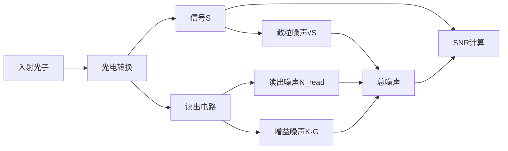
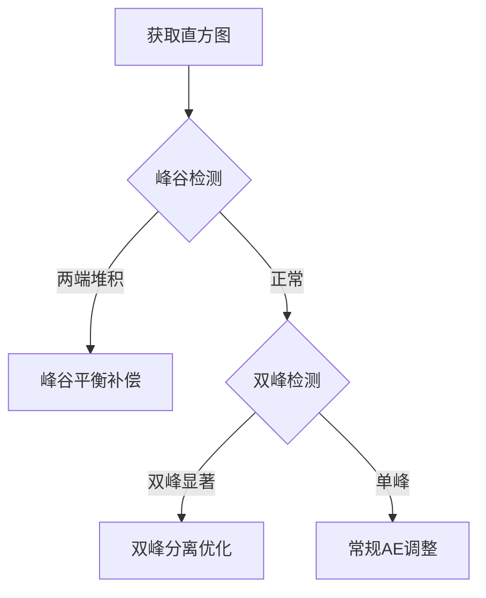
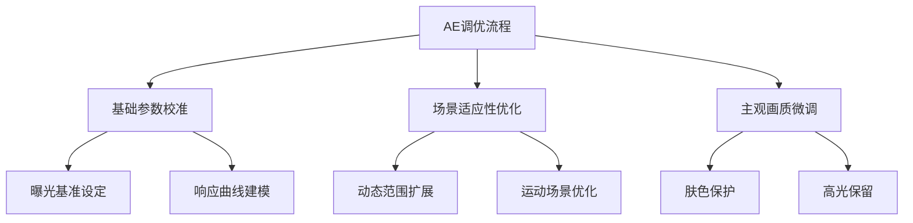

# 自动曝光(Auto Exposure, AE) 技术总结

## 目录
- [自动曝光(Auto Exposure, AE) 技术总结](#自动曝光auto-exposure-ae-技术总结)
  - [目录](#目录)
  - [1. AE 算法核心目标](#1-ae-算法核心目标)
    - [物理定义](#物理定义)
    - [人眼感知基础](#人眼感知基础)
    - [人眼亮度感知对数响应曲线](#人眼亮度感知对数响应曲线)
      - [Weber–Fechner 定律](#weberfechner-定律)
  - [2. 相机曝光中的应用](#2-相机曝光中的应用)
  - [3. 主流 AE 算法分类](#3-主流-ae-算法分类)
    - [3.1 基于统计的 AE](#31-基于统计的-ae)
      - [基于直方图的 AE 控制策略](#基于直方图的-ae-控制策略)
      - [峰谷平衡](#峰谷平衡)
      - [双峰分离](#双峰分离)
      - [自适应权重直方图](#自适应权重直方图)
    - [3.2 多重曝光融合技术对比](#32-多重曝光融合技术对比)
  - [4. 评估指标](#4-评估指标)
    - [4.1 客观指标](#41-客观指标)
    - [4.2 主观标准](#42-主观标准)
  - [5. AE调优](#5-ae调优)
    - [核心框架](#核心框架)
    - [5.1 基础参数校准](#51-基础参数校准)
      - [曝光基准设定](#曝光基准设定)
      - [动态基准调整（现代AI相机）](#动态基准调整现代ai相机)
    - [5.2 场景适应性优化](#52-场景适应性优化)
    - [5.3 主观画质调优](#53-主观画质调优)
      - [关键指标测试](#关键指标测试)
      - [高光渐变控制](#高光渐变控制)
    - [5.4 Exposure Time 与 Gain 联合调教策略](#54-exposure-time-与-gain-联合调教策略)
      - [自动阶梯算法](#自动阶梯算法)

---

## 1. AE 算法核心目标
自动调节相机曝光三要素（快门 $t$、光圈 $F$、ISO $G$），使图像亮度 $Y$ 逼近目标值：

$$
Y_{\text{target}} = 0.18 × (Y_{\text{max}} - Y_{\text{black}}) + Y_{\text{black}}
$$

- $Y_{\text{max}}$：传感器在当前曝光下的最大量化亮度（8-bit 图像为 255）。
- $Y_{\text{black}}$：黑电平(black-level)。
- $Y_{\text{target}}$：期望亮度，8-bit、black-level为0时，对应 46/255（≈18 % 灰）。

### 物理定义
- **18 % 中性灰卡**（Kodak Gray Card）被国际标准化为光学反射率 18 % 的中性参考。
- 该值位于典型场景平均反射率分布的 50 % 分位，兼顾高光与阴影细节。

### 人眼感知基础
人眼对亮度的感知呈对数压缩（Weber–Fechner 定律）：

- **暗视觉 (Scotopic)**：$k \approx 0.01$，主要由杆状细胞驱动。
- **明视觉 (Photopic)**：$k \approx 0.1$，主要由锥状细胞驱动。
- **过渡区 (Mesopic)**：18 % 灰卡处于人眼最敏感区间，保证最佳对比度。

### 人眼亮度感知对数响应曲线

#### Weber–Fechner 定律
$$
\frac{\Delta I}{I} = k \quad (\text{最小可觉差 JND})
$$

| 亮度范围 (cd/m²) | 视觉模式 | 最小可觉差 $k$ | 18 % 灰区域 |
|------------------|----------|----------------|-------------|
| $10^{-2}$ – $10^{0}$ | 暗视觉   | 0.01           | ×           |
| $10^{0}$ – $10^{2}$  | 过渡区   | 0.018          | ✔ 核心区    |
| $10^{2}$ – $10^{6}$  | 明视觉   | 0.1            | ×           |

[](https://github.com/zongwave/pixelcraft/blob/main/isp/3a/diagram/Weber-Fechner_curve.png)

---

## 2. 相机曝光中的应用

| 场景类型   | 调整策略                              | 示例           |
|------------|---------------------------------------|----------------|
| 正常光照   | 全局亮度逼近 18 % 灰                  | 白天风景       |
| 高动态范围 | 高光 < 90 %，暗部 > 5 %               | 逆光人像       |
| 低光照     | 整体亮度可下调至 12 %，优先降噪       | 夜景手持       |

---

## 3. 主流 AE 算法分类

### 3.1 基于统计的 AE

| 算法       | 原理                                          | 优点             | 缺点               |
|------------|-----------------------------------------------|------------------|--------------------|
| 全局平均   | $\text{EV}_{\text{comp}} = \log_2\frac{Y_{\text{tgt}}}{\bar Y}$ | 简单、快速       | 易受极端值影响     |
| 区域加权   | $\bar Y = \sum_i w_i \cdot Y_i,\; w_{\text{center}} > w_{\text{edge}}$ | 符合人眼注意机制 | 需标定权重         |
| 直方图法   | 依据直方图分布防止截断                        | 鲁棒             | 计算量较大         |

#### 基于直方图的 AE 控制策略

- **SNR 模型**

$$
\text{SNR} = \frac{S}{\sqrt{N_{\text{shot}}^{2} + N_{\text{read}}^{2} + (K \cdot G)^{2}}}
$$

> SNR（信噪比）公式符号说明

| 符号                | 物理意义                          | 单位         | 影响因素                                                                 |
|---------------------|----------------------------------|--------------|--------------------------------------------------------------------------|
| **S**               | 信号电子数（Signal Electrons）    | 电子数（e⁻）  | 光子通量 × 量子效率（QE） × 积分时间                                      |
| **N<sub>shot</sub>** | 散粒噪声（Shot Noise）           | e⁻           | 源于光子量子特性：`√S`（泊松分布）                                        |
| **N<sub>read</sub>** | 读出噪声（Read Noise）           | e⁻           | 传感器读出电路引入（ADC噪声、热噪声等）                                    |
| **K**               | 噪声增益系数（Noise Factor）      | 无量纲       | 传感器工艺决定（前照式0.4-0.5，背照式0.3-0.4）                           |
| **G**               | 系统总增益（Total Gain）          | 倍数 或 dB   | 模拟增益 × 数字增益（如4x=12dB）                                         |

> 可视化关系


- **直方图统计**  
   ```python
   def calc_histogram(y: np.ndarray, bins: int = 256) -> np.ndarray:
       hist, _ = np.histogram(y, bins=bins, range=(0, 255))
       return hist / y.size  # 归一化
   ```

- **关键策略**

| 策略类型 | 实现方式 | 数学表达式 / 逻辑 |
|---|---|---|
| 均值匹配 | 调整曝光使直方图均值趋近目标值（如 46/255） | `EV_comp = log2(Y_target / Y_mean)` |
| 峰谷平衡 | 避免直方图两端堆积（防止过曝/欠曝） | `ΔEV = 0.3 * (𝟙{hist[0]/N > 0.05} − 𝟙{hist[255]/N > 0.05})` |
| 双峰分离 | 识别主体/背景双峰，优化主体峰位置 | `ΔEV = argmax(hist) − 110` |
| 动态范围优化 | 确保直方图覆盖有效范围（5 %–95 % 区间有分布） | `EV_comp = (hist[5 %] > 0) ? +0.3 : (hist[95 %] < 0.01) ? −0.3 : 0` |



#### 峰谷平衡
- **背景**：直方图最左（0）和最右（255）如果堆了很多像素，说明画面有大片死黑或死白，属于过曝/欠曝。  
- **做法**：把 0 和 255 两个 bin 的像素加起来，如果超过总像素数的 10 %（0.1），就认为“堵死”了。  
- **对策**：直接给整张照片拉低 0.5 EV（`adjust_EV(-0.5)`），让整体往暗部挪一点，减少高光溢出。  

一句话：看到“两头翘”就先把曝光降半档，救高光。

#### 双峰分离
- **背景**：很多场景主体和背景亮度差一大截，直方图会出现左右各一个“驼峰”。  
- **目标**：把代表主体的那个峰挪到 8-bit 的中段（经验值 110 附近），这样主体细节最好。  
- **对策**：先找直方图里最高的那个峰 `argmax(hist)`，假设它就是主体峰。计算这个峰到 110 的距离：`ΔEV = argmax(hist) − 110`。按 `ΔEV` 调整曝光（正数就加光，负数就减光），把主体推到中间。  

#### 自适应权重直方图
```python
def weighted_histogram(y_channel, roi_mask):
    weights = np.where(roi_mask, 1.0, 0.3)  # 核心区域权重高
    hist = np.bincount(y_channel.flatten(),
                       weights=weights.flatten(),
                       minlength=256)
    return hist / np.sum(weights)
```


### 3.2 多重曝光融合技术对比

| 技术方案               | 实现原理                     | 适用场景          | 技术特性                  |
|------------------------|----------------------------|-----------------|--------------------------|
| 传统HDR合成            | 多帧不同EV值合成            | 静态高动态场景  | 需三脚架，高画质          |
| 智能多帧融合           | 短/中/长曝光帧动态融合       | 移动摄影        | 手持优化，计算摄影加持     |
| 传感器级隔行曝光(PDAF) | 单帧内交替曝光行硬件合成     | 高速运动拍摄    | 零时差，分辨率部分牺牲     |
| 像素级双曝光           | 单个像素分时长短曝光(如Sony IMX689)| 专业视频      | 高帧率，低噪点            |

---

## 4. 评估指标

### 4.1 客观指标
- 收敛速度：`<300 ms`（4K@30fps）
- 亮度稳定性：`ΔY < 5 %`（连续100帧）

### 4.2 主观标准
- 无可见闪烁（`<0.5 %` 亮度波动）
- 高光保留（`clipping < 2 %`）

---

## 5. AE调优

### 核心框架


---

### 5.1 基础参数校准

#### 曝光基准设定
18%灰卡法：
```python
def set_exposure_target():
    while abs(avg_luma - 46) > 2:  # 8bit下46=255*0.18
        adjust_exposure(step=0.1)
```

#### 动态基准调整（现代AI相机）
$$
Y_{\text{target}} = 0.18 \times (1 + 0.5 \cdot S_{\text{scene}})
$$

- $S$：场景类型系数  
  - 逆光：`+0.3`  
  - 夜景：`-0.2`  
  - 正常：`0`

---

### 5.2 场景适应性优化

| 技术               | 实现方式                     | 参数调整要点               |
|--------------------|----------------------------|--------------------------|
| 局部色调映射       | 分区域 γ 值调整               | 高光区 γ=0.8，阴影区 γ=1.2 |
| 双原生ISO          | 高低ISO像素级融合           | 切换阈值：80 % 满阱容量    |
| 时域降噪+AE联合    | 运动检测 → 动态曝光补偿     | 运动阈值：5 px/frame       |

---

### 5.3 主观画质调优

#### 关键指标测试
- **收敛速度测试**  
  从暗到亮（0→1000 lux）需 < 300 ms，过冲幅度 < 5 %。

- **稳定性测试**  
  ```python
  def check_flicker(frames):
      luma_std = np.std([calc_luma(f) for f in frames])
      return luma_std < 2.5   # 单位：%


#### 人眼敏感区优化
- **肤色保护（CbCr椭圆约束）**  
  在 YCbCr 色彩空间的色度平面（Cb-Cr）中，人类肤色集中在特定椭圆区域内：

$$
\frac{(Cb - 156)^2}{8^2} + \frac{(Cr - 120)^2}{7^2} \leq 1
$$

- **背光人脸补偿**  
  ```python
  if backlit_face_detected:
    Y_target *= 1.2   # 提升约 +0.26 EV
  ```


#### 高光渐变控制
```python
if highlight > 0.9:
    apply_soft_clip(curve="sigmoid", knee_point=0.85)
```

### 5.4 Exposure Time 与 Gain 联合调教策略

| 阶段 | 优先级 | 可调量 | 上限 / 条件 | 副作用 | 备注 |
|---|---|---|---|---|---|
| 1. 延长曝光时间 | 最高 | $t$ | $t_{\max}=1/(2 \cdot v_{\text{motion}})$ | 运动模糊 | $v_{\text{motion}}$ 为像素/帧速度 |
| 2. 模拟增益 | 次高 | $G_{\text{analog}}$ | $G_{\max}= \text{sensor 原生 ISO}/100$ | 读出噪声↑ | 每 6 dB ≈1 bit 噪声 |
| 3. 数字增益 | 最后 | $G_{\text{digital}}$ | 无硬性上限 | 信噪比↓ | 每 6 dB SNR 损失 30 % |

#### 自动阶梯算法
```python
def auto_exposure_strategy(target_ev, motion_px_per_frame):
    max_time = 1.0 / (2.0 * motion_px_per_frame)   # 防糊
    best_time = min(target_ev, max_time)
    remain_ev = target_ev - best_time

    if remain_ev <= 0:
        return best_time, 1.0   # 纯曝光时间

    max_ag = get_native_iso() / 100
    best_ag = min(remain_ev, max_ag)
    remain_ev -= best_ag

    best_dg = 1.0 if remain_ev <= 0 else remain_ev
    return best_time, best_ag * best_dg
```