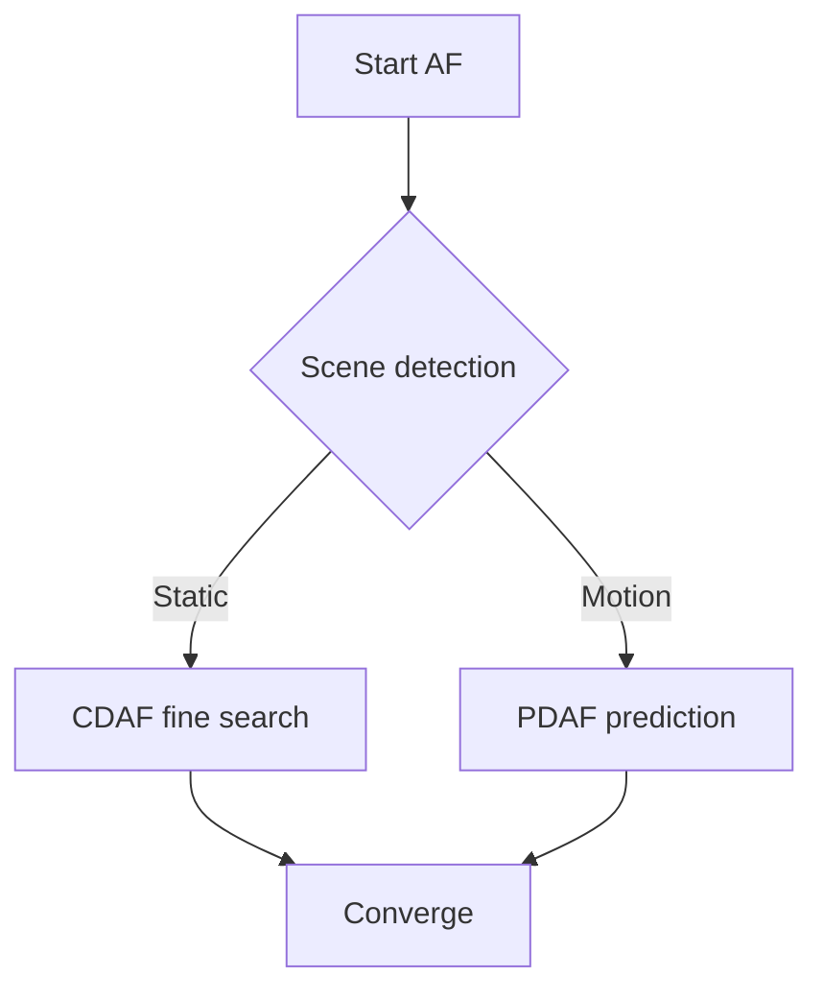

**English | [中文](./af.md)**

# Auto Focus (AF) — Technical Summary

## Table of Contents
- [Auto Focus (AF) — Technical Summary](#auto-focus-af--technical-summary)
  - [Table of Contents](#table-of-contents)
  - [1. Thin-Lens Equation](#1-thin-lens-equation)
  - [2. Depth-of-Field (DoF) Approximation](#2-depth-of-field-dof-approximation)
  - [3. Mainstream AF Approaches](#3-mainstream-af-approaches)
    - [3.1 Shared Physical Principle](#31-shared-physical-principle)
    - [3.2 Three Approaches Compared](#32-three-approaches-compared)
    - [3.3 Dual Pixel AF Details](#33-dual-pixel-af-details)
  - [4. Focus Measure Functions](#4-focus-measure-functions)
    - [4.1 Common Categories & Formulas](#41-common-categories--formulas)
    - [4.2 Scene-Based Selection Advice](#42-scene-based-selection-advice)
    - [4.3 Evaluation Criteria](#43-evaluation-criteria)
  - [5. Closed-Loop Control Strategies](#5-closed-loop-control-strategies)
    - [5.1 Hill-Climbing Search](#51-hill-climbing-search)
    - [5.2 Predictive Focus](#52-predictive-focus)
    - [5.3 Hybrid Strategy](#53-hybrid-strategy)
  - [6. Performance Metrics](#6-performance-metrics)
  - [7. Scene-Specific Tuning](#7-scene-specific-tuning)
    - [7.1 Scene Strategies](#71-scene-strategies)
    - [7.2 AF Tuning Procedure](#72-af-tuning-procedure)

---

## 1. Thin-Lens Equation
$$
\frac{1}{f} = \frac{1}{u} + \frac{1}{v}
$$

| Symbol | Name | Unit | Intuitive Meaning |
|---|---|---|---|
| `f` | Focal length | mm | The lens' "intrinsic" focal length; smaller = wider angle, larger = more telephoto. |
| `u` | Object distance | mm | Distance from the subject to the lens' optical center; farther subject → larger `u`. |
| `v` | Image distance | mm | Distance from the lens' optical center to the imaging plane (sensor); focusing moves the lens group to change `v` so the image plane coincides with the sensor. |

> **Conclusion**: with `u` fixed, focusing means changing `v` until the equation holds.

---

## 2. Depth-of-Field (DoF) Approximation
$$
\text{DoF} \approx \frac{2\, u^{2} N c}{f^{2}}
$$

| Symbol | Name | Unit | Intuitive Meaning |
|---|---|---|---|
| `u` | Object distance | mm | Shooting distance; the squared term makes "closer → shallower DoF". |
| `N` | F-number | dimensionless | `N = f / D` with `D` = aperture diameter; larger F-number → smaller aperture → deeper DoF. |
| `c` | Circle-of-confusion diameter | mm (often μm) | Largest blur circle still acceptable on the sensor; depends on pixel size and viewing distance. |
| `f` | Focal length | mm | Squared in the denominator: longer focal length → shallower DoF. |

---

**One-line mnemonics**
- Close + telephoto + wide aperture → extremely shallow DoF
- Far + wide-angle + small aperture → very deep DoF

---

## 3. Mainstream AF Approaches

| Approach | Principle | Pros | Cons | Target Scenes |
|---|---|---|---|---|
| **CDAF** Contrast AF | Maximize high-frequency image energy | No extra hardware | Multi-frame search, slow in low light | Static scenes |
| **PDAF** Phase AF | Detect phase difference between left/right pixels | Single-shot prediction | Requires dedicated pixels, accuracy drops in low light | Moving subjects |
| **Laser AF** ToF | Laser ranging | Fast in the dark | Power & eye safety | Night scenes, scanning |
| **Dual Pixel AF** | Left/right photodiodes in every pixel | Full-pixel PDAF | Higher silicon cost | Flagship phones |

**PDAF vs Dual Pixel AF**
| Dimension | Traditional PDAF (masked pixels) | Dual Pixel AF |
|--------------------|-----------------------|------------------------|
| **Phase-sampling pixels** | Dedicated masked pixels, < 5% | 100% of pixels participate |
| **Structure** | Left/right masking on pixel surface | Left/right PD inside each pixel |
| **Light loss** | 20–30% | Nearly 0% |
| **Low-light performance** | Average | Better |
| **Resolution loss** | Slight | 0 |
| **Focus speed** | Fast | Even faster |
| **Hardware complexity** | Low | High (dual readout circuits) |


**Dual Pixel AF vs. PDAF vs. Stereo Disparity — Physics & Key Differences**

> One-line core:
> **PDAF, Dual Pixel AF, and stereo ranging all estimate distance from "left/right sub-aperture disparity"; they differ in baseline length, pixel structure, and extra hardware.**

---

### 3.1 Shared Physical Principle
| Item | Description |
|---|---|
| **Baseline** | Left/right sides of one lens' (or two lenses') aperture form a small baseline |
| **Disparity** | Position difference Δx of the same object point in the left/right "sub-images" |
| **Ranging formula** | `Δx ∝ 1 / distance` (triangulation) |

---

### 3.2 Three Approaches Compared

| Dimension | **Traditional PDAF** | **Dual Pixel AF** | **Stereo Ranging** |
|---|---|---|---|
| **Baseline source** | Sparse masked pixels | Left/right PD inside each pixel | Two physical cameras |
| **Baseline length** | Tens of µm | Microns | Millimeter–centimeter scale |
| **Pixel participation** | < 5% | 100% | 100% |
| **Light loss** | Yes (masking) | None | None |
| **Resolution loss** | Slight | 0 | Requires stereo matching |
| **Ranging purpose** | Focus only | Focus only | Outputs a depth map |
| **Depth accuracy** | Low (short baseline) | Low (short baseline) | High (long baseline) |
> PD (Photo-Diode): in a CMOS image sensor, each pixel's photosensitive unit is a PD that converts photons into charge.
---

### 3.3 Dual Pixel AF Details

**How the disparity arises**
- **Microlens + in-pixel left/right PD**
  The chief ray is split in two by the microlens → left/right PDs sample separately → a phase difference (a micro-disparity) emerges.

**Removing the disparity for imaging**
- **Charge-level combining**: left/right PD charges are summed directly, equivalent to full-pixel sensing — no alignment needed.
- **OTP calibration**: compensates left/right gain differences to keep color and noise consistent.

---

**One-line takeaway**
> **Dual Pixel AF compresses "stereo disparity" down to the microscale of a single pixel, achieving full-pixel phase detection with zero light loss and zero resolution loss.**

---

## 4. Focus Measure Functions

> A FOM (Focus Measure function) computes one sharpness value per frame; its peak marks the focal plane. A good FOM must be uni-modal, sensitive, noise-robust, and fast.

### 4.1 Common Categories & Formulas

| Category | Representative | Formula (simplified) | Traits |
|---|---|---|---|
| **Gradient** | Brenner | ∑|I(x+2,y)-I(x,y)|² | Fast, moderate noise robustness |
| | Tenengrad | ∑√(Gx²+Gy²) | Sobel gradient, general-purpose |
| | Laplace | ∑|∇²I| | High-frequency-sensitive, needs denoising |
| **Statistical** | Variance | ∑(I-μ)² | Reflects overall tonal variation |
| | Entropy | -∑p log p | Tonality richness |
| **Frequency** | DCT/FFT high-frequency energy | ∑|F(u,v)|, u,v>threshold | Good noise robustness, heavy compute |

> Microscopy, phones, and infrared scenes need different functions; in low light, apply Gaussian filtering first.

### 4.2 Scene-Based Selection Advice

- **Static / microscopy**: Laplace + adaptive threshold
- **Phone / CDAF**: Tenengrad + center-weighted ROI
- **Hot infrared**: edge contours + connected-component pruning

### 4.3 Evaluation Criteria
- Uni-modality
- Unbiasedness (peak = true focus point)
- Sharpness (steep flanks)
- Noise robustness

---

## 5. Closed-Loop Control Strategies

### 5.1 Hill-Climbing Search
1. Move the VCM in small steps in one direction.
2. If FOM increases → continue; otherwise reverse.
3. Halve the step size until convergence.

### 5.2 Predictive Focus
- **PDAF error → direct displacement**
```math
\Delta x = k \cdot \text{phase}
```
$k$ is calibrated from pixel pitch & focal length.

- **ToF distance → one-shot positioning**

```math
lens_\text{pos} = LUT(d_\text{ToF})
```

### 5.3 Hybrid Strategy


***Notes:***
> Static scenes: fine CDAF search with small steps to guarantee optimal MTF50;
> Moving scenes: PDAF/ToF provides a one-shot displacement first, then small-step confirmation;
> If the scene type changes abruptly during AF (e.g. a sudden pan), immediately re-enter scene-detection node B.


## 6. Performance Metrics

| Metric | Definition | Target (phone) |
|---|---|---|
| **TTR** Time-to-Result | Half-press to focus achieved | < 250 ms |
| **Accuracy** | Measured MTF50 vs best | > 90% |
| **Stability** | Δlens < 5 µm over 30 consecutive frames | — |
| **Hunting** | No visible focus hunting back-and-forth | 0 occurrences |

---

## 7. Scene-Specific Tuning

### 7.1 Scene Strategies
| Scene | Strategy | Key Parameters |
|---|---|---|
| Portrait | Face-weighted ROI + eye AF | Expand face box by 20% |
| Night | Laser + Dual Pixel hybrid | ToF priority threshold 2 m |
| Action | 120 Hz PDAF prediction + EIS sync | Phase sampling period 8.3 ms |
| Macro | Smaller steps + multi-frame fusion | DoF < 1 cm |

### 7.2 AF Tuning Procedure
**Test concept**
Deliberately defocus → trigger AF → export JPG → compute sharpness (MTF50) → compare against the manual best → success rate / consistency at a glance.

**Hardware & software list**
| Hardware | Software |
|---|---|
| Light box 600 Lux ±100 Lux | Imatest (commercial, one-click MTF50) |
| SFRplus / eSFR-ISO test chart | MTF Mapper (open-source CLI) |
| Fixed mount + remote shutter | Python + OpenCV (own script, below) |

**Quick script**
```python
# pip install opencv-python scikit-image
import cv2
import glob, json

def calc_mtf50(img_path):
    gray = cv2.imread(img_path, 0)
    diff = gray[:-2, :] - gray[2:, :]          # Brenner gradient
    return float(diff.var())

def batch_process(folder):
    scores = [calc_mtf50(p) for p in glob.glob(folder + '/*.jpg')]
    best = max(scores)
    success = [s > 0.9 * best for s in scores]
    return {'success_rate': sum(success) / len(success),
            'mtf50_list': scores}

if __name__ == '__main__':
    report = batch_process('./af_test')
    json.dump(report, open('report.json', 'w'), indent=2)
```

**Establishing the manual-best baseline**
Manually focus to the visually sharpest image and save `best.jpg`; set its MTF50 as 100%. An AF shot passes when its MTF50 ≥ 90%.

---

**Test steps**
| Step | Action | Record |
|---|---|---|
| 1 | Light box D65, distance 50 cm, chart fills the frame | — |
| 2 | Deliberately defocus → one-shot AF → 30 shots via remote shutter | raw → jpg |
| 3 | Run `batch_process('./af_test')` | get success_rate |
| 4 | Repeat 2–3 at 25 cm / 100 cm | three distance groups |
| 5 | Consistency = (max-min)/mean of MTF50 at the same distance < 5% | — |

---

**Pass criteria**
| Metric | Threshold |
|---|---|
| Focus success rate | ≥ 95% (≥ 29 of 30 shots) |
| Consistency | Same-distance MTF50 range ≤ 5% |
| Accuracy | Automatic ≥ 90% of manual best |

---

**One-click tooling**
Imatest → open JPG → SFRplus Auto → export `MTF50.csv`
Excel formula: `=IF(MTF50/MAX(MTF50)>=0.9,1,0)` → automatic success-rate calculation.

---

**Common pitfalls & fixes**
| Problem | Cause | Quick Fix |
|---|---|---|
| High MTF50 variance | Camera shake / flickering light | Remote shutter + DC-powered lamp |
| Low-light failure | Low SNR | Add fill light up to 600 Lux |
| Edge misjudgment | ROI includes background | Let Imatest auto-locate the slanted edge |

---

**One-line takeaway**
"Defocus → AF → JPG → MTF50 ≥ 90% of the manual peak" is the simplest and most effective focus-success criterion on a production line.
