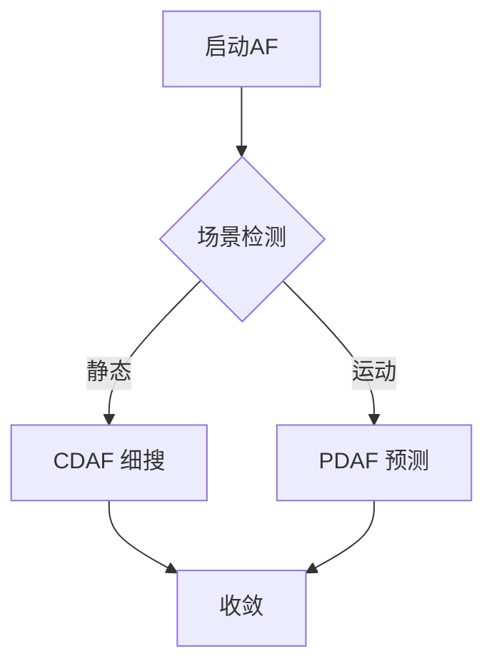

# Auto Focus (AF) 技术总结

## 目录
- [Auto Focus (AF) 技术总结](#auto-focus-af-技术总结)
  - [目录](#目录)
  - [1. 薄透镜公式](#1-薄透镜公式)
  - [2. 景深 (DoF) 近似公式](#2-景深-dof-近似公式)
  - [3. 主流 AF 方案](#3-主流-af-方案)
    - [3.1 物理共同原理](#31-物理共同原理)
    - [3.2 三种方案对比](#32-三种方案对比)
    - [3.3 Dual Pixel AF 细节](#33-dual-pixel-af-细节)
  - [4. 对焦评价函数](#4-对焦评价函数)
    - [4.1 常见类别与公式](#41-常见类别与公式)
    - [4.2 场景选型建议](#42-场景选型建议)
    - [4.3 评价指标](#43-评价指标)
  - [5. 闭环控制策略](#5-闭环控制策略)
    - [5.1 爬山搜索（Hill-Climbing）](#51-爬山搜索hill-climbing)
    - [5.2 预测式对焦](#52-预测式对焦)
    - [5.3 混合策略](#53-混合策略)
  - [6. 性能指标](#6-性能指标)
  - [7. 场景化调优](#7-场景化调优)
    - [7.1 场景策略](#71-场景策略)
    - [7.2 AF 调优步骤](#72-af-调优步骤)

---

## 1. 薄透镜公式
$$
\frac{1}{f} = \frac{1}{u} + \frac{1}{v}
$$

| 符号 | 名称 | 单位 | 直观含义 |
|---|---|---|---|
| `f` | 焦距 | mm | 镜头的“固有”焦距；数值越小视角越广，越大则望远。 |
| `u` | 物距 | mm | 被摄物体到镜头光学中心的距离；拍摄距离越远，`u` 越大。 |
| `v` | 像距 | mm | 镜头光学中心到成像平面（sensor）的距离；对焦时通过移动镜头组来改变 `v`，使像面与 sensor 重合。 |

> **结论**：当 `u` 固定时，调焦就是改变 `v` 使上式成立。

---

## 2. 景深 (DoF) 近似公式
$$
\text{DoF} \approx \frac{2\, u^{2} N c}{f^{2}}
$$

| 符号 | 名称 | 单位 | 直观含义 |
|---|---|---|---|
| `u` | 物距 | mm | 拍摄距离；平方项导致“越近景深越浅”。 |
| `N` | 光圈 F 值 | 无量纲 | `N = f / D`，`D` 为通光孔径；F 值越大，孔径越小，景深越大。 |
| `c` | 容许弥散圆直径 | mm（常用 μm） | sensor 上还能被接受的模糊圆大小；与像素尺寸、观看距离有关。 |
| `f` | 焦距 | mm | 平方项在分母，焦距越长景深越浅。 |

---

**一句话记忆**  
- 近、长焦、大光圈 → 景深极浅  
- 远、广角、小光圈 → 景深极大

---

## 3. 主流 AF 方案

| 方案 | 原理 | 优点 | 缺点 | 适用场景 |
|---|---|---|---|---|
| **CDAF** 反差式 AF | 最大化图像高频能量 | 无需额外硬件 | 需多帧搜索，弱光慢 | 静态场景 |
| **PDAF** 相位 AF | 检测左右像素相位差 | 一次预测即可 | 需专用像素，低光精度下降 | 移动主体 |
| **Laser AF** ToF | 激光测距 | 暗光快速 | 功耗 & 人眼安全 | 夜景、扫码 |
| **Dual Pixel AF** | 每个像素分左右光电二极管 | 全像素 PDAF | 芯片成本高 | 高端手机 |

**PDAF与Dual Pixel AF对比**
| 维度               | 传统 PDAF（掩蔽像素） | Dual Pixel AF         |
|--------------------|-----------------------|------------------------|
| **相位采样像素**   | 专用掩蔽像素，< 5 %   | 100 % 像素参与         |
| **结构**           | 像素表面左/右遮挡     | 每个像素内分左右 PD    |
| **光损失**         | 20–30 %               | 几乎 0 %               |
| **弱光性能**       | 一般                  | 更好                   |
| **分辨率损失**     | 轻微                  | 0                      |
| **对焦速度**       | 快                    | 更快                   |
| **硬件复杂度**     | 低                    | 高（双读出电路）       |


**Dual Pixel AF vs. PDAF vs. 双目视差 —— 物理原理与关键差异**

> 一句话核心：  
> **无论 PDAF、Dual Pixel AF 还是双目测距，本质都是利用“左右子孔径视差”估算距离；区别在于基线长度、像素结构以及是否额外硬件。**

---

### 3.1 物理共同原理
| 项目 | 说明 |
|---|---|
| **基线** | 同一镜头（或双镜头）左右两侧孔径形成微小基线 |
| **视差** | 同一物点在左右“子图”中的位置差 Δx |
| **测距公式** | `Δx ∝ 1 / 距离`（三角关系） |

---

### 3.2 三种方案对比

| 维度 | **传统 PDAF** | **Dual Pixel AF** | **双目测距** |
|---|---|---|---|
| **基线来源** | 稀疏掩蔽像素 | 每个像素内左右 PD | 两颗物理摄像头 |
| **基线长度** | 数十微米 | 数微米 | 毫米–厘米级 |
| **像素参与率** | < 5 % | 100 % | 100 % |
| **光损失** | 有（遮挡） | 无 | 无 |
| **分辨率损失** | 轻微 | 0 | 需立体匹配 |
| **测距目的** | 仅对焦 | 仅对焦 | 输出深度图 |
| **深度精度** | 低（短基线） | 低（短基线） | 高（长基线） |
> PD (Photo-Diode) 在 CMOS 图像传感器里，每个像素的光敏单元就是一个 PD，负责把光子转换为电荷。
---

### 3.3 Dual Pixel AF 细节

**视差产生机制**
- **微透镜 + 像素内左右 PD**  
  主光线被微透镜一分为二 → 左右 PD 分别采样 → 产生相位差（即微型视差）。

**拍照时消除视差**
- **电荷级合并**：左右 PD 的电荷直接相加，等效“整像素”感光，无需对齐。  
- **OTP 校准**：补偿左右增益差异，确保色彩与噪声一致。

---

**总结一句话**
> **Dual Pixel AF 把“双目视差”压缩到单个像素的微观尺度，实现零光损、零分辨率损失的全像素相位对焦。**

---

## 4. 对焦评价函数

> FOM（Focus Measure Function）为“每一帧计算一个清晰度数值”，峰值对应焦平面；好的 FOM 需满足单峰、高灵敏度、低噪声、计算快。

### 4.1 常见类别与公式

| 类别 | 代表函数 | 公式（简化） | 特点 |
|---|---|---|---|
| **梯度类** | Brenner | ∑|I(x+2,y)-I(x,y)|² | 计算快，抗噪一般 |
| | Tenengrad | ∑√(Gx²+Gy²) | Sobel 梯度，通用 |
| | Laplace | ∑|∇²I| | 高频敏感，需降噪 |
| **统计类** | 方差 | ∑(I-μ)² | 反映整体灰度变化 |
| | 熵 | -∑p log p | 灰度丰富度 |
| **频域类** | DCT/FFT 高频能量 | ∑|F(u,v)|, u,v>阈值 | 抗噪好，运算量大 |

> 显微镜、手机、红外场景需选不同函数；弱光下常先做高斯滤波。

### 4.2 场景选型建议

- **静态/显微**：Laplace + 自适应阈值 
- **手机/CDAF**：Tenengrad + 中心加权 ROI  
- **红外高温**：边缘轮廓 + 连通域剔除 

### 4.3 评价指标
- 单峰性  
- 无偏性（峰值=真焦点）  
- 尖锐性（两侧斜率大）
- 抗噪鲁棒性  

---

## 5. 闭环控制策略

### 5.1 爬山搜索（Hill-Climbing）
1. 沿一个方向微步移动 VCM。  
2. 若 FOM 增大 → 继续；否则反向。  
3. 步长逐次减半直至收敛。

### 5.2 预测式对焦
- **PDAF 误差 → 直接计算位移**
```math
\Delta x = k \cdot \text{phase}
```
$k$ 由像素间距 & 焦距标定。

- **ToF 距离 → 一次到位**

```math
lens_\text{pos} = LUT(d_\text{ToF})
```

### 5.3 混合策略


***说明：***
> 静态场景 采用小步长 CDAF 精搜，保证 MTF50 最优；
> 运动场景 先由 PDAF/ToF 给出一次性位移，再微步确认；
> 若场景类型在 AF 过程中突变（如突然摇摄），立即重新进入场景检测节点 B。


## 6. 性能指标

| 指标 | 定义 | 目标值（手机） |
|---|---|---|
| **TTR** Time-to-Result | 半按快门到合焦 | < 250 ms |
| **Accuracy** | MTF50 实测 vs 最佳 | > 90 % |
| **Stability** | 连续 30 帧 Δlens < 5 µm | — |
| **Hunting** | 无可见来回拉风箱 | 0 次 |

---

## 7. 场景化调优

### 7.1 场景策略
| 场景 | 策略 | 关键参数 |
|---|---|---|
| 人像 | 人脸权重 ROI + 眼控对焦 | 人脸框扩大 20 % |
| 夜景 | 激光 + Dual Pixel 混合 | ToF 优先阈值 2 m |
| 运动 | 120 Hz PDAF 预测 + EIS 同步 | phase 采样周期 8.3 ms |
| 微距 | 缩小步长 + 多帧融合 | DoF < 1 cm |

### 7.2 AF 调优步骤
**测试思路**
先人为散焦 → 触发 AF → 导出 JPG → 计算锐度（MTF50）→ 与手动最佳值比对 → 成功率/一致性一目了然。

**设备与软件清单**
| 硬件 | 软件 |
|---|---|
| 灯箱 600 Lux ±100 Lux | Imatest（商业，一键 MTF50） |
| SFRplus / eSFR-ISO 测试卡 | MTF Mapper（开源 CLI） |
| 固定支架 + 遥控快门 | Python + OpenCV（自写脚本，见下） |

**快速脚本**
```python
# pip install opencv-python scikit-image
import cv2
import glob, json

def calc_mtf50(img_path):
    gray = cv2.imread(img_path, 0)
    diff = gray[:-2, :] - gray[2:, :]          # Brenner 梯度
    return float(diff.var())

def batch_process(folder):
    scores = [calc_mtf50(p) for p in glob.glob(folder + '/*.jpg')]
    best = max(scores)
    success = [s > 0.9 * best for s in scores]
    return {'success_rate': sum(success) / len(success),
            'mtf50_list': scores}

if __name__ == '__main__':
    report = batch_process('./af_test')
    json.dump(report, open('report.json', 'w'), indent=2)
```

**手动-最佳基准建立**
手动对焦至肉眼最清晰，保存 `best.jpg`；将其 MTF50 设为 100 %，其余 AF 照片 MTF50 ≥ 90 % 即视为对焦成功。

---

**测试步骤**
| 步骤 | 动作 | 记录 |
|---|---|---|
| 1 | 灯箱 D65，距离 50 cm，测试卡占满画面 | — |
| 2 | 人为失焦 → 一键 AF → 遥控拍 30 张 | raw → jpg |
| 3 | 运行脚本 `batch_process('./af_test')` | 得到 success_rate |
| 4 | 换 25 cm / 100 cm 重复 2–3 | 三组距离 |
| 5 | 一致性 = 同距离 MTF50 (max-min)/mean < 5 % | — |

---

**判定标准**
| 指标 | 通过阈值 |
|---|---|
| 对焦成功率 | ≥ 95 %（30 张中 ≥ 29 张） |
| 一致性 | 同距离 MTF50 极差 ≤ 5 % |
| 精度 | 自动值 ≥ 手动最佳 90 % |

---

**工具一键方案**
Imatest → 打开 JPG → SFRplus Auto → 导出 `MTF50.csv`  
Excel 公式：`=IF(MTF50/MAX(MTF50)>=0.9,1,0)` → 自动算成功率。

---

**常见坑 & 解决**
| 问题 | 原因 | 快速修正 |
|---|---|---|
| MTF50 波动大 | 手震 / 光源闪 | 遥控快门 + 直流灯 |
| 低光失败 | 信噪比低 | 补光到 600 Lux |
| 边缘误判 | ROI 含背景 | Imatest 自动框选斜边 |

---

**一句话总结**
“散焦 → AF → JPG → MTF50 ≥ 90 % 手动峰值” 就是量产线上最简洁、最有效的对焦成功判定流程。