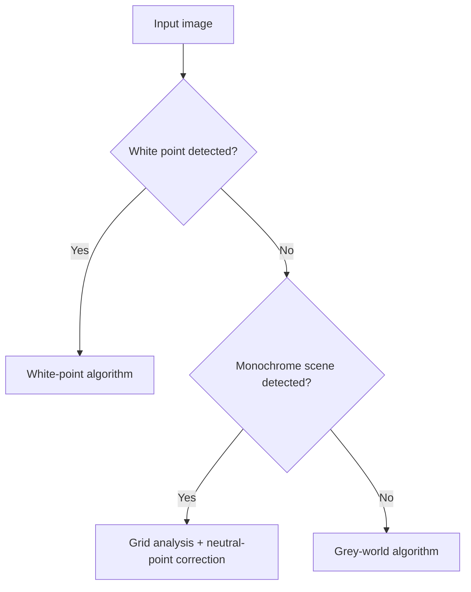
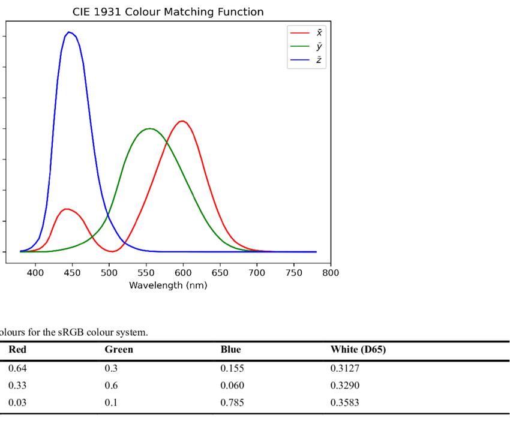
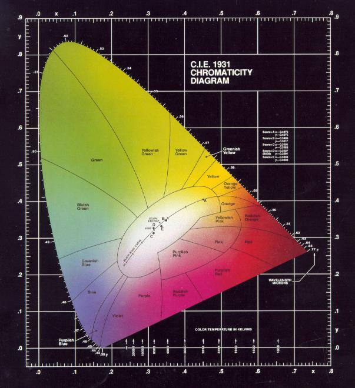
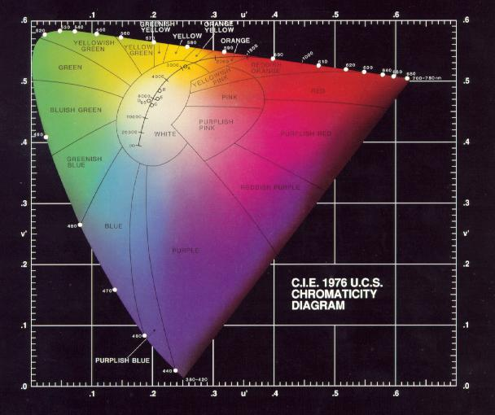

**English | [中文](./awb.md)**

# Auto White Balance (AWB) — Technical Summary

## Table of Contents
- [Auto White Balance (AWB) — Technical Summary](#auto-white-balance-awb--technical-summary)
  - [Table of Contents](#table-of-contents)
  - [1. Grey-World Algorithm](#1-grey-world-algorithm)
    - [Core Assumption](#core-assumption)
    - [Algorithm Flow](#algorithm-flow)
    - [Physiological Basis](#physiological-basis)
      - [Green-Channel Properties](#green-channel-properties)
  - [2. White-Point Algorithm](#2-white-point-algorithm)
    - [Core Assumption](#core-assumption-1)
    - [Algorithm Flow](#algorithm-flow-1)
  - [3. EP3149936B1 Patented Algorithm](#3-ep3149936b1-patented-algorithm)
    - [Core Idea](#core-idea)
    - [Key Steps](#key-steps)
    - [Physical Meaning](#physical-meaning)
    - [One-Sentence Summary](#one-sentence-summary)
    - [Dominant-Color Detection Mechanism](#dominant-color-detection-mechanism)
    - [Dynamic Algorithm Switching](#dynamic-algorithm-switching)
  - [4. Algorithm Comparison](#4-algorithm-comparison)
    - [Comparison Framework](#comparison-framework)
    - [Color-Temperature Range Table](#color-temperature-range-table)
  - [5. Color-Space Standards](#5-color-space-standards)
  - [6. Chromaticity Coordinate Systems in Detail](#6-chromaticity-coordinate-systems-in-detail)
    - [CIE 1931 xy Chromaticity](#cie-1931-xy-chromaticity)
      - [Key Features](#key-features)
      - [Main Issues](#main-issues)
    - [CIE 1976 u'v' Chromaticity](#cie-1976-uv-chromaticity)
    - [System Comparison Table](#system-comparison-table)
  - [7. Color-Difference Formulas](#7-color-difference-formulas)
    - [Color-Difference Addendum (ΔE₀₀)](#color-difference-addendum-δe)
  - [8. AWB Tuning Checklist](#8-awb-tuning-checklist)

---

## 1. Grey-World Algorithm

### Core Assumption
The spectral reflectance of colors in natural scenes is statistically neutral (i.e. the overall average reflectance appears gray):
```math
E[R] = E[G] = E[B]
```
(where E[·] denotes expectation/mean)

### Algorithm Flow
1) Compute the per-channel means of R/G/B over the image

```math
R_{avg} = \frac{1}{N}\sum_{i=1}^{N}R_i, \quad 
G_{avg} = \frac{1}{N}\sum_{i=1}^{N}G_i, \quad 
B_{avg} = \frac{1}{N}\sum_{i=1}^{N}B_i
```

2) Gain computation (G channel as reference)

```math
Gain_R = \frac{G_{avg}}{R_{avg}}, \quad 
Gain_B = \frac{G_{avg}}{B_{avg}}, \quad 
Gain_G = 1
```

### Physiological Basis
The human eye is most sensitive to green light (555 nm) — luma-formula weights: G=58.7%, R=29.9%, B=11.4%
```math
L = 0.299 \times R + 0.587 \times G + 0.114 \times B
```
> Note: Rec.601 luma weights

#### Green-Channel Properties
In natural scenes green objects (vegetation, etc.) are the most prevalent, so statistically the G channel has the smallest variance.
> True only in a statistical sense — with a large area of blue sky, B would have the smallest variance.
Using G as the reference better preserves luminance consistency.
In a Bayer pattern, green pixels make up 50% (e.g. RGGB arrangement).


## 2. White-Point Algorithm

### Core Assumption
The chromaticity of the highlight region (the brightest pixels) should be close to ideal white (e.g. D65 illuminant chromaticity x=0.3127, y=0.3290).

### Algorithm Flow
1) Highlight-region selection
Luminance computation (Rec.709 convention)

```math
Luminance(p) = 0.299 \times R_p + 0.587 \times G_p + 0.114 \times B_p
```
Candidate pixels

```text
CandidatePixels = { p | Luminance(p) > T_{high} }
```

Threshold setting

```math
T_{high} = 0.9 \times \max(Luminance(p))
```

2) White-point candidate evaluation
RGB→XYZ conversion

```math
\begin{bmatrix} X \\ Y \\ Z \end{bmatrix} = 
\begin{bmatrix} 
0.4124 & 0.3576 & 0.1805 \\ 
0.2126 & 0.7152 & 0.0722 \\ 
0.0193 & 0.1192 & 0.9505 
\end{bmatrix}
\begin{bmatrix} R_{linear} \\ G_{linear} \\ B_{linear} \end{bmatrix}
```

Chromaticity computation (CIE 1976 UCS)

```math
u' = \frac{4X}{X + 15Y + 3Z}, \quad 
v' = \frac{9Y}{X + 15Y + 3Z}
```

White-point candidate set

```math
WhiteCandidates = { p | \Delta u'v'(p) < T_{u'v'} }, \quad
T_{u'v'} = 0.02
```

3) Color-temperature matching
Measurements:

```math
(R/G)_{measured} = \text{median}(R_p/G_p), \quad 
(B/G)_{measured} = \text{median}(B_p/G_p)

```

Query the sensor's AWB calibration curves

```math
CCT_{estimated} = AWB^{-1}_{LUT}((R/G)_{measured}, (B/G)_{measured})
```
```math
\text{Target}_{R/G} = \text{AWB}_{\text{Curve}_{RG}}( \text{CCT} ) \\
\text{Target}_{B/G} = \text{AWB}_{\text{Curve}_{BG}}( \text{CCT} )
```

4) Gain computation
```math
Gain_R = \frac{Target_{R/G}}{(R/G)_{measured}}, \quad 
Gain_B = \frac{Target_{B/G}}{(B/G)_{measured}}, \quad 
Gain_G = 1
```

## 3. EP3149936B1 Patented Algorithm

### Core Idea
Dynamic algorithm switching:
white-point → fails → grey-world → monochrome scene → grid analysis + neutral-point correction




### Key Steps

1) Sensor calibration
Illuminate a gray card with lab standard illuminants (D65/D50) and measure the sensor's (R/G) and (B/G) ratios:

```math
K_{CCT} = \frac{(R/G)_{CCT}}{(B/G)_{CCT}}
```

2) Key reference point
Choose the point on the curve where R/G = B/G as the neutral reference (the sensor's unbiased chromatic response to that illumination).


3) Monochrome-region decision

Grid analysis
Split the image into a grid; compute mean and variance per tile

```math
\sigma(R/G) < 0.05, \quad \sigma(B/G) < 0.05
```
Decision condition: more than 30% of tiles satisfy the low-variance criterion


4) Gain computation

```math
Gain_R = \frac{K_{CCT}}{Current_{R/G}}, \quad 
Gain_B = \frac{K_{CCT}}{Current_{B/G}}, \quad 
Gain_G = 1.0
```

5) Exception handling

Gain boundary protection

```math
Gain_R \in [0.5, 2.0], \quad Gain_B \in [0.5, 2.0]
```


### Physical Meaning
Aligns the current image's color ratios to the neutral state calibrated on the sensor, removing hardware bias (e.g. insufficient B-channel sensitivity).


### One-Sentence Summary
The patent calibrates the sensor's R/G–B/G neutral-point curve across color temperatures, dynamically aligns the image's color ratios to the sensor's ideal response, and combines scene detection for adaptive white balance.


### Dominant-Color Detection Mechanism
Grid analysis:
tile the image and analyze each tile's distribution in the R/G–B/G plane.

Dynamic threshold:
when the share of monochrome tiles exceeds the threshold (e.g. 30%), the scene is judged dominant-monochrome.


### Dynamic Algorithm Switching
| Scene Type | Enabled Algorithm | Disabled Algorithm | Implementation |
|------------------|--------------------|------------|------------------------------|
| Color-rich scene | Grey-world | – | Global mean statistics |
| Dominant-monochrome scene | Sensor neutral-point | Grey-world | Gains computed from the R/G=B/G reference point |
| Scene containing a white point | White-point | – | Chromaticity matching in highlight regions |


## 4. Algorithm Comparison
### Comparison Framework

| Dimension | Grey-World (G-based) | White-Point (white-based) | EP3149936B1 Approach |
|--------------------|--------------------------------|-----------------------------|-------------------------------|
| **Reference basis** | Global statistical mean assumption | Chromaticity of local brightest pixels | Sensor physical response characteristics |
| **Strength scenes** | Vegetation/outdoors under natural light, color-rich imagery | Indoor scenes with a true white point | Monochrome scenes lacking gray/white references |
| **Monochrome handling** | Fails (forces toward gray) | Depends on white-point presence | Dynamically switches to sensor neutral-point method |
| **CCT adaptivity** | No explicit modeling | Requires stored CCT curves | Adapts automatically via response curves |
| **Mathematical form** | Mean equalization | Color-temperature mapping | Neutral-point localization on response curves (Fig. 3) |
| **Hardware dependency** | None | Requires calibration | Requires stored sensor response data |
| **Complexity** | Low (global statistics) | Medium (highlight detection) | Medium (grid analysis + curve lookup) |

### Color-Temperature Range Table
| Illuminant | CCT (K) | Typical Scene |
|------|---------|----------|
| Candlelight | 1800–2000 | Night scenes |
| Incandescent | 2700–3000 | Indoor |
| D50 | 5000 | Printing |
| D65 | 6500 | Daylight |

## 5. Color-Space Standards


[](https://raw.githubusercontent.com/zongwave/pixelcraft/main/isp/3a/diagram/CIE-1931-colour-matching-function.png)


[](https://raw.githubusercontent.com/zongwave/pixelcraft/main/isp/3a/diagram/cie1931.jpg)
[](https://raw.githubusercontent.com/zongwave/pixelcraft/main/isp/3a/diagram/cie1976.jpg)


## 6. Chromaticity Coordinate Systems in Detail

### CIE 1931 xy Chromaticity
```math
\begin{aligned}
x &= \frac{X}{X + Y + Z} \\
y &= \frac{Y}{X + Y + Z} \\
z &= 1 - x - y \quad \text{(derived)}
\end{aligned}
```

#### Key Features

The earliest international standard color space

Normalizes the XYZ tristimulus values to 2-D coordinates

Luminance (Y) is separated out, keeping only chromaticity

The chromaticity diagram is a horseshoe-shaped locus

#### Main Issues

The green region is excessively inflated (≈50% of the diagram)

The blue region is severely compressed

The same Δxy represents inconsistent perceived color differences across regions


### CIE 1976 u'v' Chromaticity
```math
\begin{aligned}
u' &= \frac{4X}{X + 15Y + 3Z} \\
v' &= \frac{9Y}{X + 15Y + 3Z}
\end{aligned}
```

### System Comparison Table

| Property | CIE 1931 xy | CIE 1976 u'v' |
|------------------|------------------------------|------------------------------|
| **Design goal** | Basic color standardization | Perceptual uniformity |
| **Standard white point (D65)** | x=0.3127, y=0.3290 | u'=0.1978, v'=0.4683 |
| **Color-difference sensitivity** | 1 JND ≈ 0.01 Δxy | 1 JND ≈ 0.005 Δu'v' |
| **Industrial use** | Gamut definition | Production-line color inspection |

> **Note**: JND (Just Noticeable Difference) is the smallest perceivable color difference

## 7. Color-Difference Formulas
```math
\Delta E_{uv} = \sqrt{(u'_1 - u'_2)^2 + (v'_1 - v'_2)^2}
```
### Color-Difference Addendum (ΔE₀₀)
$$
\Delta E_{00} = \sqrt{
\left(\frac{\Delta L'}{k_L}\right)^2 +
\left(\frac{\Delta C'}{k_C}\right)^2 +
\left(\frac{\Delta H'}{k_H}\right)^2 +
R_T \frac{\Delta C'}{k_C} \frac{\Delta H'}{k_H}
}
$$

## 8. AWB Tuning Checklist

| Check Item | Pass Criterion |
|---|---|
| Calibration-curve coverage | Error < 3% from 2500 K to 10000 K |
| Monochrome-scene misjudgment | < 5% false triggers over 100 solid-color cards |
| Skin-tone protection | ΔE₀₀ < 2 on ITU-R skin-tone cards |
