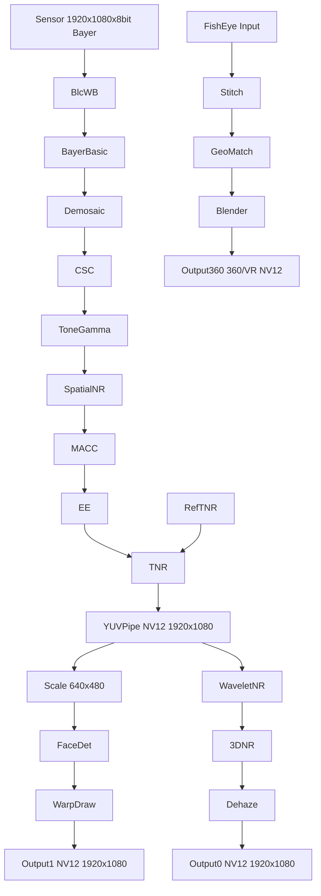

**English | [中文](./README.md)**

# libxcam ISP Pipeline — Technical Summary

## Table of Contents
- [libxcam ISP Pipeline — Technical Summary](#libxcam-isp-pipeline--technical-summary)
  - [Table of Contents](#table-of-contents)
  - [1. Basic Image Processing Pipeline](#1-basic-image-processing-pipeline)
    - [1.1 Input Specification](#11-input-specification)
    - [1.2 Processing Stages](#12-processing-stages)
    - [1.3 Intermediate / Output Formats](#13-intermediate--output-formats)
  - [2. Advanced Image Processing Pipeline & Smart Analysis](#2-advanced-image-processing-pipeline--smart-analysis)
    - [2.1 Smart Analysis](#21-smart-analysis)
    - [2.2 Advanced Image Enhancement](#22-advanced-image-enhancement)
  - [3. Data Processing Flow Graph](#3-data-processing-flow-graph)
  - [4. ISP Algorithm Pipeline Ordering](#4-isp-algorithm-pipeline-ordering)

---

## 1. Basic Image Processing Pipeline
> Performs the essential "must-have" processing from raw Bayer data to standard YUV.

### 1.1 Input Specification
- **Sensor output**:
  1920×1080×8-bit Bayer (1.5 channels, i.e. 10-bit packed into an 8-bit carrier, bandwidth ≈ 1.5×).
- **Statistics windows**:
  120×67 blocks, used for 3A (AE/AF/AWB) statistics.

### 1.2 Processing Stages
| Stage | Key Algorithm | Notes |
|---|---|---|
| Blc / WB | Black-Level Correction, White-Balance | Black-level correction first, then white balance. |
| Bayer-Basic | Bayer basic processing | Noise suppression, defect-pixel correction, etc. |
| **Bayer-Demosaic** | Demosaicing | Converts Bayer to RGB. |
| **CSC** | Color-Space Conversion | RGB → YUV. |
| **Tone / Gamma** | Tone mapping & Gamma correction | Makes luminance/color match human perception. |
| **Spatial NR** | 2D denoising | Spatial filtering. |
| **MACC** | Motion-Adaptive Color Correction | Color correction for moving scenes. |
| **EE** | Edge Enhancement | Sharpening. |
| **TNR** | Temporal NR | Temporal denoising with reference frame (Ref TNR) participation. |

### 1.3 Intermediate / Output Formats
| Node | Resolution | Bit depth | Channels | Notes |
|---|---|---|---|---|
| Bayer-WDR | 1920×1080×16 bit | 4 ch | 4-channel data before WDR (wide dynamic range). |
| RGB | 1920×1080×8 bit | 3 ch | After demosaic. |
| YUV-pipe | 1920×1080×8 bit | 1.5 ch | NV12 (YUV420SP) output to the backend. |

---

## 2. Advanced Image Processing Pipeline & Smart Analysis
> On top of the "basic chain", layer advanced image enhancement and AI/algorithm analysis.

### 2.1 Smart Analysis
- **Face Detection**: face detection.
- **DVS (OpenCV)**: Digital Video Stabilization.
- **Scale**: scales 1920×1080 down to 640×480 for algorithms/preview.
- **Warp / DrawFrame**: draws bounding boxes and labels on detected objects as AR overlay.
- **Output1**: NV12 1920×1080 with overlay information.

### 2.2 Advanced Image Enhancement
| Module | Function |
|---|---|
| **Wavelet NR** | Wavelet-domain denoising, preserving more detail. |
| **3D-NR** | Joint 3D (spatial + temporal) denoising. |
| **Dehaze** | Dehazing, improving contrast. |
| **Stitch** | Stitches multiple fisheye streams into 360°/VR panoramas. Internal flow:   - **Geo/FeatureMatch**: geometric correction and feature matching.   - **Blender**: multi-stream blending. |

## 3. Data Processing Flow Graph

## 4. ISP Algorithm Pipeline Ordering

(☑ = non-linear, ✓ = linear)

| Stage | Algorithm | Linear/Non-linear | Scope & Design Rationale |
|---|---|---|---|
| 1. Black level & optical pre-correction | BLC ☑ | RAW→RAW | Subtract dark current first so subsequent multiplications/matrices have a "zero reference". |
| 2. Optical non-uniformity correction | LSC ☑ | RAW→RAW | Lens falloff is **non-linear in light intensity**; it must be fixed before any multiplicative gain, otherwise corner errors get amplified. |
| 3. Defective-pixel correction | DPC/BPC ☑ | RAW→RAW | Bad pixels are **defective pixels** — the earlier they are fixed, the less they propagate through later interpolation/matrices. |
| 4. Demosaicing | Demosaic ☑ | RAW→RGB | Fill in the three channels first so subsequent matrices/curves operate in full RGB space. |
| 5. HDR merge & local TM | Multi-frame HDR ☑ / Local Tone ☑ | RAW/RGB→RGB | After multi-frame alignment, **non-linear compression** is mandatory; otherwise high-DR scenes sent straight to CCM will be over/under-exposed. |
| 6. White balance | AWB ✓ | RGB→RGB | Use **linear gains** to pull neutral gray back to neutral, so color temperature does not affect later matrix calibration. |
| 7. Color correction | CCM ✓ / ACM ✓ / MACC ✓ | RGB→RGB | **Linear mapping** from sensor RGB to a standard space; placed after AWB to keep the matrix constant. |
| 8. Gamma & global tone | Gamma ☑ / Tone ☑ | RGB→RGB | The **perceptual non-linearity** of the human eye/display; must be applied as a unified mapping after color correction. |
| 9. Color-space conversion | CSC ✓ / CSM ✓ | RGB→YUV | **Linear matrix** to a downstream/codec-friendly YUV, reducing bandwidth. |
| 10. Chroma noise reduction | Chroma NR ☑ | YUV→YUV | **Non-linear filtering** on U/V in the YUV domain keeps color noise introduced earlier out of compression/display. |
| 11. Color enhancement / stylization | 3D-LUT ☑ / ACE ☑ / Sat-LUT ☑ | YUV or RGB | Final stage for **artistic stylization and skin-tone protection**, without affecting the objective corrections above. |

> Note: sensor RGB is "the raw 3-channel linear signal with crosstalk and filter spectral distortion", while display-standard RGB is a corrected, display-ready chrominance-linear signal in the target gamut.

> Ordering design principles
> • **Defects before enhancements**: defects (BLC/LSC/DPC/Demosaic) must be completed before any gain/curve.
> • **Linear before non-linear**: linear matrices (AWB, CCM…) stay in the linear domain; perceptual/stylization steps (Gamma, 3D-LUT…) go in the non-linear domain, avoiding repeated round-trips.
> • **Chroma NR late**: denoising after YUV and non-linear mapping maximally preserves luma detail while suppressing color noise.
