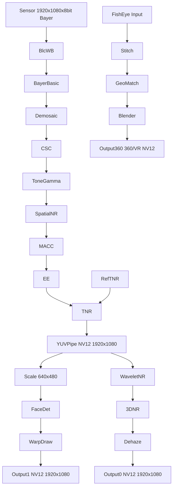

# libxcam ISP Pipeline 技术总结

## 目录
- [libxcam ISP Pipeline 技术总结](#libxcam-isp-pipeline-技术总结)
  - [目录](#目录)
  - [1. Basic Image Processing Pipeline](#1-basic-image-processing-pipeline)
    - [1.1 输入规格](#11-输入规格)
    - [1.2 处理步骤](#12-处理步骤)
    - [1.3 中间/输出格式](#13-中间输出格式)
  - [2. Advanced Image Processing Pipeline & Smart Analysis](#2-advanced-image-processing-pipeline--smart-analysis)
    - [2.1 智能分析（Smart Analysis）](#21-智能分析smart-analysis)
    - [2.2 高级图像增强](#22-高级图像增强)
  - [3. 数据处理流图](#3-数据处理流图)

---

## 1. Basic Image Processing Pipeline
> 完成从原始 Bayer 数据到标准 YUV 的基本“刚需”处理。

### 1.1 输入规格
- **Sensor 输出**：  
  1920×1080×8 bit Bayer（1.5 channel，即 10 bit 打包在 8 bit 载体里，带宽 ≈1.5×）。  
- **统计窗口**：  
  120×67 个 block，用于 3A（AE/AF/AWB）统计。

### 1.2 处理步骤
| 阶段 | 关键算法 | 备注 |
|---|---|---|
| Blc / WB | Black-Level Correction、White-Balance | 先做黑电平矫正，再做白平衡。 |
| Bayer-Basic | Bayer 基本处理 | 噪声抑制、坏点矫正等。 |
| **Bayer-Demosaic** | 去马赛克 | 把 Bayer 转为 RGB。 |
| **CSC** | Color-Space Conversion | RGB → YUV。 |
| **Tone / Gamma** | 色调映射 & Gamma 校正 | 让亮度/颜色符合人眼感知。 |
| **Spatial NR** | 2D 降噪 | 空域滤波。 |
| **MACC** | Motion-Adaptive Color Correction | 运动场景下的颜色矫正。 |
| **EE** | Edge Enhancement | 锐化。 |
| **TNR** | Temporal NR | 时域降噪，参考帧（Ref TNR）参与计算。 |

### 1.3 中间/输出格式
| 节点 | 分辨率 | 位深 | 通道 | 说明 |
|---|---|---|---|---|
| Bayer-WDR | 1920×1080×16 bit | 4 ch | 做 WDR（宽动态）前的 4 通道数据。 |
| RGB | 1920×1080×8 bit | 3 ch | Demosaic 后。 |
| YUV-pipe | 1920×1080×8 bit | 1.5 ch | NV12（YUV420SP）输出给后端。 |

---

## 2. Advanced Image Processing Pipeline & Smart Analysis
> 在“基本链路”之上，再叠加高级图像增强与 AI/算法分析。

### 2.1 智能分析（Smart Analysis）
- **Face Detection**：人脸检测。  
- **DVS (OpenCV)**：Digital Video Stabilization，数字防抖。  
- **Scale**：把 1920×1080 缩到 640×480，供算法/预览使用。  
- **Warp / DrawFrame**：对检测到的目标做画框、打标签等 AR 叠加。  
- **Output1**：NV12 1920×1080，带叠加信息输出。

### 2.2 高级图像增强
| 模块 | 作用 |
|---|---|
| **Wavelet NR** | 小波域降噪，保留更多细节。 |
| **3D-NR** | 3D（空域+时域）联合降噪。 |
| **Dehaze** | 去雾，提高对比度。 |
| **Stitch** | 鱼眼多路图像拼接成 360°/VR 全景。 内部流程：  
  - **Geo/FeatureMatch**：几何校正与特征匹配。  
  - **Blender**：多路融合。 |

## 3. 数据处理流图

## 4. ISP 算法流水线

（☑ = 非线性，✓ = 线性）

| 阶段 | 算法 | 线性/非线性 | 作用域 | 设计理由 |
|---|---|---|---|---|
| 1. 黑电平 & 光学预校 | BLC ☑ | RAW→RAW | 先扣掉暗电流，使后续乘法/矩阵运算有“零基准”。 |
| 2. 光学非线性校正 | LSC ☑ | RAW→RAW | 镜头衰减是**光强非线性**，必须在任何乘法增益前修正，否则会放大边角误差。 |
| 3. 坏点修复 | DPC/BPC ☑ | RAW→RAW | 坏点属于**缺陷像素**，越早修越能避免在后续插值/矩阵里扩散。 |
| 4. 去马赛克 | Demosaic ☑ | RAW→RGB | 先补全三通道，才能让后续矩阵/曲线在完整 RGB 空间工作。 |
| 5. HDR 合成 & 局部 TM | Multi-frame HDR ☑ / Local Tone ☑ | RAW/RGB→RGB | 多帧对齐后必须做**非线性压缩**，否则高动态场景直接送 CCM 会过曝或欠曝。 |
| 6. 白平衡 | AWB ✓ | RGB→RGB | 用**线性增益**把中性灰拉回中性，避免色温影响后续矩阵标定。 |
| 7. 色彩校正 | CCM ✓ / ACM ✓ / MACC ✓ | RGB→RGB | **线性映射**把 sensor RGB 转到标准空间；放在 AWB 后保证矩阵恒定。 |
| 8. Gamma & 全局 Tone | Gamma ☑ / Tone ☑ | RGB→RGB | 人眼/显示对亮度的**感知非线性**，必须在色彩校正后统一映射。 |
| 9. 色彩空间转换 | CSC ✓ / CSM ✓ | RGB→YUV | **线性矩阵**转到下游编码友好的 YUV，减少带宽。 |
| 10. 色度降噪 | Chroma NR ☑ | YUV→YUV | 在 YUV 域对 U/V 做**非线性滤波**，避免前面环节引入的彩噪进入压缩/显示。 |
| 11. 色彩增强/风格化 | 3D-LUT ☑ / ACE ☑ / Sat-LUT ☑ | YUV 或 RGB | 最后阶段做**艺术化、风格化、肤色保护**，不影响前面客观校正。 |

> 注: sensor RGB 是“带串扰与滤光片光谱失真的原始三通道线性信号”，而显示器标准 RGB 是已校正到目标色域、可直接用于显示的色度线性信号。

> 顺序设计原则  
> • **先缺陷后增强**：缺陷（BLC/LSC/DPC/Demosaic）必须在任何增益/曲线前完成。  
> • **先线性后非线性**：白平衡、CCM 等线性矩阵放在线性域，Gamma/3D-LUT 等感知/风格化放在非线性域，避免多次往返。  
> • **色度降噪靠后**：在 YUV 且非线性映射后再降噪，可最大限度保留亮度细节，同时抑制彩噪。
