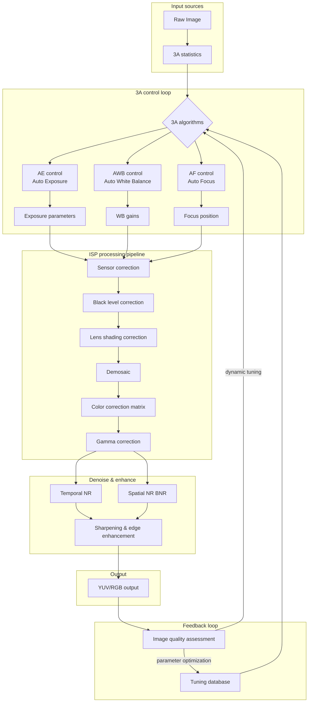
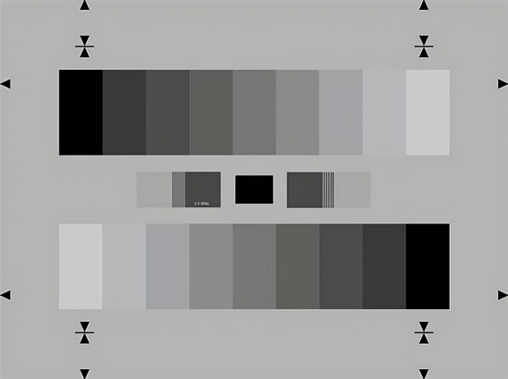
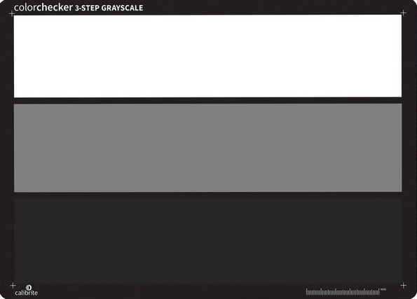
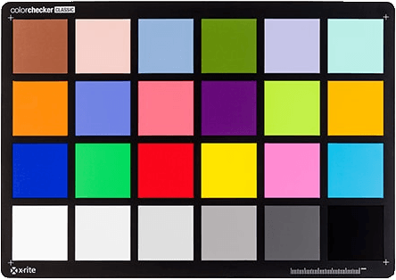
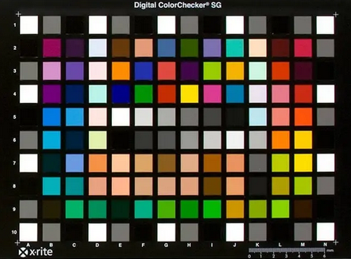
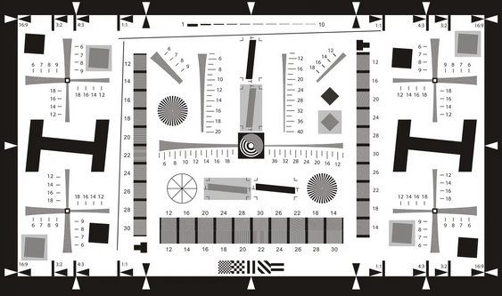
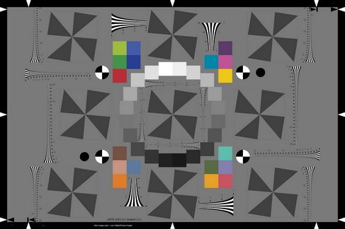
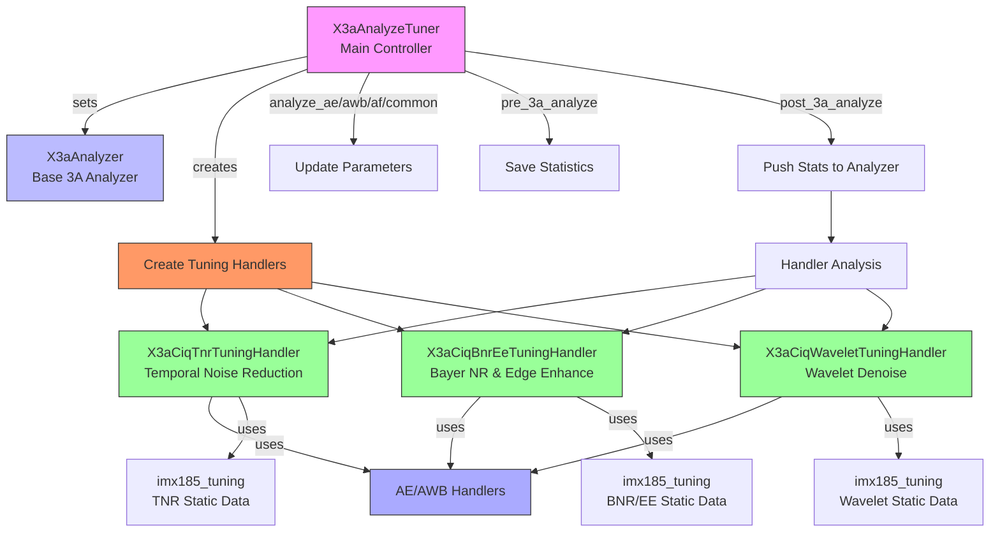

**English | [中文](./README.md)**

# libxcam Image Quality (IQ) Tuning System — Technical Summary

Mainly handles temporal noise reduction (TNR), Bayer noise reduction (BNR), and edge enhancement (EE). What follows is a summary of how they cooperate and what they accomplish.

## Table of Contents
- [libxcam IQ Tuning — Technical Summary](#libxcam-iq-tuning--technical-summary)
  - [Table of Contents](#table-of-contents)
  - [1. General Principles & Methods of Modern ISP Tuning](#1-general-principles--methods-of-modern-isp-tuning)
    - [1.1 Auto Exposure (AE)](#11-auto-exposure-ae)
    - [1.2 Auto White Balance (AWB)](#12-auto-white-balance-awb)
    - [1.3 Auto Focus (AF)](#13-auto-focus-af)
    - [1.4 Noise Reduction (NR)](#14-noise-reduction-nr)
    - [1.5 Edge Enhancement (EE)](#15-edge-enhancement-ee)
    - [1.6 Tuning Framework](#16-tuning-framework)
    - [1.7 Standard Test Charts for 3A Calibration](#17-standard-test-charts-for-3a-calibration)
  - [2. The libxcam IQ Tuning System](#2-the-libxcam-iq-tuning-system)
    - [2.1 Core Components](#21-core-components)
    - [2.2 Collaboration](#22-collaboration)
    - [2.3 Delivered Features](#23-delivered-features)
    - [2.4 System Flow Diagram](#24-system-flow-diagram)
    - [2.5 Summary](#25-summary)

## 1. General Principles & Methods of Modern ISP Tuning
The Image Signal Processor (ISP) plays a crucial role in modern camera systems, converting raw sensor data into high-quality image output. ISP tuning optimizes the visual result through a series of algorithms and parameter adjustments so that image quality is best under every shooting condition. The general principles and methods:

### 1.1 Auto Exposure (AE)
The AE module automatically adjusts exposure parameters based on scene luminance so that image brightness is appropriate. Key steps:
- **Metering**: analyze the luminance distribution and compute the scene's average brightness.
- **Exposure control**: adjust exposure time, aperture, and ISO to reach the target brightness.
- **Dynamic-range optimization**: in high-contrast scenes, adjust exposure to optimize dynamic range and shrink over/under-exposed areas.

### 1.2 Auto White Balance (AWB)
The AWB module automatically adjusts color balance based on scene color temperature so that colors look natural. Key steps:
- **Color-temperature detection**: analyze the color distribution and estimate the scene's CCT.
- **Color correction**: adjust RGB channel gains per the detected CCT to remove color casts.
- **Adaptive adjustment**: dynamically adapt white-balance parameters to the lighting of each scene as CCT varies.

### 1.3 Auto Focus (AF)
The AF module automatically adjusts the lens position so the subject is sharp. Key steps:
- **Focus-area selection**: pick an appropriate focus region from the scene content.
- **Focus algorithm**: compute the best lens position via contrast-detection or phase-detection.
- **Focus control**: drive the lens to the position that renders the subject sharply.
- **Focus optimization**: dynamically tune focus parameters per scene and subject to optimize speed and accuracy.

### 1.4 Noise Reduction (NR)
The NR module reduces image noise while preserving detail. Key steps:
- **Noise detection**: detect the distribution and strength of noise from image statistics.
- **NR algorithms**: apply multiple algorithms such as temporal NR (TNR), Bayer NR (BNR), and wavelet denoise.
- **Parameter adjustment**: dynamically adapt NR parameters from current image parameters (analog gain, exposure time, …) to optimize denoising.

### 1.5 Edge Enhancement (EE)
The EE module enhances edge detail so the image looks crisper. Key steps:
- **Edge detection**: detect edges with image-processing operators (Sobel, Canny, …).
- **Edge enhancement**: adjust local contrast and sharpness around the detected edges.
- **Parameter adjustment**: dynamically adapt EE parameters from current image parameters (analog gain, exposure time, …) to optimize clarity.

### 1.6 Tuning Framework
A typical ISP tuning framework comprises:
- **Initialization**: load preset tuning parameters and configuration files, initialize tuning modules.
- **Parameter configuration**: dynamically set tuning-module parameters from current image parameters.
- **Tuning computation**: during image processing, tuning modules adapt parameters as image parameters change.
- **Result output**: apply the computed parameters to the image pipeline to produce the final optimized image.

### 1.7 Standard Test Charts for 3A Calibration
3A calibration (AE, AWB, AF) typically uses the following standard charts:
- **Grayscale chart**:
  - **Purpose**: calibrating AE and AWB. Grayscale charts contain patches at different gray levels, helping the camera calibrate exposure and white balance.
  - **Example**: the gray chart must cover the central 30% of the camera's field of view to properly exercise 3A (AE, AWB, AF), since the center region contains no features.

- **ColorChecker chart**:
  - **Purpose**: calibrating AWB. ColorChecker charts contain standard color patches that help calibrate color balance.
  - **Example**: the standard ColorChecker patches are used to derive each patch's prediction curve of color-temperature deviation, adjusting the image toward the colors as the human eye sees them.

- **Focus chart**:
  - **Purpose**: calibrating AF. Focus charts contain high-contrast lines or patterns that help calibrate the focusing system.
  - **Example**: patterns at varying distances for testing and calibrating focus performance.
- **Hybrid charts**:
  - **Purpose**: holistic 3A calibration. Hybrid charts combine gray areas, color patches, and focus patterns to test and calibrate AE, AWB, and AF simultaneously.
  - **Example**: some charts combine gray regions with color patches to test AE and AWB together.

> These standard charts matter in 3A calibration because they provide a standardized test environment, ensuring the camera adjusts exposure, white balance, and focus accurately under varying lighting conditions and scenes.

## 2. The libxcam IQ Tuning System

### 2.1 Core Components
- **`X3aCiqTuningHandler`**:
  - **Role**: base class providing the common framework, managing tuning data and handlers (AE and AWB handlers).
  - **Function**: foundational support for concrete tuning tasks.
  - **Key methods**:
    - `set_tuning_data`: set tuning data.
    - `set_ae_handler` / `set_awb_handler`: install AE and AWB handlers.
    - `get_max_analog_gain`, `get_current_analog_gain`, `get_current_exposure_time`, `get_current_estimate_cct`: query analog gain, exposure time, CCT, etc.

- **`X3aCiqTnrTuningHandler`**:
  - **Role**: derived class handling temporal noise reduction (TNR) tuning.
  - **Function**: interpolates TNR configuration parameters from analog gain and appends them to the result list.
  - **Key method**:
    - `analyze`: compute TNR configuration parameters.

- **`X3aCiqBnrEeTuningHandler`**:
  - **Role**: derived class handling Bayer noise reduction (BNR) and edge enhancement (EE) tuning.
  - **Function**: interpolates BNR and EE configuration parameters from analog gain and appends them to the result list.
  - **Key method**:
    - `analyze`: compute BNR and EE configuration parameters.

### 2.2 Collaboration
- **Initialization**:
  - When `X3aAnalyzeTuner` initializes, it calls `create_tuning_handlers` to create the concrete tuning handlers.
  - Tuning handlers receive the AE and AWB handlers and read image parameters (analog gain, exposure time, …).

- **Parameter configuration**:
  - `X3aAnalyzeTuner` updates AE, AWB, AF, and common parameters via `analyze_ae`, `analyze_awb`, `analyze_af`, and `analyze_common`.
  - Parameters are passed to the tuning handlers for subsequent computation.

- **Tuning computation**:
  - Around the 3A analysis, `X3aAnalyzeTuner` calls `pre_3a_analyze` and `post_3a_analyze` to handle statistics.
  - In `post_3a_analyze`, each handler's `analyze` method is invoked to compute configuration parameters.
  - E.g. `X3aCiqTnrTuningHandler` computes TNR parameters via `linear_interpolate_p2`, `X3aCiqWaveletTuningHandler` computes wavelet-denoise parameters, and `X3aCiqBnrEeTuningHandler` computes BNR/EE parameters.

- **Result output**:
  - Handler configuration parameters are packed into the result list for downstream image-processing modules.

### 2.3 Delivered Features
- **Temporal noise reduction (TNR)**:
  - `X3aCiqTnrTuningHandler` computes YUV and 3D noise-suppression parameters from analog gain, optimizing temporal denoising.
  - Parameters (gains, thresholds) come from interpolation.

- **`X3aCiqWaveletTuningHandler`**:
  - **Role**: derived class handling wavelet-denoise tuning.
  - **Function**: interpolates wavelet-denoise configuration parameters from analog gain and appends them to the result list.
  - **Key method**:
    - `analyze`: compute wavelet-denoise configuration parameters.

- **Bayer noise reduction (BNR)**:
  - `X3aCiqBnrEeTuningHandler` selects an appropriate noise table (e.g. `table_2_0` or `table_0_0_5`) from analog gain, optimizing Bayer-domain denoising.

- **Edge enhancement (EE)**:
  - `X3aCiqBnrEeTuningHandler` computes edge-enhancement parameters from analog gain, optimizing sharpening.
  - Parameters (gains, thresholds) come from interpolation.

### 2.4 System Flow Diagram

### 2.5 Summary
These code fragments implement a complete image-quality tuning system that dynamically adapts temporal noise reduction (TNR), Bayer noise reduction (BNR), and edge enhancement (EE) from image parameters to optimize image quality. The object-oriented, modular design offers good extensibility and maintainability.
