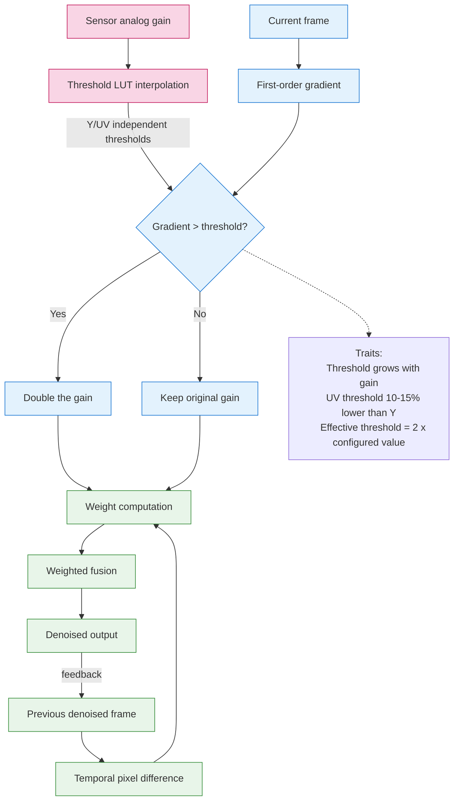

**English | [中文](./3d_nr.md)**

# libxcam 3DNR — Technical Summary

## Table of Contents
- [1. System Architecture](#1-system-architecture)
  - [1.1 Frame Processing Modes](#11-frame-processing-modes)
  - [1.2 Memory Management](#12-memory-management)
  - [1.3 Design Block Diagram](#13-design-block-diagram)
- [2. Core Algorithms](#2-core-algorithms)
  - [2.1 Noise Estimation](#21-noise-estimation)
  - [2.2 Weighted Fusion](#22-weighted-fusion)
  - [2.3 Parameter Reference](#23-parameter-reference)
- [3. IIR Mode Analysis](#3-iir-mode-analysis)
  - [3.1 Implementation Traits](#31-implementation-traits)
  - [3.2 Mode Comparison](#32-mode-comparison)
- [4. Key Optimization Techniques](#4-key-optimization-techniques)
  - [4.1 Compute Optimizations](#41-compute-optimizations)
  - [4.2 Vectorized Processing](#42-vectorized-processing)
- [5. Caveats](#5-caveats)
- [6. Parameter Tuning Suggestions](#6-parameter-tuning-suggestions)

---

# libxcam 3D Noise Reduction — Implementation Summary

## 1. System Architecture
### 1.1 Frame Processing Modes
   - **Backward multi-reference frames** (`REFERENCE_FRAME_COUNT=2`)
   - **IIR recursive mode** (controlled by `ENABLE_IIR_FILERING`)
   - **Separate Y/UV processing**
     - Y channel: luminance processed alone, with a higher threshold (typically 0.02–0.04)
     - UV channels: chroma processed jointly, with a lower threshold (typically 0.015–0.03)
   - **Hardware acceleration** via kernel separation with the `CL_IMAGE_CHANNEL_Y/UV` macros
   - **GPU execution config**: work-groups of 8×1 work-items

### 1.2 Memory Management
   - Reference blocks are expanded to 10×16 (1-pixel horizontal / 4-pixel vertical margin)
     - One extra horizontal pixel for left/right access
     - Four extra vertical pixels to support vectorized loads
   - Sliding-window sampling uses a **reference-block-based** mechanism, avoiding non-local comparison over the whole frame and greatly improving performance.
   - Local shared-memory cache optimization (`__local float4 ref_cache`)


### 1.3 Design Block Diagram



## 2. Core Algorithms
### 2.1 Noise Estimation
- **Gradient computation**
  - First-order differences over the four up/down/left/right neighbors

```math
  \nabla = \frac{1}{4 \times 255} \sum_{i=1}^{4} |I_{center} - I_{neighbor_i}|
```

- **Adaptive adjustment**
```c
// When a strong gradient is detected (possibly a real edge), boost the gain
gain = (gradient.s0 < threshold) ? gain : 2.0f * gain;
```

### 2.2 Weighted Fusion
- **Weight computation**

  - Exponentially decaying weight from pixel differences: weight = exp(-gain * sum of squared channel differences)
  - Larger gain → smaller weight w → weaker influence of the history frame
  - Smaller gain → larger weight w → stronger influence of the history frame
```math
w = \exp(-gain \cdot \sum_{channels}(I_{ref}-I_{curr})^2)
```

- **Edge-protection logic**

  - High-gradient regions (possibly real edges): increase gain → lower history-frame weight → protect edge detail
  - Flat regions (possibly noise): keep gain → normal denoising

- **Normalization**

  - Final output = weighted sum / total weight
```math
I_{out} = \frac{\sum w_i \cdot I_i}{\sum w_i}
```

### 2.3 Parameter Reference

| Parameter | Role | Tuning Advice |
|-------------|---------------------|------------------|
| gain | Controls denoising strength | Larger = stronger denoising |
| threshold | Edge-protection threshold | Adjust with the noise level |
| Block margin | Motion-compensation search range | Affects quality/speed trade-off |

## 3. IIR Mode Analysis
### 3.1 Implementation Traits
 - Uses the previous denoised frame (restoredPrev) as the reference
 - Compile-time macro switching gives zero-overhead mode selection

### 3.2 Mode Comparison
 | Aspect | IIR Mode Advantage | Non-IIR Mode Trait |
 |-------------|---------------------|-------------------|
 | Reference quality | Uses an already-denoised frame | Uses raw frames |
 | Memory access | One fewer frame read | Fixed two frame reads |
 | Best fit | Better in static scenes | More stable in dynamic scenes |

> ⚠️ Note: IIR mode resembles exponential smoothing in the time domain — it works better with strongly correlated consecutive frames, but may cause lag or ghosting under fast motion.


## 4. Key Optimization Techniques
### 4.1 Compute Optimizations
 - Fully unrolled 3×3 neighborhood loops
 - Hardware-accelerated native_exp for the exponential

### 4.2 Vectorized Processing
 - float4 for the RGBA four channels
 - Parallel processing of 8×8 pixel blocks


## 5. Caveats
- IIR mode may leave ghosting under fast motion
- Work-group configuration must be adapted to the specific GPU architecture


## 6. Parameter Tuning Suggestions

| Scene Type | Suggested gain | Suggested threshold | Mode |
|------------------|-------------|------------------|------------|
| Static, low noise | 0.02 | 0.01 | IIR |
| Medium-speed motion | 0.03 | 0.015 | Non-IIR + two reference frames |
| Fast motion + heavy noise | 0.04–0.05 | 0.02–0.03 | Non-IIR + high gain |

> Fix the threshold first, then tune gain according to perceived noise, to reach the desired smoothness.
