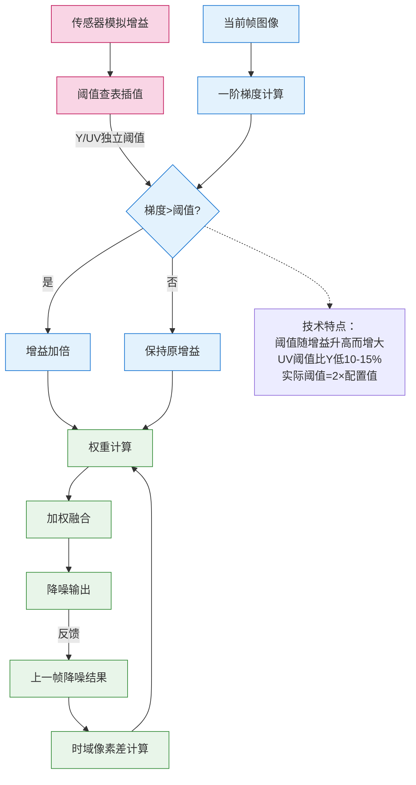

# libxcam 3D 降噪技术总结

## 目录
- [1. 系统架构](#1-系统架构)
  - [1.1 帧处理模式](#11-帧处理模式)
  - [1.2 内存管理](#12-内存管理)
  - [1.3 设计框图](#13-设计框图)
- [2. 核心算法](#2-核心算法)
  - [2.1 噪声估计](#21-噪声估计)
  - [2.2 加权融合](#22-加权融合)
  - [2.3 参数说明](#23-参数说明)
- [3. IIR模式分析](#3-iir模式分析)
  - [3.1 实现特点](#31-实现特点)
  - [3.2 模式对比](#32-模式对比)
- [4. 关键优化技术](#4-关键优化技术)
  - [4.1 计算优化](#41-计算优化)
  - [4.2 向量化处理](#42-向量化处理)
- [5. 注意事项](#5-注意事项)

---

# libxcam 3D降噪技术实现总结

## 1. 系统架构
### 1.1 帧处理模式
   - **后向多参考帧**（`REFERENCE_FRAME_COUNT=2`）
   - **IIR递归模式**（`ENABLE_IIR_FILERING`控制）
   - **Y/UV分离处理**
     - Y通道：单独处理亮度信息，采用较高阈值（典型0.02-0.04）
     - UV通道：联合处理色度信息，采用较低阈值（典型0.015-0.03）
   - **硬件加速** 通过`CL_IMAGE_CHANNEL_Y/UV`宏实现内核分离
   - **GPU执行配置** work-group包含8x1个work-item

### 1.2 内存管理
   - 参考块扩展为10x16（含1像素水平/4像素垂直边界）
     - 水平方向额外扩展1像素用于左右访问
     - 垂直方向扩展4像素以支持向量化载入
   - 滑窗采样采用 **reference-block-based**（参照块）机制，避免在全图范围内执行非局部比较，显著提升性能。
   - 局部共享内存缓存优化（`__local float4 ref_cache`）


### 1.3 设计框图



## 2. 核心算法
### 2.1 噪声估计
- **梯度计算**
  - 计算上、下、左、右四个邻域方向一阶差分法

```math
  \nabla = \frac{1}{4 \times 255} \sum_{i=1}^{4} |I_{center} - I_{neighbor_i}|
```

- **自适应调节**
```c
// 当检测到强梯度（可能为真实边缘）时增强gain值
gain = (gradient.s0 < threshold) ? gain : 2.0f * gain;
```

### 2.2 加权融合
- **权重计算**

  - 基于像素差异的指数衰减权重：权重 = exp(-gain * 像素差平方和)
  - gain值增大 → 权重w减小 → 历史帧影响减弱
  - gain值减小 → 权重w增大 → 历史帧影响增强
```math
w = \exp(-gain \cdot \sum_{channels}(I_{ref}-I_{curr})^2)
```

- **边缘保护逻辑**

  - 高梯度区域（可能为真实边缘）：增大gain → 降低历史帧权重 → 保护边缘细节
  - 平坦区域（可能为噪声）：保持gain → 正常降噪

- **归一化处理**

  - 最终输出 = 加权和 / 总权重
```math
I_{out} = \frac{\sum w_i \cdot I_i}{\sum w_i}
```

### 2.3 参数说明

| 参数名       | 作用                | 调节建议          |
|-------------|---------------------|------------------|
| gain        | 控制降噪强度        | 值越大降噪越强    |
| threshold   | 边缘保护阈值        | 根据噪声水平调整  |
| 边界扩展    | 运动补偿搜索范围    | 影响处理效果/速度 |

## 3. IIR模式分析
### 3.1 实现特点
 - 使用前帧降噪结果restoredPrev作为参考
 - 通过编译宏切换实现零开销模式选择

### 3.2 模式对比
 | 对比项       | IIR模式优势          | 非IIR模式特点      |
 |-------------|---------------------|-------------------|
 | 参考帧质量   | 使用已降噪帧        | 使用原始帧        |
 | 内存访问     | 减少1次帧读取       | 固定2次帧读取     |
 | 适用场景     | 静态场景效果更优    | 动态场景更稳定    |

> ⚠️注意：IIR模式类似于时间域中的指数平滑（Exponential Smoothing），连续帧强相关时效果更好，但在快速运动中可能造成滞后或拖影。


## 4. 关键优化技术
### 4.1 计算优化
 - 完全展开3x3邻域计算循环
 - 使用硬件加速的指数函数native_exp

### 4.2 向量化处理
 - 采用float4处理RGBA四通道
 - 并行处理8x8像素块


## 5. 注意事项
- IIR模式在快速运动场景可能产生残影
- 工作组配置需要适配具体GPU架构


## 6. 参数调优建议

| 场景类型         | gain 建议值 | threshold 建议值 | 模式选择  |
|------------------|-------------|------------------|------------|
| 静态画面，低噪声 | 0.02        | 0.01             | IIR 模式   |
| 中速运动场景     | 0.03        | 0.015            | 非IIR + 双参考帧 |
| 快速运动 + 强噪声| 0.04~0.05   | 0.02~0.03        | 非IIR + 高 gain  |

> 建议先确定 threshold，再根据画面噪声感受调整 gain，以获得理想平滑度。
