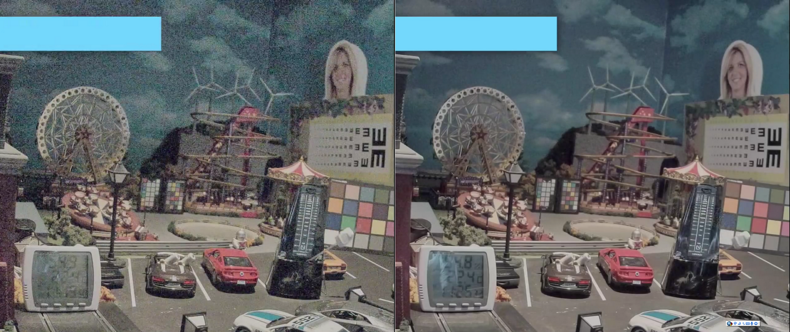

**English | [中文](./README.md)**

# libxcam Noise-Reduction Modules — Overview

## Directory Overview
This directory contains technical documentation for libxcam noise-reduction algorithms, covering both temporal and frequency-domain denoising.

## Module Index

## Reading Guide

| File | Summary | Quick Access |
|---|---|---|
| [3d_nr.en.md](./3d_nr.en.md) | 3DNR algorithm summary | [👉 Read](./3d_nr.en.md) |
| [wavelet_nr.en.md](./wavelet_nr.en.md) | Wavelet denoising summary | [👉 Read](./wavelet_nr.en.md) |

### 1. 3D Temporal Denoising (3DNR)

- **Key features**
  - Multi-reference-frame architecture (supports 2–3 backward reference frames)
  - Separate Y / UV path processing
  - Adaptive IIR recursive filtering (configurable on/off)
  - Gradient-based motion detection & compensation
  - Sensor-gain adaptive adjustment

- **Target scenarios**
  - Real-time video processing (2K@30fps)
  - Low-light video denoising

### 2. Wavelet-Domain Denoising (WaveletNR)

- **Key features**
  - Multi-scale wavelet decomposition (Haar wavelet basis)
  - Bayes-estimation-based noise thresholds
  - Adaptive threshold shrinkage in the frequency domain
  - Non-linear filtering

- **Best scenarios**
  - Single-frame RAW denoising
  - High-ISO image quality enhancement
