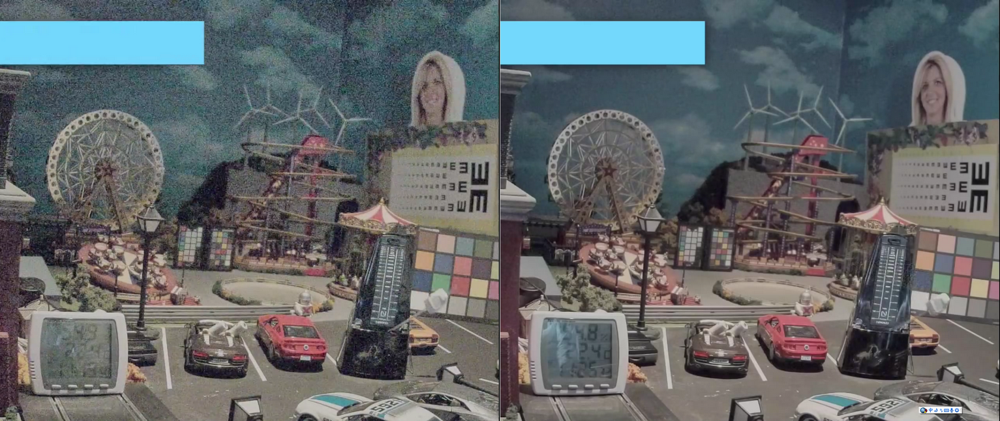

# libxcam 图像降噪算法模块说明

## 目录概述
本目录包含 libxcam 图像降噪算法技术文档，涵盖时域和频域降噪方案。

## 模块索引

## 阅读导引

| 文件 | 内容摘要 | 快速访问 |
|---|---|---|
| [3d_nr.md](./3d_nr.md) | 3D 降噪算法总结 | [👉 阅读](./3d_nr.md) |
| [wavelet_nr.md](./wavelet_nr.md) | 小波降噪算法总结 | [👉 阅读](./wavelet_nr.md) |

### 1. 3D时域降噪 （3DNR）

- **核心特性**
  - 多参考帧架构（支持2-3帧后向参考）
  - Y/UV通道分离处理
  - 自适应IIR递归滤波 （可配置开关）
  - 基于梯度检测的运动补偿
  - 传感器增益自适应调节

- **适用场景**
  - 实时视频处理（2K@30fps）
  - 低光照环境视频降噪

### 2. 小波域降噪 （WaveletNR）

- **核心特性**
  - 多尺度小波分解（HAAR小波基）
  - 基于贝叶斯估计的噪声阈值
  - 频域自适应阈值收缩
  - 非线性滤波处理

- **最佳场景**
  - 单帧RAW图像降噪
  - 高ISO图像质量增强
