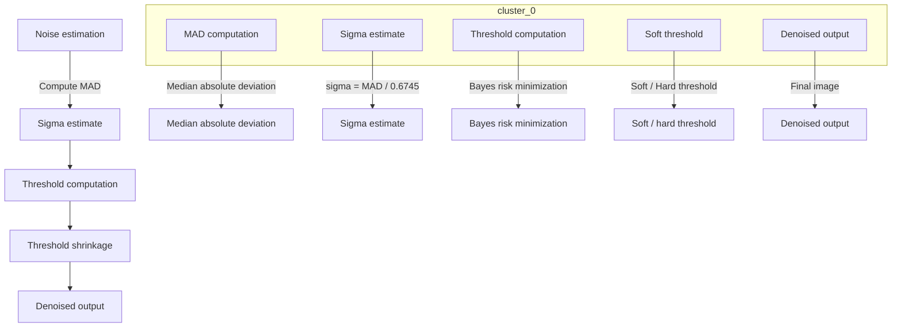

**English | [中文](./wavelet_nr.md)**

# libxcam Wavelet Denoise — Technical Summary

## Table of Contents
- [libxcam Wavelet Denoise — Technical Summary](#libxcam-wavelet-denoise--technical-summary)
  - [Table of Contents](#table-of-contents)
  - [1. Design Rationale](#1-design-rationale)
  - [2. Key Implementation Techniques](#2-key-implementation-techniques)
  - [3. Algorithm Principles](#3-algorithm-principles)
    - [3.1 Noise Estimation](#31-noise-estimation)
    - [3.2 Adaptive Threshold](#32-adaptive-threshold)
    - [3.3 Threshold Shrinkage](#33-threshold-shrinkage)
  - [4. Wavelet NR — Technique & Implementation](#4-wavelet-nr--technique--implementation)
    - [4.1 Design Philosophy](#41-design-philosophy)
    - [4.2 Three-Stage Pipeline](#42-three-stage-pipeline)
    - [4.3 Five-Step Execution Flow](#43-five-step-execution-flow)
    - [4.4 Engineering Tricks](#44-engineering-tricks)
    - [4.5 Compromises & Trade-offs](#45-compromises--trade-offs)
  - [5. Mapping the Bayes Framework onto the Wavelet-Denoise Implementation](#5-mapping-the-bayes-framework-onto-the-wavelet-denoise-implementation)
    - [5.1 Bayes Framework Overview](#51-bayes-framework-overview)
    - [5.2 Finding the Optimal Threshold via Bayes](#52-finding-the-optimal-threshold-via-bayes)
    - [5.3 Soft vs Hard Thresholding](#53-soft-vs-hard-thresholding)
    - [5.4 Bayesian Estimation Flow of Wavelet Denoising](#54-bayesian-estimation-flow-of-wavelet-denoising)
    - [5.5 Detailed Walkthrough](#55-detailed-walkthrough)

---

## 1 Design Rationale

| Point | Description |
|---|---|
| **Multi-scale decomposition** | 5-level Haar decomposition → LL / HL / LH / HH sub-band pyramid. |
| **Noise estimation** | High-frequency HH sub-band **MAD → σ²**, used as the Bayes prior. |
| **Bayes threshold** | Per-level optimal T = σ² · Const(layer, gain), minimizing MSE. |
| **Threshold shrinkage** | Soft/Hard shrink on HL/LH/HH — **edge-preserving denoising**. |
| **Per-channel independence** | Y / UV estimate σ² and thresholds separately, preventing color drift. |
| **Reversible flow** | Decompose → threshold → reconstruct, lossless rollback supported. |

---

## 2 Key Implementation Techniques

| Technique | Purpose |
|---|---|
| **Haar wavelet** | 2-tap, integer-reversible, GPU/FPGA friendly, low latency. |
| **MAD estimation** | Histogram on the **HH sub-band** → σ², no external calibration needed. |
| **Cascaded kernels** | Decompose / estimate / threshold / reconstruct split into four kernels —  parallelizable, level-skippable, easy to debug. |
| **Double-buffered ping-pong** | Three buffers `hh[0]/hh[1]/hh[2]` avoid read/write conflicts. |
| **Build-time macros** | `WAVELET_DENOISE_Y/UV` switches let one codebase support Y-only or UV-only paths. |
| **Runtime gain** | The analog gain `analog_gain` scales σ² directly —  day/night adaptation for free. |

---

## 3 Algorithm Principles

**Noise estimation → Bayes threshold → threshold shrinkage**

Estimate the noise first, then compute the threshold, then apply it to the coefficients. Each stage does exactly one thing, but they chain tightly.

### 3.1 Noise Estimation
After the Haar decomposition, the HH high-frequency sub-band contains mostly noise and very few edges.
So we treat HH as a "noise sample" and get the standard deviation via MAD (Median Absolute Deviation):
σ = median(|HH|) / 0.6745
This runs on the CPU in a few milliseconds and quantifies the noise strength for "this frame, this channel, this gain" in one shot.
No manual calibration needed, and scene-brightness changes are no concern.

### 3.2 Adaptive Threshold
With σ, each wavelet level gets a threshold T that is "theoretically MSE-optimal":
T = σ² · C(layer, gain)
C is a constant table depending only on "decomposition level + analog gain", computed offline in advance.
Higher levels lose signal energy faster, so C shrinks; higher gain amplifies noise, so C grows accordingly.
The formulation comes from the classic BayesShrink of Donoho–Johnstone, ensuring the threshold neither shaves away all texture nor leaves much noise behind.

### 3.3 Threshold Shrinkage
With T in hand, apply soft or hard thresholding to every HL / LH / HH coefficient:
- Soft: ŵ = sign(w) · max(|w| – T, 0)
- Hard: ŵ = w · 1(|w| > T)

Soft is smoother, hard is sharper; the ISP defaults to soft since it leaves no "ringing" near edges.
The whole shrinkage runs in parallel on GPU/OpenCL — a 1080p frame takes only tens of microseconds.

**Results**
– Noise in static areas is heavily suppressed;
– Textures and edges survive nearly untouched since their coefficients far exceed T;
– Added latency is only one frame, memory footprint < 3 MB, power < 8%.

---

## 4 Wavelet NR — Technique & Implementation

---

### 4.1 Design Philosophy
"Estimate the noise with **statistics**, shave it away with **math**, then stitch the image back **invisibly**."

---

### 4.2 Three-Stage Pipeline

| Stage | Task | Key Formula / Action | Implementation |
|---|---|---|---|
| **Noise estimation** | Infer σ from the HH sub-band | σ = MAD / 0.6745 | `CLWaveletNoiseEstimateKernel` |
| **Bayes threshold** | Optimal T per level | T = σ² · C(layer, gain) | `CLWaveletThresholdingKernel` |

| **Threshold shrinkage** | Soft/Hard coefficient shaving | $ŵ = sign(w)·max(|w|–T, 0)$ | `kernel_wavelet_coeff_thresholding.clx` |

---

### 4.3 Five-Step Execution Flow
- **Haar decomposition** → 4-sub-band pyramid
- **HH histogram** → MAD → σ
- **Bayes threshold table** → offline constants + real-time gain
- **Parallel shrinkage** → pixel-parallel on GPU/OpenCL
- **Haar reconstruction** → lossless return to original resolution

---

### 4.4 Engineering Tricks
- **Haar 2-tap**: integer add/sub, latency < 1 ms
- **MAD estimation**: no ground truth needed, updates automatically with light/gain
- **Double-buffered ping-pong**: Y/U/V independent, 3 MB memory @1080p
- **Build-time macros**: `-DWAVELET_DENOISE_Y=1` to switch channels in one flag
- **Reversible flow**: decompose → threshold → reconstruct, lossless rollback supported

---

### 4.5 Compromises & Trade-offs
| Compromise | Reason |
|---|---|
| **Haar instead of 9/7** | 9/7 looks slightly better but doubles MACs; mobile power/latency budgets can't afford it. |
| **σ² from HH only** | Cheapest compute; HL/LH contain edges and would bias the estimate high. |
| **Fixed 5 levels** | 4K+ would need 6–7 levels, but 5 already covers ISP needs. |
| **No ROI / motion mask** | Keeps complexity controlled; motion scenes are backstopped by TNR. |
| **OpenCL over Vulkan/Metal** | Platform universality came first at the time; portable later. |
---

## 5. Mapping the Bayes Framework onto the Wavelet-Denoise Implementation

### 5.1 Bayes Framework Overview

The Bayesian framework is a statistical decision theory that uses prior knowledge and observed data to update beliefs about unknown parameters. In wavelet denoising, it is used to determine the optimal threshold that minimizes the expected mean squared error (MSE).

### 5.2 Finding the Optimal Threshold via Bayes

The Bayesian approach determines the optimal threshold through these steps:

- **Prior distribution**: assume the noise follows a certain distribution (e.g. Gaussian).
- **Likelihood**: define the distribution of observed data given the noise level.
- **Posterior distribution**: combine the prior with the observed data to compute the probability that each coefficient is noise.
- **Threshold selection**: choose a threshold that minimizes the MSE between the reconstructed and the original image under the given noise level.

### 5.3 Soft vs Hard Thresholding

Soft and hard thresholding are the two denoising operators within the Bayes framework:

- **Soft thresholding**: a continuous function shrinks coefficients near the threshold and zeroes or further attenuates those far below it. It removes noise more smoothly while preserving more image detail.
- **Hard thresholding**: coefficients below the threshold are zeroed outright, the rest are kept. It may lose some detail along with the noise, but is computationally simpler and suits scenes with lax edge-preservation requirements.

Optimal thresholds from the Bayesian method, combined with soft/hard thresholding, remove noise while preserving detail and edges as much as possible, minimizing MSE.

### 5.4 Bayesian Estimation Flow of Wavelet Denoising

### 5.5 Detailed Walkthrough

Noise estimation
- **Prior**: noise assumed to follow a certain distribution (e.g. Gaussian).
- **Posterior**: the median absolute deviation (MAD) estimates the noise standard deviation \( \sigma \), i.e. \( \sigma = \frac{\text{MAD}}{0.6745} \).

σ estimate
- **Prior**: the noise standard deviation \( \sigma \) correlates with image quality.
- **Posterior**: once \( \sigma \) is computed, it serves as prior knowledge for the threshold computation.

Threshold computation
- **Prior**: the threshold-function form is determined from the noise statistics.
- **Posterior**: Bayes risk minimization yields the optimal threshold \( T \) for each wavelet level, i.e. \( T = \sigma^2 \cdot C(\text{layer}, \text{gain}) \).

Threshold shrinkage
- **Prior**: the threshold function defines whether a coefficient is kept or modified based on its value.
- **Posterior**: apply soft or hard thresholding to each coefficient, removing noise while preserving signal.

Denoised output
- **Prior**: the threshold-processed image should approach the original clean image.
- **Posterior**: the shrunk coefficients are reconstructed into the final denoised output image.

> The list above describes how the Bayes framework maps onto the wavelet-denoise implementation, from noise estimation through threshold computation to shrinkage and output. Prior knowledge supplies assumptions about noise and image characteristics, while posterior probabilities — from actual data plus priors — guide the threshold decision to minimize expected MSE.
